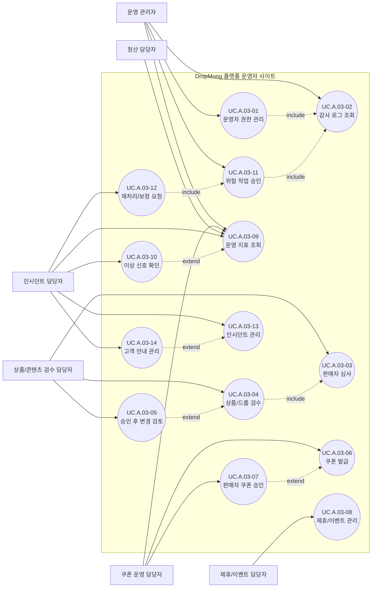

# 플랫폼 운영 사용자 목표

## 기본 정보

- UC ID: `UC.A.03`
- 사용자: 운영 관리자, 상품/콘텐츠 검수 담당자, 제휴/이벤트 담당자, 쿠폰 운영 담당자, 정산 담당자, 인시던트 담당자
- 기준 페이지: 플랫폼 운영자 사이트 페이지 예정
- 기준 기능: 운영자 권한 관리, 감사 로그 조회, 판매자 심사, 상품/드롭 검수, 승인 후 변경 검토, 쿠폰 발급, 판매자 쿠폰 승인, 제휴/이벤트 관리, 운영 지표 조회, 이상 신호 확인, 위험 작업 승인, 재처리/보정 요청, 인시던트 관리, 고객 안내 관리
- 제외 범위: 구매자 화면 조작, 판매자 셀프서비스 업무, 외부 PG 승인 처리, 물류 실행, 회계 확정

## 연관 태그

- 🏷️ 플로우 참조: FLOW.A.03
- 🏷️ 요구사항 참조: [REQ.A.04](../00-requirements/REQ_A_04_platform_operator_admin.md), [REQ.A.03](../00-requirements/REQ_A_03_seller.md), [REQ.A.02](../00-requirements/REQ_A_02_coupon_benefit.md)
- 🏷️ 페이지 참조: 플랫폼 운영자 사이트 페이지 예정
- 🏷️ UI 참조: UI.A.03 예정
- 🏷️ 영속성 참조: PST.A.03
- 🏷️ 서비스 참조: SVC.A.03
- 🏷️ 시나리오 참조: SCN.A.03
- 🏷️ API 참조: API.A.03

## 유스케이스

## 사용자 목표

| UC ID | 액터 | 사용자 목표 | 설명 | 연결 요구사항 |
| --- | --- | --- | --- | --- |
| `UC.A.03-01` | 운영 관리자 | 운영자 권한 관리 | 운영자 계정, 역할, 접근 가능한 메뉴와 작업 범위를 관리한다. | `REQ.A.04.FR-001`, `REQ.A.04.NFR-001` |
| `UC.A.03-02` | 운영 관리자 | 감사 로그 조회 | 운영자 작업, 위험 작업, 승인 이력을 확인한다. | `REQ.A.04.NFR-003` |
| `UC.A.03-03` | 상품/콘텐츠 검수 담당자 | 판매자 심사 | 판매자 신청, 유형, 인증 정보, 위험 신호를 검토한다. | `REQ.A.04.FR-003`, `REQ.A.04.FR-004` |
| `UC.A.03-04` | 상품/콘텐츠 검수 담당자 | 상품/드롭 검수 | 상품 정보와 드롭 조건을 승인, 반려, 보류 기준으로 검토한다. | `REQ.A.04.FR-005`, `REQ.A.04.FR-006` |
| `UC.A.03-05` | 상품/콘텐츠 검수 담당자 | 승인 후 변경 검토 | 승인된 드롭의 핵심 조건 변경 요청을 검토한다. | `REQ.A.04.FR-006` |
| `UC.A.03-06` | 쿠폰 운영 담당자 | 쿠폰 발급 | 플랫폼 쿠폰 또는 보상 쿠폰의 대상, 수량, 비용 부담을 설정한다. | `REQ.A.04.FR-026`, `REQ.A.04.NFR-022` |
| `UC.A.03-07` | 쿠폰 운영 담당자 | 판매자 쿠폰 승인 | 판매자가 등록한 쿠폰을 승인하거나 반려한다. | `REQ.A.04.FR-027`, `REQ.A.04.NFR-024` |
| `UC.A.03-08` | 제휴/이벤트 담당자 | 제휴/이벤트 관리 | 제휴 드롭, 제휴 쿠폰, 노출 위치, 참여 조건을 관리한다. | `REQ.A.04.FR-008`, `REQ.A.04.FR-021`, `REQ.A.04.FR-028` |
| `UC.A.03-09` | 운영 관리자, 쿠폰 운영 담당자, 정산 담당자, 인시던트 담당자 | 운영 지표 조회 | 드롭, 판매자, 쿠폰, 결제, 주문, 알림 기준의 운영 지표를 확인한다. | `REQ.A.04.FR-012`, `REQ.A.04.FR-013` |
| `UC.A.03-10` | 인시던트 담당자 | 이상 신호 확인 | 주문 실패, 결제 실패, 쿠폰 실패, 재고 불일치, 알림 지연을 확인한다. | `REQ.A.04.FR-013` |
| `UC.A.03-11` | 운영 관리자 | 위험 작업 승인 | 드롭 비공개, 공지, 보정, 재처리 같은 위험 작업을 승인한다. | `REQ.A.04.FR-022` |
| `UC.A.03-12` | 인시던트 담당자 | 재처리/보정 요청 | 장애 또는 운영 이슈와 연결된 재처리/보정 작업을 요청한다. | `REQ.A.04.FR-023` |
| `UC.A.03-13` | 인시던트 담당자 | 인시던트 관리 | 장애 심각도, 영향 범위, 담당자, 조치 상태를 관리한다. | `REQ.A.04.FR-016`, `REQ.A.04.FR-017` |
| `UC.A.03-14` | 인시던트 담당자 | 고객 안내 관리 | 인시던트 또는 운영 이슈에 대한 공지와 고객 안내 상태를 관리한다. | `REQ.A.04.FR-015`, `REQ.A.04.NFR-016` |
