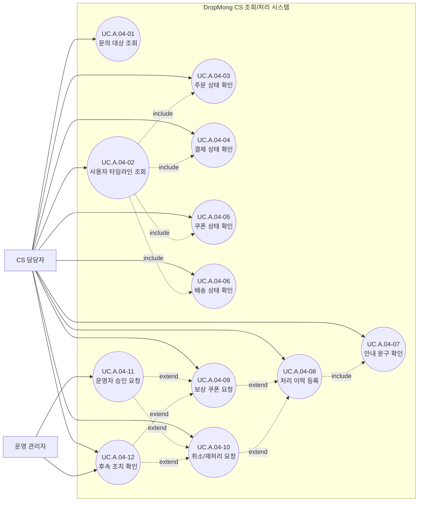

# CS 주문 및 쿠폰 지원 사용자 목표

## 기본 정보

- UC ID: `UC.A.04`
- 사용자: CS 담당자, 운영 관리자
- 기준 페이지: 플랫폼 운영자 사이트의 CS 조회/처리 화면 예정
- 기준 기능: 문의 대상 조회, 사용자 타임라인 조회, 주문 상태 확인, 결제 상태 확인, 쿠폰 상태 확인, 배송 상태 확인, 안내 문구 확인, 처리 이력 등록, 보상 쿠폰 요청, 취소/재처리 요청, 운영자 승인 요청, 후속 조치 확인
- 제외 범위: 구매자 직접 UI, 판매자 셀프서비스, 강제 결제 승인, 임의 DB 수정, 최종 보상 정책 확정

## 연관 태그

- 🏷️ 플로우 참조: FLOW.A.04
- 🏷️ 요구사항 참조: [REQ.A.01](../00-requirements/REQ_A_01_limited_drop_commerce.md), [REQ.A.02](../00-requirements/REQ_A_02_coupon_benefit.md), [REQ.A.04](../00-requirements/REQ_A_04_platform_operator_admin.md)
- 🏷️ 페이지 참조: 플랫폼 운영자 CS 화면 예정, [PAGE.A.15](../10-sitemap/buyer-mobile-web/PAGE_A_15_order_history.md), [PAGE.A.16](../10-sitemap/buyer-mobile-web/PAGE_A_16_track_order.md), [PAGE.A.17](../10-sitemap/buyer-mobile-web/PAGE_A_17_shipping_order_manage.md)
- 🏷️ UI 참조: UI.A.04 예정
- 🏷️ 영속성 참조: PST.A.04
- 🏷️ 서비스 참조: SVC.A.04
- 🏷️ 시나리오 참조: SCN.A.04
- 🏷️ API 참조: API.A.04

## 유스케이스

## 사용자 목표

| UC ID | 액터 | 사용자 목표 | 설명 | 연결 요구사항 |
| --- | --- | --- | --- | --- |
| `UC.A.04-01` | CS 담당자 | 문의 대상 조회 | 주문번호, 사용자 ID, 문의 ID 중 하나로 문의 대상을 찾는다. | `REQ.A.04.FR-009`, `REQ.A.04.NFR-013` |
| `UC.A.04-02` | CS 담당자 | 사용자 타임라인 조회 | 알림, 구매 시도, 재고 배정, 주문, 결제, 쿠폰, 배송 이벤트를 확인한다. | `REQ.A.01.FR-018`, `REQ.A.02.FR-017` |
| `UC.A.04-03` | CS 담당자 | 주문 상태 확인 | 주문 생성, 주문 성공, 주문 실패, 취소 가능 여부를 확인한다. | `REQ.A.01.FR-018` |
| `UC.A.04-04` | CS 담당자 | 결제 상태 확인 | 결제 승인, 실패, 지연, 재시도 필요 여부를 확인한다. | `REQ.A.01.NFR-004` |
| `UC.A.04-05` | CS 담당자 | 쿠폰 상태 확인 | 쿠폰 발급, 적용, 사용 확정, 회수 상태를 확인한다. | `REQ.A.02.FR-017` |
| `UC.A.04-06` | CS 담당자 | 배송 상태 확인 | 배송 준비, 출고, 배송 중, 배송 완료 상태를 확인한다. | `REQ.A.01.FR-014` |
| `UC.A.04-07` | CS 담당자 | 안내 문구 확인 | 문의 유형과 상태에 맞는 고객 안내 문구를 찾는다. | `REQ.A.04.FR-019` |
| `UC.A.04-08` | CS 담당자 | 처리 이력 등록 | 안내 내용, 문의 유형, 후속 조치 상태를 처리 이력으로 남긴다. | `REQ.A.04.FR-020` |
| `UC.A.04-09` | CS 담당자 | 보상 쿠폰 요청 | 보상이 필요한 문의에 대해 보상 쿠폰 발급을 요청한다. | `REQ.A.04.FR-011` |
| `UC.A.04-10` | CS 담당자 | 취소/재처리 요청 | 주문, 결제, 쿠폰, 배송 상태의 취소 또는 재처리를 요청한다. | `REQ.A.04.FR-023` |
| `UC.A.04-11` | 운영 관리자 | 운영자 승인 요청 | CS 권한을 벗어난 보상, 취소, 재처리 요청을 승인 또는 반려한다. | `REQ.A.04.FR-011`, `REQ.A.04.FR-023` |
| `UC.A.04-12` | CS 담당자, 운영 관리자 | 후속 조치 확인 | 요청한 보상, 취소, 재처리, 승인 상태와 결과를 확인한다. | `REQ.A.04.NFR-011`, `REQ.A.04.NFR-017` |
