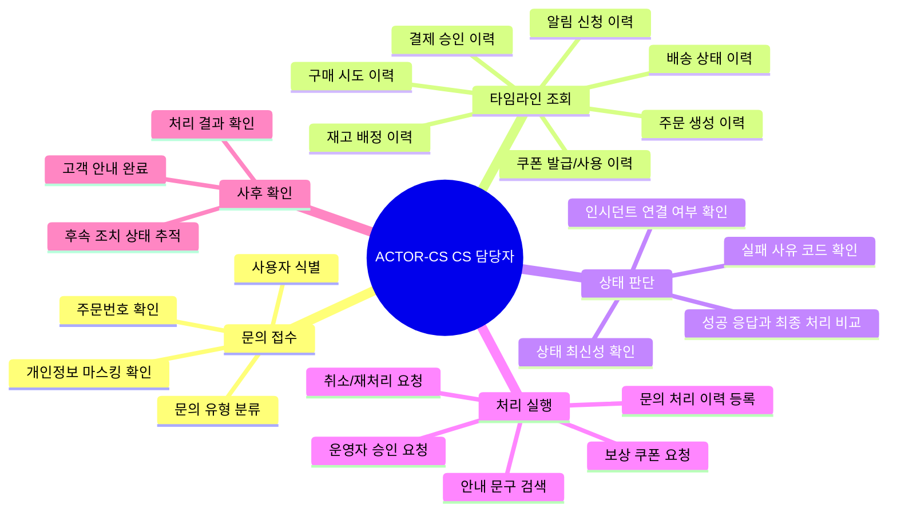

# CS 담당자는 주문과 쿠폰 문의를 근거 기반으로 처리한다

## 기본 정보

- UC ID: `UC.A.04`
- 사용자: CS 담당자, 운영 관리자
- 기준 페이지: 플랫폼 운영자 사이트의 CS 조회/처리 화면 예정
- 기준 기능: 사용자 타임라인 조회, 주문/결제/쿠폰/재고/배송 상태 확인, 안내 문구 검색, 보상/취소/재처리 요청, 처리 이력 등록
- 제외 범위: 구매자 직접 UI, 판매자 셀프서비스, 강제 결제 승인, 임의 DB 수정, 최종 보상 정책 확정

## 연관 태그

🏷️ 플로우 참조: FLOW.A.04 | 요구사항 참조: [REQ.A.01](../00-requirements/REQ_A_01_limited_drop_commerce.md), [REQ.A.02](../00-requirements/REQ_A_02_coupon_benefit.md), [REQ.A.04](../00-requirements/REQ_A_04_platform_operator_admin.md) | 페이지 참조: 플랫폼 운영자 CS 화면 예정, [PAGE.A.15](../10-sitemap/PAGE_A_15_order_history.md), [PAGE.A.16](../10-sitemap/PAGE_A_16_track_order.md), [PAGE.A.17](../10-sitemap/PAGE_A_17_shipping_order_manage.md) | UI 참조: UI.A.04 예정 | 영속성 참조: PST.A.04 | 서비스 참조: SVC.A.04 | 시나리오 참조: SCN.A.04 | API 참조: API.A.04

## 유스케이스

## 사전 조건

- CS 담당자는 운영자 사이트 접근 권한을 가진다.
- 사용자, 주문, 결제, 쿠폰, 재고, 배송, 알림 이벤트를 조회할 수 있는 타임라인이 있다.
- 개인정보와 결제 민감 정보는 기본적으로 마스킹된다.
- 보상, 취소, 재처리 같은 위험 작업은 직접 실행 또는 승인 요청 범위가 권한으로 제한된다.

## 기본 흐름

| 순서 | 사용자 행동 | 시스템 응답 | 연결 요구사항 |
| --- | --- | --- | --- |
| 1 | CS 담당자가 주문번호, 사용자 ID, 문의 ID 중 하나로 문의 대상을 조회한다. | 주문, 사용자, 쿠폰, 배송 상태 요약과 개인정보 마스킹 상태를 표시한다. | `REQ.A.04.FR-009`, `REQ.A.04.NFR-013` |
| 2 | CS 담당자가 사용자 타임라인을 확인한다. | 알림 신청, 구매 시도, 재고 배정, 주문, 결제, 쿠폰, 배송 이벤트를 시간순으로 표시한다. | `REQ.A.01.FR-018`, `REQ.A.02.FR-017` |
| 3 | CS 담당자가 성공 응답과 최종 처리 성공 여부를 비교한다. | API 성공, 비동기 처리, 최종 실패, 재처리 대상 여부를 구분해 보여준다. | `REQ.A.01.NFR-004`, `REQ.A.02.NFR-011` |
| 4 | CS 담당자가 실패 사유와 안내 문구를 확인한다. | 정책 문서, 예외 처리 기준, 문의 매크로, 과거 처리 사례를 검색한다. | `REQ.A.04.FR-019` |
| 5 | CS 담당자가 고객 안내와 처리 이력을 등록한다. | 담당자, 안내 내용, 문의 유형, 후속 조치 상태를 저장한다. | `REQ.A.04.FR-020` |
| 6 | 보상 또는 재처리가 필요하면 요청을 등록한다. | 고유 요청 ID와 멱등키를 가진 보상/재처리 요청을 만들고 승인 필요 여부를 표시한다. | `REQ.A.04.FR-011`, `REQ.A.04.FR-023` |
| 7 | CS 담당자가 처리 결과를 확인한다. | 처리 완료, 보류, 승인 대기, 실패 상태와 고객 안내 필요 여부를 표시한다. | `REQ.A.04.NFR-011`, `REQ.A.04.NFR-017` |

## 예외 흐름

| 상황 | 처리 |
| --- | --- |
| 문의 대상 주문이 존재하지 않거나 사용자 소유가 아니다. | 조회를 차단하고 권한/식별 오류를 표시한다. |
| 도메인 상태 간 최신성이 다르다. | source service, last synced at, stale 여부를 함께 표시한다. |
| CS 권한으로 실행할 수 없는 보상 또는 취소다. | 운영 관리자 승인 요청으로 전환한다. |
| 인시던트와 연결된 문의다. | 인시던트 안내 문구와 공지 상태를 함께 표시한다. |
| 이벤트 타임라인 일부가 누락됐다. | 누락 가능성과 재조회 또는 로그 확인 요청 경로를 표시한다. |

## 사용자에게 보이는 결과

- CS 담당자는 구매자가 왜 실패했는지, 무엇이 성공했는지, 어떤 후속 조치가 가능한지 설명할 수 있다.
- CS 담당자는 쿠폰 발급, 주문 적용, 사용 확정, 회수 상태를 주문 상태와 함께 확인한다.
- CS 담당자는 고객 안내와 후속 조치를 처리 이력으로 남긴다.
- CS 담당자는 권한을 벗어난 보상/취소/재처리를 승인 요청으로 넘긴다.

## 사용자가 처리해야 하는 상황

- 구매 성공처럼 보였지만 최종 주문/쿠폰/결제 처리가 실패한 문의를 구분해야 한다.
- 결제 실패, 품절, 쿠폰 적용 불가, 배송 지연, 주문 취소 가능 여부를 상태별로 안내해야 한다.
- 인시던트 중 고객 안내 문구와 보상 기준을 일관되게 사용해야 한다.
- 개인정보 노출 범위와 감사 로그를 지키면서 문의를 처리해야 한다.

## 인수 조건

- CS 담당자는 사용자 단위로 알림 신청, 구매 시도, 재고 배정, 주문, 결제, 쿠폰, 배송 이력을 시간순으로 확인할 수 있다.
- 각 상태는 데이터 출처와 마지막 갱신 시각을 표시한다.
- CS 조회 화면은 결제수단 원문, 인증 정보 같은 불필요한 민감 정보를 표시하지 않는다.
- 보상, 취소, 재처리 요청은 요청자, 사유, 대상, 승인 상태, 결과가 감사 로그에 남는다.
- 같은 재처리 요청을 반복해도 중복 쿠폰, 중복 취소, 중복 이벤트가 발생하지 않는다.
- 처리 이력은 문의 ID와 주문/사용자/인시던트 중 필요한 근거와 연결된다.

## 확인 필요

- CS 담당자의 보상 쿠폰 직접 발급 가능 범위
- 주문 취소, 결제 취소, 쿠폰 회수 요청의 승인선
- CS 조회 화면에서 표시할 개인정보 최소 범위
- 사용자 타임라인의 원천 이벤트와 보관 기간
- 문의 유형과 안내 매크로의 초기 분류 체계
