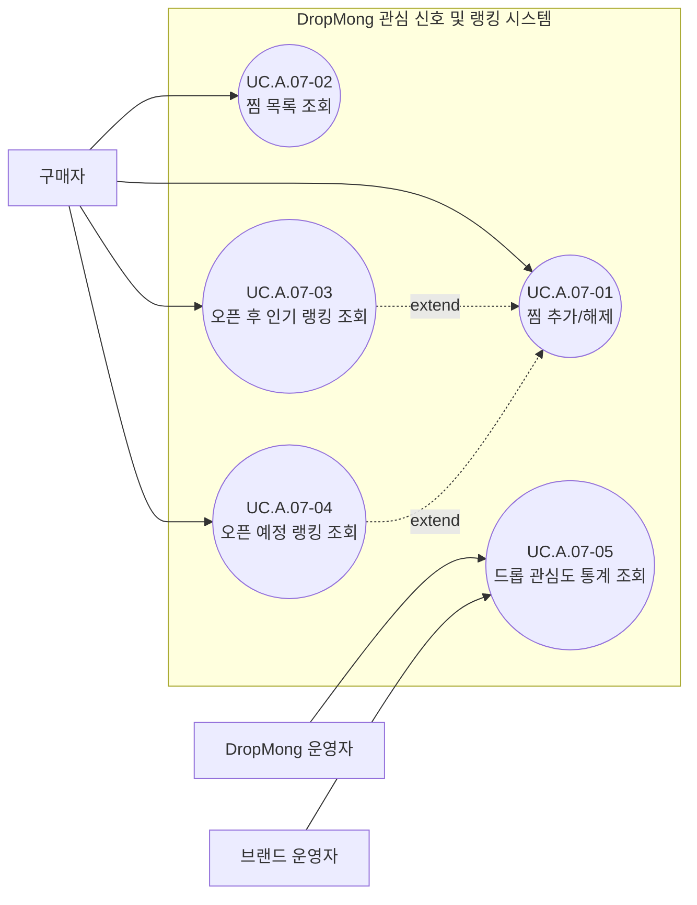

# 관심 신호 및 인기 랭킹 사용자 목표

## 기본 정보

- UC ID: `UC.A.07`
- 사용자: 구매자, DropMong 운영자, 브랜드 운영자
- 기준 페이지: [PAGE.A.01 홈 화면](../10-sitemap/buyer-mobile-web/PAGE_A_01_homepage.md), PAGE.A.09 실시간 랭킹(문서 예정), [PAGE.A.02 상품 상세](../10-sitemap/buyer-mobile-web/PAGE_A_02_product_detail.md), [PAGE.A.10 마이](../10-sitemap/buyer-mobile-web/PAGE_A_10_my.md), [PAGE.A.22 찜리스트](../10-sitemap/buyer-mobile-web/PAGE_A_22_wishlist.md)
- 기준 기능: 찜 추가/해제, 찜 목록 조회, 오픈 후 인기 랭킹 조회, 오픈 예정 랭킹 조회, 드롭 관심도 통계 조회
- 제외 범위: 알림 신청(구독) 기능, 실제 알림 발송, 비로그인 사용자 조회수 집계, 검색/개인화 추천, 조회수 중복 방지 로직 자체(시스템 내부 처리)

## 연관 태그

- 🏷️ 플로우 참조: FLOW.A.07
- 🏷️ 요구사항 참조: [REQ.A.07](../00-requirements/REQ_A_07_interest_ranking.md)
- 🏷️ 페이지 참조: [PAGE.A.01](../10-sitemap/buyer-mobile-web/PAGE_A_01_homepage.md), PAGE.A.09(문서 예정), [PAGE.A.02](../10-sitemap/buyer-mobile-web/PAGE_A_02_product_detail.md), [PAGE.A.10](../10-sitemap/buyer-mobile-web/PAGE_A_10_my.md), [PAGE.A.22](../10-sitemap/buyer-mobile-web/PAGE_A_22_wishlist.md)
- 🏷️ UI 참조: [UI.A.01](../20-ui/buyer-mobile-web/UI_A_01_homepage.md), UI.A.09(문서 예정), [UI.A.02](../20-ui/buyer-mobile-web/UI_A_02_product_detail.md), [UI.A.10](../20-ui/buyer-mobile-web/UI_A_10_my.md), [UI.A.22](../20-ui/buyer-mobile-web/UI_A_22_wishlist.md)
- 🏷️ 도메인 참조: [SD.A.0710](../50-service-design/A_07_interest_ranking/A_07_10-domain-model/SD_A_0710_interest_domain_model.md)
- 🏷️ 영속성 참조: SD.A.0720 예정
- 🏷️ 서비스 참조: SD.A.0730 예정
- 🏷️ 시나리오 참조: SCN.A.07 예정
- 🏷️ API 참조: SD.A.0740 예정

## 유스케이스

## 사용자 목표

| UC ID | 액터 | 사용자 목표 | 설명 | 연결 요구사항 |
| --- | --- | --- | --- | --- |
| `UC.A.07-01` | 구매자 | 찜 추가/해제 | 드롭 상세, 랭킹 카드 등에서 찜 버튼을 눌러 관심 드롭을 추가하거나 해제한다. | `REQ.A.07.FR-001`, `REQ.A.07.FR-009` |
| `UC.A.07-02` | 구매자 | 찜 목록 조회 | 마이페이지 찜리스트에서 내가 찜한 드롭 목록을 확인한다. | `REQ.A.07.FR-002` |
| `UC.A.07-03` | 구매자 | 오픈 후 인기 랭킹 조회 | 현재 판매 중(`OPEN`)인 드롭 중 소진 속도가 빠른 순으로 정렬된 랭킹을 확인한다. | `REQ.A.07.FR-005` |
| `UC.A.07-04` | 구매자 | 오픈 예정 랭킹 조회 | 아직 오픈하지 않은(`SCHEDULED`) 드롭 중 당일 찜/조회 누적이 많은 순으로 정렬된 랭킹을 확인한다. | `REQ.A.07.FR-003` |
| `UC.A.07-05` | DropMong 운영자, 브랜드 운영자 | 드롭 관심도 통계 조회 | 드롭별 찜 수, 조회수 통계를 조회해 운영 판단이나 자사 드롭 반응 확인에 사용한다. | `REQ.A.07.FR-008` |

## 상태/결과 메모

- 조회수 중복 방지(`FR-004`), 드롭 상태 전환에 따른 랭킹 리스트 전환(`FR-006`), 비로그인 조회 제외(`FR-007`), 찜 상태/랭킹 카운트 정합성 분리(`FR-010`)는 사용자 행위가 아니라 시스템 내부 처리이므로 유스케이스 노드로 만들지 않는다. 각 UC가 보여주는 결과 데이터의 신뢰성을 뒷받침하는 전제로만 다룬다.
- 오픈 후(`UC.A.07-03`)와 오픈 예정(`UC.A.07-04`) 랭킹 조회는 화면 구성과 정렬 기준(소진 속도 vs 당일 누적)이 서로 달라 별도 유스케이스로 분리했다. 두 화면 모두 카드 단위로 찜 토글(`UC.A.07-01`)을 조건부로 포함하므로 `extend` 관계로 연결한다.
- 참고 화면(레퍼런스 스크린샷)의 오픈 예정 카드에 있던 알림 신청(벨) 아이콘은 목업 표현일 뿐이며, `REQ.A.07`의 제외 범위(알림 신청 기능)에 따라 이번 유스케이스에는 반영하지 않는다. 카드의 사용자 액션은 찜 토글 하나로만 처리한다.
- 찜 추가/해제는 드롭 상세, 오픈 후/오픈 예정 랭킹, 찜 목록 어디서 실행하든 동일한 토글 동작으로 취급한다.

## 확인 필요

- 비회원(게스트)의 랭킹 조회 허용 여부: 홈 화면(`PAGE.A.01`)은 원래 비회원도 접근 가능한 화면이고, `REQ.A.07.FR-007`은 "비로그인 조회는 집계에 반영하지 않는다"는 것이지 "조회 자체를 막는다"는 의미는 아니다. 1차 스코프는 `UC.A.07-03`, `UC.A.07-04`를 구매자 전용으로 좁혀두고, 비회원 확장 여부는 추후 별도로 검토한다.
- `UC.A.07-05`(드롭 관심도 통계 조회)의 실제 형태(운영 대시보드 화면인지 API 응답인지)는 `60-service`/`70-api` 단계에서 구체화 필요. `REQ.A.07`도 동일 항목을 확인 필요로 남겨뒀다.
- `PAGE.A.09`(실시간 랭킹) 문서가 아직 작성되지 않아, 이 UC가 서술한 오픈 전/오픈 후 랭킹 화면 구성은 실제 PAGE 문서가 나오면 재검증이 필요하다. `PAGE.A.22`(찜리스트)는 2026-07-13 작성 완료(원본 스크린샷 자산 없이 팀 색상 팔레트만 재사용한 직접 제작 목업 기준이라, 실제 디자인 산출물이 나오면 재검증 필요).
