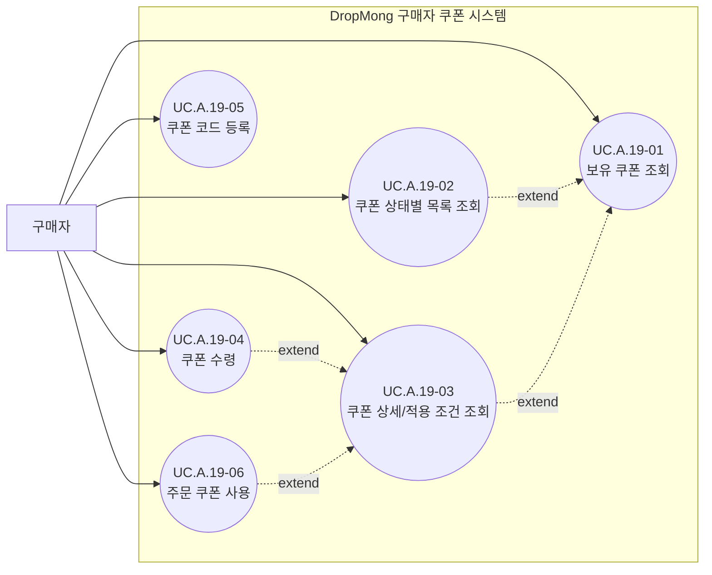

# 구매자 쿠폰 사용자 목표

## 기본 정보

- UC ID: `UC.A.19`
- 사용자: 구매자
- 기준 페이지: [PAGE.A.19 보유 쿠폰](../10-sitemap/PAGE_A_19_coupon_wallet/PAGE_A_19_owned_coupon.md), [PAGE.A.10 마이](../10-sitemap/PAGE_A_10_my.md), [PAGE.A.11 주문/결제](../10-sitemap/PAGE_A_11_payment.md)
- 기준 기능: 쿠폰 수령, 보유 쿠폰 조회, 쿠폰 상태별 목록 조회, 쿠폰 상세/적용 조건 조회, 쿠폰 코드 등록, 주문 쿠폰 사용
- 제외 범위: 쿠폰 캠페인 생성, 판매자 쿠폰 등록, 플랫폼 쿠폰 승인, 대량 발급 작업, DLQ 재처리, 정산 확정, 수동 DB 수정

## 연관 태그

- 🏷️ 플로우 참조: FLOW.A.19
- 🏷️ 요구사항 참조: [REQ.A.02](../00-requirements/REQ_A_02_coupon_benefit.md), [REQ.A.01](../00-requirements/REQ_A_01_limited_drop_commerce.md)
- 🏷️ 페이지 참조: [PAGE.A.19](../10-sitemap/PAGE_A_19_coupon_wallet/PAGE_A_19_owned_coupon.md), [PAGE.A.10](../10-sitemap/PAGE_A_10_my.md), [PAGE.A.11](../10-sitemap/PAGE_A_11_payment.md)
- 🏷️ UI 참조: [UI.A.19](../20-ui/UI_A_19_coupon_wallet/UI_A_19_coupon_wallet.md), [UI.A.10](../20-ui/UI_A_10_my.md), [UI.A.11](../20-ui/UI_A_11_payment.md)
- 🏷️ 영속성 참조: PST.A.19 예정
- 🏷️ 서비스 참조: SVC.A.19 예정
- 🏷️ 시나리오 참조: SCN.A.19 예정
- 🏷️ API 참조: API.A.19 예정

## 유스케이스

## 사용자 목표

| UC ID | 액터 | 사용자 목표 | 설명 | 연결 요구사항 |
| --- | --- | --- | --- | --- |
| `UC.A.19-01` | 구매자 | 보유 쿠폰 조회 | 마이 페이지에서 쿠폰함에 진입해 보유 쿠폰 목록과 혜택 요약을 확인한다. | `REQ.A.02.FR-006` |
| `UC.A.19-02` | 구매자 | 쿠폰 상태별 목록 조회 | 전체, 사용 가능, 사용 완료, 만료 상태별로 쿠폰 목록을 좁혀 본다. | `REQ.A.02.FR-006`, `REQ.A.02.FR-012` |
| `UC.A.19-03` | 구매자 | 쿠폰 상세/적용 조건 조회 | 쿠폰명, 할인 방식, 조건, 유효기간, 적용 가능 범위와 적용 불가 사유를 확인한다. | `REQ.A.02.FR-007`, `REQ.A.02.FR-008` |
| `UC.A.19-04` | 구매자 | 쿠폰 수령 | 쿠폰 받기 또는 수령 액션으로 발급 가능한 쿠폰을 내 쿠폰으로 받는다. | `REQ.A.02.FR-003`, `REQ.A.02.FR-004`, `REQ.A.02.FR-005` |
| `UC.A.19-05` | 구매자 | 쿠폰 코드 등록 | 이벤트나 프로모션으로 받은 쿠폰 코드를 입력해 보유 쿠폰으로 등록한다. | `REQ.A.02.FR-025`, `REQ.A.02.NFR-005` |
| `UC.A.19-06` | 구매자 | 주문 쿠폰 사용 | 주문/결제에서 현재 주문에 사용할 쿠폰을 선택하고 결제 확정 시 사용 처리한다. | `REQ.A.02.FR-007`, `REQ.A.02.FR-008`, `REQ.A.02.FR-009`, `REQ.A.02.FR-010` |

## 상태/결과 메모

- 쿠폰 상태: 사용 가능, 사용 완료, 만료, 발급 대기는 `CouponWalletReadModel`의 상태 필드로 다룬다.
- 쿠폰 지급 경로: 구매자 직접 수령, 쿠폰 코드 등록, 시스템 자동 지급, CS/운영 보상 지급으로 구분한다.
- 시스템 자동 지급은 사용자 행위가 아니므로 유스케이스 노드가 아니라 지급 결과와 조회 상태로 다룬다.
- 쿠폰 코드 등록 결과: 등록 성공, 이미 등록, 만료, 대상 아님, 존재하지 않음은 `쿠폰 코드 등록` 유스케이스의 결과 상태로 다룬다.
- 쿠폰 사용 상태: 적용 예약, 사용 완료, 사용 취소, 회수는 주문/결제 처리 결과와 연결되는 상태 전이로 다룬다.
- 사용 불가 사유: 최소 주문 금액 미달, 적용 대상 아님, 사용 기간 아님은 `쿠폰 상세/적용 조건 조회`와 `주문 쿠폰 사용`의 표시 데이터로 다룬다.

## 확인 필요

- 쿠폰 카드 액션은 상세 보기, 쿠폰 수령, 주문서 이동, 적용 안내 중 무엇을 우선할지 결정한다.
- 쿠폰 수령 성공을 즉시 보유 쿠폰으로 표시할지, 발급 대기 상태를 먼저 표시할지 결정한다.
- 쿠폰 코드 등록 성공 후 보유 쿠폰 화면으로 자동 이동할지, 입력 화면에서 연속 등록을 허용할지 결정한다.
- 쿠폰 코드 입력값의 대소문자 정규화, 하이픈/공백 허용, 실패 횟수 제한 기준을 정한다.
- 주문/결제 화면에서 쿠폰 사용을 위해 쿠폰함으로 역진입할 때 주문 컨텍스트를 보존할지 결정한다.
