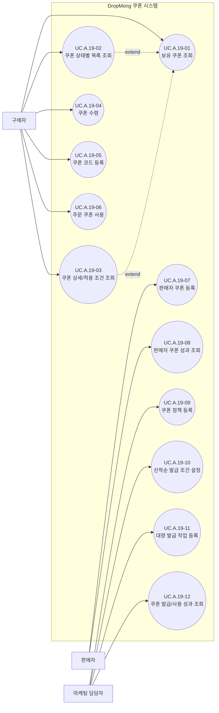
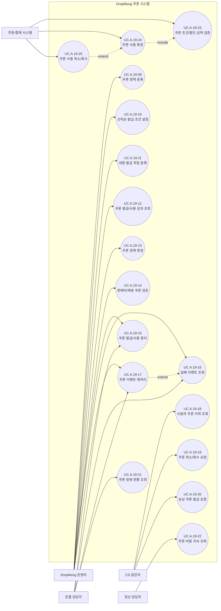

# 쿠폰 사용자 목표

## 기본 정보

- UC ID: `UC.A.19`
- 주요 액터: 구매자, 판매자, 마케팅 담당자, DropMong 운영자, CS 담당자, 온콜 담당자, 정산 담당자
- 보조 액터: 주문/결제 시스템
- 기준 페이지: [PAGE.A.19 보유 쿠폰](../10-sitemap/buyer-mobile-web/PAGE_A_19_coupon_wallet/PAGE_A_19_owned_coupon.md), [PAGE.A.11 주문/결제](../10-sitemap/buyer-mobile-web/PAGE_A_11_payment.md), 판매자/운영자/CS 페이지 예정
- 기준 기능: 쿠폰 정책과 수량 설정, 판매자 쿠폰 등록과 승인, 쿠폰 수령과 코드 등록, 보유 쿠폰 조회, 주문 사용, 대량 발급, 성과 조회, 사용자 지원, 발급 중지, 실패 재처리, 비용 귀속 조회
- 제외 범위: 드롭과 상품 자체의 생성, 주문 생성, PG 승인, 정산 회계 확정, Redis/MQ/Worker 내부 구현, 수동 DB 수정

이 문서는 `PAGE.A.19`의 구매자 쿠폰함만 설명하는 문서가 아니라, [REQ.A.02](../00-requirements/REQ_A_02_coupon_benefit.md)에 등장하는 액터가 쿠폰 시스템에서 달성하려는 목표를 함께 정리한 쿠폰 도메인 유스케이스 문서다. `PAGE.A.19`는 이 가운데 구매자 조회, 수령, 코드 등록만 담당한다.

## 연관 태그

- 🏷️ 플로우 참조: FLOW.A.19
- 🏷️ 요구사항 참조: [REQ.A.02](../00-requirements/REQ_A_02_coupon_benefit.md), [REQ.A.01](../00-requirements/REQ_A_01_limited_drop_commerce.md), [REQ.A.03](../00-requirements/REQ_A_03_seller.md), [REQ.A.04](../00-requirements/REQ_A_04_platform_operator_admin.md)
- 🏷️ 페이지 참조: [PAGE.A.19](../10-sitemap/buyer-mobile-web/PAGE_A_19_coupon_wallet/PAGE_A_19_owned_coupon.md), [PAGE.A.11](../10-sitemap/buyer-mobile-web/PAGE_A_11_payment.md), 판매자/운영자/CS 페이지 예정
- 🏷️ UI 참조: [UI.A.19](../20-ui/buyer-mobile-web/UI_A_19_coupon_wallet/UI_A_19_coupon_wallet.md), [UI.A.11](../20-ui/buyer-mobile-web/UI_A_11_payment.md), 판매자/운영자/CS UI 예정
- 🏷️ 관련 UC: [UC.A.01](UC_A_01_buyer_purchase_delivery.md), [UC.A.02](UC_A_02_seller_manage_drop.md), [UC.A.03](UC_A_03_platform_operator_admin.md), [UC.A.04](UC_A_04_cs_order_coupon_support.md)
- 🏷️ 영속성 참조: PST.A.19 예정
- 🏷️ 서비스 참조: SVC.A.19 예정
- 🏷️ 시나리오 참조: SCN.A.19 예정
- 🏷️ API 참조: API.A.19 예정

## 액터와 시스템 경계

| Actor ID | 액터 | 분류 | 쿠폰 관련 목표 | 현재 화면 근거 |
| --- | --- | --- | --- | --- |
| `ACTOR-BUYER` | 구매자 | 주요 액터 | 쿠폰을 받고, 보유 상태와 조건을 확인하고, 주문에 사용한다. | `PAGE.A.19`, `PAGE.A.11` |
| `ACTOR-SELLER` | 판매자 | 주요 액터 | 자기 상품과 드롭에 적용할 쿠폰을 등록하고 성과를 확인한다. | 판매자 페이지 예정, `UC.A.02` |
| `ACTOR-MARKETER` | 마케팅 담당자 | 주요 액터 | 이벤트 목적에 맞는 쿠폰 정책과 발급 대상을 정의하고 성과를 확인한다. | 운영자 페이지 예정, `UC.A.03` |
| `ACTOR-DROPMONG-OPERATOR` | DropMong 운영자 | 주요 액터 | 쿠폰 정책, 승인, 발급 상태, 중지, 실패 재처리를 관리한다. | 운영자 페이지 예정, `UC.A.03` |
| `ACTOR-CS` | CS 담당자 | 주요 액터 | 사용자 쿠폰 이력을 확인하고 회수, 재처리, 보상 요청을 연결한다. | CS 페이지 예정, `UC.A.04` |
| `ACTOR-ONCALL` | 온콜 담당자 | 주요 액터 | 쿠폰 장애와 영향 범위를 확인하고 발급 중지와 재처리를 수행한다. | 운영자 페이지 예정, `UC.A.03` |
| `ACTOR-SETTLEMENT` | 정산 담당자 | 주요 액터 | 쿠폰 할인 비용의 부담 주체와 주문별 귀속을 확인한다. | 정산 페이지 예정, `UC.A.03` |
| `ACTOR-ORDER-PAYMENT` | 주문/결제 시스템 | 보조 액터 | 쿠폰 조건과 할인 금액을 검증하고 사용 확정 또는 취소를 요청한다. | `PAGE.A.11`, `UC.A.01` |

- 구매자부터 온콜 담당자까지의 Actor ID는 `REQ.A.02`의 사용자 유형을 따른다.
- `ACTOR-SETTLEMENT`는 `REQ.A.02.FR-024`의 정산 담당자에서, `ACTOR-ORDER-PAYMENT`는 `REQ.A.02.FR-007~011`의 쿠폰 시스템 외부 호출 주체에서 도출한 ID다.
- 요구사항의 `시스템`은 쿠폰 시스템 내부 책임을 뜻하므로 별도 액터로 두지 않는다.
- Redis, MQ, 발급 Worker는 구현 구성 요소이므로 액터로 두지 않는다.
- 자동 지급과 알림 발송은 사용자 목표가 아니라 쿠폰 처리 결과이므로 별도 유스케이스로 나누지 않는다.

## 유스케이스

기능이 많아 구매/판매/마케팅 목표와 운영/지원/연동 목표를 두 개의 다이어그램으로 나눈다. 두 다이어그램에 같은 UC가 보이면 여러 액터가 같은 목표에 참여한다는 뜻이다.

### 구매, 판매, 마케팅

### 운영, 지원, 시스템 연동

## 사용자 목표

### 구매자

| UC ID | 사용자 목표 | 설명 | 연결 요구사항 |
| --- | --- | --- | --- |
| `UC.A.19-01` | 보유 쿠폰 조회 | 마이 페이지에서 쿠폰함에 진입해 보유 쿠폰 목록과 혜택 요약을 확인한다. | `REQ.A.02.FR-006`, `REQ.A.02.FR-013` |
| `UC.A.19-02` | 쿠폰 상태별 목록 조회 | 전체, 사용 가능, 사용 완료, 만료, 발급 대기 상태별로 쿠폰 목록을 좁혀 본다. | `REQ.A.02.FR-006`, `REQ.A.02.FR-012`, `REQ.A.02.FR-013` |
| `UC.A.19-03` | 쿠폰 상세/적용 조건 조회 | 쿠폰명, 할인 방식, 조건, 유효기간, 적용 가능 범위와 적용 불가 사유를 확인한다. | `REQ.A.02.FR-007`, `REQ.A.02.FR-008` |
| `UC.A.19-04` | 쿠폰 수령 | 쿠폰 받기 또는 수령 액션으로 발급 가능한 쿠폰을 내 쿠폰으로 받는다. | `REQ.A.02.FR-003`, `REQ.A.02.FR-004`, `REQ.A.02.FR-005`, `REQ.A.02.FR-013` |
| `UC.A.19-05` | 쿠폰 코드 등록 | 이벤트나 프로모션으로 받은 쿠폰 코드를 입력해 보유 쿠폰으로 등록한다. | `REQ.A.02.FR-025`, `REQ.A.02.NFR-005` |
| `UC.A.19-06` | 주문 쿠폰 사용 | 주문/결제에서 현재 주문에 사용할 쿠폰을 선택하고 할인 결과를 확인한다. 실제 사용 확정은 주문/결제 시스템 연동으로 처리한다. | `REQ.A.02.FR-007`, `REQ.A.02.FR-008`, `REQ.A.02.FR-009`, `REQ.A.02.FR-010` |

### 판매자와 마케팅 담당자

| UC ID | 액터 | 사용자 목표 | 설명 | 연결 요구사항 |
| --- | --- | --- | --- | --- |
| `UC.A.19-07` | 판매자 | 판매자 쿠폰 등록 | 자기 상품, 드롭, 스토어 범위와 예산 안에서 쿠폰 조건과 적용 대상을 등록한다. | `REQ.A.02.FR-021`, `REQ.A.02.FR-022`, `REQ.A.02.NFR-022` |
| `UC.A.19-08` | 판매자 | 판매자 쿠폰 성과 조회 | 자신이 등록한 쿠폰의 발급, 사용, 취소/회수 결과를 확인한다. | `REQ.A.02` 사용자 유형, `REQ.A.02.FR-014` 보강 필요 |
| `UC.A.19-09` | 마케팅 담당자, DropMong 운영자 | 쿠폰 정책 등록 | 쿠폰명, 발급/비용 부담 주체, 기간, 수량, 대상, 할인 방식, 중복 적용 정책을 등록한다. | `REQ.A.02.FR-001`, `REQ.A.02.FR-021` |
| `UC.A.19-10` | 마케팅 담당자, DropMong 운영자 | 선착순 발급 조건 설정 | 오픈 시각, 총수량, 사용자별 제한, 발급 종료 조건을 설정한다. | `REQ.A.02.FR-002` |
| `UC.A.19-11` | 마케팅 담당자, DropMong 운영자 | 대량 발급 작업 등록 | 발급 대상과 실행 조건을 정해 대량 발급 작업을 등록하고 진행 상태를 확인한다. | `REQ.A.02.FR-019`, `REQ.A.02.NFR-019` |
| `UC.A.19-12` | 마케팅 담당자, DropMong 운영자 | 쿠폰 발급/사용 성과 조회 | 쿠폰별 요청, 실제 발급, 실패, 미발급, 사용, 취소/회수 수를 비교한다. | `REQ.A.02.FR-013`, `REQ.A.02.FR-014` |

### 운영, 지원, 시스템 연동

| UC ID | 액터 | 사용자 목표 | 설명 | 연결 요구사항 |
| --- | --- | --- | --- | --- |
| `UC.A.19-13` | DropMong 운영자 | 쿠폰 정책 변경 | 정책 변경 범위와 적용 시점을 선택하고 기존 보유 쿠폰과 진행 중 주문에 미치는 영향을 확인한다. | `REQ.A.02.FR-020`, `REQ.A.02.NFR-020` |
| `UC.A.19-14` | DropMong 운영자 | 판매자/제휴 쿠폰 검토 | 정책 위반, 과도한 할인, 책임 고지 누락 여부를 검토해 승인, 반려, 보류한다. | `REQ.A.02.FR-023`, `REQ.A.02.NFR-024` |
| `UC.A.19-15` | DropMong 운영자, 온콜 담당자 | 쿠폰 발급/사용 중지 | 특정 쿠폰, 드롭, 사용자 그룹의 발급이나 사용을 중지하고 읽기 전용 안내를 적용한다. | `REQ.A.02.FR-016` |
| `UC.A.19-16` | DropMong 운영자, 온콜 담당자 | 실패 이벤트 조회 | DLQ 또는 재처리 대기열에서 원본 요청, 실패 사유, 재시도 횟수와 다음 처리 시각을 확인한다. | `REQ.A.02.FR-015`, `REQ.A.02.NFR-009` |
| `UC.A.19-17` | DropMong 운영자, 온콜 담당자 | 쿠폰 이벤트 재처리 | 실패 이벤트를 재처리하거나 최종 실패로 종료하고 결과를 확인한다. | `REQ.A.02.FR-015`, `REQ.A.02.NFR-010` |
| `UC.A.19-18` | CS 담당자 | 사용자 쿠폰 이력 조회 | 사용자 단위로 발급 요청, 발급 결과, 주문 적용, 사용 확정, 취소/회수, 만료 이력을 확인한다. | `REQ.A.02.FR-017` |
| `UC.A.19-19` | CS 담당자 | 쿠폰 취소/회수 요청 | 주문 또는 결제 실패와 고객 문의를 근거로 쿠폰 사용 취소, 회수, 재처리를 요청한다. | `REQ.A.02.FR-011`, `REQ.A.02.FR-017` |
| `UC.A.19-20` | CS 담당자 | 보상 쿠폰 발급 요청 | 보상 사유와 문의 근거를 첨부해 운영자에게 보상 쿠폰 발급을 요청한다. | `REQ.A.02.FR-021`, `REQ.A.04.FR-011` |
| `UC.A.19-21` | 온콜 담당자 | 쿠폰 장애 현황 조회 | 쿠폰 API, Redis, MQ, Worker의 기술 지표와 발급/미발급/사용 업무 지표를 함께 확인한다. | `REQ.A.02.NFR-013`, `REQ.A.02.NFR-015`, `REQ.A.02.NFR-016` |
| `UC.A.19-22` | 정산 담당자 | 쿠폰 비용 귀속 조회 | 주문별 할인 금액과 플랫폼, 판매자, 공동 부담, 보상 비용 귀속을 확인한다. | `REQ.A.02.FR-024`, `REQ.A.02.NFR-021`, `REQ.A.02.NFR-023` |
| `UC.A.19-23` | 주문/결제 시스템 | 쿠폰 조건/할인 금액 검증 | 주문 가격 스냅샷을 기준으로 적용 가능 여부와 할인 금액을 쿠폰 시스템에 요청한다. | `REQ.A.02.FR-007`, `REQ.A.02.FR-008`, `REQ.A.02.FR-009` |
| `UC.A.19-24` | 주문/결제 시스템 | 쿠폰 사용 확정 | 주문 확정 시 쿠폰 사용을 확정하고 다른 주문의 중복 사용을 막는다. | `REQ.A.02.FR-010`, `REQ.A.02.NFR-004` |
| `UC.A.19-25` | 주문/결제 시스템 | 쿠폰 사용 취소/회수 | 주문 생성 실패, 결제 실패/취소, 재고 회수, 주문 만료에 맞춰 쿠폰 사용을 취소하거나 회수한다. | `REQ.A.02.FR-011`, `REQ.A.02.NFR-014`, `REQ.A.02.NFR-018` |

## 페이지 연결 범위

| 사용자 목표 | 페이지 | 문서 상태 |
| --- | --- | --- |
| 구매자 쿠폰함 조회, 수령, 코드 등록 | [PAGE.A.19](../10-sitemap/buyer-mobile-web/PAGE_A_19_coupon_wallet/PAGE_A_19_owned_coupon.md) | 정의됨 |
| 구매자 주문 쿠폰 사용 | [PAGE.A.11](../10-sitemap/buyer-mobile-web/PAGE_A_11_payment.md) | 정의됨 |
| 판매자 쿠폰 등록과 성과 조회 | 판매자 쿠폰 페이지 | 예정, `UC.A.02`와 연결 필요 |
| 정책, 승인, 대량 발급, 성과, 중지, 재처리 | 플랫폼 운영자 쿠폰 페이지 | 예정, `UC.A.03`과 연결 필요 |
| 사용자 쿠폰 이력, 취소/회수, 보상 요청 | CS 쿠폰 지원 페이지 | 예정, `UC.A.04`와 연결 필요 |
| 장애 현황과 비용 귀속 | 운영/정산 페이지 | 예정 |

`PAGE.A.19`에는 판매자, 운영자, 마케팅, CS, 온콜, 정산 기능을 추가하지 않는다. 각 액터의 목표는 해당 업무 사이트의 페이지가 만들어질 때 연결한다.

## 요구사항 추적

| 요구사항 범위 | 연결 UC | 처리 기준 |
| --- | --- | --- |
| `REQ.A.02.FR-001~002` | `UC.A.19-09~10` | 정책과 선착순 조건을 액터의 설정 목표로 분리한다. |
| `REQ.A.02.FR-003~006` | `UC.A.19-01~04` | 검증과 중복 방지는 쿠폰 수령 결과에 포함하고 별도 사용자 목표로 만들지 않는다. |
| `REQ.A.02.FR-007~010` | `UC.A.19-03`, `UC.A.19-06`, `UC.A.19-23~24` | 구매자 선택과 주문/결제 시스템 연동을 분리한다. |
| `REQ.A.02.FR-011~013` | `UC.A.19-01~04`, `UC.A.19-19`, `UC.A.19-25` | 상태는 조회 결과로, 취소/회수는 요청 주체별 목표로 다룬다. |
| `REQ.A.02.FR-014~016` | `UC.A.19-12`, `UC.A.19-15~17`, `UC.A.19-21` | 성과 조회, 중지, 실패 조회, 재처리를 구분한다. |
| `REQ.A.02.FR-017~019` | `UC.A.19-11`, `UC.A.19-18`, `UC.A.19-20` | 사용자 지원과 대량 발급 작업을 사람의 목표로 다룬다. `REQ.A.02.FR-018`의 이벤트 기록과 알림은 공통 처리 결과다. |
| `REQ.A.02.FR-020~024` | `UC.A.19-07`, `UC.A.19-09`, `UC.A.19-13~14`, `UC.A.19-20`, `UC.A.19-22` | 정책 변경, 발급 주체, 판매자 권한, 승인, 비용 귀속을 연결한다. |
| `REQ.A.02.FR-025` | `UC.A.19-05` | 코드 검증 결과는 쿠폰 코드 등록의 결과 상태로 다룬다. |

## 상태와 공통 처리 메모

- 쿠폰 상태인 발급 대기, 보유, 적용 예약, 사용 완료, 사용 취소, 회수, 만료, 최종 실패는 유스케이스가 아니라 조회 결과와 상태 전이다.
- 쿠폰 지급 경로는 구매자 직접 수령, 쿠폰 코드 등록, 시스템 자동 지급, 대량 지급, CS/운영 보상 지급으로 구분한다.
- 시스템 자동 지급은 사용자 행위가 아니므로 유스케이스 노드가 아니라 지급 결과와 조회 상태로 다룬다.
- 등록 성공, 이미 등록, 만료, 대상 아님, 존재하지 않음은 `쿠폰 코드 등록`의 결과 상태다.
- 발급 성공, 적용 실패, 사용 확정, 회수, 만료, 재처리 결과의 이벤트 기록과 알림은 모든 관련 유스케이스에 공통으로 적용한다.
- 실제 쿠폰 사용은 `PAGE.A.11`의 주문/결제에서 시작하며, `PAGE.A.19`는 보유 상태와 조건을 확인하는 역할까지만 맡는다.

## 확인 필요

- 판매자의 목표에 `판매자 쿠폰 성과 조회`가 있지만 `REQ.A.02.FR-014`의 허용 사용자는 운영자와 마케팅 담당자뿐이다. 판매자 조회 범위와 권한 요구사항을 보강해야 한다.
- 마케팅 담당자가 쿠폰 정책을 직접 확정하는지, 초안을 만들고 운영자가 승인하는지 책임을 정해야 한다.
- 판매자 쿠폰 가운데 즉시 노출 가능한 범위와 운영자 승인이 필요한 범위를 정해야 한다.
- CS 보상 쿠폰 요청의 승인자, 최대 보상 한도, 필수 사유와 증빙을 정해야 한다.
- 운영자와 온콜 담당자의 발급 중지, 사용 중지, 재처리, 최종 실패 처리 권한을 구분해야 한다.
- 정산 담당자에게 별도 조회 UI를 제공할지, 정산 시스템으로 비용 귀속 데이터를 제공할지 정해야 한다.
- 판매자, 운영자, CS, 장애 대응, 정산 목표를 연결할 사이트맵과 UI 문서를 새로 만들어야 한다.
- 쿠폰 수령 성공을 즉시 보유 상태로 표시할지, 발급 대기 상태를 먼저 표시할지 정해야 한다.
- 쿠폰 코드 등록 성공 후 이동 방식과 입력값 정규화, 실패 횟수 제한을 정해야 한다.
