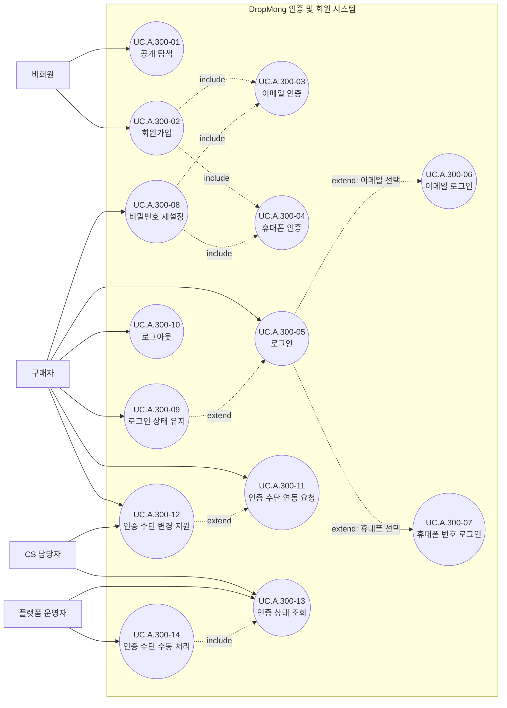

# 인증 및 회원 사용자 목표

## 기본 정보

- UC ID: `UC.A.05`
- 사용자: 비회원, 구매자, CS 담당자, 플랫폼 운영자
- 기준 페이지: [PAGE.A.300 인증 및 회원](../10-sitemap/PAGE_A_300_auth_member/PAGE_A_300_auth_member.md), [PAGE.A.310 비밀번호 재설정](../10-sitemap/PAGE_A_310_password_find/PAGE_A_310_password_find.md)
- 기준 기능: 공개 탐색, 회원가입, 이메일 인증, 휴대폰 인증, 로그인, 이메일 로그인, 휴대폰 번호 로그인, 비밀번호 재설정, 로그인 상태 유지, 로그아웃, 인증 수단 연동 요청, 인증 수단 변경 지원, 인증 상태 조회, 인증 수단 수동 처리
- 제외 범위: PG 본인 인증, 네이버/토스/PASS/카카오톡 실제 인증 연동, Apple/Google 로그인 MVP 구현, 판매자/운영자 passkey 구현, 사용자 계정 병합, 수동 DB 수정

## 연관 태그

- 🏷️ 플로우 참조: FLOW.A.300, FLOW.A.301, FLOW.A.302, FLOW.A.303, FLOW.A.310
- 🏷️ 요구사항 참조: [REQ.A.05](../00-requirements/REQ_A_05_auth_member.md), [REQ.A.01](../00-requirements/REQ_A_01_limited_drop_commerce.md)
- 🏷️ 페이지 참조: [PAGE.A.300](../10-sitemap/PAGE_A_300_auth_member/PAGE_A_300_auth_member.md), [PAGE.A.310](../10-sitemap/PAGE_A_310_password_find/PAGE_A_310_password_find.md), [PAGE.A.01](../10-sitemap/PAGE_A_01_homepage.md), [PAGE.A.02](../10-sitemap/PAGE_A_02_product_detail.md), [PAGE.A.10](../10-sitemap/PAGE_A_10_my.md)
- 🏷️ UI 참조: [UI.A.300](../20-ui/UI_A_300_auth_member/UI_A_300_auth_member.md), [UI.A.310](../20-ui/UI_A_310_password_find/UI_A_310_password_find.md)
- 🏷️ 영속성 참조: PST.A.300 예정, PST.A.310 예정
- 🏷️ 서비스 참조: SVC.A.300 예정, SVC.A.310 예정
- 🏷️ 시나리오 참조: SCN.A.300 예정, SCN.A.310 예정
- 🏷️ API 참조: API.A.300 예정, API.A.310 예정

## 유스케이스

## 사용자 목표

| UC ID | 액터 | 사용자 목표 | 설명 | 연결 요구사항 |
| --- | --- | --- | --- | --- |
| `UC.A.300-01` | 비회원 | 공개 탐색 | 로그인 없이 홈, 드롭 목록, 상품 상세, 검색, 공지를 본다. | `REQ.A.05.FR-001` |
| `UC.A.300-02` | 비회원 | 회원가입 | DropMong 계정을 만들기 위해 이메일, 비밀번호, 휴대폰 번호, 약관 동의를 입력한다. | `REQ.A.05.FR-004`, `REQ.A.05.FR-006`, `REQ.A.05.FR-007` |
| `UC.A.300-03` | 비회원, 구매자 | 이메일 인증 | 회원가입 또는 비밀번호 재설정 중 이메일 소유를 확인한다. | `REQ.A.05.FR-027`, `REQ.A.05.FR-028` |
| `UC.A.300-04` | 비회원, 구매자 | 휴대폰 인증 | 회원가입, 휴대폰 번호 로그인, 비밀번호 재설정 중 휴대폰 번호 소유를 확인한다. | `REQ.A.05.FR-005`, `REQ.A.05.FR-026`, `REQ.A.05.FR-028` |
| `UC.A.300-05` | 구매자 | 로그인 | 기존 계정으로 DropMong에 로그인한다. | `REQ.A.05.FR-008`, `REQ.A.05.FR-009` |
| `UC.A.300-06` | 구매자 | 이메일 로그인 | 이메일과 비밀번호로 로그인한다. | `REQ.A.05.FR-008` |
| `UC.A.300-07` | 구매자 | 휴대폰 번호 로그인 | DropMong 계정에 연결된 휴대폰 번호로 로그인한다. | `REQ.A.05.FR-026` |
| `UC.A.300-08` | 구매자 | 비밀번호 재설정 | 이메일 또는 휴대폰 인증 후 새 비밀번호를 설정한다. | `REQ.A.05.FR-028` |
| `UC.A.300-09` | 구매자 | 로그인 상태 유지 | 다음 방문 때 다시 로그인하지 않도록 로그인 상태 유지를 선택한다. | `REQ.A.05.FR-011`, `REQ.A.05.FR-012`, `REQ.A.05.FR-013` |
| `UC.A.300-10` | 구매자 | 로그아웃 | 현재 로그인 상태를 종료한다. | `REQ.A.05.FR-014` |
| `UC.A.300-11` | 구매자 | 인증 수단 연동 요청 | 현재 계정에 이메일, 휴대폰 번호, Apple, Google 같은 인증 수단 추가를 요청한다. | `REQ.A.05.FR-016`, `REQ.A.05.FR-017`, `REQ.A.05.FR-018` |
| `UC.A.300-12` | 구매자, CS 담당자 | 인증 수단 변경 지원 | 사용자가 직접 처리할 수 없는 인증 수단 해제/재연동 도움을 요청하거나 지원한다. | `REQ.A.05.FR-030` |
| `UC.A.300-13` | CS 담당자, 플랫폼 운영자 | 인증 상태 조회 | 로그인 실패, 계정 잠금, 인증 수단 연동 상태를 확인한다. | `REQ.A.05.FR-015`, `REQ.A.05.FR-022` |
| `UC.A.300-14` | 플랫폼 운영자 | 인증 수단 수동 처리 | 승인과 사유를 바탕으로 인증 수단 해제 또는 재연동을 처리한다. | `REQ.A.05.FR-030`, `REQ.A.05.FR-031` |
