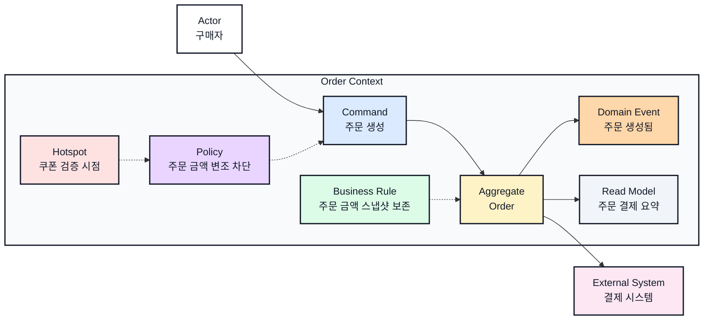

# 주문 이벤트스토밍과 바운디드 컨텍스트

## 기본 정보

- BC ID: `BC.A.01`
- 책임: 주문 생성, 주문 상태 관리, 주문 금액 스냅샷 보존.
- 사용자: 구매자, 운영자.
- 핵심 용어: 주문, 주문 라인, 주문 금액, 주문 상태.
- 제외 책임: 결제 승인, 상품 재고 원장, 쿠폰 발급.

## 연관 태그

- 🏷️ 요구사항 참조: [REQ.A.01](../00-requirements/.examples/REQ_A_01_order_checkout.md)
- 🏷️ UC 참조: [UC.A.01](../../30-uc/.examples/UC_A_01_place_order.md)
- 🏷️ 영속성 참조: [PST.A.01](../../55-persistence/.examples/PST_A_01_order_persistence.md)
- 🏷️ 서비스 참조: [SVC.A.01](../../60-service/.examples/SVC_A_01_order_service.md)
- 🏷️ 시나리오 참조: [SCN.A.01](../../80-scenario/.examples/SCN_A_01_place_order.md)
- 🏷️ 도메인 참조: [AGG.A.01](../../50-domain-model/.examples/AGG_A_01_order.md)
- 🏷️ API 참조: [API.A.01](../../70-api/.examples/API_A_01_place_order.md)

## 컨텍스트 경계

- 이 BC가 결정하는 것: 주문 생성 가능 여부, 주문 상태, 주문 금액 스냅샷.
- 이 BC가 참조만 하는 것: 상품명, 상품 가격, 쿠폰 할인 결과, 배송지 요약.
- 다른 BC에 위임하는 것: 결제 승인, 쿠폰 유효성 최종 판정, 재고 차감.

## Event Storming Diagram

## Element Catalog

| 유형 | 식별자 | 이름 | 소속 컨텍스트 | 설명 |
| --- | --- | --- | --- | --- |
| Actor | ACTOR.A.01 | 구매자 | Context 외부 | 주문 결제 페이지에서 주문 생성을 요청한다. |
| Command | CMD.A.01 | 주문 생성 | Order Context | 주문 생성 요청을 처리한다. |
| Aggregate | AGG.A.01 | Order | Order Context | 주문 라인, 주문 금액 스냅샷, 주문 상태를 보존한다. |
| Domain Event | EVT.A.01 | 주문 생성됨 | Order Context | 주문이 생성된 뒤 발행된다. |
| Policy | POLICY.A.01 | 주문 금액 변조 차단 | Order Context | 클라이언트가 보낸 금액을 신뢰하지 않고 서버 계산 금액만 허용한다. |
| Business Rule | RULE.A.01 | 주문 금액 스냅샷 보존 | Order Context | 주문 생성 시점의 금액과 주문 라인을 이후 변경과 분리해 보존한다. |
| Hotspot | HOTSPOT.A.01 | 쿠폰 검증 시점 | Order Context | 쿠폰 할인 결과를 주문 생성 전 조회 모델에 포함할지 결정이 필요하다. |
| External System | EXT.A.01 | 결제 시스템 | Context 외부 | 결제 승인과 실패 응답을 제공한다. |
| Read Model | RM.A.01 | 주문 결제 요약 | Order Context | 주문 결제 화면에 필요한 요약 정보를 제공한다. |

## Element Evidence

| 요소 | 근거 문서 | 근거 내용 |
| --- | --- | --- |
| ACTOR.A.01 구매자 | [UC.A.01](../../30-uc/.examples/UC_A_01_place_order.md) | 구매자가 주문 결제 페이지에서 주문을 확정하는 주체다. |
| CMD.A.01 주문 생성 | [UC.A.01](../../30-uc/.examples/UC_A_01_place_order.md), [API.A.01](../../70-api/.examples/API_A_01_place_order.md) | 주문 확정 행위가 주문 생성 요청으로 이어진다. |
| AGG.A.01 Order | [REQ.A.01](../00-requirements/.examples/REQ_A_01_order_checkout.md), [UC.A.01](../../30-uc/.examples/UC_A_01_place_order.md) | 주문 라인, 주문 금액, 주문 상태를 보존해야 한다. |
| EVT.A.01 주문 생성됨 | [UC.A.01](../../30-uc/.examples/UC_A_01_place_order.md) | 주문 확정 이후 주문 생성 결과가 남는다. |
| POLICY.A.01 주문 금액 변조 차단 | [REQ.A.01](../00-requirements/.examples/REQ_A_01_order_checkout.md), [UC.A.01](../../30-uc/.examples/UC_A_01_place_order.md) | 주문 생성 시 클라이언트 입력 금액을 그대로 신뢰하면 안 된다. |
| RULE.A.01 주문 금액 스냅샷 보존 | [REQ.A.01](../00-requirements/.examples/REQ_A_01_order_checkout.md), [UC.A.01](../../30-uc/.examples/UC_A_01_place_order.md) | 주문 후에도 당시 주문 금액과 주문 라인을 재현할 수 있어야 한다. |
| HOTSPOT.A.01 쿠폰 검증 시점 | [REQ.A.01](../00-requirements/.examples/REQ_A_01_order_checkout.md), [UC.A.01](../../30-uc/.examples/UC_A_01_place_order.md) | 쿠폰 할인 결과를 조회 모델에 포함할지 동기 검증으로만 처리할지 결정해야 한다. |
| EXT.A.01 결제 시스템 | [REQ.A.01](../00-requirements/.examples/REQ_A_01_order_checkout.md) | 결제 승인은 주문 BC 내부 책임이 아니라 외부 시스템 연동이다. |
| RM.A.01 주문 결제 요약 | [UC.A.01](../../30-uc/.examples/UC_A_01_place_order.md) | 주문 전 금액, 주문 라인, 할인 결과를 확인해야 한다. |

## Event Relations

| 출발 | 관계 | 도착 | 설명 |
| --- | --- | --- | --- |
| 구매자 | 요청한다 | 주문 생성 | 구매자가 주문 확정 의사를 전달한다. |
| 주문 생성 | 변경한다 | Order | 주문 생성 가능 여부와 주문 금액 스냅샷을 결정한다. |
| Order | 발행한다 | 주문 생성됨 | 주문 상태와 금액이 확정된 뒤 이벤트를 발행한다. |
| 주문 금액 변조 차단 | 제한한다 | 주문 생성 | 서버 계산 금액과 다른 주문 생성 요청은 허용하지 않는다. |
| 주문 금액 스냅샷 보존 | 규정한다 | Order | 주문 생성 시점의 금액과 라인을 별도 스냅샷으로 남긴다. |
| 쿠폰 검증 시점 | 표시한다 | 주문 금액 변조 차단 | 쿠폰 할인 결과를 언제 확정할지 추가 결정이 필요하다. |
| Order | 요청한다 | 결제 시스템 | 외부 결제 승인 결과를 기다린다. |

## 유비쿼터스 언어

| 용어 | 의미 | 혼동하기 쉬운 용어 |
| --- | --- | --- |
| 주문 | 구매자가 상품 구매 의사를 확정한 기록 | 결제 |
| 주문 라인 | 주문에 포함된 상품 스냅샷 | 장바구니 항목 |
| 주문 금액 | 주문 생성 시점에 확정한 서버 계산 금액 | 화면 표시 금액 |

## 후속 설계 메모

| 항목 | 메모 | 연결 문서 |
| --- | --- | --- |
| 도메인 모델 | `Order`, 주문 라인, 주문 금액 스냅샷, 주문 상태를 상세화한다. | [AGG.A.01](../../50-domain-model/.examples/AGG_A_01_order.md) |
| 영속성 | 주문 저장소, 주문 상태 변경 트랜잭션, 결제 연동 outbox 여부를 검토한다. | [PST.A.01](../../55-persistence/.examples/PST_A_01_order_persistence.md) |
| 서비스 | 주문 생성 유스케이스와 주문 가능성 검증 위치를 정리한다. | [SVC.A.01](../../60-service/.examples/SVC_A_01_order_service.md) |
| API | 주문 생성 요청/응답과 실패 응답을 정리한다. | [API.A.01](../../70-api/.examples/API_A_01_place_order.md) |
| 발행 Event | `EVT.A.01`, `EVT.A.02` |  |
| 구독 Event | 결제 승인/실패 이벤트 구독 여부를 결정한다. |  |
| 외부 연동 | 결제 시스템 승인 요청과 실패 응답 처리를 정리한다. |  |
| 정책/불변조건 | 주문 생성 전 상품 상태, 금액, 쿠폰 할인 결과를 검증한다. |  |
| 열린 질문 | 쿠폰 할인 결과를 주문 생성 전 조회 모델에 포함할지, 주문 생성 시 동기 검증으로만 처리할지 결정해야 한다. |  |
