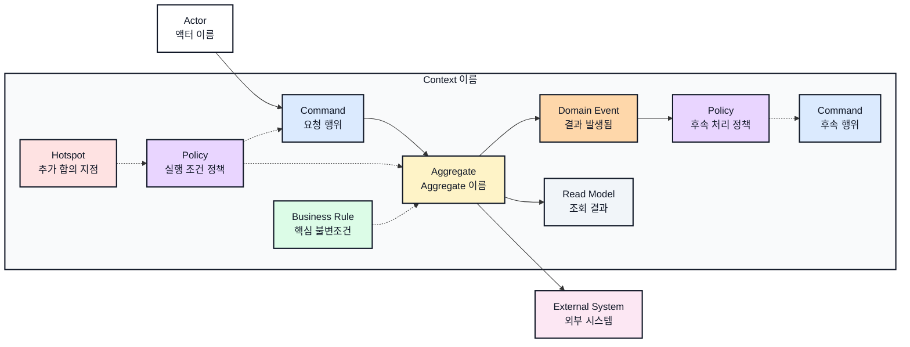

# Context 이름 이벤트스토밍과 바운디드 컨텍스트

## 기본 정보

- BC ID: `BC.A.XX`
- 책임:
- 사용자:
- 핵심 용어:
- 제외 책임:

## 연관 태그

아래 상대 경로는 이 템플릿을 `40-event-storming-bounded-context/` 루트에 복사한 문서를 기준으로 한다. 실제 연관 문서가 없는 행은 삭제한다.

- 🏷️ 요구사항 참조: [REQ.A.XX](../00-requirements/REQ_A_XX_name.md)
- 🏷️ 페이지 참조: [PAGE.A.XX](../10-sitemap/PAGE_A_XX_name.md)
- 🏷️ UI 참조: [UI.A.XX](../20-ui/UI_A_XX_name.md)
- 🏷️ UC 참조: [UC.A.XX](../30-uc/UC_A_XX_name.md)
- 🏷️ 서비스 상세 설계 참조: [SD.A.XX](../50-service-design/A_XX_name/README.md)
- 🏷️ 도메인 참조: [SD.A.XX10](../50-service-design/A_XX_name/A_XX_10-domain-model/README.md)
- 🏷️ 영속성 참조: [SD.A.XX20](../50-service-design/A_XX_name/A_XX_20-persistence/README.md)
- 🏷️ 서비스 참조: [SD.A.XX30](../50-service-design/A_XX_name/A_XX_30-service/README.md)
- 🏷️ API 참조: [SD.A.XX40](../50-service-design/A_XX_name/A_XX_40-api/README.md)
- 🏷️ 시나리오 참조: [SCN.A.XX](../80-sequence/SCN_A_XX_name.md)

## 컨텍스트 경계

- 이 BC가 결정하는 것:
- 이 BC가 참조만 하는 것:
- 다른 BC에 위임하는 것:

## Event Storming Diagram

## Element Catalog

| 유형 | 식별자 | 이름 | 소속 컨텍스트 | 설명 |
| --- | --- | --- | --- | --- |
| Actor | ACTOR.A.XX-01 | 액터 이름 | Context 외부 | Command를 요청하는 주체 |
| Command | CMD.A.XX-01 | 요청 행위 | Context 이름 | 최초 요청 |
| Command | CMD.A.XX-02 | 후속 행위 | Context 이름 | Event와 Policy가 유발하는 후속 요청 |
| Aggregate | AGG.A.XX-01 | Aggregate 이름 | Context 이름 | 상태와 불변조건의 소유자 |
| Domain Event | EVT.A.XX-01 | 결과 발생됨 | Context 이름 | Aggregate 변경 결과 |
| Policy | POLICY.A.XX-01 | 후속 처리 정책 | Context 이름 | Event를 후속 Command로 연결하는 정책 |
| Policy | POLICY.A.XX-02 | 실행 조건 정책 | Context 이름 | Command의 실행 조건을 제한하는 정책 |
| Business Rule | RULE.A.XX-01 | 핵심 불변조건 | Context 이름 | Aggregate가 지켜야 하는 규칙 |
| Hotspot | HOTSPOT.A.XX-01 | 추가 합의 지점 | Context 이름 | 근거 문서상 추가 합의가 필요한 지점 |
| External System | EXT.A.XX-01 | 외부 시스템 | Context 외부 | 외부 책임 소유자 |
| Read Model | RM.A.XX-01 | 조회 결과 | Context 이름 | 결과 확인용 조회 모델 |

## Element Evidence

| 요소 | 근거 문서 | 근거 내용 |
| --- | --- | --- |
| ACTOR.A.XX-01 | UC.A.XX |  |
| CMD.A.XX-01~02 | UC.A.XX, PAGE.A.XX, UI.A.XX |  |
| AGG.A.XX-01 | REQ.A.XX, UC.A.XX |  |
| EVT.A.XX-01 | UC.A.XX |  |
| POLICY.A.XX-01~02 | REQ.A.XX, UC.A.XX |  |
| RULE.A.XX-01 | REQ.A.XX, UC.A.XX |  |
| HOTSPOT.A.XX-01 | REQ.A.XX, PAGE.A.XX, UI.A.XX, UC.A.XX |  |
| EXT.A.XX-01 | REQ.A.XX, UC.A.XX |  |
| RM.A.XX-01 | PAGE.A.XX, UI.A.XX |  |

## Event Relations

도메인 Event가 만들어지기 전 애플리케이션 실행 실패를 기록해야 한다면 실패한 Command에서 오류 기록 Command로 `애플리케이션 오류 처리기 실패 감지` 라벨을 단 점선으로 연결하고, 관계를 `실패 시 요청한다`로 적는다. 여러 요소를 한 행에 묶을 때는 Catalog의 전체 이름을 생략하지 않고 ` `로 나눈다.

| 출발 | 관계 | 도착 | 설명 |
| --- | --- | --- | --- |
| 액터 이름 | 요청한다 | 요청 행위 |  |
| 요청 행위 | 변경한다 | Aggregate 이름 |  |
| Aggregate 이름 | 발행한다 | 결과 발생됨 |  |
| 결과 발생됨 | 유발한다 | 후속 처리 정책 |  |
| 후속 처리 정책 | 요청한다 | 후속 행위 |  |
| Aggregate 이름 | 투영한다 | 조회 결과 |  |
| Aggregate 이름 | 참조한다 | 외부 시스템 |  |
| 실행 조건 정책 | 제한한다 | 요청 행위 |  |
| 실행 조건 정책 | 조회한다 | Aggregate 이름 | 현재 도메인 상태를 실행 조건으로 확인한다. |
| 핵심 불변조건 | 규정한다 | Aggregate 이름 |  |
| 추가 합의 지점 | 표시한다 | 실행 조건 정책 |  |

## 유비쿼터스 언어

| 용어 | 의미 | 혼동하기 쉬운 용어 |
| --- | --- | --- |
|  |  |  |

## 후속 설계 메모

| 항목 | 메모 | 연결 문서 |
| --- | --- | --- |
| 도메인 모델 |  | [SD.A.XX10](../50-service-design/A_XX_name/A_XX_10-domain-model/README.md) |
| 영속성 |  | [SD.A.XX20](../50-service-design/A_XX_name/A_XX_20-persistence/README.md) |
| 서비스 |  | [SD.A.XX30](../50-service-design/A_XX_name/A_XX_30-service/README.md) |
| API |  | [SD.A.XX40](../50-service-design/A_XX_name/A_XX_40-api/README.md) |
| 발행 Event |  |  |
| 구독 Event |  |  |
| 외부 연동 |  |  |
| 정책/불변조건 |  |  |
| 열린 질문 |  |  |
