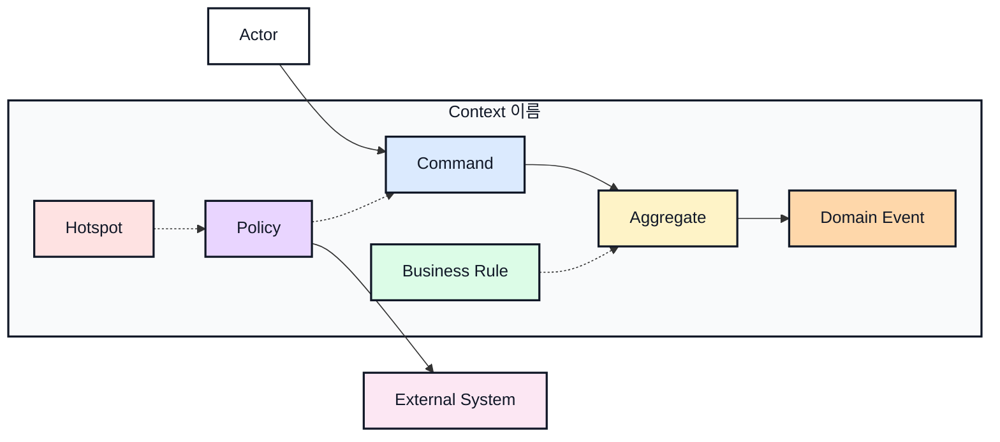

# 이벤트스토밍과 바운디드 컨텍스트 이름

## 기본 정보

- BC ID: `BC.A.XX`
- 책임:
- 사용자:
- 핵심 용어:
- 제외 책임:

## 연관 태그

- 🏷️ 요구사항 참조: [REQ.A.XX](../00-requirements/REQ_A_XX_name.md)
- 🏷️ UC 참조: [UC.A.XX](../30-uc/UC_A_XX_name.md)
- 🏷️ 영속성 참조: [PST.A.XX](../55-persistence/PST_A_XX_name.md)
- 🏷️ 서비스 참조: [SVC.A.XX](../60-service/SVC_A_XX_name.md)
- 🏷️ 시나리오 참조: [SCN.A.XX](../80-scenario/SCN_A_XX_name.md)
- 🏷️ 도메인 참조: [AGG.A.XX](../50-domain-model/AGG_A_XX_name.md)
- 🏷️ API 참조: [API.A.XX](../70-api/API_A_XX_name.md)

## 컨텍스트 경계

- 이 BC가 결정하는 것:
- 이 BC가 참조만 하는 것:
- 다른 BC에 위임하는 것:

## Event Storming Diagram

## Element Catalog

| 유형 | 식별자 | 이름 | 소속 컨텍스트 | 설명 |
| --- | --- | --- | --- | --- |
| Actor |  |  | Context 외부 |  |
| Command |  |  |  |  |
| Aggregate |  |  |  |  |
| Domain Event |  |  |  |  |
| Policy |  |  |  |  |
| Business Rule |  |  |  |  |
| Hotspot |  |  |  |  |
| External System |  |  | Context 외부 |  |
| Read Model |  |  |  |  |

## Element Evidence

| 요소 | 근거 문서 | 근거 내용 |
| --- | --- | --- |
| ACTOR.A.XX | UC.A.XX |  |
| CMD.A.XX | UC.A.XX, PAGE.A.XX, UI.A.XX |  |
| AGG.A.XX | REQ.A.XX, UC.A.XX |  |
| EVT.A.XX | UC.A.XX |  |
| POLICY.A.XX | REQ.A.XX, UC.A.XX |  |
| RULE.A.XX | REQ.A.XX, UC.A.XX |  |
| HOTSPOT.A.XX | REQ.A.XX, PAGE.A.XX, UI.A.XX, UC.A.XX |  |
| EXT.A.XX | REQ.A.XX, UC.A.XX |  |
| RM.A.XX | PAGE.A.XX, UI.A.XX |  |

## Event Relations

| 출발 | 관계 | 도착 | 설명 |
| --- | --- | --- | --- |
| Actor | 요청한다 | Command |  |
| Command | 변경한다 | Aggregate |  |
| Aggregate | 발행한다 | Domain Event |  |
| Policy | 제한한다 | Command 또는 Aggregate |  |
| Business Rule | 규정한다 | Command 또는 Aggregate |  |
| Hotspot | 표시한다 | 결정 필요 요소 |  |

## 유비쿼터스 언어

| 용어 | 의미 | 혼동하기 쉬운 용어 |
| --- | --- | --- |
|  |  |  |

## 후속 설계 메모

| 항목 | 메모 | 연결 문서 |
| --- | --- | --- |
| 도메인 모델 |  | [AGG.A.XX](../50-domain-model/AGG_A_XX_name.md) |
| 영속성 |  | [PST.A.XX](../55-persistence/PST_A_XX_name.md) |
| 서비스 |  | [SVC.A.XX](../60-service/SVC_A_XX_name.md) |
| API |  | [API.A.XX](../70-api/API_A_XX_name.md) |
| 발행 Event |  |  |
| 구독 Event |  |  |
| 외부 연동 |  |  |
| 정책/불변조건 |  |  |
| 열린 질문 |  |  |
