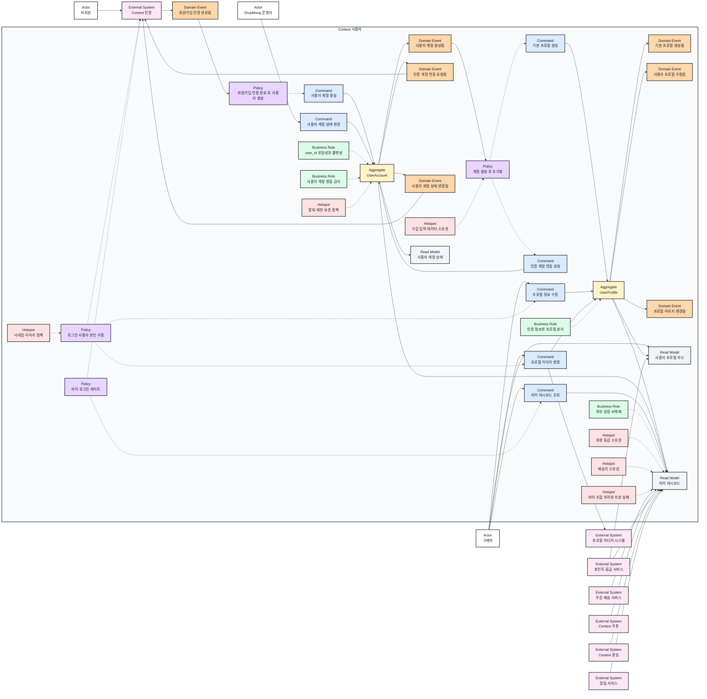

# 한정 상품 드롭 커머스 MVP 이벤트스토밍과 바운디드 컨텍스트

## 기본 정보

- BC ID: `BC.A.01`
- ID 결정: 원천 요구사항 `REQ.A.01`의 MVP 전체 드롭 커머스 여정을 대상으로 하므로 `BC.A.01`을 사용한다.
- 책임: 드롭 탐색, 회원가입과 사용자 생성, 사용자 프로필과 마이 조회, 오픈 대기, 참여 자격 확인, 재고 배정, 주문/결제 생성, 결과 안내, 알림, 운영 관측, CS 타임라인의 초기 컨텍스트 경계를 정한다.
- 사용자: 비회원, 구매자, 브랜드 운영자, DropMong 운영자, CS 담당자, 온콜 담당자.
- 핵심 용어: 사용자 계정, `user_id`, 사용자 프로필, 마이 대시보드, 드롭, 오픈 시각, 참여 자격, 재고 배정, 배정 만료, 주문, 결제, 알림, 운영 차단, 사용자 타임라인.
- 제외 책임: Context 인증의 credential·Identity·Session 상세, PG 내부 승인 로직, 배송사 상세 연동, 정산 회계, 검색/추천 고도화, 장기 물류 최적화.

## 연관 태그

- 🏷️ 요구사항 참조: [REQ.A.01](../00-requirements/REQ_A_01_limited_drop_commerce.md), [REQ.A.05](../00-requirements/REQ_A_05_auth_member.md)
- 🏷️ 페이지 참조: [PAGE.A.01](../10-sitemap/buyer-mobile-web/PAGE_A_01_homepage.md), [PAGE.A.10](../10-sitemap/buyer-mobile-web/PAGE_A_10_my.md), [PAGE.A.300](../10-sitemap/PAGE_A_300_auth_member/PAGE_A_300_auth_member.md)
- 🏷️ UI 참조: [UI.A.01](../20-ui/buyer-mobile-web/UI_A_01_homepage.md), [UI.A.10](../20-ui/buyer-mobile-web/UI_A_10_my.md), [UI.A.300](../20-ui/UI_A_300_auth_member/UI_A_300_auth_member.md)
- 🏷️ UC 참조: [UC.A.01](../30-uc/UC_A_01_buyer_purchase_delivery.md), [UC.A.300](../30-uc/UC_A_300_auth_member.md)
- 🏷️ 영속성 참조: PST.A.01 예정
- 🏷️ 서비스 참조: SVC.A.01 예정
- 🏷️ 시나리오 참조: SCN.A.01 예정
- 🏷️ API 참조: API.A.01 예정

## 컨텍스트 경계

- 이 BC 문서가 결정하는 것: 초기 MVP에서 나눌 컨텍스트 후보, 컨텍스트 간 주요 이벤트, 회원가입 인증 완료 후 사용자 계정을 만드는 책임, 공개 탐색과 인증 필요 행동의 경계, 재고 배정과 주문/결제의 커밋 경계, 마이 조회의 데이터 소유권 후보, 운영/CS 조회 책임.
- 이 BC 문서가 참조하는 것: Context 인증의 회원가입 인증 완료와 세션 주체, 외부 PG 승인 결과, 알림 provider 응답, 브랜드가 제공한 상품/재고/오픈 조건, 주문·배송·쿠폰·포인트·등급·찜·알림의 원천 데이터.
- 다른 BC에 위임하는 것: Context 인증의 Identity/credential/Session 상세, Context 결제의 PG별 승인/취소 세부 처리, Context 알림의 provider별 재시도, 주문·배송·쿠폰·포인트·등급·찜 원장, Context 운영의 인시던트 운영 절차.
- 경계 원칙: MVP 전체 이벤트 스토밍은 상세 도메인 모델을 확정하지 않고, 후속 BC/도메인/서비스 문서가 놓치면 안 되는 책임 경계와 이벤트 연결을 먼저 고정한다.
- 사용자 경계 원칙: Context 사용자는 Context 인증이 이메일·휴대폰 소유 확인을 끝낸 뒤 사용자 계정과 `user_id`를 만들고 기본 프로필을 준비한다. Context 인증은 인증 식별자와 세션을 관리하며 사용자 프로필 의미를 소유하지 않는다.
- 마이 조회 원칙: `PAGE.A.10`의 모든 필드를 Context 사용자 속성으로 간주하지 않는다. 사용자 서비스는 자신이 소유한 정보와 다른 서비스의 요약을 조합할 수 있지만, 주문·쿠폰·포인트 같은 외부 원장을 사용자 프로필로 복제하지 않는다.

## 사용자 서비스 브레인스토밍 기준

이 표는 물리 서비스 배치를 확정하지 않는다. 현재 근거가 강한 책임, 다른 서비스가 소유할 가능성이 높은 책임, 추가 논의가 필요한 책임을 구분한다.

| 마이/회원 데이터 | 현재 소유권 후보 | 판단 |
| --- | --- | --- |
| `user_id`, 사용자 계정 상태, 생성 시각 | Context 사용자 | 회원가입 인증 완료 후 생성하며 주문·쿠폰·알림의 사용자 기준 식별자가 된다. |
| 이름, 닉네임, 프로필 이미지 참조, 인사말 | Context 사용자 | 인증 정보가 아닌 사용자 표시 프로필이다. |
| 전체 주문 수, 배송중 수, 최근 주문 | 주문·배송 서비스 | 마이 화면은 요약만 조회하고 주문·배송 원장은 변경하지 않는다. |
| 보유 쿠폰 수 | Context 쿠폰 | 쿠폰 발급·사용·만료 원장의 요약이다. |
| 포인트 잔액, 회원 등급, 다음 등급까지 남은 포인트 | 포인트·멤버십 서비스 후보 | 등급을 사용자 속성으로 둘지 별도 멤버십 정책으로 둘지 추가 논의가 필요하다. |
| 찜리스트 | Context 관심 | 사용자별 관심 상태와 랭킹 집계 책임을 이미 가진다. |
| 읽지 않은 알림 여부 | 알림 서비스 | 알림 수신·읽음 상태의 요약이다. |
| 결제수단 | 결제수단 서비스 | 카드 원문이 아닌 PG token과 결제수단 상태를 소유한다. |
| 문의 내역 | 고객지원 서비스 | 문의와 처리 상태는 고객지원 업무 원장이다. |
| 친구 초대 혜택 | 추천·프로모션 서비스 | 추천 코드 검증과 보상 지급 정책을 소유한다. |
| 배송지 | Context 사용자 또는 배송지 서비스 | 사용자 기본 정보와 주문 배송 스냅샷 사이의 경계를 정해야 한다. |
| 약관 동의, 마케팅 수신 동의 | Context 사용자 또는 동의 관리 Context | 동의 버전·철회·감사 보존 책임을 정해야 한다. |
| 개인 설정과 메뉴 노출 | Context 사용자 또는 화면/BFF 설정 | 도메인 선호 정보와 단순 화면 설정을 구분해야 한다. |
| 마이 대시보드 조합 | 사용자 서비스 또는 BFF | 조합 실행 위치, 캐시, 부분 실패, 기준 시각 표시 정책을 정해야 한다. |

## Event Storming Diagram

```mermaid
flowchart LR
  buyer[Actor<br>구매자]
  brandOperator[Actor<br>브랜드 운영자]
  operator[Actor<br>DropMong 운영자]
  cs[Actor<br>CS 담당자]
  oncall[Actor<br>온콜 담당자]
  authContext[External System<br>Context 인증]
  paymentGateway[External System<br>PG 시스템]
  notificationProvider[External System<br>알림 Provider]

  subgraph DiscoveryBC[Context 드롭 탐색]
    direction LR
    cmdBrowseDrops[Command<br>드롭 탐색]
    cmdViewDrop[Command<br>드롭 상세 확인]
    rmDropListing[Read Model<br>드롭 목록/상세 조회]
    evtDropViewed[Domain Event<br>드롭 상세 조회됨]
    policyPublicBrowse[Policy<br>비회원 공개 탐색 허용]
  end

  subgraph DropBC[Context 드롭 관리]
    direction LR
    cmdCreateDrop[Command<br>드롭 생성]
    cmdOpenDrop[Command<br>드롭 오픈]
    drop[Aggregate<br>Drop]
    evtDropPublished[Domain Event<br>드롭 게시됨]
    evtDropOpened[Domain Event<br>드롭 오픈됨]
    ruleServerTime[Business Rule<br>서버 시간 기준 오픈]
    hotspotOpenPolicy[Hotspot<br>선착순/대기열/추첨 정책]
  end

  subgraph ParticipationBC[Context 참여]
    direction LR
    cmdCheckEligibility[Command<br>참여 자격 확인]
    cmdAttemptPurchase[Command<br>구매 시도]
    participation[Aggregate<br>Participation]
    evtEligibilityChecked[Domain Event<br>참여 자격 확인됨]
    evtPurchaseAttempted[Domain Event<br>구매 시도 접수됨]
    policyAuthGate[Policy<br>구매 행동 인증 게이트]
    ruleDuplicateGuard[Business Rule<br>동일 드롭 중복 구매 제한]
    hotspotBotDefense[Hotspot<br>봇 방어 적용 기준]
  end

  subgraph InventoryBC[Context 재고 배정]
    direction LR
    cmdAllocateStock[Command<br>재고 배정]
    cmdReleaseStock[Command<br>재고 회수]
    allocation[Aggregate<br>StockAllocation]
    evtStockAllocated[Domain Event<br>재고 배정됨]
    evtStockAllocationFailed[Domain Event<br>재고 배정 실패됨]
    evtStockReleased[Domain Event<br>재고 회수됨]
    ruleAtomicStock[Business Rule<br>재고 원자 배정]
    hotspotHoldTtl[Hotspot<br>재고 배정 유효 시간]
  end

  subgraph CheckoutBC[Context 주문 확인]
    direction LR
    cmdConfirmAmount[Command<br>주문 금액 확인]
    cmdCreateOrder[Command<br>주문 생성]
    order[Aggregate<br>Order]
    evtAmountConfirmed[Domain Event<br>주문 금액 확인됨]
    evtOrderCreated[Domain Event<br>주문 생성됨]
    evtOrderExpired[Domain Event<br>주문 만료됨]
    ruleServerPrice[Business Rule<br>서버 계산 금액 확정]
    ruleIdempotency[Business Rule<br>주문/결제 멱등 처리]
  end

  subgraph PaymentBC[Context 결제]
    direction LR
    cmdRequestPayment[Command<br>결제 요청]
    payment[Aggregate<br>Payment]
    evtPaymentRequested[Domain Event<br>결제 요청됨]
    evtPaymentApproved[Domain Event<br>결제 승인됨]
    evtPaymentFailed[Domain Event<br>결제 실패됨]
    policyPaymentIsolation[Policy<br>PG 장애 격리]
    hotspotPaymentRecovery[Hotspot<br>결제 실패 재고 회수 기준]
  end

  subgraph NotificationBC[Context 알림]
    direction LR
    cmdSubscribeAlert[Command<br>드롭 알림 신청]
    cmdSendNotification[Command<br>알림 발송]
    notification[Aggregate<br>Notification]
    evtAlertSubscribed[Domain Event<br>드롭 알림 신청됨]
    evtNotificationSent[Domain Event<br>알림 발송됨]
    evtNotificationFailed[Domain Event<br>알림 발송 실패됨]
    ruleNotificationTrace[Business Rule<br>알림 중복/누락 추적]
  end

  subgraph OperationsBC[Context 운영]
    direction LR
    cmdBlockDrop[Command<br>드롭 임시 차단]
    cmdRetryFailure[Command<br>실패 재처리]
    opControl[Aggregate<br>OperationalControl]
    evtDropBlocked[Domain Event<br>드롭 차단됨]
    evtFailureRetried[Domain Event<br>실패 재처리됨]
    rmOpsDashboard[Read Model<br>운영 대시보드]
    policyFeatureFlag[Policy<br>배포 없는 차단/공지]
    ruleOutbox[Business Rule<br>상태 변경 후 이벤트 발행]
  end

  subgraph CustomerSupportBC[Context 고객 지원]
    direction LR
    cmdInspectTimeline[Command<br>사용자 타임라인 조회]
    rmUserTimeline[Read Model<br>사용자 이벤트 타임라인]
    evtTimelineInspected[Domain Event<br>사용자 타임라인 조회됨]
    ruleExplainableResult[Business Rule<br>성공/실패 사유 설명 가능]
  end

  buyer --> cmdBrowseDrops
  buyer --> cmdViewDrop
  buyer --> cmdSubscribeAlert
  buyer --> cmdCheckEligibility
  buyer --> cmdAttemptPurchase
  buyer --> cmdConfirmAmount
  buyer --> cmdRequestPayment
  brandOperator --> cmdCreateDrop
  brandOperator --> rmOpsDashboard
  operator --> cmdOpenDrop
  operator --> cmdBlockDrop
  operator --> cmdRetryFailure
  oncall --> rmOpsDashboard
  cs --> cmdInspectTimeline

  cmdBrowseDrops --> rmDropListing
  cmdViewDrop --> rmDropListing
  cmdViewDrop --> evtDropViewed
  policyPublicBrowse -.-> cmdBrowseDrops
  policyPublicBrowse -.-> cmdViewDrop

  cmdCreateDrop --> drop
  drop --> evtDropPublished
  cmdOpenDrop --> drop
  drop --> evtDropOpened
  ruleServerTime -.-> cmdOpenDrop
  hotspotOpenPolicy -.-> drop

  cmdCheckEligibility --> authContext
  cmdCheckEligibility --> participation
  participation --> evtEligibilityChecked
  cmdAttemptPurchase --> participation
  participation --> evtPurchaseAttempted
  policyAuthGate -.-> cmdCheckEligibility
  ruleDuplicateGuard -.-> participation
  hotspotBotDefense -.-> policyAuthGate

  cmdAllocateStock --> allocation
  allocation --> evtStockAllocated
  allocation --> evtStockAllocationFailed
  cmdReleaseStock --> allocation
  allocation --> evtStockReleased
  ruleAtomicStock -.-> allocation
  hotspotHoldTtl -.-> allocation

  cmdConfirmAmount --> order
  order --> evtAmountConfirmed
  cmdCreateOrder --> order
  order --> evtOrderCreated
  order --> evtOrderExpired
  ruleServerPrice -.-> cmdConfirmAmount
  ruleIdempotency -.-> order

  cmdRequestPayment --> payment
  cmdRequestPayment --> paymentGateway
  paymentGateway --> payment
  payment --> evtPaymentRequested
  payment --> evtPaymentApproved
  payment --> evtPaymentFailed
  policyPaymentIsolation -.-> paymentGateway
  hotspotPaymentRecovery -.-> payment

  cmdSubscribeAlert --> notification
  notification --> evtAlertSubscribed
  cmdSendNotification --> notificationProvider
  notificationProvider --> notification
  notification --> evtNotificationSent
  notification --> evtNotificationFailed
  ruleNotificationTrace -.-> notification

  cmdBlockDrop --> opControl
  opControl --> evtDropBlocked
  cmdRetryFailure --> opControl
  opControl --> evtFailureRetried
  policyFeatureFlag -.-> cmdBlockDrop
  ruleOutbox -.-> opControl

  cmdInspectTimeline --> rmUserTimeline
  rmUserTimeline --> evtTimelineInspected
  ruleExplainableResult -.-> rmUserTimeline

  classDef actor fill:#FFFFFF,stroke:#111827,color:#111827,stroke-width:2px;
  classDef command fill:#DBEAFE,stroke:#111827,color:#111827,stroke-width:2px;
  classDef aggregate fill:#FEF3C7,stroke:#111827,color:#111827,stroke-width:2px;
  classDef event fill:#FED7AA,stroke:#111827,color:#111827,stroke-width:2px;
  classDef policy fill:#E9D5FF,stroke:#111827,color:#111827,stroke-width:2px;
  classDef rule fill:#DCFCE7,stroke:#111827,color:#111827,stroke-width:2px;
  classDef hotspot fill:#FEE2E2,stroke:#111827,color:#111827,stroke-width:2px;
  classDef external fill:#FCE7F3,stroke:#111827,color:#111827,stroke-width:2px;
  classDef readmodel fill:#F1F5F9,stroke:#111827,color:#111827,stroke-width:2px;

  class buyer,brandOperator,operator,cs,oncall actor;
  class cmdBrowseDrops,cmdViewDrop,cmdCreateDrop,cmdOpenDrop,cmdCheckEligibility,cmdAttemptPurchase,cmdAllocateStock,cmdReleaseStock,cmdConfirmAmount,cmdCreateOrder,cmdRequestPayment,cmdSubscribeAlert,cmdSendNotification,cmdBlockDrop,cmdRetryFailure,cmdInspectTimeline command;
  class drop,participation,allocation,order,payment,notification,opControl aggregate;
  class evtDropViewed,evtDropPublished,evtDropOpened,evtEligibilityChecked,evtPurchaseAttempted,evtStockAllocated,evtStockAllocationFailed,evtStockReleased,evtAmountConfirmed,evtOrderCreated,evtOrderExpired,evtPaymentRequested,evtPaymentApproved,evtPaymentFailed,evtAlertSubscribed,evtNotificationSent,evtNotificationFailed,evtDropBlocked,evtFailureRetried,evtTimelineInspected event;
  class policyPublicBrowse,policyAuthGate,policyPaymentIsolation,policyFeatureFlag policy;
  class ruleServerTime,ruleDuplicateGuard,ruleAtomicStock,ruleServerPrice,ruleIdempotency,ruleNotificationTrace,ruleOutbox,ruleExplainableResult rule;
  class hotspotOpenPolicy,hotspotBotDefense,hotspotHoldTtl,hotspotPaymentRecovery hotspot;
  class authContext,paymentGateway,notificationProvider external;
  class rmDropListing,rmOpsDashboard,rmUserTimeline readmodel;
  style DiscoveryBC fill:#F9FAFB,stroke:#111827,color:#111827,stroke-width:2px;
  style DropBC fill:#F9FAFB,stroke:#111827,color:#111827,stroke-width:2px;
  style ParticipationBC fill:#F9FAFB,stroke:#111827,color:#111827,stroke-width:2px;
  style InventoryBC fill:#F9FAFB,stroke:#111827,color:#111827,stroke-width:2px;
  style CheckoutBC fill:#F9FAFB,stroke:#111827,color:#111827,stroke-width:2px;
  style PaymentBC fill:#F9FAFB,stroke:#111827,color:#111827,stroke-width:2px;
  style NotificationBC fill:#F9FAFB,stroke:#111827,color:#111827,stroke-width:2px;
  style OperationsBC fill:#F9FAFB,stroke:#111827,color:#111827,stroke-width:2px;
  style CustomerSupportBC fill:#F9FAFB,stroke:#111827,color:#111827,stroke-width:2px;
```

### Context 사용자 브레인스토밍

회원가입 인증 완료 뒤 사용자 계정과 기본 프로필을 만들고, 마이 화면에서 사용자 정보와 다른 서비스의 요약을 조합하는 후보 관계를 표시한다. 약관·등급·배송지·개인 설정과 마이 조합 실행 위치는 아직 확정하지 않고 Hotspot으로 남긴다.

## Element Catalog

| 유형 | 식별자 | 이름 | 소속 컨텍스트 | 설명 |
| --- | --- | --- | --- | --- |
| Actor | ACTOR.A.01-01 | 구매자 | Context 외부 | 드롭을 탐색하고 알림 신청, 구매 시도, 결제를 수행한다. |
| Actor | ACTOR.A.01-02 | 브랜드 운영자 | Context 외부 | 상품, 수량, 오픈 시각, 판매 조건을 등록하고 결과를 확인한다. |
| Actor | ACTOR.A.01-03 | DropMong 운영자 | Context 외부 | 피크 운영, 차단, 재처리, 공지를 수행한다. |
| Actor | ACTOR.A.01-04 | CS 담당자 | Context 외부 | 사용자 문의에 필요한 이벤트 타임라인을 조회한다. |
| Actor | ACTOR.A.01-05 | 온콜 담당자 | Context 외부 | 피크 장애와 주요 지표를 확인한다. |
| Actor | ACTOR.A.01-06 | 비회원 | Context 외부 | 공개 드롭을 탐색하고 필요한 순간 회원가입을 시작한다. |
| Context | CTX.A.01-01 | Context 드롭 탐색 | MVP 전체 | 공개 탐색과 드롭 목록/상세 조회를 담당한다. |
| Context | CTX.A.01-02 | Context 드롭 관리 | MVP 전체 | 드롭 생성, 게시, 오픈 조건을 담당한다. |
| Context | CTX.A.01-03 | Context 참여 | MVP 전체 | 참여 자격, 중복 구매 제한, 구매 시도 접수를 담당한다. |
| Context | CTX.A.01-04 | Context 재고 배정 | MVP 전체 | 오픈 순간 재고 배정과 회수를 담당한다. |
| Context | CTX.A.01-05 | Context 주문 확인 | MVP 전체 | 주문 금액 확인, 주문 생성, 만료를 담당한다. |
| Context | CTX.A.01-06 | Context 결제 | MVP 전체 | 결제 요청과 승인/실패 반영을 담당한다. |
| Context | CTX.A.01-07 | Context 알림 | MVP 전체 | 드롭 알림 신청, 발송, 실패 추적을 담당한다. |
| Context | CTX.A.01-08 | Context 운영 | MVP 전체 | 차단, 재처리, 운영 대시보드를 담당한다. |
| Context | CTX.A.01-09 | Context 고객 지원 | MVP 전체 | 사용자 이벤트 타임라인 조회를 담당한다. |
| Context | CTX.A.01-10 | Context 인증 | MVP 전체 외부 | 로그인 상태와 인증/권한 판단을 제공한다. |
| Context | CTX.A.01-11 | Context 사용자 | MVP 전체 | 사용자 계정과 `user_id`, 계정 상태, 표시 프로필과 마이 조회 계약을 담당하는 후보 컨텍스트다. |
| Command | CMD.A.01-01 | 드롭 탐색 | Context 드롭 탐색 | 공개 드롭 목록을 조회한다. |
| Command | CMD.A.01-02 | 드롭 상세 확인 | Context 드롭 탐색 | 오픈 시간, 판매 수량, 참여 조건을 확인한다. |
| Command | CMD.A.01-03 | 드롭 생성 | Context 드롭 관리 | 브랜드가 드롭 상품과 판매 조건을 등록한다. |
| Command | CMD.A.01-04 | 드롭 오픈 | Context 드롭 관리 | 서버 시간 기준으로 드롭을 오픈 상태로 전환한다. |
| Command | CMD.A.01-05 | 참여 자격 확인 | Context 참여 | 로그인, 인증 보유 여부, 구매 제한, 차단 상태를 확인한다. |
| Command | CMD.A.01-06 | 구매 시도 | Context 참여 | 오픈 이후 동일 드롭 구매를 시도한다. |
| Command | CMD.A.01-07 | 재고 배정 | Context 재고 배정 | 판매 가능 수량 안에서 원자적으로 재고를 배정한다. |
| Command | CMD.A.01-08 | 재고 회수 | Context 재고 배정 | 만료, 결제 실패, 보상 처리에 따라 배정 재고를 회수한다. |
| Command | CMD.A.01-09 | 주문 금액 확인 | Context 주문 확인 | 상품, 배송비, 쿠폰/혜택, 최종 금액을 서버 기준으로 계산한다. |
| Command | CMD.A.01-10 | 주문 생성 | Context 주문 확인 | 배정된 재고와 금액 스냅샷으로 주문을 만든다. |
| Command | CMD.A.01-11 | 결제 요청 | Context 결제 | 기본 결제수단 또는 선택 결제수단으로 PG 결제를 요청한다. |
| Command | CMD.A.01-12 | 드롭 알림 신청 | Context 알림 | 오픈 전 알림 수신을 신청한다. |
| Command | CMD.A.01-13 | 알림 발송 | Context 알림 | 오픈, 성공, 실패, 배송 상태 변경 알림을 발송한다. |
| Command | CMD.A.01-14 | 드롭 임시 차단 | Context 운영 | 특정 드롭, API, 사용자 그룹을 배포 없이 차단한다. |
| Command | CMD.A.01-15 | 실패 재처리 | Context 운영 | DLQ 또는 재처리 큐에 남은 실패를 처리한다. |
| Command | CMD.A.01-16 | 사용자 타임라인 조회 | Context 고객 지원 | 알림, 구매 시도, 재고, 주문, 결제 결과를 사용자 단위로 조회한다. |
| Command | CMD.A.01-17 | 사용자 계정 생성 | Context 사용자 | 회원가입 인증 완료 결과를 받아 새 `user_id`와 사용자 계정을 만든다. |
| Command | CMD.A.01-18 | 기본 프로필 생성 | Context 사용자 | 사용자 계정에 연결된 이름·닉네임·기본 이미지 상태를 만든다. |
| Command | CMD.A.01-19 | 인증 계정 연동 요청 | Context 사용자 | 생성한 `user_id`에 검증된 인증 식별자를 연결하도록 Context 인증에 요청한다. |
| Command | CMD.A.01-20 | 프로필 정보 수정 | Context 사용자 | 닉네임과 인사말 같은 표시 정보를 변경한다. |
| Command | CMD.A.01-21 | 프로필 이미지 변경 | Context 사용자 | 검증된 이미지 자산 참조로 프로필 이미지를 교체한다. |
| Command | CMD.A.01-22 | 사용자 계정 상태 변경 | Context 사용자 | 사용자 계정을 활성·제한·탈퇴 후보 상태로 변경한다. |
| Command | CMD.A.01-23 | 마이 대시보드 조회 | Context 사용자 | 로그인 사용자의 프로필과 다른 서비스의 개인 요약을 조회한다. |
| Aggregate | AGG.A.01-01 | Drop | Context 드롭 관리 | 드롭 상품, 수량, 오픈 시각, 판매 조건을 관리한다. |
| Aggregate | AGG.A.01-02 | Participation | Context 참여 | 사용자별 참여 자격과 구매 시도 상태를 관리한다. |
| Aggregate | AGG.A.01-03 | StockAllocation | Context 재고 배정 | 재고 배정, 만료, 회수 상태를 관리한다. |
| Aggregate | AGG.A.01-04 | Order | Context 주문 확인 | 주문 금액, 주문 상태, 만료 상태를 관리한다. |
| Aggregate | AGG.A.01-05 | Payment | Context 결제 | 결제 요청, 승인, 실패 상태를 관리한다. |
| Aggregate | AGG.A.01-06 | Notification | Context 알림 | 알림 신청, 발송, 실패, 재시도 상태를 관리한다. |
| Aggregate | AGG.A.01-07 | OperationalControl | Context 운영 | 차단, 공지, 재처리 명령 상태를 관리한다. |
| Aggregate | AGG.A.01-08 | UserAccount | Context 사용자 | `user_id`, 계정 상태, 생성·변경 버전과 인증 연동 요청 상태를 관리한다. |
| Aggregate | AGG.A.01-09 | UserProfile | Context 사용자 | 이름·닉네임·프로필 이미지 참조·인사말 같은 표시 프로필을 관리한다. |
| Domain Event | EVT.A.01-01 | 드롭 상세 조회됨 | Context 드롭 탐색 | 구매자가 드롭 상세를 확인한 결과다. |
| Domain Event | EVT.A.01-02 | 드롭 게시됨 | Context 드롭 관리 | 드롭이 공개 가능한 상태로 등록된 결과다. |
| Domain Event | EVT.A.01-03 | 드롭 오픈됨 | Context 드롭 관리 | 서버 시간 기준 오픈 상태로 전환된 결과다. |
| Domain Event | EVT.A.01-04 | 참여 자격 확인됨 | Context 참여 | 구매 가능 여부 판단이 완료된 결과다. |
| Domain Event | EVT.A.01-05 | 구매 시도 접수됨 | Context 참여 | 구매 시도가 재고 배정 대상으로 접수된 결과다. |
| Domain Event | EVT.A.01-06 | 재고 배정됨 | Context 재고 배정 | 판매 가능 수량 안에서 재고가 배정된 결과다. |
| Domain Event | EVT.A.01-07 | 재고 배정 실패됨 | Context 재고 배정 | 품절, 중복, 조건 미충족 등으로 배정에 실패한 결과다. |
| Domain Event | EVT.A.01-08 | 재고 회수됨 | Context 재고 배정 | 만료나 실패로 배정 재고가 회수된 결과다. |
| Domain Event | EVT.A.01-09 | 주문 금액 확인됨 | Context 주문 확인 | 서버 계산 기준 금액이 확정된 결과다. |
| Domain Event | EVT.A.01-10 | 주문 생성됨 | Context 주문 확인 | 주문이 생성된 결과다. |
| Domain Event | EVT.A.01-11 | 주문 만료됨 | Context 주문 확인 | 제한 시간 안에 결제가 끝나지 않은 결과다. |
| Domain Event | EVT.A.01-12 | 결제 요청됨 | Context 결제 | PG로 결제 요청이 전달된 결과다. |
| Domain Event | EVT.A.01-13 | 결제 승인됨 | Context 결제 | PG 승인 결과가 반영된 결과다. |
| Domain Event | EVT.A.01-14 | 결제 실패됨 | Context 결제 | PG 실패나 timeout이 반영된 결과다. |
| Domain Event | EVT.A.01-15 | 드롭 알림 신청됨 | Context 알림 | 구매자가 알림 수신을 신청한 결과다. |
| Domain Event | EVT.A.01-16 | 알림 발송됨 | Context 알림 | provider 발송 성공이 확인된 결과다. |
| Domain Event | EVT.A.01-17 | 알림 발송 실패됨 | Context 알림 | provider 발송 실패가 확인된 결과다. |
| Domain Event | EVT.A.01-18 | 드롭 차단됨 | Context 운영 | 운영자가 특정 드롭이나 기능을 차단한 결과다. |
| Domain Event | EVT.A.01-19 | 실패 재처리됨 | Context 운영 | 실패 이벤트가 운영 재처리된 결과다. |
| Domain Event | EVT.A.01-20 | 사용자 타임라인 조회됨 | Context 고객 지원 | CS가 사용자 이벤트 타임라인을 조회한 결과다. |
| Domain Event | EVT.A.01-21 | 회원가입 인증 완료됨 | Context 인증 | 이메일·휴대폰 소유 확인이 끝나 Context 사용자가 계정을 만들 수 있게 된 결과다. |
| Domain Event | EVT.A.01-22 | 사용자 계정 생성됨 | Context 사용자 | 새 `user_id`와 사용자 계정이 만들어진 결과다. |
| Domain Event | EVT.A.01-23 | 기본 프로필 생성됨 | Context 사용자 | 사용자 계정에 연결된 기본 표시 프로필이 만들어진 결과다. |
| Domain Event | EVT.A.01-24 | 인증 계정 연동 요청됨 | Context 사용자 | 새 `user_id`와 가입 인증 결과의 연동 요청이 기록된 결과다. |
| Domain Event | EVT.A.01-25 | 사용자 프로필 수정됨 | Context 사용자 | 이름·닉네임·인사말 변경이 확정된 결과다. |
| Domain Event | EVT.A.01-26 | 프로필 이미지 변경됨 | Context 사용자 | 새 이미지 자산 참조가 프로필에 반영된 결과다. |
| Domain Event | EVT.A.01-27 | 사용자 계정 상태 변경됨 | Context 사용자 | 계정의 활성·제한·탈퇴 후보 상태가 변경된 결과다. |
| Policy | POLICY.A.01-01 | 비회원 공개 탐색 허용 | Context 드롭 탐색 | 홈, 드롭 목록, 상세, 검색, 공지는 인증 없이 접근할 수 있다. |
| Policy | POLICY.A.01-02 | 구매 행동 인증 게이트 | Context 참여 | 구매 시도와 결제는 인증/권한 확인 후 허용한다. |
| Policy | POLICY.A.01-03 | PG 장애 격리 | Context 결제 | PG 지연과 실패가 전체 구매 경로로 무제한 전파되지 않게 한다. |
| Policy | POLICY.A.01-04 | 배포 없는 차단/공지 | Context 운영 | 피크 중 드롭, API, 사용자 그룹을 운영 설정으로 제어한다. |
| Policy | POLICY.A.01-05 | 회원가입 인증 완료 후 사용자 생성 | Context 사용자 | Context 인증의 검증 완료 결과가 있을 때만 사용자 계정을 만든다. |
| Policy | POLICY.A.01-06 | 계정 생성 후 초기화 | Context 사용자 | 사용자 계정 생성 뒤 기본 프로필과 인증 계정 연동 요청을 준비한다. |
| Policy | POLICY.A.01-07 | 로그인 사용자 본인 수정 | Context 사용자 | 인증된 `user_id`와 수정 대상이 같을 때만 프로필 변경을 허용한다. |
| Policy | POLICY.A.01-08 | 마이 로그인 게이트 | Context 사용자 | 마이의 사용자 정보와 개인 요약은 로그인한 사용자에게만 제공한다. |
| Business Rule | RULE.A.01-01 | 서버 시간 기준 오픈 | Context 드롭 관리 | 오픈 전 구매 처리는 서버 시간 기준으로 실패한다. |
| Business Rule | RULE.A.01-02 | 동일 드롭 중복 구매 제한 | Context 참여 | 같은 사용자의 같은 드롭 중복 구매는 허용하지 않는다. |
| Business Rule | RULE.A.01-03 | 재고 원자 배정 | Context 재고 배정 | 판매 가능 수량보다 많은 성공 배정이 발생하지 않아야 한다. |
| Business Rule | RULE.A.01-04 | 서버 계산 금액 확정 | Context 주문 확인 | 결제 전 상품, 배송비, 혜택, 최종 금액은 서버 계산으로 확정한다. |
| Business Rule | RULE.A.01-05 | 주문/결제 멱등 처리 | Context 주문 확인 | 같은 idempotency key는 같은 결과를 반환한다. |
| Business Rule | RULE.A.01-06 | 알림 중복/누락 추적 | Context 알림 | 알림 요청, provider 응답, 실패, 재시도, 최종 상태를 추적한다. |
| Business Rule | RULE.A.01-07 | 상태 변경 후 이벤트 발행 | Context 운영 | 상태 변경과 이벤트 발행의 순서가 어긋나지 않게 한다. |
| Business Rule | RULE.A.01-08 | 성공/실패 사유 설명 가능 | Context 고객 지원 | 사용자와 CS가 결과 사유와 추적 ID를 확인할 수 있어야 한다. |
| Business Rule | RULE.A.01-09 | user_id 유일성과 불변성 | Context 사용자 | 발급된 `user_id`는 다른 사용자에게 재사용하거나 변경하지 않는다. |
| Business Rule | RULE.A.01-10 | 사용자 계정 병합 금지 | Context 사용자 | 기존 `user_id`끼리 합치지 않고 인증 식별자 연동만 별도 상태로 처리한다. |
| Business Rule | RULE.A.01-11 | 인증 정보와 프로필 분리 | Context 사용자 | 이메일·휴대폰·비밀번호·세션·권한을 사용자 프로필에 저장하지 않는다. |
| Business Rule | RULE.A.01-12 | 외부 원장 비복제 | Context 사용자 | 주문·쿠폰·포인트·등급·찜·알림 값은 마이에 조합하되 사용자 원장으로 저장하지 않는다. |
| Hotspot | HOTSPOT.A.01-01 | 선착순/대기열/추첨 정책 | Context 드롭 관리 | 1차 드롭 참여 정책을 결정해야 한다. |
| Hotspot | HOTSPOT.A.01-02 | 봇 방어 적용 기준 | Context 참여 | 계정, 디바이스, IP, 결제수단, 행동 패턴 중 적용 범위를 정해야 한다. |
| Hotspot | HOTSPOT.A.01-03 | 재고 배정 유효 시간 | Context 재고 배정 | 재고 배정 hold TTL을 전역/브랜드/상품 단위 중 어디에 둘지 정해야 한다. |
| Hotspot | HOTSPOT.A.01-04 | 결제 실패 재고 회수 기준 | Context 결제 | 결제 실패 후 즉시 회수와 짧은 유예 중 정책을 정해야 한다. |
| Hotspot | HOTSPOT.A.01-05 | 가입 입력 데이터 소유권 | Context 사용자 | 이름·추천인 코드·약관·마케팅 동의의 저장과 변경 책임을 정해야 한다. |
| Hotspot | HOTSPOT.A.01-06 | 회원 등급 소유권 | Context 사용자 | 회원 등급을 사용자 속성으로 둘지 별도 포인트·멤버십 정책으로 둘지 정해야 한다. |
| Hotspot | HOTSPOT.A.01-07 | 배송지 소유권 | Context 사용자 | 사용자 주소록과 주문 배송 스냅샷의 생성·변경 경계를 정해야 한다. |
| Hotspot | HOTSPOT.A.01-08 | 마이 조합 위치와 부분 실패 | Context 사용자 | 사용자 서비스와 BFF 중 조합 위치, 캐시, 기준 시각, 일부 조회 실패 처리를 정해야 한다. |
| Hotspot | HOTSPOT.A.01-09 | 탈퇴·제한·보존 정책 | Context 사용자 | 계정 상태, 탈퇴 유예, 재가입, 개인정보 삭제와 주문 기록 보존 기준을 정해야 한다. |
| Hotspot | HOTSPOT.A.01-10 | 닉네임·이미지 정책 | Context 사용자 | 닉네임 중복·금칙어·변경 주기와 이미지 형식·크기·검수 기준을 정해야 한다. |
| External System | EXT.A.01-01 | PG 시스템 | Context 외부 | 결제 승인, 실패, timeout의 원천 결과를 제공한다. |
| External System | EXT.A.01-02 | 알림 Provider | Context 외부 | 알림 발송과 provider 응답을 제공한다. |
| External System | EXT.A.01-03 | Context 인증 | Context 외부 | 회원가입 인증 완료, 세션 주체 확인, 인증 식별자와 `user_id` 연동을 담당한다. |
| External System | EXT.A.01-04 | 프로필 미디어 시스템 | Context 외부 | 프로필 이미지 검사·변환·보관과 자산 참조 발급을 담당한다. |
| External System | EXT.A.01-05 | 주문·배송 서비스 | Context 외부 | 전체 주문 수, 배송중 수, 최근 주문 요약의 원천이다. |
| External System | EXT.A.01-06 | Context 쿠폰 | Context 외부 | 보유 쿠폰 수와 쿠폰 상태의 원천이다. |
| External System | EXT.A.01-07 | 포인트·등급 서비스 | Context 외부 | 포인트 잔액, 회원 등급, 다음 등급까지 남은 포인트의 원천 후보다. |
| External System | EXT.A.01-08 | Context 관심 | Context 외부 | 찜 목록과 사용자 관심 상태의 원천이다. |
| External System | EXT.A.01-09 | 알림 서비스 | Context 외부 | 읽지 않은 알림 여부와 알림함 상태의 원천이다. |
| Read Model | RM.A.01-01 | 드롭 목록/상세 조회 | Context 드롭 탐색 | 구매자가 공개 탐색에서 보는 조회 모델이다. |
| Read Model | RM.A.01-02 | 운영 대시보드 | Context 운영 | 드롭별 요청량, 성공/실패, 품절 시각, 결제/알림 실패율을 보여준다. |
| Read Model | RM.A.01-03 | 사용자 이벤트 타임라인 | Context 고객 지원 | 사용자별 알림, 구매 시도, 재고, 주문, 결제 상태를 보여준다. |
| Read Model | RM.A.01-04 | 사용자 프로필 카드 | Context 사용자 | 이름·닉네임·프로필 이미지·인사말과 외부 등급 표시를 조합한다. |
| Read Model | RM.A.01-05 | 마이 대시보드 | Context 사용자 | 사용자 프로필과 주문·배송·쿠폰·포인트·등급·찜·알림 요약을 한 화면용으로 조합한다. |
| Read Model | RM.A.01-06 | 사용자 계정 상태 | Context 사용자 | 활성·제한·탈퇴 후보 상태와 변경 사유를 사용자·CS·운영 권한에 맞게 제공한다. |

## Element Evidence

| 요소 | 근거 문서 | 근거 내용 |
| --- | --- | --- |
| ACTOR.A.01-01 구매자 | [REQ.A.01](../00-requirements/REQ_A_01_limited_drop_commerce.md) | 구매자는 드롭 탐색, 알림 신청, 오픈 대기, 구매 시도, 결제, 결과 확인을 수행한다. |
| ACTOR.A.01-02 브랜드 운영자 | [REQ.A.01](../00-requirements/REQ_A_01_limited_drop_commerce.md) | 브랜드 운영자는 드롭 상품, 오픈 시간, 판매 수량, 구매 제한, 노출 상태를 등록/수정한다. |
| ACTOR.A.01-03 DropMong 운영자 | [REQ.A.01](../00-requirements/REQ_A_01_limited_drop_commerce.md) | 운영자는 트래픽, 재고, 주문, 결제, 알림 실패율을 보고 차단/완화/재처리를 수행한다. |
| ACTOR.A.01-04 CS 담당자 | [REQ.A.01](../00-requirements/REQ_A_01_limited_drop_commerce.md) | CS는 사용자 단위 알림 신청, 구매 시도, 재고 배정, 주문, 결제, 실패 사유 타임라인을 조회한다. |
| ACTOR.A.01-05 온콜 담당자 | [REQ.A.01](../00-requirements/REQ_A_01_limited_drop_commerce.md) | 온콜 담당자는 피크 장애와 주요 운영 지표를 확인하고 복구를 지원한다. |
| CTX.A.01-01 Context 드롭 탐색 | [REQ.A.01](../00-requirements/REQ_A_01_limited_drop_commerce.md) | 비로그인 탐색, 홈/목록/상세/검색 공개 접근 요구가 있다. |
| CTX.A.01-02 Context 드롭 관리 | [REQ.A.01](../00-requirements/REQ_A_01_limited_drop_commerce.md) | 드롭 상품, 오픈 시간, 판매 수량, 참여 조건 등록과 오픈 상태 관리가 필요하다. |
| CTX.A.01-03 Context 참여 | [REQ.A.01](../00-requirements/REQ_A_01_limited_drop_commerce.md), [REQ.A.05](../00-requirements/REQ_A_05_auth_member.md) | 드롭 참여 전 로그인, 인증 정보, 구매 제한 조건, 차단 계정 여부 확인이 필요하다. |
| CTX.A.01-04 Context 재고 배정 | [REQ.A.01](../00-requirements/REQ_A_01_limited_drop_commerce.md) | 오픈 순간 판매 수량 초과 성공 배정을 막고, 만료 시 재고를 회수해야 한다. |
| CTX.A.01-05 Context 주문 확인 | [REQ.A.01](../00-requirements/REQ_A_01_limited_drop_commerce.md) | 결제 전 서버 계산 금액 확인, 주문 생성, 만료 상태가 필요하다. |
| CTX.A.01-06 Context 결제 | [REQ.A.01](../00-requirements/REQ_A_01_limited_drop_commerce.md) | 기본 결제수단 빠른 결제, PG timeout, 결제 승인/실패 반영이 필요하다. |
| CTX.A.01-07 Context 알림 | [REQ.A.01](../00-requirements/REQ_A_01_limited_drop_commerce.md) | 드롭 알림 신청, 구매 성공/실패, 배송 상태 변경 알림이 필요하다. |
| CTX.A.01-08 Context 운영 | [REQ.A.01](../00-requirements/REQ_A_01_limited_drop_commerce.md) | 운영 차단, 재처리, 관측 지표, 온콜 대응이 필요하다. |
| CTX.A.01-09 Context 고객 지원 | [REQ.A.01](../00-requirements/REQ_A_01_limited_drop_commerce.md) | 사용자 이벤트 타임라인과 실패 사유 설명 요구가 있다. |
| CMD.A.01-01부터 CMD.A.01-16 | [REQ.A.01](../00-requirements/REQ_A_01_limited_drop_commerce.md) | 기능 요구사항 `FR-001`부터 `FR-023`까지 사용자가 수행하거나 운영자가 제어해야 하는 행동에서 도출했다. |
| AGG.A.01-01부터 AGG.A.01-07 | [REQ.A.01](../00-requirements/REQ_A_01_limited_drop_commerce.md) | 드롭, 참여, 재고 배정, 주문, 결제, 알림, 운영 제어 상태가 독립 상태 전이를 가진다. |
| EVT.A.01-01부터 EVT.A.01-20 | [REQ.A.01](../00-requirements/REQ_A_01_limited_drop_commerce.md) | 성공 응답과 최종 처리 결과를 분리하고, 사용자/CS/운영자가 결과를 추적해야 한다는 요구에서 도출했다. |
| POLICY.A.01-01 비회원 공개 탐색 허용 | [REQ.A.01](../00-requirements/REQ_A_01_limited_drop_commerce.md), [REQ.A.05](../00-requirements/REQ_A_05_auth_member.md) | 홈, 드롭 목록, 상세, 검색, 공지는 인증 없이 접근할 수 있어야 한다. |
| POLICY.A.01-02 구매 행동 인증 게이트 | [REQ.A.01](../00-requirements/REQ_A_01_limited_drop_commerce.md), [REQ.A.05](../00-requirements/REQ_A_05_auth_member.md) | 내 정보, 주문 내역, 결제수단, 빠른 결제, 구매 시도는 인증 게이트를 통과해야 한다. |
| POLICY.A.01-03 PG 장애 격리 | [REQ.A.01](../00-requirements/REQ_A_01_limited_drop_commerce.md) | PG별 timeout, bulkhead, queue 분리, 빠른 실패 기준이 필요하다. |
| POLICY.A.01-04 배포 없는 차단/공지 | [REQ.A.01](../00-requirements/REQ_A_01_limited_drop_commerce.md) | 피크 중 특정 드롭, 브랜드, API, 사용자 그룹을 배포 없이 차단해야 한다. |
| RULE.A.01-01부터 RULE.A.01-08 | [REQ.A.01](../00-requirements/REQ_A_01_limited_drop_commerce.md) | 서버 시간, 원자적 재고 배정, 멱등 처리, outbox, 설명 가능한 실패 사유 같은 비기능 요구에서 도출했다. |
| HOTSPOT.A.01-01부터 HOTSPOT.A.01-04 | [REQ.A.01](../00-requirements/REQ_A_01_limited_drop_commerce.md) | 열린 질문의 참여 방식, 봇 방어, 재고 배정 유효 시간, 결제 실패 회수 기준에서 도출했다. |
| EXT.A.01-01 PG 시스템 | [REQ.A.01](../00-requirements/REQ_A_01_limited_drop_commerce.md) | 외부 PG 지연과 실패가 사용자 경험으로 전파되지 않게 해야 한다. |
| EXT.A.01-02 알림 Provider | [REQ.A.01](../00-requirements/REQ_A_01_limited_drop_commerce.md) | 알림 provider별 rate limit, 실패 코드, 재시도 가능 여부 확인이 필요하다. |
| RM.A.01-01부터 RM.A.01-03 | [REQ.A.01](../00-requirements/REQ_A_01_limited_drop_commerce.md) | 공개 탐색, 운영 대시보드, CS 타임라인 조회 요구에서 도출했다. |
| ACTOR.A.01-06 비회원 | [REQ.A.05](../00-requirements/REQ_A_05_auth_member.md), [UC.A.300](../30-uc/UC_A_300_auth_member.md) | 비회원은 공개 드롭을 탐색하고 이메일 회원가입을 시작한다. |
| CTX.A.01-10 Context 인증 | [REQ.A.05](../00-requirements/REQ_A_05_auth_member.md), [BC.A.300](BC_A_300_auth_member.md) | 인증 식별자 소유 확인, 세션, 권한을 관리하며 사용자 계정과 프로필은 소유하지 않는다. |
| CTX.A.01-11 Context 사용자 | [REQ.A.05](../00-requirements/REQ_A_05_auth_member.md), [PAGE.A.10](../10-sitemap/buyer-mobile-web/PAGE_A_10_my.md), [UI.A.10](../20-ui/buyer-mobile-web/UI_A_10_my.md) | 가입 인증 완료 후 `user_id`와 사용자 계정을 만들고 프로필과 마이 조회 책임 후보를 가진다. |
| CMD.A.01-17부터 CMD.A.01-19 | [REQ.A.05](../00-requirements/REQ_A_05_auth_member.md), [UC.A.300](../30-uc/UC_A_300_auth_member.md), [BC.A.300](BC_A_300_auth_member.md) | 인증 완료 통지 뒤 Context 사용자가 계정을 만들고 인증 계정 연동을 요청해야 한다. |
| CMD.A.01-20부터 CMD.A.01-21 | [PAGE.A.10](../10-sitemap/buyer-mobile-web/PAGE_A_10_my.md), [UI.A.10](../20-ui/buyer-mobile-web/UI_A_10_my.md) | 마이 프로필 카드에서 이름·닉네임·이미지를 확인하고 프로필 편집으로 진입한다. |
| CMD.A.01-22 사용자 계정 상태 변경 | [REQ.A.05](../00-requirements/REQ_A_05_auth_member.md), [BC.A.300](BC_A_300_auth_member.md) | 드롭 참여 전 차단 계정 여부를 확인하고 사용자 제한 상태를 인증에 반영해야 한다. |
| CMD.A.01-23 마이 대시보드 조회 | [PAGE.A.10](../10-sitemap/buyer-mobile-web/PAGE_A_10_my.md), [UI.A.10](../20-ui/buyer-mobile-web/UI_A_10_my.md) | 로그인 사용자가 프로필, 주문, 배송, 쿠폰, 포인트, 등급, 알림 요약을 한 화면에서 확인한다. |
| AGG.A.01-08 UserAccount | [REQ.A.05](../00-requirements/REQ_A_05_auth_member.md), [BC.A.300](BC_A_300_auth_member.md) | 사용자 계정과 `user_id`는 주문·쿠폰·알림·감사 이력의 기준이며 Context 인증 밖에서 생성된다. |
| AGG.A.01-09 UserProfile | [REQ.A.05](../00-requirements/REQ_A_05_auth_member.md), [PAGE.A.10](../10-sitemap/buyer-mobile-web/PAGE_A_10_my.md), [UI.A.10](../20-ui/buyer-mobile-web/UI_A_10_my.md) | 사용자 표시 정보는 인증 책임과 분리되고 마이 화면에서 별도 필드로 표시된다. |
| EVT.A.01-21부터 EVT.A.01-27 | [REQ.A.05](../00-requirements/REQ_A_05_auth_member.md), [PAGE.A.10](../10-sitemap/buyer-mobile-web/PAGE_A_10_my.md), [BC.A.300](BC_A_300_auth_member.md) | 가입 인증 완료, 계정 생성·연동, 기본 프로필, 프로필 변경, 계정 상태 변경을 서로 다른 결과로 추적해야 한다. |
| POLICY.A.01-05부터 POLICY.A.01-08 | [REQ.A.01](../00-requirements/REQ_A_01_limited_drop_commerce.md), [REQ.A.05](../00-requirements/REQ_A_05_auth_member.md), [PAGE.A.10](../10-sitemap/buyer-mobile-web/PAGE_A_10_my.md) | 인증 완료 전 계정 생성을 막고, 본인 프로필 수정과 마이 개인 정보 접근에 로그인 게이트를 적용한다. |
| RULE.A.01-09부터 RULE.A.01-12 | [REQ.A.05](../00-requirements/REQ_A_05_auth_member.md), [PAGE.A.10](../10-sitemap/buyer-mobile-web/PAGE_A_10_my.md), [UI.A.10](../20-ui/buyer-mobile-web/UI_A_10_my.md) | `user_id` 중심 사용자 계정, 계정 병합 금지, 인증·프로필 분리, 외부 데이터 원천 분리가 필요하다. |
| HOTSPOT.A.01-05부터 HOTSPOT.A.01-10 | [REQ.A.05](../00-requirements/REQ_A_05_auth_member.md), [PAGE.A.10](../10-sitemap/buyer-mobile-web/PAGE_A_10_my.md), [UI.A.10](../20-ui/buyer-mobile-web/UI_A_10_my.md) | 가입 데이터, 등급, 배송지, 탈퇴, 프로필 정책, 마이 조합 위치와 부분 실패 기준은 현재 문서에서 확정되지 않았다. |
| EXT.A.01-03 Context 인증 | [REQ.A.05](../00-requirements/REQ_A_05_auth_member.md), [BC.A.300](BC_A_300_auth_member.md) | 가입 인증 완료와 세션 주체, 인증 식별자 연동 결과를 제공한다. |
| EXT.A.01-04 프로필 미디어 시스템 | [PAGE.A.10](../10-sitemap/buyer-mobile-web/PAGE_A_10_my.md), [UI.A.10](../20-ui/buyer-mobile-web/UI_A_10_my.md) | 프로필 이미지 변경에는 파일 검사·변환·보관과 안전한 자산 참조가 필요하다. |
| EXT.A.01-05부터 EXT.A.01-09 | [PAGE.A.10](../10-sitemap/buyer-mobile-web/PAGE_A_10_my.md), [UI.A.10](../20-ui/buyer-mobile-web/UI_A_10_my.md), [BC.A.07](BC_A_07_interest_ranking.md), [BC.A.19](BC_A_19_coupon.md) | 마이 화면의 주문·배송·쿠폰·포인트·등급·찜·알림 요약은 각 업무 원천에서 제공한다. |
| RM.A.01-04부터 RM.A.01-06 | [PAGE.A.10](../10-sitemap/buyer-mobile-web/PAGE_A_10_my.md), [UI.A.10](../20-ui/buyer-mobile-web/UI_A_10_my.md), [REQ.A.05](../00-requirements/REQ_A_05_auth_member.md) | 프로필 카드, 마이 대시보드, 사용자 계정 상태 조회가 사용자 서비스의 조회 후보로 드러난다. |

## Event Relations

| 출발 | 관계 | 도착 | 설명 |
| --- | --- | --- | --- |
| 구매자 | 요청한다 | 드롭 탐색 | 공개 드롭 목록을 본다. |
| 구매자 | 요청한다 | 드롭 상세 확인 | 오픈 시간, 판매 수량, 참여 조건을 확인한다. |
| 드롭 상세 확인 | 제공한다 | 드롭 목록/상세 조회 | 공개 조회 모델에서 상세 정보를 제공한다. |
| 브랜드 운영자 | 요청한다 | 드롭 생성 | 브랜드가 상품, 수량, 오픈 조건을 등록한다. |
| 드롭 생성 | 변경한다 | Drop | 드롭 판매 조건과 노출 상태를 만든다. |
| Drop | 발행한다 | 드롭 게시됨 | 공개 가능한 드롭이 등록된다. |
| DropMong 운영자 | 요청한다 | 드롭 오픈 | 서버 시간 기준으로 드롭을 연다. |
| Drop | 발행한다 | 드롭 오픈됨 | 구매 시도 가능한 상태가 된다. |
| 구매자 | 요청한다 | 참여 자격 확인 | 구매 전 인증, 제한, 차단 상태를 확인한다. |
| 참여 자격 확인 | 요청한다 | Context 인증 | 로그인 상태와 사용자 식별을 확인한다. |
| 참여 자격 확인 | 변경한다 | Participation | 구매 가능 여부를 반영한다. |
| Participation | 발행한다 | 참여 자격 확인됨 | 구매 시도 가능 여부가 결정된다. |
| 구매자 | 요청한다 | 구매 시도 | 오픈 이후 드롭 구매를 시도한다. |
| 구매 시도 | 변경한다 | Participation | 중복 구매와 참여 상태를 반영한다. |
| Participation | 발행한다 | 구매 시도 접수됨 | 재고 배정 대상으로 넘어간다. |
| 구매 시도 접수됨 | 요청한다 | 재고 배정 | 재고 배정 처리를 요청한다. |
| 재고 배정 | 변경한다 | StockAllocation | 재고 배정 상태를 만든다. |
| StockAllocation | 발행한다 | 재고 배정됨 | 주문 금액 확인과 주문 생성으로 넘어간다. |
| StockAllocation | 발행한다 | 재고 배정 실패됨 | 품절, 중복, 조건 미충족 사유로 종료된다. |
| 재고 배정됨 | 요청한다 | 주문 금액 확인 | 결제 전 서버 금액을 확정한다. |
| 주문 금액 확인 | 변경한다 | Order | 금액 스냅샷을 저장한다. |
| Order | 발행한다 | 주문 금액 확인됨 | 주문 생성의 기준이 된다. |
| 주문 생성 | 변경한다 | Order | 배정 재고와 금액 스냅샷으로 주문을 만든다. |
| Order | 발행한다 | 주문 생성됨 | 결제 요청으로 넘어간다. |
| 주문 생성됨 | 요청한다 | 결제 요청 | 결제를 시작한다. |
| 결제 요청 | 변경한다 | Payment | 결제 요청 상태를 만든다. |
| 결제 요청 | 요청한다 | PG 시스템 | 외부 PG에 결제를 요청한다. |
| Payment | 발행한다 | 결제 승인됨 | 구매 성공과 알림 발송으로 이어진다. |
| Payment | 발행한다 | 결제 실패됨 | 재고 회수, 실패 알림, CS 타임라인으로 이어진다. |
| 결제 실패됨 | 요청한다 | 재고 회수 | 실패 정책에 따라 배정 재고를 회수한다. |
| 구매자 | 요청한다 | 드롭 알림 신청 | 오픈 전 알림을 신청한다. |
| 드롭 알림 신청 | 변경한다 | Notification | 알림 수신 상태를 만든다. |
| Notification | 발행한다 | 드롭 알림 신청됨 | 사용자 타임라인에 남는다. |
| 드롭 오픈됨 | 요청한다 | 알림 발송 | 오픈 알림 발송을 요청한다. |
| 결제 승인됨 | 요청한다 | 알림 발송 | 성공 알림 발송을 요청한다. |
| 결제 실패됨 | 요청한다 | 알림 발송 | 실패 안내 발송을 요청한다. |
| 알림 발송 | 요청한다 | 알림 Provider | 외부 provider로 발송한다. |
| Notification | 발행한다 | 알림 발송됨 | 발송 성공을 남긴다. |
| Notification | 발행한다 | 알림 발송 실패됨 | 재시도와 운영 확인 대상으로 남긴다. |
| DropMong 운영자 | 요청한다 | 드롭 임시 차단 | 피크 중 특정 드롭이나 API를 차단한다. |
| 드롭 임시 차단 | 변경한다 | OperationalControl | 차단 상태와 공지 상태를 반영한다. |
| OperationalControl | 발행한다 | 드롭 차단됨 | 조회/구매 경로가 제한된다. |
| DropMong 운영자 | 요청한다 | 실패 재처리 | DLQ나 재처리 큐의 실패를 처리한다. |
| OperationalControl | 발행한다 | 실패 재처리됨 | 보상 또는 후속 처리가 남는다. |
| CS 담당자 | 요청한다 | 사용자 타임라인 조회 | 사용자 문의에 필요한 상태 전이를 조회한다. |
| 사용자 이벤트 타임라인 | 발행한다 | 사용자 타임라인 조회됨 | CS 조회 이력이 남는다. |
| 비회원 공개 탐색 허용 | 제한한다 | 드롭 탐색 | 공개 탐색은 인증을 요구하지 않는다. |
| 구매 행동 인증 게이트 | 제한한다 | 참여 자격 확인 | 구매 시도와 결제는 인증 후 진행한다. |
| 서버 시간 기준 오픈 | 규정한다 | 드롭 오픈 | 클라이언트 시간이 아닌 서버 시간으로 오픈을 판단한다. |
| 동일 드롭 중복 구매 제한 | 규정한다 | Participation | 동일 사용자/동일 드롭 중복 구매를 막는다. |
| 재고 원자 배정 | 규정한다 | StockAllocation | 판매 가능 수량 초과 성공 배정을 허용하지 않는다. |
| 주문/결제 멱등 처리 | 규정한다 | Order | 같은 idempotency key는 같은 결과를 반환한다. |
| PG 장애 격리 | 제한한다 | PG 시스템 | PG 장애가 전체 빠른 결제로 번지지 않게 한다. |
| 배포 없는 차단/공지 | 제한한다 | 드롭 임시 차단 | 운영 설정으로 피크 중 차단과 공지를 수행한다. |
| 상태 변경 후 이벤트 발행 | 규정한다 | 실패 재처리 | 상태 변경과 이벤트 발행 순서를 맞춘다. |
| 성공/실패 사유 설명 가능 | 규정한다 | 사용자 이벤트 타임라인 | 사용자와 CS가 실패 사유를 추적할 수 있어야 한다. |
| 비회원 | 요청한다 | Context 인증 | 이메일·휴대폰 소유 확인을 포함한 회원가입 인증을 시작한다. |
| Context 인증 | 발행한다 | 회원가입 인증 완료됨 | 가입에 필요한 인증 검증이 끝난 결과를 Context 사용자에 전달한다. |
| 회원가입 인증 완료됨 | 유발한다 | 회원가입 인증 완료 후 사용자 생성 | 검증 완료 결과가 사용자 계정 생성 정책을 시작한다. |
| 회원가입 인증 완료 후 사용자 생성 | 요청한다 | 사용자 계정 생성 | 검증 결과의 업무 고유키를 사용해 계정 생성을 요청한다. |
| 사용자 계정 생성 | 변경한다 | UserAccount | 새 `user_id`와 초기 계정 상태를 만든다. |
| UserAccount | 발행한다 | 사용자 계정 생성됨 | 사용자 계정이 만들어진 결과를 남긴다. |
| 사용자 계정 생성됨 | 유발한다 | 계정 생성 후 초기화 | 기본 프로필과 인증 계정 연동을 준비한다. |
| 계정 생성 후 초기화 | 요청한다 | 기본 프로필 생성 인증 계정 연동 요청 | 한 계정에 필요한 초기 후속 작업을 각각 요청한다. |
| 기본 프로필 생성 | 변경한다 | UserProfile | 이름·닉네임·기본 이미지 상태를 가진 표시 프로필을 만든다. |
| UserProfile | 발행한다 | 기본 프로필 생성됨 | 최초 표시 프로필이 준비된 결과를 남긴다. |
| 인증 계정 연동 요청 | 변경한다 | UserAccount | 가입 인증 결과와 `user_id`의 연동 요청 상태를 기록한다. |
| UserAccount | 발행한다 | 인증 계정 연동 요청됨 | Context 인증이 멱등하게 처리할 연동 요청을 발행한다. |
| 인증 계정 연동 요청됨 | 요청한다 | Context 인증 | 검증된 인증 식별자를 새 `user_id`에 연결하도록 요청한다. |
| 구매자 | 요청한다 | 프로필 정보 수정 프로필 이미지 변경 | 로그인 사용자가 자신의 표시 프로필을 변경한다. |
| 구매자 | 조회한다 | 사용자 프로필 카드 | 자신의 표시 프로필을 확인한다. |
| 구매자 | 요청한다 | 마이 대시보드 조회 | 개인화된 마이 요약을 요청한다. |
| 마이 대시보드 조회 | 제공한다 | 마이 대시보드 | 사용자 정보와 외부 서비스 요약을 조합해 제공한다. |
| 프로필 정보 수정 프로필 이미지 변경 | 변경한다 | UserProfile | 본인 확인과 입력 검증을 통과한 변경을 프로필에 반영한다. |
| 프로필 이미지 변경 | 요청한다 | 프로필 미디어 시스템 | 이미지 파일 검사·변환·보관과 자산 참조 발급을 요청한다. |
| UserProfile | 발행한다 | 사용자 프로필 수정됨 프로필 이미지 변경됨 | 확정된 프로필 변경 결과를 구분해 발행한다. |
| DropMong 운영자 | 요청한다 | 사용자 계정 상태 변경 | 승인된 운영 사유로 사용자 계정을 제한하거나 복구한다. |
| 사용자 계정 상태 변경 | 변경한다 | UserAccount | 계정 상태와 변경 사유·버전을 반영한다. |
| UserAccount | 발행한다 | 사용자 계정 상태 변경됨 | 인증과 참여 게이트가 반영할 상태 변경을 알린다. |
| 사용자 계정 상태 변경됨 | 요청한다 | Context 인증 | 새 세션·refresh·재인증 허용 여부에 계정 상태를 반영한다. |
| UserProfile | 투영한다 | 사용자 프로필 카드 마이 대시보드 | 최신 표시 프로필을 조회 모델에 반영한다. |
| UserAccount | 투영한다 | 사용자 계정 상태 마이 대시보드 | 계정 상태와 사용자 식별 정보를 조회 모델에 반영한다. |
| 로그인 사용자 본인 수정 | 제한한다 | 프로필 정보 수정 프로필 이미지 변경 | 인증된 `user_id`와 변경 대상이 같은 요청만 허용한다. |
| 로그인 사용자 본인 수정 | 조회한다 | Context 인증 | 현재 세션 주체와 인증 상태를 확인한다. |
| 마이 로그인 게이트 | 제한한다 | 마이 대시보드 조회 | 비회원에게 사용자 정보와 개인 요약을 제공하지 않는다. |
| 마이 로그인 게이트 | 조회한다 | Context 인증 | 마이 조회 전에 세션 주체를 확인한다. |
| user_id 유일성과 불변성 사용자 계정 병합 금지 | 규정한다 | UserAccount | 사용자 식별자 재사용·변경·계정 병합을 허용하지 않는다. |
| 인증 정보와 프로필 분리 | 규정한다 | UserProfile | credential·인증 식별자·세션을 표시 프로필에 저장하지 않는다. |
| 외부 원장 비복제 | 규정한다 | 마이 대시보드 | 외부 데이터는 조회 시 조합하고 사용자 원장으로 만들지 않는다. |
| 가입 입력 데이터 소유권 | 표시한다 | 계정 생성 후 초기화 | 이름·추천인 코드·약관·마케팅 동의의 최종 소유권이 미정이다. |
| 회원 등급 소유권 배송지 소유권 마이 조합 위치와 부분 실패 | 표시한다 | 마이 대시보드 | 마이 데이터 경계와 조합 정책이 미정이다. |
| 탈퇴·제한·보존 정책 | 표시한다 | UserAccount | 계정 생명주기와 개인정보 보존 기준이 미정이다. |
| 닉네임·이미지 정책 | 표시한다 | 로그인 사용자 본인 수정 | 프로필 입력과 변경 제한 정책이 미정이다. |
| 주문·배송 서비스 Context 쿠폰 포인트·등급 서비스 Context 관심 알림 서비스 | 제공한다 | 마이 대시보드 | 각 서비스가 자신이 소유한 최신 사용자 요약을 제공한다. |
| 포인트·등급 서비스 | 제공한다 | 사용자 프로필 카드 | 회원 등급과 다음 등급까지 남은 포인트를 제공한다. |

## 유비쿼터스 언어

| 용어 | 의미 | 혼동하기 쉬운 용어 |
| --- | --- | --- |
| 드롭 | 정해진 오픈 시각과 판매 수량, 참여 조건을 가진 한정 판매 이벤트다. | 일반 상품 |
| 오픈 시각 | 구매 시도가 허용되는 서버 기준 시각이다. | 클라이언트 카운트다운 |
| 참여 자격 | 로그인, 인증 보유 여부, 구매 제한, 차단 상태를 포함한 구매 가능 조건이다. | 결제 가능 여부 |
| 재고 배정 | 구매 시도에 대해 제한 시간 동안 재고를 선점하는 결과다. | 주문 생성 |
| 배정 만료 | 제한 시간 안에 주문/결제가 완료되지 않아 재고를 회수하는 상태다. | 결제 실패 |
| 주문 금액 스냅샷 | 결제 전 서버가 확정한 상품 가격, 배송비, 쿠폰/혜택, 최종 금액이다. | 클라이언트 표시 금액 |
| 빠른 결제 | 기본 등록 결제수단으로 짧은 경로에서 결제를 요청하는 방식이다. | PG 승인 |
| 운영 차단 | 배포 없이 특정 드롭, API, 사용자 그룹을 제한하는 운영 제어다. | 장애 복구 |
| 사용자 이벤트 타임라인 | 알림, 구매 시도, 재고, 주문, 결제 결과를 사용자 단위로 재구성한 조회 모델이다. | 시스템 로그 |
| 사용자 계정 | DropMong 내부 사용자를 나타내며 `user_id`로 식별되는 주체다. | 인증 식별자, 사용자 프로필 |
| 회원가입 인증 완료 | Context 인증이 이메일·휴대폰 소유 확인을 끝내 Context 사용자가 계정을 만들 수 있게 된 결과다. | 사용자 계정 생성 완료 |
| 사용자 프로필 | 이름·닉네임·프로필 이미지 참조·인사말 같은 표시 정보다. | 이메일·휴대폰·세션 같은 인증 정보 |
| 마이 대시보드 | 사용자 정보와 여러 원천 서비스의 개인 요약을 조회 시점에 조합한 화면용 모델이다. | UserAccount, UserProfile |
| 원천 데이터 | 주문·쿠폰·포인트처럼 해당 업무 서비스가 생성·변경 권한을 가진 값이다. | 마이 화면 캐시 |
| 계정 상태 | 사용자의 활성·제한·탈퇴 후보 상태와 변경 버전이다. | 로그인 세션 상태 |

## 후속 설계 메모

| 항목 | 메모 | 연결 문서 |
| --- | --- | --- |
| 도메인 모델 | 기존 Aggregate와 함께 `UserAccount`, `UserProfile`의 식별자·상태·버전·생명주기를 나눠 설계한다. | SD.A.0110 예정 |
| 영속성 | 재고·주문 불변조건과 함께 `user_id` 유일성, 계정 상태 버전, 프로필 변경, 가입 연동 outbox, 개인정보 삭제·보존 경계를 정한다. | SD.A.0120 예정 |
| 서비스 | 공개 조회, 사용자 계정 생성, 프로필 변경, 마이 조합 조회, 참여 자격, 재고, 주문, 결제, 알림, 재처리를 컨텍스트별로 분리한다. | SD.A.0130 예정 |
| API | 공개 탐색, 사용자 프로필·마이, 구매·결제 API를 분리하고 인증 실패·부분 실패·추적 ID 응답을 정의한다. | SD.A.0140 예정 |
| 발행 Event | 기존 커머스 Event와 사용자 계정 생성·연동 요청·프로필 변경·계정 상태 변경 Event의 공개 필드를 정한다. | SCN.A.01 예정 |
| 구독 Event | Context 사용자가 가입 인증 완료를 멱등하게 소비하는 기준과 알림·운영·고객지원의 구독 Event를 정한다. | SD.A.0130 예정 |
| 외부 연동 | Context 인증, 프로필 미디어, 주문·배송, 쿠폰, 포인트·등급, 관심, 알림, PG의 timeout·멱등·부분 실패 계약을 확인한다. | SD.A.0140 예정 |
| 정책/불변조건 | `user_id` 유일성, 계정 병합 금지, 인증·프로필 분리, 외부 원장 비복제와 기존 커머스 불변조건을 상세화한다. | SD.A.0110 예정, SD.A.0120 예정 |
| 열린 질문 | 사용자 등급·배송지·동의·설정 소유권, 탈퇴·제한·보존, 닉네임·이미지 정책, 마이 조합 위치와 기존 드롭 정책 Hotspot을 결정한다. | SD.A.0130 예정, SCN.A.01 예정 |
