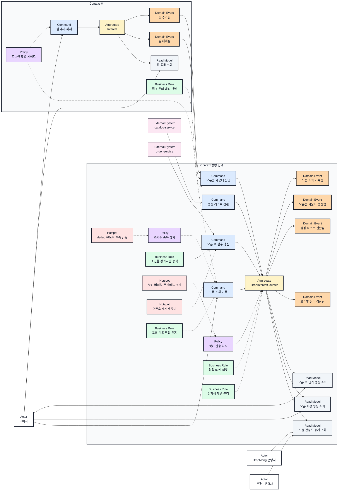

# 관심 신호 및 인기 랭킹 이벤트스토밍과 바운디드 컨텍스트

## 기본 정보

- BC ID: `BC.A.07`
- ID 결정: 원천 요구사항 `REQ.A.07`과 유스케이스 `UC.A.07`의 번호를 그대로 이어받는다.
- 책임: 찜 추가/해제, 찜 목록 조회, 드롭 조회 신호 집계, 오픈 전/오픈 후 인기 랭킹 산출, 드롭 상태 전환에 따른 랭킹 리스트 전환, 운영자/브랜드 운영자용 관심도 통계 제공.
- 사용자: 구매자, DropMong 운영자, 브랜드 운영자.
- 핵심 용어: 찜, 관심 신호, 오픈 전 랭킹, 오픈 후 랭킹, 소진율, 조회수 dedup, 핫키.
- 제외 책임: 알림 신청/발송(Context 알림 소관), 드롭/재고 원장 관리(Context 드롭 관리·재고 배정 소관), 주문/결제 처리(Context 주문 확인·결제 소관), 검색/개인화 추천.

## 연관 태그

- 🏷️ 요구사항 참조: [REQ.A.07](../00-requirements/REQ_A_07_interest_ranking.md)
- 🏷️ UC 참조: [UC.A.07](../30-uc/UC_A_07_interest_ranking.md)
- 🏷️ 영속성 참조: PST.A.07 예정
- 🏷️ 서비스 참조: SVC.A.07 예정
- 🏷️ 시나리오 참조: SCN.A.07 예정
- 🏷️ API 참조: API.A.07 예정

## 컨텍스트 경계

- 이 BC가 결정하는 것: 찜 상태(추가/해제)의 즉시 반영, 드롭별 오픈 전/오픈 후 랭킹 산출 공식과 갱신 시점, 조회수 중복 집계 방지, 핫키 상황의 완충 처리.
- 이 BC가 참조만 하는 것: `catalog.drop.updated`(드롭 상태 전환), `order.created`/`order.confirmed`(오픈 후 랭킹의 소진율 계산용 `confirmed_count`/`total_quantity`).
- 조회 신호 연동 방식: 드롭 상세 화면(프론트엔드)이 catalog-service를 거치지 않고 이 BC의 조회 기록 API를 직접 호출한다. catalog-service 이벤트 발행 로직을 새로 추가하면 `REQ.A.07.NFR-002`(기존 catalog/order-service 코드 미수정)와 충돌하므로, 화면이 직접 호출하는 쪽으로 확정했다(`RULE.A.07-04`).
- 다른 BC에 위임하는 것: 알림 신청/발송(Context 알림), 드롭 원장·재고 배정(Context 드롭 관리·재고 배정), 주문/결제 처리(Context 주문 확인·결제), 인증/로그인 판정(Context 인증).
- 경계 원칙: 찜 상태(사용자에게 즉시 정확해야 하는 값)와 랭킹 집계용 카운트(짧은 지연을 허용하는 값)를 서로 다른 정합성 레벨로 다루기 위해, 이 BC 내부를 `Context 찜`과 `Context 랭킹 집계`로 나눈다. 처음부터 독립 서비스(interest-service)로 시작하고 catalog-service/order-service 코드는 수정하지 않는다(`REQ.A.07.NFR-002`).

## Event Storming Diagram

## Element Catalog

| 유형 | 식별자 | 이름 | 소속 컨텍스트 | 설명 |
| --- | --- | --- | --- | --- |
| Actor | ACTOR.A.07-01 | 구매자 | Context 외부 | 찜을 추가/해제하고, 찜 목록과 랭킹을 조회한다. |
| Actor | ACTOR.A.07-02 | DropMong 운영자 | Context 외부 | 드롭별 관심도 통계를 조회해 운영 판단에 사용한다. |
| Actor | ACTOR.A.07-03 | 브랜드 운영자 | Context 외부 | 자사 드롭의 찜/조회 통계를 조회한다. |
| Context | CTX.A.07-01 | Context 찜 | BC 내부 | 찜 상태의 즉시 정합성을 담당한다. |
| Context | CTX.A.07-02 | Context 랭킹 집계 | BC 내부 | 조회 기록, 랭킹 산출, 통계 제공을 담당하며 지연을 허용한다. |
| Command | CMD.A.07-01 | 찜 추가/해제 | Context 찜 | 사용자의 찜 토글 요청을 처리한다. |
| Command | CMD.A.07-02 | 드롭 조회 기록 | Context 랭킹 집계 | dedup을 통과한 조회 신호를 카운터에 반영한다. |
| Command | CMD.A.07-03 | 랭킹 리스트 전환 | Context 랭킹 집계 | 드롭 상태 전환에 맞춰 랭킹 리스트 소속을 바꾼다. |
| Command | CMD.A.07-04 | 오픈 후 점수 갱신 | Context 랭킹 집계 | 주문 확정 신호로 소진율 기반 점수를 갱신한다. |
| Command | CMD.A.07-05 | 오픈전 카운터 반영 | Context 랭킹 집계 | 찜 추가됨/해제됨 이벤트를 받아 오픈 전 카운터에 대칭 반영한다. |
| Aggregate | AGG.A.07-01 | Interest | Context 찜 | 사용자-드롭 단위 찜 상태를 보존한다. |
| Aggregate | AGG.A.07-02 | DropInterestCounter | Context 랭킹 집계 | 드롭 단위 오픈 전 누적 카운트, 오픈 후 점수, 조회수를 보존한다. |
| Domain Event | EVT.A.07-01 | 찜 추가됨 | Context 찜 | 사용자가 드롭을 찜한 결과다. |
| Domain Event | EVT.A.07-02 | 찜 해제됨 | Context 찜 | 사용자가 찜을 해제한 결과다. |
| Domain Event | EVT.A.07-03 | 드롭 조회 기록됨 | Context 랭킹 집계 | dedup 통과 후 조회가 집계된 결과다. |
| Domain Event | EVT.A.07-04 | 오픈전 카운터 갱신됨 | Context 랭킹 집계 | 찜/조회 반영으로 당일 누적 카운터가 바뀐 결과다. |
| Domain Event | EVT.A.07-05 | 랭킹 리스트 전환됨 | Context 랭킹 집계 | 드롭이 오픈 예정 목록에서 빠지고 오픈 후 목록 대상이 된 결과다. |
| Domain Event | EVT.A.07-06 | 오픈후 점수 갱신됨 | Context 랭킹 집계 | 소진율/경과시간 공식으로 점수가 갱신된 결과다. |
| Policy | POLICY.A.07-01 | 로그인 필요 게이트 | Context 찜, Context 랭킹 집계 | 찜과 조회 집계는 로그인 사용자만 대상으로 한다. |
| Policy | POLICY.A.07-02 | 조회수 중복 방지 | Context 랭킹 집계 | 동일 사용자/드롭 조합은 5분 윈도우 안에서 한 번만 집계한다. |
| Policy | POLICY.A.07-03 | 핫키 완충 처리 | Context 랭킹 집계 | 특정 드롭에 write가 몰려도 다른 드롭 조회 응답에 영향 없게 완충한다. |
| Business Rule | RULE.A.07-01 | 당일 00시 리셋 | Context 랭킹 집계 | 오픈 전 카운터는 매일 자정 리셋되고 감쇠 계산을 쓰지 않는다. |
| Business Rule | RULE.A.07-02 | 소진율/경과시간 공식 | Context 랭킹 집계 | 오픈 후 점수는 `sell_through_rate / elapsed_minutes`로 계산해 재고 규모 왜곡을 막는다. |
| Business Rule | RULE.A.07-03 | 정합성 레벨 분리 | Context 찜, Context 랭킹 집계 | 찜 상태(즉시)와 랭킹 카운터(지연 허용)를 다른 정합성 레벨로 다룬다. |
| Business Rule | RULE.A.07-04 | 조회 기록 직접 연동 | Context 랭킹 집계 | 드롭 상세 화면이 catalog-service를 거치지 않고 이 BC의 조회 기록 API를 직접 호출한다. catalog-service 코드 변경 없이 연동하기 위함이다. |
| Business Rule | RULE.A.07-05 | 찜 카운터 대칭 반영 | Context 찜, Context 랭킹 집계 | 찜 추가/해제를 오픈 전 카운터 증감에 대칭으로 반영한다. |
| Hotspot | HOTSPOT.A.07-01 | 핫키 버퍼링 주기/배치크기 | Context 랭킹 집계 | 실 트래픽 실측 전까지 로컬 버퍼링 주기와 배치 크기를 정하지 않았다. |
| Hotspot | HOTSPOT.A.07-02 | 오픈 후 재계산 주기 | Context 랭킹 집계 | 오픈 후 랭킹의 재계산 주기(분자/분모 갱신 빈도)가 미정이다. |
| Hotspot | HOTSPOT.A.07-03 | dedup 윈도우 실측 검증 | Context 랭킹 집계 | 5분 dedup 윈도우와 오픈 후 공식의 최소 elapsed 값이 부하테스트 후에도 적정한지 미검증이다. |
| External System | EXT.A.07-01 | catalog-service | Context 외부 | `catalog.drop.updated` 이벤트로 드롭 상태 전환을 알린다. |
| External System | EXT.A.07-02 | order-service | Context 외부 | `order.created`/`order.confirmed` 이벤트와 `total_quantity`/`confirmed_count`를 제공한다. |
| Read Model | RM.A.07-01 | 찜 목록 조회 | Context 찜 | 구매자가 자신이 찜한 드롭 목록을 보는 조회 모델이다. |
| Read Model | RM.A.07-02 | 오픈 후 인기 랭킹 조회 | Context 랭킹 집계 | 판매 중인 드롭의 소진율 기준 랭킹을 보여준다. |
| Read Model | RM.A.07-03 | 오픈 예정 랭킹 조회 | Context 랭킹 집계 | 오픈 전 드롭의 당일 누적 기준 랭킹을 보여준다. |
| Read Model | RM.A.07-04 | 드롭 관심도 통계 조회 | Context 랭킹 집계 | 운영자/브랜드 운영자가 보는 드롭별 찜/조회 통계다. |

## Element Evidence

| 요소 | 근거 문서 | 근거 내용 |
| --- | --- | --- |
| ACTOR.A.07-01 구매자 | [UC.A.07](../30-uc/UC_A_07_interest_ranking.md) | `UC.A.07-01`~`04`에서 찜 토글, 목록 조회, 랭킹 조회를 수행하는 주체다. |
| ACTOR.A.07-02 DropMong 운영자, ACTOR.A.07-03 브랜드 운영자 | [UC.A.07](../30-uc/UC_A_07_interest_ranking.md) | `UC.A.07-05` 드롭 관심도 통계 조회의 주체다. |
| CTX.A.07-01 Context 찜 | [REQ.A.07](../00-requirements/REQ_A_07_interest_ranking.md) | `FR-001`, `FR-002`, `FR-009`, `FR-010`이 찜 상태의 즉시 반영을 요구한다. |
| CTX.A.07-02 Context 랭킹 집계 | [REQ.A.07](../00-requirements/REQ_A_07_interest_ranking.md) | `FR-003`~`FR-008`이 조회 집계, 랭킹 산출, 상태 전환, 통계 제공을 요구한다. |
| CMD.A.07-01 찜 추가/해제 | [UC.A.07-01](../30-uc/UC_A_07_interest_ranking.md), `REQ.A.07.FR-001`, `REQ.A.07.FR-009` | 찜 버튼 토글이 찜 추가/해제 커맨드로 이어진다. |
| CMD.A.07-02 드롭 조회 기록 | `REQ.A.07.FR-004`, `REQ.A.07.FR-007` | 로그인 사용자의 드롭 조회를 5분 단위로 중복 없이 집계해야 한다. |
| CMD.A.07-03 랭킹 리스트 전환 | `REQ.A.07.FR-006` | `catalog.drop.updated` 이벤트로 `SCHEDULED → OPEN` 전환을 감지해야 한다. |
| CMD.A.07-04 오픈 후 점수 갱신 | `REQ.A.07.FR-005`, `REQ.A.07.NFR-004` | `sell_through_rate / elapsed_minutes` 공식으로 재고 규모에 왜곡되지 않는 점수를 계산해야 한다. |
| CMD.A.07-05 오픈전 카운터 반영 | `REQ.A.07.FR-003`, `REQ.A.07.FR-009` | 찜 추가/해제 결과가 오픈 전 카운터에 반영되는 중간 처리 단계가 필요하다. |
| AGG.A.07-01 Interest | [UC.A.07-01](../30-uc/UC_A_07_interest_ranking.md), `REQ.A.07.FR-001`, `REQ.A.07.FR-010` | 찜 상태(즉시 정확)를 별도로 보존해야 한다. |
| AGG.A.07-02 DropInterestCounter | `REQ.A.07.FR-003`, `REQ.A.07.FR-005`, `REQ.A.07.FR-010` | 오픈 전 누적 카운트와 오픈 후 점수를 지연 허용 값으로 별도 보존해야 한다. |
| EVT.A.07-01·02 찜 추가됨/해제됨 | [UC.A.07-01](../30-uc/UC_A_07_interest_ranking.md) | 찜 토글 결과가 이후 랭킹 카운터 갱신의 트리거가 된다. |
| EVT.A.07-03 드롭 조회 기록됨 | `REQ.A.07.FR-004` | dedup을 통과한 조회만 결과로 남아야 한다. |
| EVT.A.07-04 오픈전 카운터 갱신됨 | `REQ.A.07.FR-003`, `REQ.A.07.FR-009` | 찜/조회 반영과 찜 해제 감소가 모두 이 이벤트로 드러난다. |
| EVT.A.07-05 랭킹 리스트 전환됨 | `REQ.A.07.FR-006`, 수용 기준(드롭 상태 전환 시 랭킹 목록 이동) | 상태 전환 감지 결과가 랭킹 리스트 소속 변경으로 이어진다. |
| EVT.A.07-06 오픈후 점수 갱신됨 | `REQ.A.07.FR-005` | 소진율 공식 계산 결과가 랭킹 점수 갱신으로 이어진다. |
| POLICY.A.07-01 로그인 필요 게이트 | `REQ.A.07.FR-007` | 비로그인 사용자의 조회는 랭킹 집계에서 제외해야 한다. |
| POLICY.A.07-02 조회수 중복 방지 | `REQ.A.07.FR-004`, `REQ.A.07.NFR-001`, `REQ.A.07.NFR-003` | 같은 `(userId, dropId)` 조합은 5분 안에 최대 1회만 반영돼야 한다. |
| POLICY.A.07-03 핫키 완충 처리 | `REQ.A.07.FR-010`, `REQ.A.07.NFR-008` | 특정 드롭 write 폭주가 다른 드롭 랭킹 조회 응답에 영향 주면 안 된다. |
| RULE.A.07-01 당일 00시 리셋 | `REQ.A.07.FR-003`, `REQ.A.07.NFR-006` | 오픈 전 랭킹은 감쇠 계산 없이 당일 누적만 사용해야 한다. |
| RULE.A.07-02 소진율/경과시간 공식 | `REQ.A.07.FR-005`, `REQ.A.07.NFR-004` | 재고 수량이 다른 드롭도 같은 소진 속도면 비슷한 순위를 받아야 한다. |
| RULE.A.07-03 정합성 레벨 분리 | `REQ.A.07.FR-010` | 찜 상태와 랭킹 카운터가 서로 다른 정합성 레벨을 가져야 한다. |
| RULE.A.07-04 조회 기록 직접 연동 | `REQ.A.07.NFR-002` | 기존 catalog-service 코드는 수정하지 않고 연동해야 하므로, catalog-service의 신규 이벤트 발행 대신 화면이 이 BC의 API를 직접 호출하는 쪽으로 결정했다. |
| RULE.A.07-05 찜 카운터 대칭 반영 | `REQ.A.07.FR-009`, `REQ.A.07.NFR-007` | 찜 해제 시 카운터가 즉시 감소해 순 관심도만 반영돼야 한다. |
| HOTSPOT.A.07-01~03 | `REQ.A.07` 열린 질문 | 핫키 버퍼링 주기, 재계산 주기, dedup 윈도우 실측이 모두 REQ 문서의 열린 질문으로 남아 있다. |
| EXT.A.07-01 catalog-service | `REQ.A.07` 제약 조건 | `catalog.drop.updated` 이벤트는 문서상 정의만 있고 `packages/contracts` 코드에는 아직 없다. |
| EXT.A.07-02 order-service | `REQ.A.07` 제약 조건 | 이 BC는 `total_quantity`/`confirmed_count`의 authoritative owner가 아니다. |
| RM.A.07-01~04 | [UC.A.07-02~05](../30-uc/UC_A_07_interest_ranking.md) | 각 유스케이스가 요구하는 조회 화면과 1:1로 대응한다. |

## Event Relations

| 출발 | 관계 | 도착 | 설명 |
| --- | --- | --- | --- |
| 구매자 | 요청한다 | 찜 추가/해제 | 드롭 상세나 랭킹 카드에서 찜 버튼을 누른다. |
| 찜 추가/해제 | 변경한다 | Interest | 사용자-드롭 단위 찜 상태를 바꾼다. |
| Interest | 발행한다 | 찜 추가됨 | 찜이 추가된 결과가 남는다. |
| Interest | 발행한다 | 찜 해제됨 | 찜이 해제된 결과가 남는다. |
| 로그인 필요 게이트 | 제한한다 | 찜 추가/해제 | 비로그인 사용자는 찜을 실행할 수 없다. |
| 찜 추가됨 | 요청한다 | 오픈전 카운터 반영 | 카운터 증가를 요청한다. |
| 찜 해제됨 | 요청한다 | 오픈전 카운터 반영 | 카운터 감소를 요청한다. |
| 찜 카운터 대칭 반영 | 규정한다 | 오픈전 카운터 반영 | 증가/감소가 대칭적으로 처리돼야 한다. |
| 오픈전 카운터 반영 | 변경한다 | DropInterestCounter | 찜 추가/해제 결과를 카운터 값에 반영한다. |
| 구매자 | 요청한다 | 드롭 조회 기록 | 드롭 상세 화면을 열면 화면이 이 BC의 조회 기록 API를 직접 호출한다. |
| 조회 기록 직접 연동 | 규정한다 | 드롭 조회 기록 | catalog-service를 거치지 않고 화면이 API를 직접 호출하도록 정한다. |
| 조회수 중복 방지 | 제한한다 | 드롭 조회 기록 | 5분 안 같은 사용자/드롭 조합은 한 번만 통과시킨다. |
| 드롭 조회 기록 | 변경한다 | DropInterestCounter | 조회수를 카운터에 반영한다. |
| DropInterestCounter | 발행한다 | 드롭 조회 기록됨 | 집계된 조회 결과가 남는다. |
| DropInterestCounter | 발행한다 | 오픈전 카운터 갱신됨 | 찜/조회 반영 결과가 당일 누적치로 남는다. |
| 당일 00시 리셋 | 규정한다 | DropInterestCounter | 오픈 전 카운터는 매일 자정 초기화된다. |
| catalog-service | 요청한다 | 랭킹 리스트 전환 | `catalog.drop.updated`로 드롭 상태 전환을 알린다. |
| 랭킹 리스트 전환 | 변경한다 | DropInterestCounter | 오픈 예정/오픈 후 리스트 소속을 바꾼다. |
| DropInterestCounter | 발행한다 | 랭킹 리스트 전환됨 | 리스트 소속이 바뀐 결과가 남는다. |
| order-service | 요청한다 | 오픈 후 점수 갱신 | `order.confirmed`로 소진 수량 변화를 알린다. |
| 소진율/경과시간 공식 | 규정한다 | 오픈 후 점수 갱신 | 재고 규모를 정규화해 점수를 계산한다. |
| 오픈 후 점수 갱신 | 변경한다 | DropInterestCounter | 오픈 후 점수를 갱신한다. |
| DropInterestCounter | 발행한다 | 오픈후 점수 갱신됨 | 갱신된 점수가 랭킹 조회에 반영된다. |
| 핫키 완충 처리 | 제한한다 | DropInterestCounter | 특정 드롭 write 폭주가 다른 드롭 조회 응답에 영향 주지 않게 한다. |
| 정합성 레벨 분리 | 규정한다 | DropInterestCounter | 찜 상태와 랭킹 카운터를 다른 정합성 레벨로 유지한다. |
| DropInterestCounter | 제공한다 | 오픈 후 인기 랭킹 조회 | 구매자가 오픈 후 랭킹을 확인한다. |
| DropInterestCounter | 제공한다 | 오픈 예정 랭킹 조회 | 구매자가 오픈 예정 랭킹을 확인한다. |
| DropInterestCounter | 제공한다 | 드롭 관심도 통계 조회 | 운영자/브랜드 운영자가 통계를 확인한다. |
| Interest | 제공한다 | 찜 목록 조회 | 구매자가 자신의 찜 목록을 확인한다. |

## 유비쿼터스 언어

| 용어 | 의미 | 혼동하기 쉬운 용어 |
| --- | --- | --- |
| 찜 | 사용자가 특정 드롭에 표시하는 즉시 정확한 관심 상태다. | 좋아요, 알림 신청 |
| 관심 신호 | 찜과 조회수를 합쳐 랭킹 계산에 쓰는 원시 데이터다. | 구매 전환율 |
| 오픈 전 랭킹 | `SCHEDULED` 드롭을 당일 누적 찜/조회수로 정렬한 목록이다. | 급상승 랭킹(속도/감쇠 기반 알고리즘, 이 도메인에서는 사용하지 않음) |
| 오픈 후 랭킹 | `OPEN` 드롭을 소진율/경과시간 공식으로 정렬한 목록이다. | 판매량 랭킹(재고 규모 보정 없는 단순 판매수) |
| 소진율 | `confirmed_count / total_quantity`로 계산하는 재고 소진 비율이다. | 판매 개수 |
| dedup 윈도우 | 동일 사용자/드롭 조회를 중복 집계하지 않는 시간 구간(현재 5분)이다. | 세션 유지 시간 |
| 핫키 | 특정 드롭 하나에 조회/찜 write가 몰려 부하가 집중되는 상황이다. | 트래픽 스파이크(시스템 전체) |
| 정합성 레벨 분리 | 찜 상태(즉시)와 랭킹 카운터(지연 허용)를 다른 기준으로 다루는 설계 원칙이다. | 최종 일관성(전체 시스템 단일 기준) |

## 후속 설계 메모

| 항목 | 메모 | 연결 문서 |
| --- | --- | --- |
| 도메인 모델 | `Interest`, `DropInterestCounter`의 Entity/Value Object, 상태 전이를 나눠 설계한다. | AGG.A.07 예정 |
| 영속성 | 찜 상태(즉시 쓰기)와 카운터(Redis `ZINCRBY` 등 지연 허용 저장)의 저장소 분리 근거를 정리한다. | PST.A.07 예정 |
| 서비스 | 찜 토글 서비스와 랭킹 집계 서비스(이벤트 컨슈머 포함)를 컨텍스트별로 분리한다. | SVC.A.07 예정 |
| API | 찜 토글/목록 API와 랭킹/통계 조회 API의 요청·응답, 인증 요구사항을 정의한다. | API.A.07 예정 |
| 발행 Event | 찜 추가/해제, 랭킹 리스트 전환, 오픈후 점수 갱신 이벤트를 다른 BC가 구독할 계약으로 정할지 검토한다. | SCN.A.07 예정 |
| 구독 Event | `catalog.drop.updated`, `order.created`/`order.confirmed`의 구독 방식을 확정한다. 조회 기록은 이벤트 구독이 아니라 화면의 직접 API 호출로 확정했다(`RULE.A.07-04`). | SVC.A.07 예정 |
| 외부 연동 | `catalog.drop.updated`가 `packages/contracts`에 아직 없다는 제약을 언제 해소할지 catalog 담당자와 협의한다. | API.A.07 예정 |
| 정책/불변조건 | 로그인 게이트, dedup, 찜 카운터 대칭, 핫키 완충, 조회 기록 직접 연동을 불변조건으로 상세화한다. | PST.A.07 예정, SVC.A.07 예정 |
| 열린 질문 | 핫키 버퍼링 주기/배치 크기, 오픈 후 재계산 주기, dedup 윈도우 실측 검증을 결정한다. | SCN.A.07 예정 |
