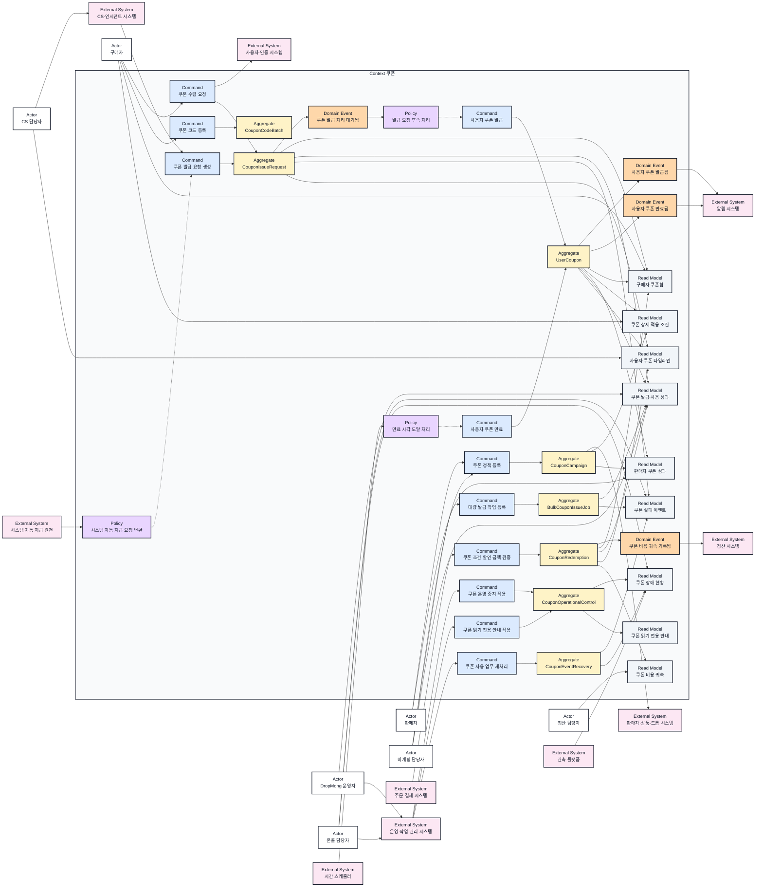
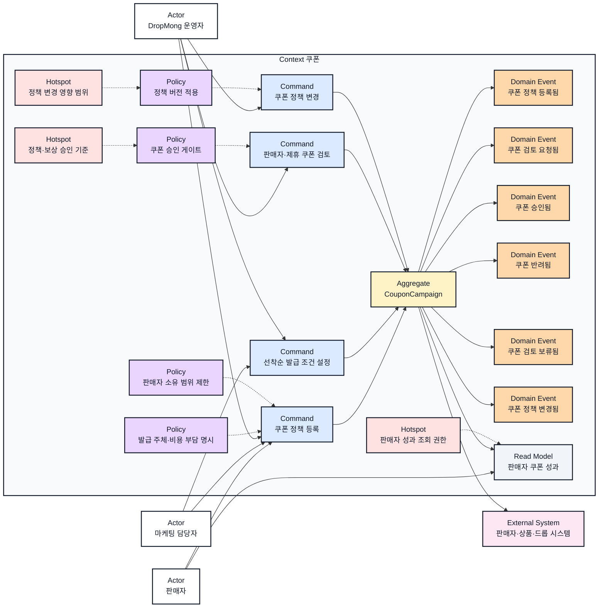
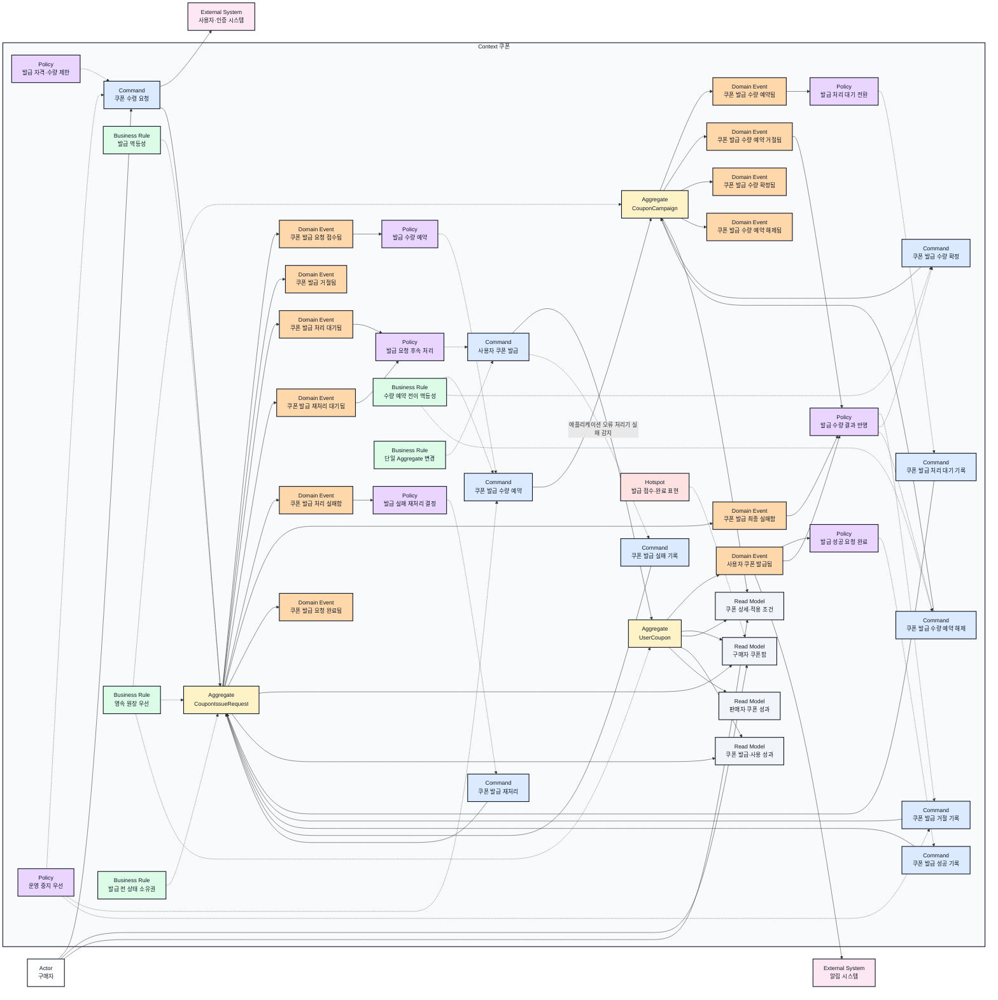
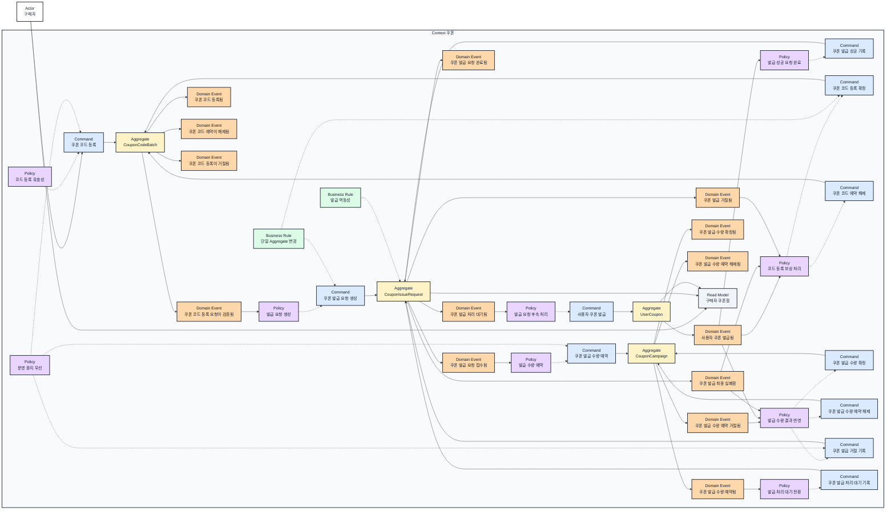
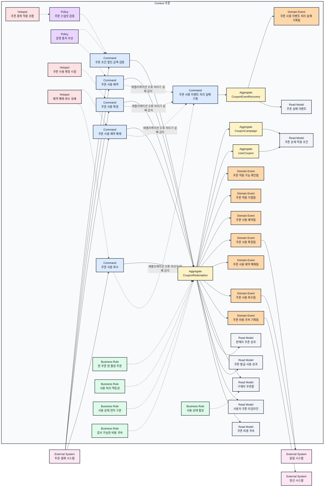
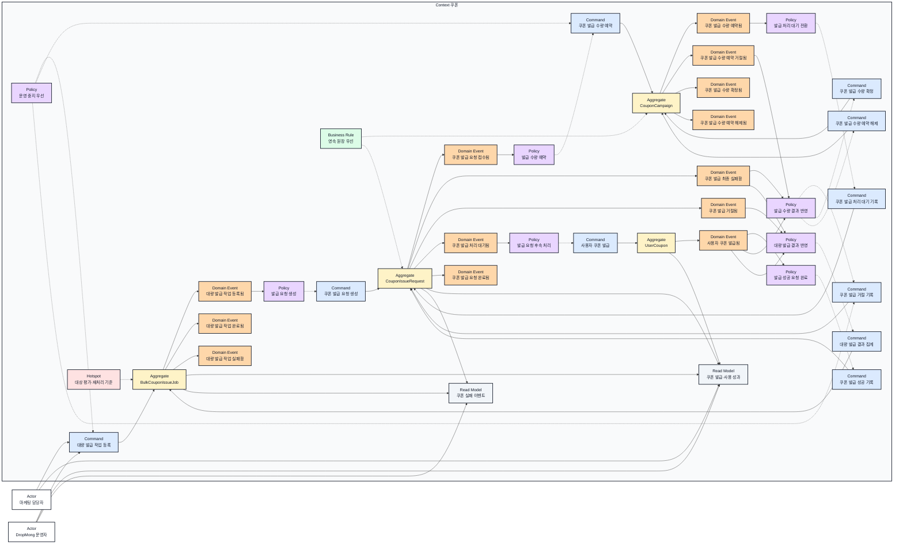
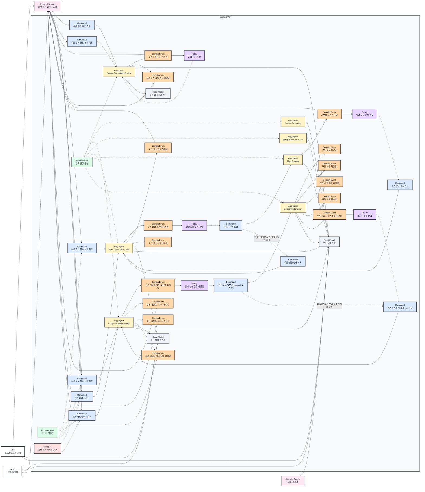
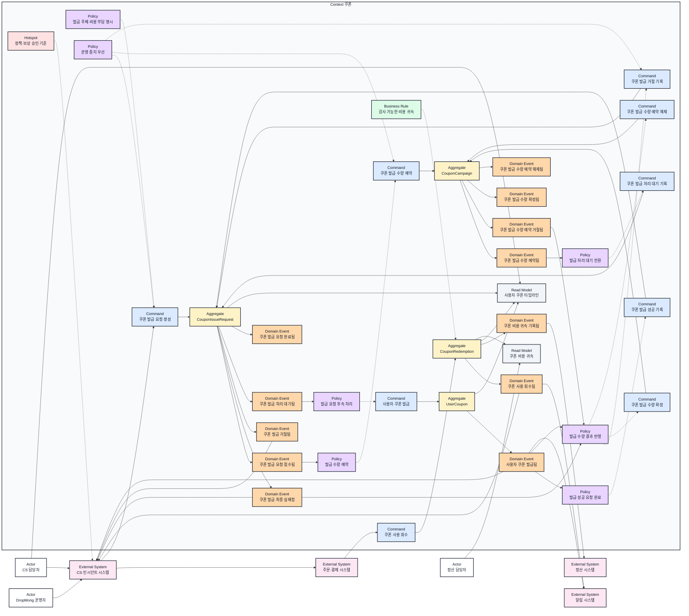
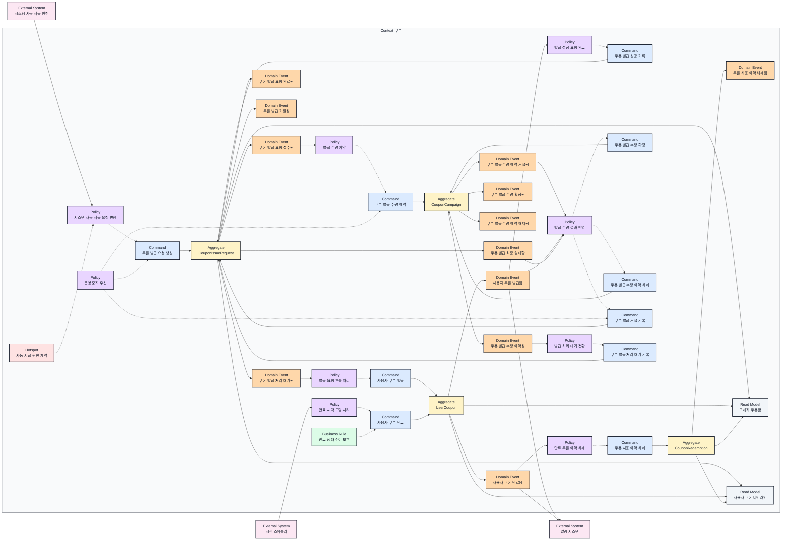

# Context 쿠폰 이벤트스토밍과 바운디드 컨텍스트

## 기본 정보

- BC ID: `BC.A.19`
- 책임: 쿠폰 캠페인과 혜택·적용 정책·발급 제한을 관리하고, 발급 요청부터 사용자 쿠폰 생성까지의 상태를 추적하며, 주문 사용 예약·확정·해제·회수 원장과 실패 이벤트 복구 기록을 보존한다.
- 사용자: 구매자, 판매자, 마케팅 담당자, DropMong 운영자, CS 담당자, 온콜 담당자, 정산 담당자.
- 핵심 용어: 쿠폰 캠페인, 쿠폰 발급 요청, 사용자 쿠폰, 쿠폰 코드, 사용 예약, 사용 확정, 예약 해제, 사용 회수, 운영 중지, 읽기 전용 안내, 이벤트 복구 기록, 재처리, 비용 귀속.
- 제외 책임: 상품·드롭 원본 관리, 사용자 계정과 인증, 주문 생성, PG 승인, CS 문의 원문, 인시던트 원본, 정산 회계 확정, 알림 채널 전송, Redis·MQ·Worker 구현 상세.

## 연관 태그

- 🏷️ 요구사항 참조: [REQ.A.02](../00-requirements/REQ_A_02_coupon_benefit.md), [REQ.A.04](../00-requirements/REQ_A_04_platform_operator_admin.md)
- 🏷️ 페이지 참조: [PAGE.A.19](../10-sitemap/buyer-mobile-web/PAGE_A_19_coupon_wallet/PAGE_A_19_owned_coupon.md), [PAGE.A.11](../10-sitemap/buyer-mobile-web/PAGE_A_11_payment.md)
- 🏷️ UI 참조: [UI.A.19](../20-ui/buyer-mobile-web/UI_A_19_coupon_wallet/UI_A_19_coupon_wallet.md), [UI.A.11](../20-ui/buyer-mobile-web/UI_A_11_payment.md)
- 🏷️ UC 참조: [UC.A.19](../30-uc/UC_A_19_coupon_wallet.md), [UC.A.01](../30-uc/UC_A_01_buyer_purchase_delivery.md), [UC.A.02](../30-uc/UC_A_02_seller_manage_drop.md), [UC.A.03](../30-uc/UC_A_03_platform_operator_admin.md), [UC.A.04](../30-uc/UC_A_04_cs_order_coupon_support.md)
- 🏷️ 서비스 상세 설계 참조: [SD.A.19](../50-service-design/A_19_coupon/README.md)
- 🏷️ 도메인 참조: [SD.A.1910](../50-service-design/A_19_coupon/A_19_10-domain-model/README.md)
- 🏷️ 영속성 참조: [SD.A.1920](../50-service-design/A_19_coupon/A_19_20-persistence/README.md)
- 🏷️ 서비스 참조: [SD.A.1930](../50-service-design/A_19_coupon/A_19_30-service/README.md)
- 🏷️ API 참조: [SD.A.1940](../50-service-design/A_19_coupon/A_19_40-api/README.md)
- 🏷️ 기존 설계 근거: [DropMong coupon-service 설계](../../../workspaces/docs/architecture/coupon-service/README.md), [도메인 모델](../../../workspaces/docs/architecture/coupon-service/01-domain-model.md), [엔티티 설계](../../../workspaces/docs/architecture/coupon-service/02-entity-design.md), [API 목록](../../../workspaces/docs/architecture/coupon-service/03-api-list.md)

## 컨텍스트 경계

- 이 BC가 결정하는 것: 쿠폰 캠페인의 혜택·적용 조건·기간·수량 예약·발급 완료 수·발급 주체·비용 부담·승인 상태, 발급 요청의 접수·처리 대기·재처리 대기·성공·실패 상태, 사용자 쿠폰 생성·만료 결과, 코드 등록 결과, 주문별 사용 예약·확정·해제·회수, 대량 발급 작업, 범위별 운영 중지와 읽기 전용 안내, 실패 이벤트의 재처리·최종 실패 기록, 발급·사용 원장.
- 이 BC가 참조만 하는 것: `user_id`와 자격 스냅샷, 판매자 소유 관계, 상품·드롭·카테고리 식별자, 주문 가격 스냅샷, 주문·결제 결과, CS 문의와 인시던트 식별자, 정산 상태.
- 다른 BC에 위임하는 것: 사용자 인증과 등급 원본, 판매자·상품·드롭 원본, 주문 생성과 PG 승인, CS 문의 처리, 인시던트 승인 체계, 정산 예정·보류·확정, 알림 채널 전송.
- `CouponIssueRequest`는 `UserCoupon`이 만들어지기 전의 접수·대기·실패·재처리 상태와 실제 발급 뒤의 완료 상태를 소유한다. 실제 발급에 성공한 뒤에만 `UserCoupon`을 만든다.
- 운영·CS 시스템은 중지, 재처리, 취소·회수, 보상 발급 같은 위험 작업의 요청 ID·승인 근거·사유·멱등키·결과를 소유한다. Context 쿠폰은 승인된 도메인 Command만 실행하고 결과 Event를 돌려준다.
- `CouponOperationalControl`은 승인된 캠페인·드롭·사용자 그룹별 발급·사용 중지 규칙을 소유한다. 중지 적용 시각 이후의 신규 발급 수량 예약과 신규 사용 예약은 거절한다. 적용 전에 수량·사용 예약이 확정된 작업은 발급·사용 완료 또는 기존 보상 Command로 원장을 닫으며 중지 상태로 대기시키지 않는다.
- `CouponOperationalControl`은 중지 범위와 같은 범위의 읽기 전용 안내 문구·적용 시각·활성 상태도 소유한다. 운영 작업 관리 시스템은 승인과 감사 기록을 소유하고 Context 쿠폰은 안내 설정과 조회 모델을 제공한다.
- `CouponEventRecovery`는 실패한 사용 이벤트의 원본 참조, 실패 사유, 재시도 횟수, 다음 처리 시각, 재처리·최종 실패 상태를 소유한다. 각 재실행은 `recovery_id`, `attempt_id`, 업무 고유키와 `result_ref`로 상관관계를 고정한다. `CouponRedemption`은 예약·확정·해제·회수 같은 사용 업무 상태만 소유한다.
- 주문 사용 Command는 `CouponRedemption`만 변경한다. 쿠폰함의 예약·사용 표시는 `UserCoupon`과 `CouponRedemption` 사건을 합성한 Read Model로 제공한다.
- 상품·드롭 원본은 Context 쿠폰이 소유하지 않는다. 적용 대상은 `CouponApplicabilityPolicy`의 외부 참조로만 보존한다.
- Redis와 MQ는 피크 흡수와 비동기 전달 수단이며 최종 발급·사용 원장을 대체하지 않는다.
- Hotspot ID는 과거 미결정 지점의 추적 식별자로 유지한다. `HOTSPOT.A.19-01~08`의 업무 결론과 `09`의 개인정보 제외 원칙은 2026-07-12에 확정했으며 세부 근거는 [Hotspot 결정 기록](../50-service-design/A_19_coupon/hotspot-decisions.md)에서 관리한다.

## Event Storming Diagram

첫 다이어그램은 Context 쿠폰의 전체 경계를 한 화면에 요약한다. 이어지는 상세 다이어그램은 정책, 발급, 코드 등록, 주문 사용, 대량 발급, 운영 중지·안내와 실패 복구, 고객 지원, 시스템 자동 지급·만료 시나리오를 각각 설명한다. 모든 다이어그램의 `CouponBC`는 같은 Bounded Context다.

### 전체 바운디드 컨텍스트 개요

7개 Actor의 대표 진입점, 10개 외부 시스템, 8개 Aggregate와 9개 Read Model을 한 화면에 표시한다. 상태 전이와 예외 처리의 전체 Event·Policy는 아래 상세 다이어그램에서 확인한다.

### 쿠폰 정책 등록과 승인

### 구매자 쿠폰 수령과 비동기 발급

### 쿠폰 코드 등록

### 주문 적용과 쿠폰 사용 원장

### 대량 발급

### 운영 중지·읽기 전용 안내와 실패 복구

### CS 회수·보상과 비용 귀속

### 시스템 자동 지급과 쿠폰 만료

## Element Catalog

| 유형 | 식별자 | 이름 | 소속 컨텍스트 | 설명 |
| --- | --- | --- | --- | --- |
| Actor | ACTOR.A.19-01 | 구매자 | Context 외부 | 쿠폰을 수령하고 코드로 등록하며 쿠폰함과 적용 조건을 확인한다. |
| Actor | ACTOR.A.19-02 | 판매자 | Context 외부 | 자기 상품·드롭 범위의 쿠폰을 등록하고 허용된 성과를 확인한다. |
| Actor | ACTOR.A.19-03 | 마케팅 담당자 | Context 외부 | 쿠폰 조건과 발급 대상을 정의하고 대량 발급과 성과를 관리한다. |
| Actor | ACTOR.A.19-04 | DropMong 운영자 | Context 외부 | 정책, 승인, 발급 상태, 중지, 재처리를 관리한다. |
| Actor | ACTOR.A.19-05 | CS 담당자 | Context 외부 | 사용자 쿠폰 이력을 조회하고 취소·회수와 보상을 요청한다. |
| Actor | ACTOR.A.19-06 | 온콜 담당자 | Context 외부 | 쿠폰 장애를 확인하고 중지와 재처리를 요청한다. |
| Actor | ACTOR.A.19-07 | 정산 담당자 | Context 외부 | 주문별 쿠폰 할인 비용의 부담 주체와 정산 연결 상태를 확인한다. |
| Command | CMD.A.19-01 | 쿠폰 정책 등록 | Context 쿠폰 | 혜택, 적용 조건, 기간, 수량, 발급·비용 주체를 등록한다. |
| Command | CMD.A.19-02 | 선착순 발급 조건 설정 | Context 쿠폰 | 오픈 시각, 총수량, 사용자별 제한, 종료 조건을 설정한다. |
| Command | CMD.A.19-03 | 판매자·제휴 쿠폰 검토 | Context 쿠폰 | 정책 위반과 책임 고지를 검토해 승인, 반려, 보류한다. |
| Command | CMD.A.19-04 | 쿠폰 정책 변경 | Context 쿠폰 | 새 정책 버전과 적용 시각을 등록한다. |
| Command | CMD.A.19-05 | 쿠폰 수령 요청 | Context 쿠폰 | 구매자의 직접 수령 요청을 `CouponIssueRequest`로 접수한다. |
| Command | CMD.A.19-06 | 쿠폰 코드 등록 | Context 쿠폰 | 코드를 검증하고 발급 처리 동안 예약한다. |
| Command | CMD.A.19-07 | 사용자 쿠폰 발급 | Context 쿠폰 | 접수된 발급 요청을 처리해 실제 `UserCoupon`을 만든다. |
| Command | CMD.A.19-08 | 대량 발급 작업 등록 | Context 쿠폰 | 대상 기준과 기준 시각을 가진 독립 발급 작업을 만든다. |
| Command | CMD.A.19-09 | 쿠폰 조건·할인 금액 검증 | Context 쿠폰 | 주문 스냅샷과 사용자 쿠폰 상태를 검증한다. |
| Command | CMD.A.19-10 | 쿠폰 사용 예약 | Context 쿠폰 | 주문별 `CouponRedemption`을 예약 상태로 만든다. |
| Command | CMD.A.19-11 | 쿠폰 사용 확정 | Context 쿠폰 | 주문·결제 계약에 따라 사용을 확정한다. |
| Command | CMD.A.19-12 | 쿠폰 사용 예약 해제 | Context 쿠폰 | 사용 확정 전 실패·취소·만료에 따라 예약을 해제한다. |
| Command | CMD.A.19-13 | 쿠폰 발급 요청 생성 | Context 쿠폰 | 코드·대량·시스템 자동 지급·보상 경로를 출처 정보가 있는 `CouponIssueRequest`로 변환한다. |
| Command | CMD.A.19-14 | 쿠폰 발급 실패 기록 | Context 쿠폰 | 사용자 쿠폰 생성 실패를 재처리 가능 여부에 따라 처리 실패 또는 최종 실패로 기록한다. |
| Command | CMD.A.19-15 | 쿠폰 사용 회수 | Context 쿠폰 | 사용 확정 뒤 취소·환불 결과를 사용 원장에 보정한다. |
| Command | CMD.A.19-16 | 쿠폰 코드 등록 확정 | Context 쿠폰 | 사용자 쿠폰 발급 성공 뒤 예약 코드를 사용 완료로 확정한다. |
| Command | CMD.A.19-17 | 쿠폰 코드 예약 해제 | Context 쿠폰 | 발급 최종 실패 뒤 예약 코드를 다시 등록 가능한 상태로 해제한다. |
| Command | CMD.A.19-18 | 대량 발급 결과 집계 | Context 쿠폰 | 대상별 발급 성공·최종 실패를 대량 작업 결과에 반영한다. |
| Command | CMD.A.19-19 | 쿠폰 발급 재처리 | Context 쿠폰 | 재처리 가능한 발급 실패를 같은 업무 고유키로 다시 실행한다. |
| Command | CMD.A.19-20 | 쿠폰 운영 중지 적용 | Context 쿠폰 | 승인된 캠페인·드롭·사용자 그룹 범위의 신규 발급과 신규 사용 예약을 중지한다. |
| Command | CMD.A.19-21 | 쿠폰 사용 업무 재처리 | Context 쿠폰 | 실패한 사용 이벤트의 복구 기록에 새 `attempt_id`를 만들고 같은 업무 고유키의 재실행 대기 상태로 바꾼다. |
| Command | CMD.A.19-22 | 쿠폰 발급 최종 실패 처리 | Context 쿠폰 | 재처리를 종료할 발급 요청을 최종 실패 상태로 기록한다. |
| Command | CMD.A.19-23 | 쿠폰 발급 성공 기록 | Context 쿠폰 | 실제 사용자 쿠폰 발급 성공을 원본 발급 요청의 완료 상태로 기록한다. |
| Command | CMD.A.19-24 | 사용자 쿠폰 만료 | Context 쿠폰 | 만료 시각에 도달한 사용 가능·예약 중 사용자 쿠폰을 만료 상태로 바꾼다. |
| Command | CMD.A.19-25 | 쿠폰 사용 최종 실패 처리 | Context 쿠폰 | 재처리를 종료할 사용 이벤트 복구 기록을 최종 실패 상태로 바꾼다. |
| Command | CMD.A.19-26 | 쿠폰 발급 수량 예약 | Context 쿠폰 | `issue_request_id`별 수량 상태를 미예약에서 예약으로 한 번만 바꾸고 캠페인 총량 안에서 원자적으로 확보한다. |
| Command | CMD.A.19-27 | 쿠폰 발급 수량 확정 | Context 쿠폰 | 실제 사용자 쿠폰 발급 뒤 `issue_request_id`의 예약 상태를 발급 확정으로 한 번만 바꾼다. |
| Command | CMD.A.19-28 | 쿠폰 발급 수량 예약 해제 | Context 쿠폰 | 발급 최종 실패 뒤 `issue_request_id`의 예약 상태를 해제로 한 번만 바꾸고 수량을 반환한다. |
| Command | CMD.A.19-29 | 쿠폰 발급 거절 기록 | Context 쿠폰 | 수량 예약 거절 사유를 원본 발급 요청의 거절 상태로 기록한다. |
| Command | CMD.A.19-30 | 쿠폰 발급 처리 대기 기록 | Context 쿠폰 | 수량 예약이 끝난 요청을 비동기 Worker 처리 대기 상태로 기록한다. |
| Command | CMD.A.19-31 | 쿠폰 읽기 전용 안내 적용 | Context 쿠폰 | 승인된 범위, 안내 문구, 적용 시각, 활성 상태를 운영 제어에 반영한다. |
| Command | CMD.A.19-32 | 쿠폰 사용 원본 Command 재실행 | Context 쿠폰 | `recovery_id`, `attempt_id`, 원본 유형·payload 참조·업무 고유키로 사용 Command를 실행하고 상태 전이 성공·이미 적용됨·실패 판정을 반환한다. |
| Command | CMD.A.19-33 | 쿠폰 이벤트 재처리 결과 기록 | Context 쿠폰 | 같은 `recovery_id`, `attempt_id`, 업무 고유키의 재실행 판정과 `result_ref` 또는 실패 사유를 복구 기록에 반영한다. |
| Command | CMD.A.19-34 | 쿠폰 사용 이벤트 처리 실패 기록 | Context 쿠폰 | 사용 예약·확정·해제·회수 Command의 애플리케이션 실패를 원본 참조와 함께 복구 기록으로 만든다. |
| Aggregate | AGG.A.19-01 | CouponCampaign | Context 쿠폰 | 혜택, 적용 정책, 발급 제한, 발급·비용 주체, 승인·활성 상태와 `issue_request_id`별 수량 예약·확정·해제 원장을 관리한다. |
| Aggregate | AGG.A.19-02 | CouponCodeBatch | Context 쿠폰 | 코드 생성 묶음과 개별 `CouponCode`의 예약·등록·해제·폐기를 관리한다. |
| Aggregate | AGG.A.19-03 | UserCoupon | Context 쿠폰 | 실제로 사용자에게 부여된 쿠폰과 발급 이후의 상태를 관리한다. |
| Aggregate | AGG.A.19-04 | CouponRedemption | Context 쿠폰 | 주문 사용 검증, 예약, 확정, 해제, 회수와 할인 스냅샷을 관리한다. |
| Aggregate | AGG.A.19-05 | BulkCouponIssueJob | Context 쿠폰 | 대량 발급 대상 기준, 기준 시각, 진행률, 부분 실패, 결과 집계를 관리한다. |
| Aggregate | AGG.A.19-06 | CouponIssueRequest | Context 쿠폰 | `UserCoupon` 생성 전 접수·처리 대기·거절·실패·재처리 대기·최종 실패와 생성 뒤 완료를 관리한다. |
| Aggregate | AGG.A.19-07 | CouponOperationalControl | Context 쿠폰 | 캠페인·드롭·사용자 그룹별 신규 발급·사용 중지 규칙과 읽기 전용 안내 문구·적용 시각·활성 상태를 관리한다. |
| Aggregate | AGG.A.19-08 | CouponEventRecovery | Context 쿠폰 | 실패한 사용 이벤트의 원본 참조, `recovery_id`별 재시도 횟수와 `attempt_id`, 다음 처리 시각, `result_ref`, 재처리·최종 실패 상태를 관리한다. |
| Domain Event | EVT.A.19-01 | 쿠폰 정책 등록됨 | Context 쿠폰 | 캠페인의 혜택·조건·기간·수량이 저장된 결과다. |
| Domain Event | EVT.A.19-02 | 쿠폰 검토 요청됨 | Context 쿠폰 | 판매자·제휴 쿠폰이 운영 검토 대상으로 제출된 결과다. |
| Domain Event | EVT.A.19-03 | 쿠폰 승인됨 | Context 쿠폰 | 검토를 통과해 활성화 가능한 상태가 된 결과다. |
| Domain Event | EVT.A.19-04 | 쿠폰 반려됨 | Context 쿠폰 | 검토 사유와 함께 활성화가 거절된 결과다. |
| Domain Event | EVT.A.19-05 | 쿠폰 검토 보류됨 | Context 쿠폰 | 보완 자료나 추가 승인 전까지 검토가 보류된 결과다. |
| Domain Event | EVT.A.19-06 | 쿠폰 정책 변경됨 | Context 쿠폰 | 새 정책 버전과 적용 시각이 기록된 결과다. |
| Domain Event | EVT.A.19-07 | 쿠폰 발급 요청 접수됨 | Context 쿠폰 | 발급 요청이 처리 대상으로 접수된 결과다. |
| Domain Event | EVT.A.19-08 | 쿠폰 발급 거절됨 | Context 쿠폰 | 기간·대상·수량·사용자 제한으로 접수가 거절된 결과다. |
| Domain Event | EVT.A.19-09 | 사용자 쿠폰 발급됨 | Context 쿠폰 | 실제 `UserCoupon`이 생성된 결과다. |
| Domain Event | EVT.A.19-10 | 쿠폰 발급 처리 실패함 | Context 쿠폰 | 재처리 가능한 발급 실패가 기록된 결과다. |
| Domain Event | EVT.A.19-11 | 쿠폰 발급 최종 실패함 | Context 쿠폰 | 재처리를 종료하고 수동 확인 대상으로 남긴 결과다. |
| Domain Event | EVT.A.19-12 | 쿠폰 코드 등록 요청이 검증됨 | Context 쿠폰 | 코드가 유효해 발급 처리 동안 예약된 결과다. |
| Domain Event | EVT.A.19-13 | 쿠폰 코드 등록됨 | Context 쿠폰 | 사용자 쿠폰 발급 뒤 코드 사용이 확정된 결과다. |
| Domain Event | EVT.A.19-14 | 쿠폰 코드 예약이 해제됨 | Context 쿠폰 | 발급 최종 실패 뒤 코드 예약이 풀린 결과다. |
| Domain Event | EVT.A.19-15 | 쿠폰 코드 등록이 거절됨 | Context 쿠폰 | 코드 없음·만료·사용·대상 불일치로 요청이 거절된 결과다. |
| Domain Event | EVT.A.19-16 | 대량 발급 작업 등록됨 | Context 쿠폰 | 대상 기준과 실행 조건을 가진 작업이 만들어진 결과다. |
| Domain Event | EVT.A.19-17 | 대량 발급 작업 완료됨 | Context 쿠폰 | 대상별 최종 결과 집계가 끝난 결과다. |
| Domain Event | EVT.A.19-18 | 대량 발급 작업 실패함 | Context 쿠폰 | 작업이 부분 또는 전체 실패 상태로 종료된 결과다. |
| Domain Event | EVT.A.19-19 | 쿠폰 적용 가능 확인됨 | Context 쿠폰 | 주문과 사용자 쿠폰이 조건을 만족하고 할인 금액이 계산된 결과다. |
| Domain Event | EVT.A.19-20 | 쿠폰 적용 거절됨 | Context 쿠폰 | 적용 불가 사유와 기준 시각이 기록된 결과다. |
| Domain Event | EVT.A.19-21 | 쿠폰 사용 예약됨 | Context 쿠폰 | 사용자 쿠폰이 한 주문에 예약된 결과다. |
| Domain Event | EVT.A.19-22 | 쿠폰 사용 확정됨 | Context 쿠폰 | 주문·결제 계약에 따라 사용 원장이 확정된 결과다. |
| Domain Event | EVT.A.19-23 | 쿠폰 사용 예약 해제됨 | Context 쿠폰 | 사용 확정 전 실패·취소·만료로 예약이 풀린 결과다. |
| Domain Event | EVT.A.19-24 | 쿠폰 사용 회수됨 | Context 쿠폰 | 사용 확정 뒤 취소·환불 정책에 따라 원장이 보정된 결과다. |
| Domain Event | EVT.A.19-25 | 쿠폰 운영 중지 적용됨 | Context 쿠폰 | 승인된 범위의 신규 발급·사용이 중지된 결과다. |
| Domain Event | EVT.A.19-26 | 쿠폰 이벤트 재처리 완료됨 | Context 쿠폰 | 사용 원본 Command의 멱등 재실행 결과가 복구 기록에 완료로 반영된 결과다. |
| Domain Event | EVT.A.19-27 | 쿠폰 이벤트 재처리 실패함 | Context 쿠폰 | 사용 원본 Command의 재실행 실패가 사유·재시도 횟수·다음 처리 시각과 함께 반영된 결과다. |
| Domain Event | EVT.A.19-28 | 쿠폰 비용 귀속 기록됨 | Context 쿠폰 | 할인 금액이 플랫폼·판매자·공동 부담·보상 비용으로 구분된 결과다. |
| Domain Event | EVT.A.19-29 | 쿠폰 발급 요청 완료됨 | Context 쿠폰 | 실제 사용자 쿠폰 발급 성공이 원본 발급 요청에 반영된 결과다. |
| Domain Event | EVT.A.19-30 | 쿠폰 이벤트 최종 실패 처리됨 | Context 쿠폰 | 재처리를 종료한 사용 이벤트 복구 기록이 최종 실패로 바뀐 결과다. |
| Domain Event | EVT.A.19-31 | 사용자 쿠폰 만료됨 | Context 쿠폰 | 만료 시각에 도달한 사용자 쿠폰이 신규 적용·사용 확정 불가 상태가 된 결과다. |
| Domain Event | EVT.A.19-32 | 쿠폰 발급 수량 예약됨 | Context 쿠폰 | 캠페인 총량 안에서 `issue_request_id`의 수량 상태가 예약으로 전이된 결과다. |
| Domain Event | EVT.A.19-33 | 쿠폰 발급 수량 예약 거절됨 | Context 쿠폰 | 남은 수량 부족, 잘못된 요청 수량 또는 캠페인 비활성 상태로 예약이 거절된 결과다. |
| Domain Event | EVT.A.19-34 | 쿠폰 발급 수량 확정됨 | Context 쿠폰 | `issue_request_id`의 예약 상태가 발급 확정으로 전이된 결과다. |
| Domain Event | EVT.A.19-35 | 쿠폰 발급 수량 예약 해제됨 | Context 쿠폰 | `issue_request_id`의 예약 상태가 해제로 전이되어 수량을 반환한 결과다. |
| Domain Event | EVT.A.19-36 | 쿠폰 발급 처리 대기됨 | Context 쿠폰 | 수량 예약이 끝난 발급 요청이 Worker 처리 대기 상태가 된 결과다. |
| Domain Event | EVT.A.19-37 | 쿠폰 발급 재처리 대기됨 | Context 쿠폰 | 재처리 가능한 실패가 같은 업무 고유키의 재실행 대기 상태가 된 결과다. |
| Domain Event | EVT.A.19-38 | 쿠폰 읽기 전용 안내 적용됨 | Context 쿠폰 | 승인된 범위의 안내 문구·적용 시각·활성 상태가 저장된 결과다. |
| Domain Event | EVT.A.19-39 | 쿠폰 사용 이벤트 재실행 대기됨 | Context 쿠폰 | 실패한 사용 이벤트의 복구 기록에 `recovery_id`, 새 `attempt_id`, 업무 고유키가 묶인 재실행 대기가 만들어진 결과다. |
| Domain Event | EVT.A.19-40 | 쿠폰 사용 이벤트 처리 실패 기록됨 | Context 쿠폰 | 사용 원장의 업무 상태를 바꾸지 않고 원본 참조·실패 사유·재시도 정보를 복구 기록에 남긴 결과다. |
| Domain Event | EVT.A.19-41 | 쿠폰 사용 재실행 결과 판정됨 | Context 쿠폰 | `recovery_id`, `attempt_id`, 업무 고유키별 결과가 상태 전이 성공·이미 적용됨·실패 중 하나로 판정되고 `result_ref` 또는 실패 사유가 연결된 결과다. |
| Policy | POLICY.A.19-01 | 발급 주체·비용 부담 명시 | Context 쿠폰 | 모든 캠페인과 발급 요청은 발급 주체, 비용 부담 주체, 승인 근거를 가진다. |
| Policy | POLICY.A.19-02 | 판매자 소유 범위 제한 | Context 쿠폰 | 판매자 쿠폰은 자기 상품·드롭·스토어 밖에 적용되지 않는다. |
| Policy | POLICY.A.19-03 | 쿠폰 승인 게이트 | Context 쿠폰 | 승인 대상 쿠폰은 승인 전 노출·발급하지 않는다. |
| Policy | POLICY.A.19-04 | 발급 자격·수량 제한 | Context 쿠폰 | 기간, 대상, 1인 제한, 차단 상태, 총수량을 접수 전에 검증한다. |
| Policy | POLICY.A.19-05 | 코드 등록 유효성 | Context 쿠폰 | 코드 존재, 만료, 사용, 대상, 중복 등록을 검증한다. |
| Policy | POLICY.A.19-06 | 주문 스냅샷 검증 | Context 쿠폰 | 상품·드롭·판매자·금액·등급·기간·중복 적용을 서버 스냅샷으로 검증한다. |
| Policy | POLICY.A.19-07 | 정책 버전 적용 | Context 쿠폰 | 정책 변경 시 버전과 적용 시작 시각, 기존 쿠폰 적용 범위를 명시한다. |
| Policy | POLICY.A.19-08 | 운영 중지 우선 | Context 쿠폰 | 중지 적용 뒤의 신규 발급 수량 예약과 신규 사용 예약을 거절한다. 적용 전에 예약된 작업은 완료 또는 보상 처리해 원장을 닫는다. |
| Policy | POLICY.A.19-09 | 발급 요청 후속 처리 | Context 쿠폰 | 접수된 발급 요청을 사용자 쿠폰 생성으로 연결한다. |
| Policy | POLICY.A.19-10 | 코드 등록 보상 처리 | Context 쿠폰 | 발급 성공은 코드 등록 확정, 최종 실패는 코드 예약 해제로 연결한다. |
| Policy | POLICY.A.19-11 | 발급 요청 생성 | Context 쿠폰 | 코드·대량 지급을 공통 발급 요청으로 변환한다. |
| Policy | POLICY.A.19-12 | 대량 발급 결과 반영 | Context 쿠폰 | 대상별 사용자 쿠폰 발급과 최종 실패를 대량 작업 결과 집계로 연결한다. |
| Policy | POLICY.A.19-13 | 발급 수량 예약 | Context 쿠폰 | 접수된 발급 요청을 캠페인 총량의 원자적 수량 예약 Command로 연결한다. |
| Policy | POLICY.A.19-14 | 발급 실패 재처리 결정 | Context 쿠폰 | 재처리 가능한 처리 실패를 같은 업무 고유키의 발급 재처리 Command로 연결한다. |
| Policy | POLICY.A.19-15 | 발급 성공 요청 완료 | Context 쿠폰 | 사용자 쿠폰 발급 성공을 원본 발급 요청의 완료 기록으로 연결한다. |
| Policy | POLICY.A.19-16 | 시스템 자동 지급 요청 변환 | Context 쿠폰 | 외부 자동 지급 사실을 `system_grant` 출처가 있는 발급 요청으로 변환한다. |
| Policy | POLICY.A.19-17 | 만료 시각 도달 처리 | Context 쿠폰 | 만료 시각에 도달한 사용자 쿠폰을 만료 Command로 연결한다. |
| Policy | POLICY.A.19-18 | 만료 쿠폰 예약 해제 | Context 쿠폰 | 만료된 사용자 쿠폰에 활성 사용 예약이 있으면 합의된 유예 기준에 따라 예약 해제 Command로 연결한다. |
| Policy | POLICY.A.19-19 | 발급 수량 결과 반영 | Context 쿠폰 | 수량 예약 거절·실제 발급 성공·발급 최종 실패를 요청 거절·수량 확정·예약 해제로 각각 연결한다. |
| Policy | POLICY.A.19-20 | 발급 처리 대기 전환 | Context 쿠폰 | 수량 예약 완료를 비동기 발급 처리 대기 기록으로 연결한다. |
| Policy | POLICY.A.19-21 | 실패 원본 업무 재실행 | Context 쿠폰 | 재실행 대기의 `recovery_id`, `attempt_id`, 원본 유형·payload 참조·업무 고유키를 같은 사용 Command 재실행으로 전달한다. |
| Policy | POLICY.A.19-22 | 재처리 결과 반영 | Context 쿠폰 | 상관 식별자가 일치하는 재실행 판정만 복구 기록의 완료 또는 실패 결과 기록으로 연결한다. |
| Business Rule | RULE.A.19-01 | 수량 예약 전이 멱등성 | Context 쿠폰 | `issue_request_id`별 수량 상태는 미예약에서 예약을 거쳐 확정 또는 해제로 한 번만 전이한다. 확정·해제의 중복과 경합은 이전 결과를 반환하며 예약 수와 확정 수의 합은 캠페인 총량을 넘지 않는다. |
| Business Rule | RULE.A.19-02 | 발급 멱등성 | Context 쿠폰 | 같은 사용자·캠페인·업무 고유키는 하나의 발급 결과만 만든다. |
| Business Rule | RULE.A.19-03 | 한 쿠폰 한 활성 주문 | Context 쿠폰 | 하나의 사용자 쿠폰은 동시에 하나의 활성 사용 예약만 가진다. |
| Business Rule | RULE.A.19-04 | 사용 처리 멱등성 | Context 쿠폰 | 같은 주문과 사용자 쿠폰의 예약·확정·해제·회수는 중복 반영되지 않는다. |
| Business Rule | RULE.A.19-05 | 재처리 멱등성 | Context 쿠폰 | 재처리는 `recovery_id`, `attempt_id`, 원본 업무 고유키와 현재 상태를 확인하고 이미 적용된 결과면 기존 `result_ref`를 재사용한다. |
| Business Rule | RULE.A.19-06 | 영속 원장 우선 | Context 쿠폰 | Redis·MQ 상태가 아니라 영속 발급 수량·발급·사용·중지 원장을 최종 업무 상태로 본다. |
| Business Rule | RULE.A.19-07 | 감사 가능한 비용 귀속 | Context 쿠폰 | 주문별 할인 금액은 부담 주체, 승인, 정산 귀속 기준과 연결된다. |
| Business Rule | RULE.A.19-08 | 발급 전 상태 소유권 | Context 쿠폰 | `UserCoupon` 생성 전 상태와 실패는 `CouponIssueRequest`가 소유한다. |
| Business Rule | RULE.A.19-09 | 단일 Aggregate 변경 | Context 쿠폰 | 하나의 Command는 하나의 Aggregate만 변경하고 후속 변경은 Event와 Policy로 연결한다. |
| Business Rule | RULE.A.19-10 | 사용 상태 합성 | Context 쿠폰 | 쿠폰함의 예약·사용 표시는 `UserCoupon`과 `CouponRedemption` 사건을 합성한다. |
| Business Rule | RULE.A.19-11 | 사용 상태 전이 구분 | Context 쿠폰 | 사용 확정 전에는 예약 해제, 확정 뒤에는 사용 회수로 기록한다. |
| Business Rule | RULE.A.19-12 | 만료 상태 전이 보호 | Context 쿠폰 | 사용 가능·예약 중 상태만 만료할 수 있고 사용 완료·회수 상태는 보존한다. |
| Hotspot | HOTSPOT.A.19-01 | 발급 접수·완료 표현 | Context 쿠폰 | 요청 직후에는 `발급 대기`, `UserCoupon` 생성과 수량 확정 뒤에는 `발급 완료`로 표현한다. |
| Hotspot | HOTSPOT.A.19-02 | 쿠폰 사용 확정 시점 | Context 쿠폰 | 주문 적용 시 사용 예약으로 잠그고 검증된 결제 최종 확정 사건 뒤에만 사용 완료로 전환한다. |
| Hotspot | HOTSPOT.A.19-03 | 예약 해제·회수 유예 | Context 쿠폰 | 확정 실패·취소는 즉시 해제하고 결과 불명확 상태에만 짧은 유예를 둔다. 회수 뒤 재사용은 취소·환불, 유효기간, 캠페인 상태와 운영 중지를 모두 검증한다. |
| Hotspot | HOTSPOT.A.19-04 | 정책 변경 영향 범위 | Context 쿠폰 | 발급된 쿠폰은 발급 당시 정책 버전, 진행 중 예약은 검증 당시 정책 버전을 고정하며 새 정책은 새 발급·예약부터 적용한다. |
| Hotspot | HOTSPOT.A.19-05 | 정책·보상 승인 기준 | Context 쿠폰 | 판매자 자기 부담·자기 범위·승인된 템플릿은 판매자 권한으로 요청하고 그 밖의 공동 부담·제휴·고위험 작업은 운영 승인을 받는다. |
| Hotspot | HOTSPOT.A.19-06 | 대상 평가·재처리 기준 | Context 쿠폰 | 대량 대상은 `evaluationAsOf` 스냅샷으로 고정하고 필수 조건만 발급 직전에 재검증한다. 재시도 소진 뒤 최종 실패는 승인된 `CMD.A.19-22`로만 확정한다. |
| Hotspot | HOTSPOT.A.19-07 | 판매자 성과 조회 권한 | Context 쿠폰 | 판매자는 자신이 소유하거나 비용을 부담한 캠페인의 비식별 집계와 자신의 비용 부담분만 조회한다. |
| Hotspot | HOTSPOT.A.19-08 | 쿠폰 중복 적용 조합 | Context 쿠폰 | 기본 할인 쿠폰 한 장과 배송비 쿠폰 한 장만 허용하며 그 밖의 조합은 버전이 있는 `stackingPolicyRef`의 명시적 허용이 필요하다. |
| Hotspot | HOTSPOT.A.19-09 | 자동 지급 원천 계약 | Context 쿠폰 | 생일·생년월일을 제외하고 개인정보 원문이 필요 없는 검증된 사건만 허용한다. 실제 생산자·Event 유형·채널은 별도 계약 전까지 미확정이다. |
| External System | EXT.A.19-01 | 사용자·인증 시스템 | Context 외부 | 로그인 사용자, 차단 상태, 등급 자격 스냅샷을 제공한다. |
| External System | EXT.A.19-02 | 판매자·상품·드롭 시스템 | Context 외부 | 판매자 소유 관계와 상품·드롭·카테고리 원본을 제공한다. |
| External System | EXT.A.19-03 | 주문·결제 시스템 | Context 외부 | 주문 스냅샷과 주문·결제 결과를 제공하고 쿠폰 사용을 요청한다. |
| External System | EXT.A.19-04 | CS·인시던트 시스템 | Context 외부 | 문의·인시던트·승인 근거와 CS 작업 화면을 소유한다. |
| External System | EXT.A.19-05 | 정산 시스템 | Context 외부 | 정산 회계 상태를 소유하고 비용 귀속 사실을 소비한다. |
| External System | EXT.A.19-06 | 알림 시스템 | Context 외부 | 쿠폰 사건을 받아 채널별 알림 전송과 재시도를 수행한다. |
| External System | EXT.A.19-07 | 관측 플랫폼 | Context 외부 | 쿠폰 API, Redis, MQ, Worker의 기술 지표를 제공한다. |
| External System | EXT.A.19-08 | 운영 작업 관리 시스템 | Context 외부 | 위험 작업의 요청 ID, 승인 근거, 사유, 멱등키, 실행 결과와 감사 로그를 소유한다. |
| External System | EXT.A.19-09 | 시스템 자동 지급 원천 | Context 외부 | 시스템 자동 지급을 유발하는 업무 사건과 원본 식별자를 제공한다. |
| External System | EXT.A.19-10 | 시간 스케줄러 | Context 외부 | 만료 시각에 도달한 사용자 쿠폰 식별자를 만료 처리 정책에 전달한다. |
| Read Model | RM.A.19-01 | 구매자 쿠폰함 | Context 쿠폰 | 발급 접수, 보유, 사용 가능, 사용 예약, 사용 완료, 만료, 최종 실패를 제공한다. |
| Read Model | RM.A.19-02 | 쿠폰 상세·적용 조건 | Context 쿠폰 | 혜택, 유효기간, 적용 범위와 사용 불가 사유를 제공한다. |
| Read Model | RM.A.19-03 | 판매자 쿠폰 성과 | Context 쿠폰 | 허용된 판매자 범위의 요청, 발급, 사용, 취소·회수 지표를 제공한다. |
| Read Model | RM.A.19-04 | 쿠폰 발급·사용 성과 | Context 쿠폰 | 요청, 접수, 실제 발급, 실패, 사용, 회수 지표를 제공한다. |
| Read Model | RM.A.19-05 | 쿠폰 실패 이벤트 | Context 쿠폰 | 발급 요청과 사용 이벤트 복구 기록의 원본 참조, 실패 사유, 재시도 횟수, 다음 처리 시각을 제공한다. |
| Read Model | RM.A.19-06 | 사용자 쿠폰 타임라인 | Context 쿠폰 | 사용자별 발급 요청, 발급, 적용, 사용, 취소·회수, 만료 이력을 제공한다. |
| Read Model | RM.A.19-07 | 쿠폰 장애 현황 | Context 쿠폰 | 업무 지표와 Redis·MQ·Worker 지표의 영향 범위를 함께 제공한다. |
| Read Model | RM.A.19-08 | 쿠폰 비용 귀속 | Context 쿠폰 | 주문별 할인 금액, 부담 주체, 정산 연결 상태를 제공한다. |
| Read Model | RM.A.19-09 | 쿠폰 읽기 전용 안내 | Context 쿠폰 | 캠페인·드롭·사용자 그룹 범위별 안내 문구, 적용 시각, 활성 상태를 제공한다. |

## Element Evidence

같은 근거와 도출 논리를 공유하는 연속 식별자는 범위로 묶었다. 범위에 포함된 각 식별자는 `Element Catalog`의 개별 요소를 가리킨다.

| 요소 | 근거 문서 | 근거 내용 |
| --- | --- | --- |
| ACTOR.A.19-01 | [UC.A.19](../30-uc/UC_A_19_coupon_wallet.md), [PAGE.A.19](../10-sitemap/buyer-mobile-web/PAGE_A_19_coupon_wallet/PAGE_A_19_owned_coupon.md), [PAGE.A.11](../10-sitemap/buyer-mobile-web/PAGE_A_11_payment.md) | 구매자는 수령·코드 등록·쿠폰함 조회를 수행하고 주문에서 쿠폰을 선택한다. |
| ACTOR.A.19-02 | [REQ.A.02](../00-requirements/REQ_A_02_coupon_benefit.md), [UC.A.19](../30-uc/UC_A_19_coupon_wallet.md) | 판매자는 자기 상품·드롭 범위의 쿠폰을 등록하고 성과 조회를 목표로 한다. |
| ACTOR.A.19-03~04 | [REQ.A.02](../00-requirements/REQ_A_02_coupon_benefit.md), [REQ.A.04](../00-requirements/REQ_A_04_platform_operator_admin.md), [UC.A.19](../30-uc/UC_A_19_coupon_wallet.md) | 마케팅 담당자와 운영자는 정책, 대량 발급, 성과, 중지, 재처리를 관리한다. |
| ACTOR.A.19-05~07 | [REQ.A.02](../00-requirements/REQ_A_02_coupon_benefit.md), [REQ.A.04](../00-requirements/REQ_A_04_platform_operator_admin.md), [UC.A.19](../30-uc/UC_A_19_coupon_wallet.md) | CS, 온콜, 정산 담당자는 지원, 장애 대응, 비용 귀속 목표를 가진다. |
| CMD.A.19-01~04 | [REQ.A.02](../00-requirements/REQ_A_02_coupon_benefit.md), [REQ.A.04](../00-requirements/REQ_A_04_platform_operator_admin.md), [UC.A.19](../30-uc/UC_A_19_coupon_wallet.md) | 정책 등록, 선착순 조건, 승인 검토, 정책 변경이 캠페인 생명주기를 변경한다. |
| CMD.A.19-05~07 | [UC.A.19](../30-uc/UC_A_19_coupon_wallet.md), [UI.A.19](../20-ui/buyer-mobile-web/UI_A_19_coupon_wallet/UI_A_19_coupon_wallet.md), [Coupon API](../../../workspaces/docs/architecture/coupon-service/03-api-list.md) | 직접 수령과 코드 등록은 발급 경로가 다르며 최종 성공 뒤 사용자 쿠폰을 만든다. |
| CMD.A.19-08 | [REQ.A.02](../00-requirements/REQ_A_02_coupon_benefit.md), [UC.A.19](../30-uc/UC_A_19_coupon_wallet.md) | 대량 발급은 백오피스 요청과 분리된 작업으로 실행된다. |
| CMD.A.19-09~12, CMD.A.19-15 | [REQ.A.02](../00-requirements/REQ_A_02_coupon_benefit.md), [UC.A.01](../30-uc/UC_A_01_buyer_purchase_delivery.md), [Coupon API](../../../workspaces/docs/architecture/coupon-service/03-api-list.md) | 주문 사용은 검증, 예약, 확정, 해제, 회수로 나뉜다. |
| CMD.A.19-13~14, CMD.A.19-19, CMD.A.19-23 | [REQ.A.02](../00-requirements/REQ_A_02_coupon_benefit.md), [Coupon 엔티티 설계](../../../workspaces/docs/architecture/coupon-service/02-entity-design.md) | 코드·대량·자동·보상 지급을 공통 발급 요청으로 만들고 실패·재처리·성공 완료를 원본 요청에 기록해야 한다. |
| CMD.A.19-16~17 | [REQ.A.02](../00-requirements/REQ_A_02_coupon_benefit.md), [Coupon 엔티티 설계](../../../workspaces/docs/architecture/coupon-service/02-entity-design.md) | 쿠폰 코드와 사용자 쿠폰은 다른 Aggregate이므로 성공 확정과 실패 해제를 후속 Command로 분리한다. |
| CMD.A.19-18 | [REQ.A.02](../00-requirements/REQ_A_02_coupon_benefit.md) | 대량 작업은 대상별 성공·최종 실패를 작업 결과로 집계해야 한다. |
| CMD.A.19-20~22, CMD.A.19-25 | [REQ.A.02](../00-requirements/REQ_A_02_coupon_benefit.md), [REQ.A.04](../00-requirements/REQ_A_04_platform_operator_admin.md), [UC.A.19](../30-uc/UC_A_19_coupon_wallet.md), [Coupon API](../../../workspaces/docs/architecture/coupon-service/03-api-list.md) | 운영·CS 시스템이 승인과 감사를 소유하고 Context 쿠폰에는 중지·발급 재처리·사용 재처리·최종 실패의 실제 도메인 Command만 전달한다. |
| CMD.A.19-24 | [REQ.A.02](../00-requirements/REQ_A_02_coupon_benefit.md), [Coupon 엔티티 설계](../../../workspaces/docs/architecture/coupon-service/02-entity-design.md) | 만료 시각 뒤 신규 적용·사용 확정을 막고 사용자 쿠폰 상태를 만료로 남겨야 한다. |
| CMD.A.19-26~30 | [REQ.A.02](../00-requirements/REQ_A_02_coupon_benefit.md), [Coupon 도메인 모델](../../../workspaces/docs/architecture/coupon-service/01-domain-model.md), [Coupon 엔티티 설계](../../../workspaces/docs/architecture/coupon-service/02-entity-design.md) | 캠페인 총량은 수량 예약·확정·해제로 원자적으로 지키고, 거절과 비동기 처리 대기를 발급 요청에 기록해야 한다. |
| CMD.A.19-31 | [REQ.A.02](../00-requirements/REQ_A_02_coupon_benefit.md), [UC.A.19](../30-uc/UC_A_19_coupon_wallet.md) | 운영 중지와 같은 대상 범위의 읽기 전용 안내를 배포 없이 적용해야 한다. |
| CMD.A.19-32~33 | [REQ.A.02](../00-requirements/REQ_A_02_coupon_benefit.md), [UC.A.19](../30-uc/UC_A_19_coupon_wallet.md), [Coupon 엔티티 설계](../../../workspaces/docs/architecture/coupon-service/02-entity-design.md) | 사용 재처리는 원본 Command를 같은 업무 고유키로 실행하고 `recovery_id`, `attempt_id`, `result_ref`가 연결된 결과를 사용 상태와 분리해 남겨야 한다. |
| CMD.A.19-34 | [REQ.A.02](../00-requirements/REQ_A_02_coupon_benefit.md), [Coupon 엔티티 설계](../../../workspaces/docs/architecture/coupon-service/02-entity-design.md) | 사용 Command의 애플리케이션 실패는 `CouponRedemption` 상태와 분리해 원본 payload 참조와 실패 사유를 보존해야 한다. |
| AGG.A.19-01~04 | [REQ.A.02](../00-requirements/REQ_A_02_coupon_benefit.md), [Coupon 도메인 모델](../../../workspaces/docs/architecture/coupon-service/01-domain-model.md), [Coupon 엔티티 설계](../../../workspaces/docs/architecture/coupon-service/02-entity-design.md) | 기존 설계가 캠페인, 코드 배치, 사용자 쿠폰, 주문 사용 원장을 독립 Aggregate로 정의한다. |
| AGG.A.19-05 | [REQ.A.02](../00-requirements/REQ_A_02_coupon_benefit.md), [UC.A.19](../30-uc/UC_A_19_coupon_wallet.md) | 대량 발급 작업은 대상 기준, 진행률, 부분 실패, 완료를 독립 관리한다. |
| AGG.A.19-06 | [REQ.A.02](../00-requirements/REQ_A_02_coupon_benefit.md) | 발급 접수·대기·재처리·최종 실패는 `UserCoupon` 생성 전에도 존재하고 실제 발급 뒤에는 완료 상태를 남겨야 하므로 별도 소유자가 필요하다. |
| AGG.A.19-07 | [REQ.A.02](../00-requirements/REQ_A_02_coupon_benefit.md), [UC.A.19](../30-uc/UC_A_19_coupon_wallet.md), [Coupon API](../../../workspaces/docs/architecture/coupon-service/03-api-list.md) | 캠페인·드롭·사용자 그룹 중지와 같은 범위의 읽기 전용 안내를 쿠폰 도메인에서 독립 관리해야 한다. |
| AGG.A.19-08 | [REQ.A.02](../00-requirements/REQ_A_02_coupon_benefit.md), [UC.A.19](../30-uc/UC_A_19_coupon_wallet.md), [Coupon 엔티티 설계](../../../workspaces/docs/architecture/coupon-service/02-entity-design.md) | DLQ·재처리 상태는 예약·확정·해제만 소유하는 `CouponRedemption`과 분리해 원본 참조·실패 사유·재시도 정보를 보존해야 한다. |
| EVT.A.19-01~06 | [REQ.A.02](../00-requirements/REQ_A_02_coupon_benefit.md), [REQ.A.04](../00-requirements/REQ_A_04_platform_operator_admin.md), [UC.A.19](../30-uc/UC_A_19_coupon_wallet.md) | 정책 등록·검토·승인·반려·보류·변경 결과를 캠페인 사건으로 구분한다. |
| EVT.A.19-07~11 | [REQ.A.02](../00-requirements/REQ_A_02_coupon_benefit.md), [PAGE.A.19](../10-sitemap/buyer-mobile-web/PAGE_A_19_coupon_wallet/PAGE_A_19_owned_coupon.md), [UI.A.19](../20-ui/buyer-mobile-web/UI_A_19_coupon_wallet/UI_A_19_coupon_wallet.md) | 발급 접수·거절·성공·처리 실패·최종 실패를 서로 다른 상태로 추적한다. |
| EVT.A.19-12~15 | [REQ.A.02](../00-requirements/REQ_A_02_coupon_benefit.md), [UI.A.19](../20-ui/buyer-mobile-web/UI_A_19_coupon_wallet/UI_A_19_coupon_wallet.md) | 코드 검증, 발급 성공 확정, 실패 예약 해제, 즉시 거절 결과가 필요하다. |
| EVT.A.19-16~18 | [REQ.A.02](../00-requirements/REQ_A_02_coupon_benefit.md), [UC.A.19](../30-uc/UC_A_19_coupon_wallet.md) | 대량 발급 작업의 등록·완료·실패 상태를 추적해야 한다. |
| EVT.A.19-19~24 | [REQ.A.02](../00-requirements/REQ_A_02_coupon_benefit.md), [UC.A.01](../30-uc/UC_A_01_buyer_purchase_delivery.md), [Coupon 엔티티 설계](../../../workspaces/docs/architecture/coupon-service/02-entity-design.md) | 주문 쿠폰은 적용 판정 뒤 예약·확정·해제·회수 사건을 남긴다. |
| EVT.A.19-25~27, EVT.A.19-30 | [REQ.A.02](../00-requirements/REQ_A_02_coupon_benefit.md), [REQ.A.04](../00-requirements/REQ_A_04_platform_operator_admin.md), [UC.A.19](../30-uc/UC_A_19_coupon_wallet.md) | 승인된 중지와 사용 이벤트 재처리·최종 실패 처리 결과를 운영 시스템에 돌려줘야 한다. |
| EVT.A.19-28 | [REQ.A.02](../00-requirements/REQ_A_02_coupon_benefit.md) | 쿠폰 사용 원장은 할인 비용의 부담 주체와 정산 귀속 사실을 남겨야 한다. |
| EVT.A.19-29 | [REQ.A.02](../00-requirements/REQ_A_02_coupon_benefit.md), [UC.A.19](../30-uc/UC_A_19_coupon_wallet.md) | 실제 사용자 쿠폰 발급 뒤 원본 발급 요청도 성공 완료 상태로 닫혀야 한다. |
| EVT.A.19-31 | [REQ.A.02](../00-requirements/REQ_A_02_coupon_benefit.md), [UC.A.19](../30-uc/UC_A_19_coupon_wallet.md) | 만료는 조회 상태뿐 아니라 상태 변경 이력과 공통 처리 Event로 남아야 한다. |
| EVT.A.19-32~37 | [REQ.A.02](../00-requirements/REQ_A_02_coupon_benefit.md), [Coupon 도메인 모델](../../../workspaces/docs/architecture/coupon-service/01-domain-model.md), [Coupon 엔티티 설계](../../../workspaces/docs/architecture/coupon-service/02-entity-design.md) | 수량 예약·거절·확정·해제와 처리 대기·재처리 대기를 서로 다른 상태와 Event로 추적해야 한다. |
| EVT.A.19-38~39 | [REQ.A.02](../00-requirements/REQ_A_02_coupon_benefit.md), [UC.A.19](../30-uc/UC_A_19_coupon_wallet.md) | 읽기 전용 안내 적용과 실패한 사용 이벤트의 재실행 대기 상태를 각각 추적 가능한 Event로 남겨야 한다. |
| EVT.A.19-40~41 | [REQ.A.02](../00-requirements/REQ_A_02_coupon_benefit.md), [Coupon 엔티티 설계](../../../workspaces/docs/architecture/coupon-service/02-entity-design.md) | 사용 이벤트 처리 실패와 재실행 판정은 실패 사유, 재시도 정보, 원본 payload, 상관 식별자와 기존 또는 신규 결과 참조를 남겨야 한다. |
| POLICY.A.19-01~03 | [REQ.A.02](../00-requirements/REQ_A_02_coupon_benefit.md), [REQ.A.04](../00-requirements/REQ_A_04_platform_operator_admin.md) | 발급·비용 책임, 판매자 소유 범위, 승인 게이트를 캠페인 정책으로 둔다. |
| POLICY.A.19-04~06 | [REQ.A.02](../00-requirements/REQ_A_02_coupon_benefit.md), [PAGE.A.11](../10-sitemap/buyer-mobile-web/PAGE_A_11_payment.md), [UI.A.19](../20-ui/buyer-mobile-web/UI_A_19_coupon_wallet/UI_A_19_coupon_wallet.md) | 발급 자격, 코드 유효성, 주문 스냅샷을 서버 기준으로 검증한다. |
| POLICY.A.19-07~08 | [REQ.A.02](../00-requirements/REQ_A_02_coupon_benefit.md), [REQ.A.04](../00-requirements/REQ_A_04_platform_operator_admin.md) | 정책 버전과 운영 중지 상태를 발급·사용 판단에 우선 적용해야 한다. |
| POLICY.A.19-09~15 | [REQ.A.02](../00-requirements/REQ_A_02_coupon_benefit.md), [REQ.A.04](../00-requirements/REQ_A_04_platform_operator_admin.md), [UC.A.19](../30-uc/UC_A_19_coupon_wallet.md) | 여러 Aggregate의 후속 변경은 Event와 Policy를 거쳐 수량 예약, 발급, 실패·재처리, 성공 완료, 코드 보상, 대량 집계로 연결한다. |
| POLICY.A.19-16 | [UC.A.19](../30-uc/UC_A_19_coupon_wallet.md), [Coupon 엔티티 설계](../../../workspaces/docs/architecture/coupon-service/02-entity-design.md) | 시스템 자동 지급은 사용자 유스케이스가 아니라 `system_grant` 출처를 가진 발급 요청으로 처리한다. |
| POLICY.A.19-17~18 | [REQ.A.02](../00-requirements/REQ_A_02_coupon_benefit.md), [UC.A.19](../30-uc/UC_A_19_coupon_wallet.md) | 만료 시각 뒤 사용자 쿠폰을 만료시키고 활성 사용 예약이 있으면 별도 Command로 해제한다. |
| POLICY.A.19-19~20 | [REQ.A.02](../00-requirements/REQ_A_02_coupon_benefit.md), [Coupon 도메인 모델](../../../workspaces/docs/architecture/coupon-service/01-domain-model.md) | 수량 예약 결과를 요청·캠페인 상태에 반영하고 예약 완료 뒤 비동기 처리 대기로 전환한다. |
| POLICY.A.19-21~22 | [REQ.A.02](../00-requirements/REQ_A_02_coupon_benefit.md), [UC.A.19](../30-uc/UC_A_19_coupon_wallet.md), [Coupon 엔티티 설계](../../../workspaces/docs/architecture/coupon-service/02-entity-design.md) | 실패한 사용 이벤트의 원본 Command 재실행과 복구 기록 갱신을 Event와 후속 Command로 분리한다. |
| RULE.A.19-01~07 | [REQ.A.02](../00-requirements/REQ_A_02_coupon_benefit.md), [Coupon 도메인 모델](../../../workspaces/docs/architecture/coupon-service/01-domain-model.md), [Coupon API](../../../workspaces/docs/architecture/coupon-service/03-api-list.md) | 수량, 발급·사용·재처리 멱등성, 원장, 비용 귀속 불변조건이 필요하다. |
| RULE.A.19-08~12 | [REQ.A.02](../00-requirements/REQ_A_02_coupon_benefit.md), [Coupon 도메인 모델](../../../workspaces/docs/architecture/coupon-service/01-domain-model.md), [Coupon 엔티티 설계](../../../workspaces/docs/architecture/coupon-service/02-entity-design.md) | 발급 전 상태 소유권, 단일 Aggregate 변경, 조회 상태 합성, 해제·회수 구분, 만료 상태 보호로 경계를 유지한다. |
| HOTSPOT.A.19-01 | [REQ.A.02](../00-requirements/REQ_A_02_coupon_benefit.md), [PAGE.A.19](../10-sitemap/buyer-mobile-web/PAGE_A_19_coupon_wallet/PAGE_A_19_owned_coupon.md) | 발급 대기와 발급 완료의 사용자 표현을 분리한다. |
| HOTSPOT.A.19-02~03 | [REQ.A.02](../00-requirements/REQ_A_02_coupon_benefit.md), [UC.A.19](../30-uc/UC_A_19_coupon_wallet.md) | 결제 최종 확정 뒤 사용을 확정하고 확정 실패·취소는 즉시 해제한다. 결과 불명확 상태에만 유예를 적용한다. |
| HOTSPOT.A.19-04 | [REQ.A.02](../00-requirements/REQ_A_02_coupon_benefit.md) | 발급·예약 당시 정책 버전을 고정하고 새 정책을 소급 적용하지 않는다. |
| HOTSPOT.A.19-05 | [REQ.A.02](../00-requirements/REQ_A_02_coupon_benefit.md), [REQ.A.04](../00-requirements/REQ_A_04_platform_operator_admin.md), [UC.A.19](../30-uc/UC_A_19_coupon_wallet.md) | 자기 부담·자기 범위·승인된 템플릿과 운영 승인이 필요한 고위험 작업을 구분한다. |
| HOTSPOT.A.19-06 | [REQ.A.02](../00-requirements/REQ_A_02_coupon_benefit.md) | 대상 스냅샷과 발급 직전 필수 조건 재검증을 병행하고 승인된 Command만 최종 실패를 확정한다. |
| HOTSPOT.A.19-07 | [UC.A.19](../30-uc/UC_A_19_coupon_wallet.md) | 판매자 소유·비용 부담 범위의 비식별 집계와 판매자 부담 비용만 허용한다. |
| HOTSPOT.A.19-08 | [REQ.A.02](../00-requirements/REQ_A_02_coupon_benefit.md) | 기본 한 장과 배송비 한 장 외 조합은 버전이 있는 정책의 명시적 허용으로 제한한다. |
| HOTSPOT.A.19-09 | [UC.A.19](../30-uc/UC_A_19_coupon_wallet.md), [Coupon 엔티티 설계](../../../workspaces/docs/architecture/coupon-service/02-entity-design.md) | 생일·생년월일을 제외한다. 생산자별 Event 유형과 `source_ref` schema는 별도 계약으로 남긴다. |
| EXT.A.19-01~02 | [REQ.A.02](../00-requirements/REQ_A_02_coupon_benefit.md), [Coupon 도메인 모델](../../../workspaces/docs/architecture/coupon-service/01-domain-model.md) | 사용자 자격과 상품·드롭 원본은 Context 쿠폰 밖에서 제공한다. |
| EXT.A.19-03~06 | [REQ.A.02](../00-requirements/REQ_A_02_coupon_benefit.md), [REQ.A.04](../00-requirements/REQ_A_04_platform_operator_admin.md), [UC.A.19](../30-uc/UC_A_19_coupon_wallet.md) | 주문·CS·정산·알림 시스템은 각자의 업무 원본을 소유하고 쿠폰 사건을 주고받는다. |
| EXT.A.19-07 | [REQ.A.02](../00-requirements/REQ_A_02_coupon_benefit.md) | 쿠폰 업무 지표와 Redis·MQ·Worker 기술 지표를 함께 관측해야 한다. |
| EXT.A.19-08 | [REQ.A.02](../00-requirements/REQ_A_02_coupon_benefit.md), [REQ.A.04](../00-requirements/REQ_A_04_platform_operator_admin.md), [UC.A.19](../30-uc/UC_A_19_coupon_wallet.md) | 위험 작업의 요청·승인·감사 책임은 운영 시스템에 두고 Context 쿠폰에는 승인된 도메인 Command만 전달한다. |
| EXT.A.19-09 | [UC.A.19](../30-uc/UC_A_19_coupon_wallet.md), [Coupon 엔티티 설계](../../../workspaces/docs/architecture/coupon-service/02-entity-design.md) | 시스템 자동 지급은 원본 업무 사건과 `source_type=system_grant`, `source_ref`를 제공해야 한다. |
| EXT.A.19-10 | [REQ.A.02](../00-requirements/REQ_A_02_coupon_benefit.md), [UC.A.19](../30-uc/UC_A_19_coupon_wallet.md) | 만료 시각 도달을 자동 처리하려면 시간 기반 입력이 필요하다. |
| RM.A.19-01~02 | [PAGE.A.19](../10-sitemap/buyer-mobile-web/PAGE_A_19_coupon_wallet/PAGE_A_19_owned_coupon.md), [UI.A.19](../20-ui/buyer-mobile-web/UI_A_19_coupon_wallet/UI_A_19_coupon_wallet.md), [PAGE.A.11](../10-sitemap/buyer-mobile-web/PAGE_A_11_payment.md) | 구매자 쿠폰함과 상세 조건 조회를 제공한다. |
| RM.A.19-03~05 | [REQ.A.02](../00-requirements/REQ_A_02_coupon_benefit.md), [UC.A.19](../30-uc/UC_A_19_coupon_wallet.md) | 판매자·운영 성과와 실패 이벤트 조회를 제공한다. |
| RM.A.19-06~09 | [REQ.A.02](../00-requirements/REQ_A_02_coupon_benefit.md), [REQ.A.04](../00-requirements/REQ_A_04_platform_operator_admin.md), [UC.A.19](../30-uc/UC_A_19_coupon_wallet.md) | CS 타임라인, 장애 현황, 정산 비용 귀속, 범위별 읽기 전용 안내 조회를 제공한다. |

## Event Relations

| 출발 | 관계 | 도착 | 설명 |
| --- | --- | --- | --- |
| 판매자 마케팅 담당자 DropMong 운영자 | 요청한다 | 쿠폰 정책 등록 | 발급 목적과 책임 주체에 맞는 캠페인을 등록한다. |
| 마케팅 담당자 DropMong 운영자 | 요청한다 | 선착순 발급 조건 설정 | 오픈 시각, 수량, 사용자별 제한을 설정한다. |
| DropMong 운영자 | 요청한다 | 판매자·제휴 쿠폰 검토 쿠폰 정책 변경 | 검토 결과와 정책 버전을 관리한다. |
| 쿠폰 정책 등록 선착순 발급 조건 설정 판매자·제휴 쿠폰 검토 쿠폰 정책 변경 | 변경한다 | CouponCampaign | 캠페인 정책과 승인·활성 상태를 변경한다. |
| CouponCampaign | 발행한다 | 쿠폰 정책 등록됨 쿠폰 검토 요청됨 쿠폰 승인됨 쿠폰 반려됨 쿠폰 검토 보류됨 쿠폰 정책 변경됨 | 캠페인 상태 변경 결과를 구분한다. |
| CouponCampaign | 참조한다 | 판매자·상품·드롭 시스템 | 적용 대상과 판매자 소유 범위의 외부 식별자만 참조한다. |
| CouponCampaign | 투영한다 | 판매자 쿠폰 성과 쿠폰 상세·적용 조건 | 정책과 적용 범위 조회를 제공한다. |
| 판매자 | 조회한다 | 판매자 쿠폰 성과 | 허용된 판매자 범위의 발급·사용 성과를 확인한다. |
| 구매자 | 요청한다 | 쿠폰 수령 요청 쿠폰 코드 등록 | 직접 수령과 코드 등록을 서로 다른 진입점으로 사용한다. |
| 구매자 | 조회한다 | 구매자 쿠폰함 쿠폰 상세·적용 조건 | 발급·보유 상태와 적용 조건을 확인한다. |
| 쿠폰 수령 요청 | 조회한다 | 사용자·인증 시스템 | 로그인 사용자와 자격 스냅샷을 확인한다. |
| 쿠폰 수령 요청 | 변경한다 | CouponIssueRequest | 직접 수령 요청을 발급 처리 대상으로 만든다. |
| CouponIssueRequest | 발행한다 | 쿠폰 발급 요청 접수됨 쿠폰 발급 거절됨 쿠폰 발급 처리 대기됨 쿠폰 발급 처리 실패함 쿠폰 발급 재처리 대기됨 쿠폰 발급 최종 실패함 쿠폰 발급 요청 완료됨 | 발급 요청의 비동기 상태와 실제 발급 뒤의 완료를 소유한다. |
| 쿠폰 발급 요청 접수됨 | 유발한다 | 발급 수량 예약 | 캠페인 총량 안에서 요청 수량을 먼저 확보한다. |
| 발급 수량 예약 | 요청한다 | 쿠폰 발급 수량 예약 | 원자적 수량 예약 Command를 실행한다. |
| 쿠폰 발급 수량 예약 | 변경한다 | CouponCampaign | 요청 하나의 수량 예약을 `CampaignLimit`에 반영한다. |
| CouponCampaign | 발행한다 | 쿠폰 발급 수량 예약됨 쿠폰 발급 수량 예약 거절됨 쿠폰 발급 수량 확정됨 쿠폰 발급 수량 예약 해제됨 | 수량 예약과 실제 발급 수의 변경 결과를 구분한다. |
| 쿠폰 발급 수량 예약됨 | 유발한다 | 발급 처리 대기 전환 | 수량을 확보한 요청만 Worker 처리 대기로 보낸다. |
| 발급 처리 대기 전환 | 요청한다 | 쿠폰 발급 처리 대기 기록 | 발급 요청에 비동기 처리 대기 상태를 기록한다. |
| 쿠폰 발급 처리 대기 기록 | 변경한다 | CouponIssueRequest | Worker가 소비할 수 있는 처리 대기 상태를 기록한다. |
| 쿠폰 발급 처리 대기됨 쿠폰 발급 재처리 대기됨 | 유발한다 | 발급 요청 후속 처리 | 최초 처리와 재처리 대기 요청을 실제 사용자 쿠폰 생성으로 연결한다. |
| 발급 요청 후속 처리 | 요청한다 | 사용자 쿠폰 발급 | 사용자 쿠폰 생성 Command를 실행한다. |
| 사용자 쿠폰 발급 | 변경한다 | UserCoupon | 실제 사용자 쿠폰을 생성한다. |
| 사용자 쿠폰 발급 | 실패 시 요청한다 | 쿠폰 발급 실패 기록 | 애플리케이션 오류 처리기가 생성 실패 사유와 재처리 가능 여부를 원본 요청에 기록한다. |
| 쿠폰 발급 실패 기록 쿠폰 발급 재처리 쿠폰 발급 거절 기록 쿠폰 발급 성공 기록 쿠폰 발급 최종 실패 처리 | 변경한다 | CouponIssueRequest | 거절·실패·재처리 대기·최종 실패·완료 상태를 원본 요청에 기록한다. |
| 쿠폰 발급 처리 실패함 | 유발한다 | 발급 실패 재처리 결정 | 재처리 가능한 실패만 후속 재실행 대상으로 판단한다. |
| 발급 실패 재처리 결정 | 요청한다 | 쿠폰 발급 재처리 | 같은 업무 고유키의 요청을 재처리 대기 상태로 바꾼다. |
| UserCoupon | 발행한다 | 사용자 쿠폰 발급됨 | 실제 발급 성공을 기록한다. |
| 쿠폰 발급 수량 예약 거절됨 사용자 쿠폰 발급됨 쿠폰 발급 최종 실패함 | 유발한다 | 발급 수량 결과 반영 | 예약 거절은 요청 거절, 발급 성공은 수량 확정, 최종 실패는 예약 해제로 연결한다. |
| 발급 수량 결과 반영 | 요청한다 | 쿠폰 발급 거절 기록 쿠폰 발급 수량 확정 쿠폰 발급 수량 예약 해제 | 각 결과에 해당하는 하나의 후속 Command만 실행한다. |
| 쿠폰 발급 수량 확정 쿠폰 발급 수량 예약 해제 | 변경한다 | CouponCampaign | 예약 수량을 실제 발급 수로 확정하거나 다시 가용 수량으로 돌린다. |
| 사용자 쿠폰 발급됨 | 유발한다 | 발급 성공 요청 완료 | 실제 발급 성공을 원본 발급 요청에 반영한다. |
| 발급 성공 요청 완료 | 요청한다 | 쿠폰 발급 성공 기록 | 원본 발급 요청을 성공 완료 상태로 닫는다. |
| CouponIssueRequest UserCoupon | 투영한다 | 구매자 쿠폰함 쿠폰 발급·사용 성과 | 접수부터 실제 발급까지의 상태를 제공한다. |
| CouponCampaign UserCoupon | 투영한다 | 쿠폰 상세·적용 조건 | 캠페인 정책과 사용자 쿠폰 상태를 합성한다. |
| UserCoupon | 투영한다 | 판매자 쿠폰 성과 | 실제 발급 수를 판매자 범위 집계에 반영한다. |
| 쿠폰 코드 등록 | 변경한다 | CouponCodeBatch | 코드 유효성을 검증하고 발급 처리 동안 예약한다. |
| CouponCodeBatch | 발행한다 | 쿠폰 코드 등록 요청이 검증됨 쿠폰 코드 등록됨 쿠폰 코드 예약이 해제됨 쿠폰 코드 등록이 거절됨 | 코드 처리 상태를 구분한다. |
| 쿠폰 코드 등록 요청이 검증됨 | 유발한다 | 발급 요청 생성 | 코드 경로를 공통 발급 요청으로 바꾼다. |
| 발급 요청 생성 | 요청한다 | 쿠폰 발급 요청 생성 | 코드·대량 경로의 발급 요청을 만든다. |
| 쿠폰 발급 요청 생성 | 변경한다 | CouponIssueRequest | 발급 출처와 원본 참조를 가진 요청을 만든다. |
| 사용자 쿠폰 발급됨 쿠폰 발급 거절됨 쿠폰 발급 최종 실패함 | 유발한다 | 코드 등록 보상 처리 | 성공 시 코드 사용을 확정하고 거절·최종 실패 시 예약을 해제한다. |
| 코드 등록 보상 처리 | 요청한다 | 쿠폰 코드 등록 확정 쿠폰 코드 예약 해제 | 코드 Aggregate 후속 변경을 분리한다. |
| 쿠폰 코드 등록 확정 쿠폰 코드 예약 해제 | 변경한다 | CouponCodeBatch | 코드의 최종 상태를 반영한다. |
| 주문·결제 시스템 | 요청한다 | 쿠폰 조건·할인 금액 검증 쿠폰 사용 예약 쿠폰 사용 확정 쿠폰 사용 예약 해제 쿠폰 사용 회수 | 주문 상태에 맞는 사용 상태 전이를 요청한다. |
| 쿠폰 조건·할인 금액 검증 쿠폰 사용 예약 쿠폰 사용 확정 쿠폰 사용 예약 해제 쿠폰 사용 회수 | 변경한다 | CouponRedemption | 주문별 사용 시도와 원장을 단일 Aggregate에서 관리한다. |
| CouponRedemption | 참조한다 | CouponCampaign UserCoupon | 정책 버전과 실제 보유·만료 상태를 확인한다. |
| CouponRedemption | 발행한다 | 쿠폰 적용 가능 확인됨 쿠폰 적용 거절됨 쿠폰 사용 예약됨 쿠폰 사용 확정됨 쿠폰 사용 예약 해제됨 쿠폰 사용 회수됨 쿠폰 비용 귀속 기록됨 쿠폰 사용 재실행 결과 판정됨 | 주문 사용 상태와 비용 사실을 구분한다. 재실행 판정에는 `recovery_id`, `attempt_id`, 업무 고유키, 성공·이미 적용됨·실패 결과와 `result_ref` 또는 실패 사유를 포함한다. |
| 쿠폰 사용 예약 쿠폰 사용 확정 쿠폰 사용 예약 해제 쿠폰 사용 회수 | 실패 시 요청한다 | 쿠폰 사용 이벤트 처리 실패 기록 | 애플리케이션 오류 처리기가 원본 Command 유형·payload 참조·업무 고유키와 실패 사유를 기록하도록 요청한다. |
| 쿠폰 사용 이벤트 처리 실패 기록 | 변경한다 | CouponEventRecovery | 사용 업무 상태를 바꾸지 않고 실패 이벤트의 복구 기록을 만든다. |
| CouponRedemption | 투영한다 | 구매자 쿠폰함 판매자 쿠폰 성과 쿠폰 발급·사용 성과 사용자 쿠폰 타임라인 쿠폰 비용 귀속 | 사용 사건을 목적별 조회 모델에 반영한다. |
| 사용자 쿠폰 발급됨 쿠폰 사용 확정됨 쿠폰 사용 회수됨 사용자 쿠폰 만료됨 | 전달한다 | 알림 시스템 | 구매자 안내가 필요한 상태 변경을 전달한다. |
| 쿠폰 비용 귀속 기록됨 | 전달한다 | 정산 시스템 | 정산 회계가 소비할 할인 비용 사실을 전달한다. |
| 마케팅 담당자 DropMong 운영자 | 요청한다 | 대량 발급 작업 등록 | 백오피스와 분리된 대량 발급 작업을 만든다. |
| 대량 발급 작업 등록 대량 발급 결과 집계 | 변경한다 | BulkCouponIssueJob | 대상 기준, 진행률, 성공·실패 집계를 관리한다. |
| BulkCouponIssueJob | 발행한다 | 대량 발급 작업 등록됨 대량 발급 작업 완료됨 대량 발급 작업 실패함 | 대량 작업 생명주기 결과를 기록한다. |
| 대량 발급 작업 등록됨 | 유발한다 | 발급 요청 생성 | 대상별 공통 발급 요청을 만든다. |
| 사용자 쿠폰 발급됨 쿠폰 발급 거절됨 쿠폰 발급 최종 실패함 | 유발한다 | 대량 발급 결과 반영 | 대상별 최종 결과를 작업 집계에 반영한다. |
| 대량 발급 결과 반영 | 요청한다 | 대량 발급 결과 집계 | 발급 결과를 대량 작업 Aggregate에 반영한다. |
| DropMong 운영자 온콜 담당자 | 요청한다 | 운영 작업 관리 시스템 | 요청 ID, 승인 근거, 사유, 멱등키를 가진 중지·안내·재처리·최종 실패 작업을 등록한다. |
| 운영 작업 관리 시스템 | 요청한다 | 쿠폰 운영 중지 적용 쿠폰 읽기 전용 안내 적용 쿠폰 발급 재처리 쿠폰 사용 업무 재처리 쿠폰 발급 최종 실패 처리 쿠폰 사용 최종 실패 처리 | 승인된 작업만 실제 대상 Aggregate의 Command로 전달한다. |
| 쿠폰 운영 중지 적용 | 변경한다 | CouponOperationalControl | 캠페인·드롭·사용자 그룹별 신규 발급·사용 중지 규칙을 적용한다. |
| 쿠폰 읽기 전용 안내 적용 | 변경한다 | CouponOperationalControl | 중지와 같은 대상 범위의 안내 문구·적용 시각·활성 상태를 적용한다. |
| 쿠폰 발급 재처리 | 변경한다 | CouponIssueRequest | 실패한 발급 요청을 같은 업무 고유키로 다시 실행한다. |
| 쿠폰 사용 업무 재처리 | 변경한다 | CouponEventRecovery | 실패한 사용 이벤트 복구 기록을 재처리 요청 상태로 바꾼다. |
| 쿠폰 발급 최종 실패 처리 | 변경한다 | CouponIssueRequest | 발급 요청을 재처리 종료 상태로 기록한다. |
| 쿠폰 사용 최종 실패 처리 | 변경한다 | CouponEventRecovery | 사용 이벤트 복구 기록을 최종 실패 상태로 바꾼다. |
| CouponOperationalControl | 발행한다 | 쿠폰 운영 중지 적용됨 쿠폰 읽기 전용 안내 적용됨 | 중지 규칙과 읽기 전용 안내 적용 결과를 구분해 기록한다. |
| 쿠폰 운영 중지 적용됨 | 유발한다 | 운영 중지 우선 | 적용된 중지 범위를 이후의 신규 발급·사용 예약 판단에 반영한다. |
| 운영 중지 우선 | 조회한다 | CouponOperationalControl | 현재 시각에 활성인 중지 범위와 적용 시각을 확인한다. |
| CouponEventRecovery | 발행한다 | 쿠폰 사용 이벤트 처리 실패 기록됨 쿠폰 사용 이벤트 재실행 대기됨 쿠폰 이벤트 재처리 완료됨 쿠폰 이벤트 재처리 실패함 쿠폰 이벤트 최종 실패 처리됨 | 실패한 사용 이벤트의 최초 기록, 재처리 생명주기와 종료 결과를 기록한다. |
| 쿠폰 사용 이벤트 재실행 대기됨 | 유발한다 | 실패 원본 업무 재실행 | `recovery_id`, `attempt_id`, 업무 고유키가 묶인 원본 사용 Command를 다시 실행하도록 연결한다. |
| 실패 원본 업무 재실행 | 요청한다 | 쿠폰 사용 원본 Command 재실행 | 상관 식별자와 원본 유형·payload 참조를 보존해 재실행한다. |
| 쿠폰 사용 원본 Command 재실행 | 변경한다 | CouponRedemption | 원본 유형에 해당하는 상태 전이를 수행하거나 이미 적용된 기존 `result_ref`를 확인한다. |
| 쿠폰 사용 재실행 결과 판정됨 | 유발한다 | 재처리 결과 반영 | 상관 식별자가 있는 재실행 판정만 해당 복구 기록의 결과로 연결한다. |
| 재처리 결과 반영 | 요청한다 | 쿠폰 이벤트 재처리 결과 기록 | 상태 전이 성공 또는 이미 적용된 기존 결과를 같은 재실행 시도에 반영한다. |
| 쿠폰 사용 원본 Command 재실행 | 실패 시 요청한다 | 쿠폰 이벤트 재처리 결과 기록 | 애플리케이션 오류 처리기가 같은 `recovery_id`, `attempt_id`, 업무 고유키와 실패 사유를 전달한다. |
| 쿠폰 이벤트 재처리 결과 기록 | 변경한다 | CouponEventRecovery | 일치하는 재실행 시도에 성공·이미 적용됨·실패와 `result_ref` 또는 다음 처리 시각을 반영한다. |
| 쿠폰 운영 중지 적용됨 쿠폰 읽기 전용 안내 적용됨 사용자 쿠폰 발급됨 쿠폰 발급 최종 실패함 쿠폰 이벤트 재처리 완료됨 쿠폰 이벤트 재처리 실패함 쿠폰 이벤트 최종 실패 처리됨 | 전달한다 | 운영 작업 관리 시스템 | 운영 시스템이 실제 대상 처리 결과로 요청과 감사 로그를 닫도록 전달한다. |
| BulkCouponIssueJob CouponIssueRequest UserCoupon | 투영한다 | 쿠폰 발급·사용 성과 | 대량·개별 발급 결과를 집계한다. |
| BulkCouponIssueJob CouponIssueRequest CouponEventRecovery | 투영한다 | 쿠폰 실패 이벤트 | 발급 요청과 실패한 사용 이벤트의 원본·실패·재처리 상태를 제공한다. |
| CouponCampaign BulkCouponIssueJob CouponIssueRequest UserCoupon CouponRedemption CouponEventRecovery CouponOperationalControl 관측 플랫폼 | 투영한다 | 쿠폰 장애 현황 | 요청·발급·미발급·사용 업무 지표, 실패 복구 상태, 중지 범위와 Redis·MQ·Worker 기술 지표를 함께 제공한다. |
| CouponOperationalControl | 투영한다 | 쿠폰 읽기 전용 안내 | 범위별 안내 문구·적용 시각·활성 상태를 제공한다. |
| 마케팅 담당자 DropMong 운영자 | 조회한다 | 쿠폰 발급·사용 성과 | 발급·사용·실패 집계를 확인한다. |
| DropMong 운영자 온콜 담당자 | 조회한다 | 쿠폰 실패 이벤트 쿠폰 장애 현황 | 실패 원본과 업무·기술 영향 범위를 확인한다. |
| CS 담당자 DropMong 운영자 | 요청한다 | CS·인시던트 시스템 | 문의·인시던트·승인 근거를 등록한다. |
| CS·인시던트 시스템 | 요청한다 | 주문·결제 시스템 쿠폰 발급 요청 생성 | 승인된 회수 요청은 주문 시스템으로, 보상 지급은 `operator_grant` 출처의 발급 요청으로 전달한다. |
| 주문·결제 시스템 | 요청한다 | 쿠폰 사용 회수 | 주문 취소·환불 결과로 사용 원장을 보정한다. |
| 사용자 쿠폰 발급됨 쿠폰 발급 거절됨 쿠폰 발급 최종 실패함 쿠폰 사용 회수됨 | 전달한다 | CS·인시던트 시스템 | 승인 요청의 실제 처리 결과와 실패 사유를 돌려준다. |
| CouponIssueRequest UserCoupon CouponRedemption | 투영한다 | 사용자 쿠폰 타임라인 | CS가 발급 요청부터 발급·사용·회수·만료까지 확인한다. |
| CS 담당자 | 조회한다 | 사용자 쿠폰 타임라인 | 사용자 문의에 필요한 처리 이력을 확인한다. |
| 정산 담당자 | 조회한다 | 쿠폰 비용 귀속 | 부담 주체와 정산 연결 상태를 확인한다. |
| 발급 주체·비용 부담 명시 판매자 소유 범위 제한 쿠폰 승인 게이트 정책 버전 적용 | 제한한다 | 쿠폰 정책 등록 판매자·제휴 쿠폰 검토 쿠폰 정책 변경 | 캠페인 책임과 승인 조건을 제한한다. |
| 발급 주체·비용 부담 명시 | 제한한다 | 쿠폰 발급 요청 생성 | 코드·대량·자동·보상 발급 요청에 책임 주체와 비용 귀속을 포함한다. |
| 발급 자격·수량 제한 코드 등록 유효성 주문 스냅샷 검증 | 제한한다 | 쿠폰 수령 요청 쿠폰 코드 등록 쿠폰 조건·할인 금액 검증 | 발급·코드·주문 입력의 허용 조건을 검증한다. |
| 운영 중지 우선 | 제한한다 | 쿠폰 수령 요청 쿠폰 코드 등록 쿠폰 발급 요청 생성 쿠폰 발급 수량 예약 대량 발급 작업 등록 쿠폰 조건·할인 금액 검증 쿠폰 사용 예약 | 중지 적용 시각 이후의 신규 발급 수량 예약과 신규 사용 예약을 차단한다. 적용 전에 예약된 발급·사용 작업은 완료 또는 보상 처리한다. |
| 운영 중지 우선 | 요청한다 | 쿠폰 발급 거절 기록 | 발급 요청 접수 뒤 수량 예약 전에 중지가 적용되면 원본 발급 요청을 거절 상태로 닫는다. |
| 시스템 자동 지급 원천 | 유발한다 | 시스템 자동 지급 요청 변환 | 사용자 행동 없이 발생한 지급 사실을 쿠폰 발급 입력으로 전달한다. |
| 시스템 자동 지급 요청 변환 | 요청한다 | 쿠폰 발급 요청 생성 | `source_type=system_grant`와 원본 `source_ref`가 있는 발급 요청을 만든다. |
| 시간 스케줄러 | 유발한다 | 만료 시각 도달 처리 | 만료 대상 사용자 쿠폰 식별자를 시간 기반 입력으로 전달한다. |
| 만료 시각 도달 처리 | 요청한다 | 사용자 쿠폰 만료 | 사용 가능·예약 중 상태이면서 만료 시각을 지난 사용자 쿠폰만 만료 처리한다. |
| 사용자 쿠폰 만료 | 변경한다 | UserCoupon | 사용 완료·회수 상태를 보존하면서 신규 적용·사용 확정을 차단할 만료 상태를 기록한다. |
| UserCoupon | 발행한다 | 사용자 쿠폰 만료됨 | 만료 상태 변경 사실을 기록한다. |
| 사용자 쿠폰 만료됨 | 유발한다 | 만료 쿠폰 예약 해제 | 활성 사용 예약이 있으면 즉시 후속 해제를 요청한다. 결과가 불명확한 외부 처리만 버전이 있는 운영 설정의 짧은 유예를 적용한다. |
| 만료 쿠폰 예약 해제 | 요청한다 | 쿠폰 사용 예약 해제 | 만료된 사용자 쿠폰의 활성 예약을 별도 Command로 해제한다. |
| 수량 예약 전이 멱등성 | 규정한다 | 쿠폰 발급 수량 예약 쿠폰 발급 수량 확정 쿠폰 발급 수량 예약 해제 CouponCampaign | `issue_request_id`별 미예약 → 예약 → 확정 또는 해제 전이를 한 번만 허용하고 중복·경합 시 이전 결과를 반환한다. |
| 발급 멱등성 발급 전 상태 소유권 | 규정한다 | CouponIssueRequest UserCoupon | 중복 발급 방지와 실제 발급 전 상태 소유권을 규정한다. |
| 영속 원장 우선 | 규정한다 | CouponCampaign BulkCouponIssueJob CouponIssueRequest UserCoupon CouponRedemption CouponEventRecovery CouponOperationalControl | 캐시·큐가 아니라 발급 수량, 발급·사용·실패 복구·중지·안내 원장을 최종 상태로 규정한다. |
| 한 쿠폰 한 활성 주문 사용 처리 멱등성 사용 상태 합성 사용 상태 전이 구분 | 규정한다 | CouponRedemption 구매자 쿠폰함 | 사용 원장과 사용자 표시의 불변조건을 규정한다. |
| 재처리 멱등성 | 규정한다 | 쿠폰 발급 재처리 쿠폰 사용 업무 재처리 쿠폰 발급 최종 실패 처리 쿠폰 사용 최종 실패 처리 쿠폰 사용 원본 Command 재실행 쿠폰 이벤트 재처리 결과 기록 쿠폰 사용 이벤트 처리 실패 기록 | `recovery_id`, `attempt_id`, 업무 고유키가 같은 결과만 반영하고 이미 적용된 결과는 기존 `result_ref`를 재사용한다. |
| 감사 가능한 비용 귀속 | 규정한다 | CouponRedemption 쿠폰 비용 귀속 | 할인 비용과 정산 근거를 연결한다. |
| 단일 Aggregate 변경 | 규정한다 | 사용자 쿠폰 발급 쿠폰 발급 요청 생성 쿠폰 코드 등록 확정 쿠폰 사용 업무 재처리 쿠폰 사용 원본 Command 재실행 쿠폰 이벤트 재처리 결과 기록 쿠폰 사용 이벤트 처리 실패 기록 | 후속 Aggregate 변경은 Event와 Policy로 연결한다. |
| 만료 상태 전이 보호 | 규정한다 | 사용자 쿠폰 만료 | 사용 가능·예약 중 상태만 만료하고 사용 완료·회수 상태는 보존한다. |
| 정책·보상 승인 기준 | 규정한다 | 쿠폰 승인 게이트 CS·인시던트 시스템 | 부담 주체·소유 범위·승인 템플릿·금액·수량·증빙을 기준으로 위험 기반 승인을 적용한다. |
| 정책 변경 영향 범위 | 규정한다 | 정책 버전 적용 | 발급 쿠폰은 발급 당시 버전, 진행 중 예약은 검증 당시 버전을 고정하고 긴급 중지를 분리한다. |
| 판매자 성과 조회 권한 | 제한한다 | 판매자 쿠폰 성과 | 소유·부담 캠페인의 비식별 집계, 기준 시각과 판매자 부담 비용만 제공한다. |
| 발급 접수·완료 표현 | 규정한다 | 구매자 쿠폰함 | 요청 직후 발급 대기, 사용자 쿠폰 생성과 수량 확정 뒤 발급 완료로 구분한다. |
| 쿠폰 사용 확정 시점 | 규정한다 | 쿠폰 사용 확정 | 결제 최종 확정 사건 뒤에만 사용 완료로 전환한다. |
| 예약 해제·회수 유예 | 규정한다 | 쿠폰 사용 예약 해제 쿠폰 사용 회수 | 확정 실패·취소는 즉시 해제하고 불명확 결과에만 짧은 유예를 적용한다. 재사용은 검증 조건을 모두 만족해야 한다. |
| 쿠폰 중복 적용 조합 | 규정한다 | 주문 스냅샷 검증 | 할인 한 장과 배송비 한 장을 기본으로 하며 그 밖의 조합은 버전이 있는 명시 정책만 허용한다. |
| 대상 평가·재처리 기준 | 규정한다 | BulkCouponIssueJob 쿠폰 발급 재처리 쿠폰 사용 업무 재처리 | `evaluationAsOf` 스냅샷, 직전 제한 재검증, 설정 기반 백오프와 승인된 최종 실패를 적용한다. |
| 자동 지급 원천 계약 | 제한한다 | 시스템 자동 지급 요청 변환 | 생일·생년월일을 배제하고 필수 envelope를 요구한다. 실제 생산자·Event 유형·채널은 별도 계약까지 비활성화한다. |

## 유비쿼터스 언어

| 용어 | 의미 | 혼동하기 쉬운 용어 |
| --- | --- | --- |
| 쿠폰 캠페인 | 혜택, 적용 정책, 기간, 수량, 발급·비용 주체를 묶은 발행 업무 단위 | 사용자 쿠폰 |
| 쿠폰 발급 요청 | `UserCoupon` 생성 전 접수·처리 대기·실패·재처리 대기와 실제 발급 뒤 완료를 추적하는 업무 단위 | 사용자 쿠폰 |
| 사용자 쿠폰 | 발급에 성공해 특정 사용자가 실제로 보유한 쿠폰 한 장 | 쿠폰 캠페인, 발급 요청 |
| 쿠폰 코드 | 사용자가 입력하는 등록 문자열과 그 예약·사용 상태 | 사용자 쿠폰 |
| 쿠폰 수령 | 구매자가 발급 가능한 캠페인에서 자기 발급 요청을 만드는 행위 | 쿠폰 사용 |
| 발급 요청 접수 | 발급 처리 대상으로 요청을 보존한 상태 | 사용자 쿠폰 발급 완료 |
| 발급 수량 예약 | 캠페인 총량 안에서 발급 요청 하나의 수량을 원자적으로 확보한 상태 | 실제 발급 완료 수 |
| 발급 처리 대기 | 수량 예약 뒤 비동기 Worker가 소비하기를 기다리는 상태 | 발급 요청 접수, 재처리 대기 |
| 발급 처리 실패 | 재처리가 가능한 발급 실패 | 발급 최종 실패 |
| 발급 최종 실패 | 재처리를 종료하고 수동 확인 대상으로 남긴 결과 | 발급 거절, 처리 실패 |
| 쿠폰 적용 가능 확인 | 주문 스냅샷과 사용자 쿠폰이 조건을 만족하고 할인 금액이 계산된 결과 | 쿠폰 사용 확정 |
| 쿠폰 사용 예약 | 하나의 주문이 사용자 쿠폰 사용권을 일시적으로 선점한 상태 | 쿠폰함의 화면 표시 상태 |
| 쿠폰 사용 확정 | 주문·결제 시스템과 합의한 확정 기준을 통과해 사용 원장이 확정된 상태 | 쿠폰 적용 가능 확인 |
| 예약 해제 | 사용 확정 전 실패·취소·만료로 예약을 풀어 주는 처리 | 사용 회수 |
| 사용 회수 | 사용 확정 뒤 취소·환불 정책에 따라 사용 원장을 보정하는 처리 | 예약 해제 |
| 운영 작업 | 운영·CS 시스템이 요청 ID, 승인 근거, 사유, 멱등키, 결과를 소유하고 Context 쿠폰에는 승인된 Command만 전달하는 작업 | 쿠폰 Aggregate, 수동 DB 수정 |
| 읽기 전용 안내 | 운영 중지 범위와 같은 캠페인·드롭·사용자 그룹에 적용하는 안내 문구와 활성 상태 | 알림 채널 메시지 |
| 비용 귀속 | 할인 금액을 플랫폼·판매자·공동 부담·보상 비용으로 분류한 사실 | 정산 확정 |
| 운영 중지 | 신규 발급·사용을 제한하되 완료 원장과 조회를 보존하는 상태 | 캠페인 종료 |
| 재처리 | 실패한 원본 요청을 같은 업무 고유키와 현재 상태를 확인한 뒤 다시 실행하는 작업 | 새 요청 생성 |
| 이벤트 복구 기록 | 실패한 사용 이벤트의 원본 참조, `recovery_id`별 `attempt_id`, 업무 고유키, 실패 사유, 다음 처리 시각, `result_ref`와 종료 상태를 보존하는 기록 | 쿠폰 사용 상태, DLQ 저장소 자체 |
| 시스템 자동 지급 | 사용자 행동 없이 외부 업무 사건을 `system_grant` 출처의 발급 요청으로 바꾸는 지급 경로 | 직접 수령, 대량 지급 |
| 사용자 쿠폰 만료 | 만료 시각 뒤 신규 적용·사용 확정을 차단하고 상태 변경 이력을 남긴 결과 | 캠페인 종료, 사용 회수 |

## 후속 설계 메모

| 항목 | 메모 | 연결 문서 |
| --- | --- | --- |
| 도메인 모델 | 기존 4개 Aggregate에 `BulkCouponIssueJob`, `CouponIssueRequest`, `CouponOperationalControl`, `CouponEventRecovery`를 추가하고 수량 예약·발급 완료·만료·재처리 상태 전이와 불변조건을 상세화한다. | [SD.A.1910](../50-service-design/A_19_coupon/A_19_10-domain-model/README.md) |
| 영속성 | 발급 요청 ID, 출처 유형·원본 참조, 수량 예약, 코드 예약, 사용자별 발급 유일성, 사용 예약 유일성, 범위별 운영 중지·안내, 이벤트 복구 기록, 멱등키, 추가 전용 원장, `outbox`를 정한다. | [SD.A.1920](../50-service-design/A_19_coupon/A_19_20-persistence/README.md) |
| 서비스 | 직접 수령, 코드·대량·자동·보상 발급, 사용자 쿠폰 생성·만료, 코드 보상, 주문 사용, 승인된 중지·안내·재처리 Command를 Event와 Policy로 연결한다. | [SD.A.1930](../50-service-design/A_19_coupon/A_19_30-service/README.md) |
| API | 캠페인·코드·수령·쿠폰함·`CouponRedemption` API와 운영 중지·재처리 연동의 오류·인증·멱등 계약을 분리한다. | [SD.A.1940](../50-service-design/A_19_coupon/A_19_40-api/README.md) |
| 발행 Event | 정책, 발급 요청, 사용자 쿠폰, 코드, 주문 사용, 대량 작업, 중지·재처리 결과, 비용 귀속 사건을 `outbox` 통합 이벤트로 전달한다. | [SD.A.1930](../50-service-design/A_19_coupon/A_19_30-service/README.md) |
| 구독 Event | 주문 생성·결제 승인·실패·취소·주문 만료와 사용자 자격 변경 사건을 멱등하게 반영한다. | [SD.A.1930](../50-service-design/A_19_coupon/A_19_30-service/README.md) |
| 외부 연동 | 사용자·인증, 판매자·상품·드롭, 주문·결제, CS·인시던트, 운영 작업 관리, 자동 지급 원천, 정산, 알림, 관측 플랫폼의 요청·응답·이벤트 계약과 읽기 전용 안내 조회 계약을 정의한다. | [SD.A.1940](../50-service-design/A_19_coupon/A_19_40-api/README.md) |
| 정책·불변조건 | 발급 전 상태 소유권, 단일 Aggregate 변경, 원자적 수량 예약, 범위별 운영 중지, 만료 상태 보호, 멱등성, 한 쿠폰 한 활성 주문, 영속 원장 우선, 비용 귀속 감사를 구현 규칙으로 옮긴다. | [SD.A.1910](../50-service-design/A_19_coupon/A_19_10-domain-model/README.md), [SD.A.1920](../50-service-design/A_19_coupon/A_19_20-persistence/README.md) |
| 결정 기록 | `HOTSPOT.A.19-01~08`의 업무 기준과 `09`의 개인정보 제외 원칙을 확정했다. 자동 지급 생산자별 Event 계약은 후속 결정으로 남긴다. | [Hotspot 결정 기록](../50-service-design/A_19_coupon/hotspot-decisions.md) |
