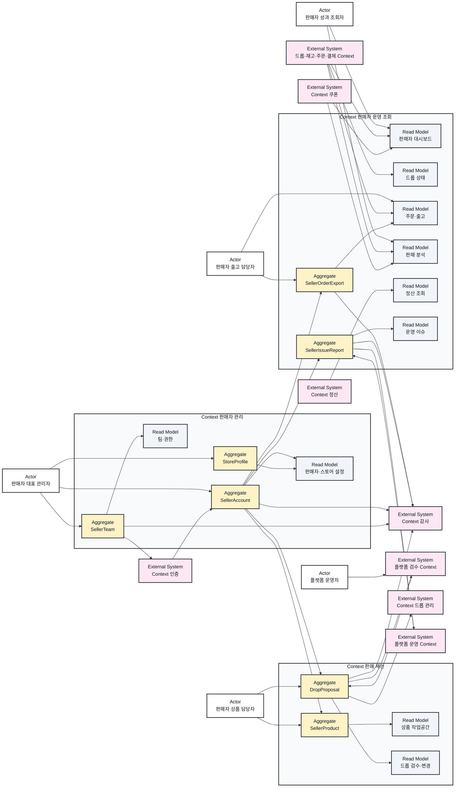
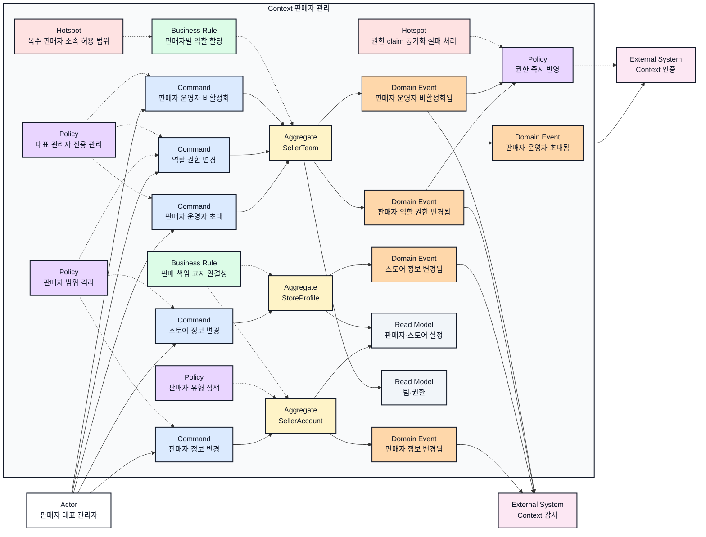
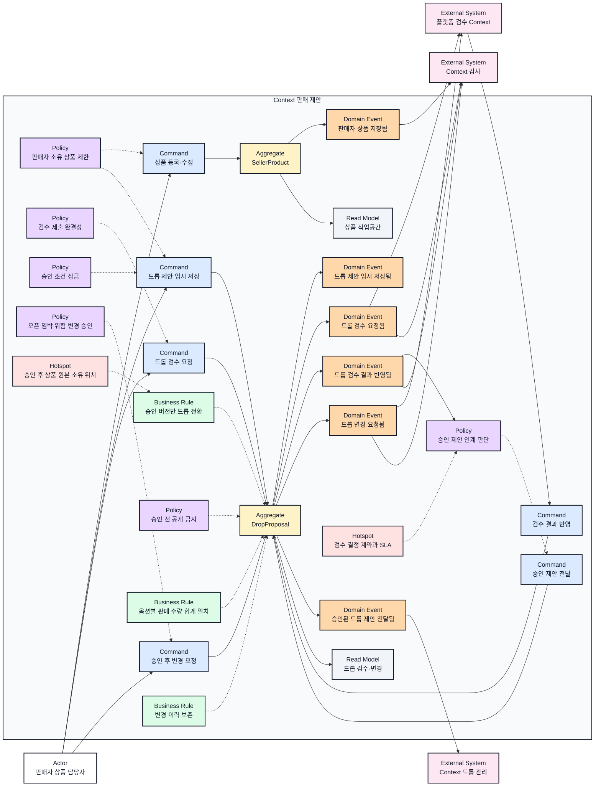
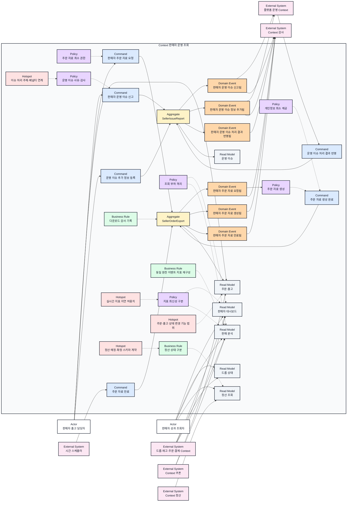

# 판매자 운영 이벤트스토밍과 바운디드 컨텍스트

## 기본 정보

- BC ID: `BC.A.200`
- ID 결정: 판매자 요구사항은 `REQ.A.03`이지만 페이지와 UI가 `PAGE.A.200~211`, `UI.A.200~211`로 묶여 있으므로 판매자 운영 경계 문서는 `BC.A.200`을 사용한다.
- 책임: 판매자 계정·스토어·팀 권한의 원본, 판매자 상품과 드롭 제안의 검수 제출 상태, 판매자 전용 조회 모델, 주문 자료 다운로드 감사, 판매자 운영 이슈 신고 경계를 정한다.
- 사용자: 판매자 대표 관리자, 판매자 상품 담당자, 판매자 출고 담당자, 판매자 성과 조회자, 플랫폼 운영자.
- 핵심 용어: 판매자 계정, 스토어 프로필, 판매자 운영자, 역할 권한, 판매자 상품, 드롭 제안, 검수 요청, 변경 요청, 주문 자료 요청, 판매 성과 투영, 판매자 운영 이슈.
- 제외 책임: 로그인 세션과 인증 식별자, 승인된 공개 드롭의 판매 상태, 쿠폰 발급·사용 원장, 구매자 주문·재고 배정·결제 원본, 정산 회계 확정, 플랫폼 검수 기준과 운영자 승인 절차, 감사 로그 장기 보관.

## 연관 태그

- 🏷️ 요구사항 참조: [REQ.A.03](../00-requirements/REQ_A_03_seller.md), [REQ.A.02](../00-requirements/REQ_A_02_coupon_benefit.md)
- 🏷️ 페이지 참조: [PAGE.A.200~211](../10-sitemap/PAGE_A_200_seller_portal/README.md)
- 🏷️ UI 참조: [UI.A.200~211](../20-ui/UI_A_200_seller_portal/README.md)
- 🏷️ UI 상세 참조: [UI.A.200](../20-ui/UI_A_200_seller_portal/UI_A_200_seller_dashboard.md), [UI.A.201](../20-ui/UI_A_200_seller_portal/UI_A_201_drop_management.md), [UI.A.202](../20-ui/UI_A_200_seller_portal/UI_A_202_product_management.md), [UI.A.203](../20-ui/UI_A_200_seller_portal/UI_A_203_drop_create_edit.md), [UI.A.204](../20-ui/UI_A_200_seller_portal/UI_A_204_review_change_request.md), [UI.A.205](../20-ui/UI_A_200_seller_portal/UI_A_205_order_fulfillment.md), [UI.A.206](../20-ui/UI_A_200_seller_portal/UI_A_206_coupon_promotion.md), [UI.A.207](../20-ui/UI_A_200_seller_portal/UI_A_207_sales_analytics.md), [UI.A.208](../20-ui/UI_A_200_seller_portal/UI_A_208_settlement.md), [UI.A.209](../20-ui/UI_A_200_seller_portal/UI_A_209_store_settings.md), [UI.A.210](../20-ui/UI_A_200_seller_portal/UI_A_210_team_permissions.md), [UI.A.211](../20-ui/UI_A_200_seller_portal/UI_A_211_operational_issues.md)
- 🏷️ UC 참조: [UC.A.02](../30-uc/UC_A_02_seller_manage_drop.md), [UC.A.300](../30-uc/UC_A_300_auth_member.md)
- 🏷️ 연관 BC 참조: [BC.A.01 한정 상품 드롭 커머스](BC_A_01_limited_drop_commerce.md), [BC.A.19 쿠폰](BC_A_19_coupon.md), [BC.A.300 인증](BC_A_300_auth_member.md)

## 컨텍스트 경계 요약

판매자 포털은 하나의 화면 제품이지만 하나의 바운디드 컨텍스트는 아니다. 이 문서는 판매자가 직접 원본 상태를 바꾸는 책임과 다른 컨텍스트의 결과를 조회하는 책임을 다음 세 경계로 나눈다.

| Context | 소유하는 원본 | 참조하는 정보 | 소유하지 않는 것 |
| --- | --- | --- | --- |
| `CTX.A.200-01 Context 판매자 관리` | 판매자 유형·상태·사업자 확인 상태, 담당자 정보, 스토어 브랜딩·기본 안내, 판매자 운영자·역할 할당 | 인증된 `user_id`, 로그인 세션, 공개 상품·평점·판매 수 집계 | 인증 식별자와 세션, 구매자 프로필, 감사 로그 장기 보관 |
| `CTX.A.200-02 Context 판매 제안` | 판매자 상품 원본, 옵션·공급 가능 수량, 드롭 제안 초안, 검수 제출 버전, 검수 결과 참조, 승인 후 변경 요청 | 판매자 권한, 플랫폼 검수 결과, 승인된 공개 드롭 식별자 | 운영자의 검수 정책과 결정 과정, 공개 드롭의 오픈·품절·주문 가능 상태 |
| `CTX.A.200-03 Context 판매자 운영 조회` | 주문 자료 요청·파일 수명주기·다운로드 감사 메타데이터, 판매자 운영 이슈 신고·추가 정보 | 드롭·재고·주문·결제·쿠폰·정산·운영 결과 이벤트와 최소 주문 정보 | 주문·출고·결제·쿠폰·정산 원본, 플랫폼 운영 이슈의 최종 판정과 페널티 |

### 경계 원칙

- 판매자 계정 범위는 모든 Command와 Read Model의 필수 경계다. `seller_id`가 다르면 식별자가 유효해도 조회하거나 변경할 수 없다.
- 판매자 역할은 Context 판매자 관리가 업무 원본을 소유하고, Context 인증은 세션과 권한 claim을 반영한다. 역할 원본을 두 컨텍스트가 동시에 소유하지 않는다.
- Context 판매 제안의 `DropProposal`은 임시 저장·검수 중·반려·보류·승인과 변경 요청 상태를 소유한다. 승인된 공개 드롭의 오픈·진행·품절·종료 상태는 `BC.A.01`의 Context 드롭 관리가 소유한다.
- Context 쿠폰은 판매자 쿠폰과 제휴 쿠폰의 정책·발급·사용·비용 원장을 소유한다. `UI.A.206`이 판매자 포털에 있다는 이유로 쿠폰 상태를 Context 판매자 운영이 소유하지 않는다.
- Context 판매자 운영 조회의 성과·정산·주문 화면은 외부 원본 이벤트를 투영한 조회 모델이다. 구매자 주문·결제 쓰기 저장소에 분석 질의를 직접 실행하지 않는다.
- 주문 자료 파일은 원본 주문의 복제본이 아니라 목적·범위·만료가 있는 일시적 산출물이다. 요청과 생성·다운로드·만료 감사 정보는 보존하되 불필요한 개인정보는 포함하지 않는다.
- 컨텍스트 간 상태 반영은 버전과 멱등키를 가진 이벤트 또는 명시적 API 계약으로 처리한다. 분산 트랜잭션으로 판매 제안, 공개 드롭, 주문, 쿠폰, 정산을 함께 잠그지 않는다.

## 경계 판단 근거

| 근거 묶음 | 확인한 책임 | 경계 판단 |
| --- | --- | --- |
| `REQ.A.03.FR-002~003`, `FR-020~021`, `UC.A.02-01~03`, `UI.A.209~210` | 판매자 정보·스토어·팀·권한은 대표 관리자가 직접 변경하고 변경 이력이 필요하다. | 독립적인 원본 상태와 권한 규칙을 가진 Context 판매자 관리로 둔다. |
| `REQ.A.03.FR-005~011`, `UC.A.02-04~09`, `UI.A.202~204` | 상품과 드롭 조건은 초안·검수·반려·승인·변경 요청의 생명주기를 가진다. | 구매자에게 공개되는 Drop과 분리해 Context 판매 제안이 제출 버전을 소유한다. |
| `REQ.A.03.FR-004`, `FR-012~014`, `FR-022`, `UI.A.200~201`, `UI.A.207` | 판매자는 여러 원천의 운영 상태와 성과를 한 화면에서 비교한다. | 원천 상태를 복제 소유하지 않는 Context 판매자 운영 조회의 투영 모델로 둔다. |
| `REQ.A.03.FR-015~016`, `NFR-010~011`, `UC.A.02-11`, `UI.A.205` | 주문 자료 요청은 목적·요청자·범위·파일·만료 감사가 필요하다. | 주문 원본과 분리된 `SellerOrderExport` 원장을 Context 판매자 운영 조회가 소유한다. |
| `REQ.A.03.FR-017`, `NFR-005`, `UI.A.211` | 판매자는 사유 코드와 증빙으로 문제를 신고하고 처리 결과를 확인한다. | 판매자 신고 원본은 `SellerIssueReport`, 최종 판정은 외부 플랫폼 운영 Context가 소유한다. |
| `REQ.A.03.FR-019`, `NFR-018`, `UI.A.208` | 정산 예정·보류·확정·차감은 구분해 보여야 하지만 최종 회계는 제외 범위다. | 정산 Context를 원본으로 두고 판매자 운영 조회에는 상태 투영만 둔다. |
| `REQ.A.03.FR-023~025`, `UC.A.02-06`, `UI.A.206` | 판매자 쿠폰과 제휴 제안은 쿠폰 정책·비용·사용 성과와 연결된다. | 기존 `BC.A.19 Context 쿠폰`의 책임으로 유지하고 판매자 포털은 그 계약을 사용한다. |

## UC와 Context 연결

유스케이스의 사용자 목표와 설명은 [UC.A.02](../30-uc/UC_A_02_seller_manage_drop.md)를 원본으로 유지한다. 이 표는 각 유스케이스가 어느 Context의 Command 또는 Read Model을 사용하는지만 기록한다.

| UC | 담당 Context | 연결 요소 |
| --- | --- | --- |
| `UC.A.02-01 판매자 정보 관리` | Context 판매자 관리 | `SellerAccount`, `StoreProfile`, 판매자·스토어 설정 |
| `UC.A.02-02~03 운영자 초대·역할 권한 관리` | Context 판매자 관리 | `SellerTeam`, 팀·권한, Context 인증·감사 계약 |
| `UC.A.02-04~05 상품 등록·드롭 판매 조건` | Context 판매 제안 | `SellerProduct`, `DropProposal`, 상품 작업공간 |
| `UC.A.02-06 판매자 쿠폰` | Context 쿠폰 | 판매자 소유 범위 계약과 판매자 쿠폰 성과 조회 |
| `UC.A.02-07~09 검수 요청·결과 확인·변경 요청` | Context 판매 제안 | `DropProposal`, 플랫폼 검수 Context, 드롭 검수·변경 |
| `UC.A.02-10 드롭 상태 조회` | Context 판매자 운영 조회 | 드롭 상태, Context 판매 제안, Context 드롭 관리 |
| `UC.A.02-11 주문/출고 자료` | Context 판매자 운영 조회 | `SellerOrderExport`, 주문·출고, 주문·재고·결제 Context |
| `UC.A.02-12 판매 통계` | Context 판매자 운영 조회 | 판매 분석, 드롭·재고·주문·결제·쿠폰 이벤트 투영 |

## UI와 Context 연결

| UI | 주 Context | 함께 사용하는 외부 Context | 판단 |
| --- | --- | --- | --- |
| `UI.A.200 판매자 대시보드` | Context 판매자 운영 조회 | 드롭 관리, 주문·결제, 쿠폰, 정산, 플랫폼 운영 | 여러 원천을 합성한 조회 화면이다. |
| `UI.A.201 드롭 관리` | Context 판매 제안, Context 판매자 운영 조회 | Context 드롭 관리 | 검수 전 제안 상태와 승인 후 운영 상태의 소유자가 다르다. |
| `UI.A.202 상품 관리` | Context 판매 제안 | Context 판매자 관리 | 판매자 상품 원본과 구매자 노출 미리보기를 다룬다. |
| `UI.A.203 드롭 등록·편집` | Context 판매 제안 | 플랫폼 검수, Context 드롭 관리 | 드롭 제안 초안과 검수 제출 버전을 만든다. |
| `UI.A.204 검수·변경 요청` | Context 판매 제안 | 플랫폼 검수 | 운영자 결정은 외부에서 받고 판매자 제출·변경 요청 상태를 보존한다. |
| `UI.A.205 주문·출고` | Context 판매자 운영 조회 | 주문·재고·결제, Context 감사 | 현재 요구사항에서는 주문 조회와 자료 요청까지만 Command로 확정한다. |
| `UI.A.206 쿠폰·프로모션` | Context 쿠폰 | Context 판매자 관리, Context 판매 제안 | 판매자 소유 범위를 검증하되 쿠폰 원장은 `BC.A.19`가 소유한다. |
| `UI.A.207 판매 분석` | Context 판매자 운영 조회 | 드롭·재고·주문·결제·쿠폰 | 동일 원천 이벤트를 사용한 분석 투영이다. |
| `UI.A.208 정산 조회` | Context 판매자 운영 조회 | Context 정산 | 정산 확정과 산식은 외부 원본이다. |
| `UI.A.209 판매자·스토어 정보` | Context 판매자 관리 | Context 인증 | 판매자 정보와 구매자 고지용 스토어 원본을 관리한다. |
| `UI.A.210 팀·권한` | Context 판매자 관리 | Context 인증, Context 감사 | 역할 원본을 관리하고 세션 claim과 감사 저장소에 결과를 전달한다. |
| `UI.A.211 운영 이슈` | Context 판매자 운영 조회 | 플랫폼 운영, 주문·재고·결제 | 판매자 신고와 추가 정보는 소유하지만 최종 판정은 소유하지 않는다. |

## Context Map

| Upstream | Downstream | 관계 | 계약 |
| --- | --- | --- | --- |
| Context 인증 | Context 판매자 관리 | Open Host Service / Published Language | 인증된 `user_id`, 세션 상태, 현재 claim을 제공한다. |
| Context 판매자 관리 | Context 인증 | Published Language | 판매자 운영자 초대·역할 변경·비활성화 이벤트로 claim 갱신을 요청한다. |
| Context 판매자 관리 | Context 판매 제안 | Customer/Supplier | `seller_id`, 구성원 역할, 상품·드롭 작업 권한을 제공한다. |
| Context 판매자 관리 | Context 판매자 운영 조회 | Customer/Supplier | 판매자 범위와 조회·다운로드 권한을 제공한다. |
| Context 판매 제안 | 플랫폼 검수 Context | Customer/Supplier | 버전이 고정된 상품·드롭 검수 스냅샷과 변경 요청을 전달한다. |
| 플랫폼 검수 Context | Context 판매 제안 | Published Language | 승인·반려·보류, 사유 코드, 수정 필드, 승인자, 결정 시각을 전달한다. |
| Context 판매 제안 | Context 드롭 관리 | Published Language | 승인된 제안 버전만 멱등키와 함께 전달한다. |
| 드롭·재고·주문·결제 Context | Context 판매자 운영 조회 | Anti-Corruption Layer | 원천 이벤트를 판매자별 운영·성과 지표로 변환한다. |
| Context 쿠폰 | Context 판매자 운영 조회 | Anti-Corruption Layer | 판매자 쿠폰 발급·사용·취소·비용·전환 성과를 제공한다. |
| Context 정산 | Context 판매자 운영 조회 | Anti-Corruption Layer | 예정·보류·확정·차감 상태와 근거 주문 참조를 제공한다. |
| Context 판매자 운영 조회 | 플랫폼 운영 Context | Customer/Supplier | 판매자 운영 이슈와 추가 증빙을 전달하고 처리 결과를 받는다. |
| 판매자 내부 Context | Context 감사 | Published Language | 프로필·권한·제안·다운로드·이슈 변경 이벤트를 전달한다. |

## Event Storming Diagram

### 전체 바운디드 컨텍스트 개요

### 판매자 정보와 팀 권한

### 상품과 드롭 제안 검수

### 판매자 조회·주문 자료·운영 이슈

## Element Catalog

| 유형 | 식별자 | 이름 | 소속 컨텍스트 | 설명 |
| --- | --- | --- | --- | --- |
| Actor | ACTOR.A.200-01 | 판매자 대표 관리자 | Context 외부 | 판매자 정보·스토어·팀·권한을 관리한다. |
| Actor | ACTOR.A.200-02 | 판매자 상품 담당자 | Context 외부 | 상품과 드롭 제안을 작성하고 검수·변경 요청을 제출한다. |
| Actor | ACTOR.A.200-03 | 판매자 출고 담당자 | Context 외부 | 주문·출고 정보를 확인하고 자료를 요청하며 운영 이슈를 신고한다. |
| Actor | ACTOR.A.200-04 | 판매자 성과 조회자 | Context 외부 | 드롭 상태와 판매 성과·정산 상태를 조회한다. |
| Actor | ACTOR.A.200-05 | 플랫폼 운영자 | Context 외부 | 외부 플랫폼 검수·운영 Context에서 검수와 이슈 처리를 수행한다. |
| Context | CTX.A.200-01 | Context 판매자 관리 | 판매자 운영 | 판매자·스토어·팀 권한의 원본을 관리한다. |
| Context | CTX.A.200-02 | Context 판매 제안 | 판매자 운영 | 판매자 상품과 드롭 제안의 제출 버전·검수 결과·변경 요청을 관리한다. |
| Context | CTX.A.200-03 | Context 판매자 운영 조회 | 판매자 운영 | 외부 상태 투영, 주문 자료 요청, 판매자 이슈 신고를 관리한다. |
| Command | CMD.A.200-01 | 판매자 정보 변경 | Context 판매자 관리 | 판매자 유형·연락처·사업자 확인 정보·기본 안내를 변경한다. |
| Command | CMD.A.200-02 | 스토어 정보 변경 | Context 판매자 관리 | 스토어명·로고·커버·소개 문구를 변경한다. |
| Command | CMD.A.200-03 | 판매자 운영자 초대 | Context 판매자 관리 | 기존 사용자에게 판매자 계정 역할을 제안한다. |
| Command | CMD.A.200-04 | 역할 권한 변경 | Context 판매자 관리 | 판매자 운영자의 역할과 작업 범위를 변경한다. |
| Command | CMD.A.200-05 | 판매자 운영자 비활성화 | Context 판매자 관리 | 판매자 계정 접근을 중지한다. |
| Command | CMD.A.200-06 | 상품 등록·수정 | Context 판매 제안 | 판매자 상품의 이미지·설명·가격·옵션·공급 정보를 저장한다. |
| Command | CMD.A.200-07 | 드롭 제안 임시 저장 | Context 판매 제안 | 드롭 일정·수량·구매 제한·배송·반품 조건을 초안으로 저장한다. |
| Command | CMD.A.200-08 | 드롭 검수 요청 | Context 판매 제안 | 버전을 고정해 플랫폼 검수 대상으로 제출한다. |
| Command | CMD.A.200-09 | 검수 결과 반영 | Context 판매 제안 | 플랫폼 검수의 승인·반려·보류 결과와 사유를 반영한다. |
| Command | CMD.A.200-10 | 승인 후 변경 요청 | Context 판매 제안 | 승인된 핵심 조건의 변경 전후 값과 사유를 제출한다. |
| Command | CMD.A.200-11 | 승인 제안 전달 | Context 판매 제안 | 승인된 제안 버전을 Context 드롭 관리에 전달한다. |
| Command | CMD.A.200-12 | 판매자 주문 자료 요청 | Context 판매자 운영 조회 | 목적·범위·형식·만료 정책을 가진 주문 자료를 요청한다. |
| Command | CMD.A.200-13 | 주문 자료 생성 완료 | Context 판매자 운영 조회 | 최소 개인정보가 포함된 파일 참조와 만료 시각을 기록한다. |
| Command | CMD.A.200-14 | 주문 자료 만료 | Context 판매자 운영 조회 | 만료된 주문 자료의 다운로드를 차단한다. |
| Command | CMD.A.200-15 | 판매자 운영 이슈 신고 | Context 판매자 운영 조회 | 주문·드롭 참조, 사유 코드, 설명, 증빙을 제출한다. |
| Command | CMD.A.200-16 | 운영 이슈 추가 정보 등록 | Context 판매자 운영 조회 | 플랫폼 운영 요청에 따라 판매자 설명과 증빙을 추가한다. |
| Command | CMD.A.200-17 | 운영 이슈 처리 결과 반영 | Context 판매자 운영 조회 | 플랫폼 운영의 처리 상태와 결과 참조를 반영한다. |
| Aggregate | AGG.A.200-01 | SellerAccount | Context 판매자 관리 | 판매자 유형·상태·확인 상태·담당자·기본 책임 고지를 소유한다. |
| Aggregate | AGG.A.200-02 | StoreProfile | Context 판매자 관리 | 구매자에게 노출할 스토어 브랜딩과 소개를 소유한다. |
| Aggregate | AGG.A.200-03 | SellerTeam | Context 판매자 관리 | 판매자 운영자 초대·역할 할당·활성 상태를 소유한다. |
| Aggregate | AGG.A.200-04 | SellerProduct | Context 판매 제안 | 판매자 상품 정보·옵션·가격·공급 가능 수량을 소유한다. |
| Aggregate | AGG.A.200-05 | DropProposal | Context 판매 제안 | 드롭 제안 초안·제출 버전·검수 결과·변경 요청을 소유한다. |
| Aggregate | AGG.A.200-06 | SellerOrderExport | Context 판매자 운영 조회 | 주문 자료 요청·파일 참조·만료·감사 메타데이터를 소유한다. |
| Aggregate | AGG.A.200-07 | SellerIssueReport | Context 판매자 운영 조회 | 판매자 신고·사유·증빙·추가 정보·외부 처리 결과 참조를 소유한다. |
| Domain Event | EVT.A.200-01 | 판매자 정보 변경됨 | Context 판매자 관리 | 판매자 원본 정보가 변경된 결과다. |
| Domain Event | EVT.A.200-02 | 스토어 정보 변경됨 | Context 판매자 관리 | 구매자 노출용 스토어 정보가 변경된 결과다. |
| Domain Event | EVT.A.200-03 | 판매자 운영자 초대됨 | Context 판매자 관리 | 판매자 계정 역할 제안이 만들어진 결과다. |
| Domain Event | EVT.A.200-04 | 판매자 역할 권한 변경됨 | Context 판매자 관리 | 판매자 운영자의 역할이 변경된 결과다. |
| Domain Event | EVT.A.200-05 | 판매자 운영자 비활성화됨 | Context 판매자 관리 | 판매자 계정 접근이 중지된 결과다. |
| Domain Event | EVT.A.200-06 | 판매자 상품 저장됨 | Context 판매 제안 | 상품 원본과 옵션·공급 정보가 저장된 결과다. |
| Domain Event | EVT.A.200-07 | 드롭 제안 임시 저장됨 | Context 판매 제안 | 검수 전 제안 버전이 저장된 결과다. |
| Domain Event | EVT.A.200-08 | 드롭 검수 요청됨 | Context 판매 제안 | 제출 버전이 플랫폼 검수에 전달된 결과다. |
| Domain Event | EVT.A.200-09 | 드롭 검수 결과 반영됨 | Context 판매 제안 | 승인·반려·보류와 사유가 제안 상태에 반영된 결과다. |
| Domain Event | EVT.A.200-10 | 드롭 변경 요청됨 | Context 판매 제안 | 승인 후 핵심 조건 변경 요청이 제출된 결과다. |
| Domain Event | EVT.A.200-11 | 승인된 드롭 제안 전달됨 | Context 판매 제안 | 승인 버전이 Context 드롭 관리에 전달된 결과다. |
| Domain Event | EVT.A.200-12 | 판매자 주문 자료 요청됨 | Context 판매자 운영 조회 | 목적과 범위를 가진 자료 요청이 접수된 결과다. |
| Domain Event | EVT.A.200-13 | 판매자 주문 자료 생성됨 | Context 판매자 운영 조회 | 다운로드 가능한 파일 참조가 생성된 결과다. |
| Domain Event | EVT.A.200-14 | 판매자 주문 자료 만료됨 | Context 판매자 운영 조회 | 파일 다운로드 가능 기간이 끝난 결과다. |
| Domain Event | EVT.A.200-15 | 판매자 운영 이슈 신고됨 | Context 판매자 운영 조회 | 사유 코드와 증빙을 가진 이슈가 접수된 결과다. |
| Domain Event | EVT.A.200-16 | 판매자 운영 이슈 정보 추가됨 | Context 판매자 운영 조회 | 판매자가 추가 설명이나 증빙을 등록한 결과다. |
| Domain Event | EVT.A.200-17 | 판매자 운영 이슈 처리 결과 반영됨 | Context 판매자 운영 조회 | 외부 플랫폼 운영의 처리 결과가 반영된 결과다. |
| Policy | POLICY.A.200-01 | 판매자 범위 격리 | 판매자 내부 Context | 모든 변경·조회 대상의 `seller_id`와 현재 권한 범위를 검증한다. |
| Policy | POLICY.A.200-02 | 대표 관리자 전용 관리 | Context 판매자 관리 | 운영자 초대·역할 변경·비활성화는 대표 관리자만 수행한다. |
| Policy | POLICY.A.200-03 | 권한 즉시 반영 | Context 판매자 관리 | 역할 변경·비활성화 결과를 다음 요청부터 적용한다. |
| Policy | POLICY.A.200-04 | 판매자 유형 정책 | Context 판매자 관리 | 사업자·전문 셀러·리셀러별 인증·등록·노출·정산 정책을 적용한다. |
| Policy | POLICY.A.200-05 | 판매자 소유 상품 제한 | Context 판매 제안 | 현재 판매자가 소유한 상품과 드롭 제안만 변경한다. |
| Policy | POLICY.A.200-06 | 검수 제출 완결성 | Context 판매 제안 | 필수 상품 정보·판매 조건·옵션별 수량·공급 상태가 유효할 때만 제출한다. |
| Policy | POLICY.A.200-07 | 승인 전 공개 금지 | Context 판매 제안 | 승인되지 않은 제안은 구매자 공개 모델로 전달하지 않는다. |
| Policy | POLICY.A.200-08 | 승인 조건 잠금 | Context 판매 제안 | 승인 후 핵심 조건은 직접 수정하지 않고 변경 요청으로만 바꾼다. |
| Policy | POLICY.A.200-09 | 오픈 임박 위험 변경 승인 | Context 판매 제안 | 오픈 임박·진행 중 핵심 조건 변경에는 플랫폼 승인을 요구한다. |
| Policy | POLICY.A.200-10 | 승인 제안 인계 판단 | Context 판매 제안 | 승인 상태와 승인 버전이 일치할 때만 외부 Drop 생성을 요청한다. |
| Policy | POLICY.A.200-11 | 주문 자료 최소 권한 | Context 판매자 운영 조회 | 출고 담당 권한과 판매자 소유 주문 범위를 확인한다. |
| Policy | POLICY.A.200-12 | 개인정보 최소 제공 | Context 판매자 운영 조회 | 출고 목적에 필요한 마스킹 정보만 파일에 포함한다. |
| Policy | POLICY.A.200-13 | 주문 자료 생성 | Context 판매자 운영 조회 | 승인된 요청 범위로 만료 가능한 파일을 비동기 생성한다. |
| Policy | POLICY.A.200-14 | 조회 부하 격리 | Context 판매자 운영 조회 | 구매자 쓰기 저장소와 분리된 이벤트 투영·집계 모델을 사용한다. |
| Policy | POLICY.A.200-15 | 지표 최신성 구분 | Context 판매자 운영 조회 | 실시간 추정과 집계 완료 지표의 기준 시각을 구분한다. |
| Policy | POLICY.A.200-16 | 운영 이슈 사유·감사 | Context 판매자 운영 조회 | 구조화된 사유 코드·actor·발생 시각·trace id를 요구한다. |
| Business Rule | RULE.A.200-01 | 판매자별 역할 할당 | Context 판매자 관리 | 역할과 권한은 전역 사용자가 아니라 판매자 계정 소속을 기준으로 부여한다. |
| Business Rule | RULE.A.200-02 | 판매 책임 고지 완결성 | Context 판매자 관리 | 판매자명·책임 주체·배송·교환·반품 안내를 구매자 화면에 제공할 수 있어야 한다. |
| Business Rule | RULE.A.200-03 | 옵션별 판매 수량 합계 일치 | Context 판매 제안 | 옵션별 판매 수량 합계와 드롭 판매 수량이 일치해야 한다. |
| Business Rule | RULE.A.200-04 | 승인 버전만 드롭 전환 | Context 판매 제안 | 검수 승인된 불변 버전만 Context 드롭 관리로 전달한다. |
| Business Rule | RULE.A.200-05 | 변경 이력 보존 | Context 판매 제안 | 변경 전후 값·변경자·사유·승인자·승인 상태를 보존한다. |
| Business Rule | RULE.A.200-06 | 다운로드 감사 기록 | Context 판매자 운영 조회 | 요청자·IP·범위·목적·파일 식별자·요청 시각·만료 시각을 기록한다. |
| Business Rule | RULE.A.200-07 | 동일 원천 이벤트 지표 재구성 | Context 판매자 운영 조회 | 조회·알림·구매 시도·재고·주문·결제 지표는 같은 원천 이벤트에서 다시 계산할 수 있어야 한다. |
| Business Rule | RULE.A.200-08 | 정산 상태 구분 | Context 판매자 운영 조회 | 예정·보류·확정·차감 예정·지급 완료를 하나의 확정 금액으로 합치지 않는다. |
| Hotspot | HOTSPOT.A.200-01 | 복수 판매자 소속 허용 범위 | Context 판매자 관리 | 한 사용자가 여러 판매자 계정에 속할 수 있는지와 계정 전환 규칙을 정해야 한다. |
| Hotspot | HOTSPOT.A.200-02 | 권한 claim 동기화 실패 처리 | Context 판매자 관리 | 역할 변경 이벤트가 Context 인증에 반영되지 않을 때 차단 우선 여부를 정해야 한다. |
| Hotspot | HOTSPOT.A.200-03 | 승인 후 상품 원본 소유 위치 | Context 판매 제안 | 승인 후 구매자 상품 원본을 SellerProduct가 계속 소유할지 공개 상품 Context로 이관할지 정해야 한다. |
| Hotspot | HOTSPOT.A.200-04 | 검수 결정 계약과 SLA | Context 판매 제안 | 승인·반려·보류 사유 스키마, 중복 결정, 결정 순서, 응답 기한을 정해야 한다. |
| Hotspot | HOTSPOT.A.200-05 | 주문·출고 상태 변경 기능 범위 | Context 판매자 운영 조회 | UI의 송장 등록·출고 처리 기능을 요구사항에 추가할지 조회·자료 요청으로 제한할지 정해야 한다. |
| Hotspot | HOTSPOT.A.200-06 | 실시간 지표 지연 허용치 | Context 판매자 운영 조회 | 추정 지표별 허용 지연과 사후 확정 전환 시각을 정해야 한다. |
| Hotspot | HOTSPOT.A.200-07 | 이슈 처리 주체·페널티 연계 | Context 판매자 운영 조회 | 신고 접수 이후 판정·페널티·정산 차감의 원본 Context와 계약을 정해야 한다. |
| Hotspot | HOTSPOT.A.200-08 | 정산 예정·확정 스키마 계약 | Context 판매자 운영 조회 | 정산 버전, 소급 차감, 보류 해제, 지급 완료 상태의 외부 계약을 정해야 한다. |
| External System | EXT.A.200-01 | Context 인증 | Context 외부 | 로그인 세션·`user_id`·권한 claim을 제공하고 역할 변경을 반영한다. |
| External System | EXT.A.200-02 | Context 감사 | Context 외부 | 보안·업무 감사 이벤트를 수집·보관·검색한다. |
| External System | EXT.A.200-03 | 플랫폼 검수 Context | Context 외부 | 상품·드롭 제안과 변경 요청을 승인·반려·보류한다. |
| External System | EXT.A.200-04 | Context 드롭 관리 | Context 외부 | 승인된 공개 드롭의 오픈·진행·품절·종료 상태를 소유한다. |
| External System | EXT.A.200-05 | 드롭·재고·주문·결제 Context | Context 외부 | 판매자 운영과 분석의 원천 이벤트·최소 주문 정보를 제공한다. |
| External System | EXT.A.200-06 | Context 쿠폰 | Context 외부 | 판매자 쿠폰·제휴 제안·발급·사용·비용 원장을 소유한다. |
| External System | EXT.A.200-07 | Context 정산 | Context 외부 | 정산 예정·보류·확정·차감·지급 상태를 소유한다. |
| External System | EXT.A.200-08 | 플랫폼 운영 Context | Context 외부 | 판매자 운영 이슈의 판정·조치·페널티를 소유한다. |
| External System | EXT.A.200-09 | 시간 스케줄러 | Context 외부 | 주문 자료 만료 시각 도달을 알린다. |
| Read Model | RM.A.200-01 | 판매자·스토어 설정 | Context 판매자 관리 | 판매자 정보·브랜딩·구매자 고지 미리보기를 제공한다. |
| Read Model | RM.A.200-02 | 팀·권한 | Context 판매자 관리 | 구성원·역할·권한표·변경 이력을 제공한다. |
| Read Model | RM.A.200-03 | 상품 작업공간 | Context 판매 제안 | 상품 목록·옵션·재고 선언·미리보기를 제공한다. |
| Read Model | RM.A.200-04 | 드롭 검수·변경 | Context 판매 제안 | 제안 상태·반려 사유·검수 이력·변경 전후 값을 제공한다. |
| Read Model | RM.A.200-05 | 판매자 대시보드 | Context 판매자 운영 조회 | 우선 작업·KPI·진행 드롭·최근 주문·일정을 제공한다. |
| Read Model | RM.A.200-06 | 드롭 상태 | Context 판매자 운영 조회 | 판매자 제안과 공개 드롭 상태를 판매자 범위로 합성한다. |
| Read Model | RM.A.200-07 | 주문·출고 | Context 판매자 운영 조회 | 최소 개인정보를 사용한 판매 주문·배송 상태와 자료 요청 상태를 제공한다. |
| Read Model | RM.A.200-08 | 판매 분석 | Context 판매자 운영 조회 | 상품·옵션·드롭·유입·쿠폰·취소 기준의 지표와 최신성을 제공한다. |
| Read Model | RM.A.200-09 | 정산 조회 | Context 판매자 운영 조회 | 정산 예정·보류·확정·차감 상태를 제공한다. |
| Read Model | RM.A.200-10 | 운영 이슈 | Context 판매자 운영 조회 | 판매자 신고·추가 정보·외부 처리 결과의 타임라인을 제공한다. |

## Element Evidence

| 요소 | 근거 문서 | 근거 내용 |
| --- | --- | --- |
| ACTOR.A.200-01~04 | [REQ.A.03 사용자 유형](../00-requirements/REQ_A_03_seller.md), [UC.A.02](../30-uc/UC_A_02_seller_manage_drop.md) | 대표 관리자·상품 담당자·출고 담당자·성과 조회자의 목표와 권한이 구분된다. |
| ACTOR.A.200-05 | `REQ.A.03.FR-008~011`, `UC.A.02-07~09` | 플랫폼 운영자는 검수·승인·반려·변경 검토의 외부 주체다. |
| CTX.A.200-01, AGG.A.200-01~03 | `REQ.A.03.FR-002~003`, `FR-020~021`, `UI.A.209~210`, `UC.A.02-01~03` | 판매자·스토어·팀 권한은 독립적인 원본과 변경 이력을 가진다. |
| CMD.A.200-01~05, EVT.A.200-01~05 | `UI.A.209~210`, `UC.A.02-01~03` | 설정 폼·구성원 초대·역할 변경·계정 비활성화가 명시돼 있다. |
| POLICY.A.200-01~04, RULE.A.200-01~02 | `REQ.A.03.NFR-001`, `NFR-012`, `NFR-014`, `NFR-019` | 판매자 범위 격리, 권한 즉시 반영, 책임 고지, 유형별 정책이 필요하다. |
| HOTSPOT.A.200-01~02 | `UI.A.210`, `REQ.A.03.NFR-014`, `BC.A.300` | 계정 전환과 역할 원본·인증 claim 동기화 실패 처리 기준은 아직 정해지지 않았다. |
| CTX.A.200-02, AGG.A.200-04~05 | `REQ.A.03.FR-005~011`, `UC.A.02-04~09`, `UI.A.202~204` | 상품·드롭 제안은 초안부터 검수·변경 요청까지 별도 상태 전이를 가진다. |
| CMD.A.200-06~11, EVT.A.200-06~11 | `UI.A.202~204`, `UC.A.02-04~09` | 상품 저장, 드롭 임시 저장, 검수 요청·결과·변경 요청과 승인 전달이 필요하다. |
| POLICY.A.200-05~10, RULE.A.200-03~05 | `REQ.A.03.NFR-002~004`, `NFR-006`, `NFR-008`, `NFR-017` | 승인 전 공개 금지, 수량 일치, 승인 조건 잠금, 위험 변경 승인과 감사가 필요하다. |
| HOTSPOT.A.200-03~04 | `REQ.A.03.FR-008~011`, `BC.A.01 Context 드롭 관리` | 승인 후 상품 원본과 플랫폼 검수 결정 계약의 최종 소유 경계가 필요하다. |
| CTX.A.200-03, RM.A.200-05~10 | `REQ.A.03.FR-004`, `FR-012~019`, `FR-022`, `UI.A.200~201`, `UI.A.205`, `UI.A.207~208`, `UI.A.211`, `UC.A.02-10~12` | 여러 원천 결과를 판매자 범위로 합성하는 조회 책임이 있다. |
| AGG.A.200-06, CMD.A.200-12~14, EVT.A.200-12~14 | `REQ.A.03.FR-015~016`, `NFR-010~011`, `UI.A.205`, `UC.A.02-11` | 주문 자료 요청·파일·만료와 보안 감사 상태를 추적해야 한다. |
| AGG.A.200-07, CMD.A.200-15~17, EVT.A.200-15~17 | `REQ.A.03.FR-017`, `NFR-005`, `UI.A.211` | 판매자 신고·사유·증빙·추가 정보와 외부 처리 결과 참조가 필요하다. |
| POLICY.A.200-11~16, RULE.A.200-06~08 | `REQ.A.03.NFR-009~011`, `NFR-013`, `NFR-015~016`, `NFR-018`, `NFR-020` | 최소 개인정보, 감사, 조회 격리, 지표 재구성, 최신성, 정산 상태 구분이 필요하다. |
| HOTSPOT.A.200-05 | `UI.A.205`, `REQ.A.03.FR-015~016`, `UC.A.02-11` | UI에는 송장 등록·출고 처리 작업이 있지만 요구사항과 UC는 조회·자료 다운로드까지만 확정한다. |
| HOTSPOT.A.200-06~08 | `REQ.A.03.NFR-005`, `NFR-016`, `NFR-018`, `UI.A.207~208`, `UI.A.211` | 지표 SLA, 이슈 판정·페널티, 정산 상태 계약은 외부 Context와 합의가 필요하다. |
| EXT.A.200-01 | `REQ.A.03.FR-001`, [BC.A.300](BC_A_300_auth_member.md) | 로그인 세션과 인증 claim은 Context 인증 책임이다. |
| EXT.A.200-03~05 | `REQ.A.03.FR-008~017`, [BC.A.01](BC_A_01_limited_drop_commerce.md) | 검수 결정과 공개 드롭·구매 원천 상태는 판매자 Context 밖에 있다. |
| EXT.A.200-06 | `REQ.A.03.FR-023~025`, [BC.A.19](BC_A_19_coupon.md) | 판매자 쿠폰·제휴 쿠폰의 원본은 Context 쿠폰이 소유한다. |
| EXT.A.200-07~08 | `REQ.A.03.FR-017`, `FR-019`, `UI.A.208`, `UI.A.211` | 정산 확정과 운영 이슈 판정은 판매자 요구사항의 제외 범위다. |

## Event Relations

| 출발 | 관계 | 도착 | 설명 |
| --- | --- | --- | --- |
| 판매자 대표 관리자 | 요청한다 | 판매자 정보 변경 스토어 정보 변경 판매자 운영자 초대 역할 권한 변경 판매자 운영자 비활성화 | 대표 관리자 전용 관리 작업을 수행한다. |
| 판매자 정보 변경 | 변경한다 | SellerAccount | 판매자 유형·상태·연락처·책임 고지를 변경한다. |
| 스토어 정보 변경 | 변경한다 | StoreProfile | 구매자 노출용 브랜딩과 소개를 변경한다. |
| 판매자 운영자 초대 역할 권한 변경 판매자 운영자 비활성화 | 변경한다 | SellerTeam | 판매자 소속과 역할 상태를 변경한다. |
| SellerAccount | 발행한다 | 판매자 정보 변경됨 | 판매자 원본 변경을 알린다. |
| StoreProfile | 발행한다 | 스토어 정보 변경됨 | 구매자 노출 정보 변경을 알린다. |
| SellerTeam | 발행한다 | 판매자 운영자 초대됨 판매자 역할 권한 변경됨 판매자 운영자 비활성화됨 | 판매자 소속·역할 상태 변경을 알린다. |
| SellerAccount StoreProfile | 투영한다 | 판매자·스토어 설정 | 설정과 구매자 노출 미리보기를 제공한다. |
| SellerTeam | 투영한다 | 팀·권한 | 구성원·권한표·변경 이력을 제공한다. |
| 판매자 운영자 초대됨 | 전달한다 | Context 인증 | 초대 대상 인증 사용자 연결을 요청한다. |
| 판매자 역할 권한 변경됨 판매자 운영자 비활성화됨 | 유발한다 | 권한 즉시 반영 | 다음 요청부터 새 권한을 사용하게 한다. |
| 권한 즉시 반영 | 요청한다 | Context 인증 | 세션 claim 갱신 또는 접근 차단을 요청한다. |
| 판매자 정보 변경됨 스토어 정보 변경됨 판매자 역할 권한 변경됨 판매자 운영자 비활성화됨 | 전달한다 | Context 감사 | 원본 변경 감사 이벤트를 전달한다. |
| 판매자 범위 격리 | 제한한다 | 판매자 정보 변경 스토어 정보 변경 역할 권한 변경 | 다른 판매자 원본을 변경하지 못하게 한다. |
| 대표 관리자 전용 관리 | 제한한다 | 판매자 운영자 초대 역할 권한 변경 판매자 운영자 비활성화 | 대표 관리자 권한을 요구한다. |
| 판매자 유형 정책 | 규정한다 | SellerAccount | 판매자 유형별 인증·등록·노출·정산 정책을 적용한다. |
| 판매자별 역할 할당 | 규정한다 | SellerTeam | 권한은 판매자 계정 소속 단위로 부여한다. |
| 판매 책임 고지 완결성 | 규정한다 | SellerAccount StoreProfile | 구매자에게 필요한 판매 책임 정보를 제공하게 한다. |
| 복수 판매자 소속 허용 범위 | 표시한다 | 판매자별 역할 할당 | 사용자와 판매자 소속 관계의 미결정을 표시한다. |
| 권한 claim 동기화 실패 처리 | 표시한다 | 권한 즉시 반영 | claim 반영 실패 시 차단 우선 여부가 필요하다. |
| 판매자 상품 담당자 | 요청한다 | 상품 등록·수정 드롭 제안 임시 저장 드롭 검수 요청 승인 후 변경 요청 | 상품과 드롭 제안을 준비하고 검수를 요청한다. |
| 플랫폼 검수 Context | 요청한다 | 검수 결과 반영 | 운영자 결정 결과를 판매 제안에 반영한다. |
| 상품 등록·수정 | 변경한다 | SellerProduct | 상품 원본과 옵션·공급 정보를 저장한다. |
| 드롭 제안 임시 저장 드롭 검수 요청 검수 결과 반영 승인 후 변경 요청 승인 제안 전달 | 변경한다 | DropProposal | 제안 버전과 검수·변경 상태를 변경한다. |
| SellerProduct | 발행한다 | 판매자 상품 저장됨 | 상품 저장 결과를 알린다. |
| DropProposal | 발행한다 | 드롭 제안 임시 저장됨 드롭 검수 요청됨 드롭 검수 결과 반영됨 드롭 변경 요청됨 승인된 드롭 제안 전달됨 | 제안 생명주기의 결과를 알린다. |
| SellerProduct | 투영한다 | 상품 작업공간 | 상품 목록·편집·미리보기를 제공한다. |
| DropProposal | 투영한다 | 드롭 검수·변경 | 상태·사유·이력·변경 비교를 제공한다. |
| 드롭 검수 요청됨 드롭 변경 요청됨 | 전달한다 | 플랫폼 검수 Context | 제출 버전과 변경 요청을 검수 대상으로 전달한다. |
| 드롭 검수 결과 반영됨 | 유발한다 | 승인 제안 인계 판단 | 승인 결과인 경우 외부 Drop 전달을 준비한다. |
| 승인 제안 인계 판단 | 요청한다 | 승인 제안 전달 | 승인 버전과 상태를 검사해 인계 Command를 요청한다. |
| 승인된 드롭 제안 전달됨 | 전달한다 | Context 드롭 관리 | 승인 버전으로 공개 Drop 생성을 요청한다. |
| 판매자 상품 저장됨 드롭 검수 요청됨 드롭 검수 결과 반영됨 드롭 변경 요청됨 | 전달한다 | Context 감사 | 제안과 검수 변경 이력을 전달한다. |
| 판매자 소유 상품 제한 | 제한한다 | 상품 등록·수정 드롭 제안 임시 저장 | 다른 판매자의 상품을 참조하지 못하게 한다. |
| 검수 제출 완결성 | 제한한다 | 드롭 검수 요청 | 필수 정보와 공급 가능 상태를 검증한다. |
| 승인 전 공개 금지 | 규정한다 | DropProposal | 승인되지 않은 제안을 공개 모델로 내보내지 않는다. |
| 승인 조건 잠금 | 제한한다 | 드롭 제안 임시 저장 | 승인된 핵심 조건의 직접 수정을 막는다. |
| 오픈 임박 위험 변경 승인 | 제한한다 | 승인 후 변경 요청 | 오픈 임박·진행 중 위험 변경은 플랫폼 승인을 요구한다. |
| 옵션별 판매 수량 합계 일치 승인 버전만 드롭 전환 변경 이력 보존 | 규정한다 | DropProposal | 제출·승인·변경의 불변조건을 규정한다. |
| 승인 후 상품 원본 소유 위치 | 표시한다 | 승인 버전만 드롭 전환 | 승인 뒤 상품 원본 경계가 미결정이다. |
| 검수 결정 계약과 SLA | 표시한다 | 승인 제안 인계 판단 | 검수 결과 순서·중복·기한 계약이 필요하다. |
| 판매자 출고 담당자 | 조회한다 | 주문·출고 | 자기 판매 주문과 배송 상태를 확인한다. |
| 판매자 출고 담당자 | 요청한다 | 판매자 주문 자료 요청 판매자 운영 이슈 신고 운영 이슈 추가 정보 등록 | 주문 자료와 운영 이슈 작업을 수행한다. |
| 판매자 성과 조회자 | 조회한다 | 판매자 대시보드 드롭 상태 판매 분석 정산 조회 | 판매 상태와 성과·정산을 확인한다. |
| 판매자 주문 자료 요청 | 변경한다 | SellerOrderExport | 목적·범위·요청자·형식을 기록한다. |
| SellerOrderExport | 발행한다 | 판매자 주문 자료 요청됨 판매자 주문 자료 생성됨 판매자 주문 자료 만료됨 | 자료 요청·생성·만료 결과를 알린다. |
| 판매자 주문 자료 요청됨 | 유발한다 | 주문 자료 생성 | 최소 개인정보 자료 생성을 준비한다. |
| 주문 자료 생성 | 요청한다 | 주문 자료 생성 완료 | 비동기 파일 생성 결과를 기록한다. |
| 시간 스케줄러 | 요청한다 | 주문 자료 만료 | 만료 시각에 다운로드를 막는다. |
| 주문 자료 생성 완료 주문 자료 만료 | 변경한다 | SellerOrderExport | 파일 참조와 만료 상태를 변경한다. |
| 판매자 운영 이슈 신고 운영 이슈 추가 정보 등록 운영 이슈 처리 결과 반영 | 변경한다 | SellerIssueReport | 신고·추가 정보·외부 결과 참조를 변경한다. |
| 플랫폼 운영 Context | 요청한다 | 운영 이슈 처리 결과 반영 | 외부 처리 결과를 판매자 이슈에 반영한다. |
| SellerIssueReport | 발행한다 | 판매자 운영 이슈 신고됨 판매자 운영 이슈 정보 추가됨 판매자 운영 이슈 처리 결과 반영됨 | 판매자 이슈 상태 변경을 알린다. |
| 판매자 운영 이슈 신고됨 판매자 운영 이슈 정보 추가됨 | 전달한다 | 플랫폼 운영 Context | 판정과 조치를 위한 자료를 전달한다. |
| SellerOrderExport | 투영한다 | 주문·출고 | 파일 생성·만료 상태를 제공한다. |
| SellerIssueReport | 투영한다 | 운영 이슈 | 신고와 외부 처리 결과 타임라인을 제공한다. |
| 드롭·재고·주문·결제 Context | 투영한다 | 판매자 대시보드 드롭 상태 주문·출고 판매 분석 | 원천 이벤트를 판매자별 조회 모델로 변환한다. |
| Context 쿠폰 | 투영한다 | 판매자 대시보드 판매 분석 | 쿠폰 사용·비용·전환 성과를 제공한다. |
| Context 정산 | 투영한다 | 정산 조회 | 예정·보류·확정·차감 상태를 제공한다. |
| 판매자 주문 자료 요청됨 판매자 주문 자료 생성됨 판매자 주문 자료 만료됨 판매자 운영 이슈 신고됨 판매자 운영 이슈 정보 추가됨 판매자 운영 이슈 처리 결과 반영됨 | 전달한다 | Context 감사 | 자료 접근과 이슈 변경 감사 이벤트를 전달한다. |
| 주문 자료 최소 권한 | 제한한다 | 판매자 주문 자료 요청 | 출고 권한과 판매자 소유 주문 범위를 확인한다. |
| 개인정보 최소 제공 | 제한한다 | 주문 자료 생성 완료 | 출고 목적에 필요한 마스킹 정보만 포함한다. |
| 조회 부하 격리 | 규정한다 | 판매자 대시보드 판매 분석 | 구매자 쓰기 저장소와 분리된 조회 모델을 사용한다. |
| 지표 최신성 구분 | 규정한다 | 판매자 대시보드 판매 분석 | 실시간 추정과 집계 완료 기준 시각을 구분한다. |
| 운영 이슈 사유·감사 | 제한한다 | 판매자 운영 이슈 신고 | 구조화된 사유와 추적 정보를 요구한다. |
| 다운로드 감사 기록 | 규정한다 | SellerOrderExport | 주문 자료 요청과 파일 수명주기를 감사 가능하게 한다. |
| 동일 원천 이벤트 지표 재구성 | 규정한다 | 판매 분석 | 지표를 같은 원천 이벤트에서 다시 계산할 수 있게 한다. |
| 정산 상태 구분 | 규정한다 | 정산 조회 | 예정·보류·확정·차감 상태를 구분한다. |
| 주문·출고 상태 변경 기능 범위 | 표시한다 | 주문·출고 | 송장 등록·출고 처리 Command 포함 여부를 보류한다. |
| 실시간 지표 지연 허용치 | 표시한다 | 지표 최신성 구분 | 지표별 허용 지연을 정해야 한다. |
| 이슈 처리 주체·페널티 연계 | 표시한다 | 운영 이슈 사유·감사 | 판정·페널티·차감 소유 Context를 정해야 한다. |
| 정산 예정·확정 스키마 계약 | 표시한다 | 정산 상태 구분 | 정산 버전과 소급 변경 계약을 정해야 한다. |

## 유비쿼터스 언어

| 용어 | 의미 | 혼동하기 쉬운 용어 |
| --- | --- | --- |
| 판매자 계정 | 상품을 판매하는 조직 또는 개인 판매 단위다. 팀 구성원 로그인 계정과 다르다. | 사용자 계정 |
| 판매자 운영자 | 특정 판매자 계정에 초대돼 역할을 부여받은 사용자다. | 플랫폼 운영자 |
| 판매자 대표 관리자 | 판매자 정보·팀·역할 변경 권한을 가진 판매자 운영자다. | DropMong 운영자 |
| 판매자 상품 | 판매자가 등록한 설명·가격·옵션·공급 정보의 원본이다. | 공개 드롭 |
| 드롭 제안 | 공개 전 판매자가 작성한 판매 일정·수량·구매 제한·배송 조건과 검수 제출 버전이다. | 승인된 Drop |
| 제출 버전 | 검수 요청 시점에 변경되지 않도록 고정한 상품·드롭 제안 스냅샷이다. | 임시 저장 초안 |
| 검수 결과 | 플랫폼 검수 Context가 결정한 승인·반려·보류와 사유다. | 판매자 자체 확인 |
| 변경 요청 | 승인된 핵심 조건을 직접 수정하지 않고 변경 전후 값과 사유를 제출한 기록이다. | 일반 수정 |
| 승인 제안 전달 | 승인된 제출 버전을 Context 드롭 관리의 공개 Drop 생성 계약으로 넘기는 일이다. | 즉시 공개 |
| 판매자 운영 조회 | 외부 원천 이벤트를 판매자 계정 범위로 투영한 조회 책임이다. | 주문·결제 원본 |
| 주문 자료 요청 | 목적·범위·요청자·형식·만료를 가진 일시적 파일 생성 요청이다. | 주문 원본 복제 |
| 판매자 운영 이슈 | 판매자가 구조화된 사유와 증빙으로 신고한 문제다. | 플랫폼 인시던트 |
| 실시간 추정 지표 | 원천 이벤트가 모두 집계되기 전 지연 가능성을 표시한 운영 수치다. | 집계 완료 지표 |
| 집계 완료 지표 | 기준 시각까지의 원천 이벤트 반영이 끝난 사후 분석 수치다. | 실시간 추정 지표 |

## 경계에서 제외한 화면 동작

| 화면 동작 | 제외 이유 | 후속 판단 |
| --- | --- | --- |
| `UI.A.205` 송장 등록·출고 처리·상태 변경 | `REQ.A.03.FR-015~016`과 `UC.A.02-11`은 주문 조회와 자료 다운로드까지만 명시한다. | 풀필먼트 요구사항에 추가할지 결정한 뒤 Command와 Aggregate 소유자를 정한다. |
| `UI.A.206` 판매자 쿠폰 생성·제휴 제안 응답 | 이미 `BC.A.19 Context 쿠폰`이 캠페인·발급·사용·비용 원장을 소유한다. | 판매자 범위 검증 계약만 `BC.A.200`과 연결한다. |
| `UI.A.208` 정산 확정·보류 해제·차감 결정 | 판매자 요구사항의 제외 범위가 최종 정산 회계다. | Context 정산의 결과를 읽기 모델로만 제공한다. |
| `UI.A.211` 페널티·보상·정산 차감 결정 | 판매자는 신고·확인 주체이며 최종 운영 판정 주체가 아니다. | 플랫폼 운영·정산 Context 간 계약에서 결정한다. |
| 구매자 공개 Drop의 오픈·품절·주문 가능 상태 변경 | `BC.A.01`의 Context 드롭 관리와 구매 경로가 원본을 소유한다. | 승인 제안 전달 뒤에는 외부 이벤트를 구독한다. |

## 후속 설계 메모

| 항목 | 메모 | 연결 문서 |
| --- | --- | --- |
| 도메인 모델 | `SellerAccount`, `StoreProfile`, `SellerTeam`, `SellerProduct`, `DropProposal`, `SellerOrderExport`, `SellerIssueReport`의 Aggregate 경계와 식별자 규칙을 구체화한다. | `SD.A.20010` 예정 |
| 영속성 | 판매자 범위 인덱스, 제출 버전 불변 저장, 다운로드 파일 만료, outbox, 분석 투영 체크포인트를 정의한다. | `SD.A.20020` 예정 |
| 서비스 | 판매자 관리·판매 제안·운영 조회를 우선 모듈 경계로 두고 배포 단위 분리는 부하와 변경 독립성이 확인된 뒤 결정한다. | `SD.A.20030` 예정 |
| API | 모든 요청에 `seller_id` 범위와 역할 권한을 적용하고 검수·드롭·쿠폰·주문·정산 외부 계약을 분리한다. | `SD.A.20040` 예정 |
| 발행 Event | 판매자 역할 변경, 검수 요청·결과, 승인 제안 전달, 주문 자료 요청·생성·만료, 운영 이슈 신고 이벤트를 공개 계약 후보로 둔다. | SCN.A.200 예정 |
| 구독 Event | 인증 claim 반영, 검수 결과, 공개 드롭 상태, 재고·주문·결제 결과, 쿠폰 비용·사용 결과, 정산 상태, 운영 이슈 처리 결과를 구독한다. | SCN.A.200 예정 |
| 외부 연동 | Context 인증·감사·플랫폼 검수·드롭 관리·쿠폰·주문/결제·정산·플랫폼 운영과 버전·멱등·재처리 계약이 필요하다. | API.A.200 예정 |
| 정책/불변조건 | 판매자 범위 격리, 승인 전 공개 금지, 승인 조건 잠금, 최소 개인정보, 조회 부하 격리는 서비스 구현에서도 같은 기준을 사용한다. | `REQ.A.03.NFR-*` |
| 열린 질문 | HOTSPOT.A.200-01~08을 해결하기 전에는 송장 처리·상품 이관·정산·페널티의 원본 책임을 확정하지 않는다. | 후속 요구사항 검토 |
