# Context 인증 이벤트스토밍과 바운디드 컨텍스트

## 기본 정보

- BC ID: `BC.A.300`
- ID 결정: 요구사항 원천은 `REQ.A.05`이지만, 페이지/UI/UC 파일명이 `A.300` 그룹으로 정리되어 있으므로 이 문서는 대상 사용자 목적 묶음에 맞춰 `BC.A.300`을 사용한다.
- 책임: 공개 탐색과 인증 필요 행동의 경계 판단, 이메일 회원가입 과정의 인증 검증, 이메일/휴대폰 로그인, 비밀번호 재설정, 휴대폰 번호 셀프 변경, 세션 발급과 회전, 인증 식별자와 `user_id` 연결 상태, role/permission claim, 감사 이벤트 전송.
- 사용자: 비회원, 구매자, CS 담당자, 플랫폼 운영자.
- 핵심 용어: 사용자 계정, 인증 식별자, 인증 수단, `user_id`, redirect target, 세션, refresh rotation, 인증 게이트, 감사 이벤트, Context 감사.
- 제외 책임: 사용자 프로필/표시 정보, 주문/결제/쿠폰 도메인 판단, PG 본인 인증, Apple/Google 실제 연동, 네이버/토스/PASS/카카오톡 실제 연동, passkey MVP 구현, 사용자 계정 병합, 수동 DB 수정.

## 연관 태그

- 🏷️ 요구사항 참조: [REQ.A.05](../00-requirements/REQ_A_05_auth_member.md), [REQ.A.01](../00-requirements/REQ_A_01_limited_drop_commerce.md)
- 🏷️ 페이지 참조: [PAGE.A.300](../10-sitemap/PAGE_A_300_auth_member/PAGE_A_300_auth_member.md), [PAGE.A.310](../10-sitemap/PAGE_A_310_password_find/PAGE_A_310_password_find.md)
- 🏷️ UI 참조: [UI.A.300](../20-ui/UI_A_300_auth_member/UI_A_300_auth_member.md), [UI.A.310](../20-ui/UI_A_310_password_find/UI_A_310_password_find.md)
- 🏷️ UC 참조: [UC.A.300](../30-uc/UC_A_300_auth_member.md)
- 🏷️ 도메인 참조: [SD.A.30010](../50-service-design/A_300_auth/A_300_10-domain-model/SD_A_30010_auth_domain_model.md)
- 🏷️ 영속성 참조: [SD.A.30020](../50-service-design/A_300_auth/A_300_20-persistence/README.md)
- 🏷️ 서비스 참조: [SD.A.30030](../50-service-design/A_300_auth/A_300_30-service/README.md)
- 🏷️ 시퀀스 참조: [SCN.A.300](../80-sequence/A_300_auth/README.md)
- 🏷️ API 참조: [SD.A.30040](../50-service-design/A_300_auth/A_300_40-api/README.md)

## 컨텍스트 경계

- 이 BC가 결정하는 것: 공개/선택적 인증/필수 인증/권한 필요 경계, 로그인 진입 의도 보존, 이메일/휴대폰 소유 검증 완료 여부, 인증 식별자와 기존 `user_id` 연결 여부, 세션 발급/갱신/폐기, 인증 식별자 잠금, 인증 수단 연동 요청과 수동 처리 감사 이벤트 전송.
- 이 BC가 참조하거나 요청하는 것: 홈/상품 상세/마이 같은 진입 화면, Context 사용자에서 발급한 `user_id`, 드롭 참여 가능성 판단에 필요한 사용자 인증 보유 여부, 판매자/운영자 역할 claim, CS/운영자 화면의 조회 요구.
- 다른 BC에 위임하는 것: `user_id` 발급과 사용자 계정 생명주기, 사용자 이름/프로필/마케팅 속성 관리, 주문/결제/쿠폰 처리, 드롭 구매 제한 최종 판정, 운영자 사이트 화면 구성, 이메일/SMS 실제 발송, 후속 소셜/OIDC/passkey 제공자 연동.
- 경계 원칙: 인증 서비스는 `user_id`를 소유하지 않고, credential, IdentityLink, session, role/permission claim만 다룬다. 사용자 계정과 프로필은 Context 사용자 책임이다.
- 감사 원칙: Context 인증은 감사 이벤트 저장소를 소유하지 않는다. 인증 결과별 감사 이벤트를 Context 감사로 전송하고, 수집/보관/검색/보존 기간은 Context 감사에서 결정한다.

## Event Storming Diagram

```mermaid
flowchart LR
  guest[Actor<br>비회원]
  buyer[Actor<br>구매자]
  cs[Actor<br>CS 담당자]
  operator[Actor<br>플랫폼 운영자]
  emailProvider[External System<br>이메일 발송 시스템]
  smsProvider[External System<br>가상 SMS 시스템]
  userContext[Context<br>사용자]
  auditContext[Context<br>감사]
  futureProvider[External System<br>후속 인증 제공자]
  opsConsole[External System<br>운영 콘솔]

  subgraph AuthBC[Context 인증]
    direction LR
    cmdCheckGate[Command<br>인증 게이트 확인]
    cmdPreserveIntent[Command<br>로그인 의도 보존]
    cmdSignup[Command<br>이메일 회원가입]
    cmdVerifyEmail[Command<br>이메일 소유 확인]
    cmdVerifyPhone[Command<br>휴대폰 소유 확인]
    cmdLinkUser[Command<br>인증 식별자 연결]
    cmdApplyRegistrationLink[Command<br>회원가입 사용자 연결 반영]
    cmdEmailSignin[Command<br>이메일 로그인]
    cmdPhoneSignin[Command<br>휴대폰 번호 로그인]
    cmdIssueSession[Command<br>세션 발급]
    cmdRefreshToken[Command<br>토큰 재발급]
    cmdLogout[Command<br>로그아웃]
    cmdRequestLink[Command<br>인증 수단 연동 요청]
    cmdSelfPhoneChange[Command<br>휴대폰 번호 셀프 변경]
    cmdPhoneChangeReauth[Command<br>이메일 재인증]
    cmdManualLink[Command<br>인증 수단 수동 처리]

    identity[Aggregate<br>Identity]
    identityLink[Aggregate<br>IdentityLink]
    registration[Aggregate<br>Registration]
    session[Aggregate<br>Session]

    evtGateApplied[Domain Event<br>인증 게이트 적용됨]
    evtIntentSaved[Domain Event<br>로그인 의도 보존됨]
    evtUserLinked[Domain Event<br>인증 식별자 연결됨]
    evtEmailVerified[Domain Event<br>이메일 인증 식별자 확인됨]
    evtPhoneLinked[Domain Event<br>휴대폰 인증 식별자 확인됨]
    evtRegistrationVerified[Domain Event<br>회원가입 인증 완료됨]
    evtRegistrationUserLinked[Domain Event<br>회원가입 사용자 연결됨]
    evtRegistrationUserLinkRejected[Domain Event<br>회원가입 사용자 연결 거부됨]
    evtSignedIn[Domain Event<br>사용자 로그인됨]
    evtSessionIssued[Domain Event<br>세션 발급됨]
    evtTokenRefreshed[Domain Event<br>토큰 재발급됨]
    evtLoggedOut[Domain Event<br>사용자 로그아웃됨]
    evtLinkRequested[Domain Event<br>인증 수단 연동 요청됨]
    evtLinkChanged[Domain Event<br>인증 수단 수동 변경됨]
    evtPhoneChangeRequested[Domain Event<br>휴대폰 번호 변경 요청됨]
    evtNewPhoneVerified[Domain Event<br>새 휴대폰 인증 식별자 확인됨]
    evtPhoneAuthReplaced[Domain Event<br>휴대폰 인증 식별자 교체됨]
    evtSigninAuditSent[Outbox Delivery Result<br>로그인 성공 감사 전송됨]
    evtSigninFailureAuditSent[Outbox Delivery Result<br>로그인 실패 감사 전송됨]
    evtTokenAuditSent[Outbox Delivery Result<br>토큰 재발급 감사 전송됨]
    evtLogoutAuditSent[Outbox Delivery Result<br>로그아웃 감사 전송됨]
    evtLinkAuditSent[Outbox Delivery Result<br>인증 수단 변경 감사 전송됨]
    evtPhoneChangeAuditSent[Outbox Delivery Result<br>휴대폰 번호 변경 감사 전송됨]
    evtLockAuditSent[Outbox Delivery Result<br>계정 잠금 감사 전송됨]

    policyPublic[Policy<br>공개 탐색 허용]
    policyRedirect[Policy<br>내부 복귀 위치만 허용]
    policyUniqueAuth[Policy<br>인증 식별자 단일 연결]
    policyLock[Policy<br>로그인 실패 5회 잠금]
    policyAuthChange[Policy<br>고위험 인증 수단 변경 분기]
    policyMvpProvider[Policy<br>후속 인증 MVP 제외]
    policyMinimalAuth[Policy<br>인증 책임 최소화]

    ruleSignup[Business Rule<br>이메일과 휴대폰 모두 확인]
    rulePhoneSignin[Business Rule<br>연결된 휴대폰만 로그인]
    ruleLinkOnly[Business Rule<br>인증 식별자 연결만 수행]
    ruleSessionTtl[Business Rule<br>세션 TTL과 회전 관리]
    ruleAudit[Business Rule<br>감사 이벤트 분리 전송]
    rulePhoneChange[Business Rule<br>휴대폰 번호 변경은 계정 병합이 아님]

    hotspotSms[Hotspot<br>SMS 제한 정책]
    hotspotManual[Hotspot<br>수동 처리 승인 필드]
    hotspotPhoneRecovery[Hotspot<br>번호 변경 복구 기준]
    hotspotProvider[Hotspot<br>후속 ProviderSubject 정책]
    hotspotTtl[Hotspot<br>초기 TTL 운영 확인]

    rmEntry[Read Model<br>인증 진입 컨텍스트]
    rmStatus[Read Model<br>인증 상태 조회]
    rmSession[Read Model<br>세션 정책 조회]
  end

  guest --> cmdCheckGate
  guest --> cmdSignup
  guest --> cmdEmailSignin
  guest --> cmdPhoneSignin
  buyer --> cmdEmailSignin
  buyer --> cmdPhoneSignin
  buyer --> cmdLogout
  buyer --> cmdRequestLink
  buyer --> cmdSelfPhoneChange
  cs --> cmdManualLink
  cs --> rmStatus
  operator --> cmdManualLink
  operator --> rmStatus
  operator --> rmSession

  cmdCheckGate --> identity
  identity --> evtGateApplied
  cmdCheckGate --> cmdPreserveIntent
  cmdPreserveIntent --> session
  session --> evtIntentSaved

  cmdSignup --> identity
  cmdSignup --> registration
  cmdSignup --> cmdVerifyEmail
  cmdSignup --> cmdVerifyPhone
  cmdVerifyEmail --> emailProvider
  cmdVerifyEmail --> identity
  identity --> evtEmailVerified
  cmdVerifyPhone --> smsProvider
  cmdVerifyPhone --> identity
  identity --> evtPhoneLinked
  identity --> registration
  registration --> evtRegistrationVerified
  evtRegistrationVerified --> userContext
  userContext --> cmdApplyRegistrationLink
  cmdApplyRegistrationLink --> registration
  cmdApplyRegistrationLink --> cmdLinkUser
  identity --> cmdLinkUser
  cmdLinkUser --> identityLink
  identityLink --> evtUserLinked
  registration --> evtRegistrationUserLinked
  registration --> evtRegistrationUserLinkRejected
  evtRegistrationUserLinked --> userContext
  evtRegistrationUserLinkRejected --> userContext

  cmdEmailSignin --> identity
  cmdPhoneSignin --> identity
  identity --> evtSignedIn
  evtSignedIn --> cmdIssueSession
  cmdIssueSession --> session
  session --> evtSessionIssued
  cmdRefreshToken --> session
  session --> evtTokenRefreshed
  cmdLogout --> session
  session --> evtLoggedOut

  cmdRequestLink --> identity
  identity --> evtLinkRequested
  cmdSelfPhoneChange --> evtPhoneChangeRequested
  cmdSelfPhoneChange --> cmdPhoneChangeReauth
  cmdPhoneChangeReauth --> cmdVerifyEmail
  cmdPhoneChangeReauth --> cmdVerifyPhone
  cmdPhoneChangeReauth --> identity
  identity --> evtNewPhoneVerified
  cmdSelfPhoneChange --> identityLink
  identityLink --> evtPhoneAuthReplaced
  cmdManualLink --> opsConsole
  cmdManualLink --> identity
  identity --> evtLinkChanged
  evtSignedIn --> evtSigninAuditSent
  cmdEmailSignin --> evtSigninFailureAuditSent
  cmdPhoneSignin --> evtSigninFailureAuditSent
  policyLock --> evtSigninFailureAuditSent
  policyLock --> evtLockAuditSent
  evtTokenRefreshed --> evtTokenAuditSent
  evtLoggedOut --> evtLogoutAuditSent
  evtLinkChanged --> evtLinkAuditSent
  evtSigninAuditSent --> auditContext
  evtSigninFailureAuditSent --> auditContext
  evtTokenAuditSent --> auditContext
  evtLogoutAuditSent --> auditContext
  evtLinkAuditSent --> auditContext
  evtPhoneAuthReplaced --> evtPhoneChangeAuditSent
  evtPhoneChangeAuditSent --> auditContext
  evtLockAuditSent --> auditContext

  policyPublic -.-> cmdCheckGate
  policyRedirect -.-> cmdPreserveIntent
  policyUniqueAuth -.-> identity
  policyLock -.-> cmdEmailSignin
  policyLock -.-> cmdPhoneSignin
  policyAuthChange -.-> cmdRequestLink
  policyAuthChange -.-> cmdSelfPhoneChange
  policyAuthChange -.-> cmdManualLink
  policyMvpProvider -.-> futureProvider
  policyMinimalAuth -.-> identityLink

  ruleSignup -.-> cmdSignup
  rulePhoneSignin -.-> cmdPhoneSignin
  ruleLinkOnly -.-> identityLink
  ruleSessionTtl -.-> session
  ruleAudit -.-> auditContext
  rulePhoneChange -.-> identityLink

  hotspotSms -.-> cmdVerifyPhone
  hotspotManual -.-> cmdManualLink
  hotspotPhoneRecovery -.-> policyAuthChange
  hotspotProvider -.-> futureProvider
  hotspotTtl -.-> ruleSessionTtl

  identity --> rmEntry
  identity --> rmStatus
  identityLink --> rmStatus
  session --> rmSession
  session --> rmEntry
  classDef actor fill:#FFFFFF,stroke:#111827,color:#111827,stroke-width:2px;
  classDef command fill:#DBEAFE,stroke:#111827,color:#111827,stroke-width:2px;
  classDef aggregate fill:#FEF3C7,stroke:#111827,color:#111827,stroke-width:2px;
  classDef event fill:#FED7AA,stroke:#111827,color:#111827,stroke-width:2px;
  classDef delivery fill:#D1FAE5,stroke:#111827,color:#111827,stroke-width:2px;
  classDef policy fill:#E9D5FF,stroke:#111827,color:#111827,stroke-width:2px;
  classDef rule fill:#DCFCE7,stroke:#111827,color:#111827,stroke-width:2px;
  classDef hotspot fill:#FEE2E2,stroke:#111827,color:#111827,stroke-width:2px;
  classDef external fill:#FCE7F3,stroke:#111827,color:#111827,stroke-width:2px;
  classDef readmodel fill:#F1F5F9,stroke:#111827,color:#111827,stroke-width:2px;
  classDef context fill:#F9FAFB,stroke:#111827,color:#111827,stroke-width:2px;

  class guest,buyer,cs,operator actor;
  class cmdCheckGate,cmdPreserveIntent,cmdSignup,cmdVerifyEmail,cmdVerifyPhone,cmdLinkUser,cmdApplyRegistrationLink,cmdEmailSignin,cmdPhoneSignin,cmdIssueSession,cmdRefreshToken,cmdLogout,cmdRequestLink,cmdSelfPhoneChange,cmdPhoneChangeReauth,cmdManualLink command;
  class identity,identityLink,registration,session aggregate;
  class evtGateApplied,evtIntentSaved,evtUserLinked,evtEmailVerified,evtPhoneLinked,evtRegistrationVerified,evtRegistrationUserLinked,evtRegistrationUserLinkRejected,evtSignedIn,evtSessionIssued,evtTokenRefreshed,evtLoggedOut,evtLinkRequested,evtLinkChanged,evtPhoneChangeRequested,evtNewPhoneVerified,evtPhoneAuthReplaced event;
  class evtSigninAuditSent,evtSigninFailureAuditSent,evtTokenAuditSent,evtLogoutAuditSent,evtLinkAuditSent,evtPhoneChangeAuditSent,evtLockAuditSent delivery;
  class policyPublic,policyRedirect,policyUniqueAuth,policyLock,policyAuthChange,policyMvpProvider,policyMinimalAuth policy;
  class ruleSignup,rulePhoneSignin,ruleLinkOnly,ruleSessionTtl,ruleAudit,rulePhoneChange rule;
  class hotspotSms,hotspotManual,hotspotPhoneRecovery,hotspotProvider,hotspotTtl hotspot;
  class emailProvider,smsProvider,futureProvider,opsConsole external;
  class userContext,auditContext context;
  class rmEntry,rmStatus,rmSession readmodel;
  style AuthBC fill:#F9FAFB,stroke:#111827,color:#111827,stroke-width:2px;
```

### 시나리오별 이벤트 스토밍

아래 다이어그램은 Context 인증 안에서 함께 읽어야 하는 인증 시나리오 단위로 요소를 중복 배치한다.

```mermaid
flowchart TB
  userContextS[Context<br>사용자]
  auditContextS[Context<br>감사]
  emailProviderS[External System<br>이메일 발송 시스템]
  smsProviderS[External System<br>가상 SMS 시스템]
  opsConsoleS[External System<br>운영 콘솔]

  subgraph AuthScenarioBC[Context 인증]
    direction TB

    subgraph SignupScenario[이메일 회원가입과 Identity 연결]
      direction LR
      sgGuest[Actor<br>비회원]
      sgSignup[Command<br>이메일 회원가입]
      sgVerifyEmail[Command<br>이메일 소유 확인]
      sgVerifyPhone[Command<br>휴대폰 소유 확인]
      sgApplyUserLink[Command<br>회원가입 사용자 연결 반영]
      sgResumeSignup[Command<br>회원가입 완료 재개]
      sgIdentity[Aggregate<br>Identity]
      sgIdentityLink[Aggregate<br>IdentityLink]
      sgRegistration[Aggregate<br>Registration]
      sgSession[Aggregate<br>Session]
      sgEmailVerified[Domain Event<br>이메일 인증 식별자 확인됨]
      sgPhoneVerified[Domain Event<br>휴대폰 인증 식별자 확인됨]
      sgRegistrationVerified[Domain Event<br>회원가입 인증 완료됨]
      sgIdentityLinked[Domain Event<br>인증 식별자 연결됨]
      sgRegistrationUserLinked[Domain Event<br>회원가입 사용자 연결됨]
      sgSignedIn[Domain Event<br>사용자 로그인됨]
      sgSessionIssued[Domain Event<br>세션 발급됨]
      sgRuleSignup[Business Rule<br>이메일과 휴대폰 모두 확인]
      sgRuleLinkOnly[Business Rule<br>인증 식별자 연결만 수행]
      sgPolicyUnique[Policy<br>인증 식별자 단일 연결]
    end

    subgraph EmailSigninScenario[이메일 로그인과 세션 발급]
      direction LR
      esBuyer[Actor<br>구매자]
      esSignin[Command<br>이메일 로그인]
      esIdentity[Aggregate<br>Identity]
      esSession[Aggregate<br>Session]
      esSignedIn[Domain Event<br>사용자 로그인됨]
      esSessionIssued[Domain Event<br>세션 발급됨]
      esSigninAudit[Outbox Delivery Result<br>로그인 성공 감사 전송됨]
      esRuleSession[Business Rule<br>세션 TTL과 회전 관리]
      esPolicyLock[Policy<br>로그인 실패 5회 잠금]
    end

    subgraph PhoneSigninScenario[휴대폰 번호 로그인]
      direction LR
      psBuyer[Actor<br>구매자]
      psPhoneSignin[Command<br>휴대폰 번호 로그인]
      psIdentity[Aggregate<br>Identity]
      psIdentityLink[Aggregate<br>IdentityLink]
      psSignedIn[Domain Event<br>사용자 로그인됨]
      psSession[Aggregate<br>Session]
      psSessionIssued[Domain Event<br>세션 발급됨]
      psRulePhone[Business Rule<br>연결된 휴대폰만 로그인]
      psPolicyUnique[Policy<br>인증 식별자 단일 연결]
    end

    subgraph LinkScenario[인증 수단 연동]
      direction LR
      lsBuyer[Actor<br>구매자]
      lsRequestLink[Command<br>인증 수단 연동 요청]
      lsIdentity[Aggregate<br>Identity]
      lsIdentityLink[Aggregate<br>IdentityLink]
      lsLinkRequested[Domain Event<br>인증 수단 연동 요청됨]
      lsLinkAudit[Outbox Delivery Result<br>인증 수단 변경 감사 전송됨]
      lsRuleLinkOnly[Business Rule<br>인증 식별자 연결만 수행]
      lsPolicyUnique[Policy<br>인증 식별자 단일 연결]
      lsPolicyAuthChange[Policy<br>고위험 인증 수단 변경 분기]
    end

    subgraph PhoneChangeScenario[휴대폰 번호 셀프 변경]
      direction LR
      pcBuyer[Actor<br>구매자]
      pcSelfChange[Command<br>휴대폰 번호 셀프 변경]
      pcReauth[Command<br>이메일 재인증]
      pcIdentity[Aggregate<br>Identity]
      pcIdentityLink[Aggregate<br>IdentityLink]
      pcRequested[Domain Event<br>휴대폰 번호 변경 요청됨]
      pcNewPhoneVerified[Domain Event<br>새 휴대폰 인증 식별자 확인됨]
      pcReplaced[Domain Event<br>휴대폰 인증 식별자 교체됨]
      pcAudit[Outbox Delivery Result<br>휴대폰 번호 변경 감사 전송됨]
      pcRulePhoneChange[Business Rule<br>휴대폰 번호 변경은 계정 병합이 아님]
      pcPolicyAuthChange[Policy<br>고위험 인증 수단 변경 분기]
      pcHotspotRecovery[Hotspot<br>번호 변경 복구 기준]
    end

    subgraph ManualScenario[CS/운영자 수동 처리]
      direction LR
      msCs[Actor<br>CS 담당자]
      msOperator[Actor<br>플랫폼 운영자]
      msManual[Command<br>인증 수단 수동 처리]
      msIdentityLink[Aggregate<br>IdentityLink]
      msChanged[Domain Event<br>인증 수단 수동 변경됨]
      msAudit[Outbox Delivery Result<br>인증 수단 변경 감사 전송됨]
      msPolicyAuthChange[Policy<br>고위험 인증 수단 변경 분기]
      msHotspotManual[Hotspot<br>수동 처리 승인 필드]
    end

    SignupScenario ~~~ EmailSigninScenario
    EmailSigninScenario ~~~ PhoneSigninScenario
    PhoneSigninScenario ~~~ LinkScenario
    LinkScenario ~~~ PhoneChangeScenario
    PhoneChangeScenario ~~~ ManualScenario
  end

  sgGuest --> sgSignup
  sgSignup --> sgVerifyEmail
  sgSignup --> sgVerifyPhone
  sgVerifyEmail --> emailProviderS
  sgVerifyPhone --> smsProviderS
  sgVerifyEmail --> sgIdentity
  sgVerifyPhone --> sgIdentity
  sgIdentity --> sgEmailVerified
  sgIdentity --> sgPhoneVerified
  sgSignup --> sgRegistration
  sgIdentity --> sgRegistration
  sgRegistration --> sgRegistrationVerified
  sgRegistrationVerified --> userContextS
  userContextS --> sgApplyUserLink
  sgApplyUserLink --> sgRegistration
  sgApplyUserLink --> sgIdentityLink
  sgIdentity --> sgIdentityLink
  sgIdentityLink --> sgIdentityLinked
  sgRegistration --> sgRegistrationUserLinked
  sgRegistrationUserLinked --> userContextS
  sgGuest --> sgResumeSignup
  sgRegistration -->|linked 상태 확인| sgResumeSignup
  sgResumeSignup --> sgRegistration
  sgResumeSignup --> sgSession
  sgSession --> sgSignedIn
  sgSession --> sgSessionIssued
  sgRuleSignup -.-> sgSignup
  sgRuleLinkOnly -.-> sgIdentityLink
  sgPolicyUnique -.-> sgIdentityLink

  esBuyer --> esSignin
  esSignin --> esIdentity
  esIdentity --> esSignedIn
  esSignedIn --> esSession
  esSession --> esSessionIssued
  esSignedIn --> esSigninAudit
  esSigninAudit --> auditContextS
  esRuleSession -.-> esSession
  esPolicyLock -.-> esSignin

  psBuyer --> psPhoneSignin
  psPhoneSignin --> psIdentity
  psIdentityLink --> psIdentity
  psIdentity --> psSignedIn
  psSignedIn --> psSession
  psSession --> psSessionIssued
  psRulePhone -.-> psPhoneSignin
  psPolicyUnique -.-> psIdentityLink

  lsBuyer --> lsRequestLink
  lsRequestLink --> lsIdentity
  lsIdentity --> lsLinkRequested
  lsRequestLink --> lsIdentityLink
  lsIdentityLink --> lsLinkAudit
  lsLinkAudit --> auditContextS
  lsRuleLinkOnly -.-> lsIdentityLink
  lsPolicyUnique -.-> lsIdentityLink
  lsPolicyAuthChange -.-> lsRequestLink

  pcBuyer --> pcSelfChange
  pcSelfChange --> pcRequested
  pcSelfChange --> pcReauth
  pcReauth --> pcIdentity
  pcIdentity --> pcNewPhoneVerified
  pcIdentity --> pcIdentityLink
  pcIdentityLink --> pcReplaced
  pcReplaced --> pcAudit
  pcAudit --> auditContextS
  pcRulePhoneChange -.-> pcIdentityLink
  pcPolicyAuthChange -.-> pcSelfChange
  pcHotspotRecovery -.-> pcPolicyAuthChange
  pcReauth --> smsProviderS

  msCs --> msManual
  msOperator --> msManual
  msManual --> opsConsoleS
  msManual --> msIdentityLink
  msIdentityLink --> msChanged
  msChanged --> msAudit
  msAudit --> auditContextS
  msPolicyAuthChange -.-> msManual
  msHotspotManual -.-> msManual

  classDef actor fill:#FFFFFF,stroke:#111827,color:#111827,stroke-width:2px;
  classDef command fill:#DBEAFE,stroke:#111827,color:#111827,stroke-width:2px;
  classDef aggregate fill:#FEF3C7,stroke:#111827,color:#111827,stroke-width:2px;
  classDef event fill:#FED7AA,stroke:#111827,color:#111827,stroke-width:2px;
  classDef delivery fill:#D1FAE5,stroke:#111827,color:#111827,stroke-width:2px;
  classDef policy fill:#E9D5FF,stroke:#111827,color:#111827,stroke-width:2px;
  classDef rule fill:#DCFCE7,stroke:#111827,color:#111827,stroke-width:2px;
  classDef hotspot fill:#FEE2E2,stroke:#111827,color:#111827,stroke-width:2px;
  classDef external fill:#FCE7F3,stroke:#111827,color:#111827,stroke-width:2px;
  classDef context fill:#F9FAFB,stroke:#111827,color:#111827,stroke-width:2px;

  class sgGuest,esBuyer,psBuyer,lsBuyer,pcBuyer,msCs,msOperator actor;
  class sgSignup,sgVerifyEmail,sgVerifyPhone,sgApplyUserLink,sgResumeSignup,esSignin,psPhoneSignin,lsRequestLink,pcSelfChange,pcReauth,msManual command;
  class sgIdentity,sgIdentityLink,sgRegistration,sgSession,esIdentity,esSession,psIdentity,psIdentityLink,psSession,lsIdentity,lsIdentityLink,pcIdentity,pcIdentityLink,msIdentityLink aggregate;
  class sgEmailVerified,sgPhoneVerified,sgRegistrationVerified,sgIdentityLinked,sgRegistrationUserLinked,sgSignedIn,sgSessionIssued,esSignedIn,esSessionIssued,psSignedIn,psSessionIssued,lsLinkRequested,pcRequested,pcNewPhoneVerified,pcReplaced,msChanged event;
  class esSigninAudit,lsLinkAudit,pcAudit,msAudit delivery;
  class sgPolicyUnique,esPolicyLock,psPolicyUnique,lsPolicyUnique,lsPolicyAuthChange,pcPolicyAuthChange,msPolicyAuthChange policy;
  class sgRuleSignup,sgRuleLinkOnly,esRuleSession,psRulePhone,lsRuleLinkOnly,pcRulePhoneChange rule;
  class pcHotspotRecovery,msHotspotManual hotspot;
  class emailProviderS,smsProviderS,opsConsoleS external;
  class userContextS,auditContextS context;
  style AuthScenarioBC fill:#F9FAFB,stroke:#111827,color:#111827,stroke-width:2px;
  style SignupScenario fill:#F8FAFC,stroke:#111827,color:#111827,stroke-width:2px;
  style EmailSigninScenario fill:#F8FAFC,stroke:#111827,color:#111827,stroke-width:2px;
  style PhoneSigninScenario fill:#F8FAFC,stroke:#111827,color:#111827,stroke-width:2px;
  style LinkScenario fill:#F8FAFC,stroke:#111827,color:#111827,stroke-width:2px;
  style PhoneChangeScenario fill:#F8FAFC,stroke:#111827,color:#111827,stroke-width:2px;
  style ManualScenario fill:#F8FAFC,stroke:#111827,color:#111827,stroke-width:2px;
```

## Element Catalog

| 유형 | 식별자 | 이름 | 소속 컨텍스트 | 설명 |
| --- | --- | --- | --- | --- |
| Actor | ACTOR.A.300-01 | 비회원 | Context 외부 | 로그인하지 않은 상태로 공개 탐색, 회원가입, 로그인 진입을 수행한다. |
| Actor | ACTOR.A.300-02 | 구매자 | Context 외부 | 기존 계정으로 로그인하고 세션, 로그아웃, 인증 수단 연동을 다룬다. |
| Actor | ACTOR.A.300-03 | CS 담당자 | Context 외부 | 사용자 문의 대응을 위해 인증 상태를 확인하고 수동 처리 요청을 지원한다. |
| Actor | ACTOR.A.300-04 | 플랫폼 운영자 | Context 외부 | 인증 수단 수동 처리, 정책 확인, 감사 이력 확인을 수행한다. |
| Command | CMD.A.300-01 | 인증 게이트 확인 | Context 인증 | 사용자의 화면/행동/API 접근이 공개인지 인증 필요인지 판단한다. |
| Command | CMD.A.300-02 | 로그인 의도 보존 | Context 인증 | 로그인 진입 시 복귀 위치와 intent를 보존한다. |
| Command | CMD.A.300-03 | 이메일 회원가입 시작 | Context 인증 | BFF가 받은 프로필/동의 opaque reference와 이메일, 비밀번호, 휴대폰 번호로 가입 예약을 시작한다. |
| Command | CMD.A.300-04 | 이메일 소유 확인 | Context 인증 | 회원가입 또는 복구 과정에서 이메일 소유를 확인한다. |
| Command | CMD.A.300-05 | 휴대폰 소유 확인 | Context 인증 | 가상 SMS 인증으로 휴대폰 소유를 확인한다. |
| Command | CMD.A.300-06 | 인증 식별자 연결 | Context 인증 | 검증된 Identity와 `user_id`를 Auth가 소유한 IdentityLink로 연결한다. 신규 가입에서는 CMD.A.300-25가 검증한 요청만 사용한다. |
| Command | CMD.A.300-07 | 이메일 로그인 | Context 인증 | 이메일과 비밀번호로 기존 인증 식별자를 검증한다. |
| Command | CMD.A.300-08 | 휴대폰 번호 로그인 | Context 인증 | 연결된 휴대폰 인증 식별자로 기존 `user_id` 로그인을 요청한다. |
| Command | CMD.A.300-09 | 세션 발급 | Context 인증 | access token, refresh token, remember-me 세션을 발급한다. |
| Command | CMD.A.300-10 | 토큰 재발급 | Context 인증 | refresh rotation 정책에 따라 새 token을 발급한다. |
| Command | CMD.A.300-11 | 로그아웃 | Context 인증 | 현재 세션 또는 refresh token을 폐기한다. |
| Command | CMD.A.300-12 | 인증 수단 연동 요청 | Context 인증 | 현재 `user_id`에 추가 인증 식별자 연결을 요청한다. |
| Command | CMD.A.300-13 | 인증 수단 수동 처리 | Context 인증 | CS/플랫폼 운영자의 승인과 사유로 인증 수단 해제 또는 재연동을 처리한다. |
| Command | CMD.A.300-14 | 휴대폰 번호 셀프 변경 | Context 인증 | 안전하게 로그인된 사용자가 대체 인증 수단으로 재인증한 뒤 새 휴대폰 번호로 교체한다. |
| Command | CMD.A.300-15 | 이메일 재인증 | Context 인증 | 현재 비밀번호를 확인하고 Session을 email Link에 재바인딩해 목적 한정 proof를 발급한다. 새 번호 확인은 CMD.A.300-18이 담당한다. |
| Command | CMD.A.300-16 | 회원가입 진행 | Context 인증 | 검증 완료 통지와 클라이언트 완료 요청의 Session 발급 단계를 현재 상태부터 재개한다. |
| Command | CMD.A.300-17 | 인증 Challenge 발급 | Context 인증 | API의 명시적 요청으로 목적별 Challenge와 발송 outbox를 만든다. |
| Command | CMD.A.300-18 | 인증 Challenge 검증 | Context 인증 | Challenge를 검증하고 성공 또는 실패 횟수를 반영한다. |
| Command | CMD.A.300-19 | 비밀번호 재설정 요청 | Context 인증 | 존재 여부를 숨긴 PasswordReset을 만들고 Challenge 발급은 별도 요청으로 둔다. |
| Command | CMD.A.300-20 | 비밀번호 변경 | Context 인증 | reset grant를 소비하고 비밀번호와 전체 Session을 교체·폐기한다. |
| Command | CMD.A.300-21 | 권한 Grant 반영 | Context 인증 | 역할/권한 원천의 version을 AccessGrant에 반영한다. |
| Command | CMD.A.300-22 | 세션 일괄 폐기 | Context 인증 | 보안 사건과 사용자 상태 변경에 맞는 Session 범위를 폐기한다. |
| Command | CMD.A.300-23 | 인증 정책 변경 | Context 인증 | TTL, rotation, 잠금, Challenge 정책 version을 변경한다. |
| Command | CMD.A.300-24 | 인증 후 행동 복구 | Context 인증 | 로그인 전 보존한 action payload를 소비 Session에 한 번 전달한다. |
| Command | CMD.A.300-25 | 회원가입 사용자 연결 반영 | Context 인증 | Context 사용자의 멱등 계정 연동 요청을 검증하고 두 가입 IdentityLink를 활성화하거나 거부한다. |
| Aggregate | AGG.A.300-01 | Identity | Context 인증 | 이메일, 휴대폰 번호, ProviderSubject 같은 인증 식별자와 검증 상태를 관리한다. |
| Aggregate | AGG.A.300-02 | IdentityLink | Context 인증 | `identity_id`와 Context 사용자에서 발급한 `user_id`의 연결 상태를 관리한다. |
| Aggregate | AGG.A.300-03 | Session | Context 인증 | access token, refresh token, remember-me, rotation, 만료 상태를 관리한다. |
| Aggregate | AGG.A.300-04 | VerificationChallenge | Context 인증 | 목적별 이메일/SMS 소유 확인의 발급, 검증, 만료, 제한을 관리한다. |
| Aggregate | AGG.A.300-05 | Registration | Context 인증 | 두 소유 확인, 가입 인증 완료 통지, Context 사용자의 계정 연동 요청 반영과 자동 로그인까지의 장기 작업을 관리한다. |
| Aggregate | AGG.A.300-06 | PasswordReset | Context 인증 | 선택한 인증 수단 확인과 비밀번호 교체를 단일 사용 작업으로 관리한다. |
| Aggregate | AGG.A.300-07 | AuthenticationIntent | Context 인증 | 검증된 복귀 위치, 사전 인증 소유 proof, action payload 참조를 관리한다. |
| Aggregate | AGG.A.300-08 | AccessGrant | Context 인증 | 사용자별 role/permission snapshot과 claim version을 관리한다. |
| Aggregate | AGG.A.300-09 | UserAuthState | Context 인증 | Context 사용자의 제한·비활성 version과 새 인증 허용 상태를 관리한다. |
| Domain Event | EVT.A.300-01 | 인증 게이트 적용됨 | Context 인증 | 개인/결제/드롭 참여 행동에 인증 필요 판정이 적용된 결과다. |
| Domain Event | EVT.A.300-02 | 로그인 의도 보존됨 | Context 인증 | 로그인 후 복귀할 redirect target 또는 intent가 저장된 결과다. |
| Domain Event | EVT.A.300-03 | 인증 식별자 연결됨 | Context 인증 | 검증된 인증 식별자가 Context 사용자에서 발급한 `user_id`에 연결된 결과다. |
| Domain Event | EVT.A.300-04 | 이메일 인증 식별자 확인됨 | Context 인증 | 이메일 소유 확인이 완료된 결과다. |
| Domain Event | EVT.A.300-05 | 휴대폰 인증 식별자 확인됨 | Context 인증 | 가상 SMS 인증을 통과해 휴대폰 소유가 확인된 결과다. |
| Domain Event | EVT.A.300-06 | 사용자 로그인됨 | Context 인증 | 이메일 또는 연결된 휴대폰 인증 식별자로 사용자가 확인된 결과다. |
| Domain Event | EVT.A.300-07 | 세션 발급됨 | Context 인증 | 인증 성공 후 token과 만료 시각이 발급된 결과다. |
| Domain Event | EVT.A.300-08 | 토큰 재발급됨 | Context 인증 | refresh token 검증과 rotation 후 새 token이 발급된 결과다. |
| Domain Event | EVT.A.300-09 | 사용자 로그아웃됨 | Context 인증 | 세션 또는 refresh token이 폐기된 결과다. |
| Domain Event | EVT.A.300-10 | 인증 수단 연동 요청됨 | Context 인증 | 추가 인증 식별자 연결 시도가 확인된 결과다. |
| Domain Event | EVT.A.300-11 | 인증 수단 수동 변경됨 | Context 인증 | CS/플랫폼 운영자 절차로 인증 수단이 해제 또는 재연동된 결과다. |
| Outbox Delivery Result | EVT.A.300-12 | 로그인 성공 감사 전송됨 | Context 인증 | 로그인 성공 event를 Context 감사가 수락한 전달 결과다. Aggregate Domain Event가 아니다. |
| Outbox Delivery Result | EVT.A.300-13 | 로그인 실패 감사 전송됨 | Context 인증 | 로그인 실패 event를 Context 감사가 수락한 전달 결과다. Aggregate Domain Event가 아니다. |
| Outbox Delivery Result | EVT.A.300-14 | 토큰 재발급 감사 전송됨 | Context 인증 | token 재발급 event의 전달 결과다. Aggregate Domain Event가 아니다. |
| Outbox Delivery Result | EVT.A.300-15 | 로그아웃 감사 전송됨 | Context 인증 | 로그아웃 event의 전달 결과다. Aggregate Domain Event가 아니다. |
| Outbox Delivery Result | EVT.A.300-16 | 인증 수단 변경 감사 전송됨 | Context 인증 | 인증 수단 변경 event의 전달 결과다. Aggregate Domain Event가 아니다. |
| Outbox Delivery Result | EVT.A.300-17 | 계정 잠금 감사 전송됨 | Context 인증 | 잠금 event의 전달 결과다. Aggregate Domain Event가 아니다. |
| Domain Event | EVT.A.300-18 | 휴대폰 번호 변경 요청됨 | Context 인증 | 사용자가 기존 `user_id`에 연결된 휴대폰 인증 식별자 교체를 요청한 결과다. |
| Domain Event | EVT.A.300-19 | 새 휴대폰 인증 식별자 확인됨 | Context 인증 | 새 휴대폰 번호의 SMS 소유 확인이 완료된 결과다. |
| Domain Event | EVT.A.300-20 | 휴대폰 인증 식별자 교체됨 | Context 인증 | 기존 휴대폰 인증 식별자가 닫히고 새 휴대폰 인증 식별자가 같은 `user_id`에 연결된 결과다. |
| Outbox Delivery Result | EVT.A.300-21 | 휴대폰 번호 변경 감사 전송됨 | Context 인증 | 휴대폰 교체 event의 전달 결과다. Aggregate Domain Event가 아니다. |
| Domain Event | EVT.A.300-22 | 인증 Challenge 발급됨 | Context 인증 | 목적별 Challenge가 발급된 사실이다. secret은 포함하지 않는다. |
| Domain Event | EVT.A.300-23 | 인증 Challenge 실패함 | Context 인증 | Challenge 실패·만료·제한 초과 사실이다. |
| Domain Event | EVT.A.300-24 | 회원가입 완료됨 | Context 인증 | Registration이 사용자 연결과 Session 발급을 완료한 사실이다. |
| Domain Event | EVT.A.300-25 | 비밀번호 변경됨 | Context 인증 | PasswordReset이 비밀번호 교체를 완료한 사실이다. |
| Domain Event | EVT.A.300-26 | 세션 폐기됨 | Context 인증 | 정책에 따라 Session이 폐기된 사실이다. |
| Domain Event | EVT.A.300-27 | Refresh 재사용 탐지됨 | Context 인증 | rotated/revoked refresh credential이 다시 사용된 사실이다. |
| Domain Event | EVT.A.300-28 | 권한 Grant 변경됨 | Context 인증 | AccessGrant version이 증가하거나 폐기된 사실이다. |
| Domain Event | EVT.A.300-29 | 인증 의도 소비됨 | Context 인증 | AuthenticationIntent가 Session 발급 또는 reset 완료로 소비된 사실이다. |
| Domain Event | EVT.A.300-30 | 인증 정책 변경됨 | Context 인증 | 인증 정책 version이 바뀐 사실이다. |
| Domain Event | EVT.A.300-31 | 로그인 실패함 | Context 인증 | 이메일/휴대폰 로그인 검증이 실패한 사실이다. |
| Domain Event | EVT.A.300-32 | 인증 식별자 잠김 | Context 인증 | LoginLockPolicy 임계치에 따라 Identity가 잠긴 사실이다. |
| Domain Event | EVT.A.300-33 | 인증 Challenge 확인됨 | Context 인증 | 목적별 Challenge가 verified된 사실이다. purpose/channel과 비민감 참조만 전달한다. |
| Domain Event | EVT.A.300-34 | 사용자 인증 제한 상태 변경됨 | Context 인증 | Context 사용자 restriction version이 반영되어 새 인증 허용 상태가 바뀐 사실이다. |
| Domain Event | EVT.A.300-35 | 회원가입 인증 완료됨 | Context 인증 | 이메일·휴대폰 소유 확인이 모두 끝나 Context 사용자에 가입 인증 완료를 통지할 수 있게 된 사실이다. |
| Domain Event | EVT.A.300-36 | 회원가입 사용자 연결됨 | Context 인증 | Context 사용자의 계정 연동 요청에 따라 두 가입 IdentityLink가 같은 `user_id`로 활성화된 사실이다. |
| Domain Event | EVT.A.300-37 | 회원가입 사용자 연결 거부됨 | Context 인증 | binding이 확인된 사용자 생성 거부, 계정 연동 기한 만료 또는 유효한 요청의 Identity 귀속 충돌로 가입 연결을 거부한 사실이다. 오래되었거나 binding이 일치하지 않는 메시지는 Registration을 바꾸지 않는다. |
| Policy | POLICY.A.300-01 | 공개 탐색 허용 | Context 인증 | 홈, 목록, 상세, 검색, 공지는 비회원 접근을 막지 않는다. |
| Policy | POLICY.A.300-02 | 내부 복귀 위치만 허용 | Context 인증 | redirect target은 검증된 내부 경로 또는 intent id만 허용한다. |
| Policy | POLICY.A.300-03 | 인증 식별자 단일 연결 | Context 인증 | 하나의 인증 식별자는 하나의 `user_id`에만 연결된다. |
| Policy | POLICY.A.300-04 | 설정형 로그인 잠금 | Context 인증 | 기본 실패 허용 5회를 사용하되 window와 잠금 시간은 배포 없이 변경한다. |
| Policy | POLICY.A.300-05 | 고위험 인증 수단 변경 분기 | Context 인증 | 안전하게 로그인되어 있고 대체 인증 수단으로 재인증한 사용자는 휴대폰 번호 셀프 변경을 할 수 있으며, 접근 불가 또는 대체 인증 불가 상태는 CS/플랫폼 운영자 수동 처리로 보낸다. |
| Policy | POLICY.A.300-06 | 후속 인증 MVP 제외 | Context 인증 | Apple/Google, 네이버/토스/PASS/카카오톡, passkey는 요구사항에는 남기되 MVP 구현에서 제외한다. |
| Policy | POLICY.A.300-07 | 인증 책임 최소화 | Context 인증 | 인증 서비스는 `user_id`를 소유하지 않고 인증 식별자 연결과 세션만 관리한다. |
| Policy | POLICY.A.300-08 | 사용자 존재 여부 은닉 | Context 인증 | 로그인·복구·휴대폰 미연결 공개 응답은 계정 존재 여부를 드러내지 않는다. |
| Policy | POLICY.A.300-09 | 세션 강제 폐기 | Context 인증 | credential·권한·보안 상태 변경 시 정해진 Session을 폐기한다. |
| Policy | POLICY.A.300-10 | 감사 원자성 | Context 인증 | 상태 변경과 OutboxEvent를 같은 로컬 트랜잭션에 저장한다. |
| Policy | POLICY.A.300-11 | 미귀속 가입 예약 회수 | Context 인증 | failed/expired Registration의 owner 없는 Identity를 cooldown 뒤 같은 행으로 재예약한다. |
| Policy | POLICY.A.300-12 | 사용자 제한 우선 | Context 인증 | UserAuthState가 active가 아니면 Session, refresh, 재인증 proof를 발급하지 않는다. |
| Policy | POLICY.A.300-13 | 재인증 자격 | Context 인증 | verified email Identity와 active credential/UserAuthState에서만 목적 한정 proof를 발급한다. |
| Business Rule | RULE.A.300-01 | 이메일과 휴대폰 모두 확인 | Context 인증 | 이메일 회원가입은 이메일 인증과 가상 SMS 휴대폰 인증 식별자 연결을 모두 만족해야 완료된다. |
| Business Rule | RULE.A.300-02 | 연결된 휴대폰만 로그인 | Context 인증 | 휴대폰 번호 로그인은 이미 연결된 휴대폰 인증 식별자가 있을 때만 기존 `user_id`로 로그인한다. |
| Business Rule | RULE.A.300-03 | 인증 식별자 연결만 수행 | Context 인증 | Context 인증은 사용자 계정을 만들거나 병합하지 않고 인증 식별자와 `user_id` 연결만 관리한다. |
| Business Rule | RULE.A.300-04 | 세션 TTL과 회전 관리 | Context 인증 | access token 15분, refresh token 14일, remember-me 30일, refresh rotation 사용을 기본값으로 둔다. |
| Business Rule | RULE.A.300-05 | 감사 이벤트 분리 전송 | Context 인증 | 인증 결과별 감사 이벤트를 구분해 Context 감사로 전송한다. |
| Business Rule | RULE.A.300-06 | 휴대폰 번호 변경은 계정 병합이 아님 | Context 인증 | 휴대폰 번호 변경은 기존 `user_id`의 휴대폰 인증 식별자를 교체하는 작업이며 다른 `user_id`와의 병합으로 처리하지 않는다. |
| Business Rule | RULE.A.300-07 | 비밀번호 재설정 단일 사용 | Context 인증 | 선택한 인증 수단 하나를 확인한 reset grant는 한 번만 사용하고 전체 Session을 폐기한다. |
| Business Rule | RULE.A.300-08 | 인가 claim 최소화 | Context 인증 | email/phone/profile을 제외하고 role/permission version만 전달한다. |
| Business Rule | RULE.A.300-09 | 가입 예약은 영구 귀속이 아님 | Context 인증 | owner와 Link가 없는 Identity는 완료되지 않은 가입 정리 뒤 새 Registration이 재검증해 사용할 수 있다. |
| Business Rule | RULE.A.300-10 | 사용자 제한 멱등 반영 | Context 인증 | restriction version을 단조 증가로 저장하고 제한 즉시 Grant와 Session을 폐기한다. |
| Hotspot | HOTSPOT.A.300-01 | SMS 제한 정책 | Context 인증 | 가상 SMS 인증번호 TTL, 재전송 제한, 실패 횟수, 테스트 번호 정책을 정해야 한다. |
| Hotspot | HOTSPOT.A.300-02 | 수동 처리 승인 필드 | Context 인증 | CS/플랫폼 운영자의 승인자, 사유, 증빙, 감사 필드 기준을 정해야 한다. |
| Hotspot | HOTSPOT.A.300-03 | 번호 변경 복구 기준 | Context 인증 | 이메일 재인증이 불가능하거나 계정 접근이 불가능할 때 CS 전환 기준을 정해야 한다. |
| Hotspot | HOTSPOT.A.300-04 | 후속 ProviderSubject 정책 | Context 인증 | Apple/Google과 국내 인증 ProviderSubject 저장, 충돌, 연동 정책을 정해야 한다. |
| Hotspot | HOTSPOT.A.300-05 | 초기 TTL 운영 확인 | Context 인증 | 초기 token TTL과 remember-me 기본값이 MVP 운영 정책에 맞는지 확인해야 한다. |
| Context | CTX.A.300-01 | Context 사용자 | Context 인증 외부 | `user_id` 발급과 사용자 계정 생명주기를 담당한다. |
| Context | CTX.A.300-02 | Context 감사 | Context 인증 외부 | 인증 감사 이벤트의 수집, 저장, 검색, 보존 기간을 담당한다. |
| External System | EXT.A.300-01 | 이메일 발송 시스템 | Context 외부 | 이메일 인증 메일 발송을 담당한다. |
| External System | EXT.A.300-02 | 가상 SMS 시스템 | Context 외부 | 휴대폰 소유 확인용 인증번호 발송을 담당한다. |
| External System | EXT.A.300-03 | 후속 인증 제공자 | Context 외부 | Apple, Google, 네이버, 토스, PASS, 카카오톡, passkey 같은 후속 인증 수단 후보를 나타낸다. |
| External System | EXT.A.300-04 | 운영 콘솔 | Context 외부 | 인증 상태 조회와 수동 처리 화면을 제공한다. |
| Read Model | RM.A.300-01 | 인증 진입 컨텍스트 | Context 인증 | 로그인 후 복귀할 redirect target, intent, 지원 인증 수단 노출 상태를 제공한다. |
| Read Model | RM.A.300-02 | 인증 상태 조회 | Context 인증 | 로그인 실패, 잠금, 인증 수단 연결 상태, 감사 상태를 CS/운영자에게 제공한다. |
| Read Model | RM.A.300-03 | 세션 정책 조회 | Context 인증 | access/refresh/remember-me TTL과 refresh rotation 설정을 제공한다. |

`EVT.A.300-12~17`, `EVT.A.300-21`은 초기 워크숍에서 붙인 legacy 전달 결과 ID다. Aggregate가 만드는 Domain Event 목록에는 포함하지 않으며, 실제 업무 event의 outbox publish 상태로만 관리한다. 상세 Aggregate·Command·Event·Policy 정의는 [SD.A.30010](../50-service-design/A_300_auth/A_300_10-domain-model/SD_A_30010_auth_domain_model.md)을 기준으로 한다.

## Element Evidence

| 요소 | 근거 문서 | 근거 내용 |
| --- | --- | --- |
| ACTOR.A.300-01 비회원 | [REQ.A.05](../00-requirements/REQ_A_05_auth_member.md), [UC.A.300](../30-uc/UC_A_300_auth_member.md) | 비회원은 공개 탐색, 회원가입, 이메일 인증, 휴대폰 인증, 로그인 진입의 주체다. |
| ACTOR.A.300-02 구매자 | [REQ.A.05](../00-requirements/REQ_A_05_auth_member.md), [UC.A.300](../30-uc/UC_A_300_auth_member.md) | 구매자는 기존 계정 로그인, 세션 유지, 로그아웃, 인증 수단 연동 요청을 수행한다. |
| ACTOR.A.300-03 CS 담당자 | [REQ.A.05](../00-requirements/REQ_A_05_auth_member.md), [UC.A.300](../30-uc/UC_A_300_auth_member.md) | CS 담당자는 인증 상태 조회와 인증 수단 변경 지원에 관여한다. |
| ACTOR.A.300-04 플랫폼 운영자 | [REQ.A.05](../00-requirements/REQ_A_05_auth_member.md), [UC.A.300](../30-uc/UC_A_300_auth_member.md) | 플랫폼 운영자는 인증 상태 조회와 인증 수단 수동 처리를 수행한다. |
| CMD.A.300-01 인증 게이트 확인 | [REQ.A.05](../00-requirements/REQ_A_05_auth_member.md), [PAGE.A.300](../10-sitemap/PAGE_A_300_auth_member/PAGE_A_300_auth_member.md), [UC.A.300](../30-uc/UC_A_300_auth_member.md) | 비회원 공개 탐색은 허용하되 알림, 관심, 장바구니, 바로 구매, 마이, 주문 내역, 결제수단은 로그인 페이지로 보낸다. |
| CMD.A.300-02 로그인 의도 보존 | [REQ.A.05](../00-requirements/REQ_A_05_auth_member.md), [PAGE.A.300](../10-sitemap/PAGE_A_300_auth_member/PAGE_A_300_auth_member.md), [UI.A.300](../20-ui/UI_A_300_auth_member/UI_A_300_auth_member.md) | 로그인 진입 컨텍스트와 redirect target을 보존하고 성공 후 원래 화면 또는 행동으로 복귀해야 한다. |
| CMD.A.300-03 이메일 회원가입 | [REQ.A.05](../00-requirements/REQ_A_05_auth_member.md), [PAGE.A.300](../10-sitemap/PAGE_A_300_auth_member/PAGE_A_300_auth_member.md), [UI.A.300](../20-ui/UI_A_300_auth_member/UI_A_300_auth_member.md), [UC.A.300](../30-uc/UC_A_300_auth_member.md) | 이메일 회원가입 화면은 이름, 이메일, 비밀번호, 휴대폰 번호, 추천인 코드, 약관 동의를 입력받는다. |
| CMD.A.300-04 이메일 소유 확인 | [REQ.A.05](../00-requirements/REQ_A_05_auth_member.md), [UC.A.300](../30-uc/UC_A_300_auth_member.md) | 이메일 인증 메일 검증은 이메일 회원가입 완료의 필수 조건이다. |
| CMD.A.300-05 휴대폰 소유 확인 | [REQ.A.05](../00-requirements/REQ_A_05_auth_member.md), [PAGE.A.300](../10-sitemap/PAGE_A_300_auth_member/PAGE_A_300_auth_member.md), [UI.A.300](../20-ui/UI_A_300_auth_member/UI_A_300_auth_member.md), [UC.A.300](../30-uc/UC_A_300_auth_member.md) | 회원가입과 휴대폰 번호 로그인은 가상 SMS 인증번호 입력, 재전송, 제한 상태를 필요로 한다. |
| CMD.A.300-06 인증 식별자 연결 | [REQ.A.05](../00-requirements/REQ_A_05_auth_member.md), [UC.A.300](../30-uc/UC_A_300_auth_member.md) | 이메일 회원가입은 인증 검증 후 `user_id` 기준 사용자로 이어지고, 인증 식별자는 하나의 `user_id`에만 연결된다. |
| CMD.A.300-07 이메일 로그인 | [REQ.A.05](../00-requirements/REQ_A_05_auth_member.md), [PAGE.A.300](../10-sitemap/PAGE_A_300_auth_member/PAGE_A_300_auth_member.md), [UI.A.300](../20-ui/UI_A_300_auth_member/UI_A_300_auth_member.md), [UC.A.300](../30-uc/UC_A_300_auth_member.md) | 이메일 로그인 화면은 이메일, 비밀번호, 로그인 상태 유지, 실패/잠금 오류를 다룬다. |
| CMD.A.300-08 휴대폰 번호 로그인 | [REQ.A.05](../00-requirements/REQ_A_05_auth_member.md), [PAGE.A.300](../10-sitemap/PAGE_A_300_auth_member/PAGE_A_300_auth_member.md), [UI.A.300](../20-ui/UI_A_300_auth_member/UI_A_300_auth_member.md), [UC.A.300](../30-uc/UC_A_300_auth_member.md) | 휴대폰 번호 로그인은 연결된 휴대폰 인증 식별자가 기존 `user_id`에 있을 때만 성공한다. |
| CMD.A.300-09 세션 발급 | [REQ.A.05](../00-requirements/REQ_A_05_auth_member.md), [PAGE.A.300](../10-sitemap/PAGE_A_300_auth_member/PAGE_A_300_auth_member.md), [UC.A.300](../30-uc/UC_A_300_auth_member.md) | 인증 성공 후 access token, refresh token, remember-me TTL과 만료 시각을 관리해야 한다. |
| CMD.A.300-10 토큰 재발급 | [REQ.A.05](../00-requirements/REQ_A_05_auth_member.md), [UC.A.300](../30-uc/UC_A_300_auth_member.md) | refresh rotation 사용과 이전 token 재사용 탐지가 요구된다. |
| CMD.A.300-11 로그아웃 | [REQ.A.05](../00-requirements/REQ_A_05_auth_member.md), [UC.A.300](../30-uc/UC_A_300_auth_member.md) | 로그아웃은 현재 세션 또는 refresh token을 더 이상 사용할 수 없게 만든다. |
| CMD.A.300-12 인증 수단 연동 요청 | [REQ.A.05](../00-requirements/REQ_A_05_auth_member.md), [UC.A.300](../30-uc/UC_A_300_auth_member.md) | 사용자는 현재 로그인한 `user_id`에 추가 인증 식별자 연동을 요청할 수 있다. |
| CMD.A.300-13 인증 수단 수동 처리 | [REQ.A.05](../00-requirements/REQ_A_05_auth_member.md), [UC.A.300](../30-uc/UC_A_300_auth_member.md) | 계정 접근이 불가능하거나 대체 인증을 통과할 수 없는 고위험 인증 수단 변경은 CS/플랫폼 운영자 수동 처리로 다룬다. |
| CMD.A.300-14 휴대폰 번호 셀프 변경 | [REQ.A.05](../00-requirements/REQ_A_05_auth_member.md), [UC.A.300](../30-uc/UC_A_300_auth_member.md), [당근 고객센터 FAQ](https://cs.kr.karrotmarket.com/wv/faqs/32) | 휴대폰 번호가 계정 접근 수단이면 번호 변경/기기 변경 시 복구 문제가 생기므로, 안전한 로그인과 대체 인증을 통과한 사용자는 새 번호 SMS 인증으로 셀프 교체할 수 있어야 한다. |
| CMD.A.300-15 이메일 재인증 | [REQ.A.05](../00-requirements/REQ_A_05_auth_member.md), [UC.A.300](../30-uc/UC_A_300_auth_member.md) | 휴대폰 번호 셀프 변경 등 고위험 작업은 이메일 비밀번호 재인증을 선행해야 한다. |
| CMD.A.300-25 회원가입 사용자 연결 반영 | [REQ.A.05](../00-requirements/REQ_A_05_auth_member.md), [UC.A.300](../30-uc/UC_A_300_auth_member.md) | Context 사용자가 발급한 새 `user_id`에 검증된 가입 Identity를 연결하되 Auth가 사용자 생성이나 계정 병합을 수행하지 않아야 한다. |
| AGG.A.300-01 Identity | [REQ.A.05](../00-requirements/REQ_A_05_auth_member.md), [UC.A.300](../30-uc/UC_A_300_auth_member.md) | 이메일 인증 식별자, 휴대폰 인증 식별자, ProviderSubject의 검증 상태가 필요하다. |
| AGG.A.300-02 IdentityLink | [REQ.A.05](../00-requirements/REQ_A_05_auth_member.md), [UC.A.300](../30-uc/UC_A_300_auth_member.md) | 하나의 인증 식별자는 하나의 `user_id`에만 연결되고, 이미 다른 `user_id`에 연결된 인증 식별자는 거부된다. |
| AGG.A.300-03 Session | [REQ.A.05](../00-requirements/REQ_A_05_auth_member.md), [UI.A.300](../20-ui/UI_A_300_auth_member/UI_A_300_auth_member.md) | 로그인 상태 유지, token TTL, refresh rotation, 세션 만료 시각이 요구된다. |
| EVT.A.300-01 인증 게이트 적용됨 | [REQ.A.05](../00-requirements/REQ_A_05_auth_member.md), [PAGE.A.300](../10-sitemap/PAGE_A_300_auth_member/PAGE_A_300_auth_member.md) | 인증이 필요한 행동을 시도하면 로그인 페이지로 이동하는 결과가 남는다. |
| EVT.A.300-02 로그인 의도 보존됨 | [REQ.A.05](../00-requirements/REQ_A_05_auth_member.md), [PAGE.A.300](../10-sitemap/PAGE_A_300_auth_member/PAGE_A_300_auth_member.md), [UI.A.300](../20-ui/UI_A_300_auth_member/UI_A_300_auth_member.md) | redirect target 또는 intent가 로그인 성공 후 복귀 기준으로 필요하다. |
| EVT.A.300-03 인증 식별자 연결됨 | [REQ.A.05](../00-requirements/REQ_A_05_auth_member.md), [UC.A.300](../30-uc/UC_A_300_auth_member.md) | 검증된 이메일/휴대폰 인증 식별자가 Context 사용자에서 발급한 `user_id`에 연결되어야 한다. |
| EVT.A.300-04 이메일 인증 식별자 확인됨 | [REQ.A.05](../00-requirements/REQ_A_05_auth_member.md), [UC.A.300](../30-uc/UC_A_300_auth_member.md) | 이메일 인증 메일 검증이 가입 완료의 필수 조건으로 제시된다. |
| EVT.A.300-05 휴대폰 인증 식별자 확인됨 | [REQ.A.05](../00-requirements/REQ_A_05_auth_member.md), [PAGE.A.300](../10-sitemap/PAGE_A_300_auth_member/PAGE_A_300_auth_member.md), [UI.A.300](../20-ui/UI_A_300_auth_member/UI_A_300_auth_member.md) | 이메일 회원가입과 휴대폰 로그인 과정에서 가상 SMS로 휴대폰 소유를 확인한다. |
| EVT.A.300-06 사용자 로그인됨 | [REQ.A.05](../00-requirements/REQ_A_05_auth_member.md), [PAGE.A.300](../10-sitemap/PAGE_A_300_auth_member/PAGE_A_300_auth_member.md), [UC.A.300](../30-uc/UC_A_300_auth_member.md) | 이메일 로그인 또는 연결된 휴대폰 인증 식별자 검증 후 로그인 성공 결과가 필요하다. |
| EVT.A.300-07 세션 발급됨 | [REQ.A.05](../00-requirements/REQ_A_05_auth_member.md), [PAGE.A.300](../10-sitemap/PAGE_A_300_auth_member/PAGE_A_300_auth_member.md) | 인증 성공 후 access token, refresh token, 세션 만료 시각을 관리한다. |
| EVT.A.300-08 토큰 재발급됨 | [REQ.A.05](../00-requirements/REQ_A_05_auth_member.md), [UC.A.300](../30-uc/UC_A_300_auth_member.md) | refresh token 갱신과 rotation 결과를 구분해야 한다. |
| EVT.A.300-09 사용자 로그아웃됨 | [REQ.A.05](../00-requirements/REQ_A_05_auth_member.md), [UC.A.300](../30-uc/UC_A_300_auth_member.md) | 로그아웃으로 해당 세션 또는 refresh token을 폐기한다. |
| EVT.A.300-10 인증 수단 연동 요청됨 | [REQ.A.05](../00-requirements/REQ_A_05_auth_member.md), [UC.A.300](../30-uc/UC_A_300_auth_member.md) | 현재 `user_id`, 연동할 인증 식별자, 소유 증명 방식, 성공/실패 결과를 전송해야 한다. |
| EVT.A.300-11 인증 수단 수동 변경됨 | [REQ.A.05](../00-requirements/REQ_A_05_auth_member.md), [UC.A.300](../30-uc/UC_A_300_auth_member.md) | 인증 수단 해제/재연동은 운영 기능과 감사 이벤트 전송으로 다룬다. |
| EVT.A.300-12 로그인 성공 감사 전송됨 | [REQ.A.05](../00-requirements/REQ_A_05_auth_member.md), [UC.A.300](../30-uc/UC_A_300_auth_member.md) | 로그인 성공은 별도 감사 이벤트로 Context 감사에 전송한다. |
| EVT.A.300-13 로그인 실패 감사 전송됨 | [REQ.A.05](../00-requirements/REQ_A_05_auth_member.md), [UI.A.300](../20-ui/UI_A_300_auth_member/UI_A_300_auth_member.md), [UC.A.300](../30-uc/UC_A_300_auth_member.md) | 로그인 실패와 실패 사유 코드는 사용자/CS가 이해할 수 있게 남아야 한다. |
| EVT.A.300-14 토큰 재발급 감사 전송됨 | [REQ.A.05](../00-requirements/REQ_A_05_auth_member.md), [UC.A.300](../30-uc/UC_A_300_auth_member.md) | token 발급/갱신은 감사 이벤트 대상이다. |
| EVT.A.300-15 로그아웃 감사 전송됨 | [REQ.A.05](../00-requirements/REQ_A_05_auth_member.md), [UC.A.300](../30-uc/UC_A_300_auth_member.md) | 로그아웃은 세션 폐기와 별도 감사 이벤트 전송 대상이다. |
| EVT.A.300-16 인증 수단 변경 감사 전송됨 | [REQ.A.05](../00-requirements/REQ_A_05_auth_member.md), [UC.A.300](../30-uc/UC_A_300_auth_member.md) | 인증 수단 연동 요청과 수동 변경은 감사 이벤트 대상이다. |
| EVT.A.300-17 계정 잠금 감사 전송됨 | [REQ.A.05](../00-requirements/REQ_A_05_auth_member.md), [PAGE.A.300](../10-sitemap/PAGE_A_300_auth_member/PAGE_A_300_auth_member.md), [UI.A.300](../20-ui/UI_A_300_auth_member/UI_A_300_auth_member.md) | 로그인 실패 5회 잠금은 사용자와 CS가 확인할 수 있게 기록되어야 한다. |
| EVT.A.300-18 휴대폰 번호 변경 요청됨 | [REQ.A.05](../00-requirements/REQ_A_05_auth_member.md), [UC.A.300](../30-uc/UC_A_300_auth_member.md) | 로그인된 사용자가 기존 `user_id`의 휴대폰 인증 식별자 교체를 요청하는 결과가 필요하다. |
| EVT.A.300-19 새 휴대폰 인증 식별자 확인됨 | [REQ.A.05](../00-requirements/REQ_A_05_auth_member.md), [UI.A.300](../20-ui/UI_A_300_auth_member/UI_A_300_auth_member.md) | 새 휴대폰 번호는 가상 SMS 인증으로 소유 확인을 완료해야 한다. |
| EVT.A.300-20 휴대폰 인증 식별자 교체됨 | [REQ.A.05](../00-requirements/REQ_A_05_auth_member.md), [UC.A.300](../30-uc/UC_A_300_auth_member.md) | 기존 휴대폰 인증 식별자는 즉시 삭제가 아니라 닫힘 상태로 전환되고 새 휴대폰 인증 식별자가 같은 `user_id`에 연결되어야 한다. |
| EVT.A.300-21 휴대폰 번호 변경 감사 전송됨 | [REQ.A.05](../00-requirements/REQ_A_05_auth_member.md), [UC.A.300](../30-uc/UC_A_300_auth_member.md) | 휴대폰 인증 식별자 교체는 Context 감사로 별도 감사 이벤트를 전송해야 한다. |
| POLICY.A.300-01 공개 탐색 허용 | [REQ.A.05](../00-requirements/REQ_A_05_auth_member.md), [PAGE.A.300](../10-sitemap/PAGE_A_300_auth_member/PAGE_A_300_auth_member.md), [UC.A.300](../30-uc/UC_A_300_auth_member.md) | 홈, 드롭 목록, 드롭 상세, 검색, 공지는 비회원에게 열려 있다. |
| POLICY.A.300-02 내부 복귀 위치만 허용 | [REQ.A.05](../00-requirements/REQ_A_05_auth_member.md), [PAGE.A.300](../10-sitemap/PAGE_A_300_auth_member/PAGE_A_300_auth_member.md) | redirect target은 변조되거나 외부 URL로 사용되지 않아야 한다. |
| POLICY.A.300-03 인증 식별자 단일 연결 | [REQ.A.05](../00-requirements/REQ_A_05_auth_member.md) | 이미 다른 `user_id`에 등록된 인증 식별자는 현재 계정에 연동할 수 없다. |
| POLICY.A.300-04 로그인 실패 5회 잠금 | [REQ.A.05](../00-requirements/REQ_A_05_auth_member.md), [PAGE.A.300](../10-sitemap/PAGE_A_300_auth_member/PAGE_A_300_auth_member.md), [UI.A.300](../20-ui/UI_A_300_auth_member/UI_A_300_auth_member.md) | 로그인 실패 5회가 발생하면 전역 인증 식별자 잠금 정책이 적용된다. |
| POLICY.A.300-05 고위험 인증 수단 변경 분기 | [REQ.A.05](../00-requirements/REQ_A_05_auth_member.md), [UC.A.300](../30-uc/UC_A_300_auth_member.md), [당근 고객센터 FAQ](https://cs.kr.karrotmarket.com/wv/faqs/32) | 인증 수단 변경은 고위험 작업이지만, 안전한 로그인과 대체 인증을 통과한 휴대폰 번호 변경은 셀프 교체를 허용하고 접근 불가/대체 인증 불가 상태는 CS/운영자 수동 처리로 보낸다. |
| POLICY.A.300-06 후속 인증 MVP 제외 | [REQ.A.05](../00-requirements/REQ_A_05_auth_member.md), [PAGE.A.300](../10-sitemap/PAGE_A_300_auth_member/PAGE_A_300_auth_member.md), [UI.A.300](../20-ui/UI_A_300_auth_member/UI_A_300_auth_member.md) | Apple/Google, 네이버/토스/PASS/카카오톡, passkey는 요구사항에 남기되 MVP 구현 대상이 아니다. |
| POLICY.A.300-07 인증 책임 최소화 | [REQ.A.05](../00-requirements/REQ_A_05_auth_member.md) | auth-service는 `user_id`를 소유하지 않고 credential, IdentityLink, session, role/permission claim만 다룬다. |
| RULE.A.300-01 이메일과 휴대폰 모두 확인 | [REQ.A.05](../00-requirements/REQ_A_05_auth_member.md), [PAGE.A.300](../10-sitemap/PAGE_A_300_auth_member/PAGE_A_300_auth_member.md), [UI.A.300](../20-ui/UI_A_300_auth_member/UI_A_300_auth_member.md), [UC.A.300](../30-uc/UC_A_300_auth_member.md) | 이메일 회원가입은 이메일 인증과 가상 SMS 휴대폰 인증 식별자 연결을 모두 요구한다. |
| RULE.A.300-02 연결된 휴대폰만 로그인 | [REQ.A.05](../00-requirements/REQ_A_05_auth_member.md), [PAGE.A.300](../10-sitemap/PAGE_A_300_auth_member/PAGE_A_300_auth_member.md), [UI.A.300](../20-ui/UI_A_300_auth_member/UI_A_300_auth_member.md), [UC.A.300](../30-uc/UC_A_300_auth_member.md) | 휴대폰 번호 로그인은 연결된 `user_id`가 없으면 실패와 가입/연동 안내를 반환한다. |
| RULE.A.300-03 인증 식별자 연결만 수행 | [REQ.A.05](../00-requirements/REQ_A_05_auth_member.md) | 이메일, 휴대폰, ProviderSubject가 같거나 달라도 Context 인증은 사용자 계정 생성이나 병합을 수행하지 않는다. |
| RULE.A.300-04 세션 TTL과 회전 관리 | [REQ.A.05](../00-requirements/REQ_A_05_auth_member.md), [PAGE.A.300](../10-sitemap/PAGE_A_300_auth_member/PAGE_A_300_auth_member.md), [UI.A.300](../20-ui/UI_A_300_auth_member/UI_A_300_auth_member.md) | access token 15분, refresh token 14일, remember-me 30일, refresh rotation 사용이 초기 기본값이다. |
| RULE.A.300-05 감사 이벤트 분리 전송 | [REQ.A.05](../00-requirements/REQ_A_05_auth_member.md), [UC.A.300](../30-uc/UC_A_300_auth_member.md) | Context 인증은 로그인 성공/실패, token 갱신, 로그아웃, 계정 잠금, 인증 수단 변경을 서로 다른 감사 이벤트로 전송한다. |
| RULE.A.300-06 휴대폰 번호 변경은 계정 병합이 아님 | [REQ.A.05](../00-requirements/REQ_A_05_auth_member.md), [UC.A.300](../30-uc/UC_A_300_auth_member.md) | 휴대폰 번호 변경은 기존 `user_id`의 휴대폰 인증 식별자 교체이며 다른 `user_id`와의 병합으로 처리하지 않는다. |
| HOTSPOT.A.300-01 SMS 제한 정책 | [REQ.A.05](../00-requirements/REQ_A_05_auth_member.md), [PAGE.A.300](../10-sitemap/PAGE_A_300_auth_member/PAGE_A_300_auth_member.md), [UI.A.300](../20-ui/UI_A_300_auth_member/UI_A_300_auth_member.md) | 가상 SMS 인증번호 TTL, 재전송 제한, 실패 횟수 제한, 테스트 번호 정책은 확인 필요 항목이다. |
| HOTSPOT.A.300-02 수동 처리 승인 필드 | [REQ.A.05](../00-requirements/REQ_A_05_auth_member.md), [UC.A.300](../30-uc/UC_A_300_auth_member.md) | 인증 수단 연동의 소유 증명 방식과 CS/플랫폼 운영자 수동 처리 화면의 승인 필드를 정해야 한다. |
| HOTSPOT.A.300-03 번호 변경 복구 기준 | [REQ.A.05](../00-requirements/REQ_A_05_auth_member.md), [당근 고객센터 FAQ](https://cs.kr.karrotmarket.com/wv/faqs/32) | 기존 번호 접근 불가, 이메일 재인증 불가, 계정 접근 불가 상태에서 CS/운영자 처리로 전환하는 기준을 정해야 한다. |
| HOTSPOT.A.300-04 후속 ProviderSubject 정책 | [REQ.A.05](../00-requirements/REQ_A_05_auth_member.md), [PAGE.A.300](../10-sitemap/PAGE_A_300_auth_member/PAGE_A_300_auth_member.md), [UI.A.300](../20-ui/UI_A_300_auth_member/UI_A_300_auth_member.md) | Apple/Google 후속 구현 시 ProviderSubject 저장 방식과 IdentityLink 정책을 정해야 한다. |
| HOTSPOT.A.300-05 초기 TTL 운영 확인 | [REQ.A.05](../00-requirements/REQ_A_05_auth_member.md) | access token 15분, refresh token 14일, remember-me 30일 기본값이 MVP 운영 정책에 맞는지 확인해야 한다. |
| CTX.A.300-01 Context 사용자 | [REQ.A.05](../00-requirements/REQ_A_05_auth_member.md), [UC.A.300](../30-uc/UC_A_300_auth_member.md) | 사용자 식별자는 `user_id` 중심이지만, Context 인증은 사용자 프로필과 계정 생명주기를 소유하지 않는다. |
| CTX.A.300-02 Context 감사 | [REQ.A.05](../00-requirements/REQ_A_05_auth_member.md), [UC.A.300](../30-uc/UC_A_300_auth_member.md) | 인증 관련 행위는 민감 원문 없이 감사 이벤트로 남아야 하지만, 저장과 검색 책임은 Context 인증 밖으로 분리한다. |
| EXT.A.300-01 이메일 발송 시스템 | [REQ.A.05](../00-requirements/REQ_A_05_auth_member.md), [UC.A.300](../30-uc/UC_A_300_auth_member.md) | 이메일 인증 메일 검증이 회원가입과 복구에 필요하다. |
| EXT.A.300-02 가상 SMS 시스템 | [REQ.A.05](../00-requirements/REQ_A_05_auth_member.md), [PAGE.A.300](../10-sitemap/PAGE_A_300_auth_member/PAGE_A_300_auth_member.md), [UI.A.300](../20-ui/UI_A_300_auth_member/UI_A_300_auth_member.md) | 휴대폰 번호 소유 확인은 가상 SMS 인증번호로 처리한다. |
| EXT.A.300-03 후속 인증 제공자 | [REQ.A.05](../00-requirements/REQ_A_05_auth_member.md), [PAGE.A.300](../10-sitemap/PAGE_A_300_auth_member/PAGE_A_300_auth_member.md), [UI.A.300](../20-ui/UI_A_300_auth_member/UI_A_300_auth_member.md) | Apple/Google 버튼과 국내 인증/passkey 후보는 MVP 이후 확장 대상으로 남아 있다. |
| EXT.A.300-04 운영 콘솔 | [REQ.A.05](../00-requirements/REQ_A_05_auth_member.md), [UC.A.300](../30-uc/UC_A_300_auth_member.md) | CS/플랫폼 운영자의 인증 상태 조회와 인증 수단 수동 처리가 운영 기능으로 필요하다. |
| RM.A.300-01 인증 진입 컨텍스트 | [PAGE.A.300](../10-sitemap/PAGE_A_300_auth_member/PAGE_A_300_auth_member.md), [UI.A.300](../20-ui/UI_A_300_auth_member/UI_A_300_auth_member.md) | 로그인 메인은 redirect target과 지원 인증 수단 활성 여부를 표시해야 한다. |
| RM.A.300-02 인증 상태 조회 | [REQ.A.05](../00-requirements/REQ_A_05_auth_member.md), [UC.A.300](../30-uc/UC_A_300_auth_member.md), [UI.A.300](../20-ui/UI_A_300_auth_member/UI_A_300_auth_member.md) | 로그인 실패, 잠금, 인증 수단 연결 상태, 실패 사유 코드를 CS가 이해할 수 있어야 한다. |
| RM.A.300-03 세션 정책 조회 | [REQ.A.05](../00-requirements/REQ_A_05_auth_member.md), [UI.A.300](../20-ui/UI_A_300_auth_member/UI_A_300_auth_member.md) | 세션 TTL, remember-me, refresh rotation 설정은 화면과 운영 정책의 입력값이다. |

## Event Relations

| 출발 | 관계 | 도착 | 설명 |
| --- | --- | --- | --- |
| 비회원 | 요청한다 | 인증 게이트 확인 | 비회원이 공개 화면이나 로그인 필요 행동에 접근한다. |
| 인증 게이트 확인 | 변경한다 | Identity | 접근 요청의 인증 필요 여부와 인증 상태를 확인한다. |
| Identity | 발행한다 | 인증 게이트 적용됨 | 개인/결제/드롭 참여 행동에는 인증 게이트가 적용된다. |
| 인증 게이트 확인 | 요청한다 | 로그인 의도 보존 | 인증이 필요한 행동이면 복귀 위치와 intent 저장을 요청한다. |
| 로그인 의도 보존 | 변경한다 | Session | 인증 전 임시 진입 컨텍스트를 저장한다. |
| Session | 발행한다 | 로그인 의도 보존됨 | 로그인 성공 후 사용할 복귀 기준이 남는다. |
| 비회원 | 요청한다 | 이메일 회원가입 | 이메일 기반 가입을 시작한다. |
| 이메일 회원가입 | 변경한다 | Identity | 이메일/휴대폰 인증 식별자의 검증 상태를 만든다. |
| 이메일 회원가입 | 변경한다 | Registration | 가입 인증과 Context 간 연동 상태를 추적한다. |
| 이메일 회원가입 | 요청한다 | 이메일 소유 확인 | 이메일 인증 메일 검증을 요구한다. |
| 이메일 회원가입 | 요청한다 | 휴대폰 소유 확인 | 가상 SMS 휴대폰 인증을 요구한다. |
| 이메일 소유 확인 | 요청한다 | 이메일 발송 시스템 | 이메일 소유 확인 메시지를 보낸다. |
| 휴대폰 소유 확인 | 요청한다 | 가상 SMS 시스템 | 휴대폰 인증번호 발송과 검증을 수행한다. |
| Identity | 발행한다 | 이메일 인증 식별자 확인됨 | 이메일 소유 확인 결과를 남긴다. |
| Identity | 발행한다 | 휴대폰 인증 식별자 확인됨 | 휴대폰 소유 확인 결과를 남긴다. |
| Registration | 발행한다 | 회원가입 인증 완료됨 | 두 소유 확인과 verification binding을 Context 사용자에 전달한다. |
| 회원가입 인증 완료됨 | 제공한다 | Context 사용자 | Context 사용자가 사용자 계정과 `user_id`를 만들 수 있는 비민감 근거를 제공한다. |
| Context 사용자 | 요청한다 | 회원가입 사용자 연결 반영 | 발급한 `user_id`, `link_request_id`, verification binding을 Context 인증에 멱등하게 전달한다. |
| 회원가입 사용자 연결 반영 | 요청한다 | 인증 식별자 연결 | 검증된 이메일·휴대폰 Identity를 연결 대상으로 전달한다. |
| 인증 식별자 연결 | 변경한다 | IdentityLink | `identity_id`와 `user_id` 연결을 확정한다. |
| IdentityLink | 발행한다 | 인증 식별자 연결됨 | 인증 식별자와 사용자 식별자의 연결 결과를 남긴다. |
| Registration | 발행한다 | 회원가입 사용자 연결됨 | 두 가입 IdentityLink가 활성화된 결과를 Context 사용자에 전달한다. |
| Registration | 발행한다 | 회원가입 사용자 연결 거부됨 | binding이 확인된 업무 거부, 계정 연동 기한 만료 또는 유효한 요청의 귀속 충돌을 일반화해 Context 사용자에 전달한다. |
| 회원가입 사용자 연결됨 | 제공한다 | Context 사용자 | 임시 사용자 계정의 인증 연결 완료 근거를 제공한다. |
| 회원가입 사용자 연결 거부됨 | 제공한다 | Context 사용자 | 임시 사용자 계정의 실패·운영 처리 근거를 제공한다. |
| 구매자 | 요청한다 | 이메일 로그인 | 기존 이메일 인증 식별자로 로그인을 시도한다. |
| 구매자 | 요청한다 | 휴대폰 번호 로그인 | 기존 휴대폰 인증 식별자로 로그인을 시도한다. |
| 이메일 로그인 | 변경한다 | Identity | 이메일/비밀번호 검증과 실패 횟수를 반영한다. |
| 휴대폰 번호 로그인 | 변경한다 | Identity | 휴대폰 인증 식별자의 `user_id` 연결 여부를 확인한다. |
| Identity | 발행한다 | 사용자 로그인됨 | 인증 식별자 검증 성공 결과를 남긴다. |
| 사용자 로그인됨 | 요청한다 | 세션 발급 | 인증 성공 후 token 발급을 요청한다. |
| 세션 발급 | 변경한다 | Session | access token, refresh token, remember-me, 만료 시각을 기록한다. |
| Session | 발행한다 | 세션 발급됨 | 세션 발급 결과를 남긴다. |
| 구매자 | 요청한다 | 토큰 재발급 | refresh token으로 새 token 발급을 요청한다. |
| 토큰 재발급 | 변경한다 | Session | refresh rotation 상태와 새 만료 시각을 반영한다. |
| Session | 발행한다 | 토큰 재발급됨 | token 재발급 결과를 남긴다. |
| 구매자 | 요청한다 | 로그아웃 | 현재 로그인 상태 종료를 요청한다. |
| 로그아웃 | 변경한다 | Session | 세션 또는 refresh token을 폐기한다. |
| Session | 발행한다 | 사용자 로그아웃됨 | 로그아웃 결과를 남긴다. |
| 구매자 | 요청한다 | 인증 수단 연동 요청 | 현재 `user_id`에 추가 인증 식별자 연결을 요청한다. |
| 인증 수단 연동 요청 | 변경한다 | IdentityLink | 연동 대상 인증 식별자와 `user_id` 연결 가능 여부를 반영한다. |
| Identity | 발행한다 | 인증 수단 연동 요청됨 | 연동 요청 결과를 남긴다. |
| 구매자 | 요청한다 | 휴대폰 번호 셀프 변경 | 로그인된 사용자가 기존 `user_id`의 휴대폰 인증 식별자 교체를 요청한다. |
| 휴대폰 번호 셀프 변경 | 발행한다 | 휴대폰 번호 변경 요청됨 | 변경 요청 결과를 남긴다. |
| 휴대폰 번호 셀프 변경 | 요청한다 | 이메일 재인증 | 대체 인증 수단으로 현재 비밀번호를 확인한다. |
| 이메일 재인증 | 확인한다 | PasswordCredential | 목적 한정 ReauthenticationProof를 발급한다. |
| 휴대폰 번호 셀프 변경 | 요청한다 | 휴대폰 소유 확인 | 새 휴대폰 번호의 가상 SMS 인증을 확인한다. |
| 휴대폰 소유 확인 | 변경한다 | Identity | 새 휴대폰 인증 식별자의 검증 상태를 만든다. |
| Identity | 발행한다 | 새 휴대폰 인증 식별자 확인됨 | 새 번호 소유 확인 결과를 남긴다. |
| 휴대폰 번호 셀프 변경 | 변경한다 | IdentityLink | 기존 휴대폰 인증 식별자를 닫고 새 인증 식별자를 같은 `user_id`에 연결한다. |
| IdentityLink | 발행한다 | 휴대폰 인증 식별자 교체됨 | 기존 번호는 `replaced`, `revoked`, `superseded` 같은 닫힘 상태로 남긴다. |
| CS 담당자 | 요청한다 | 인증 수단 수동 처리 | 문의 대응을 위해 수동 해제/재연동 처리를 요청한다. |
| 플랫폼 운영자 | 요청한다 | 인증 수단 수동 처리 | 운영 승인과 사유를 바탕으로 수동 처리를 요청한다. |
| 인증 수단 수동 처리 | 요청한다 | 운영 콘솔 | 운영 기능에서 처리 사유와 승인 정보를 받는다. |
| 인증 수단 수동 처리 | 변경한다 | IdentityLink | 인증 수단 해제 또는 재연동 상태를 반영한다. |
| IdentityLink | 발행한다 | 인증 수단 수동 변경됨 | 수동 처리 결과를 남긴다. |
| 사용자 로그인됨 | 발행한다 | 로그인 성공 감사 전송됨 | 로그인 성공을 감사 이벤트로 구분한다. |
| 이메일 로그인 | 발행한다 | 로그인 실패 감사 전송됨 | 이메일 로그인 실패와 실패 사유를 감사 이벤트로 구분한다. |
| 휴대폰 번호 로그인 | 발행한다 | 로그인 실패 감사 전송됨 | 휴대폰 로그인 실패와 실패 사유를 감사 이벤트로 구분한다. |
| 로그인 실패 5회 잠금 | 발행한다 | 로그인 실패 감사 전송됨 | 로그인 실패와 실패 사유를 감사 이벤트로 구분한다. |
| 로그인 실패 5회 잠금 | 발행한다 | 계정 잠금 감사 전송됨 | 잠금 적용 사실을 감사 이벤트로 구분한다. |
| 토큰 재발급됨 | 발행한다 | 토큰 재발급 감사 전송됨 | token 재발급을 감사 이벤트로 구분한다. |
| 사용자 로그아웃됨 | 발행한다 | 로그아웃 감사 전송됨 | 로그아웃을 감사 이벤트로 구분한다. |
| 인증 수단 수동 변경됨 | 발행한다 | 인증 수단 변경 감사 전송됨 | 수동 해제/재연동 결과를 감사 이벤트로 구분한다. |
| 휴대폰 인증 식별자 교체됨 | 발행한다 | 휴대폰 번호 변경 감사 전송됨 | 휴대폰 번호 변경을 별도 감사 이벤트로 구분한다. |
| 로그인 성공 감사 전송됨 | 요청한다 | Context 감사 | Context 인증 밖의 감사 수집 체계로 전송한다. |
| 로그인 실패 감사 전송됨 | 요청한다 | Context 감사 | Context 인증 밖의 감사 수집 체계로 전송한다. |
| 계정 잠금 감사 전송됨 | 요청한다 | Context 감사 | Context 인증 밖의 감사 수집 체계로 전송한다. |
| 토큰 재발급 감사 전송됨 | 요청한다 | Context 감사 | Context 인증 밖의 감사 수집 체계로 전송한다. |
| 로그아웃 감사 전송됨 | 요청한다 | Context 감사 | Context 인증 밖의 감사 수집 체계로 전송한다. |
| 인증 수단 변경 감사 전송됨 | 요청한다 | Context 감사 | Context 인증 밖의 감사 수집 체계로 전송한다. |
| 휴대폰 번호 변경 감사 전송됨 | 요청한다 | Context 감사 | Context 인증 밖의 감사 수집 체계로 전송한다. |
| 공개 탐색 허용 | 제한한다 | 인증 게이트 확인 | 공개 화면은 로그인 이동을 강제하지 않는다. |
| 내부 복귀 위치만 허용 | 제한한다 | 로그인 의도 보존 | 외부 URL 또는 변조된 redirect target을 허용하지 않는다. |
| 인증 식별자 단일 연결 | 제한한다 | IdentityLink | 같은 인증 식별자가 둘 이상의 `user_id`에 연결되지 않게 한다. |
| 로그인 실패 5회 잠금 | 제한한다 | 이메일 로그인 | 실패 횟수가 임계치에 도달하면 인증 식별자를 잠근다. |
| 로그인 실패 5회 잠금 | 제한한다 | 휴대폰 번호 로그인 | 휴대폰 로그인 검증 실패도 잠금 정책 대상이다. |
| 고위험 인증 수단 변경 분기 | 제한한다 | 인증 수단 연동 요청 | 인증 수단 변경은 검증 수준에 따라 셀프 변경과 수동 처리로 나눈다. |
| 고위험 인증 수단 변경 분기 | 제한한다 | 휴대폰 번호 셀프 변경 | 안전한 로그인과 대체 인증을 통과한 경우에만 허용한다. |
| 고위험 인증 수단 변경 분기 | 제한한다 | 인증 수단 수동 처리 | 접근 불가 또는 대체 인증 불가 상태는 CS/운영자 수동 처리로 보낸다. |
| 후속 인증 MVP 제외 | 제한한다 | 후속 인증 제공자 | 후속 provider는 요구사항과 확장 후보로만 남긴다. |
| 인증 책임 최소화 | 제한한다 | IdentityLink | 인증 BC가 `user_id`를 소유하지 않고 연결만 관리하게 한다. |
| 이메일과 휴대폰 모두 확인 | 규정한다 | 이메일 회원가입 | 이메일 인증과 휴대폰 인증 식별자 연결을 모두 완료해야 한다. |
| 연결된 휴대폰만 로그인 | 규정한다 | 휴대폰 번호 로그인 | 연결된 `user_id`가 없으면 로그인하지 않는다. |
| 인증 식별자 연결만 수행 | 규정한다 | IdentityLink | Context 인증은 사용자 계정 생성이나 병합을 수행하지 않는다. |
| 세션 TTL과 회전 관리 | 규정한다 | Session | token TTL과 refresh rotation을 설정으로 관리한다. |
| 감사 이벤트 분리 전송 | 규정한다 | Context 감사 | 인증 결과별 이벤트를 구분해 전송하고 저장 책임은 Context 감사에 둔다. |
| 휴대폰 번호 변경은 계정 병합이 아님 | 규정한다 | IdentityLink | 같은 `user_id`의 휴대폰 인증 식별자 교체로 처리한다. |
| SMS 제한 정책 | 표시한다 | 휴대폰 소유 확인 | TTL, 재전송, 실패 횟수, 테스트 번호 정책 결정이 필요하다. |
| 수동 처리 승인 필드 | 표시한다 | 인증 수단 수동 처리 | 승인자, 사유, 증빙, 감사 필드 결정이 필요하다. |
| 번호 변경 복구 기준 | 표시한다 | 고위험 인증 수단 변경 분기 | 셀프 변경 불가 시 CS 전환 기준 결정이 필요하다. |
| 후속 ProviderSubject 정책 | 표시한다 | 후속 인증 제공자 | ProviderSubject 저장과 IdentityLink 정책 결정이 필요하다. |
| 초기 TTL 운영 확인 | 표시한다 | 세션 TTL과 회전 관리 | 기본 TTL 값의 운영 적합성 확인이 필요하다. |
| Identity | 제공한다 | 인증 진입 컨텍스트 | 지원 인증 수단과 인증 상태를 화면에 제공한다. |
| Identity | 제공한다 | 인증 상태 조회 | CS/운영자가 실패, 잠금, 연결 상태를 확인한다. |
| Session | 제공한다 | 세션 정책 조회 | 운영자가 TTL과 refresh rotation 설정을 확인한다. |

## 유비쿼터스 언어

| 용어 | 의미 | 혼동하기 쉬운 용어 |
| --- | --- | --- |
| 사용자 계정 | Context 사용자에서 관리하는 내부 사용자 주체이며 `user_id`로 식별된다. | 인증 식별자 |
| 인증 식별자 | 이메일, 휴대폰 번호, ProviderSubject처럼 로그인 또는 소유 증명에 쓰는 식별자다. | 사용자 계정 |
| 인증 수단 | 인증 식별자를 만들거나 검증하는 방식이다. | 인증 식별자 |
| 인증 수단 연동 | Context 사용자에서 발급한 `user_id`에 새 인증 식별자를 연결하는 작업이다. | 사용자 계정 병합 |
| 휴대폰 번호 셀프 변경 | 안전하게 로그인된 사용자가 대체 인증을 통과한 뒤 기존 `user_id`에 연결된 휴대폰 인증 식별자를 새 번호로 교체하는 작업이다. | 사용자 계정 변경 |
| 고위험 인증 수단 변경 | 탈취 위험이 있어 재인증 또는 CS/운영자 승인이 필요한 인증 수단 변경이다. | 일반 프로필 수정 |
| redirect target | 로그인 성공 후 돌아갈 검증된 내부 경로다. | 외부 URL |
| intent | 로그인 후 복구해야 할 사용자 행동의 식별자다. | 화면 경로 |
| 로그인 상태 유지 | refresh token 만료를 늘려 다음 방문의 재로그인을 줄이는 선택이다. | access token 연장 |
| refresh rotation | refresh token 사용 시 새 token을 발급하고 이전 token 재사용을 이상 징후로 보는 정책이다. | 단순 TTL 연장 |
| 인증 게이트 | 개인/결제/드롭 참여 행동 앞에서 인증 상태와 권한을 확인하는 경계다. | 페이지 전체 차단 |
| 감사 이벤트 | Context 인증이 인증 결과별 의미를 구분해 Context 감사로 전송하는 이벤트다. | 애플리케이션 로그 |
| Context 감사 | 감사 이벤트 수집, 저장, 검색, 보존 기간을 담당하는 별도 컨텍스트다. | Context 인증 |
| 수동 처리 | CS/플랫폼 운영자가 승인과 사유를 남기고 인증 수단을 해제 또는 재연동하는 작업이다. | 사용자 셀프서비스 |

## 후속 설계 메모

| 항목 | 메모 | 연결 문서 |
| --- | --- | --- |
| 도메인 모델 | `Identity`, `IdentityLink`, `VerificationChallenge`, `Registration`, `PasswordReset`, `AuthenticationIntent`, `Session`, `AccessGrant`와 하위 Entity/상태를 상세화한다. | [SD.A.30010](../50-service-design/A_300_auth/A_300_10-domain-model/SD_A_30010_auth_domain_model.md) |
| 영속성 | 인증 식별자 암호화/조회 키, 영구 단일 귀속, Challenge/Session TTL, refresh rotation, idempotency, transactional outbox를 정한다. | [SD.A.30020](../50-service-design/A_300_auth/A_300_20-persistence/README.md) |
| 서비스 | 인증 게이트, 회원가입 인증 완료 통지, Context 사용자의 계정 연동 요청 반영, 클라이언트 완료 요청의 자동 로그인, 로그인/복구, token 갱신, 로그아웃, 인증 수단 변경, 권한 Grant 처리를 분리한다. | [SD.A.30030](../50-service-design/A_300_auth/A_300_30-service/README.md) |
| API | 공개/선택적 인증/필수 인증 API, redirect target, 회원가입/Challenge, 로그인/복구, 세션, 인증 수단 변경, 운영 정책 오류 계약을 정한다. | [SD.A.30040](../50-service-design/A_300_auth/A_300_40-api/README.md) |
| 발행 Event | 기존 `EVT.A.300-01~21`과 상세 설계의 Challenge/회원가입 인증 완료/사용자 연결·거부/복구/세션 폐기/권한 변경 사실을 outbox integration event로 전달한다. | [SD.A.30010](../50-service-design/A_300_auth/A_300_10-domain-model/SD_A_30010_auth_domain_model.md), [SCN.A.300](../80-sequence/A_300_auth/README.md) |
| 구독 Event | Context 사용자의 `User.AuthLinkRequested`/`User.AuthLinkRejected` version 1과 role/permission 변경 결과를 Inbox에서 멱등하게 반영한다. | [SD.A.30030](../50-service-design/A_300_auth/A_300_30-service/README.md) |
| 외부 연동 | 이메일/SMS 발송과 Context 감사 전송을 adapter로 분리하고, Apple/Google/국내 인증/passkey는 MVP 이후 확장으로 둔다. | [SD.A.30030](../50-service-design/A_300_auth/A_300_30-service/README.md), [SD.A.30040](../50-service-design/A_300_auth/A_300_40-api/README.md) |
| 정책/불변조건 | 사용자 생성 비소유, 인증 식별자 영구 단일 귀속, 고위험 변경, 민감 원문 금지, 채널별 Session, 세션 강제 폐기를 구현 규칙으로 옮긴다. | [SD.A.30010](../50-service-design/A_300_auth/A_300_10-domain-model/SD_A_30010_auth_domain_model.md), [SD.A.30020](../50-service-design/A_300_auth/A_300_20-persistence/README.md), [SD.A.30030](../50-service-design/A_300_auth/A_300_30-service/README.md) |
| 열린 질문 | Challenge/잠금/TTL 정책, 번호 변경 복구, 수동 승인, ProviderSubject, role/permission 원천, 세션 폐기 범위를 확정한다. | [SD.A.300](../50-service-design/A_300_auth/README.md), [SCN.A.300](../80-sequence/A_300_auth/README.md) |
