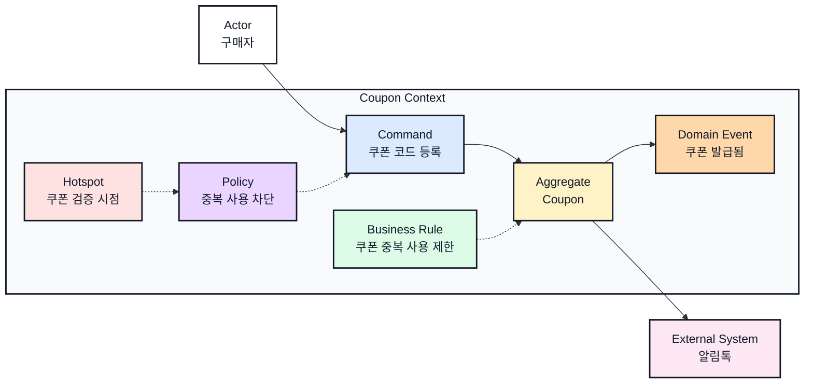
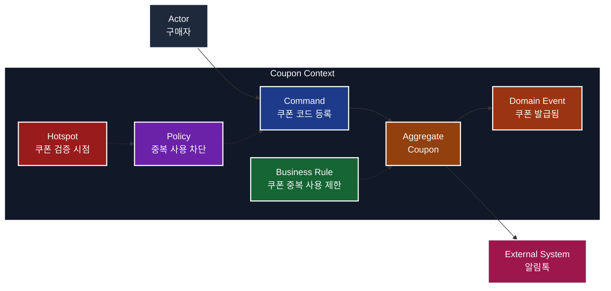

## Overview

This file is the visual source of truth for Mermaid event-storming diagrams in this folder. It follows the DESIGN.md pattern from [google-labs-code/design.md](https://github.com/google-labs-code/design.md): machine-readable tokens in YAML front matter, then human-readable usage rules in Markdown. It keeps diagram choices separate from the bounded-context template so each BC document can focus on domain decisions while sharing one consistent visual language.

The style is structured and product-design oriented: clear boundaries, readable labels, restrained color blocks, and enough contrast to work in both light and dark documentation themes.

## Colors

Use separate light and dark palettes. Text colors must change with the theme instead of reusing black text on dark fills or white text on light fills.

| Element | Light fill | Light text | Dark fill | Dark text |
| --- | --- | --- | --- | --- |
| Canvas | `#FFFFFF` | `#111827` | `#0B1020` | `#F8FAFC` |
| Bounded Context | `#F9FAFB` | `#111827` | `#111827` | `#F8FAFC` |
| Actor | `#FFFFFF` | `#111827` | `#1E293B` | `#F8FAFC` |
| Command | `#DBEAFE` | `#111827` | `#1E3A8A` | `#F8FAFC` |
| Aggregate | `#FEF3C7` | `#111827` | `#92400E` | `#F8FAFC` |
| Domain Event | `#FED7AA` | `#111827` | `#9A3412` | `#F8FAFC` |
| Policy | `#E9D5FF` | `#111827` | `#6B21A8` | `#F8FAFC` |
| Business Rule | `#DCFCE7` | `#111827` | `#166534` | `#F8FAFC` |
| Hotspot | `#FEE2E2` | `#111827` | `#991B1B` | `#F8FAFC` |
| External System | `#FCE7F3` | `#111827` | `#9D174D` | `#F8FAFC` |
| Read Model | `#F1F5F9` | `#111827` | `#334155` | `#F8FAFC` |

## Typography

Mermaid labels should use `Pretendard` when the renderer allows custom font configuration. If a renderer ignores the font token, keep the same hierarchy through label structure:

- First line: element type, short and stable, for example `Command` or `Domain Event`.
- Second line: domain name in Korean, for example `쿠폰 코드 등록`.
- Use `<br>` to split type and name inside a node.
- Keep labels short enough to scan inside a dense diagram. Move long explanations to the element catalog table.

## Layout

Use Mermaid `flowchart LR` as the default direction for cross-context diagrams. Use `flowchart TD` only when a single context needs a step-by-step vertical story.

- Place `Actor` and `External System` nodes outside bounded-context subgraphs.
- Place `Aggregate` near the center of its bounded context.
- Place `Command` nodes before the aggregate and `Domain Event` nodes after the aggregate.
- Place `Policy`, `Business Rule`, and `Hotspot` nodes near the command or aggregate they constrain, define, or question.
- Keep one bounded context per `subgraph`; do not mix page, API, or read-model convenience groupings into the context boundary.

## Elevation & Depth

Mermaid diagrams should stay flat. Use color, border, and line style rather than shadows or decorative effects.

- Solid arrows represent direct intent or command handling.
- Dotted arrows represent constraints, rules, or unresolved questions attached to a command or aggregate.
- Thick strokes are reserved for node borders and context boundaries, not for ordinary relationships.

## Shapes

Use one rectangle shape for every node type. Element type is already communicated through label and color, so extra shape variation adds visual noise without enough value.

| Element | Mermaid shape | Example |
| --- | --- | --- |
| Actor | Rectangle | `buyer[Actor<br>구매자]` |
| Command | Rectangle | `cmdRegister[Command<br>쿠폰 코드 등록]` |
| Aggregate | Rectangle | `coupon[Aggregate<br>Coupon]` |
| Domain Event | Rectangle | `evtIssued[Domain Event<br>쿠폰 발급됨]` |
| Policy | Rectangle | `policyLimit[Policy<br>중복 사용 차단]` |
| Business Rule | Rectangle | `ruleLimit[Business Rule<br>쿠폰 중복 사용 제한]` |
| Hotspot | Rectangle | `hotspotCoupon[Hotspot<br>쿠폰 검증 시점]` |
| External System | Rectangle | `kakao[External System<br>알림톡]` |
| Read Model | Rectangle | `summary[Read Model<br>주문 결제 요약]` |
| Bounded Context | `subgraph` with explicit title | `subgraph CouponBC[Coupon Context]` |

Keep shape syntax consistent even when Mermaid supports richer shapes. Do not use double-circles, hexagons, stadium nodes, or cylinders for event-storming elements in this folder.

Style bounded contexts with `style SubgraphId ...` because Mermaid renderers handle subgraph classes inconsistently. Keep the context identifier in English or ASCII so it can be referenced safely.

## Components

Apply one class per node type and one class per bounded context. Keep class names stable so diagrams can switch between light and dark themes by replacing only the class definitions.

### Light Theme Mermaid Classes

```mermaid
flowchart LR
  classDef actor fill:#FFFFFF,stroke:#111827,color:#111827,stroke-width:2px;
  classDef command fill:#DBEAFE,stroke:#111827,color:#111827,stroke-width:2px;
  classDef aggregate fill:#FEF3C7,stroke:#111827,color:#111827,stroke-width:2px;
  classDef event fill:#FED7AA,stroke:#111827,color:#111827,stroke-width:2px;
  classDef policy fill:#E9D5FF,stroke:#111827,color:#111827,stroke-width:2px;
  classDef rule fill:#DCFCE7,stroke:#111827,color:#111827,stroke-width:2px;
  classDef hotspot fill:#FEE2E2,stroke:#111827,color:#111827,stroke-width:2px;
  classDef external fill:#FCE7F3,stroke:#111827,color:#111827,stroke-width:2px;
  classDef readmodel fill:#F1F5F9,stroke:#111827,color:#111827,stroke-width:2px;
  classDef context fill:#F9FAFB,stroke:#111827,color:#111827,stroke-width:2px;
```

### Dark Theme Mermaid Classes

```mermaid
flowchart LR
  classDef actor fill:#1E293B,stroke:#F8FAFC,color:#F8FAFC,stroke-width:2px;
  classDef command fill:#1E3A8A,stroke:#F8FAFC,color:#F8FAFC,stroke-width:2px;
  classDef aggregate fill:#92400E,stroke:#F8FAFC,color:#F8FAFC,stroke-width:2px;
  classDef event fill:#9A3412,stroke:#F8FAFC,color:#F8FAFC,stroke-width:2px;
  classDef policy fill:#6B21A8,stroke:#F8FAFC,color:#F8FAFC,stroke-width:2px;
  classDef rule fill:#166534,stroke:#F8FAFC,color:#F8FAFC,stroke-width:2px;
  classDef hotspot fill:#991B1B,stroke:#F8FAFC,color:#F8FAFC,stroke-width:2px;
  classDef external fill:#9D174D,stroke:#F8FAFC,color:#F8FAFC,stroke-width:2px;
  classDef readmodel fill:#334155,stroke:#F8FAFC,color:#F8FAFC,stroke-width:2px;
  classDef context fill:#111827,stroke:#F8FAFC,color:#F8FAFC,stroke-width:2px;
```

### Light Theme Subgraph Pattern



For dark theme diagrams, keep the same graph structure and replace only the class definitions plus subgraph style.



## Do's and Don'ts

- Do keep one visual rule set for all BC documents in this folder.
- Do use the table catalog for descriptions, invariants, and edge cases.
- Do keep events in past tense, for example `쿠폰 발급됨`.
- Do keep commands as intent, for example `쿠폰 코드 등록`.
- Do not create a bounded context only because the UI has a page or tab.
- Do not put long policy conditions inside node labels.
- Do not mix light fill tokens with dark text tokens, or dark fill tokens with light text tokens.
