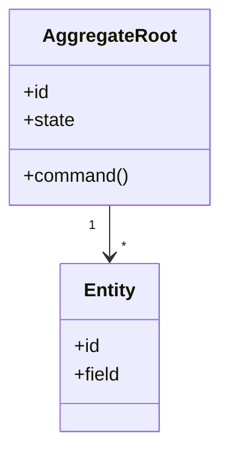
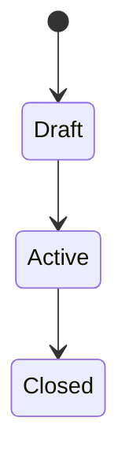

# Aggregate와 Entity 이름

## 기본 정보

- Aggregate ID: `AGG.A.XX`
- Aggregate Root:
- 소속 BC:
- 책임:
- 생명주기:

## 연관 태그

🏷️ 요구사항 참조: [REQ.A.XX](../00-requirements/REQ_A_XX_name.md) | UC 참조: [UC.A.XX](../30-uc/UC_A_XX_name.md) | 영속성 참조: [PST.A.XX](../55-persistence/PST_A_XX_name.md) | 서비스 참조: [SVC.A.XX](../60-service/SVC_A_XX_name.md) | 시나리오 참조: [SCN.A.XX](../80-scenario/SCN_A_XX_name.md) | API 참조: [API.A.XX](../70-api/API_A_XX_name.md) | BC 참조: [BC.A.XX](../40-event-storming-bounded-context/BC_A_XX_name.md)

## 모델 개요

## Aggregate Root

| 필드 | 타입 | 설명 | 출처 | 상태 |
| --- | --- | --- | --- | --- |
| id |  | 식별자 |  | 확인 필요 |

## Entity

| Entity ID | 이름 | 책임 | 식별자 | Aggregate 내 관계 |
| --- | --- | --- | --- | --- |
| `ENT-AREA-NAME` |  |  |  |  |

## Value Object

| VO ID | 이름 | 필드 | 불변조건 |
| --- | --- | --- | --- |
| `VO-AREA-NAME` |  |  |  |

## Command

-

## Event

-

## 불변조건

-

## 상태 전이

## Read Model 후보

-

## 확인 필요

-
