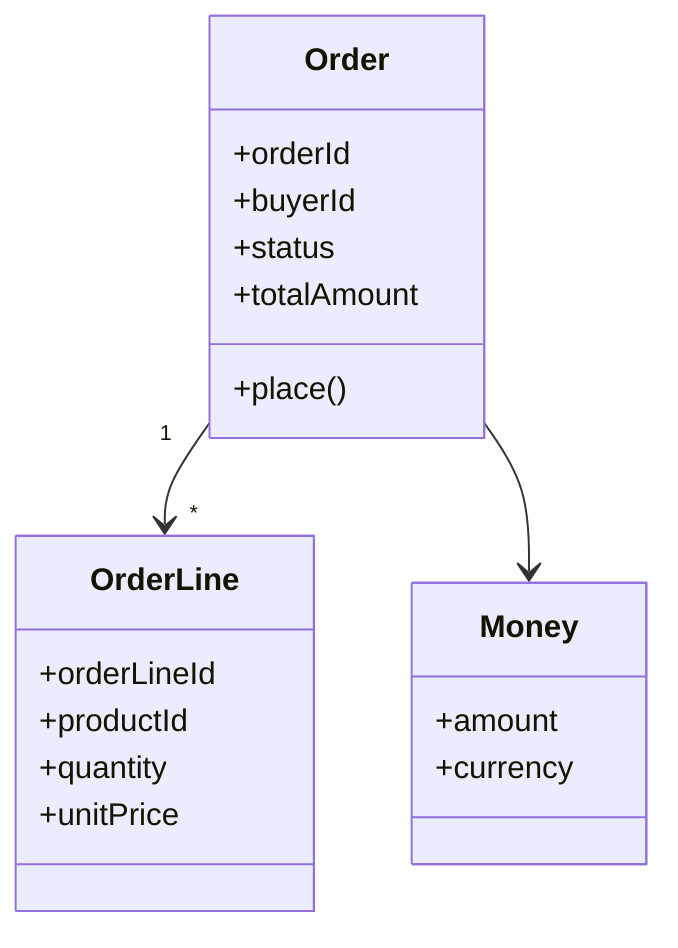

# 주문 Aggregate와 Entity

## 기본 정보

- Aggregate ID: `AGG.A.01`
- Aggregate Root: `Order`
- 소속 BC: [BC.A.01](../../../../40-event-storming-bounded-context/.examples/BC_A_01_order.md)
- 책임: 주문 생성, 주문 금액 스냅샷 보존, 주문 상태 전이.
- 생명주기: 생성됨 -> 결제 대기 -> 결제 완료 또는 취소.

## 연관 태그

🏷️ 요구사항 참조: [REQ.A.01](../../../../00-requirements/.examples/REQ_A_01_order_checkout.md) | UC 참조: [UC.A.01](../../../../30-uc/.examples/UC_A_01_place_order.md) | 영속성 참조: [PST.A.01](../A_01_20-persistence/PST_A_01_order_persistence.md) | 서비스 참조: [SVC.A.01](../A_01_30-service/SVC_A_01_order_service.md) | 시나리오 참조: [SCN.A.01](../../../../80-sequence/.examples/SCN_A_01_place_order.md) | API 참조: [API.A.01](../A_01_40-api/API_A_01_place_order.md) | BC 참조: [BC.A.01](../../../../40-event-storming-bounded-context/.examples/BC_A_01_order.md)

## 모델 개요

## Aggregate Root

| 필드 | 타입 | 설명 | 상태 |
| --- | --- | --- | --- |
| orderId | UUID | 주문 식별자 | 확인 |
| buyerId | UUID | 구매자 식별자 | 확인 |
| status | OrderStatus | 주문 처리 단계와 결제 결과 반영 상태를 나타낸다. 값 의미는 State / Enum 섹션에서 관리한다. | 확인 |
| totalAmount | Money | 서버가 계산한 최종 금액 | 확인 |

## Entity

| Entity ID | 이름 | 책임 | 식별자 | Aggregate 내 관계 |
| --- | --- | --- | --- | --- |
| `ENT.A.01` | OrderLine | 주문 상품 스냅샷 보존 | orderLineId | Order 하위 |

## State / Enum

State와 Enum은 도메인 상태 전이와 분기 조건을 명확히 하기 위한 닫힌 값 집합이다. 저장 표현은 영속성 설계에서 정하되, 허용 값과 전이 의미는 도메인 모델에서 관리한다.

| State ID | 이름 | 허용 값 | 값 설명 | 도메인 규칙 |
| --- | --- | --- | --- | --- |
| `STATE.A.01-01` | OrderStatus | created, awaiting_payment, paid, cancelled | `created`: 주문 생성이 완료되었지만 결제 요청 전 상태 `awaiting_payment`: 결제 승인을 기다리는 상태 `paid`: 결제 승인으로 주문이 확정된 상태 `cancelled`: 사용자 취소, 결제 실패, 만료 등으로 주문이 닫힌 상태 | paid, cancelled 상태의 주문은 금액 스냅샷과 주문 라인을 변경할 수 없다. |

## 불변조건

- 주문은 하나 이상의 주문 라인을 가져야 한다.
- 주문 생성 시 최종 금액은 서버 계산 결과를 따른다.
- 생성된 주문 라인의 상품명과 가격은 이후 상품 변경과 무관하게 보존한다.

## Event

- `EVT.A.01`: 주문 생성 완료.
- `EVT.A.02`: 주문 취소 완료.

## Repository

| Repository | 메서드 | 책임 | 영속성 근거 |
| --- | --- | --- | --- |
| `OrderRepository` | `save(order)` | 주문 Aggregate 저장 | [PST.A.01](../A_01_20-persistence/PST_A_01_order_persistence.md) |
| `OrderRepository` | `findById(orderId)` | 주문 Aggregate 복원 | [PST.A.01](../A_01_20-persistence/PST_A_01_order_persistence.md) |
