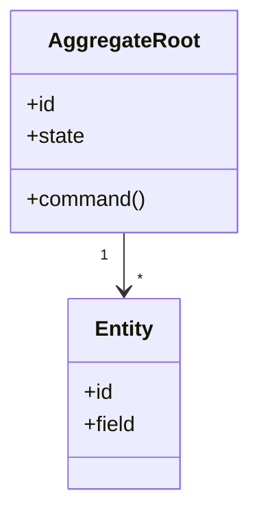
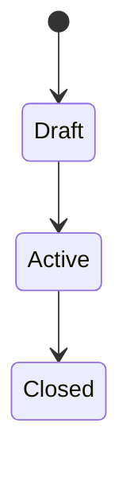

# 도메인 모델 설계 이름

## 기본 정보

- Service Design ID: `SD.A.XX10`
- 상위 서비스 디자인: `SD.A.XX`
- 소속 Context:
- 설계 범위:
- 주요 Aggregate:
- 주요 Policy:

## 연관 태그

🏷️ 요구사항 참조: [REQ.A.XX](../../../00-requirements/REQ_A_XX_name.md) | UC 참조: [UC.A.XX](../../../30-uc/UC_A_XX_name.md) | 영속성 참조: [SD.A.XX20](../A_XX_20-persistence/README.md) | 서비스 참조: [SD.A.XX30](../A_XX_30-service/README.md) | 시나리오 참조: [SCN.A.XX](../../../80-sequence/SCN_A_XX_name.md) | API 참조: [SD.A.XX40](../A_XX_40-api/README.md) | BC 참조: [BC.A.XX](../../../40-event-storming-bounded-context/BC_A_XX_name.md)

## 문서 단위 선택

도메인 모델 문서는 Aggregate와 Entity 분리를 강제하지 않는다.

- Aggregate 하나가 충분히 크면 Aggregate 단위 문서를 만든다.
- Aggregate 문서 안에서 관련 Entity와 Value Object를 함께 정의할 수 있다.
- 모델이 작으면 이 문서 하나에 Aggregate, Entity, Value Object, State / Enum, Policy를 함께 정의할 수 있다.
- 분리 기준은 구현 계층이 아니라 도메인 책임, 불변조건, 상태 전이의 복잡도다.

## 모델 개요

## Aggregate Root

| Aggregate ID | 이름 | 책임 | 생명주기 | 문서 |
| --- | --- | --- | --- | --- |
| `AGG.A.XX` |  |  |  | 이 문서 |

## Entity

| Entity ID | 이름 | 책임 | 식별자 | Aggregate 내 관계 |
| --- | --- | --- | --- | --- |
| `ENT-AREA-NAME` |  |  |  |  |

## Value Object

| VO ID | 이름 | 필드 | 불변조건 |
| --- | --- | --- | --- |
| `VO-AREA-NAME` |  |  |  |

## State / Enum

State와 Enum은 도메인 상태 전이와 분기 조건을 명확히 하기 위한 닫힌 값 집합이다. 저장 표현은 영속성 설계에서 정하되, 허용 값과 전이 의미는 도메인 모델에서 관리한다.

| State ID | 이름 | 허용 값 | 값 설명 | 도메인 규칙 |
| --- | --- | --- | --- | --- |
| `STATE-AREA-NAME` |  | value_a, value_b | `value_a`: 값 A의 의미 `value_b`: 값 B의 의미 |  |

## Command

-

## Event

-

## 불변조건

-

## 상태 전이

## Read Model 후보

-

## 확인 필요

-
