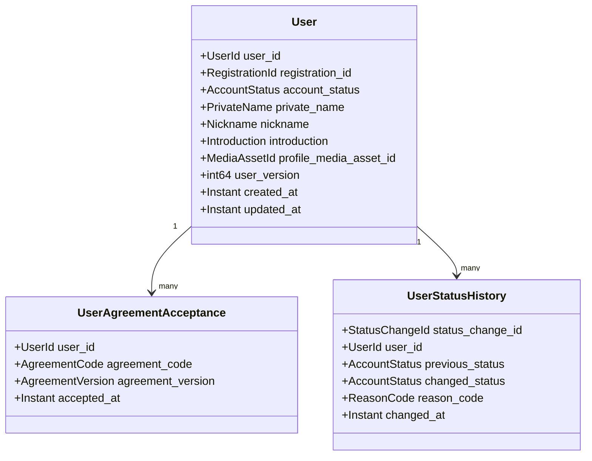
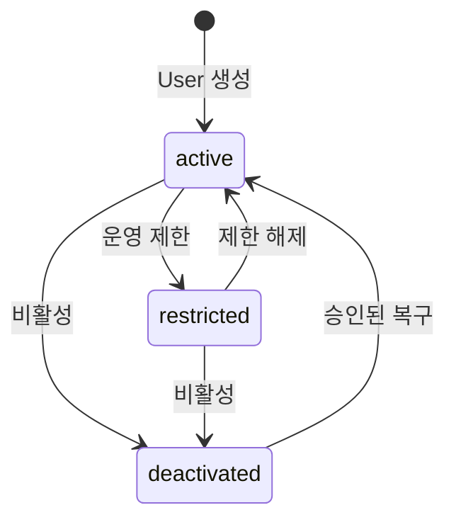

# Context 사용자 통합 도메인 모델

## 모델

`User`는 계정 상태와 프로필을 함께 소유하는 유일한 Aggregate다. 가입 처리용 Aggregate나 Process Manager를 추가하지 않는다.

## User

| 필드 | 규칙 |
| --- | --- |
| `user_id` | User 서비스가 발급하는 불변 UUID |
| `registration_id` | Auth Registration과 User 생성 결과를 묶는 유일한 업무 키 |
| `account_status` | `active`, `restricted`, `deactivated` |
| `private_name` | 가입 시 저장하며 일반 프로필 수정 API로 변경하지 않음 |
| `nickname`, `introduction` | 사용자 공개 프로필 |
| `profile_media_asset_id` | Media가 발급한 불투명 자산 ID. URL과 파일은 저장하지 않음 |
| `user_version` | 모든 User 변경에 사용하는 단일 낙관적 version. 생성값은 1 |

## 가입 계약

### Auth 가입 검증 완료 증거

프론트엔드는 Auth가 발급한 짧은 수명의 `registrationCompletionProof`를 User 생성 API에 전달한다. User는 Auth 공개 키로 다음 내용을 검증한다.

- `registration_id`
- 이메일·휴대폰 필수 검증 완료 여부
- `issued_at`, `expires_at`, `nonce`, `key_id`
- Auth 서명

증거에는 이메일, 휴대폰, credential과 인증번호 원문을 넣지 않는다.

### User 생성 결과

User 생성 성공 응답은 `user_id`, `registration_id`, `user_version`, `created_at`과 짧은 수명의 `userCreationProof`를 반환한다. 프론트엔드는 이 결과를 Auth 가입 완료 API에 전달한다. 같은 `registration_id` 재요청은 같은 User와 같은 논리 결과를 반환한다.

### 필수 동의

가입 요청은 `agreement_code`, `agreement_version`, `accepted_at` 목록을 포함한다. User 서비스는 현재 필수 항목과 version을 검증하고 User와 동의 이력을 같은 트랜잭션에 저장한다. 별도 Agreement 서비스와 receipt는 없다.

## 상태 전이

상태 전이는 `account_status`와 `user_version`만 바꾼다. User는 결과를 Auth 전용 단기 proof로 서명한다. 운영 프론트엔드는 proof를 Auth에 전달하고, Auth는 서명과 version을 검증해 Session을 폐기하거나 새 로그인을 허용한다.

## Command와 Query

| 식별자 | 이름 | 결과 |
| --- | --- | --- |
| `CMD.A.01-17` | CreateUser | User와 필수 동의 이력 생성 |
| `CMD.A.01-20` | UpdateOwnProfile | 프로필 정보와 `user_version` 변경 |
| `CMD.A.01-21` | UpdateOwnProfileImage | 검증된 Media 자산 ID와 `user_version` 변경 |
| `CMD.A.01-22` | ChangeUserAccountStatus | 계정 상태, 상태 이력과 `user_version` 변경 |
| `QRY.A.01-01` | GetOwnProfile | 본인 프로필 조회 |
| `QRY.A.01-03` | GetUserAccountStatus | 운영·내부 상태 조회 |

## 불변조건

- 한 `registration_id`는 한 `user_id`에만 연결된다.
- User 생성, 필수 동의 이력과 생성 멱등 결과는 같은 트랜잭션에 저장한다.
- 계정 상태와 프로필은 같은 `users` 행과 `user_version`으로 변경한다.
- `active`가 아닌 User는 일반 프로필을 수정할 수 없다.
- 상태 변경은 현재 `user_version`과 허용 전이를 모두 만족해야 한다.
- Auth 연결과 Session 발급은 Auth 책임이며 User Aggregate에 그 상태를 복제하지 않는다.
- 이메일·휴대폰·credential·Session·role/permission은 User 모델에 넣지 않는다.
- 구체적인 소비자가 생기기 전에는 User 변경 Event를 계약으로 만들지 않는다.

## 마이 조회 경계

User 서비스는 본인 프로필 API에서 프로필, `profile_media_asset_id`와 `user_version`만 반환한다. 화면 컴포넌트는 Ingress를 통해 Media·Order·Coupon·Point 등 각 소유 서비스를 직접 호출한다. User와 Ingress는 마이 통합 응답을 만들지 않는다.
