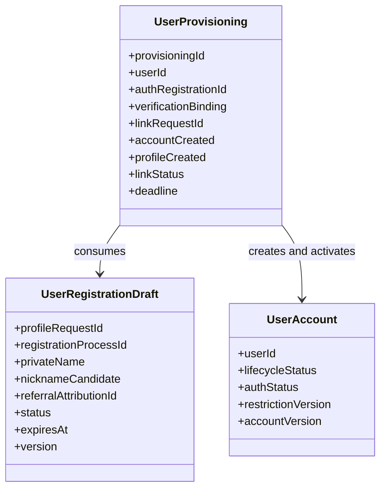
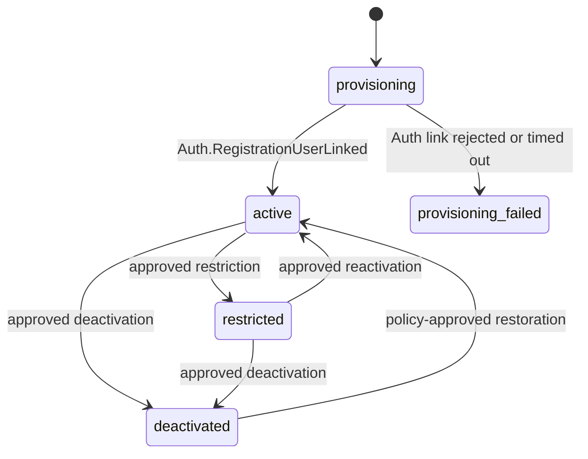

# Context 사용자 가입과 계정 도메인 모델

## 책임

Auth 가입 검증 전에 프로필 초안을 준비하고, 검증 완료 이벤트를 받은 뒤 `user_id`를 발급하며, 기본 프로필 생성과 Auth 계정 연동 결과까지 장기 작업으로 추적한다.

## 모델 개요

## Aggregate와 Process Manager

| 식별자 | 이름 | 유형 | 책임 |
| --- | --- | --- | --- |
| 설계 추가 | UserRegistrationDraft | Aggregate | 가입 전 사용자 프로필 입력을 보관하고 불투명 `profile_request_id`를 발급한다. |
| 설계 추가 | UserProvisioning | Process Manager | Auth 검증 이벤트부터 계정·프로필 준비, 연동 요청, 성공·거부 보상까지 조정한다. |
| `AGG.A.01-08` | UserAccount | Aggregate | 불변 `user_id`, 계정 생명주기, Auth 접근 상태와 제한 version을 소유한다. |

`UserRegistrationDraft`와 `UserProvisioning`은 Auth 상세 계약을 구현하기 위해 이번 서비스 설계에서 구체화한 모델이다. 현재 BC catalog에 없는 `AGG`·`PM` 번호를 임의로 만들지 않으며, 다음 이벤트스토밍 갱신 때 승격 여부와 식별자를 정한다.

BC.A.01이 `UserAccount`에 둔 인증 연동 요청 상태는 상세 설계에서 장기 작업과 외부 상관관계를 다루는 `UserProvisioning` Process Manager로 분리한다. UserAccount는 `provisioning_id`, 계정 lifecycle과 Auth 접근 상태만 보유하며 PM 상태를 중복 원장으로 복제하지 않는다.

## UserRegistrationDraft

| 필드 | 타입 | 규칙 |
| --- | --- | --- |
| `profile_request_id` | opaque string | 전역 유일, 외부에는 값만 노출한다. |
| `registration_process_id` | opaque string | BFF가 시작한 가입 작업에 초안을 귀속하는 전역 고유 참조다. Auth Intent·동의 receipt와 같은 작업으로 묶는다. |
| `private_name` | PrivateName | 가입 필수 입력, 암호화 저장, 이벤트·로그에 넣지 않는다. |
| `nickname_candidate` | Nickname? | 선택 입력. 확정 정책을 통과하지 못하면 기본 표시명을 사용한다. |
| `referral_attribution_id` | ExternalReferenceId? | 추천인 코드 원문이 아닌 프로모션 Context의 검증 결과 참조다. |
| `status` | DraftStatus | `pending`, `consumed`, `expired`, `rejected` |
| `expires_at` | Instant | 정책 TTL 뒤 새 초안을 요구한다. |
| `version` | int64 | 낙관적 동시성 제어에 사용한다. |

## UserProvisioning

| 필드 | 타입 | 규칙 |
| --- | --- | --- |
| `provisioning_id` | opaque string | 가입 작업 전역 식별자다. |
| `source_event_id` | EventId | `Auth.RegistrationVerificationCompleted` 전송 중복 제거 기준이다. |
| `auth_registration_id` | ExternalReferenceId | 같은 Auth Registration으로 사용자를 두 번 만들 수 없다. |
| `registration_version` | int64 | Auth event 값을 그대로 보존하고 되돌려준다. |
| `verification_binding` | RegistrationVerificationRef | binding ID/hash, causation event, 수락 기한을 묶는다. |
| `profile_request_id` | ExternalReferenceId | 소비할 `UserRegistrationDraft` 참조다. |
| `agreement_receipt_id` | ExternalReferenceId | 동의 원문이 아닌 동의 담당 Context의 1회성 가입 receipt다. 같은 registration process와 profile request에 귀속돼야 한다. |
| `agreement_validation_status` | ValidationStatus | `pending`, `valid`, `invalid`; 검증 실패 거부도 Provisioning에 남긴다. |
| `agreement_binding_hash` | string? | valid 결과의 purpose, 귀속, 필수 약관 version과 유효 시각을 묶은 비민감 hash다. |
| `user_id` | UserId? | 사용자 생성 단계에서 한 번만 발급한다. |
| `link_request_id` | ExternalRequestId | 검증 이벤트를 업무 처리 대상으로 받아들일 때 한 번 발급하는 전역 고유 멱등 키다. 사용자 생성 전 거부에도 같은 값을 사용한다. |
| `link_event_id` | EventId? | Auth 결과의 causation을 대조할 `User.AuthLinkRequested` 또는 `User.AuthLinkRejected` Event ID다. |
| `account_command_id` | CommandId? | 유효한 초안에 대해 한 번 발급하는 계정 생성 Command 멱등 키다. |
| `profile_command_id` | CommandId? | 유효한 초안에 대해 한 번 발급하는 기본 프로필 생성 Command 멱등 키다. |
| `account_created` | bool | UserAccount 준비 완료 여부다. |
| `profile_created` | bool | UserProfile 준비 완료 여부다. |
| `link_status` | LinkStatus | `not_requested`, `requested`, `linked`, `rejected`, `timed_out` |
| `auth_result_version` | int64? | 마지막으로 반영한 Auth 결과의 증가한 Registration version이다. |
| `deadline` | Instant | Auth의 `link_accept_until`을 넘지 않는다. |

## UserAccount

| 필드 | 타입 | 규칙 |
| --- | --- | --- |
| `user_id` | UUID | 생성 뒤 변경·재사용·병합하지 않는다. |
| `lifecycle_status` | AccountLifecycleStatus | `provisioning`, `active`, `restricted`, `deactivated`, `provisioning_failed` |
| `auth_status` | UserAuthStatus | Auth 계약용 `active`, `restricted`, `deactivated` |
| `restriction_version` | int64 | 1부터 시작하고 `auth_status`가 변경될 때만 증가한다. |
| `provisioning_id` | ProvisioningId | 가입 작업과 1:1이다. |
| `activated_at` | Instant? | `Auth.RegistrationUserLinked` 수신 시 설정한다. |
| `status_reason_code` | ReasonCode? | 외부 공개 가능한 일반화 코드만 사용한다. |
| `account_version` | int64 | 모든 계정 변경의 낙관적 version이다. |

`lifecycle_status=provisioning`이어도 연동 요청의 `userAuthStatus`는 현재 제한이 없다면 `active`다. 두 상태를 합치면 Auth 연동 전 임시 계정을 일반 사용자로 오인하게 되므로 분리한다.

## 상태 전이

탈퇴 유예와 최종 삭제 상태는 보존 정책이 확정되기 전까지 추가하지 않는다.

## 가입 Policy

1. `Auth.RegistrationVerificationCompleted` producer, event version, binding, 수락 기한을 검증한다.
2. Inbox 중복이면 기존 `UserProvisioning` 결과를 반환한다.
3. 신규 업무라면 먼저 `UserProvisioning`과 전역 고유 `link_request_id`를 만든다. 이 ID는 이후 성공 요청과 사용자 생성 전 업무 거부에 공통으로 사용한다.
4. Agreement Port 결과가 purpose=`user_registration`, 같은 `registration_process_id`와 `profile_request_id`, 필수 약관 version 집합, 유효 시각을 증명하는지 확인한다. 같은 receipt를 다른 가입에 재사용할 수 없다.
5. 프로필 초안과 동의 receipt가 업무 규칙상 유효하지 않으면 사용자 계정을 만들지 않고 Provisioning을 `rejected`로 닫는다. 초안이 존재하면 같은 트랜잭션에서 `rejected`와 Provisioning 귀속을 기록하고 `User.AuthLinkRejected`를 저장한다.
6. 유효하면 새 `user_id`, `account_command_id`, `profile_command_id`를 발급하고 프로필 초안을 한 번 소비한다.
7. 먼저 저장한 `account_command_id`로 UserAccount를 생성한다. `UserAccountCreated`를 반영하는 Process Manager 트랜잭션에서 저장한 `profile_command_id`의 UserProfile 생성 Command를 한 번 예약한다.
8. `DefaultProfileCreated`까지 반영해 두 준비가 끝난 뒤 같은 `link_request_id`로 한 번만 `User.AuthLinkRequested`를 발행한다.
9. `Auth.RegistrationUserLinked`를 받으면 계정을 `active`로 전환한다.
10. 업무 거부·기한 만료 결과를 받으면 Provisioning을 terminal로 닫는다. 이미 UserAccount를 만든 경로만 계정을 `provisioning_failed`로 바꾸고 보존 정책에 따라 정리한다.

일시적인 DB·broker·동의 서비스 장애를 `User.AuthLinkRejected`로 바꾸지 않는다. 재시도 가능한 기술 실패와 되돌릴 수 없는 업무 거부를 분리한다.

## 불변조건

- 같은 `source_event_id`, `auth_registration_id`, `verification_binding_id`, `profile_request_id`로 두 명의 사용자를 만들 수 없다.
- 하나의 Provisioning은 성공·거부와 관계없이 `link_request_id` 하나만 사용한다. 사용자 생성 전 거부에도 이 ID를 바꾸지 않는다.
- `registration_process_id`, `profile_request_id`, `agreement_receipt_id`는 한 가입 작업에 함께 귀속된다. receipt는 가입 목적·필수 약관 version·유효 시각 검증을 통과하고 다른 Provisioning에서 재사용되지 않아야 한다.
- `user_id`가 한 번 설정되면 NULL이나 다른 값으로 바뀌지 않는다.
- 연결 성공 전 계정은 본인 프로필 API와 업무 Context 조회에 노출하지 않는다.
- 연결 실패 뒤에도 `user_id`를 다른 가입에 재사용하지 않는다.
- `lifecycle_status=restricted`이면 `auth_status=restricted`, `lifecycle_status=deactivated`이면 `auth_status=deactivated`다. 그 밖의 현재 상태는 `auth_status=active`이며 `provisioning_failed` 값은 Auth에 새로 투영하지 않는다.
- 계정 상태 전이는 두 상태를 한 번에 변경한다. `auth_status`가 바뀌면 `restriction_version` 증가, 상태 이력, Auth 전달 Outbox를 같은 트랜잭션에 저장한다.
- 계정 상태 변경은 이전 version보다 큰 `restriction_version`과 상태 이력을 함께 만든다.
- `private_name`, 이메일, 휴대폰, challenge proof, credential을 integration event에 포함하지 않는다.

## Event

| Event | 발생 조건 | 후속 처리 |
| --- | --- | --- |
| `EVT.A.01-22 사용자 계정 생성됨` | provisional UserAccount 저장 완료 | 기본 프로필 생성 진행 상태 확인 |
| `EVT.A.01-23 기본 프로필 생성됨` | UserProfile 저장 완료 | Auth link 요청 가능 여부 확인 |
| `EVT.A.01-24 인증 계정 연동 요청됨` | Outbox에 `User.AuthLinkRequested` 저장 | Auth가 연동 처리 |
| `UserAccountActivated` | Auth 연결 성공 반영 | 일반 사용자 조회 허용 |
| `UserAccountProvisioningFailed` | Auth 연결 거부·기한 만료 | 보상·정리 Worker 대상 |
| `EVT.A.01-27 사용자 계정 상태 변경됨` | 제한·해제·비활성 확정 | Auth와 다른 소비자에 versioned 상태 전달 |

## 확인 필요

- 프로필 초안 TTL과 기한 만료 뒤 재사용 금지 기간
- 가입 동의 receipt의 동기 검증 Port와 장애 시 재시도 기준
- 연동 실패 provisional 데이터 보존 기간
- 탈퇴·재가입·복구 상태 모델
