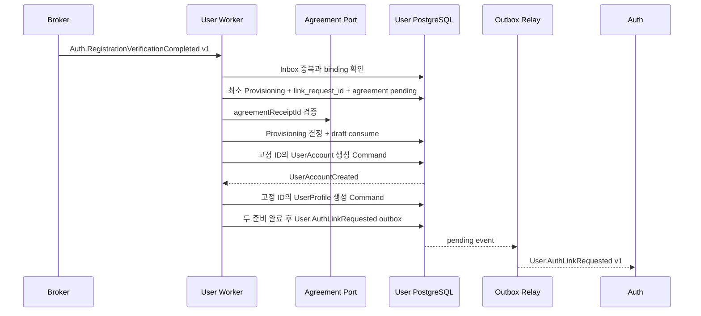

# Context 사용자 가입·계정 Handler 설계

## Application Service

| Service | 책임 |
| --- | --- |
| UserRegistrationService | 가입 프로필 초안과 Auth 연동 Process Manager 조정 |
| UserAccountLifecycleService | 계정 활성·제한·해제·비활성과 상태 Event 발행 |
| UserAccountQueryService | 본인/BFF/인가된 내부 소비자에 계정 상태 제공 |

## Handler 목록

| 입력 | Handler | Aggregate/PM | 출력 |
| --- | --- | --- | --- |
| CreateRegistrationProfileDraft | CreateRegistrationProfileDraftHandler | UserRegistrationDraft | profile_request_id |
| `Auth.RegistrationVerificationCompleted` v1 | HandleRegistrationVerificationCompleted | UserProvisioning | ProvisioningStarted 또는 LinkRejected outbox |
| `CMD.A.01-17 사용자 계정 생성` | CreateUserAccountHandler | UserAccount | 사용자 계정 생성됨 |
| `CMD.A.01-18 기본 프로필 생성` | CreateDefaultProfileHandler | UserProfile | 기본 프로필 생성됨 |
| 두 준비 Event | AdvanceUserProvisioningHandler | UserProvisioning | User.AuthLinkRequested outbox |
| `Auth.RegistrationUserLinked` v1 | HandleRegistrationUserLinked | UserAccount/UserProvisioning 순차 Command | UserAccountActivated |
| `Auth.RegistrationUserLinkRejected` v1 | HandleRegistrationUserLinkRejected | UserProvisioning, 존재하는 경우 UserAccount 순차 Command | ProvisioningFailed |
| ChangeUserAccountStatus | ChangeUserAccountStatusHandler | UserAccount | 계정 상태 변경됨 + Auth 상태 outbox |

## CreateRegistrationProfileDraft

1. BFF workload identity와 request schema를 검증한다.
2. private name을 정규화하고 정책을 적용한다.
3. nickname 후보가 있으면 구조적 정책만 검증한다.
4. referral code 원문은 받지 않고 프로모션 Context가 발급한 attribution ID만 받는다.
5. `profile_request_id`, 만료 시각, 암호화 이름을 저장한다.
6. IdempotencyRecord를 같은 transaction에 저장하고 `201` 결과를 반환한다.

같은 key 재시도는 같은 초안을 반환하고, 다른 payload는 충돌로 거부한다.

## HandleRegistrationVerificationCompleted

처리 규칙:

1. producer, event type/version, payload hash를 확인한다. 사용자 `received_at`은 로컬 처리 여유 판단에만 쓰고 Auth의 최종 수락 시각으로 해석하지 않는다.
2. Event 수락 트랜잭션에서 Inbox와 기존 Auth Registration/verification binding의 Provisioning을 함께 확인한다. 신규 업무면 사용자 생성 여부와 관계없이 최소 Provisioning, `link_request_id`, 제시된 receipt ID와 `agreement_validation_status=pending`을 Inbox와 함께 저장한다.
3. profile draft 존재·상태를 확인한다. 명백한 missing/expired는 외부 호출 없이 업무 거부로 결정할 수 있다.
4. 동의 receipt는 DB 트랜잭션 밖에서 담당 Context에 검증한다. purpose=`user_registration`, draft의 `registration_process_id`와 `profile_request_id`, 필수 약관 version, 유효 시각, 미사용 상태가 모두 맞아야 한다. timeout은 Inbox deferred와 pending Provisioning으로 남기고, 명시적 무효는 업무 거부다.
5. 결과 반영 트랜잭션에서 Provisioning, Inbox와 초안을 다시 잠근다. 이미 `rejected`, `timed_out`, `linked`면 늦은 검증 결과로 되돌리지 않는다.
6. 초안·동의가 무효면 `agreement_validation_status=invalid`, Provisioning 거부 결과, `User.AuthLinkRejected` Outbox를 함께 저장한다. 초안 행이 존재하면 `rejected`와 Provisioning 귀속도 기록한다.
7. 유효하면 `agreement_validation_status=valid`, binding hash, `user_id`, 초안 소비, 고정된 Account/Profile Command ID와 Account Command Outbox를 같은 트랜잭션에 저장한다.
8. UserAccount/Profile Command Handler는 생성 트랜잭션에서 Provisioning을 `FOR SHARE`로 먼저 잠그고 nonterminal을 재확인한 채 Aggregate와 Outbox를 커밋한다. terminal이면 생성을 취소한다. Process Manager가 UserAccountCreated를 반영할 때 account flag와 Profile Command Outbox를 같은 트랜잭션에 저장한다. 각 누락 Command는 저장한 ID로만 다시 요청한다.
9. 두 준비가 완료되면 `link_accept_until`에서 clock skew와 transport budget을 뺀 시각 전인지 다시 확인하고 동일 `link_request_id`로 `User.AuthLinkRequested`를 한 번 저장한다. 최종 기한 판정은 Auth Inbox 수신 시각을 소유한 Auth가 수행한다.

한 Handler에서 UserAccount와 UserProfile을 직접 함께 UPDATE하지 않는다.

## Auth 결과 처리

### 연결 성공

- producer, `event_id`, `aggregate_id/auth_registration_id`, correlation, `link_request_id`, `user_id`를 현재 Provisioning과 대조한다.
- `causation_id`는 발행한 `User.AuthLinkRequested.event_id`와 같아야 한다.
- 결과 `registration_version`은 가입 인증 완료 때 저장한 snapshot version보다 크고 이전 Auth 결과 version보다 낮지 않아야 한다. 원래 snapshot version과 같아야 한다고 검증하지 않는다.
- UserAccount를 `provisioning -> active`로 전환하고 `activated_at`을 설정하며 같은 트랜잭션에서 Provisioning을 `linked`로 닫고 활성 Event를 기록한다. 여기서 Process Manager 행은 조정 상태이며 두 번째 업무 Aggregate가 아니다.
- 중복 성공 Event는 기존 활성 결과를 반환한다.

### 연결 거부·기한 만료

- `USER_CREATION_REJECTED`와 `IDENTITY_OWNERSHIP_CONFLICT`는 검증된 Auth producer, registration/correlation, non-null `link_request_id`, 원인이 된 사용자 Event의 `causation_id`를 대조한다. 결과 Event에는 binding/hash가 없으므로 해당 필드를 요구하지 않는다.
- `LINK_TIMEOUT`은 `link_request_id`와 `user_id`가 NULL일 수 있다. 검증된 Auth producer, registration/correlation, 저장한 `link_accept_until <= rejected_at`, 단조 증가한 결과 version으로 현재 nonterminal Provisioning을 찾는다.
- timeout은 Provisioning을 `FOR UPDATE`로 잠근 뒤 `timed_out`으로 닫고, 존재하는 draft를 `expired`와 Provisioning 귀속으로 바꿔 정리 Worker 대상에 넣는다. 생성 Handler가 잠금을 먼저 얻어 account를 커밋했다면 같은 timeout 처리에서 account를 `provisioning_failed`로 바꾼다. 늦은 Agreement 결과나 생성 Command는 이 상태를 되돌리지 않는다.
- timeout 결과가 원 검증 Event보다 먼저 도착한 순서 역전은 결과 Inbox를 `deferred`로 두고 제한된 grace 안에서 최소 Provisioning 생성을 기다린다. 원 Event 없이 Provisioning을 합성하지 않는다.
- 낮은 result version, terminal 상태를 되돌리는 결과, 다른 registration/correlation 결과는 격리한다.
- Provisioning을 `rejected` 또는 `timed_out`으로 닫는다.
- Account/Profile 준비 뒤 Auth가 연동을 거부한 경우에만 UserAccount를 `provisioning_failed`로 전환하고 UserProfile 정리 대상 시각을 기록한다.
- 초안·동의 업무 거부처럼 `user_id`와 UserAccount가 없는 경우에는 Provisioning만 terminal로 닫으며 가짜 계정을 만들지 않는다.
- UserProfile은 존재하더라도 즉시 삭제하지 않고 정리 Worker 대상 시각을 기록한다.
- 이미 발급한 `user_id`는 재사용하지 않는다.
- identity conflict 같은 결과를 공개 오류에 상세 노출하지 않는다.

## 계정 상태 변경

| 전이 | 요구사항 |
| --- | --- |
| active -> restricted | 운영 권한, 최신 재인증, approval ref, reason code |
| restricted -> active | 운영 권한, 해제 approval, 더 높은 restriction version |
| active/restricted -> deactivated | 고위험 승인, 보존 정책 확인 |
| deactivated -> active | 별도 복구 정책과 승인. 자동 허용 금지 |

Handler는 account row를 잠금 조회하고 expected account version을 검증한다. actor scope의 멱등 실행에 안정적인 `status_change_id`를 발급하고 계정, status history, 이 값을 `causation_id`로 사용하는 `User.AccountAuthStateChanged` outbox를 같은 transaction에 저장한다.

Handler는 `lifecycle_status`와 `auth_status`를 별도로 갱신하지 않는다. 제한·해제·비활성 전이에서 두 값을 함께 바꾸고 `auth_status`가 바뀔 때만 `restriction_version`을 증가시킨다. 가입 활성화와 provisioning 실패는 lifecycle만 바꾸며 Auth 상태 Event를 새로 발행하지 않는다.

## 외부 Port

| Port | 동작 | 장애 처리 |
| --- | --- | --- |
| AgreementReceiptVerifier | 가입 purpose, registration process와 profile request 귀속, 필수 약관 version, 유효 시각, 1회 사용 확인 | timeout/dependency 오류는 deferred, invalid는 업무 거부 |
| ReferralAttributionVerifier | optional attribution 존재·귀속 확인 | 가입 차단 여부는 프로모션 정책에서 확정 |
| EventPublisher | outbox relay를 통한 event 전달 | 지속 재시도, dead 경보 |
| ApprovalVerifier | 계정 상태 고위험 변경 승인 확인 | 장애 시 fail closed |

## 오류

| Code | 분류 | 처리 |
| --- | --- | --- |
| USER_REGISTRATION_DRAFT_NOT_FOUND | 업무 거부 | Auth link rejected 후보 |
| USER_REGISTRATION_DRAFT_EXPIRED | 업무 거부 | Auth link rejected 후보 |
| USER_AGREEMENT_RECEIPT_INVALID | 업무 거부 | Auth link rejected 후보 |
| USER_REGISTRATION_BINDING_CONFLICT | 보안 충돌 | Inbox rejected + 감사, 정상 상태 유지 |
| USER_DEPENDENCY_UNAVAILABLE | 기술 실패 | deferred/retry, 거부 Event 금지 |
| USER_ACCOUNT_VERSION_CONFLICT | 동시성 | HTTP 409 또는 worker 재조회 |

## 관측성

- `user_registration_event_total{result}`
- `user_provisioning_age_seconds{state}`
- `user_auth_link_request_total{result}`
- `user_account_status_transition_total{from,to}`
- `user_event_consumer_lag_seconds{consumer}`

user ID, registration ID, link request ID는 metric label로 사용하지 않는다.
