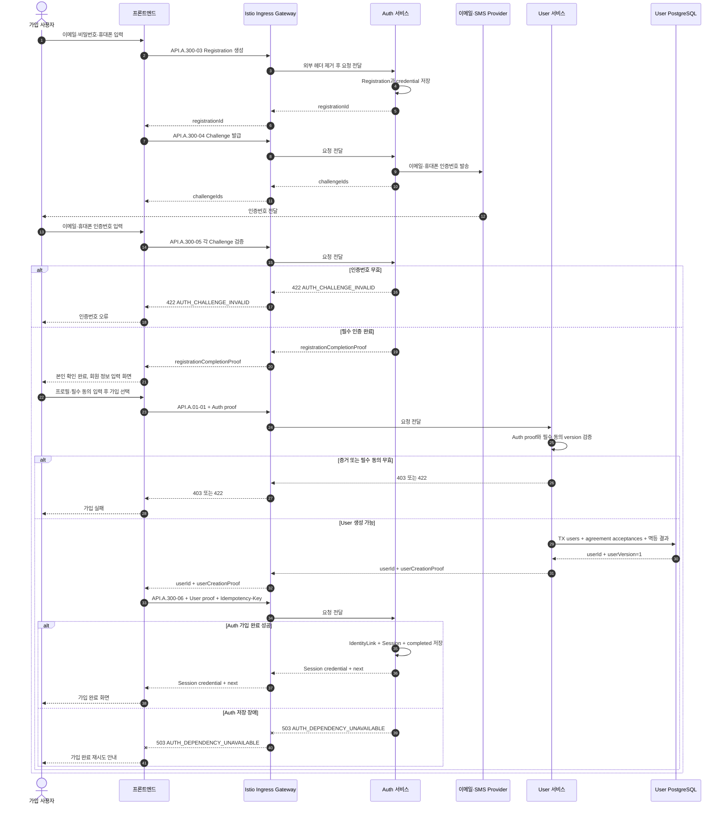

# 회원가입 시퀀스

## 기본 정보

- Scenario ID: `SCN.A.01-01`
- 시작 지점: 비회원이 인증 화면에서 이메일·비밀번호·휴대폰을 입력한다.
- 성공 기준: 프론트엔드가 Auth 검증, User 생성과 Auth 가입 완료를 차례로 호출하고 Session을 받는다.
- 실패 기준: 한 단계라도 실패하면 Session을 반환하지 않는다. 같은 `registrationId`와 멱등 키로 재시도한다.

## 연관 문서

- [통합 User 모델](../A_01_10-domain-model/README.md)
- [멱등성과 실패 처리](../A_01_20-persistence/reliability-and-events.md)
- [가입과 계정 Handler](../A_01_30-service/registration-account-handlers.md)
- [API.A.01-01 User 생성](../A_01_40-api/API_A_01_01_create_user.md)
- [Auth 가입 시퀀스](../../../80-sequence/A_300_auth/SCN_A_300_01_email_registration.md)

## 처리 시퀀스

## 단계 설명

| 단계 | 책임 | 계약 | 저장 경계 |
| --- | --- | --- | --- |
| 외부 요청 경계 | Ingress | TLS 종료, 라우팅, 요청 빈도 제한, 외부에서 들어온 내부용 헤더 제거 | 업무 데이터 저장 안 함 |
| 가입 자격 검증 | 프론트엔드, Auth | Registration과 Challenge API | Auth가 credential과 검증 상태 저장 |
| 검증 완료 | 프론트엔드, Auth | `registrationCompletionProof` | 가입 화면으로 이동할 수 있는 단기 권한 발급 |
| User 생성 | 프론트엔드, User | `API.A.01-01`, `CMD.A.01-17` | User·필수 동의·멱등 결과를 한 트랜잭션에 저장 |
| Auth 완료 | 프론트엔드, Auth | `API.A.300-06` | IdentityLink·Session·Registration을 Auth 트랜잭션에 저장 |
| 응답 | Auth, 프론트엔드 | 웹 Session cookie 또는 모바일 credential | Auth 완료 뒤에만 전달 |

## 데이터 이동

| 구분 | 데이터 |
| --- | --- |
| 가입 시작 입력 | 이메일, 비밀번호, 휴대폰 |
| 검증 입력 | 이메일·휴대폰 인증번호 |
| User 생성 입력 | 프로필, 필수 동의 code/version, Auth proof |
| Auth 증거 | `registrationId`, 필수 인증 완료, 발급·만료 시각, 서명. 식별자 원문 제외 |
| User 요청 | registration ID, Auth proof, 프로필, 필수 동의 |
| User 저장 | User, agreement acceptance, `user_version=1`, 멱등 결과 |
| Auth 완료 요청 | user ID, User 생성 증거, registration ID, 같은 멱등 키 |
| 성공 응답 | Session cookie와 다음 화면 |

## 불변조건

- 프론트엔드는 Istio Ingress Gateway를 통해 Auth와 User의 공개 API를 직접 호출한다.
- Ingress는 TLS 종료, 라우팅, 요청 빈도 제한과 외부에서 들어온 내부용 헤더 제거만 담당하고 가입 단계를 조정하지 않는다.
- Auth와 User는 서로 호출하지 않고 audience가 제한된 단기 proof로 결과를 전달한다.
- 한 `registrationId`는 한 `userId`만 만든다.
- User는 Auth proof가 유효하고 필수 동의가 모두 있을 때만 생성한다.
- User 생성은 계정과 기본 프로필을 단일 `users` 행에 저장한다.
- Auth 가입 완료 전에는 Session을 프론트엔드에 전달하지 않는다.
- 별도 가입 조정 Aggregate, Process Manager와 가입 연결 Event를 사용하지 않는다.
- 이메일·휴대폰·credential은 User 요청, DB와 proof에 포함하지 않는다.

## 예외 처리

| 조건 | 처리 |
| --- | --- |
| 인증번호 오류 | User를 호출하지 않고 Auth 오류를 반환한다. |
| Auth proof 무효·만료 | User를 만들지 않고 `USER_REGISTRATION_PROOF_INVALID`를 반환한다. |
| 필수 동의 누락·version 불일치 | User를 만들지 않고 `USER_REQUIRED_AGREEMENT_INVALID`를 반환한다. |
| User 응답 유실 | 같은 registration ID 재요청에서 같은 User 결과를 반환한다. |
| Auth 완료 실패 | Session을 반환하지 않는다. 프론트엔드가 User의 기존 결과를 다시 받아 Auth 완료를 재시도한다. |
| 같은 registration ID의 다른 프로필 | `USER_REGISTRATION_CONFLICT`로 거부한다. |

## 검증 항목

- 중복 가입 완료 요청에서 User, IdentityLink와 Session이 각각 하나만 존재한다.
- User 생성 실패 시 Auth 완료 API가 호출되지 않는다.
- Auth 완료 실패 시 프론트엔드가 Session cookie를 받지 않는다.
- 재시도에서 같은 `userId`와 논리 Session을 반환한다.
- User DB와 로그에 이메일, 휴대폰, credential, 인증번호가 없는지 확인한다.
- User 생성과 Auth 연결 경로에 Broker, Inbox와 보상 Worker가 없는지 확인한다.
- 프론트엔드의 Auth·User 호출이 모두 Ingress를 거치는지 확인한다.
