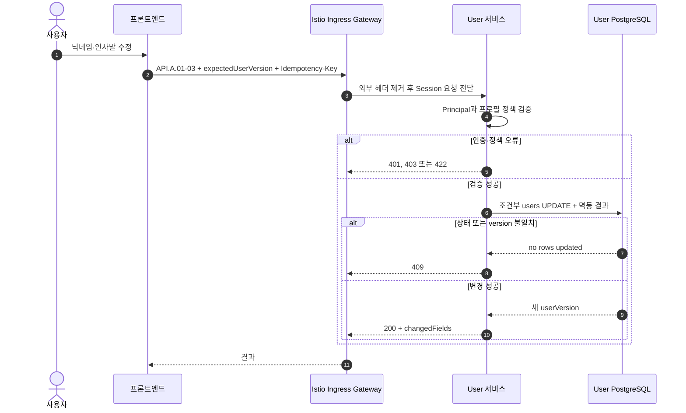

# 본인 프로필 수정 시퀀스

## 기본 정보

- Scenario ID: `SCN.A.01-02`
- 시작 지점: 사용자가 프로필 수정을 제출한다.
- 성공 기준: 조건부 UPDATE 한 번으로 프로필과 `user_version`을 변경한다.
- 실패 기준: Principal, 계정 상태, version 또는 프로필 정책이 유효하지 않으면 변경하지 않는다.

## 연관 문서

- [통합 User 모델](../A_01_10-domain-model/README.md)
- [프로필 Handler](../A_01_30-service/profile-handlers.md)
- [API.A.01-03](../A_01_40-api/API_A_01_03_update_my_profile.md)

## 처리 시퀀스

## 단계 설명

| 단계 | 책임 | 계약 | 저장 경계 |
| --- | --- | --- | --- |
| 요청 전달 | Ingress | TLS 종료, 라우팅, 요청 빈도 제한, 외부에서 들어온 내부용 헤더 제거 | 업무 데이터 저장 안 함 |
| 입력 검증 | User | `API.A.01-03` | DB 변경 전 Principal과 정책 검증 |
| 프로필 변경 | User | `CMD.A.01-20` | 조건부 UPDATE와 멱등 결과를 한 트랜잭션에 저장 |

## 데이터 이동

| 구분 | 데이터 |
| --- | --- |
| 요청 | user Principal, nickname/introduction patch, expected version, 멱등 키 |
| 저장 | 정규화 프로필, 증가한 user version |
| 응답 | user ID, user version, 변경 필드, 수정 시각 |

## 불변조건

- User와 `user_version` 하나만 변경한다.
- `active` User만 프로필을 수정할 수 있다.
- private name과 프로필 이미지는 이 API에서 변경하지 않는다.
- 별도 SELECT 잠금, 프로필 version과 변경 Event를 만들지 않는다.
- Ingress는 프로필 정책을 판단하거나 응답을 조합하지 않는다.

## 예외 처리

| 조건 | 처리 |
| --- | --- |
| Principal 무효 | User를 조회·변경하지 않고 401 또는 403 |
| 계정 비활성 | `409 USER_ACCOUNT_NOT_ACTIVE` |
| version 충돌 | `409 USER_VERSION_CONFLICT` |
| 정책 위반 | `422 USER_PROFILE_POLICY_VIOLATION` |
| 같은 key의 다른 요청 | `409 USER_IDEMPOTENCY_CONFLICT` |

## 검증 항목

- 상태 변경과 프로필 수정 경합에서 한 조건부 UPDATE만 성공한다.
- 실패 시 프로필과 user version이 바뀌지 않는다.
- 같은 요청 재시도에서 기존 결과를 반환한다.
- 프로필 원문이 로그에 남지 않는다.
