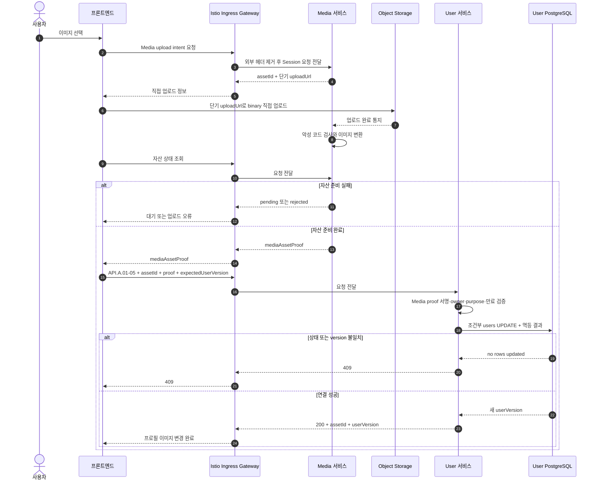

# 프로필 이미지 업로드와 연결 시퀀스

## 기본 정보

- Scenario ID: `SCN.A.01-03`
- 시작 지점: 사용자가 새 프로필 이미지를 선택한다.
- 성공 기준: Media가 검사한 자산 증거로 User의 자산 ID와 `user_version`을 변경한다.
- 실패 기준: 업로드·검사·증거·version이 유효하지 않으면 User를 변경하지 않는다.

## 연관 문서

- [프로필 Handler](../A_01_30-service/profile-handlers.md)
- [API.A.01-05](../A_01_40-api/API_A_01_05_update_my_profile_image.md)

## 처리 시퀀스

## 단계 설명

| 단계 | 책임 | 계약 | 저장 경계 |
| --- | --- | --- | --- |
| 요청 전달 | Ingress | TLS 종료, 라우팅, 요청 빈도 제한, 외부에서 들어온 내부용 헤더 제거 | 업무 데이터 저장 안 함 |
| 업로드 | 프론트엔드, Media, Object Storage | Media upload intent와 단기 upload URL | User DB 사용 안 함 |
| 검사 | Media | scan·transform | Media 원장 |
| 이미지 연결 | 프론트엔드, User | `API.A.01-05`, `CMD.A.01-21` | User 자산 ID와 멱등 결과를 한 트랜잭션에 저장 |

## 데이터 이동

| 구분 | 데이터 |
| --- | --- |
| Media 요청 | 사용자 Principal, purpose, 콘텐츠 metadata |
| Media 응답 | asset ID, 단기 URL, 준비 완료 증거 |
| User 요청 | asset ID, Media proof, expected user version, 멱등 키 |
| User 저장 | 현재 asset ID와 증가한 user version |

## 불변조건

- binary와 upload URL은 User 서비스를 통과하지 않는다.
- upload intent와 상태 조회는 Ingress를 거치고, binary만 Media가 발급한 단기 URL로 Object Storage에 직접 전송한다.
- User는 Media 증거가 유효할 때만 자산 ID를 저장한다.
- User 서비스는 upload intent와 signed URL을 저장하지 않는다.
- 이전 자산 정리는 Media의 미참조 자산 보존 정책이 담당한다.
- 이미지 연결 Event와 정리 Worker를 User 서비스에 만들지 않는다.
- Ingress는 binary를 중계하거나 Media와 User의 응답을 조합하지 않는다.

## 예외 처리

| 조건 | 처리 |
| --- | --- |
| upload URL 만료 | Media에서 새 intent를 요청한다. |
| scan/transform 실패 | User API를 호출하지 않는다. |
| Media proof 무효·만료 | `403 USER_PROFILE_MEDIA_PROOF_INVALID` |
| 계정 상태·version 충돌 | `409`로 거부하고 기존 asset ID 유지 |
| 미참조 자산 발생 | Media 보존 정책에 따라 정리 |

## 검증 항목

- User 저장소에 binary, upload URL과 upload intent가 없는지 확인한다.
- Media 준비 실패에서 User API가 호출되지 않는다.
- 위조·다른 사용자 proof가 거부된다.
- 상태 변경과 이미지 연결 경합에서 한 요청만 성공한다.
