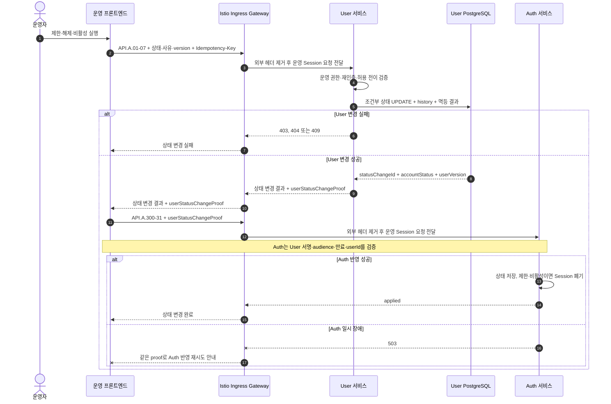

# 사용자 계정 상태 변경과 Session 폐기 시퀀스

## 기본 정보

- Scenario ID: `SCN.A.01-04`
- 시작 지점: 운영자가 사용자 제한·해제·비활성을 실행한다.
- 성공 기준: 운영 프론트엔드가 User 상태 변경과 Auth 반영을 차례로 호출한다.
- 실패 기준: 권한·전이·version이 유효하지 않으면 User를 변경하지 않는다. Auth 실패 시 같은 요청을 재시도한다.

## 연관 문서

- [통합 User 모델](../A_01_10-domain-model/README.md)
- [가입과 계정 Handler](../A_01_30-service/registration-account-handlers.md)
- [API.A.01-07](../A_01_40-api/API_A_01_07_change_user_account_status.md)
- [API.A.300-31](../../A_300_auth/A_300_40-api/API_A_300_31_apply_user_account_status.md)

## 처리 시퀀스

## 단계 설명

| 단계 | 책임 | 계약 | 저장 경계 |
| --- | --- | --- | --- |
| 요청 경계 | Ingress | TLS 종료, 라우팅, 요청 빈도 제한, 외부에서 들어온 내부용 헤더 제거 | 업무 데이터 저장 안 함 |
| 운영 권한 확인 | User, Auth | 운영 Session·permission·재인증 | 각 서비스가 자신의 요청에서 확인 |
| User 상태 변경 | User | `API.A.01-07`, `CMD.A.01-22` | User·history·멱등 결과 한 트랜잭션 |
| Auth 반영 | 운영 프론트엔드, Auth | `userStatusChangeProof` | Auth 상태와 Session 폐기 한 트랜잭션 |

## 데이터 이동

| 구분 | 데이터 |
| --- | --- |
| 운영 요청 | target user ID, target status, reason code, expected version, 멱등 키 |
| User 결과 | status change ID, account status, user version, changedAt, User 서명 proof |
| Auth 요청 | path user ID, `userStatusChangeProof` |

## 불변조건

- User는 단일 `account_status`와 `user_version`만 사용한다.
- Auth는 같은 또는 낮은 user version으로 현재 상태를 되돌리지 않는다.
- 제한·비활성 반영과 Session 폐기는 Auth 트랜잭션에서 함께 처리한다.
- 외부 Approval 서비스, 상태 전용 version과 상태 변경 Event를 사용하지 않는다.
- User 변경 성공 뒤 Auth 실패가 발생해도 User 상태를 되돌리지 않는다.
- 프론트엔드는 User가 서명한 상태 변경 proof를 수정하지 않고 Auth에 전달한다.
- Ingress는 상태 전이를 판단하거나 User 결과를 Auth 요청으로 변환하지 않는다.

## 예외 처리

| 조건 | 처리 |
| --- | --- |
| 운영 권한·재인증 부족 | 호출받은 서비스가 403 반환 |
| 허용되지 않은 전이 | `409 USER_ACCOUNT_STATUS_TRANSITION_INVALID` |
| User version 충돌 | `409 USER_VERSION_CONFLICT` |
| Auth 장애 | 프론트엔드가 같은 proof로 Auth 요청만 재시도. Auth는 멱등 적용 |
| Auth 장애 중 proof 만료 | 같은 멱등 키로 User 상태 변경 API를 다시 호출해 동일 결과와 새 proof를 받은 뒤 Auth 요청 재시도 |
| 낮은 Auth 적용 version | 현재 Auth 상태 유지 |

## 검증 항목

- User와 Auth가 운영 권한·재인증을 각각 검증한다.
- 변조·만료되었거나 path 사용자와 다른 proof는 Auth가 거부한다.
- User 상태 변경 재시도에서 history가 중복되지 않는다.
- 제한·비활성 적용 시 모든 active Session이 폐기된다.
- Auth 장애 재시도에서 User version이 다시 증가하지 않는다.
- Event Broker 없이 전체 처리가 완료된다.
