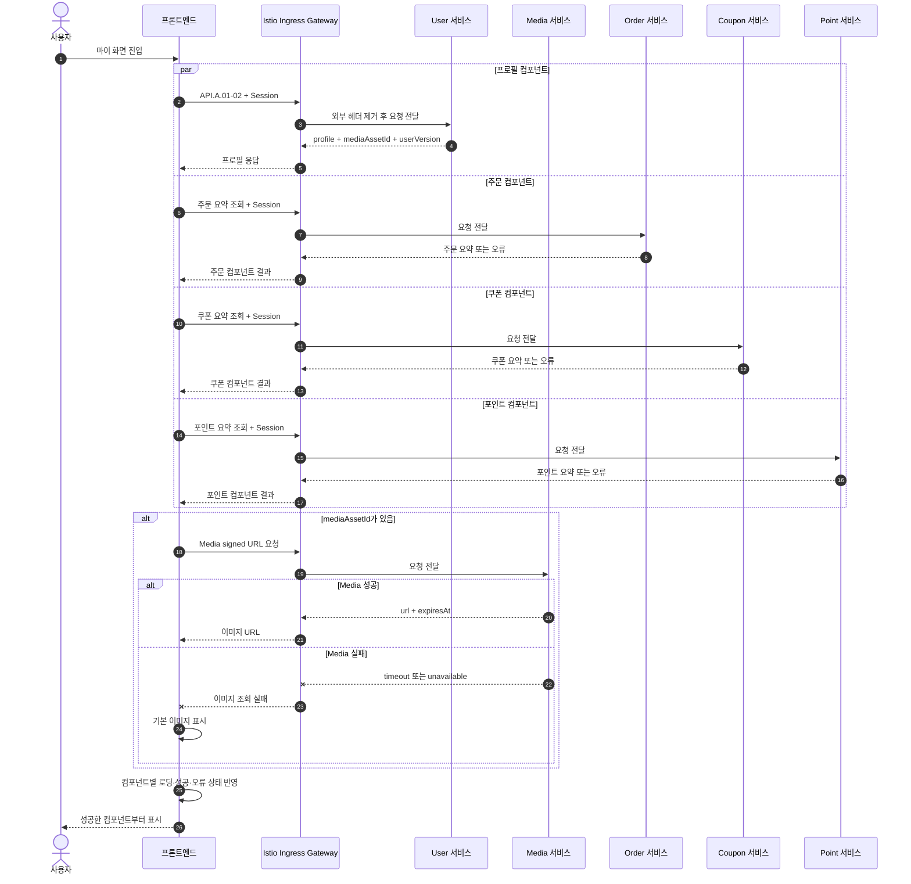

# 마이 화면 컴포넌트 독립 조회 시퀀스

## 기본 정보

- Scenario ID: `SCN.A.01-05`
- 시작 지점: 사용자가 마이 화면에 진입한다.
- 성공 기준: 각 화면 컴포넌트가 Ingress를 통해 자신의 서비스를 호출하고 프론트엔드가 결과를 표시한다.
- 부분 실패 기준: Media 또는 다른 서비스의 실패를 해당 컴포넌트에만 표시한다.

## 연관 문서

- [조회 모델과 인덱스](../A_01_20-persistence/read-models-and-indexes.md)
- [본인 사용자 조회](../A_01_30-service/my-query.md)
- [API.A.01-02](../A_01_40-api/API_A_01_02_get_my_profile.md)

## 처리 시퀀스

## 단계 설명

| 단계 | 책임 | 계약 | 저장·캐시 경계 |
| --- | --- | --- | --- |
| 요청 경계 | Ingress | TLS 종료, 라우팅, 요청 빈도 제한, 외부에서 들어온 내부용 헤더 제거 | 업무 데이터 저장 안 함 |
| User 조회 | 프로필 컴포넌트, User | `API.A.01-02` | User는 자신의 프로필만 반환 |
| 이미지 URL | 프로필 이미지 컴포넌트, Media | signed URL | URL 저장 안 함 |
| 다른 영역 조회 | 각 화면 컴포넌트, 소유 서비스 | 서비스별 공개 Query | 컴포넌트별 실패 표시 |

## 데이터 이동

| 구분 | 데이터 |
| --- | --- |
| User 응답 | profile, media asset ID, user version |
| Media 요청 | opaque asset ID와 짧은 TTL |
| 화면 상태 | 컴포넌트별 로딩, 데이터, 오류 |

## 불변조건

- 각 서비스는 자신이 소유한 데이터만 반환한다.
- User 서비스는 signed URL을 발급하거나 저장하지 않는다.
- 각 서비스는 Session에서 얻은 사용자 Principal을 직접 검증한다.
- Ingress는 응답을 합치거나 부분 실패를 성공 응답으로 변환하지 않는다.
- 원천 실패를 0이나 빈 성공 값으로 바꾸지 않는다.

## 예외 처리

| 조건 | 처리 |
| --- | --- |
| Principal 무효 | 호출받은 서비스가 401 또는 403 반환 |
| User 없음 | 프로필 컴포넌트에 오류 표시 |
| Media 실패 | 텍스트 프로필 유지, 기본 이미지 표시 |
| 다른 서비스 실패 | 해당 컴포넌트만 오류 표시와 재시도 제공 |

## 검증 항목

- User 응답에 주문·쿠폰·포인트와 signed URL이 없는지 확인한다.
- Media 장애에서 사용자 텍스트 프로필이 유지된다.
- 각 서비스 장애가 다른 컴포넌트 성공을 취소하지 않는다.
- 모든 서비스 API 호출이 Ingress를 거치는지 확인한다.
