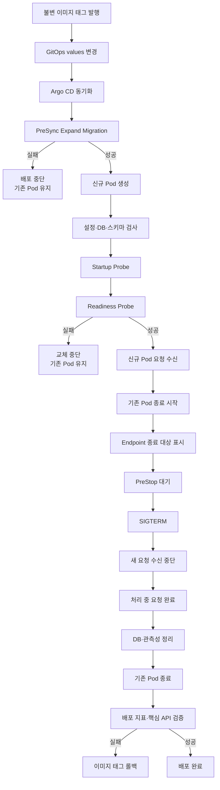

# Context 사용자 서비스 배포 설계

이 문서는 사용자 서비스의 배포 결정을 먼저 선언하고, 그 결정을 실제 배포 절차와 운영 기준으로 연결한다. Kubernetes 공통 리소스와 환경별 수치는 GitOps 저장소가 소유하며, 이 문서는 사용자 서비스가 배포 중 반드시 지켜야 하는 계약을 소유한다.

## 1부. 배포 전략 의사결정

### 1. 배포 전략 결정

사용자 서비스는 **Argo CD가 동기화하는 Kubernetes Deployment의 RollingUpdate**를 기본 배포 전략으로 사용한다.

| 결정 대상 | 결정 |
| --- | --- |
| 애플리케이션 배포 | 신규 Pod를 먼저 준비하는 RollingUpdate |
| DB 구조 변경 | 애플리케이션보다 먼저 실행하는 `PreSync` Expand Migration |
| 대량 데이터 보정 | 배포 파이프라인에서 분리한 별도 Backfill 작업 |
| 파괴적 스키마 변경 | 롤백 보존 기간과 Backfill 검증 후 별도 Contract 릴리스 |

```yaml
strategy:
  type: RollingUpdate
  rollingUpdate:
    maxUnavailable: 0
    maxSurge: 1
```

`maxUnavailable: 0`은 준비된 기존 Pod를 먼저 줄이지 않는다는 계약이고, `maxSurge: 1`은 신규 Pod 하나가 Ready가 된 뒤 기존 Pod를 교체한다는 계약이다. 실제 replica와 HPA 수치는 환경별 values가 소유하며, 서비스 values의 기본값을 운영 인스턴스 수로 해석하지 않는다.

### 2. 결정 배경과 판단 기준

사용자 서비스는 사용자 ID, 계정 상태, 프로필과 필수 동의 이력을 PostgreSQL에 저장하는 무상태 API 서버다. Pod는 로컬 상태를 소유하지 않으므로 여러 인스턴스로 실행할 수 있지만, 배포 중에는 구버전과 신버전이 같은 DB 스키마를 함께 사용한다.

따라서 배포 전략은 다음 대상을 보호해야 한다.

| 보호 대상 | 판단 기준 |
| --- | --- |
| 사용자 요청 | 신규 Pod가 준비되기 전에 기존 Pod를 제거하지 않는다. |
| 처리 중 요청 | 종료 대상 Pod는 새 요청 수신을 멈춘 뒤 진행 중 요청을 완료한다. |
| 저장 데이터 | 구버전과 신버전이 함께 사용할 수 있는 스키마만 배포 중 적용한다. |
| 롤백 경로 | 애플리케이션을 직전 이미지로 되돌릴 동안 구 스키마를 제거하지 않는다. |
| 운영 안정성 | 실행 시간을 예측하기 어려운 Backfill이 서비스 배포를 막지 않게 한다. |

RollingUpdate는 구버전과 신버전을 잠시 함께 실행하면서 준비된 Pod부터 요청을 받게 할 수 있어 이 조건에 맞는다. Canary는 버전별 요청 분할과 자동 분석 기준이 필요한 고위험 변경에서, Blue/Green은 Preview 환경 전체를 검증한 뒤 한 번에 전환해야 하는 변경에서만 검토한다. 두 전략 모두 공유 DB의 스키마 호환성을 대신 해결하지 않는다. Recreate는 기존 Pod를 먼저 제거해 서비스 중단을 만들기 때문에 운영 환경에서 사용하지 않는다.

### 3. 배포 계약

| 계약 | 보장 내용 |
| --- | --- |
| 가용성 | 신규 Pod가 Ready가 된 뒤에만 기존 Pod를 줄인다. 운영 환경은 환경별 설정으로 최소 2개 이상의 가용 인스턴스를 전제로 한다. |
| API 호환성 | 배포 중 함께 실행되는 구·신규 API가 같은 요청과 응답 계약을 처리한다. |
| DB 호환성 | Expand 변경을 먼저 적용하고 구버전이 사용하는 컬럼과 제약을 같은 릴리스에서 제거하지 않는다. |
| 스키마 검사 | 애플리케이션은 정확한 최신 버전이 아니라 지원 가능한 schema version 범위를 검사한다. |
| 요청 종료 | Endpoint 제외 반영 시간을 확보한 뒤 새 연결을 막고 처리 중 요청을 제한 시간까지 완료한다. |
| 롤백 | 애플리케이션은 이전 이미지로 되돌리되 Expand Migration을 자동으로 되돌리지 않는다. |
| 데이터 전환 | Backfill은 배포 완료 후 별도 승인·중지·재개가 가능한 작업으로 실행한다. |

관련 요구사항은 [Kubernetes 클러스터 아키텍처](../../../00-requirements/REQ_A_06_kubernetes_cluster_architecture.md)의 `REQ.A.06.FR-010`, `REQ.A.06.FR-011`, `REQ.A.06.NFR-004`, `REQ.A.06.NFR-005`, `REQ.A.06.NFR-017`과 [한정판 드롭 커머스](../../../00-requirements/REQ_A_01_limited_drop_commerce.md)의 `REQ.A.01.NFR-017`을 따른다.

## 2부. 배포 절차

### 4. 전체 배포 타임라인



이 타임라인은 애플리케이션 배포가 완료되는 지점까지만 다룬다. Backfill과 Contract Migration은 배포 이후의 별도 데이터 전환 절차다.

### 5. 배포 전 준비

**목적.** 배포 시작 전에 구버전과 신버전의 공존 가능 여부와 복구 수단을 확인한다.

**실행.** 서비스 저장소는 같은 소스 revision에서 API 실행 파일과 Migration 실행 파일을 포함한 불변 이미지를 발행한다. GitOps 변경 전에는 API 하위 호환성, DB Expand 여부, 롤백할 이미지 태그와 Git revision을 확인한다. Argo CD가 실제 사용하는 values 적용 순서로 최종 manifest를 렌더링해 RollingUpdate, Probe, HPA와 PDB의 유효 설정도 확인한다.

**성공 조건.** 구버전이 Expand 이후의 스키마에서도 실행되고, 신버전이 기존 데이터와 API 계약을 처리하며, 직전 검증 이미지가 남아 있어야 한다.

**실패 시.** 호환성이나 복구 수단을 확인하지 못하면 GitOps 변경을 병합하지 않는다.

**다음 단계.** 준비가 끝나면 불변 이미지 태그를 사용자 서비스 values에 반영하고 Argo CD 동기화를 시작한다.

### 6. PreSync Migration

**목적.** 신규 애플리케이션이 사용할 호환 스키마를 Deployment보다 먼저 준비한다.

**실행.** Migration은 Argo CD `PreSync` Hook으로 실행한다.

```yaml
metadata:
  annotations:
    argocd.argoproj.io/hook: PreSync
    argocd.argoproj.io/sync-wave: "-10"
    argocd.argoproj.io/hook-delete-policy: BeforeHookCreation,HookSucceeded
spec:
  backoffLimit: 2
  activeDeadlineSeconds: 600
  template:
    spec:
      restartPolicy: Never
      terminationGracePeriodSeconds: 60
```

Migration Job은 배포할 API와 같은 이미지 태그를 사용한다. 버전 테이블은 적용 완료 migration을 기록하고 PostgreSQL 세션 잠금은 동시 실행을 막는다. `SIGTERM`을 받으면 새 migration 단위를 시작하지 않고 실행 중인 트랜잭션을 취소·롤백한 뒤 연결과 잠금을 해제한다. API 요청 정리가 필요하지 않으므로 Migration Pod에는 `preStop`을 두지 않는다.

PreSync에는 nullable 컬럼, 새 테이블과 호환 가능한 인덱스처럼 구버전이 계속 사용할 수 있는 Expand 변경만 포함한다. 대량 데이터 보정, 컬럼 삭제·이름 변경과 즉시 적용되는 파괴적 제약은 포함하지 않는다.

**성공 조건.** 목표 schema version이 한 번만 적용되고 트랜잭션과 잠금이 정상 종료되어야 한다.

**실패 시.** Argo CD 동기화를 중단하고 기존 Pod를 유지한다. 같은 이미지와 migration version을 원인 수정 없이 반복 실행하지 않으며 실패한 Job의 로그와 상태를 보존한다.

**다음 단계.** Migration이 성공한 경우에만 신규 Pod를 생성한다.

### 7. 신규 Pod 배포

**목적.** 기존 Pod를 유지한 상태에서 신규 버전이 요청을 받을 준비가 되었는지 검증한다.

**실행.** RollingUpdate는 `maxSurge: 1`로 신규 Pod를 먼저 만든다. Pod는 다음 순서로 준비 상태를 확인한다.

```text
컨테이너 시작
→ 설정과 필수 Secret 확인
→ DB 연결 확인
→ 지원 가능한 schema version 범위 확인
→ Startup Probe 통과
→ Readiness Probe 통과
→ Service 요청 대상 등록
```

Startup Probe는 시작 완료 여부를, Readiness Probe는 현재 요청을 처리할 수 있는지를 나타낸다. Liveness Probe는 프로세스가 회복 불가능한 상태인지 판단하며 일시적인 DB 지연만으로 Pod를 재시작하지 않는다. 스키마 검사는 `minimum_supported_version <= current_version <= maximum_supported_version` 계약을 사용해 Expand 이후에도 구버전 Pod가 재시작될 수 있게 한다.

**성공 조건.** 신규 Pod가 제한 시간 안에 Ready가 되고 필요한 최소 Ready 시간을 유지해야 한다.

**실패 시.** 신규 Pod를 Service 요청 대상에 포함하지 않고 기존 Pod를 유지한다. 설정, Secret, DB 연결, schema version과 Probe 실패 원인을 확인한다.

**다음 단계.** 신규 Pod가 Ready가 되면 요청을 받기 시작하고 기존 Pod 종료를 시작한다.

### 8. 기존 Pod 종료

**목적.** 신규 Pod가 요청을 처리하는 동안 기존 Pod로 향하는 새 요청을 차단하고, 이미 받은 요청은 완료한다.

**실행.** Pod에 삭제 시각이 설정되면 EndpointSlice는 해당 Pod를 종료 대상으로 표시한다. Gateway와 proxy가 변경된 Endpoint를 반영하는 동안 늦게 도착한 요청을 처리할 수 있도록 짧은 `preStop` 대기 시간을 둔다. 그 뒤 애플리케이션이 `SIGTERM`을 받으면 새 연결 수신을 멈추고 처리 중 요청이 끝나기를 기다린다. 요청이 끝난 후 DB 연결과 metric·trace·log exporter를 정리하고 프로세스를 종료한다.

```text
종료 대상 표시
→ PreStop 대기
→ SIGTERM
→ 새 연결 수신 중단
→ 처리 중 요청 완료
→ DB·관측성 정리
→ 프로세스 종료
```

종료 유예 시간은 다음 합보다 길어야 한다.

```text
Endpoint 반영 대기
+ 최대 요청 처리 시간
+ DB·관측성 정리 시간
+ proxy 연결 정리 시간
+ 안전 여유
```

`preStop`은 전체 종료 유예 시간에 포함되므로 짧고 멱등해야 한다. 애플리케이션이 DB 연결을 먼저 닫으면 처리 중 요청이 실패하고, exporter를 먼저 닫으면 종료 오류를 관측할 수 없으므로 정리 순서를 바꾸지 않는다.

**성공 조건.** 처리 중 요청이 제한 시간 안에 끝나고 애플리케이션과 proxy가 강제 종료 없이 종료되어야 한다.

**실패 시.** 종료 유예 시간을 넘기면 강제 종료와 응답 유실 가능성을 기록한다. DB 반영 후 응답이 유실된 요청은 `Idempotency-Key`, `registrationId`와 `expectedUserVersion` 계약으로 안전하게 재시도한다.

**다음 단계.** 기존 Pod 종료가 끝나면 배포 지표와 핵심 API를 검증한다.

### 9. 배포 완료 검증

**목적.** Kubernetes의 Rollout 완료뿐 아니라 사용자 서비스가 실제로 정상 동작하는지 확인한다.

**실행.** 신규 버전의 Ready Pod 수, 5xx 비율, p95·p99 지연시간, DB 오류, Pod restart와 종료 소요 시간을 확인한다. 사용자 생성, 본인 프로필 조회·수정과 계정 상태 조회 synthetic 검증도 실행한다.

**성공 조건.** 신규 Pod가 목표 가용 수를 유지하고 핵심 API와 승인 지표가 기준 안에 있어야 한다.

**실패 시.** 신규 버전 확대와 기존 ReplicaSet 정리를 멈추고 실패 단계에 맞는 롤백을 선택한다. 오류율과 지연시간의 절대 임계값은 실제 기준선을 측정한 환경별 배포 정책이 소유한다.

**다음 단계.** 모든 검증이 성공하면 애플리케이션 배포를 완료한다. Backfill이 필요한 경우에도 배포 완료 후 별도 운영 작업으로 시작한다.

### 10. 실패 판정과 롤백

| 실패 단계 | 판정 | 대응 |
| --- | --- | --- |
| 배포 전 준비 | 호환성 또는 복구 이미지 미확인 | GitOps 변경을 병합하지 않는다. |
| PreSync Migration | 시간 초과, 잠금 실패, SQL 오류, schema version 불일치 | 신규 Pod 배포를 막고 기존 Pod를 유지한다. |
| 신규 Pod 시작 | 설정·Secret 누락, DB 연결 실패, 지원하지 않는 스키마 | 신규 Pod를 요청 대상에 넣지 않는다. |
| Readiness | 제한 시간 안에 Ready가 되지 않음 | 기존 ReplicaSet을 유지하고 Rollout을 중단한다. |
| 기존 Pod 종료 | 처리 중 요청 또는 정리가 종료 유예 시간을 초과 | 강제 종료와 재시도 영향을 기록하고 시간 예산을 재검토한다. |
| 배포 후 검증 | 핵심 API 또는 승인 지표 실패 | 직전 검증 이미지 태그로 되돌린다. |

애플리케이션 롤백은 GitOps values의 이미지 태그와 필요한 설정을 직전 Git revision으로 되돌린 뒤 다시 동기화한다. Expand Migration은 자동 Down Migration으로 되돌리지 않는다. 추가된 호환 스키마를 유지해야 구버전 애플리케이션이 다시 실행될 수 있다.

파괴적 Contract Migration이 이미 실행된 경우에는 애플리케이션 태그만으로 복구할 수 있다고 가정하지 않는다. Contract는 백업·복구 검증과 별도 승인을 갖춘 후속 릴리스로 실행한다.

## 3부. 운영 기준

### 11. 배포 이후 데이터 전환

배포 파이프라인은 Expand Migration과 애플리케이션 배포까지만 책임진다. 실행 시간과 DB 부하를 예측하기 어려운 Backfill은 배포 완료 후 별도 승인으로 시작한다.

| 단계 | 실행 시점 | 기준 |
| --- | --- | --- |
| Expand | 애플리케이션 배포 전 | 구버전과 호환되는 구조만 추가한다. |
| Deploy | Expand 성공 후 | 구·신규 데이터를 모두 처리하는 코드를 배포한다. |
| Backfill | 배포 완료 후 별도 작업 | 범위 단위 처리, 속도 제한, 중지·재개와 checkpoint를 지원한다. |
| Contract | Backfill 검증과 롤백 보존 기간 종료 후 | 구 컬럼, 구 인덱스와 호환 코드를 제거한다. |

Backfill은 이미 처리한 범위를 다시 실행해도 결과가 같아야 한다. DB lock, CPU, I/O와 replica 지연이 운영 기준을 넘으면 일시 중지하고 마지막 checkpoint부터 재개한다. Backfill 실패는 애플리케이션 배포를 롤백시키지 않으며, 애플리케이션은 완료 전까지 구·신규 데이터를 모두 읽을 수 있어야 한다.

Contract는 모든 Pod가 신규 버전으로 교체되고, Backfill 결과가 검증되며, 구버전 롤백 가능 기간이 끝난 뒤 별도 릴리스에서 실행한다.

### 12. 가용성과 확장 정책

| 위험 | 적용 정책 |
| --- | --- |
| 배포 중 가용 Pod 감소 | `maxUnavailable: 0`, `maxSurge: 1`로 신규 Pod를 먼저 준비한다. |
| 운영 인스턴스 부족 | 환경별 replica 또는 HPA `minReplicas`로 최소 2개 이상의 가용 인스턴스를 전제로 한다. |
| 자발적 중단의 동시 발생 | PDB로 노드 drain 같은 자발적 중단에서 최소 가용 Pod를 보호한다. |
| 같은 장애 영역 집중 | anti-affinity 또는 topology spread로 노드와 가용 영역에 분산한다. |
| 신규 Pod의 이른 승격 | Readiness와 `minReadySeconds`로 안정화 시간을 확보한다. |
| 중단된 Rollout 방치 | `progressDeadlineSeconds`로 진행 실패를 드러낸다. |
| 종료 중 요청 유실 | 요청 처리 시간과 proxy 정리를 포함한 `terminationGracePeriodSeconds`를 둔다. |

HPA, PDB와 replica의 최종 수치는 서비스 공통 기본값이 아니라 환경별 부하와 장애 허용 기준으로 결정한다. RollingUpdate의 추가 Pod를 배치할 CPU, 메모리와 topology 여유도 함께 확보해야 한다. PDB는 Deployment Rollout의 교체 수를 제어하지 않으므로 `maxUnavailable`을 대신하지 않는다.

### 13. 관측과 운영 검증

| 관측 대상 | 확인 항목 |
| --- | --- |
| 배포 | revision, image tag, Argo CD sync, Rollout 상태와 소요 시간 |
| Pod | Ready·unavailable 수, restart, PreStop과 종료 소요 시간, 강제 종료 |
| API | 버전별 요청 수, 2xx·4xx·5xx, p50·p95·p99 지연시간 |
| Migration | version, migration 이름, 실행 시간, 시도 횟수, 잠금과 결과 |
| PostgreSQL | 연결 수, query 오류, lock 대기, transaction rollback |
| 업무 결과 | 사용자 생성·프로필 변경·계정 상태 변경의 성공, 충돌과 멱등 재처리 |

배포 전에는 API·DB 호환성, 롤백 이미지, 최종 manifest, 가용성 설정과 중단 기준을 확인한다. 배포 후에는 Migration version, 신규 Pod Ready 상태, 기존 Pod 정상 종료, 핵심 API와 승인 지표를 하나의 배포 revision으로 연결해 확인한다.

관측 결과가 없으면 배포 완료로 판정하지 않는다. 기준이 정의되지 않은 지표는 자동 승격에 사용하지 않고, 먼저 실제 기준선을 측정한다.

### 14. GitOps 구현 연결

| 책임 | 구현 위치 | 현재 상태 |
| --- | --- | --- |
| 공통 Deployment·Service·HPA·PDB 템플릿 | `gitops/charts/medikong-service/templates/` | 존재 |
| 공통 RollingUpdate 기본값 | `gitops/charts/medikong-service/values.yaml`, `gitops/values/base.yaml` | 존재 |
| 사용자 서비스 기본값 | `gitops/values/services/user.yaml` | 존재 |
| 환경별 replica·HPA·PDB·리소스 | `gitops/values/env/<environment>.yaml`, 환경별 user override | 환경별 관리 |
| 사용자 서비스 Argo CD Application | `gitops/argo/applications/<environment>/services/user.yaml` | 현재 `private-dev` 존재 |
| Migration Job | 공통 chart의 사용자 서비스 migration 설정 또는 전용 Job template | 구현 예정 |
| Migration 실행 파일과 SQL | `service/services/user-service/cmd/migrate`, 사용자 영속성 migration 패키지 | 구현 예정 |
| 플랫폼 공통 릴리스 구조 | `gitops/docs/architecture/service-release-model.md` | 존재 |

환경별 values가 공통 RollingUpdate 계약을 변경할 수 있으므로 배포 전에는 Argo CD가 실제 사용하는 values 적용 순서로 최종 manifest를 렌더링한다. 이 문서의 배포 계약과 렌더링 결과가 다르면 배포하지 않는다.

#### 연관 문서

- [사용자 서비스 상세 설계](../README.md)
- [사용자 영속성 설계](../A_01_20-persistence/README.md)
- [Application Service](../A_01_30-service/README.md)
- [사용자 처리 시퀀스](../A_01_50-sequence/README.md)
