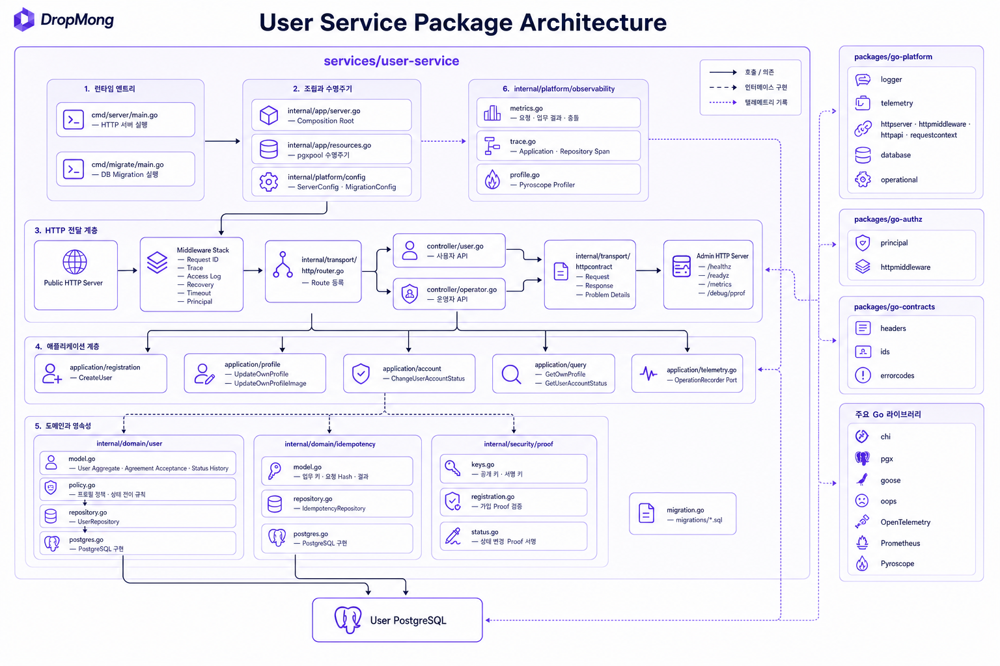

# Context 사용자 서비스 상세 설계

## 역할

사용자 서비스는 사용자 ID, 계정 상태, 프로필과 가입 시점의 필수 동의 이력을 소유한다. 이메일·휴대폰·credential·IdentityLink·Session·role/permission은 Context 인증이 소유한다.

## 서비스 패키지 아키텍처

런타임 엔트리, HTTP 전달 계층, Application Service, 도메인·영속성, 공통 Go 패키지와 관측성 의존성을 한 장에 정리한다.

## 핵심 결정

- `AGG.A.01-08 User` 하나가 계정 상태와 프로필을 소유한다.
- 쓰기 원장은 `users`, 동시성 기준은 `user_version` 하나다.
- 계정 상태는 `active`, `restricted`, `deactivated`만 사용하며 상태 전용 version을 따로 두지 않는다.
- 가입 UI는 인증과 User 생성을 분리하고 프론트엔드가 Auth와 User의 공개 API를 차례로 호출한다.
- User 생성은 Auth가 발급한 가입 검증 완료 증거를 요구하고 `registration_id`로 멱등 처리한다.
- 필수 동의는 별도 Agreement 서비스 없이 User 생성 트랜잭션에서 이력으로 저장한다.
- 가입 처리용 Aggregate, 가입용 Inbox/Outbox와 Auth 연동 Event를 두지 않는다.
- 프로필 이미지 업로드는 프론트엔드가 Ingress를 통해 Media에 요청한다. User는 검증된 자산 ID만 저장한다.
- 마이 화면은 컴포넌트별로 소유 서비스를 호출한다. User는 기존 본인 프로필 API만 제공한다.
- 구체적인 소비자가 없는 Event와 복구 Worker는 만들지 않는다.

## 설계 문서

| 영역 | 문서 |
| --- | --- |
| 도메인 | [통합 User 모델](A_01_10-domain-model/README.md) |
| 영속성 | [저장 설계](A_01_20-persistence/README.md) |
| 쓰기 모델 | [쓰기 모델](A_01_20-persistence/write-models.md) |
| 조회 모델 | [조회 모델과 인덱스](A_01_20-persistence/read-models-and-indexes.md) |
| 신뢰성 | [멱등성과 실패 처리](A_01_20-persistence/reliability-and-events.md) |
| 서비스 | [Application Service](A_01_30-service/README.md) |
| 가입·계정 | [가입과 계정 Handler](A_01_30-service/registration-account-handlers.md) |
| 프로필 | [프로필 Handler](A_01_30-service/profile-handlers.md) |
| 마이 조회 | [마이 화면의 본인 프로필 조회](A_01_30-service/my-query.md) |
| API | [API 설계](A_01_40-api/README.md) |
| 시퀀스 | [사용자 처리 시퀀스](A_01_50-sequence/README.md) |
| 배포 | [사용자 서비스 배포 설계](A_01_60-deployment/README.md) |

## 책임 경계

| 사용자 서비스 | 다른 주체 |
| --- | --- |
| `user_id`, `account_status`, 프로필, 필수 동의 이력 | 이메일·휴대폰·credential·IdentityLink·Session: Auth |
| User 생성과 프로필·상태 변경 | 가입 화면 상태와 서비스 호출 순서: 프론트엔드 |
| 현재 프로필 이미지 자산 ID | 업로드·검사·변환·signed URL·미참조 자산 정리: Media |
| 본인 프로필 | 주문·쿠폰·포인트 조회와 화면 상태 조합: 각 프론트엔드 컴포넌트 |

## 구현 기준

- 모든 변경 API는 `Idempotency-Key`와 `expectedUserVersion`을 명시적으로 사용한다. User 생성은 `registrationId`가 업무 멱등 키다.
- User 변경은 `UPDATE ... WHERE user_id = ? AND user_version = ?` 형태의 조건부 UPDATE 한 번으로 처리한다.
- 공개 가입 API는 Auth의 `create_user` 전용 proof를 요구한다. 외부 호출은 모두 Ingress를 거치며 각 서비스가 Principal·권한과 업무 proof를 검증한다.
- 증거와 로그에는 이메일, 휴대폰, credential, Session 원문을 넣지 않는다.
- 가입의 후속 Auth 호출은 프론트엔드가 같은 업무 키로 재시도한다.
- 계정 상태 반영은 운영 프론트엔드가 User의 단기 서명 proof로 Auth 요청만 재시도한다.
