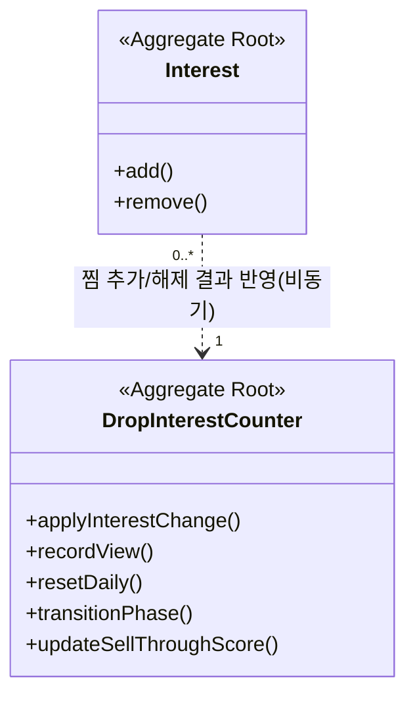
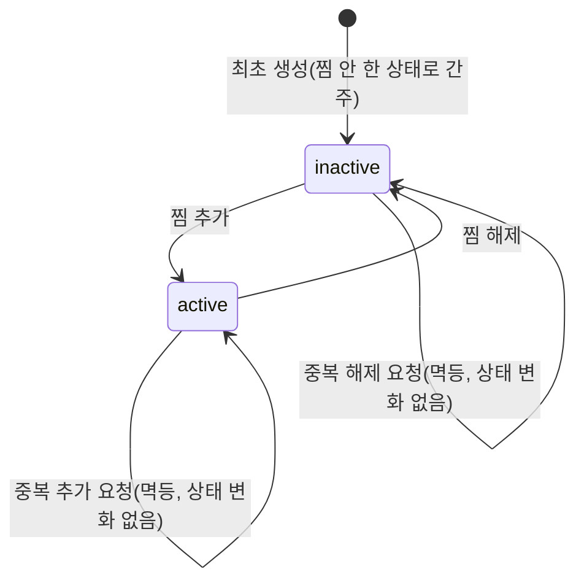
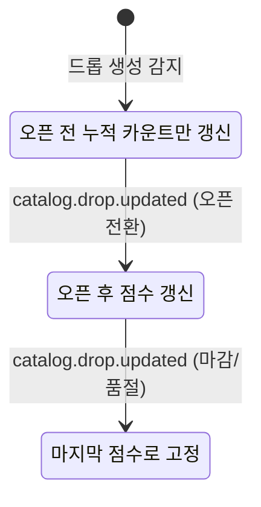

# Context 관심/랭킹 도메인 모델 설계

## 기본 정보

- Service Design ID: `SD.A.0710`
- 상위 서비스 디자인: `SD.A.07`
- Context: Context 찜, Context 랭킹 집계
- 근거 문서: [REQ.A.07](../../../00-requirements/REQ_A_07_interest_ranking.md), [UC.A.07](../../../30-uc/UC_A_07_interest_ranking.md), [BC.A.07](../../../40-event-storming-bounded-context/BC_A_07_interest_ranking.md)
- 설계 범위: 사용자-드롭 찜 상태, 드롭 단위 오픈 전/오픈 후 랭킹 카운터, 조회수 집계.
- 제외 범위: DB 물리 스키마, HTTP 요청/응답, 실제 배치/버퍼링 구현, catalog-service/order-service의 데이터 원장.

## 연관 태그

- 요구사항: [REQ.A.07](../../../00-requirements/REQ_A_07_interest_ranking.md)
- 유스케이스: [UC.A.07](../../../30-uc/UC_A_07_interest_ranking.md)
- 바운디드 컨텍스트: [BC.A.07](../../../40-event-storming-bounded-context/BC_A_07_interest_ranking.md)
- 영속성: SD.A.0720 예정
- 서비스: SD.A.0730 예정
- API: SD.A.0740 예정

## 기준 문서와 책임 결정

- `REQ.A.07`, `UC.A.07`, `BC.A.07`, `SD.A.07`을 interest-service 도메인 모델의 현재 기준으로 사용한다.
- `Interest`(찜 상태)와 `DropInterestCounter`(랭킹 카운터)를 별도 Aggregate로 분리한다. 두 값의 정합성 요구 수준이 다르기 때문이다(`RULE.A.07-03`).
- 드롭의 `SCHEDULED`/`OPEN` 상태 자체는 catalog-service가 소유한다. 이 BC는 `catalog.drop.updated`를 구독해 그 결과만 `DropInterestCounter.drop_phase`에 반영한다.
- `total_quantity`, `confirmed_count`는 order-service가 소유한다. 이 BC는 오픈 후 점수 계산에 필요한 스냅샷만 보관하며 authoritative owner가 아니다.

## 설계 원칙

- 찜은 사용자-드롭 단위의 단순 토글(`active`/`inactive`)로 표현한다. 별도 Entity 없이 Aggregate Root 하나로 충분하다.
- 오픈 전 카운터는 리셋 없이 유지되는 누적 활성 찜 수이며, 감쇠/속도 계산을 쓰지 않는다(`RULE.A.07-01`, 2026-07-14 수정 — 기존 "당일 자정 리셋"에서 변경, 근거는 `REQ.A.07` 2026-07-14 수정 이력 참고).
- 오픈 후 점수는 `sell_through_rate / elapsed_minutes` 공식으로 계산하며, `opened_at`이 설정되기 전에는 계산하지 않는다(`RULE.A.07-02`). **1차 구현 범위 밖(후속 스코프)** — order-service 연동 방식이 미확정이다.
- 찜 추가/해제는 `DropInterestCounter`에 대칭으로 반영되지만, 이 반영은 `Interest`와 같은 트랜잭션이 아니라 이벤트를 통해 비동기로 이뤄질 수 있다(정합성 레벨 분리, `RULE.A.07-03`).
- 조회 기록은 dedup 정책을 통과한 신호만 카운터에 반영한다(`POLICY.A.07-02`).
- Domain Event는 발생 사실을 나타낸다. 랭킹 재계산이나 배치 반영의 성공 여부는 별도 처리 결과이며 Aggregate 상태명이 아니다.

## 모델 개요

## Aggregate Root

| Aggregate ID | 이름 | 책임 | 생명주기 |
| --- | --- | --- | --- |
| `AGG.A.07-01` | Interest | 사용자-드롭 단위 찜 상태를 즉시 정확하게 관리한다. | 없음 -> active -> inactive (토글 반복 가능) |
| `AGG.A.07-02` | DropInterestCounter | 드롭 단위 오픈 전 누적 카운트, 오픈 후 점수, 조회수를 지연 허용 값으로 관리한다. | 1차 구현: 생성됨 -> 누적중(무기한, phase 구분 없음). phase 기반 상태 전이(`누적중 -> 점수계산중 -> 마감`)는 후속 스코프(2026-07-14 수정) |

## Interest Aggregate

### 필드

| 필드 | 타입 | 설명 | 출처 | 상태 |
| --- | --- | --- | --- | --- |
| `interest_id` | InterestId | 찜 레코드 고유 ID | `AGG.A.07-01` | 확정 |
| `user_id` | UserId | 찜한 사용자 | `REQ.A.07.FR-001` | 확정 |
| `drop_id` | DropId | 찜 대상 드롭 | `REQ.A.07.FR-001` | 확정 |
| `status` | InterestStatus | `active`(찜함), `inactive`(찜 안 함) | `REQ.A.07.FR-001`, `FR-009` | 확정 |
| `created_at` | time.Time | 최초 생성 시각 | 공통 | 확정 |
| `updated_at` | time.Time | 최근 토글 시각 | 공통 | 확정 |
| `version` | int64 | 낙관적 잠금 버전 | 동시 토글 정합성 | 확정 |

### 불변조건

- `(user_id, drop_id)` 조합은 유일하다. 찜/해제를 반복해도 새 레코드를 만들지 않고 같은 레코드의 `status`만 바뀐다.
- 로그인하지 않은 사용자는 `Interest`를 생성할 수 없다(`POLICY.A.07-01`).
- `status`가 바뀔 때마다 반드시 `찜 추가됨`/`찜 해제됨` 이벤트를 발행해야 한다. 이 이벤트가 `DropInterestCounter`의 대칭 반영(`RULE.A.07-05`) 트리거다.

### 상태 전이

## DropInterestCounter Aggregate

### 필드

2026-07-14 수정: 아래 표는 목표 설계를 그대로 두되 "1차 구현" 열을 추가했다. `drop_phase`가 빠지면서(구현 안 함) `upcoming_count_date`(자정 리셋 판단용)도 함께 불필요해졌다 — 리셋을 안 하니 기준일을 둘 이유가 없다. `interest_count`는 기존 `upcoming_count`를 대체한다(의미가 "당일 누적"에서 "리셋 없는 누적"으로 바뀌어 개명).

| 필드 | 타입 | 설명 | 출처 | 상태 | 1차 구현(2026-07-14) |
| --- | --- | --- | --- | --- | --- |
| `drop_id` | DropId | 드롭 식별자 (PK) | `AGG.A.07-02` | 확정 | 구현함 |
| `drop_phase` | DropPhase | `SCHEDULED`, `OPEN`, `CLOSED`. catalog-service 값의 참조 스냅샷 | `REQ.A.07.FR-006` | 확정 | 보류 — catalog-service 이벤트 구독 필요 |
| `interest_count`(구 `upcoming_count`) | int | 리셋 없는 누적 활성 찜 수 | `REQ.A.07.FR-003` | 확정 | 구현함 |
| ~~`upcoming_count_date`~~ | ~~Date~~ | ~~자정 리셋 판단용~~ | ~~`REQ.A.07.NFR-006`~~ | 삭제됨 | 리셋 자체가 없어져 불필요 |
| `view_count_total` | int | 누적 조회수(참고용) | `REQ.A.07.FR-004` | 확정 | 보류 — Redis dedup 인프라 필요 |
| `total_quantity` | int? | order-service 스냅샷: 총 판매 수량 | `REQ.A.07.NFR-004` | 확인 필요 (캐시 여부) | 보류 — order-service 연동 방식 미확정 |
| `confirmed_count` | int? | order-service 스냅샷: 확정 판매 수량 | `REQ.A.07.NFR-004` | 확인 필요 (캐시 여부) | 보류 — order-service 연동 방식 미확정 |
| `sell_through_score` | float? | 오픈 후 점수 (`confirmed_count/total_quantity` / `elapsed_minutes`) | `REQ.A.07.FR-005` | 확정 | 보류 |
| `opened_at` | time.Time? | 오픈 시각. `elapsed_minutes` 계산의 분모 기준 | `REQ.A.07.FR-005` | 확정 | 보류 |
| `updated_at` | time.Time | 최근 갱신 시각 | 공통 | 확정 | 구현함 |
| `version` | int64 | 낙관적 잠금 버전 | 동시 write(핫키) 정합성 | 확정 | 미사용 — Postgres `INSERT ... ON CONFLICT DO UPDATE SET interest_count = interest_count + delta`로 원자적 증감 처리해, 읽기-수정-쓰기 경합 자체가 없어 낙관적 잠금이 불필요해졌다(확인 필요: 핫키 상황에서도 이 방식으로 충분한지는 실측 필요) |

### 불변조건

- `interest_count`는 음수가 될 수 없다. 찜 해제로 감소시킬 때 0 밑으로 내려가지 않는다.
- (2026-07-14 삭제) ~~`upcoming_count_date`가 오늘이 아니면 리셋한다~~ — 리셋 자체가 없어졌다.
- (후속 스코프) `drop_phase`가 `OPEN`으로 전환되기 전에는 `sell_through_score`를 계산하지 않는다.
- (후속 스코프) `sell_through_score`는 `opened_at`이 설정된 이후에만 계산한다(분모 0 나눗셈 방지, 최소 elapsed 바닥값은 `HOTSPOT.A.07-02` 참고).
- (후속 스코프) `drop_phase`가 `CLOSED`/`SOLD_OUT`이 되면 `sell_through_score`는 마지막 값으로 고정하고 더 갱신하지 않는다.

### 상태 전이

2026-07-14 수정: 1차 구현은 phase 구분이 없어 상태 전이가 없다(`생성됨 -> 누적중`만 존재, 그대로 유지). 아래 다이어그램은 오픈 후 랭킹 착수 시 되살릴 목표 설계로 남겨둔다.

## DropView(신규, 2026-07-14)

`DropInterestCounter`와 별개로 다루는 이유: 찜은 "지금 상태"(리셋 없는 카운터 하나면 충분)지만, 조회는 "최근 활동"(시간 차원이 있어 원문을 남기고 시간창으로 다시 계산해야 함)이라 저장 성격이 다르다. 그래서 정식 Aggregate로 승격하지 않고, 원문 기록(`drop_views`, append-only)과 그로부터 파생된 배치 스냅샷(`drop_view_rankings`)의 조합으로 다룬다 — 도메인 불변조건이 없는 순수 이벤트 로그+파생 뷰라 Aggregate Root의 자격(불변조건 보호)이 없다고 판단했다.

- `drop_views`: `drop_id`, `user_id`, `viewed_at`만 가진 원문 기록. 불변조건 없음(그냥 사실의 로그). 삭제/수정 없음.
- `drop_view_rankings`: KST 3시간 고정 구간(`bucket_start`)마다 실시간 조회 랭킹 배치 Worker가 `COUNT(DISTINCT user_id)` 기준 Top 100을 계산해 저장하는 파생 스냅샷. API는 이것만 읽는다.
- 불변조건: `drop_view_rankings`의 `rank`는 같은 `bucket_start` 안에서 1~100이며 `viewer_count` 내림차순과 일치해야 한다.

## Read Model 후보

- `찜 목록 조회`(`RM.A.07-01`): `Interest`에서 `status=active`인 레코드를 `user_id` 기준으로 모은 것.
- (후속 스코프) `오픈 후 인기 랭킹 조회`(`RM.A.07-02`): `DropInterestCounter`에서 `drop_phase=OPEN`을 `sell_through_score` 내림차순 정렬.
- `기다리는 상품 랭킹 조회`(`RM.A.07-03`, 구 "오픈 예정 랭킹"): `DropInterestCounter`를 `interest_count` 내림차순 정렬(2026-07-14 수정: `drop_phase=SCHEDULED` 필터 제거, 전체 드롭 대상).
- `드롭 관심도 통계 조회`(`RM.A.07-04`): `DropInterestCounter`의 `interest_count`를 드롭 단위로 노출(2026-07-14 수정: `view_count_total`/`sell_through_score`는 후속 스코프라 현재 응답에서 제외).
- `실시간 많이 보는 상품 랭킹 조회`(`RM.A.07-06`, 신규): `drop_view_rankings`에서 가장 최근 `bucket_start`의 스냅샷을 `rank` 순으로 반환.

## 확인 필요

- (2026-07-14 해소) ~~`upcoming_count_date` 리셋 기준 시간대~~ — 리셋 자체를 없애 해당 없음.
- `total_quantity`/`confirmed_count`를 `DropInterestCounter`에 캐시로 들고 있을지, 매번 order-service를 조회할지 — 캐시라면 갱신 지연에 대한 허용치를 정해야 한다. (오픈 후 랭킹 착수 시 결정)
- (2026-07-14 해소) `interest_count` 증감은 Postgres `INSERT ... ON CONFLICT DO UPDATE SET interest_count = interest_count + delta`(원자적 연산)로 처리해 `version` 낙관적 잠금이 필요 없어졌다. 핫키 상황에서 이 방식만으로 충분한지는 `HOTSPOT.A.07-01`과 함께 실측 필요(미해소).
