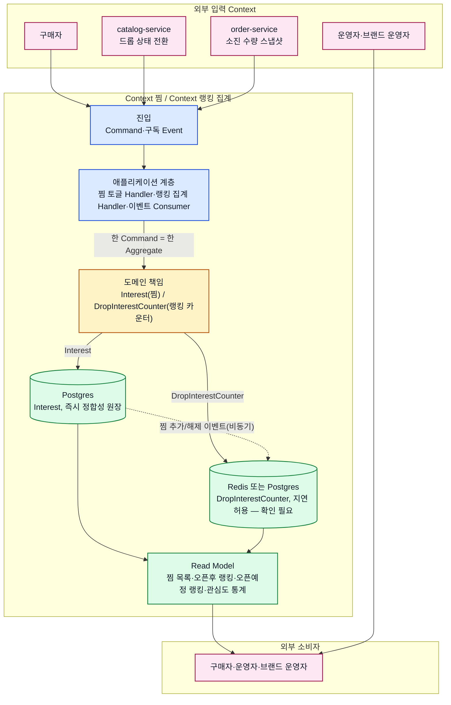

# Context 관심/랭킹 서비스 상세 설계

## 기본 정보

- Service Design ID: `SD.A.07`
- Context: Context 찜, Context 랭킹 집계
- 상태: draft
- 책임: 찜 상태 관리, 조회 신호 집계, 오픈 전/오픈 후 인기 랭킹 산출, 드롭 상태 전환에 따른 랭킹 리스트 전환, 관심도 통계(1차 스코프는 role=operator용(실제 코드 role enum), 브랜드 운영자는 범위 밖 — 2026-07-13 결정, [API.A.07-07](A_07_40-api/api-endpoint-process.md) 참고)를 구현 관점에서 상세화한다.
- 구현 언어: Python(FastAPI) — catalog-service/order-service와 동일 스택(2026-07-13 결정). 첫 구현 범위는 `Interest` Aggregate(API.A.07-01/-02/-03, 찜 추가·해제·목록)만이며, `DropInterestCounter`(랭킹/이벤트 구독 파트)는 catalog-service가 실제로 이벤트를 발행하기 시작한 뒤 다음 단계로 진행한다 — catalog-service는 현재 Kafka 연동이 전혀 없는 최소 스텁 상태임을 확인했다(2026-07-13).

## 기준 결정

- 관심/랭킹 설계 식별자는 `BC.A.07`이다.
- `REQ.A.07`, `UC.A.07`, `BC.A.07`, `SD.A.07`을 현재 interest-service 설계의 기준 문서로 사용한다.
- catalog-service, order-service 코드는 수정하지 않고, 필요한 신호는 이벤트 구독 또는 화면의 직접 API 호출로만 받는다(`RULE.A.07-04`, `REQ.A.07.NFR-002`).
- 찜 상태(즉시 정합성)와 랭킹 카운터(지연 허용)를 서로 다른 Aggregate로 분리한다(`RULE.A.07-03`).

## 연관 태그

- BC 참조: [BC.A.07](../../40-event-storming-bounded-context/BC_A_07_interest_ranking.md)
- 요구사항 참조: [REQ.A.07](../../00-requirements/REQ_A_07_interest_ranking.md)
- UC 참조: [UC.A.07](../../30-uc/UC_A_07_interest_ranking.md)

## 서비스 아키텍처

이 다이어그램은 외부 Context, 애플리케이션 계층, 도메인 책임, 저장소와 최종 소비자의 관계를 요약한다. 세부 규칙은 아래 설계 문서 지도에서 책임별 문서로 확인한다.

- 실선은 업무 요청과 상태·Event 전달을, 점선은 찜 상태 변경이 카운터에 비동기로 반영되는 흐름을 나타낸다.
- `DropInterestCounter`의 저장소(Redis vs Postgres)는 아직 미확정이며 20-persistence 단계의 결정 사항이다.
- 외부 Context(catalog-service, order-service)의 원본은 소유하지 않고 식별자와 판단 시점의 스냅샷만 사용한다(`RULE.A.07-04`).

## 설계 영역

| 영역 | 식별자 | 폴더 | 상태 |
| --- | --- | --- | --- |
| 도메인 모델 | `SD.A.0710` | [A_07_10-domain-model](A_07_10-domain-model/SD_A_0710_interest_domain_model.md) | draft |
| 영속성 | `SD.A.0720` | [A_07_20-persistence](A_07_20-persistence/persistence-design.md) | draft |
| 서비스 | `SD.A.0730` | [A_07_30-service](A_07_30-service/service-design.md) | draft |
| API | `SD.A.0740` | [A_07_40-api](A_07_40-api/README.md) | draft |

## 설계 문서 지도

| 영역 | 하위 문서 |
| --- | --- |
| 도메인 모델 | [Interest·DropInterestCounter 도메인 모델](A_07_10-domain-model/SD_A_0710_interest_domain_model.md) |
| 영속성 | [저장 모델·쓰기전략·읽기전략](A_07_20-persistence/persistence-design.md) |
| 서비스 | [Command Handler·Event Consumer·Worker](A_07_30-service/service-design.md) |
| API | [API 인덱스](A_07_40-api/README.md), [Endpoint 설계 노트](A_07_40-api/api-endpoint-process.md), [OpenAPI](A_07_40-api/openapi/openapi.yaml) |

## 책임 경계

| Context 찜/랭킹 집계가 소유 | 다른 Context에 요청/위임 |
| --- | --- |
| Interest(찜 상태), DropInterestCounter(랭킹 카운터/점수) | 드롭 상태(`SCHEDULED`/`OPEN`)의 원장: Context 드롭 관리(catalog-service) |
| 오픈 전/오픈 후 랭킹 산출 공식과 갱신 | 재고/소진 수량(`total_quantity`, `confirmed_count`)의 원장: Context 주문 확인(order-service) |
| 조회수 dedup, 핫키 완충 | 로그인/인증 판정: Context 인증 |

## 원천과 경계

- 원천: [BC.A.07](../../40-event-storming-bounded-context/BC_A_07_interest_ranking.md), [REQ.A.07](../../00-requirements/REQ_A_07_interest_ranking.md)
- 결정 기록: `HOTSPOT.A.07-01~03`은 아직 미확정이다(핫키 버퍼링 주기/배치 크기, 오픈 후 재계산 주기, dedup 윈도우 실측 검증). A_19처럼 별도 `hotspot-decisions.md`로 확정하는 것은 실 트래픽 실측 이후로 미룬다.
- 도메인·영속성·서비스·API 설계는 모두 `draft`다. HTTP wire 계약은 OpenAPI(`redocly lint` 통과 확인됨), Event 경계는 서비스 설계에서 관리한다.
- catalog-service, order-service 원본은 Context 찜/랭킹 집계 밖에 두고 외부 참조와 스냅샷만 사용한다.
- 관심도 통계 API(`API.A.07-07`)의 권한은 1차 스코프를 `role=operator`로 제한한다(`service` 레포 실제 role enum `CUSTOMER`/`OPERATOR`/`ADMIN` 기준, 2026-07-13 결정, [BC.A.07 후속 설계 메모](../../40-event-storming-bounded-context/BC_A_07_interest_ranking.md) 참고).
- 인증은 archive의 `A_300_auth`가 제안하는 Cookie+CSRF+permission 방식이 아니라 `service` 레포 `contracts/jwt-conventions.md`의 실제 컨벤션을 따른다. Interest 언어를 Python(FastAPI)으로 확정하면서(2026-07-13), catalog-service/order-service 등 Python 서비스의 공식 계약(`contracts/services/*/openapi.yaml`)과 동일하게 `Authorization: Bearer <JWT>`(`BearerAuth`) + Gateway가 검증 후 전달하는 `X-User-Id`/`X-User-Email`/`X-User-Role` 헤더 조합을 쓴다. `X-Principal` 헤더는 Go 서비스(auth/user/coupon/backoffice-service) 전용 내부 컨벤션이라 채택하지 않는다(2026-07-13 발견 및 정정, 2차 수정).

## 추적성 수치

| 유형 | 범위 | 수치 |
| --- | --- | --- |
| Aggregate | `AGG.A.07-01~02` | 2개 |
| Command | `CMD.A.07-01~05` | 5개 |
| Domain Event | `EVT.A.07-01~06` | 6개 |
| Policy | `POLICY.A.07-01~03` | 3개 |
| Read Model | `RM.A.07-01~04` | 4개 |
| HTTP operation | `API.A.07-01~07` | 7개 |

## 현재 확인 필요

- 오픈 전 카운터의 "당일" 기준 시간대(KST 자정 기준 확정 필요).
- `confirmed_count`/`total_quantity`를 캐시로 보관할지, 매번 order-service에 조회할지.
- 핫키 버퍼링 주기/배치 크기, 오픈 후 재계산 주기(`HOTSPOT.A.07-01`, `-02`).
- `DropInterestCounter`의 저장소를 Redis로 할지 Postgres로 할지 (20-persistence에서 결정).
- Event Consumer(오픈전카운터반영/랭킹전환/점수갱신)의 재시도·DLQ 정책이 아직 A_19의 `CouponEventRecovery` 수준으로 설계되지 않았다([SD.A.0730](A_07_30-service/service-design.md) 확인 필요).
- `API.A.07-07`의 경로 접두사 `/operator/...`가 문서 규칙(`contracts/jwt-conventions.md`)과 실제 코드 선례(`backoffice-service`의 `/admin/...`)가 달라 팀 확정이 필요하다.
