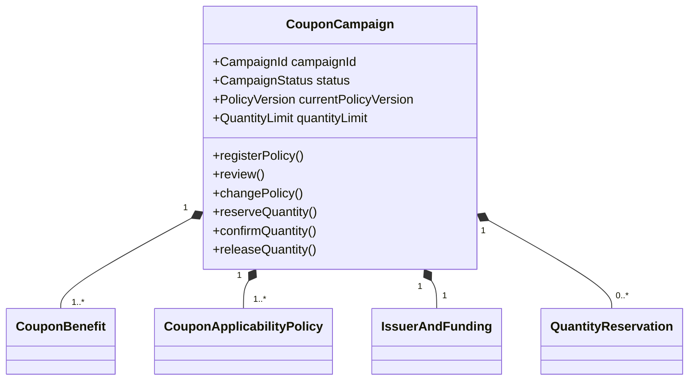
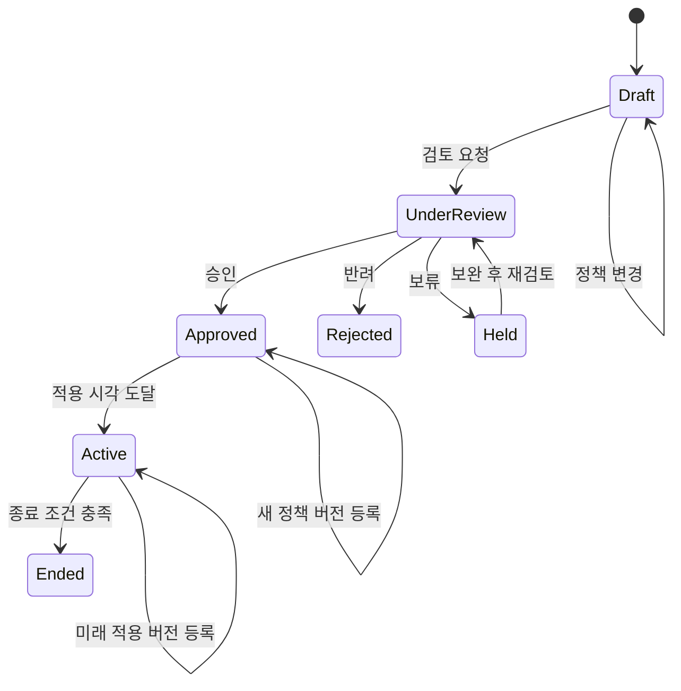

# Context 쿠폰 캠페인과 정책 도메인 모델

## 책임

`CouponCampaign`이 혜택, 적용 정책, 발급 제한, 발급·비용 주체, 승인 상태와 정책 버전을 한 일관성 경계에서 관리하는 방법을 정의한다. 상품·드롭·판매자 원본은 외부에 두고 식별자와 검증 스냅샷만 사용한다.

## 연관 문서

- 원천: [BC.A.19](../../../40-event-storming-bounded-context/BC_A_19_coupon.md), [REQ.A.02](../../../00-requirements/REQ_A_02_coupon_benefit.md)
- 결정: [Context 쿠폰 Hotspot 결정 기록](../hotspot-decisions.md)
- 같은 영역: [발급](issuance.md), [사용](redemption.md), [공통 계약](shared-contracts.md)
- 구현 설계: [쓰기 모델](../A_19_20-persistence/write-models.md), [발급 Handler](../A_19_30-service/issuance-handlers.md)

## Aggregate 구성

| 모델 | 종류 | 책임 |
| --- | --- | --- |
| `CouponCampaign` | Aggregate Root | 캠페인 생명주기, 현재 정책 버전, 총량과 `issue_request_id`별 수량 전이를 보호한다. |
| `CouponBenefit` | Entity | 정액·정률·배송비 혜택과 통화·상한을 정의한다. |
| `CouponApplicabilityPolicy` | Entity | 외부 대상 참조, 포함·제외 조건과 주문 검증 규칙을 버전별로 묶는다. |
| `QuantityReservation` | Entity | 한 발급 요청의 `unreserved → reserved → confirmed/released` 전이를 기록한다. |
| `IssuerAndFunding` | Value Object | 발급 주체, 비용 부담 주체, 승인 근거와 판매자 외부 참조를 묶는다. |
| `QuantityLimit` | Value Object | 총수량, 사용자별 제한, 발급 기간과 종료 조건을 묶는다. |

## 핵심 속성

| 모델 | 속성 | 규칙 |
| --- | --- | --- |
| `CouponCampaign` | `campaign_id`, `status`, `starts_at`, `ends_at`, `current_policy_version`, `version` | `starts_at < ends_at`; 상태와 정책 버전 변경은 낙관적 잠금 대상으로 삼는다. |
| `CouponBenefit` | `benefit_type`, `amount`, `percentage`, `max_discount_amount`, `currency` | 혜택 유형에 맞는 값만 채우며 할인 결과는 0보다 작을 수 없다. |
| `CouponApplicabilityPolicy` | `policy_version`, `target_type`, `target_ref`, `condition_type`, `condition_value`, `effective_from` | `target_ref`는 opaque 외부 참조다. 상품·드롭 원본 속성을 복제하지 않는다. |
| `QuantityReservation` | `issue_request_id`, `quantity`, `state`, `reserved_at`, `decided_at` | 동일 `issue_request_id`에는 하나만 존재하고 확정과 해제는 종단 상태다. |
| `IssuerAndFunding` | `issuer_type`, `issuer_ref`, `funder_type`, `funder_ref`, `approval_policy_snapshot`, `template_ref`, `approval_ref` | 모든 캠페인은 책임 주체와 적용한 위험 정책을 가지며, 정책이 요구할 때 승인 근거를 가진다. |

## 상태와 전이

정책 변경은 기존 레코드를 덮어쓰지 않고 새 `policy_version`과 `effective_from`을 추가한다. 발급된 `UserCoupon`은 발급 당시 `policy_version`을 끝까지 사용하고, 진행 중 예약은 검증 당시 버전을 `DiscountSnapshot`에 고정한다. 새 버전은 새 발급과 새 예약부터 적용하며 긴급 중지는 `CouponOperationalControl`로 분리한다.

## 불변조건

- `AGG.A.19-01`만 캠페인 총량과 수량 예약 원장을 변경한다.
- `reserved_quantity + confirmed_quantity`는 `total_quantity`를 넘지 않는다.
- `issue_request_id`의 수량 상태는 `unreserved → reserved → confirmed` 또는 `unreserved → reserved → released`만 허용한다.
- 같은 전이의 재요청은 이전 결과를 반환한다. `confirmed`와 `released` 사이의 역전이나 교차 전이는 거절한다.
- 승인 대상 캠페인은 승인 전에 노출하거나 발급하지 않는다.
- 판매자 캠페인의 적용 대상은 외부 판매자 소유 스냅샷이 확인한 범위를 벗어날 수 없다.
- 판매자 전액 부담, 판매자 소유 범위와 승인된 템플릿을 모두 만족하는 요청은 판매자 권한으로 제출할 수 있다. 플랫폼·공동 부담, 제휴, 템플릿 초과와 고액·대량 보상은 버전이 있는 운영 정책에 따른 승인이 필요하다.
- Redis 수량 값은 선행 차단에 사용할 수 있지만 Aggregate의 수량 예약 원장을 대신하지 않는다.

## BC 추적

| 유형 | ID | 이 문서의 책임 |
| --- | --- | --- |
| Aggregate | `AGG.A.19-01` | `CouponCampaign` 전체 |
| Command | `CMD.A.19-01`, `CMD.A.19-02`, `CMD.A.19-03`, `CMD.A.19-04` | 등록, 제한 설정, 검토, 정책 변경 |
| Command | `CMD.A.19-26`, `CMD.A.19-27`, `CMD.A.19-28` | 발급 수량 예약, 확정, 해제 |
| Event | `EVT.A.19-01`, `EVT.A.19-02`, `EVT.A.19-03`, `EVT.A.19-04`, `EVT.A.19-05`, `EVT.A.19-06` | 정책·검토 생명주기 |
| Event | `EVT.A.19-32`, `EVT.A.19-33`, `EVT.A.19-34`, `EVT.A.19-35` | 수량 전이 결과 |
| Policy | `POLICY.A.19-01`, `POLICY.A.19-02`, `POLICY.A.19-03`, `POLICY.A.19-07`, `POLICY.A.19-13`, `POLICY.A.19-19` | 책임 주체, 소유 범위, 승인, 버전, 수량 연결 |
| Business Rule | `RULE.A.19-01`, `RULE.A.19-06`, `RULE.A.19-09` | 수량 멱등성, 영속 원장, 단일 Aggregate 변경 |

## 결정 반영

| Hotspot | 영향 |
| --- | --- |
| `HOTSPOT.A.19-04` | 발급 시점과 검증 시점의 정책 버전을 각각 고정하고 긴급 중지를 분리한다. |
| `HOTSPOT.A.19-05` | 부담 주체·소유 범위·템플릿·금액·수량·증빙에 따른 위험 기반 승인을 적용한다. |
| `HOTSPOT.A.19-07` | 판매자에게 소유·부담 캠페인의 비식별 집계와 자기 부담 비용만 제공한다. |
| `HOTSPOT.A.19-08` | 기본 조합과 적용 순서는 버전이 있는 `stackingPolicyRef`에 기록한다. |
