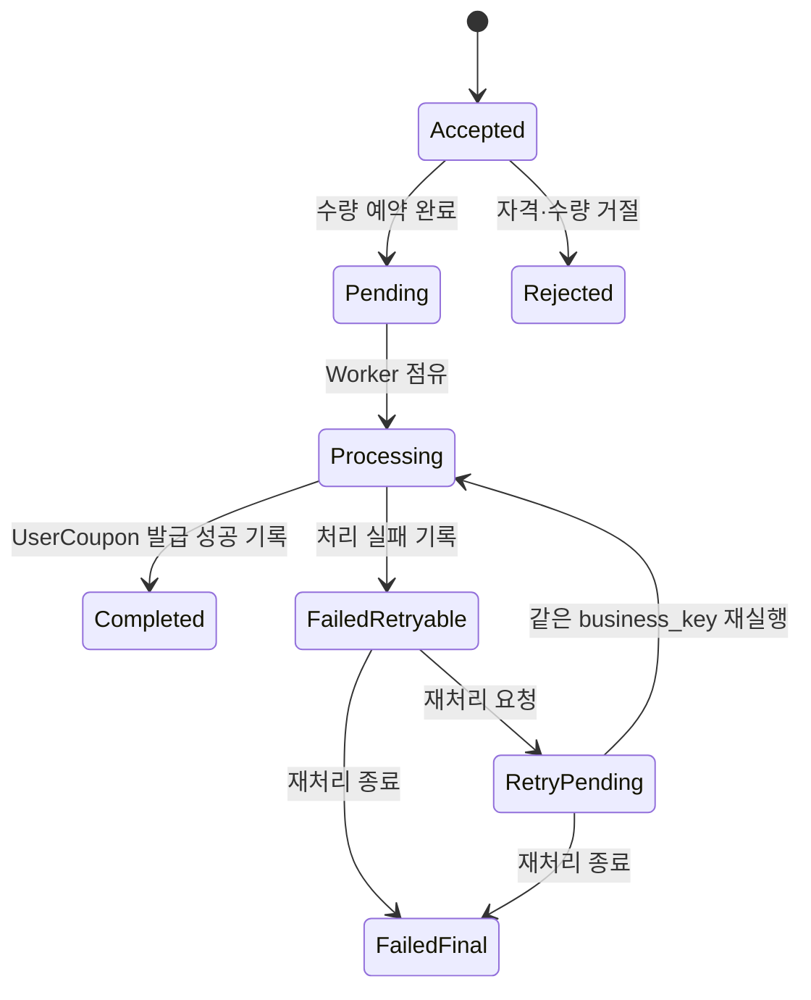

# Context 쿠폰 발급 도메인 모델

## 책임

코드 등록, 직접 수령, 대량·자동·보상 발급을 공통 `CouponIssueRequest`로 수렴시키고 실제 발급 성공 뒤에만 `UserCoupon`을 만드는 규칙을 정의한다. 코드, 발급 요청, 사용자 쿠폰은 서로 다른 Aggregate이므로 한 트랜잭션에서 함께 변경하지 않는다.

## 연관 문서

- 원천: [BC.A.19](../../../40-event-storming-bounded-context/BC_A_19_coupon.md), [REQ.A.02](../../../00-requirements/REQ_A_02_coupon_benefit.md)
- 결정: [Context 쿠폰 Hotspot 결정 기록](../hotspot-decisions.md)
- 도메인: [캠페인과 정책](campaign-policy.md), [운영과 복구](operations-recovery.md), [공통 계약](shared-contracts.md)
- 구현 설계: [쓰기 모델](../A_19_20-persistence/write-models.md), [원장과 신뢰성](../A_19_20-persistence/ledgers-and-reliability.md), [발급 Handler](../A_19_30-service/issuance-handlers.md)

## Aggregate 구성

| Aggregate | 내부 모델 | 소유 책임 |
| --- | --- | --- |
| `CouponCodeBatch` (`AGG.A.19-02`) | `CouponCode` | 코드 묶음, 해시, 예약·등록·해제·폐기 상태 |
| `CouponIssueRequest` (`AGG.A.19-06`) | `IssueSource`, `IssueFailure` | 실제 발급 전 접수·대기·거절·실패·재처리·완료 상태 |
| `UserCoupon` (`AGG.A.19-03`) | `ValidityPeriod`, `GrantSnapshot` | 발급에 성공한 사용자 쿠폰과 발급 이후 상태 |

## 발급 요청

`CouponIssueRequest`는 모든 발급 경로의 기준점이다.

| 속성 | 설명 |
| --- | --- |
| `issue_request_id` | 발급 요청 식별자이자 캠페인 수량 예약 상관키 |
| `business_key` | 같은 업무 요청을 식별하는 고유키 |
| `campaign_id`, `user_id` | 쿠폰 내부 참조와 외부 사용자 식별자 |
| `source_type` | `claim`, `redeem_code`, `bulk`, `system_grant`, `operator_grant` |
| `source_ref` | 코드, 대량 작업, 외부 자동 지급 사건, 운영 작업의 원본 참조 |
| `issuer_and_funding_snapshot` | 발급 주체, 비용 부담 주체, 승인 근거의 불변 스냅샷 |
| `status` | `accepted`, `pending`, `processing`, `failed_retryable`, `retry_pending`, `rejected`, `failed_final`, `completed` |
| `user_coupon_id` | 실제 발급 뒤 연결되는 결과 참조. 완료 전에는 비어 있다. |
| `failure_code`, `retry_count`, `next_attempt_at` | 실패와 재처리 판단 자료 |

사용자 조회에서 `accepted`와 `pending`은 모두 `발급 대기`로 표시하되 운영 기록에서는 접수와 수량 예약 완료를 구분한다. `UserCoupon` 생성과 수량 확정이 모두 끝난 `completed`만 `발급 완료`로 표시한다. `rejected`, 재처리 중 실패와 승인된 최종 실패는 완료로 표시하지 않는다.

## 코드 등록

- 코드 원문은 정규화 후 해시로 비교하며 저장하지 않는다.
- 유효한 코드는 `available → reserved`로 전이하고 `issue_request_id`와 예약 만료 시각을 기록한다.
- `UserCoupon` 발급 성공 Event는 코드 확정 Policy를 거쳐 `reserved → redeemed`로 전이한다.
- 발급 거절 또는 최종 실패 Event는 코드 보상 Policy를 거쳐 `reserved → available`로 해제한다. 만료·폐기된 코드는 복원하지 않는다.
- 같은 코드 예약 Command를 재실행하면 같은 `issue_request_id`의 기존 예약만 성공으로 본다.

## 사용자 쿠폰

| 속성 | 설명 |
| --- | --- |
| `user_coupon_id` | 사용자 쿠폰 식별자 |
| `campaign_id`, `policy_version` | 발급 당시 캠페인과 정책 버전 |
| `user_id` | 사용자·인증 Context의 외부 식별자 |
| `issue_request_id` | 유일한 발급 원본 |
| `grant_snapshot` | 혜택, 적용 범위 표시값, 발급·비용 주체 스냅샷 |
| `usable_from`, `expires_at` | 사용 가능 기간 |
| `status` | `granted`, `expired`, `revoked`; 예약·사용 표시는 Read Model에서 합성 |

`UserCoupon`은 주문 사용 상태를 직접 바꾸지 않는다. 예약·사용 완료 표시는 `CouponRedemption` 사건과 합성하며, 만료와 관리상 회수처럼 발급 이후 자체 생명주기만 소유한다.

## 불변조건

- `UserCoupon` 생성 전의 모든 상태와 실패는 `CouponIssueRequest`가 소유한다.
- `(campaign_id, user_id, business_key)`는 하나의 `CouponIssueRequest`와 하나 이하의 `UserCoupon`만 만든다.
- `CouponIssueRequest.completed`는 존재하는 `user_coupon_id`를 가져야 한다.
- `UserCoupon.issue_request_id`는 유일하며 발급 요청의 사용자·캠페인과 일치해야 한다.
- 코드 확정과 해제는 사용자 쿠폰 발급 결과 Event 뒤의 별도 Command로 수행한다.
- 대량·자동·보상 발급도 직접 `UserCoupon`을 만들지 않고 공통 발급 요청을 거친다.
- 자동 지급은 생일·생년월일을 조건이나 입력으로 받지 않는다. 개인정보 원문이 필요 없는 검증된 원천 사건만 허용하며 생산자 계약이 확정될 때까지 자동 지급 Policy를 활성화하지 않는다.
- 보상 발급은 `caseRef`, 사유와 주문 또는 인시던트 참조를 보존하고 위험 기반 승인 정책의 한도를 적용한다.

## BC 추적

| 유형 | ID | 이 문서의 책임 |
| --- | --- | --- |
| Aggregate | `AGG.A.19-02`, `AGG.A.19-03`, `AGG.A.19-06` | 코드, 사용자 쿠폰, 발급 요청 |
| Command | `CMD.A.19-05`, `CMD.A.19-06`, `CMD.A.19-07` | 직접 수령, 코드 등록, 실제 발급 |
| Command | `CMD.A.19-13`, `CMD.A.19-14`, `CMD.A.19-16`, `CMD.A.19-17` | 공통 요청 생성, 실패 기록, 코드 확정·해제 |
| Command | `CMD.A.19-19`, `CMD.A.19-22`, `CMD.A.19-23`, `CMD.A.19-29`, `CMD.A.19-30` | 재처리, 최종 실패, 완료, 거절, 처리 대기 |
| Event | `EVT.A.19-07`, `EVT.A.19-08`, `EVT.A.19-09`, `EVT.A.19-10`, `EVT.A.19-11` | 발급 요청과 사용자 쿠폰 결과 |
| Event | `EVT.A.19-12`, `EVT.A.19-13`, `EVT.A.19-14`, `EVT.A.19-15` | 코드 검증·확정·해제·거절 |
| Event | `EVT.A.19-29`, `EVT.A.19-36`, `EVT.A.19-37` | 발급 요청 완료·처리 대기·재처리 대기 |
| Policy | `POLICY.A.19-04`, `POLICY.A.19-05`, `POLICY.A.19-09`, `POLICY.A.19-10`, `POLICY.A.19-11` | 자격, 코드, 발급 연결 |
| Policy | `POLICY.A.19-14`, `POLICY.A.19-15`, `POLICY.A.19-19`, `POLICY.A.19-20` | 재처리, 완료, 수량 결과, 처리 대기 |
| Business Rule | `RULE.A.19-02`, `RULE.A.19-08`, `RULE.A.19-09` | 발급 멱등성, 발급 전 상태 소유권, 단일 Aggregate 변경 |

## 결정 반영

- `HOTSPOT.A.19-01`: 접수·대기와 실제 사용자 쿠폰 발급 완료를 구분한다.
- `HOTSPOT.A.19-05`: 보상 발급의 필수 증빙과 위험 기반 승인 정책을 적용한다.
- `HOTSPOT.A.19-09`: 생일·생년월일을 배제하고 필수 사건 envelope를 요구한다. 생산자·Event 유형·채널은 남은 계약 결정이다.
