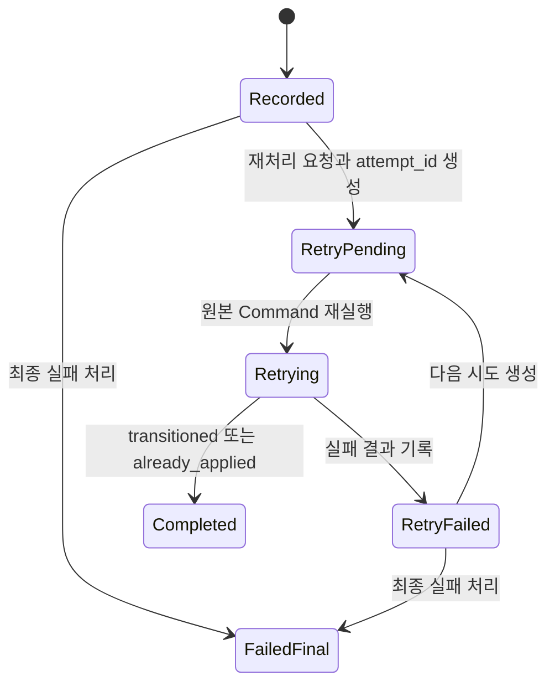

# Context 쿠폰 운영과 복구 도메인 모델

## 책임

대량 발급 작업, 범위별 운영 중지·읽기 전용 안내, 사용자 쿠폰 만료와 실패한 사용 이벤트의 복구 기록을 정의한다. 운영·CS 시스템은 승인과 감사 원본을 소유하고 Context 쿠폰에는 승인된 Command와 외부 참조만 전달한다.

## 연관 문서

- 원천: [BC.A.19](../../../40-event-storming-bounded-context/BC_A_19_coupon.md), [REQ.A.02](../../../00-requirements/REQ_A_02_coupon_benefit.md)
- 결정: [Context 쿠폰 Hotspot 결정 기록](../hotspot-decisions.md)
- 도메인: [발급](issuance.md), [사용](redemption.md), [공통 계약](shared-contracts.md)
- 구현 설계: [원장과 신뢰성](../A_19_20-persistence/ledgers-and-reliability.md), [운영 Worker](../A_19_30-service/operations-workers.md), [이벤트 처리](../A_19_30-service/event-processing.md)

## BulkCouponIssueJob

`BulkCouponIssueJob` (`AGG.A.19-05`)은 대량 발급 대상 기준과 결과 집계만 소유한다. 개별 발급 상태는 각 `CouponIssueRequest`가 소유한다.

| 속성 | 설명 |
| --- | --- |
| `bulk_job_id`, `campaign_id` | 작업과 캠페인 식별자 |
| `audience_definition_ref`, `evaluation_as_of`, `audience_snapshot_ref` | 외부 대상 기준 참조, 평가 기준 시각과 불변 대상 스냅샷 참조 |
| `status` | `registered`, `running`, `completed`, `completed_with_failures`, `failed` |
| `expected_count`, `accepted_count`, `issued_count`, `rejected_count`, `failed_count` | 진행률과 최종 집계 |
| `operation_request_ref`, `approval_ref` | 운영 작업·승인 원본 참조 |

대상별 발급은 `bulk_job_id + target_ref`를 업무 고유키로 사용하는 공통 발급 요청으로 분리한다. 대상은 `evaluation_as_of` 스냅샷으로 고정하고 발급 직전에 차단, 캠페인 종료와 운영 중지만 다시 확인한다. 작업 집계는 발급 성공·거절·승인된 최종 실패 Event만 반영하며 처리 중 실패나 재시도 한도 소진을 최종 결과로 세지 않는다.

## CouponOperationalControl

`CouponOperationalControl` (`AGG.A.19-07`)은 승인된 운영 범위별 제어를 소유한다.

| 모델 | 필드 | 규칙 |
| --- | --- | --- |
| `OperationalScope` | `scope_type`, `scope_ref` | `campaign`, `drop`, `user_group`만 BC가 정한 범위로 사용한다. |
| `StopControl` | `block_issuance`, `block_redemption`, `effective_from`, `active` | 적용 시각 이후의 신규 수량 예약과 신규 사용 예약만 차단한다. |
| `ReadOnlyNotice` | `message`, `effective_from`, `active` | 같은 범위의 조회 안내를 제공하며 알림 채널 전송을 소유하지 않는다. |
| `ApprovalSnapshot` | `operation_request_ref`, `approval_ref`, `reason_code` | 운영 시스템의 원본을 참조하며 내용은 복제하지 않는다. |

중지 전에 확보된 발급 수량과 사용 예약은 완료하거나 기존 보상 Command로 닫는다. 운영 중지를 이유로 처리 중 상태에 무기한 머물게 하지 않는다.

## CouponEventRecovery

`CouponEventRecovery` (`AGG.A.19-08`)는 사용 Command 처리 실패와 재실행 시도를 사용 원장과 분리해 보존한다.

| 속성 | 설명 |
| --- | --- |
| `recovery_id` | 실패 업무 하나의 복구 생명주기 식별자 |
| `original_operation_type`, `original_payload_ref` | 예약·확정·해제·회수 원본 유형과 변경할 수 없는 `payload` 참조 |
| `business_key` | 원본 사용 Command와 같은 업무 고유키 |
| `status` | `recorded`, `retry_pending`, `retrying`, `retry_failed`, `completed`, `failed_final` |
| `attempt_id` | 재실행 시도마다 새로 발급하는 식별자 |
| `attempt_count`, `next_attempt_at` | 재처리 횟수와 다음 처리 시각 |
| `result_kind`, `result_ref` | `transitioned`, `already_applied`, `failed` 판정과 결과 참조 |
| `failure_code` | 현재 시도의 실패 사유 |

재실행 결과는 `recovery_id`, 현재 `attempt_id`, `business_key`가 모두 일치할 때만 반영한다. `already_applied`이면 기존 `result_ref`를 재사용하고 `CouponRedemption` 상태를 다시 변경하지 않는다.

재시도는 버전이 있는 운영 설정의 최대 횟수·기본 간격·상한·지수 백오프를 따른다. 한도를 소진하면 자동으로 `failed_final`로 바꾸지 않고 운영 확인 상태에 둔다. `CouponIssueRequest`는 승인된 `CMD.A.19-22`, `CouponEventRecovery`는 승인된 `CMD.A.19-25`로만 최종 실패를 확정한다.

## 만료

만료 스케줄 입력은 `UserCoupon` 식별자와 기준 시각만 전달한다. `CMD.A.19-24`는 사용 가능 상태이거나 활성 사용 예약과 연결된 사용자 쿠폰만 만료시키며 사용 완료·회수 결과를 덮어쓰지 않는다. 활성 사용 예약 해제는 `EVT.A.19-31` 뒤 `POLICY.A.19-18`이 별도 `CMD.A.19-12`를 요청한다.

## BC 추적

| 유형 | ID | 이 문서의 책임 |
| --- | --- | --- |
| Aggregate | `AGG.A.19-05`, `AGG.A.19-07`, `AGG.A.19-08` | 대량 작업, 운영 제어, 사용 이벤트 복구 |
| Command | `CMD.A.19-08`, `CMD.A.19-18`, `CMD.A.19-20`, `CMD.A.19-21`, `CMD.A.19-24`, `CMD.A.19-25`, `CMD.A.19-31`, `CMD.A.19-32`, `CMD.A.19-33`, `CMD.A.19-34` | 대량·중지·안내·만료·복구 처리 |
| Event | `EVT.A.19-16`, `EVT.A.19-17`, `EVT.A.19-18` | 대량 작업 결과 |
| Event | `EVT.A.19-25`, `EVT.A.19-26`, `EVT.A.19-27`, `EVT.A.19-30`, `EVT.A.19-31`, `EVT.A.19-38`, `EVT.A.19-39`, `EVT.A.19-40`, `EVT.A.19-41` | 운영 제어, 만료, 복구 생명주기 |
| Policy | `POLICY.A.19-08`, `POLICY.A.19-12`, `POLICY.A.19-16`, `POLICY.A.19-17`, `POLICY.A.19-18`, `POLICY.A.19-21`, `POLICY.A.19-22` | 중지, 대량 집계, 자동 지급, 만료, 복구 연결 |
| Business Rule | `RULE.A.19-05`, `RULE.A.19-06`, `RULE.A.19-09`, `RULE.A.19-12` | 재처리 멱등성, 영속 원장, 단일 Aggregate, 만료 보호 |

## 결정 반영

- `HOTSPOT.A.19-03`: 확정 실패·취소는 즉시 해제하고 결과가 불명확할 때만 짧은 유예를 적용한다.
- `HOTSPOT.A.19-05`: 운영·CS 보상은 필수 증빙과 위험 기반 승인 정책을 따른다.
- `HOTSPOT.A.19-06`: 대량 대상 스냅샷, 직전 재검증, 설정 기반 지수 백오프와 승인된 최종 실패를 적용한다.
- `HOTSPOT.A.19-09`: 자동 지급의 개인정보 원칙과 필수 envelope를 적용하되 생산자 계약은 남은 결정으로 둔다.
