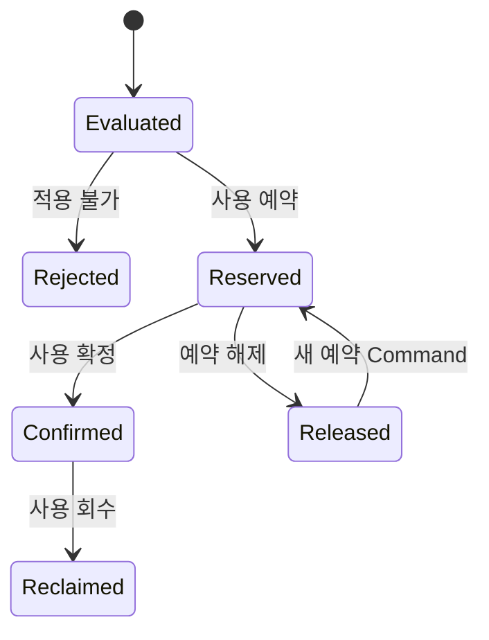

# Context 쿠폰 사용 도메인 모델

## 책임

`CouponRedemption`이 주문 스냅샷에 대한 적용 가능성 판단, 사용 예약·확정·해제·회수와 비용 귀속을 한 사용 원장으로 관리하는 방법을 정의한다. 주문·결제와 정산 원본 상태는 소유하지 않는다.

## 연관 문서

- 원천: [BC.A.19](../../../40-event-storming-bounded-context/BC_A_19_coupon.md), [REQ.A.02](../../../00-requirements/REQ_A_02_coupon_benefit.md)
- 도메인: [캠페인과 정책](campaign-policy.md), [발급](issuance.md), [공통 계약](shared-contracts.md)
- 구현 설계: [쓰기 모델](../A_19_20-persistence/write-models.md), [사용 Handler](../A_19_30-service/redemption-handlers.md)

## Aggregate 구성

| 모델 | 종류 | 책임 |
| --- | --- | --- |
| `CouponRedemption` | Aggregate Root (`AGG.A.19-04`) | 한 사용자 쿠폰과 주문의 검증·예약·확정·해제·회수 상태를 보호한다. |
| `OrderSnapshot` | Value Object | 주문·결제 Context가 제공한 상품, 드롭, 판매자, 금액, 사용자 자격과 기준 시각을 보존한다. |
| `DiscountSnapshot` | Value Object | 정책 버전, 할인 전후 금액, 통화, 계산 항목과 적용·거절 사유를 보존한다. |
| `CostAttribution` | Value Object | 플랫폼·판매자·공동 부담·보상 비용과 승인·정산 참조를 보존한다. |
| `RedemptionResultRef` | Value Object | 멱등 재실행이 반환할 기존 결과 Event 또는 원장 식별자를 묶는다. |

## 상태 전이

- 적용 가능 확인은 할인 계산 결과를 만들지만 쿠폰을 점유하지 않는다.
- 예약은 사용자 쿠폰 하나를 주문 하나에 점유한다.
- 확정 전 실패·취소·만료는 `release`, 확정 뒤 취소·환불은 `reclaim`으로 구분한다.
- 회수 뒤 재사용 허용 여부는 `HOTSPOT.A.19-03`이므로 이 문서에서 역전이를 확정하지 않는다.
- 사용 확정의 외부 기준 사건은 `HOTSPOT.A.19-02`가 닫힐 때까지 호출자가 제공한 합의된 계약 이름과 원본 참조를 보존한다.

## 주문 스냅샷 검증

검증 입력은 `order_id`, `user_id`, 상품별 가격·수량, 배송비, 판매자·상품·드롭·카테고리 외부 참조, 사용자 자격, 평가 시각을 포함한다. Context 쿠폰은 다음만 수행한다.

1. `UserCoupon`의 소유 사용자, 사용 기간과 자체 상태를 확인한다.
2. 저장된 `policy_version`과 외부 참조를 주문 스냅샷에 대조한다.
3. 중복 적용 조합은 합의된 정책 식별자를 입력받아 검증한다.
4. 할인 금액과 비용 귀속 스냅샷을 서버에서 계산한다.
5. 상품·드롭의 존재나 주문 금액 원본을 수정하지 않는다.

## 불변조건

- 하나의 `UserCoupon`에는 활성 `reserved` 사용 원장이 최대 하나다.
- `(order_id, user_coupon_id, operation_type, business_key)`의 같은 작업은 한 번만 반영한다.
- `confirmed`가 아닌 사용은 회수할 수 없고, `reserved`가 아닌 사용은 해제할 수 없다.
- 할인 금액은 0 이상이며 주문 할인 대상 금액을 넘지 않는다.
- 비용 귀속 합계는 할인 금액과 같아야 한다.
- 사용 Command는 `CouponRedemption`만 변경한다. 쿠폰함 표시와 정산 전달은 Event 투영으로 처리한다.

## BC 추적

| 유형 | ID | 이 문서의 책임 |
| --- | --- | --- |
| Aggregate | `AGG.A.19-04` | `CouponRedemption` |
| Command | `CMD.A.19-09`, `CMD.A.19-10`, `CMD.A.19-11`, `CMD.A.19-12`, `CMD.A.19-15` | 검증, 예약, 확정, 해제, 회수 |
| Event | `EVT.A.19-19`, `EVT.A.19-20`, `EVT.A.19-21`, `EVT.A.19-22`, `EVT.A.19-23`, `EVT.A.19-24`, `EVT.A.19-28` | 적용·사용 결과와 비용 귀속 |
| Policy | `POLICY.A.19-06`, `POLICY.A.19-08` | 주문 스냅샷 검증과 운영 중지 우선 |
| Business Rule | `RULE.A.19-03`, `RULE.A.19-04`, `RULE.A.19-07`, `RULE.A.19-10`, `RULE.A.19-11` | 활성 주문, 멱등성, 비용, 표시 합성, 전이 구분 |

## 연결 Hotspot

| Hotspot | 영향 |
| --- | --- |
| `HOTSPOT.A.19-02` | 주문 생성·결제 승인·결제 확정 가운데 사용 확정 기준 |
| `HOTSPOT.A.19-03` | 예약 해제 유예와 회수 뒤 재사용 기준 |
| `HOTSPOT.A.19-08` | 드롭·판매자·플랫폼·회원·배송비 쿠폰 조합 |
