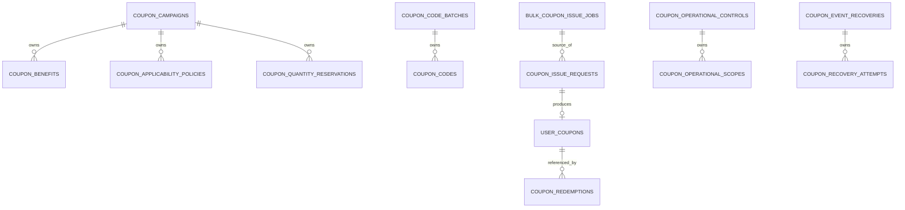

# Context 쿠폰 쓰기 모델 설계

## 책임

8개 Aggregate의 Postgres 저장 모델, Aggregate 매핑과 핵심 제약을 정의한다. append-only 원장, outbox/inbox와 복구 시도 기록은 [원장과 신뢰성](ledgers-and-reliability.md)에서 다룬다.

## 연관 문서

- 원천: [BC.A.19](../../../40-event-storming-bounded-context/BC_A_19_coupon.md), [REQ.A.02](../../../00-requirements/REQ_A_02_coupon_benefit.md)
- 도메인: [캠페인과 정책](../A_19_10-domain-model/campaign-policy.md), [발급](../A_19_10-domain-model/issuance.md), [사용](../A_19_10-domain-model/redemption.md), [운영과 복구](../A_19_10-domain-model/operations-recovery.md)
- 서비스: [발급 Handler](../A_19_30-service/issuance-handlers.md), [사용 Handler](../A_19_30-service/redemption-handlers.md)

## 저장 원칙

- Aggregate Root는 `id`, `version`, `created_at`, `updated_at`을 가진다. 갱신은 `WHERE id = ? AND version = ?` 조건으로 수행한다.
- Entity 테이블은 소유 Aggregate의 식별자를 외래 키로 가지며 다른 Aggregate로의 Postgres 외래 키는 만들지 않는다.
- 외부 `user_id`, `seller_ref`, `product_ref`, `drop_ref`, `order_id`, `approval_ref`, `settlement_ref`는 문자열 참조다.
- 상태 값은 도메인 문서의 닫힌 집합만 허용하도록 `CHECK` 또는 enum type으로 제한한다.
- 삭제 대신 종단 상태와 보존 정책을 사용한다.

## Aggregate와 테이블

| Aggregate | 주 테이블 | 소유 보조 테이블 |
| --- | --- | --- |
| `CouponCampaign` | `coupon_campaigns` | `coupon_benefits`, `coupon_applicability_policies`, `coupon_quantity_reservations` |
| `CouponCodeBatch` | `coupon_code_batches` | `coupon_codes` |
| `UserCoupon` | `user_coupons` | 없음 |
| `CouponRedemption` | `coupon_redemptions` | 없음 |
| `BulkCouponIssueJob` | `bulk_coupon_issue_jobs` | 없음 |
| `CouponIssueRequest` | `coupon_issue_requests` | 없음 |
| `CouponOperationalControl` | `coupon_operational_controls` | `coupon_operational_scopes` |
| `CouponEventRecovery` | `coupon_event_recoveries` | `coupon_recovery_attempts` |

## Campaign 저장 모델

| 테이블 | 핵심 열 | 제약 |
| --- | --- | --- |
| `coupon_campaigns` | `campaign_id`, `status`, `starts_at`, `ends_at`, `current_policy_version`, `total_quantity`, `reserved_quantity`, `confirmed_quantity`, `issuer_type/ref`, `funder_type/ref`, `approval_ref`, `version` | `starts_at < ends_at`; 수량은 0 이상; `reserved_quantity + confirmed_quantity <= total_quantity` |
| `coupon_benefits` | `benefit_id`, `campaign_id`, `policy_version`, `benefit_type`, `amount`, `percentage`, `max_discount_amount`, `currency` | `(campaign_id, policy_version, benefit_id)` unique; 혜택 유형별 필수값 check |
| `coupon_applicability_policies` | `policy_id`, `campaign_id`, `policy_version`, `target_type`, `target_ref`, `condition_type`, `condition_value`, `effective_from`, `snapshot_label` | `(campaign_id, policy_version, policy_id)` unique; JSON schema version 필수 |

`CouponCampaign` 저장 시 Root와 같은 정책 버전의 혜택·적용 정책을 한 트랜잭션에서 기록한다. 발급 수량 전이는 캠페인 Root와 예약 행만 같은 트랜잭션에서 바꾸며 다른 Aggregate를 갱신하지 않는다.

## Code 저장 모델

| 테이블 | 핵심 열 | 제약 |
| --- | --- | --- |
| `coupon_code_batches` | `code_batch_id`, `campaign_id`, `status`, `format`, `quantity`, `created_count`, `distribution_channel`, `creator_ref`, `version` | 수량은 0 이상 |
| `coupon_codes` | `code_id`, `code_batch_id`, `campaign_id`, `code_hash`, `code_suffix`, `status`, `reserved_issue_request_id`, `reserved_until`, `redeemed_user_coupon_id`, `redeemed_at` | `code_hash` unique; `reserved` 상태의 예약 참조 필수; `redeemed` 상태의 결과 참조 필수 |

코드 원문은 저장하지 않는다. 해시 알고리즘 버전과 정규화 버전을 별도 열로 두어 이후 비교 규칙 변경을 지원한다.

## IssueRequest와 UserCoupon 저장 모델

| 테이블 | 핵심 열 | 제약 |
| --- | --- | --- |
| `coupon_issue_requests` | `issue_request_id`, `campaign_id`, `user_id`, `business_key`, `source_type`, `source_ref`, `status`, `user_coupon_id`, `failure_code`, `retry_count`, `next_attempt_at`, 발급·비용·승인 스냅샷, `version` | `(campaign_id, user_id, business_key)` unique; `completed`면 `user_coupon_id` 필수 |
| `user_coupons` | `user_coupon_id`, `campaign_id`, `policy_version`, `user_id`, `issue_request_id`, `status`, `usable_from`, `expires_at`, `grant_snapshot`, `version` | `issue_request_id` unique; `usable_from < expires_at`; 사용자·캠페인은 원본 요청과 일치 |

`coupon_issue_requests.user_coupon_id`는 다른 Aggregate 결과 참조이므로 Postgres 외래 키를 강제하지 않는다. Event와 Policy가 발급 성공을 원본 요청에 기록하며, 조회 검증 작업이 양쪽 참조의 불일치를 감지한다.

## Redemption 저장 모델

| 열 | 설명 | 제약 |
| --- | --- | --- |
| `redemption_id` | 사용 Aggregate 식별자 | primary key |
| `user_coupon_id`, `campaign_id`, `user_id`, `order_id` | 쿠폰 내부 참조와 외부 주문 참조 | null 불가 |
| `business_key` | 주문 사용 업무 고유키 | 작업 종류와 함께 unique |
| `status` | `evaluated`, `rejected`, `reserved`, `confirmed`, `released`, `reclaimed` | 닫힌 값 check |
| `policy_version`, `order_snapshot`, `order_snapshot_hash`, `evaluated_at` | 검증 근거 | 예약 이상 상태에서 필수 |
| `discount_amount`, `currency`, `cost_attribution` | 할인·비용 귀속 | 금액 0 이상; 귀속 합계 일치 |
| `reserved_until`, `confirmed_at`, `released_at`, `reclaimed_at` | 전이 시각 | 상태별 필수값 check |
| `result_ref`, `version` | 멱등 결과와 낙관적 잠금 | null 불가 |

활성 예약의 유일성은 [조회 모델과 인덱스](read-models-and-indexes.md)의 partial unique index로 방어한다.

## 운영 Aggregate 저장 모델

| 테이블 | 핵심 열 | 제약 |
| --- | --- | --- |
| `bulk_coupon_issue_jobs` | `bulk_job_id`, `campaign_id`, `audience_definition_ref`, `as_of`, `status`, 결과 카운터, `operation_request_ref`, `approval_ref`, `version` | 각 카운터 0 이상; 최종 합계 검증 |
| `coupon_operational_controls` | `control_id`, `active`, `effective_from`, `block_issuance`, `block_redemption`, `notice_message`, `operation_request_ref`, `approval_ref`, `reason_code`, `version` | 중지 또는 안내 중 하나 이상 설정 |
| `coupon_operational_scopes` | `control_id`, `scope_type`, `scope_ref` | `(control_id, scope_type, scope_ref)` unique |
| `coupon_event_recoveries` | `recovery_id`, `original_operation_type`, `original_payload_ref`, `business_key`, `status`, `current_attempt_id`, `attempt_count`, `next_attempt_at`, `result_kind`, `result_ref`, `failure_code`, `version` | `recovery_id + business_key` 불변; 완료 상태면 결과 참조 필수 |
| `coupon_recovery_attempts` | `recovery_id`, `attempt_id`, `business_key`, `status`, `started_at`, `finished_at`, `result_kind`, `result_ref`, `failure_code` | `(recovery_id, attempt_id, business_key)` unique |

## Repository 경계

| Repository | Aggregate 단위 작업 |
| --- | --- |
| `CouponCampaignRepository` | 정책 버전 저장, 수량 예약·확정·해제 조건부 갱신 |
| `CouponCodeBatchRepository` | 코드 해시 조회, 예약·확정·해제 조건부 갱신 |
| `CouponIssueRequestRepository` | 접수, 처리 점유, 실패·재처리·완료 상태 전이 |
| `UserCouponRepository` | 발급 생성, 만료 조건부 갱신 |
| `CouponRedemptionRepository` | 검증 결과 저장, 예약·확정·해제·회수 조건부 갱신 |
| `BulkCouponIssueJobRepository` | 작업 등록과 최종 결과 집계 |
| `CouponOperationalControlRepository` | 현재 시각에 유효한 범위별 제어 저장·조회 |
| `CouponEventRecoveryRepository` | 실패 기록, 시도 생성, 상관키가 일치하는 결과 반영 |
