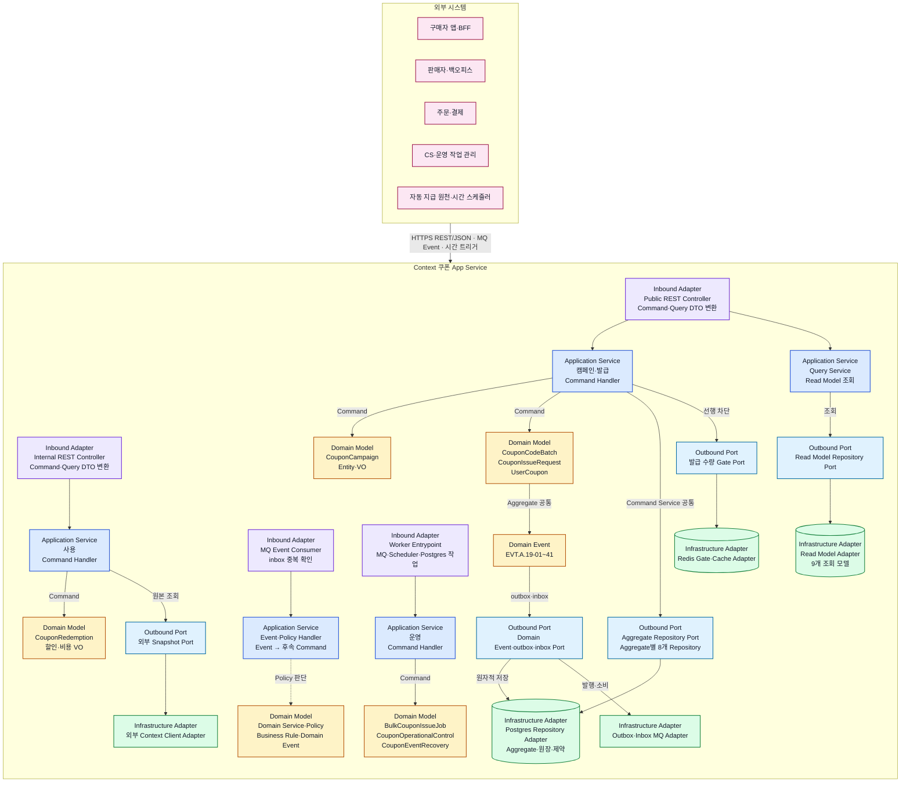
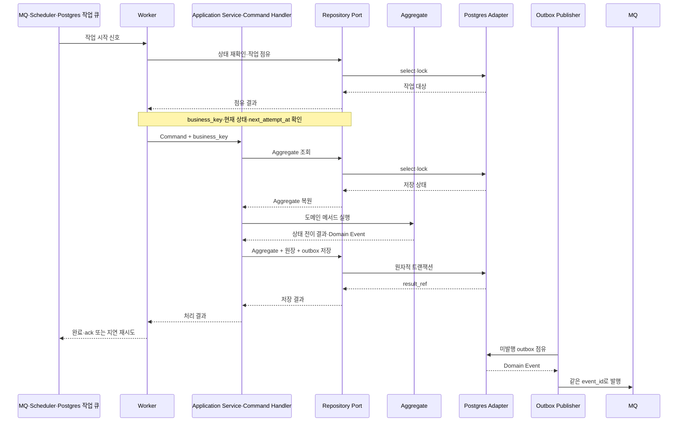

# Context 쿠폰 서비스 설계 인덱스

## 역할

Context 쿠폰의 34개 Command Handler, Worker, Event·Policy 처리와 외부 포트를 책임별 문서로 안내한다. Handler 절차와 트랜잭션 경계는 하위 문서에서만 관리한다.

## 원천

- [BC.A.19 Context 쿠폰](../../../40-event-storming-bounded-context/BC_A_19_coupon.md)
- [REQ.A.02 쿠폰 및 혜택](../../../00-requirements/REQ_A_02_coupon_benefit.md)
- [SD.A.1910 도메인 모델](../A_19_10-domain-model/README.md)
- [SD.A.1920 영속성](../A_19_20-persistence/README.md)
- [SD.A.1940 API 설계](../A_19_40-api/README.md)

## 서비스 아키텍처

이 다이어그램은 코드나 패키지 구성이 아니라 현재 서비스 설계 문서에서 정의한 통신 경계, Handler·Policy·Worker 책임, 8개 Aggregate와 상태 저장 방식을 나타낸다. 외부 시스템과 App Service만 경계로 묶고, App Service 내부의 계층은 별도 영역으로 나누지 않고 각 구성요소의 역할과 색상으로 구분한다. 선이 겹치지 않도록 외부 통신과 공통 의존 관계는 각각 대표 연결 하나로 나타내며, 구성요소별 전체 책임은 아래 프로토콜 상태, 설계 책임 지도와 Worker 표에서 확인한다. REST 엔드포인트와 메시지 `payload` 계약은 [SD.A.1940](../A_19_40-api/README.md)에서 별도로 구체화한다.

### 프로토콜 상태

| 구간 | 설계상 통신 방식 | 책임 | 결정 상태 |
| --- | --- | --- | --- |
| 구매자 앱·BFF → Context 쿠폰 | Public HTTPS REST/JSON | 쿠폰 수령, 코드 등록, 쿠폰함·상세 조회 | [SD.A.1940](../A_19_40-api/README.md) OpenAPI draft |
| 판매자·백오피스 → Context 쿠폰 | Internal HTTPS REST/JSON | 캠페인·혜택·적용 정책·대량 작업 | [SD.A.1940](../A_19_40-api/README.md) OpenAPI draft |
| 주문·결제 → Context 쿠폰 | Internal REST/JSON Command + MQ Event | 적용 검증, 예약·확정·해제·회수 | HTTP draft 작성, 외부 Event 유형은 Hotspot 경계 |
| 운영 작업 관리 → Context 쿠폰 | Internal REST/JSON Command + MQ 결과 Event | 승인된 중지·안내·재처리·최종 실패 | HTTP draft 작성, 결과 Event는 공통 계약 적용 |
| Context 쿠폰 내부·외부 Event | MQ + outbox/inbox | 후속 Policy, 정산·알림·운영 결과 전달 | [Event 계약](../A_19_40-api/event-contracts.md), 브로커 종류 미확정 |
| 시간 스케줄러 → Worker | 시간 트리거 + Postgres 대상 조회 | 만료, 대량 작업, 복구 재실행 | 서비스 설계 확정 |
| 서비스 간 gRPC | 정의 없음 | 현재 설계 문서에 gRPC 호출 계약이 없음 | 채택하지 않음 |

### DDD 계층 규칙

- 도메인별 패키지는 수직 책임 경계다. `campaign`, `issuance`, `redemption`, `operations`마다 필요한 Controller·Application Service·Domain Model·Repository Port를 가진다.
- REST Controller, gRPC Controller, MQ Consumer와 Worker는 모두 Inbound Adapter다. 프로토콜과 실행 방식은 달라도 같은 Application Service와 Command Handler를 호출한다.
- Application Service는 유스케이스 조정, 멱등 확인과 트랜잭션 경계를 담당한다. 할인 계산과 상태 전이 규칙을 직접 구현하지 않는다.
- Aggregate·Entity·Value Object와 Domain Service는 불변조건을 검사하고 상태를 바꾼 뒤 Domain Event를 반환한다.
- Repository Port는 Application·Domain 쪽 인터페이스다. Postgres Repository Adapter가 이를 구현하며 Domain 계층은 Postgres, Redis, MQ를 참조하지 않는다.
- Handler는 Aggregate, 원장과 outbox를 같은 트랜잭션에 저장한다. 다른 Aggregate의 변경은 Event·Policy가 새 Command로 요청한다.

### 설계 책임 지도

| 도메인 책임 | Inbound Adapter | Application 책임 | Domain 객체 | Repository Port |
| --- | --- | --- | --- | --- |
| Campaign | 캠페인·정책 Internal REST Controller | 정책 등록, 수량 설정, 승인, 정책 변경 Handler | `CouponCampaign`, `CouponBenefit`, `CouponApplicabilityPolicy` | `CouponCampaignRepository` |
| Issuance | 수령·코드 Public REST Controller, 발급 Event Consumer, 발급 Worker | 수령, 코드 예약, 발급 요청, 사용자 쿠폰 생성·완료·실패 Handler | `CouponCodeBatch`, `CouponIssueRequest`, `UserCoupon` | `CouponCodeBatchRepository`, `CouponIssueRequestRepository`, `UserCouponRepository` |
| Redemption | 주문 Internal REST Controller, 주문 Event Consumer, 사용 복구 Worker | 적용 검증, 예약, 확정, 해제, 회수 Handler | `CouponRedemption`, `OrderSnapshot`, `DiscountSnapshot`, `CostAttribution` | `CouponRedemptionRepository` |
| Operations | 운영 Internal REST Controller, Scheduler, 대량·만료·복구 Worker | 대량 작업, 중지·안내, 만료, 재처리·최종 실패 Handler | `BulkCouponIssueJob`, `CouponOperationalControl`, `CouponEventRecovery` | `BulkCouponIssueJobRepository`, `CouponOperationalControlRepository`, `CouponEventRecoveryRepository` |
| Query·Projection | Public·Internal Query Controller, MQ Projection Consumer | 쿠폰함·성과·실패·타임라인·비용·안내 조회와 Event 투영 | 9개 Read Model | Read Model별 Query Repository |
| Event Policy | MQ Event Consumer | 22개 Policy로 Event를 다음 Command로 변환 | Domain Event, Policy, Business Rule | inbox, outbox와 외부 Snapshot Port |

## Worker 실행 구조

Worker는 MQ 메시지나 시간 트리거를 작업 시작 신호로 사용한다. 실제 대상과 현재 상태는 Postgres에서 다시 확인하고, 같은 업무 고유키의 Command Handler를 실행한다. Aggregate·원장·outbox 저장이 성공한 뒤에만 작업을 완료하거나 메시지를 확인 처리한다.

| Worker | 시작 조건 | Postgres 기준 상태 | 실행하는 Command·작업 |
| --- | --- | --- | --- |
| 발급 Worker | `EVT.A.19-36`, `EVT.A.19-37` 전달 | `CouponIssueRequest.pending/retry_pending` | `CMD.A.19-07` 사용자 쿠폰 발급 |
| 대량 발급 Worker | 대량 작업 등록 Event 또는 주기 조회 | `BulkCouponIssueJob.registered/running` | 대상별 `CMD.A.19-13`, 결과별 `CMD.A.19-18` |
| 만료 Worker | 만료 Scheduler | `UserCoupon.expires_at <= now` | `CMD.A.19-24`, 필요 시 Policy가 `CMD.A.19-12` 요청 |
| 사용 복구 Worker | `EVT.A.19-39` 또는 재처리 시각 도달 | `CouponEventRecovery.retry_pending` | `CMD.A.19-32` 재실행 후 `CMD.A.19-33` 결과 기록 |
| outbox 발행기 | 미발행 outbox 주기 조회 | `domain_outbox.publish_status=pending` | 같은 `event_id`로 MQ 발행 |
| 투영·Policy 소비자 | MQ Domain Event | inbox에 없는 `(consumer_name, event_id)` | Read Model 투영 또는 Policy의 후속 Command 요청 |

- 여러 Worker가 같은 테이블을 읽을 때 `FOR UPDATE SKIP LOCKED`와 같은 방식으로 작업을 나눈다.
- MQ 전달은 최소 한 번을 전제로 하며 inbox와 업무 고유키로 중복 반영을 막는다.
- Worker가 실패해도 Redis·MQ 상태를 최종 결과로 보지 않는다. Postgres 원장과 `result_ref`를 기준으로 재개한다.

## 하위 문서

| 문서 | 책임 | Command | 상태 |
| --- | --- | --- | --- |
| [발급 Handler](issuance-handlers.md) | 정책, 수령, 코드, 공통 발급, 수량, 실패·완료 처리 | `CMD.A.19-01~07`, `13~14`, `16~17`, `19`, `22~23`, `26~30` | draft |
| [사용 Handler](redemption-handlers.md) | 주문 검증, 예약·확정·해제·회수, 비용 귀속 | `CMD.A.19-09~12`, `15` | draft |
| [운영 Worker](operations-workers.md) | 대량 발급, 중지·안내, 만료, 발급·사용 복구 | `CMD.A.19-08`, `18`, `20~21`, `24~25`, `31~34` | draft |
| [이벤트 처리](event-processing.md) | 22개 Policy, Event Handler, 외부 포트, outbox/inbox, 재시도·관측 | 전체 Event·Policy | draft |

## 결정 경계

- Handler 하나는 Aggregate 하나만 변경하고 원장·outbox를 같은 트랜잭션에 기록한다.
- 다른 Aggregate의 변경은 Event와 Policy가 새 Command로 요청한다.
- 외부 원본 조회 실패를 성공으로 오인할 기본값으로 바꾸지 않는다.
- Worker 재시도는 업무 멱등키와 현재 상태를 확인한 뒤 수행한다.
- REST/OpenAPI, HTTP 요청·응답·오류 계약은 이 영역의 범위가 아니다.
