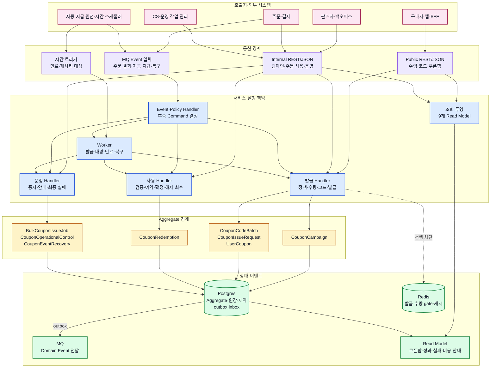
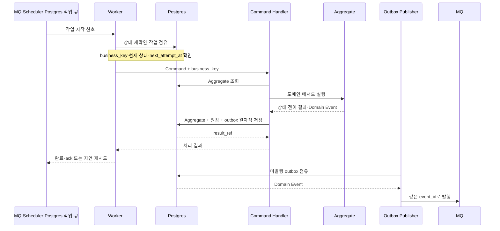

# Context 쿠폰 서비스 설계 인덱스

## 역할

Context 쿠폰의 34개 Command Handler, Worker, Event·Policy 처리와 외부 포트를 책임별 문서로 안내한다. Handler 절차와 트랜잭션 경계는 하위 문서에서만 관리한다.

## 원천

- [BC.A.19 Context 쿠폰](../../../40-event-storming-bounded-context/BC_A_19_coupon.md)
- [REQ.A.02 쿠폰 및 혜택](../../../00-requirements/REQ_A_02_coupon_benefit.md)
- [SD.A.1910 도메인 모델](../A_19_10-domain-model/README.md)
- [SD.A.1920 영속성](../A_19_20-persistence/README.md)
- [SD.A.1940 API 설계](../A_19_40-api/README.md)

## 서비스 아키텍처

이 다이어그램은 코드나 패키지 구성이 아니라 현재 서비스 설계 문서에서 정의한 통신 경계, Handler·Policy·Worker 책임, 8개 Aggregate와 상태 저장 방식을 나타낸다. REST 엔드포인트와 메시지 `payload` 계약은 [SD.A.1940](../A_19_40-api/README.md)에서 별도로 구체화한다.

### 프로토콜 상태

| 구간 | 설계상 통신 방식 | 책임 | 결정 상태 |
| --- | --- | --- | --- |
| 구매자 앱·BFF → Context 쿠폰 | Public HTTPS REST/JSON | 쿠폰 수령, 코드 등록, 쿠폰함·상세 조회 | [SD.A.1940](../A_19_40-api/README.md)에서 계약 예정 |
| 판매자·백오피스 → Context 쿠폰 | Internal HTTPS REST/JSON | 캠페인·혜택·적용 정책·코드·대량 작업 | [SD.A.1940](../A_19_40-api/README.md)에서 계약 예정 |
| 주문·결제 → Context 쿠폰 | Internal REST/JSON Command + MQ Event | 적용 검증, 예약·확정·해제·회수 | 동기·비동기 책임만 확정, 상세 계약 예정 |
| 운영 작업 관리 → Context 쿠폰 | Internal REST/JSON Command + MQ 결과 Event | 승인된 중지·안내·재처리·최종 실패 | 동기·비동기 책임만 확정, 상세 계약 예정 |
| Context 쿠폰 내부·외부 Event | MQ + outbox/inbox | 후속 Policy, 정산·알림·운영 결과 전달 | MQ 역할 확정, 브로커 종류 미확정 |
| 시간 스케줄러 → Worker | 시간 트리거 + Postgres 대상 조회 | 만료, 대량 작업, 복구 재실행 | 서비스 설계 확정 |
| 서비스 간 gRPC | 정의 없음 | 현재 설계 문서에 gRPC 호출 계약이 없음 | 채택하지 않음 |

### 설계 책임 지도

| 설계 문서 | 서비스 책임 | 변경 Aggregate | 실행 형태 |
| --- | --- | --- | --- |
| [발급 Handler](issuance-handlers.md) | 정책·수령·코드·발급·수량·완료·실패 처리 | `CouponCampaign`, `CouponCodeBatch`, `CouponIssueRequest`, `UserCoupon` 중 Command 대상 하나 | REST Command, Event 후속 Command, 발급 Worker |
| [사용 Handler](redemption-handlers.md) | 주문 검증, 예약·확정·해제·회수, 비용 귀속 | `CouponRedemption` | 내부 REST Command, 주문 Event 후속 Command, 복구 Worker |
| [운영 Worker](operations-workers.md) | 대량 발급, 중지·안내, 만료, 발급·사용 복구 | `BulkCouponIssueJob`, `CouponOperationalControl`, `CouponEventRecovery` 또는 후속 Command 대상 | Scheduler, MQ 신호, Postgres 작업 점유 |
| [이벤트 처리](event-processing.md) | 22개 Policy, 외부 Event, outbox/inbox, 조회 투영 | 직접 변경하지 않고 후속 Command를 요청 | MQ 소비자, outbox 발행기, 투영 소비자 |

## Worker 실행 구조

Worker는 MQ 메시지나 시간 트리거를 작업 시작 신호로 사용한다. 실제 대상과 현재 상태는 Postgres에서 다시 확인하고, 같은 업무 고유키의 Command Handler를 실행한다. Aggregate·원장·outbox 저장이 성공한 뒤에만 작업을 완료하거나 메시지를 확인 처리한다.

| Worker | 시작 조건 | Postgres 기준 상태 | 실행하는 Command·작업 |
| --- | --- | --- | --- |
| 발급 Worker | `EVT.A.19-36`, `EVT.A.19-37` 전달 | `CouponIssueRequest.pending/retry_pending` | `CMD.A.19-07` 사용자 쿠폰 발급 |
| 대량 발급 Worker | 대량 작업 등록 Event 또는 주기 조회 | `BulkCouponIssueJob.registered/running` | 대상별 `CMD.A.19-13`, 결과별 `CMD.A.19-18` |
| 만료 Worker | 만료 Scheduler | `UserCoupon.expires_at <= now` | `CMD.A.19-24`, 필요 시 Policy가 `CMD.A.19-12` 요청 |
| 사용 복구 Worker | `EVT.A.19-39` 또는 재처리 시각 도달 | `CouponEventRecovery.retry_pending` | `CMD.A.19-32` 재실행 후 `CMD.A.19-33` 결과 기록 |
| outbox 발행기 | 미발행 outbox 주기 조회 | `domain_outbox.publish_status=pending` | 같은 `event_id`로 MQ 발행 |
| 투영·Policy 소비자 | MQ Domain Event | inbox에 없는 `(consumer_name, event_id)` | Read Model 투영 또는 Policy의 후속 Command 요청 |

- 여러 Worker가 같은 테이블을 읽을 때 `FOR UPDATE SKIP LOCKED`와 같은 방식으로 작업을 나눈다.
- MQ 전달은 최소 한 번을 전제로 하며 inbox와 업무 고유키로 중복 반영을 막는다.
- Worker가 실패해도 Redis·MQ 상태를 최종 결과로 보지 않는다. Postgres 원장과 `result_ref`를 기준으로 재개한다.

## 하위 문서

| 문서 | 책임 | Command | 상태 |
| --- | --- | --- | --- |
| [발급 Handler](issuance-handlers.md) | 정책, 수령, 코드, 공통 발급, 수량, 실패·완료 처리 | `CMD.A.19-01~07`, `13~14`, `16~17`, `19`, `22~23`, `26~30` | draft |
| [사용 Handler](redemption-handlers.md) | 주문 검증, 예약·확정·해제·회수, 비용 귀속 | `CMD.A.19-09~12`, `15` | draft |
| [운영 Worker](operations-workers.md) | 대량 발급, 중지·안내, 만료, 발급·사용 복구 | `CMD.A.19-08`, `18`, `20~21`, `24~25`, `31~34` | draft |
| [이벤트 처리](event-processing.md) | 22개 Policy, Event Handler, 외부 포트, outbox/inbox, 재시도·관측 | 전체 Event·Policy | draft |

## 결정 경계

- Handler 하나는 Aggregate 하나만 변경하고 원장·outbox를 같은 트랜잭션에 기록한다.
- 다른 Aggregate의 변경은 Event와 Policy가 새 Command로 요청한다.
- 외부 원본 조회 실패를 성공으로 오인할 기본값으로 바꾸지 않는다.
- Worker 재시도는 업무 멱등키와 현재 상태를 확인한 뒤 수행한다.
- REST/OpenAPI, HTTP 요청·응답·오류 계약은 이 영역의 범위가 아니다.
