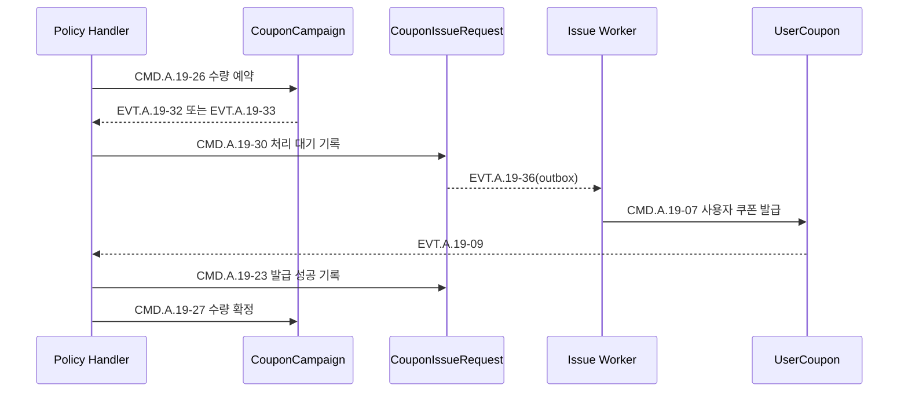

# Context 쿠폰 발급 Handler 설계

## 책임

캠페인 정책·승인, 직접 수령, 코드 등록, 공통 발급 요청, 사용자 쿠폰 생성, 발급 수량과 실패·완료 상태를 담당하는 Command Handler를 정의한다. 대량·자동·보상 경로도 공통 발급 요청 뒤에는 같은 Handler를 사용한다.

## 연관 문서

- 원천: [BC.A.19](../../../40-event-storming-bounded-context/BC_A_19_coupon.md), [REQ.A.02](../../../00-requirements/REQ_A_02_coupon_benefit.md)
- 결정: [Context 쿠폰 Hotspot 결정 기록](../hotspot-decisions.md)
- 도메인: [캠페인과 정책](../A_19_10-domain-model/campaign-policy.md), [발급](../A_19_10-domain-model/issuance.md)
- 저장: [쓰기 모델](../A_19_20-persistence/write-models.md), [원장과 신뢰성](../A_19_20-persistence/ledgers-and-reliability.md)
- Event 연결: [이벤트 처리](event-processing.md)

## 공통 Handler 규약

1. 입력의 Command ID, 업무 고유키, 상관관계 ID와 요청 주체 참조를 검증한다.
2. 필요한 외부 자격·소유 스냅샷을 포트에서 읽고 버전·기준 시각·해시를 고정한다.
3. 멱등 기록과 대상 Aggregate를 읽는다.
4. 도메인 메서드를 호출하고 거절은 명시적 도메인 결과로 반환한다.
5. Aggregate, append-only 원장, 멱등 결과, outbox Event를 한 Postgres 트랜잭션에 저장한다.
6. 다른 Aggregate를 직접 저장하지 않는다.

## 정책·승인 Handler

| Command | Handler | 대상 Aggregate | 주요 검증 | Event |
| --- | --- | --- | --- | --- |
| `CMD.A.19-01` | `RegisterCouponPolicyHandler` | `CouponCampaign` | 혜택·기간·적용 대상·발급·비용 주체·승인 근거 완결성 | `EVT.A.19-01`, 필요 시 `EVT.A.19-02` |
| `CMD.A.19-02` | `ConfigureFirstComeLimitHandler` | `CouponCampaign` | 총수량·사용자별 제한·오픈·종료 조건 | `EVT.A.19-01`의 갱신 결과 |
| `CMD.A.19-03` | `ReviewSellerCouponHandler` | `CouponCampaign` | 외부 판매자 소유 스냅샷, 승인 작업 참조 | `EVT.A.19-03`, `EVT.A.19-04`, `EVT.A.19-05` |
| `CMD.A.19-04` | `ChangeCouponPolicyHandler` | `CouponCampaign` | 새 버전, 미래 적용 시각, 승인 근거 | `EVT.A.19-06` |

`ChangeCouponPolicyHandler`는 기존 `UserCoupon`의 발급 버전과 진행 중 예약의 검증 버전을 바꾸지 않는다. `ReviewSellerCouponHandler`는 판매자 전액 부담·자기 소유 범위·승인된 템플릿이면 판매자 권한을 허용하고, 플랫폼·공동 부담, 제휴, 템플릿 초과와 고액·대량 보상은 버전이 있는 운영 정책과 승인 참조를 요구한다.

## 발급 접수 Handler

| Command | Handler | 대상 | 처리 |
| --- | --- | --- | --- |
| `CMD.A.19-05` | `ClaimCouponHandler` | `CouponIssueRequest` | 사용자 자격·기간·사용자별 제한·중지 상태를 검증하고 `source_type=claim` 요청을 접수한다. |
| `CMD.A.19-06` | `RedeemCouponCodeHandler` | `CouponCodeBatch` | 코드 정규화·해시, 상태·기간·대상·중복을 검증하고 `issue_request_id`에 예약한다. |
| `CMD.A.19-13` | `CreateCouponIssueRequestHandler` | `CouponIssueRequest` | 코드·대량·자동·보상 입력을 `source_type/source_ref`와 동일한 업무 고유키의 요청으로 만든다. |

직접 수령은 `CouponIssueRequest`를 바로 만들지만 코드 등록은 먼저 `CouponCodeBatch`만 변경한다. `EVT.A.19-12` 뒤 `POLICY.A.19-11`이 별도 `CMD.A.19-13`을 요청한다.

공개 응답은 요청 직후 `발급 대기`를 반환한다. `UserCoupon` 생성과 수량 확정 뒤 `CouponIssueRequest.completed`가 기록되어야만 `발급 완료`를 반환한다. 자동 지급은 필수 사건 envelope를 모두 검증하고 생일·생년월일이 없음을 보장하며, 생산자 계약이 확정될 때까지 Handler 진입을 비활성화한다.

## 수량 Handler

| Command | Handler | 대상 | 멱등 결과 |
| --- | --- | --- | --- |
| `CMD.A.19-26` | `ReserveIssueQuantityHandler` | `CouponCampaign` | 같은 `issue_request_id`의 예약·확정·해제 결과를 재사용한다. |
| `CMD.A.19-27` | `ConfirmIssueQuantityHandler` | `CouponCampaign` | `reserved`만 `confirmed`로 바꾸고 기존 종단 결과를 반환한다. |
| `CMD.A.19-28` | `ReleaseIssueQuantityHandler` | `CouponCampaign` | `reserved`만 `released`로 바꾸고 기존 종단 결과를 반환한다. |

수량 예약은 Redis 선행 gate 결과를 참고할 수 있지만 Postgres 조건부 갱신이 최종 판단이다. Redis가 허용해도 원장 예약이 실패하면 발급으로 진행하지 않는다.

## 처리 대기·발급 Handler

| Command | Handler | 대상 | 처리 |
| --- | --- | --- | --- |
| `CMD.A.19-30` | `MarkIssuePendingHandler` | `CouponIssueRequest` | 수량 예약 결과 참조를 확인하고 `pending`으로 바꾼다. |
| `CMD.A.19-07` | `IssueUserCouponHandler` | `UserCoupon` | 원본 요청·정책 스냅샷을 검증하고 업무 고유키당 사용자 쿠폰 하나를 만든다. |
| `CMD.A.19-23` | `RecordIssueSuccessHandler` | `CouponIssueRequest` | `user_coupon_id`를 결과로 연결하고 `completed`로 바꾼다. |
| `CMD.A.19-29` | `RecordIssueRejectionHandler` | `CouponIssueRequest` | 수량·중지 거절 사유와 원본 결과 참조를 기록한다. |

사용자 쿠폰 생성, 발급 요청 완료, 수량 확정과 코드 확정은 네 Aggregate에 대한 별도 트랜잭션이다. `EVT.A.19-09`를 소비하는 Policy들이 각각 후속 Command를 요청한다.

## 실패·재처리·코드 보상 Handler

| Command | Handler | 대상 | 처리 |
| --- | --- | --- | --- |
| `CMD.A.19-14` | `RecordIssueFailureHandler` | `CouponIssueRequest` | 오류를 재처리 가능 또는 최종 실패로 분류하고 실패 원본 참조를 기록한다. |
| `CMD.A.19-19` | `RetryCouponIssueHandler` | `CouponIssueRequest` | 같은 업무 고유키로 새 실행을 허용하고 `retry_pending`으로 전이한다. |
| `CMD.A.19-22` | `FinalizeIssueFailureHandler` | `CouponIssueRequest` | 승인된 운영 작업 참조와 함께 `failed_final`로 닫는다. |
| `CMD.A.19-16` | `ConfirmCouponCodeHandler` | `CouponCodeBatch` | 같은 `issue_request_id`로 예약된 코드만 `redeemed`로 확정한다. |
| `CMD.A.19-17` | `ReleaseCouponCodeHandler` | `CouponCodeBatch` | 최종 실패·거절 결과 참조를 확인하고 예약 코드를 해제한다. |

기술 예외는 성공 응답으로 바꾸지 않는다. 트랜잭션 전 오류는 호출자나 Worker가 재시도하고, 사용자 쿠폰 생성 시도 뒤 업무 실패는 `CMD.A.19-14`로 명시적으로 기록한다.

재시도 한도 소진은 `failed_final`의 충분조건이 아니다. 버전이 있는 운영 설정에 따라 지수 백오프를 적용하고, 승인된 운영 작업 참조를 가진 `CMD.A.19-22`만 최종 실패를 기록한다.

## 오류 분류

| 분류 | 예 | 처리 |
| --- | --- | --- |
| 업무 거절 | 기간 종료, 대상 불일치, 수량 없음, 중지 적용 | 거절 Event와 안정적인 사유 코드 기록 |
| 멱등 재요청 | 같은 업무 고유키, 같은 입력 | 기존 진행·완료 결과 반환 |
| 멱등 충돌 | 같은 키, 다른 입력 해시 | 상태 변경 없이 충돌 반환 |
| 재처리 가능 기술 오류 | 일시적 Postgres/MQ/외부 조회 실패 | 트랜잭션 롤백 후 지연 재시도 또는 실패 기록 |
| 최종 실패 | 입력 손상, 재시도 종료 승인 | `CMD.A.19-22`로 원장 종료 |

## Command 추적 완결성

이 문서는 `CMD.A.19-01`~`CMD.A.19-07`, `CMD.A.19-13`, `CMD.A.19-14`, `CMD.A.19-16`, `CMD.A.19-17`, `CMD.A.19-19`, `CMD.A.19-22`, `CMD.A.19-23`, `CMD.A.19-26`~`CMD.A.19-30`을 소유한다.
