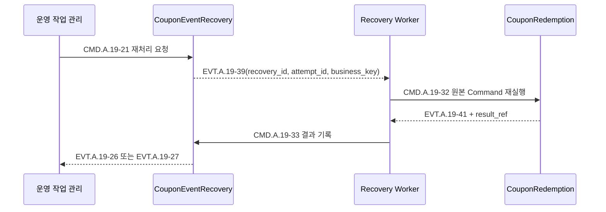

# Context 쿠폰 운영 Worker 설계

## 책임

대량 발급 작업, 사용자 쿠폰 만료, 승인된 운영 중지·읽기 전용 안내, 발급 재처리와 사용 이벤트 복구를 실행하는 Worker와 Command Handler를 정의한다.

## 연관 문서

- 원천: [BC.A.19](../../../40-event-storming-bounded-context/BC_A_19_coupon.md), [REQ.A.02](../../../00-requirements/REQ_A_02_coupon_benefit.md)
- 결정: [Context 쿠폰 Hotspot 결정 기록](../hotspot-decisions.md)
- 도메인: [운영과 복구](../A_19_10-domain-model/operations-recovery.md)
- 저장: [원장과 신뢰성](../A_19_20-persistence/ledgers-and-reliability.md), [조회 모델과 인덱스](../A_19_20-persistence/read-models-and-indexes.md)
- 서비스: [발급 Handler](issuance-handlers.md), [사용 Handler](redemption-handlers.md), [이벤트 처리](event-processing.md)

## Worker 공통 규약

- 점유 대상은 Postgres에서 `next_attempt_at`과 상태를 기준으로 가져오며 여러 Worker는 `SKIP LOCKED`와 같은 방식으로 나눈다.
- MQ 메시지는 작업을 깨우는 신호다. 작업 원본과 현재 상태는 Postgres에서 다시 읽는다.
- 재시도는 버전이 있는 운영 설정의 횟수·기본 간격·상한에 따라 지수 백오프를 적용한다. 한도 소진 뒤에도 자동으로 `failed_final`로 바꾸지 않는다.
- Worker 종료와 배포는 점유 만료 후 안전하게 재개할 수 있어야 한다.
- 실패를 로그만 남기고 버리지 않는다. 업무 실패는 Aggregate 상태와 원장에 기록한다.

## 대량 발급

| Command | Handler/Worker | 대상 Aggregate | 처리 |
| --- | --- | --- | --- |
| `CMD.A.19-08` | `RegisterBulkCouponIssueJobHandler` | `BulkCouponIssueJob` | 대상 정의 참조, 기준 시각, 승인·운영 작업 참조를 가진 작업을 등록한다. |
| `CMD.A.19-18` | `AggregateBulkIssueResultHandler` | `BulkCouponIssueJob` | 대상별 발급 성공·거절·최종 실패 Event를 한 번씩 집계한다. |

`BulkIssuePlannerWorker`는 외부 대상 포트에서 `audience_definition_ref`와 `evaluationAsOf`에 맞는 불변 대상 스냅샷을 읽는다. 각 대상에 `bulk_job_id + target_ref` 업무 고유키로 `CMD.A.19-13`을 요청한다. 발급 직전에는 차단, 캠페인 종료와 운영 중지만 다시 확인한다. 사용자 프로필 원본이나 전체 대상 목록을 `BulkCouponIssueJob` 안에 복제하지 않는다.

대량 작업 완료는 생성한 대상 요청이 모두 성공·거절·최종 실패의 종단 결과를 가질 때 판정한다. 처리 실패·재처리 대기는 완료 집계가 아니다.

## 운영 중지와 읽기 전용 안내

| Command | Handler | 대상 Aggregate | 처리 |
| --- | --- | --- | --- |
| `CMD.A.19-20` | `ApplyCouponOperationalStopHandler` | `CouponOperationalControl` | 승인된 캠페인·드롭·사용자 그룹 범위와 적용 시각을 기록한다. |
| `CMD.A.19-31` | `ApplyCouponReadOnlyNoticeHandler` | `CouponOperationalControl` | 같은 범위의 안내 문구·적용 시각·활성 상태를 기록한다. |

Handler는 운영 작업 관리 포트에서 승인 원본의 존재와 전달된 해시 일치만 확인한다. 승인 판단 자체를 다시 수행하지 않는다. outbox Event는 정책 캐시와 안내 조회 투영을 갱신하며, 캐시 갱신 실패가 Postgres 적용 결과를 되돌리지 않는다.

## 만료 Worker

| Command | Handler | 대상 Aggregate | 처리 |
| --- | --- | --- | --- |
| `CMD.A.19-24` | `ExpireUserCouponHandler` | `UserCoupon` | 기준 시각에 만료되었고 사용 가능·예약 표시 대상인 쿠폰을 만료한다. |

`CouponExpiryWorker`는 `(status, expires_at)` 인덱스로 소규모 배치를 점유한다. 만료 Event 뒤 활성 사용 예약이 있으면 `POLICY.A.19-18`이 별도 `CMD.A.19-12`를 요청한다. Worker는 `UserCoupon`과 `CouponRedemption`을 한 트랜잭션에서 변경하지 않는다.

## 발급 재처리

발급 재처리는 [발급 Handler](issuance-handlers.md)의 `CMD.A.19-19`, `CMD.A.19-22`가 담당한다. 이 문서의 `IssueRetryWorker`는 재처리 대기 요청을 점유하고 같은 업무 고유키로 `CMD.A.19-07`을 다시 전달한다. `UserCoupon`이 이미 있으면 새로 만들지 않고 기존 결과를 후속 완료 Policy에 넘긴다.

재시도 한도를 소진한 요청은 운영 확인 대기 상태에 남긴다. 승인된 `CMD.A.19-22`만 발급 요청의 최종 실패를, 승인된 `CMD.A.19-25`만 사용 복구의 최종 실패를 확정한다.

## 사용 이벤트 복구

| Command | Handler | 대상 Aggregate | 처리 |
| --- | --- | --- | --- |
| `CMD.A.19-21` | `RequestCouponUseRecoveryHandler` | `CouponEventRecovery` | 새 `attempt_id`를 만들고 `retry_pending`으로 전이한다. |
| `CMD.A.19-25` | `FinalizeCouponUseRecoveryHandler` | `CouponEventRecovery` | 승인된 운영 작업 참조로 `failed_final`을 기록한다. |
| `CMD.A.19-32` | `ReplayCouponUseCommandHandler` | `CouponRedemption` | 원본 유형·`payload` 참조·업무 고유키로 상태 전이를 재실행하고 결과를 판정한다. |
| `CMD.A.19-33` | `RecordCouponRecoveryResultHandler` | `CouponEventRecovery` | 상관키가 일치하는 현재 시도에 성공·이미 적용됨·실패를 기록한다. |
| `CMD.A.19-34` | `RecordCouponUseProcessingFailureHandler` | `CouponEventRecovery` | 최초 애플리케이션 실패를 원본 참조와 함께 기록한다. |

`ReplayCouponUseCommandHandler`는 `CouponRedemption`만 변경한다. 결과 기록은 별도 Handler가 `CouponEventRecovery`에 반영한다. `recovery_id`, `attempt_id`, 업무 고유키 중 하나라도 다르면 낡은 결과로 거절하고 현재 시도를 바꾸지 않는다.

## 실패 등급과 재시도

| 등급 | 예 | 처리 |
| --- | --- | --- |
| 일시적 인프라 실패 | Postgres 연결, MQ 발행, 외부 포트 시간 초과 | 같은 업무 고유키로 지연 재시도 |
| 상태 경합 | 이미 다른 Worker가 종단 전이를 완료 | 기존 `result_ref`를 읽어 `already_applied`로 종료 |
| 업무 거절 | 만료, 중지, 상태 전이 불가 | 거절·실패 Event를 기록하고 무한 재시도하지 않음 |
| 입력 손상 | `payload` 해시 불일치, 지원하지 않는 원본 유형 | 자동 재시도 중단 후보로 기록하고 승인된 최종 실패 대기 |

## Command 추적 완결성

이 문서는 `CMD.A.19-08`, `CMD.A.19-18`, `CMD.A.19-20`, `CMD.A.19-21`, `CMD.A.19-24`, `CMD.A.19-25`, `CMD.A.19-31`, `CMD.A.19-32`, `CMD.A.19-33`, `CMD.A.19-34`를 소유한다.
