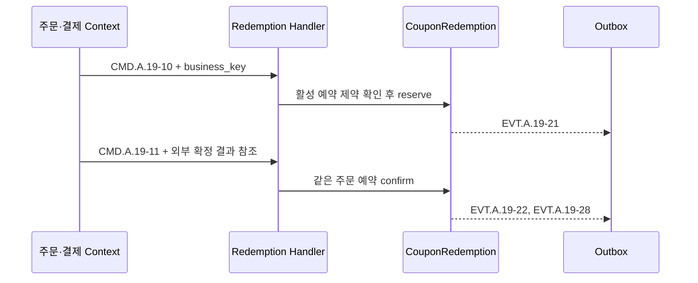

# Context 쿠폰 사용 Handler 설계

## 책임

주문·결제 Context가 제공한 스냅샷을 검증하고 `CouponRedemption`의 적용 가능 확인, 예약, 확정, 해제, 회수와 비용 귀속 Event를 처리하는 Handler를 정의한다.

## 연관 문서

- 원천: [BC.A.19](../../../40-event-storming-bounded-context/BC_A_19_coupon.md), [REQ.A.02](../../../00-requirements/REQ_A_02_coupon_benefit.md)
- 결정: [Context 쿠폰 Hotspot 결정 기록](../hotspot-decisions.md)
- 도메인: [사용](../A_19_10-domain-model/redemption.md), [공통 계약](../A_19_10-domain-model/shared-contracts.md)
- 저장: [쓰기 모델](../A_19_20-persistence/write-models.md), [원장과 신뢰성](../A_19_20-persistence/ledgers-and-reliability.md)
- 복구: [운영 Worker](operations-workers.md), [이벤트 처리](event-processing.md)

## 외부 입력 검증

Handler는 주문·결제 포트가 제공한 `order_id`, `user_id`, 상품·드롭·판매자 참조, 가격·수량·배송비, 사용자 자격, 기준 시각, 스냅샷 버전과 해시를 받는다. 다음 경우에는 상태를 변경하지 않는다.

- 스냅샷이 없거나 해시가 다르다.
- 주문 사용자와 사용자 쿠폰 소유자가 다르다.
- 정책 버전 또는 통화가 요청과 다르다.
- 외부 조회가 시간 초과되었는데 검증 성공 여부를 판단할 수 없다.

외부 조회 실패를 쿠폰 적용 불가라는 업무 거절로 오인하지 않고 재처리 가능한 기술 오류로 분류한다.

## Handler 지도

| Command | Handler | 사전 조건 | 상태 변경 | Event |
| --- | --- | --- | --- | --- |
| `CMD.A.19-09` | `ValidateCouponDiscountHandler` | 사용자 쿠폰, 정책 버전, 주문 스냅샷 유효 | 평가 결과와 할인·비용 스냅샷 저장 | `EVT.A.19-19` 또는 `EVT.A.19-20` |
| `CMD.A.19-10` | `ReserveCouponRedemptionHandler` | 적용 가능, 운영 중지 아님, 활성 예약 없음 | `evaluated/released → reserved` | `EVT.A.19-21` |
| `CMD.A.19-11` | `ConfirmCouponRedemptionHandler` | 같은 주문의 활성 예약, 외부 확정 결과 참조 | `reserved → confirmed` | `EVT.A.19-22`, `EVT.A.19-28` |
| `CMD.A.19-12` | `ReleaseCouponRedemptionHandler` | 확정 전 활성 예약 | `reserved → released` | `EVT.A.19-23` |
| `CMD.A.19-15` | `ReclaimCouponRedemptionHandler` | 확정된 사용, 취소·환불 결과 참조 | `confirmed → reclaimed` | `EVT.A.19-24`, 비용 보정 `EVT.A.19-28` |

## 적용 가능 확인

`ValidateCouponDiscountHandler`는 다음 순서로 계산한다.

1. `UserCoupon` 읽기 모델이 아닌 원본 쓰기 모델로 소유·기간·만료 상태를 확인한다.
2. 캠페인의 해당 `policy_version`을 읽는다.
3. 주문 스냅샷의 외부 참조를 포함·제외 조건과 대조한다.
4. 중복 적용 정책 식별자와 입력된 다른 할인 스냅샷을 검증한다.
5. 서버 기준 할인 금액과 비용 귀속을 계산한다.
6. 결과와 근거 해시를 `CouponRedemption` 원장에 기록한다.

기본 조합은 할인 쿠폰 한 장과 배송비 쿠폰 한 장이다. 그 밖의 플랫폼·판매자·드롭·회원 쿠폰 조합은 버전이 있는 `stackingPolicyRef`가 명시적으로 허용할 때만 처리한다. 할인은 상품·판매자 범위, 주문, 배송비 순서로 적용한다.

## 예약과 확정

- `CMD.A.19-10`은 `UNIQUE(user_coupon_id) WHERE status='reserved'` 제약을 최종 방어선으로 사용한다.
- `CMD.A.19-11`은 결제 최종 확정 사건 참조를 요구한다. 주문 생성이나 중간 결제 승인 참조는 거절하며 외부 원본 상태는 저장하지 않는다.
- 같은 업무 고유키의 재요청은 기존 `result_ref`를 반환한다.

## 해제와 회수

- 해제는 사용 확정 전의 예약만 닫는다. 확정 실패·취소는 즉시 해제하고, 결과를 판단할 수 없을 때만 버전이 있는 운영 설정의 짧은 유예를 적용한다. 원인은 사유 코드와 외부 참조로 남긴다.
- 회수는 확정 사용을 보정한다. 원래 사용 Event를 삭제하지 않고 반대 방향의 비용 귀속 Event를 추가한다.
- 회수 뒤 새 예약은 검증된 취소·환불 사건, 남은 유효기간, 캠페인 활성 상태와 운영 중지 부재를 모두 확인한 경우에만 허용한다. 유예 시간은 Handler 상수로 두지 않는다.

## 비용 귀속

할인 확정과 회수 시 `platform`, `seller`, `joint`, `compensation` 항목별 금액, 승인 참조와 정산 연결 키를 `CostAttribution`에 기록한다. 항목 합계가 할인 금액과 다르면 트랜잭션 전체를 롤백하고 요청을 거절한다. 정산 예정·보류·확정 상태는 정산 Context가 소유한다.

## 실패와 복구 기록

Handler 실행 중 애플리케이션 오류가 나면 호출자가 같은 업무 고유키로 재시도할 수 있다. 상태 전이 시도가 시작된 뒤 결과를 판단하지 못한 실패는 [운영 Worker](operations-workers.md)의 `CMD.A.19-34`로 `CouponEventRecovery`에 기록한다. 복구 기록을 만들기 위해 `CouponRedemption` 트랜잭션에 다른 Aggregate를 끼워 넣지 않는다.

## Command 추적 완결성

이 문서는 `CMD.A.19-09`, `CMD.A.19-10`, `CMD.A.19-11`, `CMD.A.19-12`, `CMD.A.19-15`를 소유한다.
