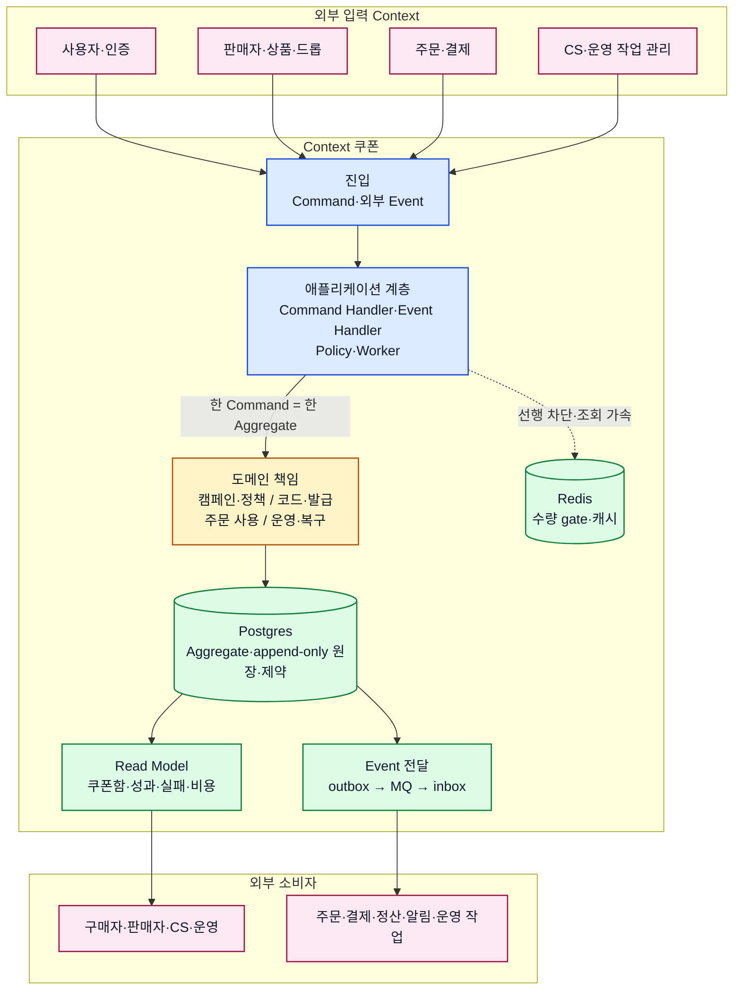

# Context 쿠폰 서비스 상세 설계

## 기본 정보

- Service Design ID: `SD.A.19`
- Context: Context 쿠폰
- 상태: draft
- 책임: 쿠폰 캠페인·정책, 발급·쿠폰함, 주문 사용, 운영 중지·복구와 외부 API 계약을 구현 관점에서 상세화한다.

## 연관 태그

🏷️ PAGE 참조: [PAGE.A.19](../../10-sitemap/buyer-mobile-web/PAGE_A_19_coupon_wallet/PAGE_A_19_owned_coupon.md) | UI 참조: [UI.A.19](../../20-ui/buyer-mobile-web/UI_A_19_coupon_wallet/UI_A_19_coupon_wallet.md) | UC 참조: [UC.A.19](../../30-uc/UC_A_19_coupon_wallet.md)

## 서비스 아키텍처

이 다이어그램은 외부 Context, 애플리케이션 계층, 도메인 책임, 최종 원장과 보조 계층의 관계를 요약한다. 세부 규칙은 아래 설계 문서 지도에서 책임별 문서로 확인한다.

- 실선은 업무 요청과 상태·Event 전달을, 점선은 Redis의 보조 역할을 나타낸다.
- Postgres 원장·제약·outbox가 최종 상태를 보장하며 Redis와 MQ는 이를 대체하지 않는다.
- 외부 Context의 원본은 소유하지 않고 식별자와 판단 시점의 스냅샷만 사용한다.

## 설계 영역

| 영역 | 식별자 | 폴더 | 상태 |
| --- | --- | --- | --- |
| 도메인 모델 | `SD.A.1910` | [A_19_10-domain-model](A_19_10-domain-model/README.md) | draft |
| 영속성 | `SD.A.1920` | [A_19_20-persistence](A_19_20-persistence/README.md) | draft |
| 서비스 | `SD.A.1930` | [A_19_30-service](A_19_30-service/README.md) | draft |
| API | `SD.A.1940` | [A_19_40-api](A_19_40-api/README.md) | draft |

## 설계 문서 지도

| 영역 | 하위 문서 |
| --- | --- |
| 도메인 모델 | [캠페인과 정책](A_19_10-domain-model/campaign-policy.md), [발급](A_19_10-domain-model/issuance.md), [사용](A_19_10-domain-model/redemption.md), [운영과 복구](A_19_10-domain-model/operations-recovery.md), [공통 계약](A_19_10-domain-model/shared-contracts.md) |
| 영속성 | [쓰기 모델](A_19_20-persistence/write-models.md), [원장과 신뢰성](A_19_20-persistence/ledgers-and-reliability.md), [조회 모델과 인덱스](A_19_20-persistence/read-models-and-indexes.md) |
| 서비스 | [발급 Handler](A_19_30-service/issuance-handlers.md), [사용 Handler](A_19_30-service/redemption-handlers.md), [운영 Worker](A_19_30-service/operations-workers.md), [이벤트 처리](A_19_30-service/event-processing.md) |
| API | [API 인덱스](A_19_40-api/README.md), [OpenAPI](A_19_40-api/openapi/openapi.yaml), [Event 계약](A_19_40-api/event-contracts.md) |

## 원천과 경계

- 원천: [BC.A.19](../../40-event-storming-bounded-context/BC_A_19_coupon.md), [REQ.A.02](../../00-requirements/REQ_A_02_coupon_benefit.md)
- 도메인·영속성·서비스·API 설계는 모두 `draft`다. HTTP wire 계약은 OpenAPI, Event 경계는 API 영역의 Event 계약에서 관리한다.
- 사용자·상품·드롭·주문·결제·CS·정산 원본은 Context 쿠폰 밖에 두고 외부 참조와 스냅샷만 사용한다.
