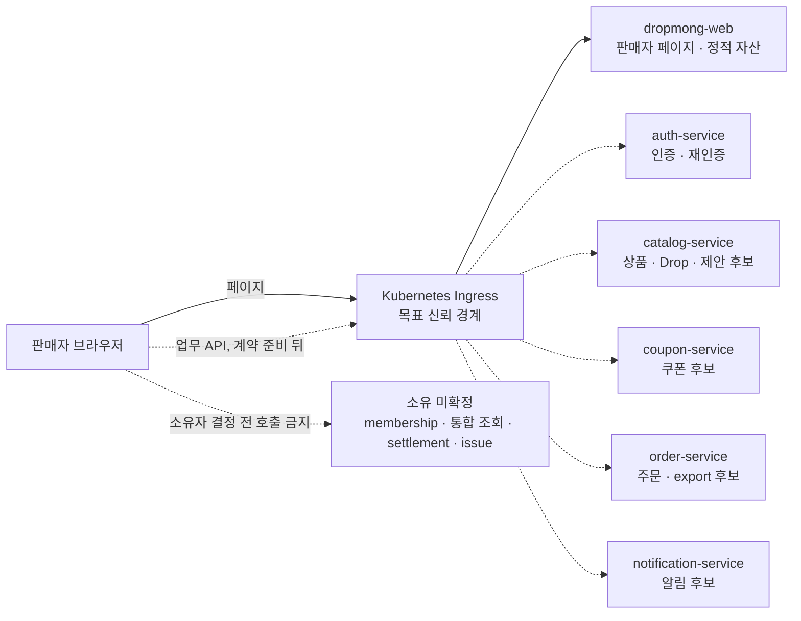

# Context 판매자 서비스 상세 설계

## 역할

이 폴더는 `REQ.A.03`과 `BC.A.200`의 판매자 업무를 현재 `service` 저장소의 MSA에 배치하기 위한 설계 원장이다. 바운디드 컨텍스트 이름이 곧 배포 서비스 이름이라는 전제를 두지 않는다. 상품·Drop·주문·결제·쿠폰·알림 규칙은 각 소유 서비스의 API와 Event를 참조하며, 판매자 화면을 이유로 규칙을 복제하지 않는다.

## 확인 기준

| 원천 | 확인 시점·ref | 판정에 사용하는 내용 |
| --- | --- | --- |
| `service` checkout | 2026-07-16 HEAD `1bb90b3` | 서비스 코드, OpenAPI, 테스트, `dropmong-web` 현행 구현 |
| `service/config/services.yml` | 같은 checkout | image build·게시 대상 9개 목록. 배포 완료 증거는 아님 |
| `archive` | 2026-07-16 HEAD `7d2e7a5` | seller 목표 경계와 논리 operation |
| `gitops` | 2026-07-16 HEAD `8e14539` + 기존 Auth values 작업 트리 변경 | User·Coupon의 DropMong 표기 선언, ticketing/MediKong 표기의 동명 서비스, 미선언 서비스와 Auth 변경 전후 구분 |

확인한 TicketMong GitOps checkout에는 ticketing/MediKong 표기 선언과 DropMong label을 가진 User·Coupon private-dev 선언이 함께 있다. User·Coupon에 현재 `service` checkout의 image가 실제로 동기화됐는지는 확인하지 않았다. 이름이 같은 Auth·Payment·Notification 선언도 동일성을 확인하기 전에는 DropMong 배포 근거로 사용하지 않는다. 라이브 클러스터는 확인하지 않았으므로 `선언 있음`과 `실제 배포됨`을 구분한다.

## 배포 결론

- 별도 `seller-service`를 추가하지 않는다.
- 목표 구조에서 Seller BFF를 사용하지 않는다. `dropmong-web`은 판매자 페이지와 정적 자산을 제공하고, 브라우저의 업무 API 요청은 Kubernetes Ingress를 거쳐 실제 소유 서비스로 전달한다.
- 현재 `dropmong-web`의 `/api/web/seller/**`, `src/server/bff/seller/**`, `DEV_MOCK_MODE=true` fixture는 현행 코드 기록이며 목표 계약이 아니다.
- Seller Management, Seller Proposal, Seller Operations Query, Order Export와 Seller Issue는 책임을 분석하는 이름이지 배포 서비스 이름이 아니다.
- 기존 서비스에 자연스럽게 배정할 수 없는 책임은 `소유 서비스 미확정`으로 둔다. 이를 Auth, Catalog, User 또는 Ingress에 임의로 넣지 않는다.

## 상태 판정 축

seller 연동 상태는 한 단어로 합치지 않고 다음 네 축을 따로 기록한다.

| 축 | 완료 조건 |
| --- | --- |
| API 구현 | 실제 소유 서비스 코드와 OpenAPI·테스트에 operation이 존재 |
| seller 사용 가능 | seller principal, membership, resource ownership, 마스킹·감사 조건을 충족 |
| Ingress 공개 | DropMong GitOps에 외부 route, 인증 context, CORS·CSRF 정책이 선언됨 |
| 프론트 연결 | seller 페이지가 fixture나 현행 Seller BFF가 아니라 canonical API를 호출 |

## 현재 서비스 목록

`service/config/services.yml`의 image 목록은 다음 9개다. image 목록, GitOps 선언, seller 공개 route와 프론트 연결은 각각 판정한다.

| 서비스 | 현재 코드·API | seller 사용 가능 | 목표 판매자 책임 | GitOps·Ingress | 현재 프론트 연결 |
| --- | --- | --- | --- | --- | --- |
| `auth-service` | mobile context, `link_identity`·`replace_phone` 재인증과 `purchase` action resume 구현. seller purpose·resume variant 없음 | 현재 seller 사용 불가. 향후 인증·재인증 보조만 가능하며 membership·업무 권한 원장은 아님 | `user_id`, Session, 인증 수단, proof·grant | HEAD의 ticketing/MediKong 표기 `/auth` route는 기존 작업 트리 변경에서 비활성. canonical `/api/v1/auth/**` 미공개, DropMong 동일성·실제 배포 미확인 | 개발 cookie·fixture만 사용, 실제 Auth 미연결 |
| `catalog-service` | 공개 buyer `GET /drops`, `GET /drops/{dropId}` | 불가. seller 소유·초안·검수 계약 없음 | SellerProduct, DropProposal, DropReview, seller Drop 후보 | 선언 없음 | 미연결 |
| `coupon-service` | buyer 보유 쿠폰과 internal 캠페인·성과·비용 API 구현 | 불가. seller 공개·목록·제휴·scope 부족 | seller 쿠폰 캠페인·성과·비용 귀속 | DropMong private-dev·`/coupons` 선언은 있으나 `/api/v1/**` seller 후보 경로와 불일치, 실제 배포 미확인 | 미연결 |
| `dropmong-web` | seller PAGE, Seller BFF, fixture 구현 | 개발 화면만 가능 | 목표에서는 seller UI와 정적 자산만 제공 | 선언 없음 | 현행 BFF·fixture 연결 |
| `interest-service` | buyer 관심·예정·인기 랭킹, operator 통계 구현 | 불가. seller 계약 없음 | 현재 seller 책임 배정 없음 | 선언 없음 | 미연결 |
| `notification-service` | buyer 알림 목록 구현 | 불가. seller principal·분류 없음 | seller 알림 저장·전달 후보 | ticketing/MediKong 표기의 동명 선언만 확인, DropMong 동일성 미확인 | 미연결 |
| `order-service` | buyer 주문 생성·단건 조회 구현 | 불가. seller 목록·마스킹·export 없음 | seller 주문 조회·OrderExport 후보 | 선언 없음 | 미연결 |
| `payment-service` | 개발 결제 승인·실패와 구매자 단건 조회 구현 | 브라우저 직접 사용 불가 | seller 귀속 결제 Event의 원천 | ticketing/MediKong 표기의 동명 선언만 확인, DropMong 동일성 미확인 | 미연결 |
| `user-service` | 사용자 생성·본인 프로필·계정 상태 API 구현 | 불가. seller account·membership 원장이 아님 | 현재 seller 책임 배정 없음 | DropMong private-dev와 exact `/api/v1/users`, Prefix `/api/v1/users/me` 선언 있음, 실제 배포 미확인 | 미연결 |
| 소유 서비스 미확정 | 배포 단위와 API 없음 | 불가 | SellerAccount, StoreProfile, SellerMembership, SellerRole, dashboard, analytics, settlement, SellerIssue | 소유·선언 미확정 | 미연결 |

## 목표 배치

이 구성도는 목표다. User·Coupon의 일부 선언은 seller 전용 계약이나 판매자 PAGE 연결을 뜻하지 않으며, 현재 목표 업무에 사용할 seller Ingress route는 확인되지 않았다.

- Payment는 브라우저 직접 조회 대상이 아니다. 필요한 seller 귀속 Event를 조회 모델 소유 서비스에 제공하는 원천이다.
- Interest와 User는 현재 서비스 inventory에 포함되지만 seller 업무 원장으로 재사용하지 않는다.
- 대시보드·분석·정산처럼 여러 서비스 사실을 합치는 기능은 조회 모델의 실제 소유 서비스가 결정되기 전까지 제공하지 않는다. 브라우저, Ingress, Server Component와 `dropmong-web`이 fan-out 집계를 대신하지 않는다.

## API 묶음별 배치 상태

`API.A.200-*`는 현재 하나의 런타임 API가 아니다. `CMD.A.200-*`와 `RM.A.200-*`를 식별하는 논리 operation catalog다. 실제 서비스 계약으로 확정하려면 소유 서비스의 OpenAPI, 테스트와 DropMong Ingress route에 반영해야 한다.

| 논리 API | 업무 책임 | 목표 소유 서비스 | API 구현 | seller 사용·배포 상태 |
| --- | --- | --- | --- | --- |
| `API.A.200-01~08` | access, account, store, membership, role | 미확정 | 설계 초안 | 사용 불가, 소유·Ingress 미확정 |
| `API.A.200-09~16` | product, proposal, review, handoff | `catalog-service` 후보 | seller API 미구현 | 사용·Ingress·프론트 미연결 |
| `API.A.200-17` | 통합 dashboard | 미확정 | 미구현 | 조회 모델 소유자 필요 |
| `API.A.200-18` | seller Drop 조회 | `catalog-service` 후보 | seller API 미구현 | 사용·Ingress·프론트 미연결 |
| `API.A.200-19~22` | seller 주문, export | `order-service` 후보 | seller API 미구현 | 사용·Ingress·프론트 미연결 |
| `API.A.200-23~24` | analytics, settlement | 미확정 | 미구현 | 조회 모델·정산 원천 소유자 필요 |
| `API.A.200-25~28` | seller issue | 미확정 | 미구현 | 플랫폼 운영 결과 계약 필요 |
| `API.A.19-10~13/16/25` | seller 쿠폰 후보 | `coupon-service` | internal API 일부 구현 | seller 공개·scope·Ingress·프론트 미연결 |

## 설계 원칙

- Auth는 `user_id`, Session, 인증 수단, 재인증 proof와 grant만 소유한다. seller membership·role·permission 원장은 Auth로 옮기지 않는다.
- `user-service`의 사용자 프로필과 계정 상태도 seller account·membership 원장을 대신하지 않는다.
- buyer API를 seller API처럼 재사용하지 않는다. 소유권, 마스킹, 감사와 권한 조건이 다르면 소유 서비스에 seller 전용 operation을 추가한다.
- 서비스는 자기 데이터베이스만 읽는다. 다른 서비스, 브라우저나 웹 애플리케이션이 Catalog·Order·Payment·Coupon DB를 직접 조회하지 않는다.
- 서비스 간 파생 데이터는 versioned Event와 inbox로 만든다. 조회 모델 소유자가 미정이면 Event 소비와 집계 구현도 시작하지 않는다.
- 브라우저가 보낸 `X-User-*`, `X-Seller-*`, role과 permission은 신뢰하지 않는다. Ingress가 외부 값을 제거하고, 수신 서비스가 membership과 리소스 소유권을 다시 확인한다.
- 미확정 정책은 `미확인`, `미연결`, `소유 미확정`으로 남긴다. 성공 응답, SLA, TTL과 기본 권한을 임의로 만들지 않는다.

## 문서 구조

| 영역 | 원장 | 내용 |
| --- | --- | --- |
| 도메인 | [SD.A.20010](A_200_10-domain-model/README.md) | Aggregate, 불변조건, 상태 전이, 논리 Read Model |
| 영속성 | [SD.A.20020](A_200_20-persistence/README.md) | 서비스별 저장소, version·멱등, outbox/inbox, 감사, export 수명주기 |
| 서비스 | [SD.A.20030](A_200_30-service/README.md) | 기존 MSA 배정, Handler, Event, 보안과 오류 |
| API | [SD.A.20040](A_200_40-api/README.md) | 논리 operation, 소유 서비스 상태, Event gap, PAGE 추적성 |
| 웹 연동 | [A.03 seller API 원장](../../60-web-application/A_03_seller/api-integration/README.md) | 실제 endpoint, seller 사용 가능, Ingress, 프론트 연결 |

## 상태 기준

| 상태 | 의미 |
| --- | --- |
| 구현됨 | 현재 소유 서비스 코드·OpenAPI·테스트에 operation이 존재 |
| 일부 구현 | operation 일부는 있으나 seller scope·업무 변형이 부족 |
| 설계 초안 | 논리 API와 schema만 있고 소유 서비스 OpenAPI에 없음 |
| 미구현 | 소유 서비스 후보는 있지만 코드와 실제 계약이 없음 |
| 소유 미확정 | 현재 MSA 어디에도 책임을 배정하지 않음 |
| 배포 미연결 | 해당 서비스·계약의 GitOps 선언이나 필요한 Ingress route가 없음 |
| 배포 미확인 | 선언은 있으나 현재 DropMong service checkout과의 동일성, route 포함 범위 또는 실제 동기화를 확인하지 못함 |

## 원천 문서

- [REQ.A.03 판매자 요구사항](../../00-requirements/REQ_A_03_seller.md)
- [BC.A.200 판매자 Context](../../40-event-storming-bounded-context/BC_A_200_seller.md)
- [판매자 웹 설계](../../60-web-application/A_03_seller/README.md)
- [Auth API](../A_300_auth/A_300_40-api/README.md)
- [Coupon API](../A_19_coupon/A_19_40-api/README.md)
