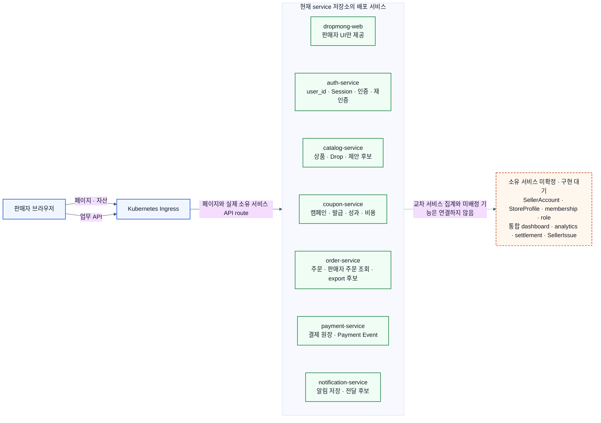

# Context 판매자 서비스 상세 설계

## 역할

이 폴더는 `REQ.A.03`과 `BC.A.200`의 판매자 업무를 현재 `service` 저장소의 MSA에 배치하기 위한 설계 원장이다. 바운디드 컨텍스트 이름이 곧 배포 서비스 이름이라는 전제는 두지 않는다. 상품·드롭·주문·결제·쿠폰·알림 규칙은 각 소유 서비스의 API와 Event를 참조하고, 판매자 화면을 이유로 규칙을 복제하지 않는다.

## 배포 결론

- 지금 별도 `seller-service`를 추가하지 않는다.
- 목표 구조에서 Seller BFF를 사용하지 않는다. `dropmong-web`은 판매자 페이지와 정적 자산을 제공하고, 브라우저의 업무 API 요청은 Kubernetes Ingress를 거쳐 실제 소유 서비스로 전달된다.
- 현재 `dropmong-web`의 `/api/web/seller/**`, `src/server/bff/seller/**`, `DEV_MOCK_MODE=true` fixture는 현행 코드 기록이며 목표 계약이 아니다.
- Seller Management, Seller Proposal, Seller Operations Query, Order Export, Seller Issue는 책임을 분석하는 이름이지 배포 서비스 이름이 아니다.
- 기존 서비스에 자연스럽게 배정할 수 없는 책임은 `소유 서비스 미확정`으로 둔다. 이를 Auth, Catalog 또는 Ingress에 임의로 넣지 않는다.

## 실제 MSA 서비스 구성도

2026-07-13 `service/config/services.yml`에는 `auth-service`, `catalog-service`, `coupon-service`, `dropmong-web`, `notification-service`, `order-service`, `payment-service`만 등록되어 있다. 다음 구성도는 이 목록과 Kubernetes Ingress 앞단을 기준으로 한다.

- 실선은 현재 존재하는 배포 경계와 Ingress 진입을 나타낸다. 점선은 seller 전용 계약이나 소유권 결정이 필요한 연결이다.
- 브라우저가 Payment를 직접 조회해 매출을 계산하지 않는다. Payment는 필요한 seller 귀속 Event를 소유 서비스에 제공하는 원천이다.
- 대시보드·분석·정산처럼 여러 서비스의 사실을 합치는 기능은 조회 모델의 실제 소유 서비스가 결정되기 전까지 제공하지 않는다. 브라우저, Ingress와 `dropmong-web`이 fan-out 집계를 대신하지 않는다.

## 서비스별 책임 배정

| 실제 배포 단위 | 현재 상태 | 판매자 기능 배정 | 판정 |
| --- | --- | --- | --- |
| Kubernetes Ingress / Kong | GitOps에 class와 서비스별 route 패턴 존재 | TLS, route, 외부 인증 정보 제거, 검증된 사용자 context 전달 | 업무 권한·집계·DTO 조합은 소유하지 않음 |
| `dropmong-web` | seller UI·BFF·fixture 구현됨 | 판매자 UI 제공 | 목표에서는 BFF와 seller fixture를 사용하지 않음 |
| `auth-service` | 구현됨 | `user_id`, Session, 인증, 목적 한정 재인증 proof·grant | seller membership·업무 권한을 소유하지 않음 |
| `catalog-service` | 공개 Drop 조회 구현됨 | `SellerProduct`, `DropProposal`, `DropReview`, seller Drop 조회의 1차 배정 후보 | `API.A.200-09~18` seller 계약과 영속성 구현 필요 |
| `coupon-service` | 내부 캠페인 API 구현됨 | seller 쿠폰 캠페인·성과·비용 귀속 | Ingress 공개 계약, seller scope, 목록·제휴 계약 보강 필요 |
| `order-service` | 구매자 주문 API 구현됨 | seller 주문 조회와 `OrderExport`의 1차 배정 후보 | `API.A.200-19~22` seller 계약, 마스킹·감사·파일 수명주기 구현 필요 |
| `payment-service` | 결제와 Payment Event 구현됨 | seller 귀속 결제 사실의 원천 | seller용 직접 조회 API를 만들지 않고 Event 계약 보강 필요 |
| `notification-service` | 구매자 알림 구현됨 | seller 알림 저장·전달 후보 | seller principal·분류 계약 필요 |
| 소유 서비스 미확정 | 배포 단위 없음 | `SellerAccount`, `StoreProfile`, `SellerMembership`, `SellerRole`, 통합 조회 모델, settlement, `SellerIssue` | 구현 대기. 신규 서비스 또는 기존 서비스 확장은 별도 근거로 결정 |

## API 묶음별 배치 상태

`API.A.200-*`는 현재 하나의 런타임 API가 아니다. `CMD.A.200-*`와 `RM.A.200-*`를 빠짐없이 식별하기 위한 논리 operation catalog이며, 실제 서비스 계약으로 확정하려면 소유 서비스의 OpenAPI와 Ingress route에 반영해야 한다.

| 논리 API | 업무 책임 | 목표 소유 서비스 | 현재 상태 |
| --- | --- | --- | --- |
| `API.A.200-01~08` | access, account, store, membership, role | 미확정 | 배포 불가 |
| `API.A.200-09~16` | product, proposal, review, handoff | `catalog-service` 배정 후보 | seller 계약 미구현 |
| `API.A.200-17` | 통합 dashboard | 미확정 | 교차 서비스 조회 모델 소유자 필요 |
| `API.A.200-18` | seller Drop 조회 | `catalog-service` 배정 후보 | seller 계약 미구현 |
| `API.A.200-19~22` | seller 주문, export | `order-service` 배정 후보 | seller 계약 미구현 |
| `API.A.200-23~24` | analytics, settlement | 미확정 | 교차 서비스 조회 모델·정산 원천 필요 |
| `API.A.200-25~28` | seller issue | 미확정 | 플랫폼 운영 case 소유자 필요 |
| `API.A.19-10~13/16/25` | seller 쿠폰 | `coupon-service` | 일부 구현, seller 공개 계약 보강 대기 |

## 설계 원칙

- Auth는 `user_id`, Session, 인증 수단, 재인증 proof와 grant만 소유한다. seller membership·role·permission 원장은 Auth로 옮기지 않는다.
- buyer API를 seller API처럼 재사용하지 않는다. 소유권, 마스킹, 감사와 권한 조건이 다르면 소유 서비스에 seller 전용 operation을 추가한다.
- 서비스는 자기 데이터베이스만 읽는다. Catalog·Order·Payment·Coupon 데이터베이스를 다른 서비스나 웹 애플리케이션이 직접 조회하지 않는다.
- 서비스 간 파생 데이터는 versioned Event와 inbox로 만든다. 조회 모델 소유자가 미정이면 Event 소비와 집계 구현도 시작하지 않는다.
- 브라우저가 보낸 `X-User-*`, `X-Seller-*`, role과 permission은 신뢰하지 않는다. Ingress가 외부 값을 제거한 뒤 검증된 인증 context만 전달하고, 수신 서비스가 seller membership과 리소스 소유권을 다시 확인한다.
- 미확정 정책은 관련 표의 `미확정` 또는 `계약 대기` 상태로 남긴다. 성공 응답, SLA, TTL과 기본 권한을 임의로 만들지 않는다.

## 문서 구조

| 영역 | 원장 | 내용 |
| --- | --- | --- |
| 도메인 | [SD.A.20010](A_200_10-domain-model/README.md) | Aggregate, 불변조건, 상태 전이, `RM.A.200-01~10`의 논리 소유권 |
| 영속성 | [SD.A.20020](A_200_20-persistence/README.md) | 서비스별 PostgreSQL, version·멱등, outbox/inbox, 감사, export 수명주기 |
| 서비스 | [SD.A.20030](A_200_30-service/README.md) | 기존 MSA 배정, Handler, Event 소비, 보안과 오류 |
| API | [SD.A.20040](A_200_40-api/README.md) | 논리 operation catalog, 소유 서비스 상태, Event 계약, PAGE 추적성, OpenAPI 초안 |

## 추적성 범위

- Command `CMD.A.200-01~17`은 [Handler와 책임 경계](A_200_30-service/handlers-and-boundaries.md)와 [operation catalog](A_200_40-api/operation-catalog.md)에 연결한다.
- Read Model `RM.A.200-01~10`은 [Read Model과 투영](A_200_20-persistence/read-models-and-projections.md)과 PAGE Query에 연결한다.
- `PAGE.A.200~211`은 [PAGE/API 추적성](A_200_40-api/page-api-traceability.md)에서 현재 코드 식별자, 목표 소유 서비스와 구현 상태를 구분한다.
- Auth·Coupon은 소유 API 문서를 함께 갱신한다. Catalog·Order·Payment·Notification과 소유 미확정 책임은 실제 계약이 생기기 전까지 `계약 대기`로 둔다.

## 상태 기준

| 상태 | 의미 |
| --- | --- |
| 구현됨 | 현재 `service` 메인 코드와 OpenAPI에 존재하고 해당 용도로 사용할 수 있음 |
| 일부 구현 | operation은 있으나 seller scope·Ingress 공개·업무 변형이 부족함 |
| 설계 초안 | 논리 API와 schema가 있으나 소유 서비스 OpenAPI에 편입되지 않음 |
| 미구현 | 소유 서비스는 정해졌지만 코드와 배포 계약이 없음 |
| 소유 미확정 | 현재 MSA 어디에도 책임을 배정하지 않았으며 구현을 시작할 수 없음 |
| 외부 계약 대기 | 소유 Context의 canonical API·Event가 없음 |

## 원천 문서

- [REQ.A.03 판매자 요구사항](../../00-requirements/REQ_A_03_seller.md)
- [BC.A.200 판매자 Context](../../40-event-storming-bounded-context/BC_A_200_seller.md)
- [판매자 웹 설계](../../60-web-application/A_03_seller/README.md)
- [Auth API](../A_300_auth/A_300_40-api/README.md)
- [Coupon API](../A_19_coupon/A_19_40-api/README.md)
