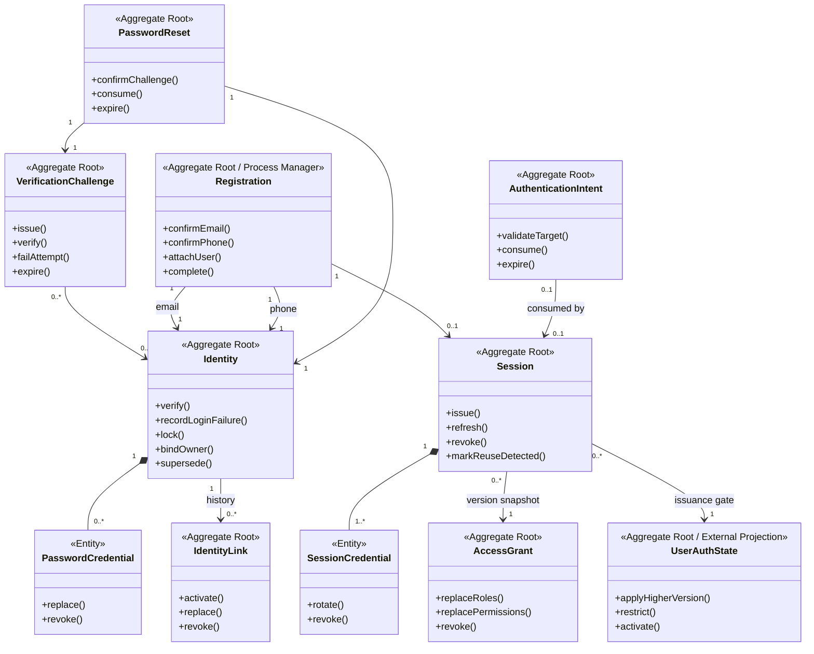
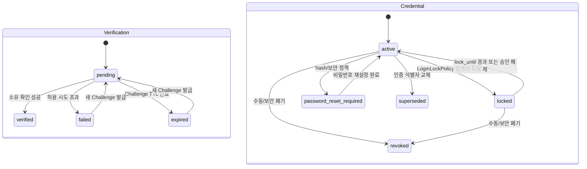
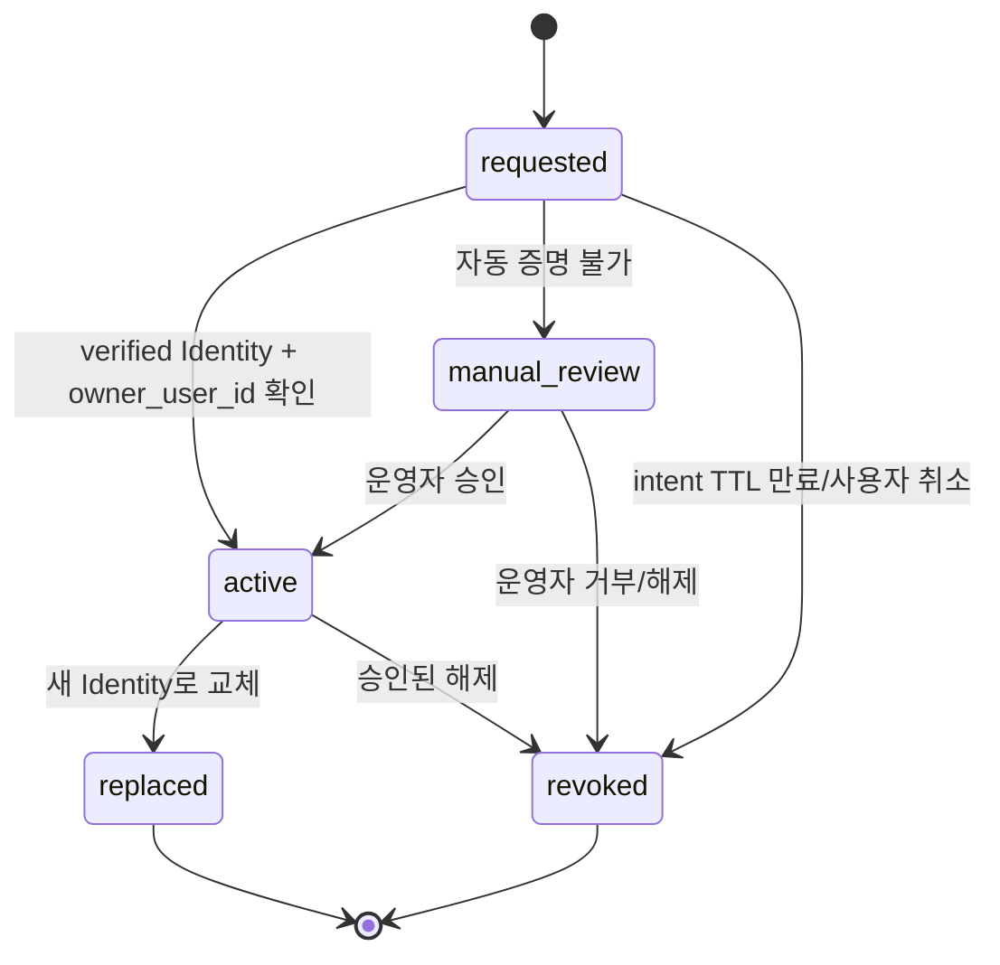
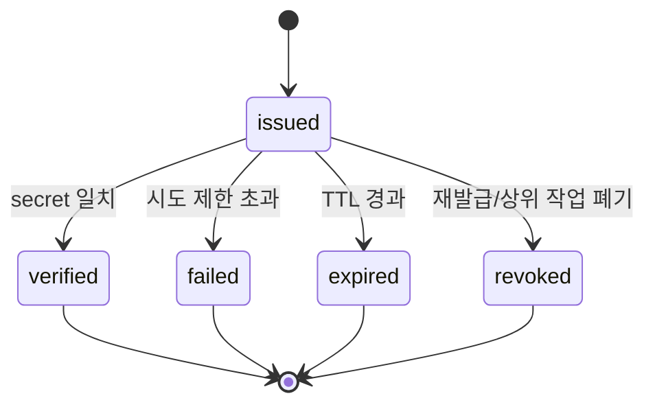
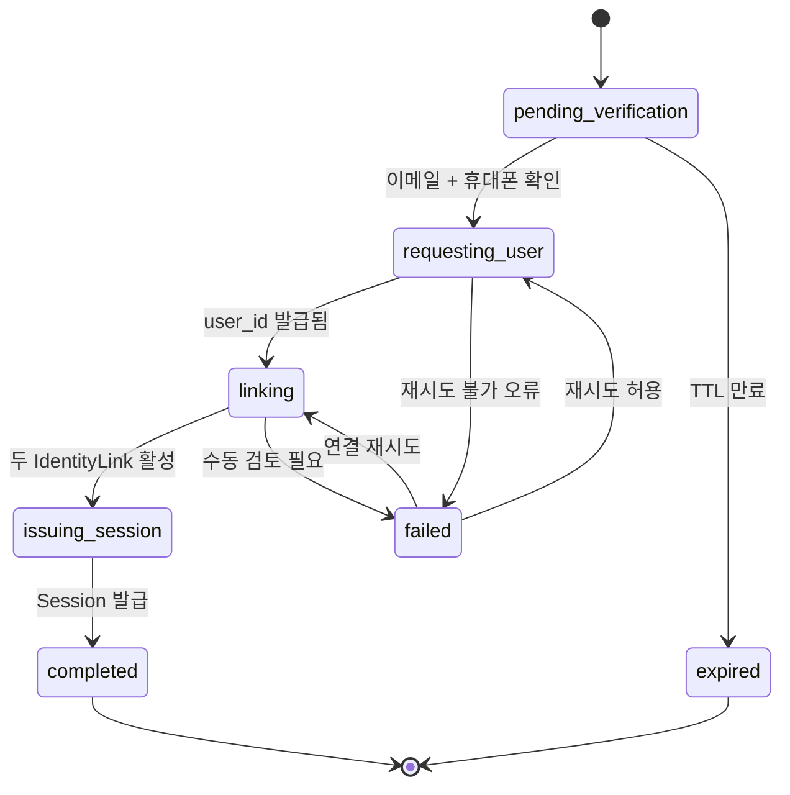
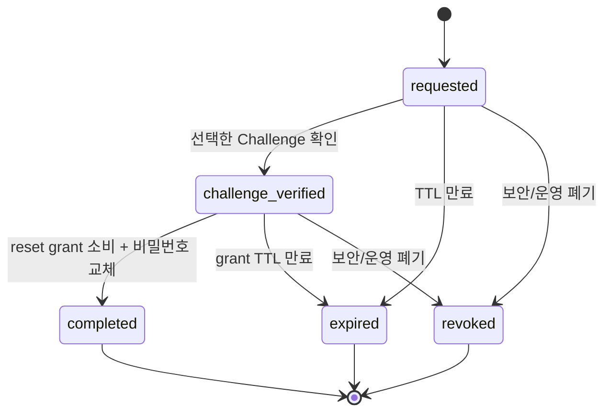
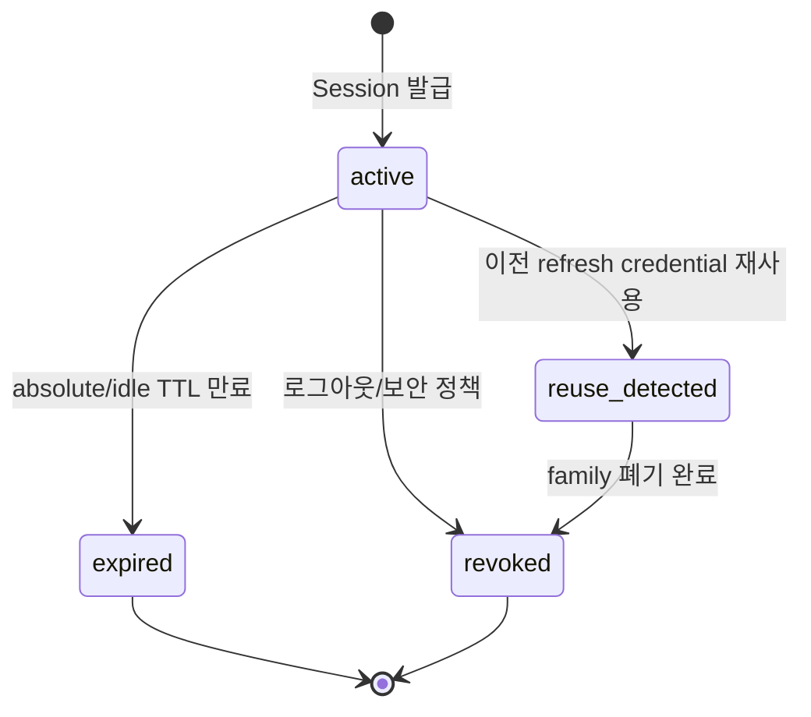

# Context 인증 도메인 모델 설계

## 기본 정보

- Service Design ID: `SD.A.30010`
- 상위 서비스 디자인: `SD.A.300`
- Context: Context 인증
- 근거 문서: [REQ.A.05](../../../00-requirements/REQ_A_05_auth_member.md), [UC.A.300](../../../30-uc/UC_A_300_auth_member.md), [BC.A.300](../../../40-event-storming-bounded-context/BC_A_300_auth_member.md)
- 설계 범위: 인증 식별자와 credential, 소유 확인, 회원가입 조정, 비밀번호 재설정, 인증 식별자와 `user_id` 연결, 로그인 전 복귀 의도, 세션, role/permission grant, 인증 정책과 도메인 규칙.
- 제외 범위: 사용자 프로필, 이름/주소/마케팅 속성, 약관 원문, 추천인 보상, 주문/결제/쿠폰 판단, DB 물리 스키마, HTTP 요청/응답, 이메일/SMS 실제 발송, 감사 이벤트 저장소.

## 연관 태그

- 요구사항: [REQ.A.05](../../../00-requirements/REQ_A_05_auth_member.md)
- 유스케이스: [UC.A.300](../../../30-uc/UC_A_300_auth_member.md)
- 바운디드 컨텍스트: [BC.A.300](../../../40-event-storming-bounded-context/BC_A_300_auth_member.md)
- 영속성: [SD.A.30020](../A_300_20-persistence/README.md)
- 서비스: [SD.A.30030](../A_300_30-service/README.md)
- API: [SD.A.30040](../A_300_40-api/README.md)

## 기준 문서와 책임 결정

- `REQ.A.05`, `UC.A.300`, `BC.A.300`, `SD.A.300`을 인증 설계의 현재 기준으로 사용한다.
- Context 사용자가 `user_id`와 사용자 계정 생명주기를 소유한다. Context 인증은 `user_id`를 생성하지 않고 발급 결과를 참조한다.
- 기존 `features/auth-user` 문서와 `user_id` 발급 책임이 충돌하면 이 문서와 `REQ.A.05`의 결정을 우선한다. 기존 문서는 구현 이력 자료로만 본다.
- Context 인증은 사용자 프로필을 알지 않는다. 회원가입 화면의 이름·추천인·동의 입력은 BFF가 담당 Context에 먼저 전달하고, 인증 API는 담당 Context가 발급한 opaque request/reference만 받는다.
- role/permission grant는 Context 인증이 발급 credential에 반영할 최소 인가 정보다. 도메인 리소스 소유권과 구매 가능 여부는 각 업무 Context가 최종 판단한다.

## 설계 원칙

- 이메일, 휴대폰 번호, ProviderSubject는 `Identity`로 표현하고 비밀번호는 이메일 Identity에 속한 `PasswordCredential`로 표현한다.
- 정규화된 이메일/휴대폰 원문을 식별자나 토큰 claim으로 사용하지 않는다. 조회 키, 암호화 값, 마스킹 표시값을 분리한다.
- 하나의 Identity는 생명주기 전체에서 하나의 `user_id`에만 귀속된다. 링크가 닫혀도 다른 `user_id`로 이전할 수 없다.
- 이메일과 휴대폰 소유 확인, Context 사용자의 `user_id` 발급, 두 Identity 연결, 자동 로그인은 `Registration`이 하나의 장기 실행 작업으로 조정한다.
- 인증번호와 인증 링크는 `VerificationChallenge`로 관리하며 원문을 저장하지 않는다.
- 비밀번호 재설정은 일반 소유 확인과 분리된 단일 사용 `PasswordReset` 권한으로 관리한다.
- 로그인 전 redirect target과 사용자 행동은 `AuthenticationIntent`에 보존한다. 로그인된 사용자를 전제로 하는 `Session`에 넣지 않는다.
- 웹은 서버 검증형 opaque session cookie를 사용하고, 모바일은 짧은 수명의 access JWT와 회전 가능한 opaque refresh token을 사용한다.
- 모바일 access token과 내부 요청 Context token은 issuer, audience, TTL, claim 집합을 분리한다.
- 비밀번호 변경, 인증 식별자 잠금/폐기, 고위험 인증 수단 변경, refresh 재사용 탐지는 정책에 따라 세션을 폐기한다.
- Domain Event는 발생 사실을 나타낸다. 감사 전송 성공 여부는 outbox와 integration event 처리 결과이며 Aggregate 상태명이 아니다.

## 모델 개요

## Aggregate Root

| Aggregate ID | 이름 | 책임 | 생명주기 |
| --- | --- | --- | --- |
| `AGG.A.300-01` | Identity | 인증 식별자 값, 소유 확인, 영구 `user_id` 귀속, 로그인 가능 상태, 실패 잠금과 닫힘 상태를 관리한다. | 생성됨 -> 검증됨 -> 잠금/대체/폐기 |
| `AGG.A.300-02` | IdentityLink | Identity와 `user_id`의 연결 이력, 현재 활성 연결, 교체와 수동 처리를 관리한다. | 요청됨 -> 활성 -> 교체/폐기/수동 검토 |
| `AGG.A.300-03` | Session | 채널별 로그인 세션, credential 회전, 로그아웃과 재사용 탐지를 관리한다. | 발급됨 -> 활성 -> 만료/폐기/재사용 탐지 |
| `AGG.A.300-04` | VerificationChallenge | 이메일 링크와 SMS 인증번호의 목적, 횟수, TTL, 단일 사용 상태를 관리한다. | 발급됨 -> 검증/실패/만료/폐기 |
| `AGG.A.300-05` | Registration | 이메일·휴대폰 확인, 사용자 생성 요청, Identity 연결, 자동 Session 발급을 멱등하게 조정한다. | 시작됨 -> 검증 대기 -> 사용자 연결 -> 완료/실패/만료 |
| `AGG.A.300-06` | PasswordReset | 계정 노출 없이 재설정 요청을 만들고 검증된 Challenge를 단일 사용 비밀번호 변경 권한으로 전환한다. | 요청됨 -> 검증됨 -> 완료/만료/폐기 |
| `AGG.A.300-07` | AuthenticationIntent | 로그인 전 검증된 내부 복귀 위치와 사용자 행동을 보존하고 한 번만 소비한다. | 생성됨 -> 활성 -> 소비/만료 |
| `AGG.A.300-08` | AccessGrant | `user_id`별 role/permission grant와 claim 버전을 관리한다. | 생성됨 -> 활성 -> 교체/폐기 |
| `AGG.A.300-09` | UserAuthState | Context 사용자의 제한·비활성 version을 반영해 새 인증과 refresh 가능 여부를 관리한다. | active -> restricted/deactivated -> active |

## Identity Aggregate

### 필드

| 필드 | 타입 | 설명 | 출처 | 상태 |
| --- | --- | --- | --- | --- |
| `identity_id` | IdentityId | 인증 식별자 고유 ID | `AGG.A.300-01` | 확정 |
| `identity_type` | IdentityType | email, phone, provider_subject, passkey 구분 | `REQ.A.05` | 확정 |
| `lookup_key` | IdentityLookupKey | 정규화 값으로 만든 keyed hash. 정확 일치 조회와 중복 방지에만 사용한다. | `REQ.A.05.FR-006`, `REQ.A.05.NFR-010` | 확정 |
| `encrypted_value` | EncryptedIdentityValue | 표시/운영에 필요한 정규화 값을 envelope encryption으로 보호한 값 | `REQ.A.05.NFR-004` | 확정 |
| `masked_value` | MaskedIdentityValue | 화면과 CS 조회에서 사용할 마스킹 값 | `REQ.A.05.NFR-004` | 확정 |
| `verification_status` | VerificationStatus | 소유 확인 진행 상태 | `REQ.A.05.FR-005`, `REQ.A.05.FR-027` | 확정 |
| `credential_status` | CredentialStatus | 로그인 가능, 잠금, 비밀번호 재설정 필요, 폐기·대체 상태 | `REQ.A.05.FR-015`, `REQ.A.05.FR-029`, `REQ.A.05.FR-033` | 확정 |
| `password_reset_required_at` | time.Time? | 안전하지 않은 hash·보안 정책으로 비밀번호 재설정이 필요해진 시각 | `REQ.A.05.FR-015` | 확정 |
| `password_reset_reason` | string? | 외부에 직접 노출하지 않는 일반화된 정책 사유 | `REQ.A.05.FR-015` | 확정 |
| `owner_user_id` | UserId? | 처음 활성 연결 시 고정되는 영구 귀속 사용자. 다른 `user_id`로 변경할 수 없다. | `REQ.A.05.NFR-010` | 확정 |
| `failure_count` | int | 현재 실패 집계 구간의 로그인 실패 횟수 | `REQ.A.05.NFR-019` | 확정 |
| `failure_window_started_at` | time.Time? | 실패 집계 구간 시작 시각 | `REQ.A.05.NFR-019` | 확정 |
| `lock_until` | time.Time? | 잠금 해제 가능 시각 | `REQ.A.05.FR-029` | 확정 |
| `superseded_by_identity_id` | IdentityId? | 휴대폰 번호 교체 시 새 Identity | `REQ.A.05.FR-033` | 확정 |
| `created_at` | time.Time | 생성 시각 | 공통 | 확정 |
| `updated_at` | time.Time | 최근 변경 시각 | 공통 | 확정 |
| `version` | int64 | 낙관적 잠금 버전 | 동시 로그인/변경 정합성 | 확정 |

### PasswordCredential Entity

비밀번호는 이메일 주소와 다른 생명주기를 갖지만 이메일 Identity의 로그인 credential이므로 Identity Aggregate 안에서 관리한다.

| 필드 | 타입 | 설명 |
| --- | --- | --- |
| `password_credential_id` | PasswordCredentialId | 비밀번호 credential 고유 ID |
| `identity_id` | IdentityId | 소속 이메일 Identity |
| `password_hash` | string | 검증용 비밀번호 해시. 평문과 복호화 가능한 값은 저장하지 않는다. |
| `hash_algorithm` | PasswordHashAlgorithm | 해시 알고리즘 식별자 |
| `hash_parameters` | PasswordHashParameters | 메모리/반복/병렬성 등 검증 파라미터 |
| `credential_version` | int | 비밀번호 교체 순번 |
| `status` | PasswordCredentialStatus | active, replaced, revoked |
| `changed_at` | time.Time | 비밀번호 설정/변경 시각 |
| `replaced_at` | time.Time? | 새 비밀번호로 교체된 시각 |

### 불변조건

- Identity의 `lookup_key`는 `identity_type`별로 유일하다.
- `owner_user_id`는 한 번 설정되면 비울 수 없고 다른 `user_id`로 바꿀 수 없다.
- `owner_user_id`와 IdentityLink가 없는 Identity는 사용자 귀속이 아니라 가입 예약이다. 기존 Registration이 failed/expired이고 cooldown을 지났으면 같은 Identity 행을 새 Registration이 잠금 재사용할 수 있으며, 새 가입에 필요한 Challenge를 다시 검증한다.
- verified가 아닌 Identity는 active IdentityLink에 연결할 수 없다.
- locked, password_reset_required, revoked, superseded Identity는 새 Session 발급에 사용할 수 없다.
- 이메일 Identity에만 active PasswordCredential을 둘 수 있고 active 비밀번호는 정확히 하나다.
- 비밀번호 검증 성공 시 필요하면 최신 해시 정책으로 재해시하되 같은 트랜잭션에서 credential version을 올린다.
- 실패 횟수, 집계 구간, 잠금 시간은 `LoginLockPolicy`의 현재 스냅샷을 적용하며 숫자 5를 코드에 고정하지 않는다.
- 휴대폰 번호 교체로 닫힌 기존 Identity는 삭제하지 않고 superseded 또는 revoked로 남긴다.

### 상태 전이

## IdentityLink Aggregate

### 필드

| 필드 | 타입 | 설명 |
| --- | --- | --- |
| `identity_link_id` | IdentityLinkId | 연결 이력 고유 ID |
| `identity_id` | IdentityId | 연결 대상 Identity |
| `user_id` | UserId | Context 사용자가 발급한 사용자 식별자 |
| `link_status` | IdentityLinkStatus | requested, active, replaced, revoked, manual_review |
| `link_reason` | LinkReason | signup, signin_link, phone_change, manual_operation |
| `proof_challenge_id` | VerificationChallengeId? | 연결 소유 증명에 사용한 Challenge |
| `reauthentication_proof_id` | ReauthenticationProofId? | 요청 시작 시 소비한 목적 한정 재인증 proof 참조 |
| `previous_identity_link_id` | IdentityLinkId? | 교체/재연동 전 연결 |
| `requested_at` | time.Time | 연결 요청 시각 |
| `intent_expires_at` | time.Time? | requested link/phone replacement 완료 기한 |
| `activated_at` | time.Time? | 활성 연결 시각 |
| `closed_at` | time.Time? | 교체/폐기 시각 |
| `closed_reason` | string? | 운영/보안 사유 코드 |
| `version` | int64 | 낙관적 잠금 버전 |

### 불변조건

- active 연결은 verified Identity와 해당 Identity의 `owner_user_id`가 같은 `user_id`일 때만 만들 수 있다.
- 하나의 Identity에는 동시에 하나의 active IdentityLink만 존재한다.
- API의 `linkIntentId`와 `replacementId`는 별도 Aggregate가 아니라 requested `IdentityLinkId`다. phone_change 요청은 `previous_identity_link_id`로 기존 active phone Link를 가리킨다.
- requested Link는 현재 Session 사용자, 목적에 맞게 소비한 ReauthenticationProof, 완료 기한을 저장하며 만료 뒤 active로 전환할 수 없다.
- 같은 Identity에 과거 Link가 여러 개 존재할 수 있지만 모든 Link의 `user_id`는 같다.
- 사용자 계정 병합은 IdentityLink 상태 전이로 표현하지 않는다.
- 휴대폰 번호 변경은 기존 Link를 replaced로 닫고 새 Identity에 같은 `user_id`의 active Link를 만든다.
- 수동 처리는 승인자, 사유, 증명 자료 참조가 있는 service command로만 실행한다.
- IdentityLink 교체/폐기 시 `SessionRevocationPolicy`에 따라 영향받는 Session을 함께 폐기한다.
- requested Link가 `intent_expires_at`을 넘으면 `revoked(intent_expired)`로 닫고 Challenge와 미소비 proof를 폐기한다. owner/다른 Link가 없는 pending Identity는 개인정보 cooldown 뒤 crypto-shred 또는 hard delete한다.

### 상태 전이

## VerificationChallenge Aggregate

### 필드

| 필드 | 타입 | 설명 |
| --- | --- | --- |
| `verification_challenge_id` | VerificationChallengeId | Challenge 고유 ID |
| `purpose` | VerificationPurpose | signup_email, signup_phone, phone_signin, password_reset, phone_change, identity_link |
| `channel` | VerificationChannel | email_link, email_code, sms_code |
| `target_lookup_key` | IdentityLookupKey | 대상 인증 식별자의 keyed hash |
| `identity_id` | IdentityId? | 기존 Identity가 확인된 경우 내부 참조 |
| `context_id` | VerificationContextId | Registration, PasswordReset, IdentityLink 등 상위 작업 참조 |
| `secret_hash` | string | 인증번호/링크 token의 단방향 검증 값 |
| `status` | VerificationChallengeStatus | issued, verified, failed, expired, revoked |
| `attempt_count` | int | 검증 실패 횟수 |
| `send_count` | int | 발송 횟수 |
| `next_send_at` | time.Time | 재발송 가능 시각 |
| `expires_at` | time.Time | 만료 시각 |
| `policy_version` | int64 | 발급 시 적용한 VerificationPolicy 버전 |
| `verified_at` | time.Time? | 검증 완료 시각 |
| `created_at` | time.Time | 생성 시각 |
| `version` | int64 | 동시 검증 방지 버전 |

### 불변조건

- Challenge 원문 secret은 저장, 로그, trace, event payload에 남기지 않는다.
- purpose와 channel 조합은 `VerificationPolicy`가 허용한 값만 사용한다.
- verified, expired, revoked Challenge는 다시 검증할 수 없다.
- attempt limit을 넘으면 failed가 되고 새 Challenge를 발급하기 전까지 사용할 수 없다.
- 같은 context와 purpose의 active Challenge는 하나만 허용하고 재발급 시 이전 Challenge를 revoked로 닫는다.
- API 외부 응답은 Identity 존재 여부를 드러내지 않는다. 내부 감사 결과에는 일반화된 사유 코드만 남긴다.

### 상태 전이

## Registration Aggregate

Registration은 여러 Aggregate와 Context를 묶는 영속 Process Manager다. 사용자 프로필을 소유하지 않고 담당 Context 호출의 상태와 opaque reference만 관리한다.

### 필드

| 필드 | 타입 | 설명 |
| --- | --- | --- |
| `registration_id` | RegistrationId | 회원가입 작업 ID |
| `status` | RegistrationStatus | pending_verification, requesting_user, linking, issuing_session, completed, failed, expired |
| `authentication_intent_id` | AuthenticationIntentId? | 로그인 후 복귀와 사전 인증 소유 증명에 사용하는 Intent |
| `email_identity_id` | IdentityId | 이메일 Identity |
| `phone_identity_id` | IdentityId | 휴대폰 Identity |
| `email_challenge_id` | VerificationChallengeId? | 명시적 발급 요청으로 만든 현재 이메일 소유 확인 Challenge |
| `phone_challenge_id` | VerificationChallengeId? | 명시적 발급 요청으로 만든 현재 휴대폰 소유 확인 Challenge |
| `user_creation_request_id` | ExternalRequestId? | Context 사용자 호출 멱등 키/참조 |
| `user_id` | UserId? | Context 사용자가 발급한 사용자 ID |
| `agreement_receipt_id` | ExternalReferenceId? | 동의 담당 Context가 발급한 opaque 참조 |
| `profile_request_id` | ExternalRequestId? | 프로필 생성 요청 참조. 프로필 값은 저장하지 않는다. |
| `client_channel` | ClientChannel | 자동 로그인 Session을 발급할 채널 |
| `remember_me` | bool | 자동 로그인에 적용할 로그인 상태 유지 선택 |
| `session_policy_version` | int64 | 재시도에서도 동일하게 적용할 TokenTtlPolicy 버전 |
| `session_id` | SessionId? | 자동 로그인으로 발급한 Session |
| `expires_at` | time.Time | 가입 작업 만료 시각 |
| `completed_at` | time.Time? | 완료 시각 |
| `failure_code` | RegistrationFailureCode? | 재시도/운영 확인용 실패 코드 |
| `version` | int64 | 멱등 진행과 낙관적 잠금 버전 |

### 불변조건

- 현재 Registration에 연결된 email과 phone Challenge가 모두 존재하고 verified가 되기 전에는 Context 사용자에 사용자 생성을 요청하지 않는다.
- method별 발급/재발급은 현재 Challenge 참조 하나만 설정한다. 재발급 시 이전 issued Challenge를 revoked로 닫은 뒤 새 ID로 교체한다.
- `user_creation_request_id`는 registration별로 고정하며 재시도해도 같은 `user_id` 결과를 받아야 한다.
- `user_id`를 받은 뒤 두 Identity의 `owner_user_id`를 같은 값으로 설정하고 active IdentityLink를 만든다.
- 일부 연결만 성공한 경우 동일 registration이 나머지 작업을 재시도한다. 새 사용자나 중복 Link를 만들지 않는다.
- Session은 두 Link가 모두 active이고 AccessGrant를 읽은 뒤 정확히 한 번 발급한다.
- 회원가입 자동 로그인 Session은 email IdentityLink를 인증 근거로 저장하고 `authentication_method=registration_verified`를 사용한다. 두 가입 Challenge의 검증 시각을 `last_authenticated_at`의 근거로 삼는다.
- 프로필, 추천인, 약관 원문은 Registration에 저장하지 않는다.

### 상태 전이

## PasswordReset Aggregate

### 필드

| 필드 | 타입 | 설명 |
| --- | --- | --- |
| `password_reset_id` | PasswordResetId | 재설정 작업 ID |
| `identity_id` | IdentityId? | 존재하는 이메일 Identity의 내부 참조. 외부에 노출하지 않는다. |
| `authentication_intent_id` | AuthenticationIntentId? | 사전 인증 소유 증명과 완료 후 복귀에 사용하는 Intent |
| `challenge_id` | VerificationChallengeId? | 사용자가 선택한 이메일 또는 휴대폰 Challenge |
| `status` | PasswordResetStatus | requested, challenge_verified, completed, expired, revoked |
| `reset_grant_hash` | string? | Challenge 완료 후 발급하는 단일 사용 재설정 권한의 해시 |
| `expires_at` | time.Time | 작업/권한 만료 시각 |
| `policy_version` | int64 | 생성 시 적용한 Verification/SessionRevocation 정책 버전 |
| `completed_at` | time.Time? | 비밀번호 변경 완료 시각 |
| `version` | int64 | 중복 소비 방지 버전 |

### 불변조건

- 비밀번호 재설정 시작 응답은 Identity 존재 여부와 관계없이 같은 외부 형태를 사용한다.
- 이메일 또는 휴대폰 Challenge 중 사용자가 선택한 하나만 verified이면 재설정 권한을 발급할 수 있다.
- reset grant는 목적, 대상 Identity, PasswordReset ID에 묶인 단일 사용 값이다.
- verified 이메일 Identity와 active PasswordCredential이 있어야 한다. Identity credential 상태는 active, locked, password_reset_required에서 reset을 허용하고 revoked/superseded는 거부한다.
- 완료 시 기존 PasswordCredential을 replaced로 닫고 새 credential version을 만든다.
- 완료 시 대상 `user_id`의 모든 Session과 refresh family를 폐기한다. `password_reset` trigger에는 `user_sessions`보다 좁은 범위를 설정할 수 없다.

### 상태 전이

## AuthenticationIntent Aggregate

### 필드

| 필드 | 타입 | 설명 |
| --- | --- | --- |
| `authentication_intent_id` | AuthenticationIntentId | 로그인 전 의도 ID |
| `redirect_target` | RedirectTarget | 허용된 내부 경로 |
| `action` | AuthenticatedAction? | 관심, 알림, 장바구니, 구매 등 복구할 행동 코드 |
| `action_payload_ref` | EncryptedPayloadReference? | Auth의 단기 암호화 ActionIntentPayload 참조 |
| `client_channel` | ClientChannel | web, mobile |
| `owner_proof_hash` | string | 웹 사전 인증 cookie 또는 모바일 auth flow token 검증용 해시 |
| `csrf_secret_hash` | string? | 웹 unsafe method에 사용하는 CSRF token 검증용 해시 |
| `status` | AuthenticationIntentStatus | active, consumed, expired |
| `expires_at` | time.Time | 만료 시각 |
| `consumed_by_session_id` | SessionId? | 로그인 성공 후 소비한 Session |
| `consumption_reason` | AuthenticationIntentConsumptionReason? | session_issued, password_reset_completed, cancelled |
| `created_at` | time.Time | 생성 시각 |
| `consumed_at` | time.Time? | 소비 시각 |

### 불변조건

- redirect target은 allowlist를 통과한 내부 경로 또는 서버가 발급한 action code만 허용한다.
- 외부 URL, scheme-relative URL, 제어 문자, 이중 인코딩 우회 값은 거부한다.
- active Intent만 한 번 소비할 수 있다. session_issued 소비는 발급 Session과 연결하고, password_reset_completed/cancelled 소비는 Session 없이 종료할 수 있다.
- owner proof와 CSRF token 원문은 저장하지 않고 AuthenticationIntent, client channel, TTL에 묶어 검증한다.
- 사용자 프로필과 결제수단 원문을 action payload에 넣지 않는다.
- ActionIntentPayload는 action별 schema를 통과한 최소 필드만 암호화하고 Intent와 같은 TTL을 적용한다. 로그인 성공 뒤 BFF에 한 번 전달하거나 만료되면 crypto-shred한다.

## Session Aggregate

### 필드

| 필드 | 타입 | 설명 |
| --- | --- | --- |
| `session_id` | SessionId | 세션 고유 ID |
| `user_id` | UserId | 로그인된 사용자 식별자 |
| `identity_id` | IdentityId | 로그인에 사용된 Identity |
| `identity_link_id` | IdentityLinkId | 로그인 당시 active Link |
| `authentication_method` | AuthenticationMethod | 현재 Session의 인증 근거 |
| `last_authenticated_at` | time.Time | 로그인 또는 최근 강한 재인증 시각 |
| `access_grant_id` | AccessGrantId | 발급 당시 AccessGrant |
| `access_grant_version` | int64 | claim에 반영한 grant 버전 |
| `client_channel` | ClientChannel | web, mobile |
| `remember_me` | bool | 로그인 상태 유지 선택 여부 |
| `token_policy_version` | int64 | 발급 시 적용한 TokenTtlPolicy 버전 |
| `session_status` | SessionStatus | active, expired, revoked, reuse_detected |
| `issued_at` | time.Time | 발급 시각 |
| `idle_expires_at` | time.Time? | 웹 세션 유휴 만료 시각 |
| `absolute_expires_at` | time.Time | 세션 최대 만료 시각 |
| `last_seen_at` | time.Time? | 유휴 만료 갱신 기준 시각 |
| `revoked_at` | time.Time? | 폐기 시각 |
| `revocation_reason` | SessionRevocationReason? | 로그아웃, password_reset, identity_change, refresh_reuse 등 |
| `version` | int64 | rotation/폐기 동시성 제어 버전 |

### 통신 구간별 인증 수단

| 구간 | 기본 인증 수단 | 도메인 규칙 |
| --- | --- | --- |
| 웹 클라이언트 -> 서버 | HttpOnly, Secure, SameSite cookie의 opaque session credential | 브라우저 저장소에 JWT나 refresh token을 두지 않는다. session fixation 방지를 위해 로그인 성공 시 credential을 새로 발급한다. |
| 모바일 앱 -> 서버 | access JWT + opaque refresh token | access JWT는 짧은 수명의 발급 결과물이다. refresh token은 SessionCredential로 저장·회전한다. |
| Ingress/BFF -> 내부 서비스 | 짧은 TTL의 internal context JWT 또는 signed request context | 외부 token과 별도 issuer/audience/key를 사용하고 브라우저/앱에 노출하지 않는다. |
| 서비스 -> 서비스 | mTLS, workload identity, service account | 사용자 Session과 분리된 인프라/IAM 책임이다. |
| 이벤트/감사 | token 원문 없음 | `user_id`, `session_id`, `correlation_id`, `occurred_at`, 일반화된 결과 코드만 전달한다. |

### SessionCredential Entity

| 필드 | 타입 | 설명 |
| --- | --- | --- |
| `session_credential_id` | SessionCredentialId | credential 고유 ID |
| `session_id` | SessionId | 소속 Session |
| `credential_type` | SessionCredentialType | web_session_cookie, mobile_refresh_token |
| `credential_status` | SessionCredentialStatus | active, rotated, expired, revoked, reuse_detected |
| `secret_hash` | string | opaque credential 원문 대신 저장하는 검증용 해시 |
| `csrf_key_version` | int16? | 웹 Session credential에 묶인 CSRF token 도출 키 버전. 모바일은 비운다. |
| `refresh_family_id` | RefreshFamilyId? | 모바일 refresh rotation 묶음 |
| `issued_at` | time.Time | 발급 시각 |
| `expires_at` | time.Time | credential 만료 시각 |
| `rotated_from_credential_id` | SessionCredentialId? | 이전 credential |
| `rotated_to_credential_id` | SessionCredentialId? | 다음 credential |
| `revoked_at` | time.Time? | 폐기 시각 |
| `reuse_detected_at` | time.Time? | 이전 credential 재사용 탐지 시각 |

### 불변조건

- Session과 SessionCredential 원문은 저장하지 않는다.
- active 상태가 아닌 SessionCredential은 인증이나 재발급에 사용할 수 없다.
- web_session_cookie에는 `csrf_key_version`이 필요하다. CSRF token은 credential ID와 `secret_hash`에 키 버전을 적용해 도출하며 credential 회전 시 함께 바뀐다.
- mobile_refresh_token에는 `csrf_key_version`을 두지 않고 Bearer token에 CSRF 검사를 적용하지 않는다.
- refresh rotation은 이전 credential을 rotated로 만든 뒤 새 credential을 같은 트랜잭션에서 생성한다.
- rotated/revoked credential이 다시 사용되면 Session과 같은 refresh family를 reuse_detected로 전환하고 폐기한다.
- access JWT는 저장 Entity가 아니며 기본 TTL은 15분이다. 즉시 무효화가 필요한 요청은 Session 상태 또는 grant version을 확인한다.
- 웹 Session은 idle TTL과 absolute TTL을 구분한다. remember-me는 absolute TTL 정책을 바꾸되 무기한 세션을 만들지 않는다.
- 로그아웃, Identity/Link 폐기, 고위험 인증 수단 변경, refresh 재사용 탐지의 폐기 범위를 `SessionRevocationPolicy`로 결정한다. 비밀번호 재설정은 예외 없이 해당 사용자의 전체 Session과 refresh family를 폐기한다.

### 상태 전이

## AccessGrant Aggregate

AccessGrant는 인증 Context가 credential에 반영하는 role/permission 정보다. 사용자 프로필이나 업무 리소스 소유권은 포함하지 않는다.

### 필드

| 필드 | 타입 | 설명 |
| --- | --- | --- |
| `access_grant_id` | AccessGrantId | Grant 고유 ID |
| `user_id` | UserId | 대상 사용자 |
| `roles` | set<Role> | CUSTOMER, SELLER, PLATFORM_OPERATOR 등 거친 역할 |
| `permissions` | set<Permission> | 운영/관리 API에 필요한 최소 권한 코드 |
| `grant_version` | int64 | token/context의 권한 최신성 판단 버전 |
| `status` | AccessGrantStatus | active, revoked |
| `source` | AccessGrantSource | 역할/권한 변경 출처 |
| `valid_from` | time.Time | 유효 시작 시각 |
| `valid_until` | time.Time? | 임시 권한 만료 시각 |
| `changed_by_user_id` | UserId? | 운영 변경 주체 |
| `change_reason` | string? | 변경 사유 코드 |
| `updated_at` | time.Time | 최근 변경 시각 |

### 불변조건

- 사용자별 active AccessGrant는 하나이며 모든 변경은 grant_version을 증가시킨다.
- CUSTOMER 기본 role은 사용자 생성 완료 후 부여한다.
- SELLER/PLATFORM_OPERATOR role은 담당 Context 또는 승인된 운영 명령에서만 반영한다.
- permission은 role보다 좁은 운영 기능에 사용하고 도메인 리소스 소유권을 대신하지 않는다.
- 고위험 권한 변경과 break-glass 권한은 승인자, 사유, 만료 시각을 필수로 한다.
- 권한을 축소하거나 폐기하면 영향받는 Session의 claim version을 즉시 무효화한다.

### 발급 claim

| 발급물 | 필수 claim | 제외 claim |
| --- | --- | --- |
| MobileAccessClaims | `iss`, `sub=user_id`, `sid`, `aud`, `roles`, `permission_version`, `iat`, `exp`, `jti` | email, phone, identity_id, profile |
| InternalContextClaims | `iss`, `sub=user_id`, `sid`, `aud`, `roles`, `permissions` 또는 `permission_version`, `iat`, `exp`, `jti` | email, phone, 외부 provider 정보, profile |

## UserAuthState Aggregate

| 필드 | 타입 | 설명 |
| --- | --- | --- |
| `user_id` | UserId | Context 사용자가 발급한 Aggregate 식별자 |
| `status` | UserAuthStatus | active, restricted, deactivated |
| `restriction_version` | int64 | Context 사용자 이벤트의 단조 증가 version |
| `reason_code` | string? | 외부에 직접 노출하지 않는 제한 사유 |
| `effective_at` | time.Time | 제한/해제 효력 시각 |
| `source_event_id` | string | 멱등 반영할 원천 event ID |
| `updated_at` | time.Time | 마지막 반영 시각 |

- restricted/deactivated 상태에서는 새 Session, refresh, ReauthenticationProof를 발급하지 않는다.
- 제한 이벤트를 반영할 때 active AccessGrant와 기존 Session을 폐기한다. 낮거나 같은 source version은 재적용하지 않는다.
- active 복귀는 Context 사용자의 더 높은 version 해제 이벤트로만 허용한다. Auth가 timeout이나 사용자 입력만으로 제한을 해제하지 않는다.

## Identifier

| Identifier ID | 이름 | 소유/발급 책임 | 도메인 규칙 |
| --- | --- | --- | --- |
| `ID.A.300-01` | IdentityId | Context 인증 | 이메일/휴대폰/provider subject 원문과 분리한다. |
| `ID.A.300-02` | IdentityLinkId | Context 인증 | 연결 이력 하나를 구분한다. |
| `ID.A.300-03` | SessionId | Context 인증 | credential 원문과 혼용하지 않는다. |
| `ID.A.300-04` | UserId | Context 사용자 | Context 인증은 생성하지 않고 참조한다. |
| `ID.A.300-05` | RefreshFamilyId | Context 인증 | 모바일 refresh rotation 묶음을 구분한다. |
| `ID.A.300-06` | SessionCredentialId | Context 인증 | 외부 credential 원문과 분리한다. |
| `ID.A.300-07` | PasswordCredentialId | Context 인증 | 비밀번호 버전 하나를 구분한다. |
| `ID.A.300-08` | VerificationChallengeId | Context 인증 | 소유 확인 시도 하나를 구분한다. |
| `ID.A.300-09` | RegistrationId | Context 인증 | 회원가입 장기 실행 작업을 구분한다. |
| `ID.A.300-10` | PasswordResetId | Context 인증 | 비밀번호 재설정 작업을 구분한다. |
| `ID.A.300-11` | AuthenticationIntentId | Context 인증 | 로그인 전 복귀 의도 하나를 구분한다. |
| `ID.A.300-12` | AccessGrantId | Context 인증 | role/permission grant 버전을 구분한다. |
| `ID.A.300-13` | ReauthenticationProofId | Context 인증 | 고위험 작업용 단기 proof 레코드를 구분한다. |

## Value Object

| VO ID | 이름 | 필드 | 불변조건 |
| --- | --- | --- | --- |
| `VO.A.300-01` | EmailAddress | normalized_value | 이메일 형식과 정규화만 검증한다. 소유 확인 여부는 Identity 상태가 담당한다. |
| `VO.A.300-02` | PhoneNumber | country_code, national_number | E.164 정규화와 형식만 검증한다. SMS 확인 여부는 Challenge가 담당한다. |
| `VO.A.300-03` | ProviderSubject | provider, subject_id | provider subject이며 이메일과 혼용하지 않는다. MVP 이후 사용한다. |
| `VO.A.300-04` | IdentityLookupKey | identity_type, keyed_hash, key_version | 정확 일치 조회와 유일성에만 사용한다. 원문을 복원할 수 없어야 한다. |
| `VO.A.300-05` | TokenTtlPolicy | web_idle_ttl, web_absolute_ttl, access_ttl, refresh_ttl, remember_me_ttl, internal_context_ttl | 초기 access 15분, refresh 14일, remember-me 30일. 실행 시 정책 버전을 기록한다. |
| `VO.A.300-06` | RefreshRotationPolicy | enabled, reuse_action | 이전 모바일 refresh credential 재사용 시 family와 Session을 폐기한다. |
| `VO.A.300-07` | LoginLockPolicy | threshold, window, lock_duration, reset_on_success | threshold 기본값은 5이며 배포 없이 변경 가능해야 한다. |
| `VO.A.300-08` | VerificationPolicy | purpose, ttl, max_attempts, max_sends, resend_interval | 이메일/SMS 목적별 제한을 분리한다. |
| `VO.A.300-09` | RedirectTarget | normalized_path, action_code | 내부 allowlist와 정규화 검증을 통과해야 한다. |
| `VO.A.300-10` | SessionRevocationPolicy | trigger, scope | current_session, identity_sessions, user_sessions, refresh_family 범위를 선택하되 password_reset은 user_sessions + refresh_family로 고정한다. |
| `VO.A.300-11` | MobileAccessClaims | iss, sub, sid, aud, roles, permission_version, iat, exp, jti | email/phone/identity_id/profile을 포함하지 않는다. |
| `VO.A.300-12` | InternalContextClaims | iss, sub, sid, aud, roles, permissions, permission_version, iat, exp, jti | 짧은 TTL이며 내부 수신자에만 발급한다. |
| `VO.A.300-13` | IdempotencyKey | scope, digest | 원문을 저장하지 않고 요청 주체와 명령 범위에 묶는다. |
| `VO.A.300-14` | ReauthenticationProof | user_id, session_id, authenticated_identity_id, authentication_method, purpose, authenticated_at, expires_at, nonce | 고위험 작업 하나에만 쓰는 단기 opaque/signed proof다. role/permission AccessGrant와 혼용하지 않는다. |

## State / Enum

| State ID | 이름 | 허용 값 | 도메인 규칙 |
| --- | --- | --- | --- |
| `STATE.A.300-01` | IdentityType | email, phone, provider_subject, passkey | MVP에서는 email, phone만 활성화한다. |
| `STATE.A.300-02` | VerificationStatus | pending, verified, failed, expired | verified만 active Link를 만들 수 있다. |
| `STATE.A.300-03` | CredentialStatus | active, locked, password_reset_required, revoked, superseded | active만 새 Session 발급에 사용할 수 있다. |
| `STATE.A.300-04` | PasswordCredentialStatus | active, replaced, revoked | 이메일 Identity마다 active 하나만 허용한다. |
| `STATE.A.300-05` | IdentityLinkStatus | requested, active, replaced, revoked, manual_review | active Link는 Identity당 하나다. |
| `STATE.A.300-06` | VerificationChallengeStatus | issued, verified, failed, expired, revoked | issued만 검증할 수 있다. |
| `STATE.A.300-07` | RegistrationStatus | pending_verification, requesting_user, linking, issuing_session, completed, failed, expired | 완료 전 단계를 멱등하게 재시도한다. |
| `STATE.A.300-08` | PasswordResetStatus | requested, challenge_verified, completed, expired, revoked | grant는 한 번만 소비한다. |
| `STATE.A.300-09` | AuthenticationIntentStatus | active, consumed, expired | active만 한 번 소비한다. |
| `STATE.A.300-10` | SessionStatus | active, expired, revoked, reuse_detected | active만 인증/갱신할 수 있다. |
| `STATE.A.300-11` | SessionCredentialType | web_session_cookie, mobile_refresh_token | 외부 클라이언트의 장기 credential만 저장한다. |
| `STATE.A.300-12` | SessionCredentialStatus | active, rotated, expired, revoked, reuse_detected | active만 인증/갱신할 수 있다. |
| `STATE.A.300-13` | AccessGrantStatus | active, revoked | 사용자별 active 하나만 허용한다. |
| `STATE.A.300-14` | ClientChannel | web, mobile | 발급물과 TTL 정책을 결정한다. |
| `STATE.A.300-15` | AuthenticationMethod | registration_verified, email_password, phone_otp, provider, passkey | Session의 현재 인증 근거와 assurance를 설명한다. |
| `STATE.A.300-16` | UserAuthStatus | active, restricted, deactivated | active만 새 Session/refresh/재인증 proof를 받을 수 있다. |

## Command

| Command ID | 이름 | 주 대상 | 결과 |
| --- | --- | --- | --- |
| `CMD.A.300-01` | 인증 게이트 확인 | AccessGrant/Session Read Model | 공개, 선택적 인증, 필수 인증, 권한 필요 판정 |
| `CMD.A.300-02` | 로그인 의도 보존 | AuthenticationIntent | 검증된 Intent 생성 |
| `CMD.A.300-03` | 이메일 회원가입 시작 | Registration | 가입 작업과 두 Identity 생성 |
| `CMD.A.300-04` | 이메일 소유 확인 | VerificationChallenge/Identity | 이메일 verified |
| `CMD.A.300-05` | 휴대폰 소유 확인 | VerificationChallenge/Identity | 휴대폰 verified |
| `CMD.A.300-06` | 인증 식별자 연결 | Identity/IdentityLink | owner 고정과 active Link 생성 |
| `CMD.A.300-07` | 이메일 로그인 | Identity/PasswordCredential | 로그인 성공 또는 실패/잠금 |
| `CMD.A.300-08` | 휴대폰 번호 로그인 | VerificationChallenge/IdentityLink | 로그인 성공 또는 일반화된 실패 |
| `CMD.A.300-09` | 세션 발급 | Session | 채널별 credential 발급 |
| `CMD.A.300-10` | 토큰 재발급 | Session | refresh rotation |
| `CMD.A.300-11` | 로그아웃 | Session | 현재 Session 폐기 |
| `CMD.A.300-12` | 인증 수단 연동 요청 | Identity/IdentityLink/ReauthenticationProof | requested Link intent 생성 또는 충돌 거부 |
| `CMD.A.300-13` | 인증 수단 수동 처리 | IdentityLink | 승인된 해제/재연동 |
| `CMD.A.300-14` | 휴대폰 번호 셀프 변경 | Identity/IdentityLink | 기존 Link 닫힘과 새 Link 생성 |
| `CMD.A.300-15` | 이메일 재인증 | Session/PasswordCredential/ReauthenticationProof | 현재 비밀번호 검증, Session 재바인딩과 목적 한정 proof 발급 |
| `CMD.A.300-16` | 회원가입 진행 | Registration | user_id 요청, Link, Session 단계 전진 |
| `CMD.A.300-17` | 인증 Challenge 발급 | VerificationChallenge | 목적별 Challenge 발급/재발급 |
| `CMD.A.300-18` | 인증 Challenge 검증 | VerificationChallenge | verified 또는 실패 횟수 증가 |
| `CMD.A.300-19` | 비밀번호 재설정 요청 | PasswordReset | 존재 여부를 숨긴 재설정 작업 생성 |
| `CMD.A.300-20` | 비밀번호 변경 | PasswordReset/Identity | credential 교체와 Session 폐기 |
| `CMD.A.300-21` | 권한 Grant 반영 | AccessGrant | role/permission version 증가 |
| `CMD.A.300-22` | 세션 일괄 폐기 | Session | 정책 범위의 Session 폐기 |
| `CMD.A.300-23` | 인증 정책 변경 | Policy Snapshot | TTL, rotation, lock, verification 정책 변경 |
| `CMD.A.300-24` | 인증 후 행동 복구 | AuthenticationIntent/ActionIntentPayload | 소비된 Intent의 최소 action payload를 같은 Session에 1회 전달 |

## Domain Event

| Event ID | 이름 | 발생 조건 | Audit Context 전달 |
| --- | --- | --- | --- |
| `EVT.A.300-01` | 인증 게이트 적용됨 | 인증/권한 판정 완료 | 필요 시 집계 이벤트 |
| `EVT.A.300-02` | 로그인 의도 보존됨 | AuthenticationIntent 생성 | 민감 payload 제외 |
| `EVT.A.300-03` | 인증 식별자 연결됨 | IdentityLink active | 전달 |
| `EVT.A.300-04` | 이메일 인증 식별자 확인됨 | 이메일 Identity verified | 전달 |
| `EVT.A.300-05` | 휴대폰 인증 식별자 확인됨 | 휴대폰 Identity verified | 전달 |
| `EVT.A.300-06` | 사용자 로그인됨 | credential 검증 성공 | 전달 |
| `EVT.A.300-07` | 세션 발급됨 | Session active | 전달 |
| `EVT.A.300-08` | 토큰 재발급됨 | refresh rotation 성공 | 전달 |
| `EVT.A.300-09` | 사용자 로그아웃됨 | Session revoked | 전달 |
| `EVT.A.300-10` | 인증 수단 연동 요청됨 | Link 요청 생성 | 전달 |
| `EVT.A.300-11` | 인증 수단 수동 변경됨 | 승인 명령 완료 | 전달 |
| `EVT.A.300-18` | 휴대폰 번호 변경 요청됨 | 셀프 변경 시작 | 전달 |
| `EVT.A.300-19` | 새 휴대폰 인증 식별자 확인됨 | 새 번호 Challenge verified | 전달 |
| `EVT.A.300-20` | 휴대폰 인증 식별자 교체됨 | 이전 Link replaced + 새 Link active | 전달 |
| `EVT.A.300-22` | 인증 Challenge 발급됨 | Challenge issued | secret 제외 |
| `EVT.A.300-23` | 인증 Challenge 실패함 | 실패/만료/제한 초과 | 일반화된 사유만 전달 |
| `EVT.A.300-24` | 회원가입 완료됨 | Registration completed | 전달 |
| `EVT.A.300-25` | 비밀번호 변경됨 | PasswordReset completed | 전달 |
| `EVT.A.300-26` | 세션 폐기됨 | 정책에 따른 Session revoke | 전달 |
| `EVT.A.300-27` | Refresh 재사용 탐지됨 | rotated/revoked credential 재사용 | 보안 이벤트로 전달 |
| `EVT.A.300-28` | 권한 Grant 변경됨 | AccessGrant version 증가/폐기 | 전달 |
| `EVT.A.300-29` | 인증 의도 소비됨 | Session 발급 또는 비밀번호 reset 완료로 Intent consumed | 소비 reason과 최소 참조만 전달 |
| `EVT.A.300-30` | 인증 정책 변경됨 | 정책 버전 변경 | 운영 감사로 전달 |
| `EVT.A.300-31` | 로그인 실패함 | email/password 또는 phone signin 실패 | 일반화된 사유 코드만 전달 |
| `EVT.A.300-32` | 인증 식별자 잠김 | LoginLockPolicy 임계치 도달 | policy version과 lock_until 전달 |
| `EVT.A.300-33` | 인증 Challenge 확인됨 | 목적별 Challenge verified | purpose/channel과 비민감 context reference만 전달 |
| `EVT.A.300-34` | 사용자 인증 제한 상태 변경됨 | UserAuthState restriction version 반영 | status, version, 일반화된 reason 전달 |

`BC.A.300`의 `EVT.A.300-12~17`, `EVT.A.300-21`처럼 이름에 `감사 전송됨`이 붙은 항목은 Aggregate가 만드는 Domain Event가 아니라 outbox 전달 결과다. 서비스/영속성 설계에서 위 `EVT.A.300-22~34` Domain Event를 Audit integration event로 변환하고 전달 상태를 관리한다.

## Policy

| Policy ID | 이름 | 규칙 |
| --- | --- | --- |
| `POLICY.A.300-01` | 공개 탐색 허용 | 홈, 목록, 상세, 검색, 공지는 Session을 요구하지 않는다. |
| `POLICY.A.300-02` | 내부 복귀 위치만 허용 | AuthenticationIntent는 검증된 내부 경로와 행동만 보존한다. |
| `POLICY.A.300-03` | 인증 식별자 영구 단일 귀속 | Identity owner는 생명주기 전체에서 하나의 `user_id`로 고정한다. |
| `POLICY.A.300-04` | 설정형 로그인 잠금 | 기본 threshold 5를 사용하되 window와 lock duration을 정책으로 변경한다. |
| `POLICY.A.300-05` | 고위험 인증 수단 변경 | 안전한 Session과 대체 인증이 있으면 허용하고 그렇지 않으면 manual_review로 보낸다. |
| `POLICY.A.300-06` | 후속 인증 MVP 제외 | Apple/Google, 국내 인증, passkey는 확장 지점으로만 둔다. |
| `POLICY.A.300-07` | 인증 책임 최소화 | `user_id` 참조, Identity, credential, Session, role/permission grant만 다룬다. |
| `POLICY.A.300-08` | 사용자 존재 여부 은닉 | 로그인/복구/휴대폰 미연결 외부 오류는 계정 존재 여부를 드러내지 않는다. |
| `POLICY.A.300-09` | 세션 강제 폐기 | credential/권한 보안 상태 변경 시 정책 범위의 Session을 폐기한다. |
| `POLICY.A.300-10` | 감사 원자성 | 도메인 변경과 OutboxEvent 저장을 같은 DB 트랜잭션에 둔다. |
| `POLICY.A.300-11` | 미귀속 가입 예약 회수 | failed/expired Registration의 owner 없는 Identity는 cooldown과 rate limit 뒤 같은 Identity 행으로만 재예약한다. |
| `POLICY.A.300-12` | 사용자 제한 우선 | UserAuthState가 active가 아니면 credential이 맞아도 Session/refresh/재인증을 허용하지 않는다. |
| `POLICY.A.300-13` | 재인증 자격 | verified email Identity, active credential 상태, active PasswordCredential, active UserAuthState에서만 ReauthenticationProof를 발급한다. |

## Business Rule

| Rule ID | 이름 | 규칙 | 적용 대상 |
| --- | --- | --- | --- |
| `RULE.A.300-01` | 이메일과 휴대폰 모두 확인 | 이메일 회원가입은 두 소유 확인이 모두 끝나야 사용자 생성을 요청한다. | Registration |
| `RULE.A.300-02` | 연결된 휴대폰만 로그인 | verified phone Identity와 active Link가 모두 있어야 로그인한다. | VerificationChallenge, IdentityLink |
| `RULE.A.300-03` | 사용자 생성 비소유 | Context 인증은 사용자 생성 결과의 `user_id`만 참조한다. | Registration |
| `RULE.A.300-04` | 채널별 세션 정책 | 웹 opaque session과 모바일 JWT/refresh를 분리하고 각 TTL을 적용한다. | Session |
| `RULE.A.300-05` | 사실 기반 감사 | Domain Event를 outbox로 전달하고 secret 원문을 포함하지 않는다. | 전체 Aggregate |
| `RULE.A.300-06` | 휴대폰 변경은 계정 병합이 아님 | 같은 `user_id`에서 old/new IdentityLink를 교체한다. | Identity, IdentityLink |
| `RULE.A.300-07` | 비밀번호 재설정 단일 사용 | 선택한 인증 수단 하나를 확인한 reset grant는 한 번만 사용한다. | PasswordReset |
| `RULE.A.300-08` | 인가 claim 최소화 | email/phone/profile을 제외하고 role/permission version만 전달한다. | AccessGrant, Session |
| `RULE.A.300-09` | 가입 예약은 영구 귀속이 아님 | owner와 Link가 없는 Identity는 완료되지 않은 가입을 정리한 뒤 재사용할 수 있고, 새 Registration은 소유 확인을 다시 수행한다. | Identity, Registration |
| `RULE.A.300-10` | 사용자 제한 멱등 반영 | Context 사용자 restriction version을 단조 증가로 저장하고 제한 즉시 Grant와 Session을 폐기한다. | UserAuthState, AccessGrant, Session |

## Read Model 후보

| Read Model ID | 이름 | 용도 | 민감 정보 제한 |
| --- | --- | --- | --- |
| `RM.A.300-01` | 인증 진입 Context | 지원 인증 수단, AuthenticationIntent 만료, redirect 결과 | 외부 URL과 원본 action payload 제외 |
| `RM.A.300-02` | 인증 상태 조회 | Identity 상태, 실패/잠금, Link 상태를 CS/운영자에게 제공 | 마스킹 값만 표시, 권한별 필드 제한 |
| `RM.A.300-03` | 세션 정책 조회 | 현재 TTL, rotation, lock, verification 정책 버전 제공 | secret/서명 키 제외 |
| `RM.A.300-04` | 현재 Principal | `user_id`, roles, permissions/version, Session 상태 제공 | email/phone/profile 제외 |
| `RM.A.300-05` | 회원가입 상태 | verified 단계, 사용자 생성/연결/Session 단계 제공 | 이메일/휴대폰 원문 제외 |
| `RM.A.300-06` | 활성 세션 목록 | 채널, 발급/마지막 사용/만료, 폐기 가능 여부 제공 | credential 원문과 해시 제외 |

## 요구사항 추적

| 요구사항 묶음 | 도메인 책임 | 후속 설계 |
| --- | --- | --- |
| `FR-001~003`, `FR-023~025`, `NFR-001~002`, `NFR-016~017` | AuthenticationIntent, 인증 게이트 Policy, 현재 Principal Read Model | 서비스/API에서 공개·선택적·필수·권한 필요 분류 |
| `FR-004~007`, `FR-027`, `NFR-018` | Registration, Identity, PasswordCredential, VerificationChallenge | Context 사용자/동의/프로필 호출과 멱등성 |
| `FR-008~010`, `FR-015`, `FR-026`, `FR-029` | Identity, IdentityLink, VerificationChallenge, UserAuthState, LoginLockPolicy | 일반화된 오류, rate limit, 사용자 제한 projection 계약 |
| `FR-011~014`, `NFR-005~008` | Session, SessionCredential, TokenTtlPolicy, RefreshRotationPolicy | 저장/캐시, 장애 격리, 관측성 |
| `FR-016~019`, `FR-030~034`, `NFR-009~010`, `NFR-020~022` | Identity owner, IdentityLink, VerificationChallenge, SessionRevocationPolicy | 운영 승인, 링크 유일성, 변경 트랜잭션 |
| `FR-020~022`, `FR-031`, `NFR-011~015`, `NFR-021` | AccessGrant, 최소 claim, Domain Event | 역할 출처, 팀장 승인, Audit integration |
| `FR-028` | PasswordReset, VerificationChallenge, PasswordCredential | reset API, 세션 폐기, anti-enumeration |

## Hotspot

| Hotspot ID | 이름 | 결정 필요 |
| --- | --- | --- |
| `HOTSPOT.A.300-01` | Verification 제한 정책 | 목적별 TTL, 재발송 간격, 최대 시도/발송 횟수, 테스트 번호 정책 |
| `HOTSPOT.A.300-02` | 수동 처리 승인 필드 | 승인자 등급, 사유 코드, 증빙 reference, 사후 검토 상태 |
| `HOTSPOT.A.300-03` | 번호 변경 복구 기준 | 이메일 재인증/계정 접근 불가 시 manual_review 전환 기준 |
| `HOTSPOT.A.300-04` | 후속 ProviderSubject | provider별 정규화, lookup key, 충돌과 연결 정책 |
| `HOTSPOT.A.300-05` | 초기 TTL 운영 확인 | web idle/absolute, access, refresh, remember-me, internal context TTL |
| `HOTSPOT.A.300-06` | Role/Permission 원천 | SELLER/OPERATOR grant를 발행하는 Context와 변경 이벤트 계약 |
| `HOTSPOT.A.300-07` | 선택형 세션 폐기 범위 | Identity 수동 변경과 grant 축소의 identity/all/family 범위. 비밀번호 재설정은 전체 Session+refresh family로 확정 |
| `HOTSPOT.A.300-08` | 암호화 키 운영 | Identity 값 envelope encryption, HMAC lookup key rotation, 재색인 절차 |

## 확인 필요

- 가상 SMS/이메일 Challenge의 목적별 TTL, 재전송, 최대 실패 횟수.
- LoginLockPolicy의 실패 집계 구간, 잠금 기간, 성공 시 초기화 기준과 IP/기기 rate limit 분리.
- Context 사용자의 사용자 생성 API와 idempotency contract.
- 동의/프로필/추천인 입력을 담당 Context로 전달하는 contract와 개인정보 보존 범위.
- AccessGrant의 role/permission 원천, grant 축소 시 Session 무효화 지연 허용치.
- 웹 Session idle/absolute TTL과 모바일 기기별 refresh family 제한. CSRF는 SessionCredential 기반 도출 방식으로 확정했다.
- 수동 Identity 변경과 grant 축소 시 기존 Session 폐기 범위. 비밀번호 재설정은 전체 폐기로, 휴대폰 셀프 교체의 현재 Session은 email Link 재바인딩 후 유지로 확정했다.
- outbox 전달 재시도, Audit Context 멱등 key, 보존/삭제 기준.
