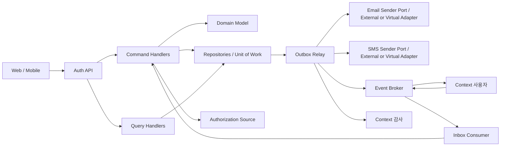

# Context 인증 서비스 설계

## 기본 정보

- Service Design ID: `SD.A.30030`
- Service Index: `SVC.A.300`
- 기준 Use Case: `UC.A.300`
- 근거 문서: [REQ.A.05](../../../00-requirements/REQ_A_05_auth_member.md), [UC.A.300](../../../30-uc/UC_A_300_auth_member.md), [BC.A.300](../../../40-event-storming-bounded-context/BC_A_300_auth_member.md), [SD.A.30010](../A_300_10-domain-model/SD_A_30010_auth_domain_model.md)
- 설계 범위: Application Service, Command/Query Handler, 도메인 정책 실행 위치, 외부 컨텍스트 계약, 트랜잭션 경계, 장애 격리, 감사 이벤트 발행, 보안과 관측 기준.
- 제외 범위: 테이블과 인덱스 상세, HTTP 요청/응답 스키마, 사용자 프로필 정책, 구매 제한 판단, Audit Context의 저장·검색·보존 정책, 외부 인증 제공자 구현.

## 연관 태그

🏷️ 요구사항 참조: [REQ.A.05](../../../00-requirements/REQ_A_05_auth_member.md) | UC 참조: [UC.A.300](../../../30-uc/UC_A_300_auth_member.md) | BC 참조: [BC.A.300](../../../40-event-storming-bounded-context/BC_A_300_auth_member.md) | 도메인 참조: [SD.A.30010](../A_300_10-domain-model/SD_A_30010_auth_domain_model.md) | 영속성 참조: [SD.A.30020](../A_300_20-persistence/README.md) | API 참조: [SD.A.30040](../A_300_40-api/README.md) | 시퀀스 참조: [SCN.A.300](../../../80-sequence/A_300_auth/README.md)

## 책임 경계

### Context 인증이 소유하는 것

- 이메일, 휴대폰 번호, ProviderSubject 같은 Identity와 소유 확인 상태.
- PasswordCredential, VerificationChallenge와 PasswordReset.
- Context 사용자에서 발급받은 `user_id`와 Identity의 연결 이력.
- AuthenticationIntent, Session, SessionCredential과 발급 artifact.
- AccessGrant에 담을 role/permission claim과 세션 무효화 기준.
- 로그인 실패, 잠금, credential 회전, 재사용 탐지 정책.
- 인증 관련 Domain Event와 Audit Context 전달용 OutboxEvent.

### Context 인증이 소유하지 않는 것

- `user_id` 생성 규칙과 사용자 계정 생명주기.
- 이름, 표시명, 주소, 연락처 프로필, 마케팅 속성과 사용자 상태의 업무 의미.
- 약관 문서, 동의 원문, 추천인 정책과 사용자 프로필 초기화 결과.
- 주문, 쿠폰, 드롭별 구매 제한과 리소스 소유권.
- Audit Context의 이벤트 보존, 검색, 조사 화면.
- 서비스 자체 인증에 쓰는 mTLS, workload identity와 service account.

Context 인증이 다른 컨텍스트와 공유하는 사용자 식별자는 `user_id`다. 이메일과 휴대폰 번호는 인증 식별자이므로 Context 인증 안에서만 다루고, JWT claim이나 내부 `X-User-*` 헤더에 넣지 않는다. role/permission은 AccessGrant 발급 목적에 한해 다루며 프로필 속성에서 추론하지 않는다.

회원가입 UI는 가입 자격 검증과 User 생성을 분리한다. 프론트엔드는 Auth에서 이메일·휴대폰을 검증한 뒤 별도 가입 UI의 프로필·필수 동의를 User 생성 API에 직접 전달한다. Auth는 프로필과 동의를 저장하지 않는다.

## 구성 개요

Application Service는 유스케이스 순서와 외부 의존성 호출을 조정한다. 불변조건과 상태 전이는 Aggregate가 결정하고, Handler는 Aggregate 상태를 직접 조작하지 않는다. Repository는 Aggregate 단위로 제공하며 여러 Aggregate를 함께 갱신해야 하는 경우 Unit of Work가 로컬 트랜잭션을 연다.

## Application Service

| Service ID | 이름 | 책임 | 주요 Aggregate | 외부 의존성 |
| --- | --- | --- | --- | --- |
| `SVC.A.300-01` | AuthenticationGateService | 접근 정책과 현재 Principal을 바탕으로 공개, 선택적 인증, 필수 인증, 권한 필요를 판정한다. | AuthenticationIntent, Session, AccessGrant | 없음 또는 Authorization Source |
| `SVC.A.300-02` | RegistrationService | 가입 시작, 검증 완료 proof와 프론트엔드의 동기 완료 요청을 처리한다. | Registration, Identity, IdentityLink, PasswordCredential, Session | Authorization Source |
| `SVC.A.300-03` | VerificationService | 이메일/SMS challenge 발급, 발송 요청, 검증, 만료, 재전송과 제한 정책을 처리한다. | VerificationChallenge, Identity | Email/SMS Sender Port |
| `SVC.A.300-04` | SignInService | 이메일/비밀번호 또는 연결된 휴대폰 Identity를 검증하고 로그인 실패·잠금과 세션 발급을 조정한다. | Identity, IdentityLink, PasswordCredential, Session, AccessGrant | Authorization Source |
| `SVC.A.300-05` | SessionService | 웹 세션, 모바일 refresh token, access token 발급, rotation, 재사용 탐지와 로그아웃을 처리한다. | Session, SessionCredential, AccessGrant | Token Issuer, Authorization Source |
| `SVC.A.300-06` | PasswordRecoveryService | 복구 challenge, PasswordReset 발급·소비, 비밀번호 교체와 세션 무효화를 처리한다. | VerificationChallenge, PasswordReset, PasswordCredential, Session | Email/SMS Sender Port |
| `SVC.A.300-07` | IdentityLinkService | 현재 `user_id`에 추가 Identity를 연결하고 충돌 또는 수동 검토 상태를 처리한다. | Identity, IdentityLink, VerificationChallenge | Email/SMS Sender Port |
| `SVC.A.300-08` | PhoneChangeService | 대체 인증과 새 번호 SMS 검증 후 같은 `user_id`의 휴대폰 IdentityLink를 교체한다. | Identity, IdentityLink, VerificationChallenge, Session | SMS Sender Port |
| `SVC.A.300-09` | AuthOperationService | CS/운영자 수동 처리, 잠금 해제, 고위험 변경 승인과 감사 근거를 검증한다. | Identity, IdentityLink, AccessGrant, Session | Authorization Source, Approval System |
| `SVC.A.300-10` | AccessGrantService | role/permission 원천을 조회해 claim snapshot을 만들고 변경 이벤트에 따라 세션·캐시를 무효화한다. | AccessGrant, Session | Authorization Source |
| `SVC.A.300-11` | UserAuthStateService | Context 사용자의 계정 상태와 `user_version`을 반영하고 새 인증/refresh 차단과 전체 Session 폐기를 관리한다. | UserAuthState, Session | User 서명 검증 키 |

## Port와 구현 경계

### 저장 Port

| Port | 책임 |
| --- | --- |
| `IdentityRepository` | lookup key 조회, Identity 저장과 version 충돌 감지 |
| `IdentityLinkRepository` | Identity/user별 active Link 조회, 연결 이력 저장 |
| `VerificationChallengeRepository` | context+purpose의 active challenge 조회, 검증 경쟁 제어 |
| `VirtualVerificationMessageRepository` | 개발·테스트 전용 가상 code projection 저장, terminal 폐기와 조회 경합 제어 |
| `RegistrationRepository` | Registration 단계, 외부 요청 참조와 상태 조회 proof 저장 |
| `PasswordResetRepository` | reset grant 단일 소비와 만료 상태 저장 |
| `AuthenticationIntentRepository` | 로그인 전 intent 저장, owner proof 회전, remember-me 고정, TTL 연장과 단일 소비 |
| `ActionIntentPayloadRepository` | action별 최소 payload 암호문 저장, 1회 전달 표시와 crypto-shred |
| `SessionRepository` | Session/SessionCredential 조회, row lock, 범위별 폐기 |
| `AccessGrantRepository` | 사용자별 active grant와 version 저장 |
| `UserAuthStateRepository` | 사용자별 `user_version`과 active/restricted/deactivated 상태 저장 |
| `IdempotencyRecordRepository` | command scope별 request fingerprint와 결과 참조 저장 |
| `OutboxEventRepository` | 상태 변경과 함께 발행할 event 저장, relay lease와 전달 상태 관리 |
| `InboxMessageRepository` | Context 사용자 Event의 전송 중복 제거, 지연 재처리와 최종 결과 저장 |
| `UnitOfWork` | 위 Repository가 공유하는 로컬 트랜잭션 경계 제공 |

### 보안·정책 Port

| Port | 책임 |
| --- | --- |
| `IdentityProtectorPort` | 정규화 값에서 lookup key, encrypted value, masked value 생성과 key version 관리 |
| `PasswordHasherPort` | 비밀번호 hash 생성·검증, 알고리즘/cost version 판정과 재해시 필요 여부 반환 |
| `CredentialIssuerPort` | opaque session/refresh credential과 signed access/internal context artifact 발급 |
| `SecretGeneratorPort` | challenge, reset grant와 token에 필요한 암호학적 난수 생성 |
| `EmailVerificationSenderPort` | delivery ID, destination, 6자리 code, template/locale, expiry를 외부 또는 가상 Adapter에 전달 |
| `SmsVerificationSenderPort` | delivery ID, destination, 6자리 code, template/locale, expiry를 외부 또는 가상 Adapter에 전달 |
| `AuthenticationPolicyProvider` | TTL, rotation, 잠금, verification, redirect, Session 폐기 policy snapshot 제공 |
| `RateLimitPort` | 대상 lookup key, IP, device, purpose 조합의 제한 판정과 retry_after 제공 |
| `ApprovalVerificationPort` | approval/evidence opaque reference의 대상, 승인자 등급, action, 만료, 사용 가능 상태 검증 |
| `Clock` | TTL, lock, event occurred_at을 위한 단조로운 테스트 가능 시각 제공 |

Application Service는 구체 DB, 암호화 라이브러리, token 서명 키, provider SDK를 직접 참조하지 않는다. Port 구현의 기술 선택과 물리 저장 형태는 Persistence/API/인프라 설계가 맡는다.

## 공통 Handler 규칙

- Command Handler는 입력 형식 검증, 요청 주체 확인, 멱등성 확인, Aggregate 로드, 도메인 명령 실행, 저장과 OutboxEvent 추가까지만 담당한다.
- Query Handler는 상태를 바꾸지 않는다. 민감 정보 마스킹과 조회 권한 확인은 Query Handler 앞의 정책에서 강제한다.
- 외부 HTTP/gRPC 호출 중에는 DB 트랜잭션을 열어 두지 않는다. 외부 결과를 받은 뒤 Aggregate를 다시 읽고 version을 검증한다.
- 모든 쓰기 Handler는 `request_id`, `correlation_id`, `client_action_id`를 받는다. `client_action_id`가 멱등 키로 쓰이는지는 각 명령 표에서 별도로 정한다.
- Integration Event Handler는 broker ACL/workload identity, event schema/version, `event_id`, `causation_id`, 업무 멱등 키를 검증한다. transport 중복 제거와 도메인 멱등 처리를 같은 것으로 취급하지 않는다.
- 외부 실패를 성공으로 바꾸는 fallback은 두지 않는다. 재시도 가능한 상태와 최종 실패 코드를 명시적으로 반환한다.
- 비밀번호, 인증번호, session cookie, refresh token, access token 원문은 Handler 로그·trace·Domain Event에 넣지 않는다.

## Command Handler

### BC Command

| BC Command | Handler | 입력 핵심값 | 처리 결과 | 트랜잭션 |
| --- | --- | --- | --- | --- |
| `CMD.A.300-01 인증 게이트 확인` | `CheckAuthenticationGateHandler` | resource, action, optional principal | 접근 분류와 로그인/권한 요구 결과 | 읽기 전용 |
| `CMD.A.300-02 로그인 의도 보존` | `PreserveAuthenticationIntentHandler` | internal target, action intent, client channel | AuthenticationIntent 생성 또는 같은-key 재요청의 owner proof/CSRF 원자적 재발급 | 로컬 1회 |
| `CMD.A.300-03 이메일 회원가입 시작` | `StartEmailRegistrationHandler` | email, password, phone, client_action_id | Intent TTL 연장, Registration 상태 proof, Identity, PasswordCredential 생성 또는 미귀속 예약 재사용 | 로컬 1회 |
| `CMD.A.300-04 이메일 소유 확인` | `VerifyEmailChallengeHandler` | challenge proof | 이메일 Identity verified | 로컬 1회 |
| `CMD.A.300-05 휴대폰 소유 확인` | `VerifyPhoneChallengeHandler` | challenge id, verification code | 휴대폰 Identity verified | 로컬 1회 |
| `CMD.A.300-06 인증 식별자 연결` | `CompleteIdentityLinkHandler` | 기존 사용자 link request id | IdentityLink 활성화 | 로컬 1회 |
| `CMD.A.300-07 이메일 로그인` | `SignInWithEmailHandler` | email, password, remember_me, intent id | 로그인 성공 또는 실패·잠금, Session 발급 | 외부 호출 후 로컬 1회 |
| `CMD.A.300-08 휴대폰 번호 로그인` | `SignInWithPhoneHandler` | verified phone challenge, Intent에 고정한 remember_me | 연결된 `user_id` 확인 후 Session 발급 | 외부 호출 후 로컬 1회 |
| `CMD.A.300-09 세션 발급` | `IssueSessionHandler` | verified principal, client channel, policy | SessionCredential과 발급 artifact | 로컬 1회, 내부 호출 전용 |
| `CMD.A.300-10 토큰 재발급` | `RefreshSessionHandler` | refresh credential, client channel | credential rotation, 새 access artifact | 외부 호출 후 로컬 1회 |
| `CMD.A.300-11 로그아웃` | `LogoutCurrentSessionHandler` | authenticated session id | 현재 Session과 credential 폐기 | 로컬 1회 |
| `CMD.A.300-12 인증 수단 연동 요청` | `StartIdentityLinkHandler` | current user_id, identity type/value | Identity와 requested IdentityLink intent 생성, 발송 없음 | 로컬 1회 |
| `CMD.A.300-13 인증 수단 수동 처리` | `ApplyManualIdentityOperationHandler` | operation_id, target user_id, approval, reason | 연결 해제/재연동/수동 검토 결과 | 로컬 1회 |
| `CMD.A.300-14 휴대폰 번호 셀프 변경` | `CompletePhoneChangeHandler` | current user_id, reauth proof, new phone challenge | 기존 연결 닫힘, 새 연결 활성화 | 로컬 1회 |
| `CMD.A.300-15 이메일 재인증` | `ReauthenticateWithEmailHandler` | session, current password, purpose | email Link로 Session 재바인딩, credential 회전, ReauthenticationProof 발급 | 로컬 1회 |

### 도메인 보강 Command

도메인 모델의 가입 검증, 비밀번호 재설정, 권한 반영과 세션 폐기 계약을 다음 Command로 구체화한다. BC.A.300의 Element Catalog를 갱신할 때 같은 식별자와 이름을 사용한다.

| Command | Handler | 입력 핵심값 | 처리 결과 | 요구사항 |
| --- | --- | --- | --- | --- |
| `CMD.A.300-16 회원가입 진행` | `AdvanceRegistrationHandler` | registration id, client action id | 두 필수 Challenge 완료 뒤 completion proof 반환 | `FR-005`, `FR-007` |
| `CMD.A.300-17 인증 Challenge 발급` | `RequestVerificationChallengeHandler` | purpose, channel, identity lookup key, context id | VerificationChallenge와 발송 OutboxEvent 생성 | `FR-005`, `FR-027`, `FR-028` |
| `CMD.A.300-18 인증 Challenge 검증` | `VerifyChallengeHandler` | challenge id, proof | verified 또는 실패 횟수 증가 | `FR-005`, `FR-026`, `FR-028` |
| `CMD.A.300-19 비밀번호 재설정 요청` | `RequestPasswordResetHandler` | recovery method, normalized identity | 존재 여부를 노출하지 않는 PasswordReset 생성 | `FR-028` |
| `CMD.A.300-20 비밀번호 변경` | `CompletePasswordResetHandler` | reset grant, new password | PasswordCredential 교체, PasswordReset 소비, 전 Session 폐기 | `FR-028`, `NFR-015` |
| `CMD.A.300-21 권한 Grant 반영` | `ApplyAccessGrantHandler` | user_id, roles, permissions, source version | AccessGrant version 증가와 영향 Session 무효화 | `FR-020`, `FR-021`, `FR-022` |
| `CMD.A.300-22 세션 일괄 폐기` | `RevokeUserSessionsHandler` | user_id, scope, reason, source event id | 정책 범위의 Session 폐기 | `FR-014`, `NFR-006` |
| `CMD.A.300-23 인증 정책 변경` | `ChangeAuthenticationPolicyHandler` | policy type, expected version, new values | 정책 version 증가와 변경 감사 이벤트 | `FR-012`, `NFR-005`, `NFR-019` |
| `CMD.A.300-24 인증 후 행동 복구` | `DeliverAuthenticatedActionHandler` | consumed intent id, current session, client action id | action_name과 최소 payload 1회 전달 | `FR-003`, `FR-009` |
| `CMD.A.300-25 회원가입 완료` | `CompleteRegistrationHandler` | registration id, user id, user creation proof | 두 IdentityLink와 Session 생성, Registration completed | `FR-005`, `FR-007` |
| `CMD.A.300-26 사용자 계정 상태 반영` | `ApplyUserAccountStatusHandler` | user id, user status change proof | proof 검증, UserAuthState 갱신, 제한·비활성 Session 폐기 | `FR-010` |

운영 프론트엔드의 사용자 상태 요청은 `ApplyUserAccountStatusHandler`가 User 서명 proof를 검증한 뒤 `status_change_id`와 `user_version`으로 멱등 처리한다. UserAuthState를 저장하고 제한·비활성에서는 전체 Session을 같은 transaction에서 폐기한다. 더 높은 user version의 명시적 해제만 active로 되돌릴 수 있으며, 해제할 때 과거 Session을 복원하지 않는다.

`CompleteRegistrationHandler`는 verified Registration과 User 생성 증거를 검증한 뒤 두 IdentityLink, Session과 Registration completed를 같은 트랜잭션에 저장한다. 같은 registration과 key는 기존 논리 Session을 반환하고 다른 user ID는 충돌로 거부한다.

`RegistrationDeadlineWorker`는 `pending_verification`과 `verified` Registration의 `expires_at`만 확인해 만료시킨다.

## Query Handler

| Query ID | Handler | 반환값 | 접근 조건 |
| --- | --- | --- | --- |
| `QRY.A.300-01` | `GetAuthenticationEntryContextHandler` | 지원 인증 수단, AuthenticationIntent 상태, 안전한 복귀 위치 | 해당 Intent의 web cookie 또는 mobile auth flow proof 검증 |
| `QRY.A.300-02` | `ResolvePrincipalHandler` | user_id, session_id, AccessGrant version, role/permission claim, assurance | 유효한 외부 credential 필수 |
| `QRY.A.300-03` | `GetMyAuthenticationMethodsHandler` | 마스킹된 Identity 종류, 검증/연결/잠금 상태 | 본인 Session 필수 |
| `QRY.A.300-04` | `GetAuthenticationStatusHandler` | Registration, IdentityLink, 잠금, Session 요약과 감사 전송 상태 | CS/운영자 권한, 조회 사유 필수 |
| `QRY.A.300-05` | `GetSessionPolicyHandler` | access/refresh/remember-me TTL, rotation, lock policy version | 내부 또는 운영자 권한 |
| `QRY.A.300-06` | `GetRegistrationStatusHandler` | pending_verification, verified, completed, failed, expired | auth-flow proof 또는 조회 전용 RegistrationStatusToken 필수 |
| `QRY.A.300-07` | `CheckAuthenticationAssuranceHandler` | 세션 유효성, 인증 수단 보유, assurance level | 내부 보호 API 전용 |
| `QRY.A.300-08` | `GetVirtualVerificationMessageHandler` | pending 또는 ready와 6자리 code·마스킹 목적지·만료 시각 | dev/test Gateway token과 원래 Challenge 소유 proof를 모두 검증, 운영 Route 미등록 |

`QRY.A.300-07`은 로그인, 인증 정보 보유, UserAuthState의 인증 허용 여부만 답한다. 제한 상태의 원천 판단은 Context 사용자가 소유하고 Auth는 versioned projection으로 Session 발급을 막는다. 구매 제한은 드롭/주문 컨텍스트가 판단하므로 드롭 참여 가능 여부를 Context 인증 하나의 응답으로 합치지 않는다.

`PreserveAuthenticationIntentHandler`는 `action_name`별 allowlist schema로 `actionContext`를 검증하고 최소 필드만 전용 저장소에 envelope encryption한다. AuthenticationIntent에는 `action_payload_ref`만 둔다. bootstrap의 같은 Idempotency-Key와 같은 요청이면 같은 Intent와 payload를 유지하고 row lock 안에서 owner proof와 웹 CSRF secret을 새 값으로 교체한 뒤 새 원문만 응답한다. 이전 proof는 즉시 무효화하며 proof 응답 ciphertext는 저장하지 않는다. 로그인/가입 완료로 Intent를 소비한 뒤 `DeliverAuthenticatedActionHandler`가 `consumed_by_session_id`와 현재 Session을 비교하고 payload를 전달한다. 같은 idempotency key는 짧은 delivery replay TTL 동안 같은 결과를 반환하고, 그 뒤 ciphertext를 crypto-shred한다. 임의 URL, script, 결제 비밀정보, 개인정보는 저장하거나 반환하지 않는다.

## 회원가입 처리 순서

1. `StartEmailRegistrationHandler`는 이메일, 비밀번호와 휴대폰만 받아 `pending_verification` Registration과 두 Identity 예약을 만든다.
2. Challenge 발급과 검증을 거쳐 두 필수 Identity가 verified이면 Registration을 `verified`로 바꾸고 짧은 수명의 `registrationCompletionProof`를 반환한다.
3. 프론트엔드는 Auth에 인증번호를 제출하고 `create_user` 목적의 짧은 수명 proof를 받는다.
4. 프론트엔드는 별도 가입 UI에서 받은 프로필과 필수 동의를 proof와 함께 User 생성 API에 전달한다. Auth는 User 생성에 관여하지 않는다.
5. User 생성 성공 뒤 프론트엔드가 `API.A.300-06`에 `user_id`와 `userCreationProof`를 전달한다.
6. `CompleteRegistrationHandler`는 proof와 verified Registration을 확인하고 두 IdentityLink, Session, SessionCredential, AccessGrant와 Registration `completed`를 한 트랜잭션에 저장한다.
7. Session credential은 Auth가 프론트엔드에 직접 전달한다.

같은 Registration과 `Idempotency-Key` 재시도는 같은 User와 논리 Session 결과를 반환한다. 가입용 Event, Inbox, link 상태 polling과 별도 Agreement 서비스는 사용하지 않는다. 전체 참여자 순서는 [`SCN.A.300-01`](../../../80-sequence/A_300_auth/SCN_A_300_01_email_registration.md)을 따른다.

## 검증 Challenge와 발송 Adapter

### 발급과 검증

- VerificationChallenge purpose는 `signup_email`, `signup_phone`, `phone_signin`, `password_reset`, `identity_link`, `phone_change`로 구분하고, MVP channel은 `email_code`, `sms_code`로 나눈다.
- 이메일·SMS 인증번호는 공통 6자리 숫자 schema를 사용한다. Challenge에는 keyed digest만 저장하고 원문은 provider 전달용 short-TTL ciphertext에만 둔다.
- 동일 challenge의 성공 소비는 한 번만 허용한다. 같은 검증 요청의 재전송은 이미 verified인 결과를 반환한다.
- 발송 성공이 소유 확인 성공을 뜻하지 않는다. 사용자가 proof를 제출해 검증된 경우에만 Identity를 verified로 바꾼다.
- 인증번호 TTL, 재전송 간격, 목적별 최대 시도, 대상/IP/device 제한은 배포 없이 바꿀 수 있는 VerificationPolicy로 관리한다.
- 대상 Identity의 존재 여부는 공개 응답에서 구분하지 않는다. 비밀번호 복구와 휴대폰 로그인 접수는 항상 같은 형태의 응답을 반환한다.

### Adapter 계약

| Port | 입력 | 성공 의미 | 실패 처리 |
| --- | --- | --- | --- |
| `EmailVerificationSenderPort.Send` | delivery_id, template_id, destination, six-digit code, locale, expires_at | 선택된 외부 또는 가상 Adapter가 발송 요청을 수락함 | 재시도 가능/불가를 구분해 delivery 상태 기록 |
| `SmsVerificationSenderPort.Send` | delivery_id, template_id, destination, six-digit code, locale, expires_at | 선택된 외부 또는 가상 Adapter가 발송 요청을 수락함 | 제한, 잘못된 번호, 일시 장애를 구분 |

발송은 API 요청 안에서 직접 호출하지 않는다. challenge와 `VerificationDeliveryRequested` OutboxEvent를 같은 트랜잭션에 넣고 relay가 Adapter를 호출한다. Domain/Audit payload에는 secret을 넣지 않으며 delivery event에는 평문 code 대신 짧은 수명의 암호화 `delivery_payload_ref`만 넣는다. relay는 전송 직전에 메모리에서만 복호화하고 terminal 전달 뒤 payload를 삭제하거나 crypto-shred한다.

`delivery_id`를 provider idempotency key로 전달한다. Provider가 멱등성을 지원하지 않으면 중복 발송 가능성을 관측하고 사용자 재전송 간격으로 피해를 제한한다.

`VirtualEmailVerificationAdapter`와 `VirtualSmsVerificationAdapter`는 같은 Port의 개발·테스트 구현이다. 발송을 수락하면 Challenge ID/version, channel, 마스킹 목적지, 암호화한 code와 expiry를 `auth_virtual_verification_messages` projection에 `ready`로 저장한다. `API.A.300-30`은 개발 Gateway token과 원래 Challenge 소유 proof를 모두 확인한 뒤 Challenge가 아직 `issued`이고 projection version이 같은 경우에만 메모리에서 code를 복호화해 반환한다.

Challenge가 verified, failed, expired, revoked로 닫히는 트랜잭션은 projection도 `destroyed`로 바꾸고 ciphertext를 지운다. 개발·테스트 정리 worker가 terminal/만료 누락분을 다시 정리한다. 운영 profile에서 가상 Adapter, projection migration, projection key 또는 개발 Route가 하나라도 활성화되면 서비스 시작을 실패시킨다. 고정 code와 가상 테스트 번호는 별도 allowlist에서만 허용하고 운영 설정에는 둘 수 없다.

## 이메일 로그인과 휴대폰 로그인

### 이메일 로그인

1. 정규화된 EmailAddress로 Identity와 active PasswordCredential을 찾고, 없으면 같은 비용의 dummy verifier를 선택한다.
2. PasswordHasherPort로 비밀번호를 검증한다.
3. 실패하면 실제 Identity가 있는 경우 LoginLockPolicy에 따라 failure count와 `lock_until`을 갱신하고 감사 OutboxEvent를 같은 트랜잭션에 쓴다.
4. 비밀번호가 맞은 뒤 Identity 잠금과 `password_reset_required`를 확인한다. 재설정 필요 상태면 Session을 만들지 않고 재설정 안내 코드를 반환한다.
5. active IdentityLink의 `user_id`와 UserAuthState `active`를 확인한다. restricted/deactivated이면 Session을 발급하지 않는다.
6. Authorization Source에서 최신 AccessGrant를 조회한다.
7. failure count 초기화, Session 발급, AccessGrant snapshot, 선택된 AuthenticationIntent 소비와 감사 OutboxEvent를 한 트랜잭션에 저장한다.

공개 응답은 이메일 미존재와 비밀번호 불일치를 `INVALID_CREDENTIALS` 하나로 합친다. `IDENTITY_LOCKED`는 잠금 해제 가능 시각을 줄 수 있지만, 내부 Identity 값이나 다른 계정 존재 여부는 노출하지 않는다.

### 휴대폰 로그인

1. active IdentityLink 존재 여부와 관계없이 abuse control을 통과한 정규화 번호에 실제 `phone_signin` VerificationChallenge를 발급하고 선택된 SMS Adapter로 보낸다. 첫 발급 요청의 `rememberMe`를 AuthenticationIntent에 고정한다.
2. 제출한 code가 틀리고 실제 phone Identity가 있으면 challenge attempt와 Identity LoginLockPolicy failure count를 같은 트랜잭션에서 증가시킨다. 공개 응답은 존재 여부와 잠금 임계치를 숨긴다.
3. code를 검증한 뒤 verified phone Identity의 잠금 상태를 확인한다. 올바른 code를 제출한 사용자에게만 잠금 시각을 알려줄 수 있다.
4. active IdentityLink가 없으면 로그인하지 않고 `PHONE_IDENTITY_NOT_LINKED`와 이메일 가입/로그인 안내를 반환한다.
5. active 연결의 UserAuthState가 active인지 확인한다. restricted/deactivated이면 Session을 발급하지 않는다.
6. 허용 상태면 failure count를 초기화하고 해당 `user_id`의 AccessGrant를 조회해 AuthenticationIntent에 고정한 `rememberMe` 정책으로 Session을 발급한다.
7. 휴대폰 번호가 같다는 이유로 사용자 계정을 만들거나 다른 `user_id`와 합치지 않는다.

### 잠금 정책

LoginLockPolicy는 `max_failures`, `lock_duration`, `failure_window`, `reset_on_success`, `policy_version`을 가진다. 초기 `max_failures`는 5회지만 나머지 값과 함께 외부 설정으로 바꿀 수 있어야 한다. 설정 변경은 기존 Identity의 누적 횟수를 삭제하지 않으며, 다음 로그인 판정부터 새 policy version을 사용한다.

## Session과 발급 Artifact

### 채널별 결과

| 채널 | 장기 상태 | 짧은 수명 결과 | 저장 기준 |
| --- | --- | --- | --- |
| Web | HttpOnly/Secure/SameSite cookie credential | Session-bound CSRF token | cookie 원문 없이 SessionCredential hash와 CSRF key version 저장 |
| Mobile | opaque refresh token | access JWT | refresh 원문 없이 digest 저장, access JWT는 저장하지 않음 |
| Ingress 경유 요청 | 외부에서 들어온 내부용 헤더가 제거된 사용자 credential | 필요 시 검증된 signed request context | 기본적으로 저장하지 않고 짧은 TTL 사용 |

모바일 access JWT claim에는 `user_id`, `session_id`, roles, `permission_version`, `aud`, `iat`, `exp`, `jti`만 허용한다. 내부 context JWT는 수신자에 필요한 최소 permissions 또는 `permission_version`을 추가할 수 있다. `email`, `phone`, `identity_id`, 표시명, 주소는 넣지 않는다.

웹 CSRF token은 SessionCredential ID와 `secret_hash`에 저장된 CSRF key version을 적용해 결정적으로 도출한다. 로그인/회원가입 완료 응답과 `GET /api/v1/auth/context`에서 같은 token을 다시 제공할 수 있고, SessionCredential 회전 시 새 값으로 바뀐다. unsafe method는 cookie와 token을 함께 검증한다.

### Token/Session 정책

- access token 기본 TTL은 15분이다.
- refresh token 기본 TTL은 14일이다.
- remember-me refresh token 기본 TTL은 30일이다.
- refresh rotation은 기본으로 켠다.
- TTL과 rotation은 외부 설정에서 읽고 발급 시 사용한 policy version을 Session에 남긴다.
- TTL 정책을 바꿔도 이미 발급된 artifact의 `exp`를 소급해 늘리지 않는다. 긴급 단축은 대상 Session 폐기와 AccessGrant version 갱신으로 적용한다.

### Refresh rotation

1. token 원문에서 lookup digest를 계산해 SessionCredential을 찾는다.
2. Authorization Source 호출 전에 Session과 credential의 기본 상태를 읽는다.
3. UserAuthState active와 최신 AccessGrant를 확인한 뒤 로컬 트랜잭션을 시작하고 상태·credential row를 다시 잠금 조회한다.
4. active credential이면 기존 credential을 rotated로 바꾸고 같은 family의 새 credential을 발급한다.
5. rotated/revoked credential이 다시 제출되면 reuse로 기록하고 해당 Session과 refresh family를 폐기한다.
6. Domain Event와 감사 OutboxEvent를 같은 트랜잭션에 넣는다.

동시에 여러 refresh 요청이 들어오면 row lock을 먼저 획득한 하나만 성공한다. 모바일 클라이언트는 refresh 요청을 한 번에 하나만 실행한다. 응답을 받지 못하면 같은 refresh token과 같은 `Idempotency-Key`로만 재시도해 최초 암호화 응답을 재생받는다. 재생 전에도 UserAuthState와 Session active를 확인하며 제한·폐기 뒤에는 반환하지 않는다. 같은 token을 새 key로 보내면 재사용 탐지 정책을 적용한다.

### Session 무효화 기준

| 원인 | 기본 범위 | 처리 |
| --- | --- | --- |
| 현재 기기 로그아웃 | 현재 Session | Session과 active SessionCredential 폐기 |
| refresh token 재사용 탐지 | 해당 Session과 refresh family | `reuse_detected`, credential 폐기, 보안 감사 이벤트 |
| 비밀번호 재설정 | 해당 `user_id`의 전체 Session | PasswordCredential version 증가 후 모두 폐기 |
| 비밀번호 교체 | 대상 `user_id`의 전체 Session과 refresh family | 기존 Session을 모두 폐기하고 새 로그인을 요구한다. |
| Identity 해제·수동 재연동 | 해당 Identity로 로그인한 Session, 고위험이면 전체 | Identity/IdentityLink version과 Session을 함께 확인 |
| 휴대폰 Identity 교체 | 기존 휴대폰 Identity로 로그인한 다른 Session | 이메일 재인증으로 재바인딩한 현재 Session은 유지하고, 나머지 기존 휴대폰 기반 Session은 폐기 |
| role/permission 축소 | 영향을 받는 privileged Session | AccessGrant version과 `valid_from` 갱신, 대상 Session 폐기 |
| 사용자 제한·비활성 동기 요청 | 해당 `user_id`의 전체 Session | User 서명 proof의 user version 확인 후 모두 폐기 |
| 키 유출·보안 사고 | 지정 key/session/user 범위 | 운영 명령으로 강제 폐기, 감사 이벤트 필수 |

Access JWT는 이미 발급된 뒤이므로 일반 API에서는 최대 TTL 동안 유효할 수 있다. 운영·보안·권한 변경 같은 고위험 API는 AccessGrant version, `valid_from`, Session status를 stateful하게 확인하고 fail closed로 처리한다.

## AccessGrant와 인가 원천 계약

`AuthorizationSourcePort.ResolveAccessGrant`는 프로필을 role로 바꾸는 편의 함수가 아니다. role과 permission을 소유한 권한 원천에서 명시적으로 발급된 결과만 받는다. MVP에서 권한 원천이 auth-service 내부 저장소여도 Port 경계를 유지해 후속 분리를 허용한다.

| 구분 | 필드 | 설명 |
| --- | --- | --- |
| 요청 | `user_id` | 권한 대상 사용자 |
| 요청 | `purpose` | session_issue, token_refresh, high_risk_authorization |
| 요청 | `known_grant_version` | 캐시·snapshot 갱신 판단용 버전 |
| 응답 | `roles` | 정규화된 닫힌 role 집합 |
| 응답 | `permissions` | claim에 넣을 수 있는 명시적 permission 집합 또는 scope |
| 응답 | `grant_version` | role/permission 변경마다 증가하는 버전 |
| 응답 | `valid_from` | 이 grant version의 유효 시작 시각 |
| 응답 | `valid_until` | snapshot을 다시 확인해야 하는 상한 |
| 응답 | `assurance_requirement` | CUSTOMER/SELLER/PLATFORM_OPERATOR별 재인증 또는 후속 passkey 요구 |

계약 규칙은 다음과 같다.

- Session 신규 발급과 refresh는 최신 AccessGrant를 얻지 못하면 실패한다.
- UserAuthState가 없거나 active가 아니면 새 Session, refresh, ReauthenticationProof를 fail closed로 거부한다.
- 판매자/운영자 권한은 stale snapshot으로 새로 발급하지 않는다.
- CUSTOMER 기본 역할도 프로필이나 이메일 도메인에서 추론하지 않고 승인된 grant 생성 규칙으로만 부여한다.
- AccessGrant 변경 이벤트는 `event_id + grant_version`으로 멱등 소비한다.
- 낮은 version의 늦은 이벤트는 무시하되 감사 로그에는 순서 역전을 남긴다.
- permission 수가 token 크기 상한을 넘으면 축약된 scope 또는 policy reference를 발급하고 고위험 API가 stateful 확인을 수행한다.
- 권한 원천 장애 시 기존 access JWT의 서명 검증은 계속할 수 있지만 신규 Session, refresh와 고위험 권한 확인은 허용하지 않는다.

### ReauthenticationProof

`ReauthenticationProof`는 고위험 작업 직전에 비밀번호나 후속 강한 인증을 다시 확인했다는 단기 증명이다. role/permission을 나타내는 `AccessGrant`와 다른 Value Object다.

- verified email Identity, `credential_status=active`, active PasswordCredential, active UserAuthState를 모두 요구한다. locked, password_reset_required, revoked, superseded 상태에서는 비밀번호가 맞아도 proof를 발급하지 않는다.
- `user_id`, 현재 `session_id`, 허용 `purpose`, `authenticated_at`, `expires_at`, nonce에 묶는다.
- API에는 opaque 또는 signed proof로 전달하고 서버에는 hash/reference만 남긴다.
- `replace_phone`, `link_identity`, `manual_recovery`처럼 발급 시 지정한 목적 하나에만 사용할 수 있다.
- 기본 TTL 후보는 5분이며 한 번 소비하거나 Session이 폐기되면 즉시 무효화한다.
- AccessGrant role/permission 변경, 권한 version, 업무 리소스 권한을 대신하지 않는다.
- 이메일 비밀번호 재인증 성공 시 현재 Session을 같은 `user_id`의 active 이메일 IdentityLink에 재바인딩하고 `authentication_method=email_password`, `last_authenticated_at`을 갱신한다. 기존 SessionCredential을 `rotated_pending_delivery`로 바꾸고 새 credential, ReauthenticationProof, completed IdempotencyRecord, 최초 proof·credential 전달 결과의 short-TTL replay ciphertext와 감사 outbox를 같은 트랜잭션에 저장한다.

재인증 성공 응답이 유실되면 일반 인증보다 먼저 같은 Session·`reauthenticate_email` operation·Idempotency-Key·request fingerprint와 `rotated_pending_delivery`를 확인한다. 모두 맞을 때만 회전 전 credential hash를 복구 proof로 인정하고 최초 암호문을 메모리에서 복호화해 반환한다. 다른 API·key·body·Session에는 이전 credential을 허용하지 않으며 복구 TTL 종료 시 ciphertext와 복구 상태를 폐기하고 `AUTH_SESSION_DELIVERY_EXPIRED`를 반환한다.

## 비밀번호 재설정

1. `RequestPasswordResetHandler`는 이메일 또는 휴대폰 인증 식별자를 받고 존재 여부를 공개하지 않는 접수 결과를 반환한다. 연결된 AuthenticationIntent와 owner proof의 서버 만료를 PasswordReset TTL까지 운영 상한 안에서 함께 연장한다.
2. 이메일 방식은 verified 이메일 Identity와 active PasswordCredential을 찾는다. 이메일 Identity의 credential 상태는 active, locked, password_reset_required를 허용한다. 휴대폰 방식은 verified phone Identity의 active Link에서 같은 조건의 이메일 Identity/PasswordCredential을 찾는다. revoked/superseded Identity는 대상이 아니다.
3. 연결된 대상이 있으면 이메일 Identity를 대상으로 하는 PasswordReset만 만든다. 이 단계에서는 Challenge를 발급하거나 메시지를 보내지 않는다.
4. 클라이언트가 PasswordReset challenge 발급 API를 호출하면 선택한 이메일/SMS 방식의 VerificationChallenge와 발송 outbox를 만든다.
5. 이메일 또는 SMS code 검증 후 PasswordReset을 `challenge_verified`로 바꾼다. 모바일 같은-key 성공 재요청은 같은 PasswordReset의 reset grant hash를 원자적으로 새 값으로 교체하고 이전 grant를 무효화하며, grant 원문이나 암호화 replay payload를 저장하지 않는다.
6. 새 비밀번호가 PasswordPolicy를 통과하면 새 PasswordCredential을 만들고 기존 credential을 replaced로 닫는다.
7. PasswordReset은 completed로 전환하고 해당 `user_id`의 모든 Session을 폐기한다.
8. 비밀번호 변경, reset 소비, 전 Session 폐기, 연결된 AuthenticationIntent의 `password_reset_completed` 소비, 감사 OutboxEvent는 하나의 로컬 트랜잭션에서 처리한다. 웹 `__Host-dm_auth` cookie와 모바일 authFlowToken도 더 이상 사용할 수 없게 한다.

PasswordReset proof는 단일 사용이며 짧은 TTL을 가진다. reset 요청 횟수와 검증 실패 횟수는 Identity 잠금 횟수와 분리해 관리하되, 공격 징후는 공통 보안 지표로 집계한다.

휴대폰 Identity가 연결되어 있어도 같은 `user_id`에 verified 이메일 Identity와 active PasswordCredential이 없으면 비밀번호 재설정을 수행하지 않는다. 공개 응답은 이 사유를 구분하지 않는다.

## 인증 수단 연동과 휴대폰 번호 변경

### 추가 인증 수단 연동

- 유효한 Session과 최근 재인증 proof가 있어야 시작할 수 있다.
- 시작 Handler는 목적에 맞는 ReauthenticationProof를 소비하고 pending Identity와 requested IdentityLink를 만든다. API의 `linkIntentId`는 이 `identity_link_id`이며, 현재 user/session 바인딩과 만료 시각을 저장한다. 메시지는 보내지 않는다.
- 별도 challenge 발급 API가 `context_id=linkIntentId`인 `identity_link` Challenge와 delivery outbox를 만든다.
- 새 Identity의 소유 확인 전에는 IdentityLink를 active로 만들지 않는다.
- 이미 같은 `user_id`에 active 연결된 Identity는 성공으로 간주하는 멱등 결과를 반환한다.
- 다른 `user_id`에 active 연결된 Identity는 `IDENTITY_LINKED_TO_OTHER_USER`로 거부한다.
- 충돌한 두 `user_id`를 자동 또는 수동으로 병합하지 않는다.
- 인증 수단 해제·재연동은 기본 셀프서비스가 아니며 허용된 휴대폰 셀프 교체 외에는 운영 절차로 보낸다.

### 휴대폰 번호 셀프 변경

1. 로그인 Session의 assurance와 최근 이메일 비밀번호 재인증 proof를 확인한다.
2. proof를 소비하면서 새 phone Identity와 requested IdentityLink를 만든다. API의 `replacementId`는 이 `identity_link_id`이고 기존 active phone Link를 previous link로 저장한다.
3. 별도 API에서 `context_id=replacementId`인 `phone_change` VerificationChallenge를 발급하고 검증한다.
4. 새 phone Identity가 다른 `user_id`에 연결되지 않았는지 확인한다.
5. 한 트랜잭션에서 기존 IdentityLink를 replaced, 기존 Identity를 superseded, requested IdentityLink를 active로 바꾼다.
6. 이메일 재인증에서 이미 email IdentityLink로 재바인딩한 현재 Session은 유지하고 credential을 회전한다. 기존 휴대폰 Identity로 발급된 다른 Session은 폐기하고 감사 OutboxEvent를 추가한다.
7. 대체 인증이 불가능하거나 계정 접근이 불가능하면 `MANUAL_REVIEW_REQUIRED`를 반환하고 자동 변경하지 않는다.

완료 응답이 유실되면 이전 SessionCredential은 일반 인증에서 계속 거부한다. 다만 같은 Session·`complete_phone_replacement` operation·Idempotency-Key·request fingerprint에 묶인 `rotated_pending_delivery` record와 short-TTL encrypted replay가 모두 유효할 때만 인증 middleware 앞의 전용 복구 분기에서 최초 credential 전달 결과를 반환한다. 다른 API, 다른 key/body, 다른 Session에는 이 예외를 적용하지 않으며 TTL이 끝나면 새 재인증부터 시작한다.

### 수동 처리

`ApplyManualIdentityOperationHandler`는 운영 콘솔이 전달한 `operation_id`, actor user_id, actor role, 승인자, 사유 코드, 증빙 참조, 만료 시각을 검증한다. 증빙 원문은 인증 DB에 복제하지 않고 approval/evidence opaque reference를 OutboxEvent에 저장해 Context 감사가 장기 보존한다. 인증 DB의 IdempotencyRecord는 operation 결과 참조만 보존한다. CS 담당자는 조회와 요청까지만 수행하고 실제 고위험 변경은 플랫폼 운영자 권한과 승인 정책을 통과해야 한다.

모든 수동 처리는 coarse permission `auth.case.execute`, 최신 AccessGrant, 최근 strong auth를 공통으로 요구한다. action별로는 `unlock_identity -> auth.identity.unlock`, `revoke_identity_link -> auth.identity_link.revoke`, `approve_relink -> auth.identity_link.relink`, `revoke_sessions -> auth.session.revoke`를 추가 확인하며 승인 등급은 모두 `platform_operator`다. `revoke_sessions`의 공개 동기 API는 단일 Session target만 허용한다. 사용자 전체 폐기는 cursor batch와 별도 operation 상태가 필요한 내부/후속 비동기 명령으로 분리한다.

## 트랜잭션 경계

### 원칙

- 하나의 로컬 트랜잭션에는 상태 변경과 그 변경을 알리는 OutboxEvent를 함께 넣는다.
- Authorization Source, 이메일/SMS와 Audit Context 호출을 로컬 DB 트랜잭션 안에서 수행하지 않는다. 가입 프론트엔드가 User와 Auth를 각각 호출한다.
- 외부 호출 전후로 Aggregate version을 확인하고 충돌하면 전체 유스케이스를 안전하게 재시도한다.
- 여러 Aggregate를 함께 바꾸는 이유는 명시적 업무 불변조건으로 제한한다. 편의를 위해 큰 트랜잭션을 만들지 않는다.
- 외부 컨텍스트까지 포함하는 분산 트랜잭션은 사용하지 않는다. Registration 상태와 안정적인 멱등 키로 복구한다.

### 유스케이스별 경계

| 유스케이스 | 외부 호출 전 로컬 트랜잭션 | 외부 호출 | 최종 로컬 트랜잭션 |
| --- | --- | --- | --- |
| 회원가입 시작 | AuthenticationIntent TTL 연장, Registration 상태 proof, Identity 예약, PasswordCredential | 없음 | 없음 |
| Challenge 발급 | Registration/PasswordReset 등 상위 작업과 기존 issued Challenge 확인 | 없음 | 새 Challenge, 상위 작업 참조, delivery payload/outbox |
| 가입 검증 완료 | 없음 | 없음 | Challenge·Identity·Registration을 `verified`로 저장하고 completion proof 반환 |
| 회원가입 완료 | verified Registration과 User proof 확인 | ResolveAccessGrant | IdentityLink, Session, AccessGrant와 Registration `completed`를 한 트랜잭션에 저장 |
| 회원가입 기한 만료 | 없음 | 없음 | `pending_verification` 또는 `verified` Registration을 `expired`로 종료 |
| 이메일 로그인 실패 | 없음 | 없음 | failure count, 잠금 상태, 감사 outbox |
| 이메일/휴대폰 로그인 성공 | credential/연결 상태 읽기 | ResolveAccessGrant | 실패 횟수 초기화, Session, credential, AccessGrant, 감사 outbox |
| 이메일 재인증 | 현재 Session, 이메일 Link와 비밀번호 상태 읽기 | 없음 | Session 재바인딩, ReauthenticationProof, credential 회전, short-TTL delivery replay, 감사 outbox |
| token refresh | Session/credential 상태 읽기 | ResolveAccessGrant | credential row lock, rotation/reuse 상태, AccessGrant, 감사 outbox |
| 로그아웃 | 없음 | 없음 | Session과 credential 폐기, 감사 outbox |
| 비밀번호 재설정 시작/완료 | 시작 시 AuthenticationIntent TTL 연장과 PasswordReset 생성 | 없음 | 완료 시 PasswordCredential 교체, PasswordReset 소비, 전 Session 폐기, 감사 outbox |
| 휴대폰 번호 교체 | 검증 proof 상태 확인 | 없음 | 기존/새 Identity와 IdentityLink, 대상 Session credential 회전, short-TTL delivery replay, 감사 outbox |
| 수동 인증 수단 변경 | 운영 권한과 승인 상태 읽기 | 필요 시 ResolveAccessGrant | Identity/IdentityLink/Session, 감사 outbox |
| 권한 변경 이벤트 | source event version 확인 | 필요 시 권한 원천 재조회 | AccessGrant와 대상 Session, 소비 기록, 감사 outbox |
| 사용자 상태 동기 적용 | user version 확인 | 없음 | UserAuthState와 전체 Session을 한 트랜잭션에 반영 |

회원가입 완료는 하나의 동기 Command다. User proof 검증이나 `ResolveAccessGrant`가 실패하면 IdentityLink와 Session을 만들지 않는다. 같은 완료 요청 재시도는 기존 논리 Session을 재사용한다.

## Outbox와 Audit Context

### 발행 원칙

- Aggregate 상태와 OutboxEvent는 같은 DB 트랜잭션에서 저장한다.
- relay는 `event_id` 기준 at-least-once로 발행한다. Audit Context는 `event_id`로 중복을 제거한다.
- broker 또는 Audit Context ack를 받은 뒤에만 published 상태로 바꾼다.
- 일시 실패는 지수 backoff와 jitter로 재시도하고, 설정된 한도를 넘기면 parking 상태와 운영 알림을 만든다.
- Audit Context 장애는 이미 커밋된 로그인·로그아웃·연동 결과를 되돌리지 않는다. 대신 outbox backlog와 oldest event age를 경보한다.
- OutboxEvent 저장 자체가 실패하면 상태 변경도 롤백한다.
- 변경할 Aggregate가 없는 미존재 계정/재인증 실패도 서버 attempt ID를 aggregate ID로 사용하는 `AuthenticationAttempt` outbox를 만든다. 같은 Idempotency-Key 실패 재생은 같은 attempt를 가리키고 감사 event를 중복 생성하지 않는다.

### 감사 payload allowlist

허용 값은 `event_id`, `event_type`, `occurred_at`, `user_id`, `identity_id`, `identity_type`, `session_id`, `actor_ref`, `result`, `reason_code`, `purpose`, `policy_version`, `approval_ref`, `evidence_ref`, `request_id`, `correlation_id`, `source_ip_hash`, `user_agent_hash`다. approval/evidence 값은 접근 통제된 외부 원문의 opaque reference만 허용한다. 업무상 필요하지 않은 값은 넣지 않는다.

비밀번호, 인증번호, token/session cookie 원문, 이메일/휴대폰 원문, provider secret, 이름, 주소, 동의 원문은 넣지 않는다. Audit Context에 검색용 연락처가 필요하더라도 별도 개인정보 토큰화 계약을 먼저 설계하고 이 allowlist를 암묵적으로 넓히지 않는다.

### 감사 이벤트 매핑

| 상태 변경 | Audit Event | 필수 reason/result |
| --- | --- | --- |
| 가입 인증 완료 통지 | `auth.registration.verification_completed` | event version, result |
| 회원가입 사용자 연결/거부 | `auth.registration.user_linked`, `auth.registration.user_link_rejected` | result, 일반화된 reason code |
| 회원가입 완료 | `auth.registration.completed` | created, replayed |
| 회원가입 실패 | `auth.registration.failed` | stage, reason code |
| Challenge 발급/성공/실패 | `auth.verification.issued`, `auth.verification.succeeded`, `auth.verification.failed` | purpose, channel, result/reason code |
| 로그인 성공/실패 | `auth.signin.succeeded`, `auth.signin.failed` | method, reason code |
| Identity 잠금 | `auth.identity.locked` | policy version, lock_until |
| Session 발급/refresh | `auth.session.issued`, `auth.session.refreshed` | channel, grant version |
| refresh 재사용 탐지 | `auth.session.reuse_detected` | family/session scope |
| 로그아웃/강제 폐기 | `auth.session.revoked` | actor, reason, scope |
| 비밀번호 재설정 | `auth.password.reset` | method, result |
| 이메일 재인증 | `auth.reauthentication.succeeded`, `auth.reauthentication.failed` | purpose, result, reason code |
| 인증 후 행동 전달 | `auth.action_resume.delivered` | action name, result |
| 인증 수단 연동/수동 처리 | `auth.identity_link.changed` | link reason, actor, approval ref |
| 휴대폰 Identity 교체 | `auth.phone_identity.replaced` | self_service/manual, old/new identity id |
| AccessGrant 변경 | `auth.access_grant.changed` | old/new version, invalidation scope |
| 사용자 인증 제한 변경 | `auth.user_auth_state.changed` | status, user version, source |

BC.A.300의 `EVT.A.300-12~17`, `EVT.A.300-21`은 위 외부 감사 event type으로 변환해 발행한다. “감사 전송됨”은 Aggregate 상태가 아니라 relay 전달 결과이므로 Domain Event와 Outbox delivery 상태를 구분한다. 도메인 모델의 `EVT.A.300-22~37`은 Challenge, Registration, PasswordReset, Session, AccessGrant, AuthenticationIntent, 사용자 제한, 정책 변경, 로그인 실패·잠금과 가입 사용자 연결 사실을 보강한다.

## 멱등성과 동시성

### 명령별 기준

| 명령 | 멱등 키/직렬화 기준 | 중복 결과 |
| --- | --- | --- |
| 회원가입 시작 | `client_action_id` + normalized email | 같은 Registration 반환, 다른 payload면 conflict |
| challenge 재전송 | challenge id + resend window | 정책상 같은 challenge metadata 또는 새 delivery id 반환 |
| challenge 검증 | challenge id + client action id | 같은 키는 이전 결과 반환, 다른 요청이 terminal 상태를 만나면 현재 상태를 명시하고 변경하지 않음 |
| 가입 검증 완료 | registration id + challenge 결과 | 두 필수 Challenge 완료 뒤 같은 completion proof 결과 반환 |
| 회원가입 완료 | registration id + user id + client action id | 같은 논리 IdentityLink와 Session을 정확히 한 번 생성 |
| 이메일/휴대폰 로그인 | client action id + 인증 proof | 매 재시도에서 proof를 확인하고 같은 성공 action은 기존 SessionCredential만 교체, 중복 Session 금지 |
| 이메일 재인증 | Session + purpose + client action id | 같은 성공 action의 proof·credential 최초 전달 결과만 짧은 TTL 동안 재생 |
| refresh | SessionCredential row lock | 첫 요청만 성공, 이전 token 재사용은 보안 정책 적용 |
| 로그아웃 | session id | 이미 revoked여도 같은 완료 결과 |
| 비밀번호 재설정 완료 | PasswordReset id | 이미 completed면 같은 완료 상태, 새 credential 중복 생성 금지 |
| Identity 연동 | operation id | 같은 최종 연결 상태 반환 |
| 휴대폰 교체 | Session + operation id + request fingerprint | 같은 Link 교체 결과를 유지하고 짧은 TTL 동안 최초 credential 전달 결과만 전용 암호문으로 복구 |
| 수동 처리 | operation id + approval version | 같은 operation 재실행 금지 |
| 권한 Event | source event id + source version | 같은 version 재적용 금지 |
| 사용자 상태 요청 | status change id + user version | 같은 또는 낮은 version 재적용 금지 |

IdempotencyRecord는 key, command type, 전체 canonical request의 keyed HMAC fingerprint, 결과 참조와 만료 시각만 저장한다. 비밀번호나 token 원문과 단순 hash를 저장하지 않는다. 회원가입 완료는 User proof, IdentityLink, Session과 Registration `completed`를 한 트랜잭션에 저장하고 record를 완료한다. 같은 key 재시도는 기존 논리 Session 결과를 사용하고 다른 user ID는 충돌로 거부한다. 로그인 실패가 completed이면 저장된 실패를 재생하고 failure count를 다시 올리지 않는다. refresh, 이메일 재인증과 휴대폰 교체 완료 credential 전달 복구는 allowlist된 별도 encrypted replay 규칙을 따른다.

회원가입·이메일 로그인·휴대폰 로그인 성공 응답 복구는 일반 사전 인증 middleware보다 먼저 consumed AuthenticationIntent의 recovery-only owner proof를 확인한다. 같은 Session·operation·Idempotency-Key·request fingerprint와 짧은 recovery TTL이 모두 맞을 때만 기존 논리 Session의 credential을 교체하고, token/cookie 응답 암호문은 저장하지 않는다. 이 proof는 다른 API와 새 인증에 사용할 수 없으며 TTL 종료 시 `AUTH_SESSION_DELIVERY_EXPIRED`를 반환한다.

Identity와 IdentityLink의 유일성은 서비스 선조회만 믿지 않고 DB unique constraint로 최종 보장한다. 충돌이 나면 이미 연결된 `user_id` 값을 응답에 노출하지 않고 도메인 오류로 변환한다.

## 외부 의존성 장애 정책

### 초기 운영값

다음 값은 코드 상수가 아니라 외부 설정의 초기 제안값이다. 부하 시험과 운영 관측 뒤 조정한다.

| 의존성 | request timeout | 재시도 | circuit breaker 초기값 | 비고 |
| --- | --- | --- | --- | --- |
| 가입 프론트엔드·User | 요청 timeout 1초 | 같은 registration과 key로 재시도 | 동기 오류를 호출자에 반환 | User 생성 뒤 Auth 완료 호출 |
| Authorization Source | 500ms | 남은 시간 안에서 멱등 조회 1회 | 최근 20회 중 50% 실패 시 15초 open | 로그인/refresh/high-risk는 fail closed |
| Approval System | 1초 | 읽기 검증 1회 | 최근 20회 중 50% 실패 시 15초 open | 수동 처리와 break-glass는 장애 시 fail closed |
| Email/SMS Provider | worker당 3초 | delivery 정책에 따라 backoff | provider별 독립 breaker | 사용자 API와 비동기 분리 |
| Virtual Email/SMS Adapter | 로컬 저장소 예산 안 | transient DB 오류만 backoff | 외부 breaker 없음 | dev/test 전용 projection, 운영 시작 시 fail closed |
| Audit Context | relay 설정 | at-least-once 지속 재시도 | relay가 격리 | 사용자 요청을 실패시키지 않음 |

### 제한 모드

| 장애 | 허용 | 거부/보류 | 사용자·운영 처리 |
| --- | --- | --- | --- |
| auth DB 장애 | 공개 탐색과 이미 발급된 access JWT의 stateless 검증 | 가입, 로그인, refresh, 로그아웃, stateful 권한 확인 | `AUTH_TEMPORARILY_UNAVAILABLE`, 즉시 경보 |
| User 일시 장애 | 기존 로그인/refresh/로그아웃 | 새 회원가입 완료 | 동기 오류를 반환하고 프론트엔드가 같은 registration과 key로 재시도 |
| Authorization Source 장애 | 공개 탐색, 만료 전 일반 access JWT 검증 | 새 Session, refresh, 판매자/운영자와 고위험 권한 확인 | `AUTHORIZATION_SOURCE_UNAVAILABLE`, fail closed |
| Approval System 장애 | 일반 인증/세션 | 수동 인증 수단 처리, break-glass | 승인 검증 불가 오류, fail closed와 운영 경보 |
| 이메일/SMS 장애 | 기존 Session 사용 | 새 challenge 발송 | 발송 지연 상태와 재시도 가능 시각 제공 |
| Audit Context 장애 | 인증 상태 변경 자체 | 없음, 단 outbox 저장 실패 시 전체 롤백 | backlog/oldest age 경보 |
| outbox relay 장애 | DB에 저장된 업무 처리 | 외부 발송과 감사 전달 지연 | worker 복구 후 재처리 |

선택적 개인화 컴포넌트의 인증 오류는 공개 페이지 전체 오류로 전파하지 않는다. 다만 이 제한은 화면의 Auth Boundary 처리이며, Context 인증이 가짜 개인화 데이터나 성공 응답을 만드는 근거가 아니다.

## 설정

| 설정 그룹 | 항목 | 초기값/원칙 |
| --- | --- | --- |
| TokenTtlPolicy | access, refresh, remember-me, internal context TTL | 15분, 14일, 30일, 내부용은 API/인프라에서 확정 |
| RefreshRotationPolicy | enabled, reuse action | enabled, Session과 family 폐기 |
| LoginLockPolicy | max failures, window, lock duration, reset on success | max 5, 나머지 운영 확정 |
| VerificationPolicy | purpose별 TTL, resend interval, max attempts, rate limit | 운영 확정, 목적별 분리 |
| RegistrationPolicy | Registration TTL, completion proof TTL | 가입 검증과 동기 완료 재시도에 필요한 짧은 유효 기간으로 운영 확정 |
| PasswordResetPolicy | reset TTL, max attempts, Session revoke scope | 전 Session 폐기, 숫자는 운영 확정 |
| PasswordPolicy | length, compromised password check, hash version | 배포 없이 정책 version 갱신 가능 |
| RedirectPolicy | allowed internal path, intent TTL | 외부 URL 금지 |
| DependencyPolicy | timeout, retry, breaker threshold/open time | 의존성별 분리 |
| OutboxPolicy | batch size, retry delay, max attempts, parking alert | Audit/delivery 종류별 분리 |

설정의 기본값은 존재할 수 있지만 환경 변수 또는 중앙 설정으로 덮어쓸 수 있어야 한다. 서명 키, password pepper, provider secret은 일반 설정 저장소가 아니라 secret manager/KMS에서 주입한다.

## 보안 기준

### 비밀번호와 secret

- PasswordHasherPort는 알고리즘과 cost version을 함께 저장한다. 신규 credential은 운영 표준의 memory-hard hash를 사용하고, 과거 hash는 로그인 성공 시 재해시한다.
- password pepper는 DB 밖 secret manager/KMS에 둔다. pepper 교체 절차는 key version을 보존해 점진 전환한다.
- refresh/session credential은 충분한 entropy의 opaque 값으로 만들고 keyed digest만 저장한다.
- 이메일·SMS code와 PasswordReset proof도 원문을 일반 저장소에 두지 않는다. 발송 payload와 dev/test 전용 projection의 short-TTL 암호문만 허용한다.
- secret과 원문 credential은 오류 메시지, panic, trace attribute, queue payload에 포함하지 않는다.

### 요청과 응답

- redirect target은 내부 allowlist와 서명된 AuthenticationIntent로만 복구한다.
- 공개 오류는 계정 존재 여부를 드러내지 않는다. 상세 사유는 권한 있는 CS 조회에서만 마스킹해 제공한다.
- 로그인, 복구, challenge 발급에는 대상+IP+device 기준 rate limit을 함께 적용한다.
- 웹 cookie는 HttpOnly, Secure, 적절한 SameSite와 path/domain 최소 범위를 사용한다.
- token audience, issuer, expiry, signature, jti를 모두 검증한다. 알고리즘 downgrade와 `none`을 허용하지 않는다.
- 외부 요청의 `X-User-*` 값은 Ingress에서 제거한다. signed request context를 사용할 때는 대상 서비스가 서명·issuer·audience·만료를 다시 검증한다.
- 수동 처리와 고위험 조회는 최신 Session, AccessGrant, 재인증, 승인 기록을 모두 확인한다.

### 개인정보 최소화

- 로그에는 `identity_id`, `session_id`, `user_id` 같은 내부 참조만 필요할 때 남긴다.
- 이메일/휴대폰 원문을 로그, metric label, trace attribute, 감사 이벤트에 넣지 않는다.
- metric label에는 `request_id`, `trace_id`, `user_id`, `session_id`, `identity_id` 같은 고카디널리티 값을 쓰지 않는다.
- Query 응답의 이메일/휴대폰은 본인 또는 권한 있는 운영자에게도 마스킹해서 제공한다.

## 관측 기준

### Metric

| 분류 | Metric 예시 | label 제한 |
| --- | --- | --- |
| 요청 | `auth_command_duration_seconds`, `auth_command_total` | command, result, method, channel |
| 가입 | `auth_registration_total`, `auth_registration_progress_age_seconds` | state, result |
| 검증 | `auth_verification_total`, `auth_delivery_total` | purpose, channel, result, provider |
| 로그인 | `auth_signin_total`, `auth_identity_lock_total` | method, result, reason category |
| Session | `auth_session_issue_total`, `auth_refresh_total`, `auth_refresh_reuse_total` | channel, result, grant class |
| 의존성 | `auth_dependency_duration_seconds`, `auth_circuit_state` | dependency, operation, result |
| Outbox | `auth_outbox_pending`, `auth_outbox_oldest_age_seconds`, `auth_outbox_publish_total` | event family, result |
| Inbox | `auth_inbox_deferred`, `auth_inbox_oldest_age_seconds`, `auth_inbox_process_total` | message type, result |

signin, signup, refresh, phone verification은 p50/p95/p99 latency와 error rate를 볼 수 있어야 한다. lock rate, refresh spike, refresh reuse, challenge resend/rate-limit, circuit open, outbox backlog를 별도 경보 조건으로 둔다.

### Log

구조화 로그의 공통 필드는 `timestamp`, `level`, `service`, `operation`, `result`, `reason_code`, `request_id`, `trace_id`, `correlation_id`, 필요 시 내부 `user_id`, `identity_id`, `session_id`, `policy_version`, `grant_version`이다. 동적 ID는 로그에만 두고 metric label로 올리지 않는다.

로그인 실패는 INFO/WARN 등급을 공격 징후 기준으로 나누고, 예상 가능한 잘못된 비밀번호를 ERROR stack trace로 남기지 않는다. 반대로 저장소 오류, outbox 저장 실패, 외부 계약 위반은 원인을 숨기지 않고 ERROR로 남긴다.

### Trace

- Handler, Repository, PasswordHasher, 가입 인증 완료 publish, 사용자 계정 연동 consume, Authorization Source, delivery relay, Audit relay를 span으로 구분한다.
- 비밀번호 hash 검증 span에는 알고리즘/cost version과 성공 여부만 기록한다.
- 외부 호출 span에는 dependency, operation, timeout, retry count, circuit state만 기록한다.
- 이메일, 휴대폰, token, code, provider payload는 span attribute에 넣지 않는다.

## 오류 분류

Service 오류는 HTTP status와 분리한다. API 설계가 이 오류를 외부 error code로 매핑한다.

| Service Error | 의미 | 재시도 |
| --- | --- | --- |
| `INVALID_CREDENTIALS` | 이메일 미존재 또는 비밀번호 불일치 | 사용자 입력 변경 전 불가 |
| `IDENTITY_LOCKED` | 잠금 정책 적용 중 | `lock_until` 이후 |
| `PASSWORD_RESET_REQUIRED` | 정책상 비밀번호 재설정 후 로그인 가능 | 재설정 완료 후 |
| `VERIFICATION_REQUIRED` | 필요한 challenge가 아직 verified가 아님 | 검증 후 |
| `VERIFICATION_EXPIRED` | challenge 또는 proof 만료 | 새 challenge 필요 |
| `VERIFICATION_RATE_LIMITED` | 발급/재전송/검증 제한 초과 | retry_after 이후 |
| `PHONE_IDENTITY_NOT_LINKED` | 검증한 번호에 active IdentityLink 없음 | 이메일 가입/연동 필요 |
| `IDENTITY_LINKED_TO_OTHER_USER` | 다른 `user_id`에 active 연결됨 | 자동 재시도 불가 |
| `REAUTHENTICATION_REQUIRED` | 고위험 변경의 대체 인증 부족 | 재인증 후 |
| `MANUAL_REVIEW_REQUIRED` | 셀프 변경 조건 미충족 | 운영 절차 필요 |
| `SESSION_EXPIRED` | Session 또는 credential TTL 만료 | 재로그인 |
| `SESSION_REVOKED` | 로그아웃/보안 정책으로 폐기 | 재로그인 |
| `SESSION_DELIVERY_EXPIRED` | 회원가입 자동 로그인 발급 또는 credential 전달 복구 기간 종료 | 일반 로그인 필요 |
| `REFRESH_REUSE_DETECTED` | 회전·폐기 token 재사용 | Session 폐기 후 재로그인 |
| `REFRESH_RETRY_EXPIRED` | 같은-key refresh 응답 복구 TTL 종료 | 새 로그인 필요 |
| `PASSWORD_RESET_INVALID` | reset 상태 또는 proof가 유효하지 않음 | 새 reset 필요 |
| `INVALID_REDIRECT_INTENT` | 외부/변조된 복귀 위치 | 안전한 기본 위치 사용 |
| `IDEMPOTENCY_CONFLICT` | 같은 키에 다른 요청 payload | 새 client action 필요 |
| `USER_CREATION_PROOF_INVALID` | User 생성 증거 무효·만료·registration 불일치 | 같은 가입을 재검증하거나 새로 시작 |
| `AUTHORIZATION_SOURCE_UNAVAILABLE` | 최신 AccessGrant 조회 불가 | 짧은 backoff 후 가능 |
| `USER_AUTH_RESTRICTED` | Context 사용자 제한·비활성 상태 | 사용자 상태 해제 전 불가 |
| `AUTH_TEMPORARILY_UNAVAILABLE` | 인증 저장소 또는 핵심 내부 장애 | 서버 안내에 따라 가능 |

## 요구사항 추적

### 기능 요구사항

| 요구사항 | 서비스 반영 |
| --- | --- |
| `FR-001`, `FR-002`, `FR-023`, `FR-024`, `FR-025` | AuthenticationGateService가 접근 분류를 제공하고 공개/선택적 영역의 대체 처리는 UI 경계에 둔다. |
| `FR-003`, `FR-009` | AuthenticationIntent와 내부 redirect 검증, 로그인 성공 뒤 intent 소비로 반영한다. |
| `FR-004`, `FR-005`, `FR-006`, `FR-007`, `FR-027` | RegistrationService, VerificationService, 프론트엔드의 직접 User 생성과 회원가입 완료 Session 발급으로 반영한다. |
| `FR-008`, `FR-015`, `FR-029` | SignInService, PasswordCredential, 설정형 LoginLockPolicy와 안전한 실패 코드로 반영한다. |
| `FR-010` | Context 사용자의 차단·비활성 version을 UserAuthState projection으로 반영해 Session/refresh를 차단하고, 구매 제한은 드롭/주문 컨텍스트가 별도로 합성한다. |
| `FR-011`, `FR-012`, `FR-013`, `FR-014` | SessionService, 설정형 TTL/rotation, 현재 Session 로그아웃으로 반영한다. |
| `FR-016`, `FR-017`, `FR-018` | IdentityLinkService의 소유 확인, 단일 active 연결, 감사 outbox로 반영한다. |
| `FR-019` | provider adapter 확장 지점만 두고 MVP Handler 등록에서는 제외한다. |
| `FR-020`, `FR-021` | AccessGrantService와 고위험 stateful 권한 확인을 두며 passkey 구현은 후속 범위로 남긴다. |
| `FR-022` | 상태 변경과 Audit OutboxEvent를 같은 트랜잭션에 저장한다. |
| `FR-026` | SignInWithPhoneHandler가 verified phone Identity와 active IdentityLink를 모두 요구한다. |
| `FR-028` | 이메일/SMS 두 복구 방식, PasswordReset 단일 소비와 전 Session 폐기로 반영한다. |
| `FR-030`, `FR-031` | 재인증·승인·수동 검토를 AuthOperationService에서 강제한다. |
| `FR-032`, `FR-033`, `FR-034` | PhoneChangeService가 같은 `user_id` 안에서 기존 연결을 닫고 새 연결을 활성화한다. |

### 비기능 요구사항

| 요구사항 | 서비스 반영 |
| --- | --- |
| `NFR-001`, `NFR-016`, `NFR-017` | resource/action/API 단위 gate 판정과 선택적 개인화 장애 격리 계약을 둔다. |
| `NFR-002` | AuthenticationIntent allowlist와 서명/소유 proof를 검증한다. |
| `NFR-003` | Session/assurance, 사용자 상태, 구매 제한의 소유 컨텍스트를 분리한다. |
| `NFR-004`, `NFR-015`, `NFR-022` | 원문 최소화, 마스킹, audit allowlist와 휴대폰 교체 추적을 적용한다. |
| `NFR-005`, `NFR-006` | 외부 설정 TTL과 refresh rotation/reuse 탐지를 적용한다. |
| `NFR-007`, `NFR-008` | timeout, circuit breaker, 제한 모드, latency/error/spike 관측을 정의한다. |
| `NFR-009`, `NFR-010` | 사용자 병합 금지와 Identity active 연결 유일성을 Handler와 DB 제약으로 이중 보장한다. |
| `NFR-011`, `NFR-012`, `NFR-021` | role별 assurance와 후속 passkey/break-glass 승인 확장 지점을 둔다. |
| `NFR-013` | ID proof, 외부 access, 내부 Session artifact를 목적별로 구분한다. |
| `NFR-014` | Context 인증은 프로필을 저장·해석하지 않고 `user_id`와 인증/세션/권한만 다룬다. |
| `NFR-018` | Registration 완료 조건에 이메일과 휴대폰 challenge verified를 모두 요구한다. |
| `NFR-019` | LoginLockPolicy의 threshold와 duration을 외부 설정으로 관리한다. |
| `NFR-020` | 휴대폰 셀프 교체 외 인증 수단 해제·재연동을 운영 절차로 제한한다. |

## 검증 전략

| 단계 | 검증 항목 |
| --- | --- |
| Domain unit test | Registration 완료 조건, challenge TTL/소비, Identity 잠금, 단일 연결, Session rotation/reuse, PasswordReset 단일 소비, AccessGrant version |
| Handler unit test | Port 호출 순서, 외부 오류 변환, transaction rollback, outbox 추가, 민감값 비노출 |
| Repository integration test | unique constraint, optimistic version, row lock refresh 경쟁, 상태+outbox 원자성 |
| Contract test | registration completion proof, user creation proof, AuthorizationSource version, Email/SMS idempotency key, Audit event schema |
| Failure injection test | 외부 timeout, breaker open/half-open, DB commit 실패, 프론트엔드 재시도와 응답 유실 |
| Security test | 계정 열거, brute force/rate limit, open redirect, refresh replay, session fixation, token claim 변조, 운영 권한 우회 |
| End-to-end test | 이메일 가입+자동 로그인, 휴대폰 로그인, 비밀번호 재설정, 휴대폰 교체, 로그아웃, role 축소 후 권한 차단 |

## 완료 기준

- `UC.A.300`의 회원가입, 이메일/휴대폰 로그인, 세션 갱신, 로그아웃, 인증 수단 연동, 휴대폰 변경과 비밀번호 재설정이 각각 Handler와 오류로 연결된다.
- Context 인증은 `user_id`를 생성하지 않으며 프로필·동의·추천인 데이터를 저장하거나 해석하지 않는다.
- 회원가입 완료 재시도에서 `user_id` 귀속과 IdentityLink가 중복되거나 다른 사용자로 바뀌지 않는다.
- 모든 상태 변경은 필요한 Domain Event/Audit OutboxEvent와 원자적으로 저장된다.
- refresh 동시 요청과 재사용 탐지에서 하나의 credential만 활성 상태로 남는다.
- 권한 원천 장애 시 새 Session·refresh·고위험 권한 확인이 fail closed로 끝난다.
- Audit Context와 이메일/SMS 장애가 이미 커밋된 인증 상태를 되돌리지 않고 backlog로 관측된다.
- 로그, metric, trace, event에 비밀번호·인증번호·token·이메일·휴대폰 원문이 남지 않는다.

## 확인 필요

- VerificationPolicy의 목적별 TTL, 재전송 간격, 최대 실패 횟수와 가상 SMS 테스트 번호 정책.
- LoginLockPolicy의 failure window, lock duration과 단계별 잠금 정책.
- PasswordPolicy와 PasswordReset TTL의 초기 운영값.
- registration completion proof와 user creation proof의 TTL과 키 회전 주기.
- Authorization Source의 실제 소유 서비스, grant version 규칙과 permission claim 크기 상한.
- CS/플랫폼 운영자 수동 처리의 승인자 등급, 증빙 참조, operation 만료 기준.
- 휴대폰 Identity 교체 시 기존 휴대폰 기반 다른 Session의 폐기 batch 크기와 완료 지연 허용치. 현재 Session은 email Link 재바인딩 후 유지한다.
- 제안한 dependency timeout/circuit breaker 초기값의 부하 시험 결과.
