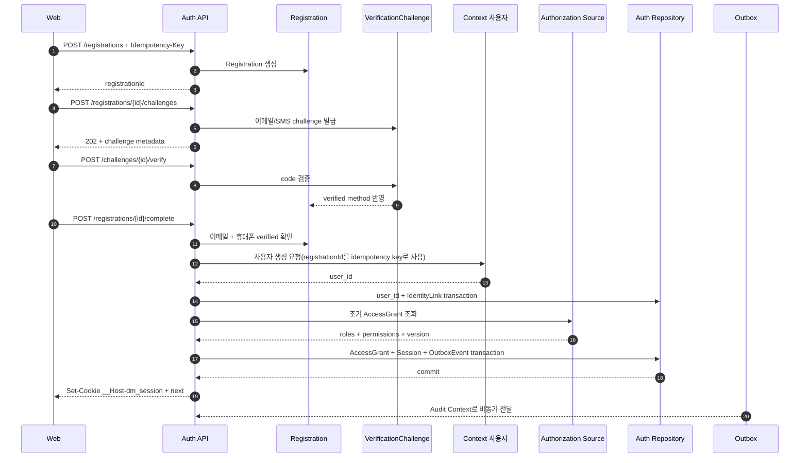
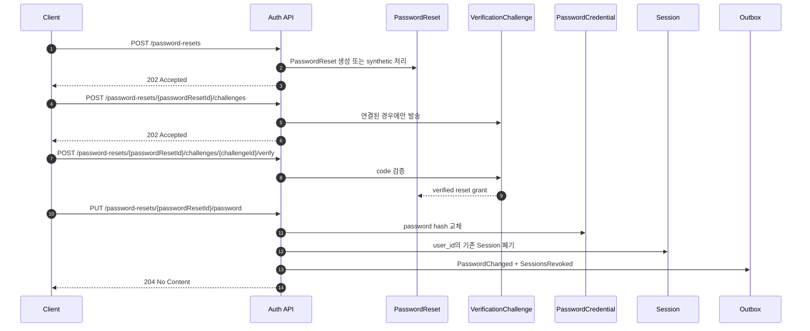

# Context 인증 API 설계

## 기본 정보

- Service Design ID: `SD.A.30040`
- API Base URL: `/api/v1/auth`
- 운영자 API Base URL: `/api/v1/operator/auth`
- Canonical UC: [UC.A.300](../../../30-uc/UC_A_300_auth_member.md)
- 역할: Context 인증의 REST API, 이벤트 계약, 요청/응답, 오류, 보안 경계를 정의한다.
- 주요 클라이언트: 웹 BFF, iOS/Android 앱, 운영자 사이트.
- 제외 범위: 사용자 프로필 저장, 드롭 참여 최종 판정, 외부 이메일/SMS 사업자별 프로토콜, Apple/Google 실제 로그인, passkey MVP 구현.

## 연관 태그

🏷️ 요구사항 참조: [REQ.A.05](../../../00-requirements/REQ_A_05_auth_member.md) | 페이지 참조: [PAGE.A.300](../../../10-sitemap/PAGE_A_300_auth_member/PAGE_A_300_auth_member.md), [PAGE.A.310](../../../10-sitemap/PAGE_A_310_password_find/PAGE_A_310_password_find.md) | UI 참조: [UI.A.300](../../../20-ui/UI_A_300_auth_member/UI_A_300_auth_member.md), [UI.A.310](../../../20-ui/UI_A_310_password_find/UI_A_310_password_find.md) | UC 참조: [UC.A.300](../../../30-uc/UC_A_300_auth_member.md) | BC 참조: [BC.A.300](../../../40-event-storming-bounded-context/BC_A_300_auth_member.md) | 도메인 참조: [SD.A.30010](../A_300_10-domain-model/SD_A_30010_auth_domain_model.md) | 영속성 참조: [SD.A.30020](../A_300_20-persistence/README.md) | 서비스 참조: [SD.A.30030](../A_300_30-service/README.md)

## API 설계 원칙

1. 웹 로그인 상태는 서버 세션으로 관리한다. 웹 응답 본문에 access token이나 refresh token을 노출하지 않는다.
2. 모바일 앱은 짧은 수명의 access JWT와 서버 상태를 가진 opaque refresh token을 사용한다.
3. 이메일, 휴대폰 번호, 인증번호, 비밀번호, token 원문은 JWT claim, 내부 `X-User-*` 헤더, 로그, trace, Domain Event에 넣지 않는다.
4. 공개 인증 API는 계정 존재 여부를 직접 알려주지 않는다. 상세 실패 원인은 권한이 있는 운영자 Query와 감사 이벤트에서만 확인한다.
5. 사용자 프로필, 이름, 약관 동의, 추천인 정보는 BFF가 담당 Context에 먼저 전달한다. Auth 가입 API는 담당 Context가 발급한 opaque reference만 받고 원문을 전달·저장하지 않는다.
6. `user_id`는 Context 사용자가 발급한다. 인증 API는 검증된 Identity를 받은 `user_id`에 연결하며 사용자 계정을 병합하지 않는다.
7. 상태 변경 API는 명시적인 멱등성 계약을 사용한다. 인증번호 재전송처럼 사용자가 새 실행을 의도한 경우에는 새 `Idempotency-Key`를 사용한다.
8. 운영자 수동 처리는 권한, 최근 강한 인증, 승인 참조, 사유, 낙관적 동시성 검사를 모두 통과해야 한다.
9. API transaction과 integration event 발행은 `OutboxEvent`를 이용한다. 외부 소비자는 at-least-once 전달을 전제로 `event_id` 기준 멱등성을 보장한다.

## 공통 HTTP 계약

### 요청 헤더

| Header | 적용 대상 | 규칙 |
| --- | --- | --- |
| `X-Request-Id` | 전체 | 선택 입력이다. Gateway가 비어 있거나 유효하지 않으면 새 UUID를 만들고 응답에 돌려준다. |
| `traceparent` | 전체 | W3C Trace Context를 사용한다. |
| `X-Client-Channel` | 인증 발급 API | 외부 값은 `web`, `ios`, `android` 중 하나다. Gateway가 검증한 뒤 도메인의 `web` 또는 `mobile`로 정규화한다. 클라이언트 입력만으로 token 전달 방식을 바꿀 수 없다. |
| `X-Device-Installation-Id` | 모바일 bootstrap/인증 API | 앱 설치 단위 난수 ID다. rate-limit scope에만 쓰고 사용자 프로필로 해석하지 않는다. |
| `X-App-Attestation` | 모바일 bootstrap | 운영 정책이 활성화되면 Gateway가 Apple/Google attestation을 검증한다. 원문은 Auth에 전달하지 않는다. |
| `X-Auth-Flow-Token` | 모바일 사전 인증 API | AuthenticationIntent에 묶인 단기 opaque proof다. 웹의 `__Host-dm_auth` cookie를 대신하며 Registration, VerificationChallenge, PasswordReset 요청에 사용한다. |
| `Idempotency-Key` | 상태 변경 API | 표에서 `필수`로 표시한 API에 UUID 형식 값을 보낸다. 같은 key와 같은 요청은 같은 결과를 돌려준다. |
| `X-CSRF-Token` | 웹의 unsafe method | 사전 인증 컨텍스트 또는 로그인 세션에 묶인 CSRF token을 보낸다. 모바일 Bearer 요청에는 적용하지 않는다. |
| `Authorization: Bearer <access-jwt>` | 모바일 보호 API | 모바일 access JWT를 보낸다. 웹은 이 헤더 대신 서버 세션 cookie를 사용한다. |
| `If-Match` | 운영자 정책 변경 | 현재 policy version ETag를 보낸다. 버전이 다르면 `412`를 반환한다. |

### 응답 Envelope

성공 응답은 데이터와 요청 식별자를 분리한다.

```json
{
  "data": {
    "example": "value"
  },
  "meta": {
    "requestId": "30d9fa85-0a18-4263-98b6-231dca5a6fb8"
  }
}
```

오류 응답은 `application/problem+json`을 사용한다.

```json
{
  "type": "https://api.dropmong.example/problems/auth-signin-failed",
  "title": "인증 요청을 완료할 수 없습니다.",
  "status": 401,
  "code": "AUTH_SIGNIN_FAILED",
  "detail": "입력한 정보를 확인한 뒤 다시 시도해주세요.",
  "retryable": false,
  "requestId": "30d9fa85-0a18-4263-98b6-231dca5a6fb8"
}
```

`detail`에는 이메일, 휴대폰 번호, 사용자 존재 여부, 내부 식별자, 잠금 정책의 내부 사유를 넣지 않는다.

### 멱등성

- 멱등성 범위는 `API ID + actor 또는 사전 인증 컨텍스트 + Idempotency-Key`다. 단, 아직 컨텍스트가 없는 `API.A.300-01`은 operation namespace 안에서 전역 UUID key를 bootstrap scope로 사용한다.
- 서버는 password, code, proof를 포함한 전체 canonical body에 전용 서버 비밀키 HMAC을 적용한 fingerprint만 `IdempotencyRecord`에 저장한다. 원문과 단순 hash는 저장하지 않는다.
- 같은 key와 같은 hash는 최초 status와 결과 참조를 재사용한다. 민감 값이 없는 응답은 response snapshot을 사용할 수 있다.
- 같은 key와 다른 hash는 `409 AUTH_IDEMPOTENCY_CONFLICT`를 반환한다.
- challenge 발송 API에서 같은 key를 재전송하면 이메일/SMS를 다시 보내지 않는다.
- 모바일 refresh rotation은 같은 key로 재시도하면 최초 회전 결과를 돌려주고 새 token family를 추가로 만들지 않는다.
- token을 다시 내려줘야 하는 refresh 같은 작업은 짧은 TTL의 암호화된 replay payload를 별도 보안 저장소에 두고 IdempotencyRecord에는 reference만 저장한다.
- 로그인/회원가입 완료 응답 유실은 token을 저장하지 않고, 성공 IdempotencyRecord가 가리키는 같은 Session을 유지한 채 멱등 TTL 안에서 SessionCredential만 안전하게 교체한다.
- 보존 기간은 해당 작업의 재시도 가능 기간보다 길어야 하며, 비밀번호나 token 평문은 IdempotencyRecord에 저장하지 않는다.

## 클라이언트별 세션 전달

### 웹

웹 로그인과 회원가입 완료 응답은 다음 cookie를 설정한다.

```http
Set-Cookie: __Host-dm_session=<opaque-random>; Path=/; HttpOnly; Secure; SameSite=Lax
```

- `Domain` 속성을 사용하지 않고 `__Host-` prefix를 유지한다.
- `rememberMe=false`이면 브라우저 session cookie로 발급하고 서버 absolute TTL을 적용한다.
- `rememberMe=true`이면 정책에서 정한 `Max-Age`를 추가하되 서버 TTL보다 길게 두지 않는다.
- 로그인 성공, 권한 상승, 재인증 성공 시 session credential을 회전해 session fixation을 막는다.
- unsafe method는 `Origin` 검사와 session에 묶인 `X-CSRF-Token` 검사를 모두 통과해야 한다.
- CSRF token은 SessionCredential ID와 서버에 저장한 credential hash, CSRF key version으로 도출한다. 로그인/가입 완료 응답과 `GET /api/v1/auth/context`가 현재 값을 반환하며, 원문을 DB나 cookie에 저장하지 않는다.
- 브라우저는 CSRF token을 메모리에 두고 unsafe 요청 header에만 보낸다. Session credential이 회전되면 이전 CSRF token도 즉시 무효가 된다.
- 브라우저 JavaScript, LocalStorage, SessionStorage에 access token이나 refresh token을 저장하지 않는다.

사전 인증 단계는 별도 단기 cookie를 사용한다.

```http
Set-Cookie: __Host-dm_auth=<opaque-random>; Path=/; HttpOnly; Secure; SameSite=Lax
```

`__Host-dm_auth`는 AuthenticationIntent, Registration, PasswordReset과 CSRF token을 묶으며 로그인 성공 또는 TTL 만료 시 폐기한다.

모바일은 `__Host-dm_auth` 대신 AuthenticationIntent 생성 응답의 `authFlowToken`을 메모리에 두고 `X-Auth-Flow-Token`으로 보낸다. `authFlowToken`은 목적, client channel, intent, 만료 시각에 묶으며 refresh token이나 로그인 credential로 사용할 수 없다.

### 모바일

모바일 로그인과 회원가입 완료 응답은 다음 값을 본문으로 반환한다.

```json
{
  "data": {
    "session": {
      "sessionId": "ses_01JXYZ...",
      "expiresAt": "2026-07-24T08:00:00Z"
    },
    "tokens": {
      "accessToken": "<signed-jwt>",
      "accessTokenExpiresAt": "2026-07-10T08:15:00Z",
      "refreshToken": "<opaque-refresh-token>",
      "refreshTokenExpiresAt": "2026-07-24T08:00:00Z"
    },
    "next": {
      "path": "/drops/drop_123",
      "intentId": "aint_01JXYZ..."
    }
  },
  "meta": {
    "requestId": "30d9fa85-0a18-4263-98b6-231dca5a6fb8"
  }
}
```

- iOS는 refresh token을 Keychain에, Android는 Keystore 기반 암호화 저장소에 저장한다.
- access JWT는 메모리에 우선 보관한다.
- refresh token은 opaque 난수이며 매 refresh마다 회전한다.
- 이전 refresh token 재사용이 감지되면 같은 family와 Session을 폐기하고 `AUTH_SESSION_REVOKED`를 반환한다.

모바일 access JWT의 최소 claim은 다음과 같다.

| Claim | 의미 |
| --- | --- |
| `iss` | DropMong 인증 발급자 |
| `sub` | Context 사용자가 발급한 `user_id` |
| `roles` | 정규화된 coarse-grained role 배열 |
| `permission_version` | 발급 시 반영한 AccessGrant version |
| `aud` | 허용된 모바일/API audience |
| `iat`, `exp` | 발급/만료 시각 |
| `jti` | token 고유 ID |
| `sid` | Session 상태 확인이 필요한 경우의 session reference |

JWT에는 `email`, `phone_number`, `identity_id`, 프로필, ACL 목록을 넣지 않는다.

### 외부 Provider token 경계

- 후속 Apple/Google OIDC를 도입하더라도 provider ID token은 callback에서 issuer, audience, nonce, signature, exp를 검증하는 1회 identity proof로만 사용한다.
- provider access token은 provider API 호출용이며 DropMong API의 Bearer credential로 받지 않는다. 브라우저·앱이 보낸 provider token을 내부 `X-User-*` context로 변환하지 않는다.
- DropMong access JWT, 내부 context JWT, provider token은 issuer, audience, signing key를 분리한다. ID token 검증 성공 뒤에는 내부 Identity/Session을 새로 발급하고 provider token 원문을 저장하지 않는다.

### 내부 사용자 컨텍스트

신뢰 경계는 외부 요청의 `X-User-*` 헤더를 제거한 뒤 검증된 세션 또는 JWT로 다음 헤더만 생성한다.

```http
X-User-Id: <user_id>
X-User-Roles: <comma-separated-canonical-roles>
X-Permission-Version: <access_grant_version>
X-Token-Id: <jwt.jti-or-session-artifact-id>
```

`X-User-Email`은 사용하지 않는다. 내부 서비스가 사용자 프로필을 필요로 하면 Context 사용자 공개 API를 별도로 호출한다.

## Endpoint 목록

| API ID | Method / Path | 역할 | 인증 / 권한 | 멱등성 |
| --- | --- | --- | --- | --- |
| `API.A.300-01` | `POST /api/v1/auth/intents` | 검증된 내부 복귀 위치와 사용자 행동을 AuthenticationIntent로 보존한다. | 웹: Origin/Fetch Metadata, 모바일: 검증된 채널+설치 ID+attestation 정책 | 필수 |
| `API.A.300-02` | `GET /api/v1/auth/methods?intentId=...` | 노출 가능한 인증 수단과 정책 수준의 UI 설정을 조회한다. | 해당 AuthenticationIntent의 `__Host-dm_auth` 또는 `X-Auth-Flow-Token` | 해당 없음 |
| `API.A.300-03` | `POST /api/v1/auth/registrations` | 이메일 회원가입 Registration을 시작한다. | 사전 인증 컨텍스트 | 필수 |
| `API.A.300-04` | `POST /api/v1/auth/registrations/{registrationId}/challenges` | 가입용 이메일 또는 SMS VerificationChallenge를 발급/재발급한다. | 해당 Registration 소유 | 필수 |
| `API.A.300-05` | `POST /api/v1/auth/registrations/{registrationId}/challenges/{challengeId}/verify` | 가입 challenge를 검증한다. | 해당 Registration 소유 | 필수 |
| `API.A.300-06` | `POST /api/v1/auth/registrations/{registrationId}/complete` | 두 소유 확인 후 User Context에 사용자 생성을 요청하고 IdentityLink와 Session을 만든다. | 해당 Registration 소유 | 필수 |
| `API.A.300-07` | `POST /api/v1/auth/signins/email` | 이메일과 비밀번호로 로그인한다. | 공개 진입, 사전 인증 컨텍스트 필수 | 필수 |
| `API.A.300-08` | `POST /api/v1/auth/signins/phone/challenges` | 휴대폰 로그인용 SMS challenge를 시작한다. | 공개 진입, 사전 인증 컨텍스트 필수 | 필수 |
| `API.A.300-09` | `POST /api/v1/auth/signins/phone/challenges/{challengeId}/verify` | SMS 소유 확인 후 연결된 `user_id`로 로그인한다. | challenge 소유 | 필수 |
| `API.A.300-10` | `POST /api/v1/auth/password-resets` | 비밀번호 재설정 PasswordReset을 시작한다. | 공개, 사전 인증 컨텍스트 | 필수 |
| `API.A.300-11` | `POST /api/v1/auth/password-resets/{passwordResetId}/challenges` | 선택한 이메일/SMS 재설정 challenge를 발급한다. | 해당 PasswordReset 소유 | 필수 |
| `API.A.300-12` | `POST /api/v1/auth/password-resets/{passwordResetId}/challenges/{challengeId}/verify` | 재설정 challenge를 검증하고 단기 reset grant를 만든다. | challenge 소유 | 필수 |
| `API.A.300-13` | `PUT /api/v1/auth/password-resets/{passwordResetId}/password` | 새 비밀번호로 교체하고 기존 Session을 폐기한다. | 검증된 PasswordReset / reset grant | 필수 |
| `API.A.300-14` | `POST /api/v1/auth/sessions/refresh` | 모바일 refresh token을 회전하고 새 access JWT를 발급한다. | 모바일 refresh credential | 필수 |
| `API.A.300-15` | `POST /api/v1/auth/sessions/logout` | 웹 현재 Session 또는 모바일 refresh family를 폐기한다. | 웹 session 또는 모바일 refresh credential | 필수 |
| `API.A.300-16` | `GET /api/v1/auth/context` | 현재 인증 상태, role, session 요약을 조회한다. | 선택적 인증 | 해당 없음 |
| `API.A.300-17` | `POST /api/v1/auth/reauthentications/email` | 고위험 변경용 단기 ReauthenticationProof를 만든다. | 사용자 session + 비밀번호 | 필수 |
| `API.A.300-18` | `POST /api/v1/auth/method-links` | 현재 `user_id`에 새 인증 수단을 연결할 intent를 시작한다. | 사용자 session + recent auth | 필수 |
| `API.A.300-19` | `POST /api/v1/auth/method-links/{linkIntentId}/challenges` | 연동할 Identity의 소유 확인 challenge를 발급한다. | link intent 소유 | 필수 |
| `API.A.300-20` | `POST /api/v1/auth/method-links/{linkIntentId}/complete` | challenge proof를 검증·소비하고 Identity를 현재 `user_id`에 연결한다. | 사용자 session + recent auth | 필수 |
| `API.A.300-21` | `POST /api/v1/auth/phone-replacements` | 현재 휴대폰 Identity 교체 intent를 시작한다. | 사용자 session + email ReauthenticationProof | 필수 |
| `API.A.300-22` | `POST /api/v1/auth/phone-replacements/{replacementId}/challenges` | 새 휴대폰 번호의 SMS challenge를 발급한다. | replacement intent 소유 | 필수 |
| `API.A.300-23` | `POST /api/v1/auth/phone-replacements/{replacementId}/complete` | 새 번호 challenge proof를 검증하고 기존 Link를 닫은 뒤 같은 `user_id`에 새 Identity를 연결한다. | 사용자 session + recent auth | 필수 |
| `API.A.300-24` | `GET /api/v1/operator/auth/users/{userId}` | 마스킹된 인증 상태, 잠금, Link, 활성 Session 수를 조회한다. | `auth.case.read` | 해당 없음 |
| `API.A.300-25` | `GET /api/v1/operator/auth/policies` | TTL, rotation, lock, challenge 제한 정책을 조회한다. | `auth.policy.read` | 해당 없음 |
| `API.A.300-26` | `PATCH /api/v1/operator/auth/policies/{policyName}` | 허용된 인증 정책 값을 변경한다. | `auth.policy.write` + strong auth | 필수 + `If-Match` |
| `API.A.300-27` | `POST /api/v1/operator/auth/manual-actions` | 승인된 잠금 해제, Link 해제/재연동, Session 폐기를 수행한다. | `auth.case.execute` + strong auth + 승인 | 필수 |
| `API.A.300-28` | `GET /api/v1/auth/registrations/{registrationId}` | 중단·재시도 뒤 회원가입 단계와 자동 로그인 완료 여부를 조회한다. | 해당 Registration 소유 | 해당 없음 |
| `API.A.300-29` | `POST /api/v1/auth/intents/{intentId}/action-resume` | 로그인 전 보존한 action과 최소 context를 같은 Session에 한 번 전달한다. | Intent를 소비한 사용자 Session | 필수 |

## 주요 요청과 응답

### AuthenticationIntent 생성

`POST /api/v1/auth/intents`

```json
{
  "returnPath": "/drops/drop_123",
  "intentType": "purchase",
  "actionContext": {
    "dropId": "drop_123",
    "optionId": "opt_456",
    "quantity": 1
  }
}
```

```json
{
  "data": {
    "authIntentId": "aint_01JXYZ...",
    "expiresAt": "2026-07-10T08:10:00Z",
    "nextPath": "/auth/signin",
    "csrfToken": "<web-only-session-bound-csrf-token>",
    "authFlowToken": "<mobile-only-opaque-flow-token>"
  },
  "meta": {
    "requestId": "30d9fa85-0a18-4263-98b6-231dca5a6fb8"
  }
}
```

- `returnPath`는 allowlist에 있는 상대 경로만 허용한다.
- `actionContext`는 `intentType`별 schema로 검증하고 임의 URL, script, 결제 비밀정보를 저장하지 않는다.
- 허용된 `actionContext`는 Auth의 단기 encrypted ActionIntentPayload에 저장하고 Intent에는 opaque reference만 둔다. 로그인 성공 뒤 BFF에 한 번 전달한 후 crypto-shred한다.
- 웹 응답은 `csrfToken`과 `__Host-dm_auth` cookie를, 모바일 응답은 `authFlowToken`을 반환한다. 실제 응답에는 해당 channel에 필요한 값만 포함한다.

### 인증 후 행동 복구

로그인/가입 완료 응답의 `next.intentId`가 있으면 `POST /api/v1/auth/intents/{intentId}/action-resume`을 호출한다.

```json
{}
```

```json
{
  "data": {
    "intentId": "aint_01JXYZ...",
    "action": "purchase",
    "actionContext": {
      "dropId": "drop_01JXYZ...",
      "optionId": "opt_01JXYZ...",
      "quantity": 1
    },
    "returnPath": "/drops/drop_01JXYZ..."
  },
  "meta": {
    "requestId": "30d9fa85-0a18-4263-98b6-231dca5a6fb8"
  }
}
```

- Intent의 `consumed_by_session_id`와 현재 Session이 같아야 한다. intent ID만으로 payload를 조회할 수 없다.
- 최초 성공은 delivered 상태를 기록하고, 같은 `Idempotency-Key`는 짧은 delivery replay TTL 동안 같은 응답을 반환한다. 다른 key 재소비나 TTL 뒤 조회는 거부하고 ciphertext를 crypto-shred한다.
- 이 API는 원래 업무 명령을 대신 실행하지 않는다. BFF/클라이언트가 반환된 action을 해당 업무 API의 별도 멱등 키로 수행한다.

### 이메일 회원가입 시작

`POST /api/v1/auth/registrations`

```json
{
  "authIntentId": "aint_01JXYZ...",
  "email": "buyer@example.com",
  "password": "<user-entered-password>",
  "phone": {
    "countryCode": "+82",
    "nationalNumber": "01012345678"
  },
  "profileRequestId": "profile_req_01JXYZ...",
  "agreementReceiptId": "agreement_receipt_01JXYZ...",
  "rememberMe": true
}
```

```json
{
  "data": {
    "registrationId": "reg_01JXYZ...",
    "status": "pending_verification",
    "requiredVerifications": [
      "email",
      "phone"
    ],
    "verifiedMethods": [],
    "expiresAt": "2026-07-10T08:30:00Z"
  },
  "meta": {
    "requestId": "30d9fa85-0a18-4263-98b6-231dca5a6fb8"
  }
}
```

- Auth 저장소에는 password hash와 인증용 Identity 정보만 장기 저장한다.
- 입력 비밀번호는 요청 처리 중 즉시 안전한 password hash로 바꾸고 Registration이나 Idempotency 저장소에 평문을 남기지 않는다.
- 이름과 추천인 입력은 Context 사용자가 먼저 받아 `profileRequestId`를 발급하고, 동의 담당 Context는 필수 동의를 검증한 뒤 `agreementReceiptId`를 발급한다.
- Auth API는 두 opaque reference만 받는다. 프로필, 추천인, 약관 원문을 Auth 저장소나 IdempotencyRecord에 복제하지 않는다.

### 가입 challenge 발급과 검증

`POST /api/v1/auth/registrations/{registrationId}/challenges`

```json
{
  "method": "email"
}
```

```json
{
  "data": {
    "challengeId": "vch_01JXYZ...",
    "method": "email",
    "maskedDestination": "b***@example.com",
    "expiresAt": "2026-07-10T08:08:00Z",
    "resendAvailableAt": "2026-07-10T08:01:00Z"
  },
  "meta": {
    "requestId": "30d9fa85-0a18-4263-98b6-231dca5a6fb8"
  }
}
```

`POST /api/v1/auth/registrations/{registrationId}/challenges/{challengeId}/verify`

```json
{
  "code": "123456"
}
```

```json
{
  "data": {
    "challengeId": "vch_01JXYZ...",
    "status": "verified",
    "registration": {
      "status": "pending_verification",
      "verifiedMethods": [
        "email"
      ],
      "requiredVerifications": [
        "email",
        "phone"
      ]
    }
  },
  "meta": {
    "requestId": "30d9fa85-0a18-4263-98b6-231dca5a6fb8"
  }
}
```

가입 완료는 두 challenge가 모두 verified일 때만 성공한다. Auth는 Registration마다 고정한 내부 `userCreationRequestId`를 Context 사용자 멱등성 key로 사용한다. Context 사용자 생성 후 Auth transaction이 실패해도 같은 요청 ID로 같은 `user_id`를 받은 뒤 `linking` 단계부터 재개한다.

### 가입 완료와 상태 조회

`POST /api/v1/auth/registrations/{registrationId}/complete`

```json
{}
```

```json
{
  "data": {
    "registrationId": "reg_01JXYZ...",
    "status": "completed",
    "userId": "usr_01JXYZ...",
    "sessionId": "ses_01JXYZ...",
    "next": {
      "path": "/drops/drop_01JXYZ...",
      "intentId": "aint_01JXYZ..."
    }
  },
  "meta": {
    "requestId": "30d9fa85-0a18-4263-98b6-231dca5a6fb8"
  }
}
```

- 성공할 때만 `200`과 채널별 Session 전달물을 반환한다. 웹은 `Set-Cookie`, 모바일은 공통 모바일 token 응답을 함께 사용한다.
- Context 사용자 또는 Authorization Source가 일시적으로 응답하지 않으면 `503 AUTH_SERVICE_UNAVAILABLE`을 반환하고 Registration을 `requesting_user` 또는 `issuing_session`에 유지한다. 같은 `Idempotency-Key` 재시도는 저장된 단계부터 이어서 처리한다.
- completed 응답을 잃은 클라이언트가 같은 `Idempotency-Key`와 Registration owner proof로 멱등 TTL 안에 다시 요청하면 새 Session을 만들지 않는다. 현재 Session credential이 요청에 있으면 그대로 확인하고, 없으면 같은 Session 안에서 credential만 교체해 최신 응답을 반환한다. 이전 credential은 즉시 폐기한다.
- 멱등 TTL이 끝난 뒤에는 credential을 복구하지 않고 `AUTH_SESSION_DELIVERY_EXPIRED`를 반환해 일반 로그인을 요구한다.

`GET /api/v1/auth/registrations/{registrationId}`

```json
{
  "data": {
    "registrationId": "reg_01JXYZ...",
    "status": "issuing_session",
    "verifiedMethods": [
      "email",
      "phone"
    ],
    "retryable": true,
    "expiresAt": "2026-07-10T08:30:00Z"
  },
  "meta": {
    "requestId": "30d9fa85-0a18-4263-98b6-231dca5a6fb8"
  }
}
```

상태 조회는 `user_id`, 내부 failure detail, Identity 원문을 진행 중 응답에 노출하지 않는다. completed 응답은 자동 로그인 전달이 끝났는지만 알리고 credential 원문을 다시 반환하지 않는다.

### 이메일 로그인

`POST /api/v1/auth/signins/email`

```json
{
  "authIntentId": "aint_01JXYZ...",
  "email": "buyer@example.com",
  "password": "<user-entered-password>",
  "rememberMe": true
}
```

성공하면 웹은 `Set-Cookie`와 session summary를, 모바일은 session과 token 묶음을 반환한다. 이메일과 비밀번호가 맞지 않으면 계정 존재 여부와 관계없이 `401 AUTH_SIGNIN_FAILED`를 반환한다. 정확한 credential을 확인한 뒤 잠금 상태로 판정된 경우에만 `423 AUTH_ACCOUNT_LOCKED`와 `unlockAvailableAt`을 반환할 수 있다.

같은 `Idempotency-Key`의 이전 실패가 완료 상태면 같은 오류를 재생하고 비밀번호를 다시 검증하거나 failure count를 늘리지 않는다. 이전 요청이 성공했지만 응답만 유실됐다면 비밀번호를 다시 검증한 뒤 새 Session을 만들지 않고 성공 레코드의 SessionCredential을 교체해 최신 전달물을 반환한다. 다른 입력 또는 멱등 TTL 뒤 재시도는 새 key가 필요하다.

### 휴대폰 번호 로그인

`POST /api/v1/auth/signins/phone/challenges`

```json
{
  "authIntentId": "aint_01JXYZ...",
  "countryCode": "+82",
  "phoneNumber": "01012345678"
}
```

응답은 IdentityLink 존재 여부와 관계없이 `202 Accepted`와 같은 shape를 사용한다. challenge를 통과한 뒤 연결된 `user_id`가 없을 때만 `409 AUTH_PHONE_IDENTITY_NOT_LINKED`를 반환해 이메일 회원가입 또는 로그인 후 연동을 안내한다.

검증 API의 같은-key 실패 재시도는 같은 오류를 재생하고 challenge/Identity failure count를 다시 늘리지 않는다. 성공 응답이 유실된 재시도는 이미 성공한 challenge 결과와 IdempotencyRecord가 같은 요청을 가리킬 때만 기존 논리 Session의 credential을 교체한다.

### 비밀번호 재설정

`POST /api/v1/auth/password-resets`

```json
{
  "identifierType": "email",
  "identifier": "buyer@example.com"
}
```

```json
{
  "data": {
    "passwordResetId": "prst_01JXYZ...",
    "status": "accepted",
    "methodOptions": [
      "email",
      "phone"
    ],
    "expiresAt": "2026-07-10T08:15:00Z"
  },
  "meta": {
    "requestId": "30d9fa85-0a18-4263-98b6-231dca5a6fb8"
  }
}
```

- 등록된 계정이 없어도 같은 `202`, 응답 shape, 유사한 응답 시간을 사용한다.
- `methodOptions`는 정책상 지원 수단이며 실제 연결 여부를 뜻하지 않는다.
- 검증 전에는 사용자가 직접 입력한 주소 외에 연결된 연락처의 마스킹 값도 노출하지 않는다.
- 실제 계정과 선택한 수단이 연결되어 있을 때만 이메일/SMS를 발송한다.

challenge 검증 성공 후 웹은 `__Host-dm_auth`에 reset 권한을 묶고, 모바일은 한 번만 사용할 수 있는 단기 `resetGrant`를 받는다.

`PUT /api/v1/auth/password-resets/{passwordResetId}/password`

```json
{
  "resetGrant": "<mobile-only-one-time-grant>",
  "newPassword": "<new-password>",
  "confirmPassword": "<new-password>"
}
```

성공 시 PasswordCredential을 교체하고 기존 Session과 refresh family를 모두 폐기한다. MVP는 자동 로그인하지 않으며 `204 No Content` 후 이메일 로그인으로 이동한다.

연결된 AuthenticationIntent는 `password_reset_completed`로 소비한다. 웹은 `__Host-dm_auth` cookie를 `Max-Age=0`으로 만료시키고, 모바일은 해당 authFlowToken/resetGrant를 즉시 폐기한다.

### Session refresh와 logout

`POST /api/v1/auth/sessions/refresh`는 모바일 전용이다.

```json
{
  "refreshToken": "<opaque-refresh-token>"
}
```

성공 응답은 새 access JWT와 회전된 refresh token을 반환한다. 웹 서버 세션은 이 endpoint를 호출하지 않는다.

`POST /api/v1/auth/sessions/logout`

```json
{
  "refreshToken": "<mobile-only-opaque-refresh-token>"
}
```

- 웹은 body 없이 session cookie와 CSRF token으로 호출하고 cookie를 즉시 만료시킨다.
- 모바일은 refresh token으로 현재 family를 폐기한다.
- 이미 폐기된 Session에 같은 `Idempotency-Key`로 재요청해도 성공 결과를 반환한다.

### 현재 인증 컨텍스트

`GET /api/v1/auth/context`는 공개 페이지의 선택적 개인화 경계에서도 사용할 수 있도록 인증 정보가 없을 때 `200`을 반환한다.

```json
{
  "data": {
    "authenticated": true,
    "userId": "usr_01JXYZ...",
    "roles": [
      "CUSTOMER"
    ],
    "session": {
      "sessionId": "ses_01JXYZ...",
      "channel": "web",
      "authenticationMethod": "email_password",
      "authenticatedAt": "2026-07-10T08:00:00Z",
      "expiresAt": "2026-07-24T08:00:00Z"
    },
    "linkedMethodTypes": [
      "email",
      "phone"
    ],
    "csrfToken": "<web-session-bound-token>"
  },
  "meta": {
    "requestId": "30d9fa85-0a18-4263-98b6-231dca5a6fb8"
  }
}
```

인증 정보가 없으면 `data.authenticated=false`만 반환한다. 보호 API는 이 Query 결과를 권한 근거로 재사용하지 않고 Gateway에서 독립적으로 `401` 또는 `403`을 결정한다.

### 재인증, 인증 수단 연동, 휴대폰 교체

`POST /api/v1/auth/reauthentications/email`은 현재 비밀번호를 검증하고 5분 이내의 단기 ReauthenticationProof를 만든다. 이 proof는 대상 `user_id`, Session, 허용 목적, 만료 시각에 묶으며 role/permission AccessGrant나 다른 작업에 재사용할 수 없다.

재인증 성공 시 현재 Session의 인증 근거를 같은 `user_id`의 active 이메일 IdentityLink로 재바인딩하고 Session credential과 CSRF token을 회전한다. 따라서 휴대폰 로그인으로 시작한 Session도 기존 휴대폰 Link가 교체된 뒤 안전하게 유지할 수 있다.

웹은 응답에서 새 `__Host-dm_session` cookie와 `csrfToken`을, 모바일은 공통 session/token 묶음을 다시 받는다. 이전 SessionCredential은 즉시 폐기한다. ReauthenticationProof에는 email Identity와 `authentication_method=email_password`가 바인딩된다.

`linkIntentId`와 `replacementId`는 별도 임시 Aggregate ID가 아니라 `link_status=requested`인 IdentityLink ID다. 시작 요청은 proof를 소비하고 대상 Identity, 현재 `user_id`, Session, 목적, 만료 시각을 requested Link에 고정한다. 후속 Challenge의 `contextId`도 같은 ID를 사용한다.

```json
{
  "purpose": "replace_phone",
  "password": "<current-password>"
}
```

```json
{
  "data": {
    "reauthenticationProof": "<short-lived-purpose-bound-proof>",
    "purpose": "replace_phone",
    "expiresAt": "2026-07-10T08:05:00Z"
  }
}
```

`POST /api/v1/auth/method-links`는 다음 값을 받는다.

```json
{
  "method": "phone",
  "destination": {
    "countryCode": "+82",
    "nationalNumber": "01098765432"
  },
  "reauthenticationProof": "<short-lived-purpose-bound-proof>"
}
```

`POST /api/v1/auth/phone-replacements`는 다음 값을 받는다.

```json
{
  "newPhone": {
    "countryCode": "+82",
    "nationalNumber": "01098765432"
  },
  "reauthenticationProof": "<short-lived-purpose-bound-proof>"
}
```

두 작업의 `complete` 요청은 발급한 challenge와 사용자가 제출한 proof를 함께 받는다. 서버는 challenge를 원자적으로 검증·소비한 뒤에만 IdentityLink를 변경한다.

```json
{
  "challengeId": "vch_01JXYZ...",
  "proof": {
    "type": "code",
    "value": "123456"
  }
}
```

- 이미 다른 `user_id`에 active 연결된 Identity는 `409 AUTH_IDENTITY_LINK_CONFLICT`를 반환한다.
- 휴대폰 교체 완료는 기존 IdentityLink를 닫고 새 IdentityLink를 활성화하는 단일 transaction으로 처리한다.
- 완료 후 기존 휴대폰 Identity를 인증 근거로 쓰는 다른 Session은 폐기한다. 현재 Session은 이메일 재인증으로 재바인딩된 상태를 유지하고 credential을 다시 회전한다.
- 계정 병합 API는 제공하지 않는다.

### 운영자 정책 조회와 변경

`GET /api/v1/operator/auth/policies` 응답은 secret을 제외한 운영 가능 값과 policy version만 반환한다.

```json
{
  "data": {
    "policies": [
      {
        "name": "login-lock",
        "version": 7,
        "values": {
          "failureThreshold": 5,
          "windowSeconds": 900,
          "lockSeconds": 1800
        }
      },
      {
        "name": "session-ttl",
        "version": 4,
        "values": {
          "mobileAccessSeconds": 900,
          "mobileRefreshSeconds": 1209600,
          "webRememberMeSeconds": 2592000
        }
      }
    ]
  },
  "meta": {
    "requestId": "30d9fa85-0a18-4263-98b6-231dca5a6fb8"
  }
}
```

`PATCH /api/v1/operator/auth/policies/login-lock`

```http
If-Match: "auth-policy-login-lock-v7"
```

```json
{
  "failureThreshold": 5,
  "windowSeconds": 900,
  "lockSeconds": 1800,
  "changeReason": "SECURITY_BASELINE_UPDATE"
}
```

허용 범위 밖 값, secret 값 변경, 이미 지난 version 변경은 거부한다. 성공 응답은 새 `ETag`를 반환하고 정책 변경 감사 이벤트를 발행한다.

### 운영자 수동 처리

`POST /api/v1/operator/auth/manual-actions`

```json
{
  "caseId": "case_01JXYZ...",
  "target": {
    "type": "identity_link",
    "id": "ilnk_01JXYZ..."
  },
  "action": "approve_relink",
  "reasonCode": "ACCOUNT_RECOVERY_VERIFIED",
  "approvalId": "approval_01JXYZ...",
  "evidenceRef": "case-evidence://case_01JXYZ..."
}
```

- 실행자 `user_id`와 role은 요청 body가 아니라 검증된 운영자 Principal에서 얻는다.
- `approvalId`는 승인 시스템에서 유효성, 승인자 등급, 대상, 만료 시각을 확인한다.
- 증빙 원문과 개인정보는 Auth API body나 감사 이벤트에 복사하지 않고 접근 통제된 reference만 남긴다.
- 잠금 해제, Link 해제/재연동, Session 폐기는 서로 다른 `action`과 권한으로 분리한다.
- 수동 DB 수정 endpoint는 제공하지 않는다.

## 오류 계약

| Error Code | HTTP | 공개 조건 | 처리 |
| --- | --- | --- | --- |
| `AUTH_INPUT_INVALID` | `400` | 요청 schema 또는 형식 오류 | field 오류 목록은 PII를 포함하지 않는다. |
| `AUTH_REDIRECT_INVALID` | `400` | 허용되지 않은 복귀 위치 | 홈 또는 안전한 기본 경로로 다시 시작한다. |
| `AUTH_INTENT_EXPIRED` | `410` | AuthenticationIntent 만료 | 새 intent를 만든다. |
| `AUTH_METHOD_UNAVAILABLE` | `409` | 비활성 인증 수단 | 활성 수단 선택으로 돌아간다. |
| `AUTH_IDEMPOTENCY_CONFLICT` | `409` | 같은 key에 다른 payload | 새 key로 명시적으로 다시 실행한다. |
| `AUTH_IDENTIFIER_UNAVAILABLE` | `409` | 가입 식별자를 사용할 수 없음 | 중복, 예약, 위험 판정을 구분하지 않는 안내를 사용한다. |
| `AUTH_CHALLENGE_FAILED` | `400` | code 불일치 또는 검증 실패 | 남은 횟수 대신 일반 안내를 기본값으로 둔다. |
| `AUTH_CHALLENGE_EXPIRED` | `410` | challenge TTL 만료 | 새 challenge를 발급한다. |
| `AUTH_RATE_LIMITED` | `429` | 발급, 검증, 로그인 제한 초과 | `Retry-After`를 반환한다. |
| `AUTH_SIGNIN_FAILED` | `401` | 이메일/비밀번호 검증 실패 | 계정 존재 여부를 숨긴다. |
| `AUTH_ACCOUNT_LOCKED` | `423` | 올바른 credential 확인 후 잠금 상태 | `unlockAvailableAt`을 반환할 수 있다. |
| `AUTH_PASSWORD_RESET_REQUIRED` | `403` | 올바른 이메일 credential 확인 후 강제 재설정 상태 | 비밀번호 재설정 API로 이동한다. |
| `AUTH_USER_RESTRICTED` | `403` | credential/OTP 확인 뒤 사용자 제한·비활성 상태 | 새 Session/refresh/재인증을 거부하고 지원 안내를 제공한다. |
| `AUTH_PHONE_IDENTITY_NOT_LINKED` | `409` | SMS 소유 확인 후 active Link 없음 | 회원가입 또는 로그인 후 연동을 안내한다. |
| `AUTH_SESSION_REQUIRED` | `401` | 보호 API에 인증 정보 없음 | 로그인 intent를 만든다. |
| `AUTH_SESSION_REVOKED` | `401` | Session 폐기 또는 refresh 재사용 탐지 | 로컬 credential을 폐기하고 다시 로그인한다. |
| `AUTH_SESSION_DELIVERY_EXPIRED` | `410` | 로그인/회원가입 credential 전달 복구 기간 종료 | 새 로그인 action으로 다시 인증한다. |
| `AUTH_REFRESH_RETRY_EXPIRED` | `410` | 같은-key refresh 암호화 응답의 복구 TTL 종료 | token을 다시 보내지 말고 새로 로그인한다. |
| `AUTH_FORBIDDEN` | `403` | role 또는 permission 부족 | 리소스 존재 여부를 추가로 노출하지 않는다. |
| `AUTH_CSRF_INVALID` | `403` | 웹 CSRF/Origin 검증 실패 | 새 인증 컨텍스트를 시작한다. |
| `AUTH_REAUTH_REQUIRED` | `403` | 고위험 작업에 recent auth 없음 | 재인증 endpoint로 이동한다. |
| `AUTH_REAUTHENTICATION_PROOF_INVALID` | `410` | ReauthenticationProof 만료·소비·목적 불일치 | 목적에 맞게 재인증한다. |
| `AUTH_IDENTITY_LINK_CONFLICT` | `409` | 이미 다른 사용자에 active 연결 | 계정 병합 없이 수동 처리 안내를 제공한다. |
| `AUTH_PASSWORD_POLICY_NOT_MET` | `422` | 새 비밀번호 정책 미충족 | 공개 가능한 정책 항목만 반환한다. |
| `AUTH_PASSWORD_RESET_INVALID` | `400` | reset intent/grant 검증 실패 | 세부 원인을 합치고 처음부터 다시 시작한다. |
| `AUTH_POLICY_PRECONDITION_FAILED` | `412` | `If-Match` policy version 불일치 | 최신 정책을 다시 조회한다. |
| `AUTH_APPROVAL_REQUIRED` | `409` | 승인 누락/만료/대상 불일치 | 유효한 승인 참조를 받는다. |
| `AUTH_SERVICE_UNAVAILABLE` | `503` | 인증 저장소/필수 의존성 장애 | `Retry-After`와 안정된 일반 메시지를 반환한다. |

CS/운영자 Query에는 별도 내부 reason code를 제공할 수 있지만 공개 오류 code를 상세 내부 사유와 일대일로 매핑하지 않는다.

## 보안 정책

### 계정 존재 여부 보호

- 이메일 로그인 실패는 존재하지 않는 계정, 비밀번호 오류, 비활성 Identity를 `AUTH_SIGNIN_FAILED`로 합친다.
- 비밀번호 재설정 시작과 challenge 발급은 계정/수단 존재 여부와 관계없이 `202`를 반환한다.
- 휴대폰 로그인 challenge 시작은 IdentityLink 존재 여부를 알리지 않는다.
- 휴대폰 번호 미연결은 해당 번호의 SMS challenge를 통과한 사용자에게만 알려준다.
- 가입 식별자 중복은 `AUTH_IDENTIFIER_UNAVAILABLE`로 일반화하고 `user_id`나 연결 수단을 노출하지 않는다.
- 응답 시간 차이를 줄이고 고비용 password hash 검증에는 적절한 dummy verification을 사용한다.

### 초기 제한값

아래 값은 첫 운영 기본값이며 배포 없이 정책으로 변경할 수 있어야 한다.

| 대상 | 초기 제한 | 기준 key |
| --- | --- | --- |
| AuthenticationIntent 생성 | 분당 30회 | IP + 사전 인증 컨텍스트 |
| Registration 생성 | 시간당 5회 | IP + normalized identifier |
| 이메일/SMS challenge 발급 | 15분당 3회, 하루 10회 | purpose + destination + IP |
| challenge code 검증 | challenge당 5회 | challenge ID |
| 이메일 로그인 실패 | 15분 동안 5회 후 30분 잠금 | Identity + IP 보조 제한 |
| 휴대폰 로그인 시작 | 15분당 3회 | phone blind index + IP |
| 비밀번호 재설정 시작 | 15분당 3회 | identifier blind index + IP |
| 모바일 refresh | 분당 30회 | Session + refresh family |
| 운영자 수동 처리 | 분당 10회 | 운영자 `user_id` |

- IP만으로 사용자 계정을 잠그지 않는다.
- 성공 로그인 시 실패 count 초기화 기준과 잠금 만료 처리는 LoginLockPolicy에서 정한다.
- 제한 응답에는 `Retry-After`를 포함하되 내부 threshold 전체를 노출하지 않는다.
- 테스트 번호 예외는 production에서 비활성화하고 별도 환경 설정과 감사 대상으로 둔다.

### CSRF와 redirect

- 웹 `POST /auth/intents`는 아직 CSRF token이 없으므로 `Origin` allowlist와 Fetch Metadata로 bootstrap 요청을 제한한다.
- 모바일 bootstrap은 브라우저 Origin/Fetch Metadata를 요구하지 않는다. Gateway가 `ios|android` 채널, 설치 ID 형식, rate limit, 활성화된 app-attestation 정책을 검증한 뒤 Auth에 전달한다.
- 이후 웹 unsafe method는 `Origin` allowlist, `X-CSRF-Token`, `__Host-dm_auth` 또는 `__Host-dm_session` 바인딩을 검증한다.
- 로그인 성공 후 이동할 값은 AuthenticationIntent의 server-side `returnPath`만 사용한다.
- 요청 body나 query의 즉석 `redirectUrl`로 이동하지 않는다.
- AuthenticationIntent는 단기 TTL과 1회 소비를 기본으로 하며 로그인 성공 시 consumed 상태로 전환한다.

### 민감 정보 처리

- 비밀번호와 code는 요청 body에서만 받고 구조화 로그, trace attribute, metric label에 넣지 않는다.
- refresh token, reset grant, ReauthenticationProof 원문은 hash 또는 서버측 reference로 검증한다. role/permission AccessGrant는 token secret이 아니라 versioned 권한 snapshot이다.
- 이메일과 휴대폰 번호는 정규화 조회 키와 암호화 표시값을 분리하고 응답에서는 마스킹한다.
- 운영자 Query도 기본적으로 마스킹하며 unmask API는 이 설계에 포함하지 않는다.
- 요청/응답 body 샘플링은 인증 endpoint에서 기본 비활성화한다.

## API 시퀀스

### 웹 이메일 회원가입과 자동 로그인



Context 사용자 생성 후 Auth transaction이 실패하면 같은 `registrationId`로 재시도한다. Context 사용자는 같은 `user_id`를 반환하고 Auth는 active Link 유일성으로 중복 연결을 막는다.

### 모바일 휴대폰 로그인과 refresh rotation

```mermaid
sequenceDiagram
    autonumber
    participant App
    participant API as Auth API
    participant Challenge as VerificationChallenge
    participant Link as IdentityLink
    participant Session

    App->>API: POST /signins/phone/challenges
    API->>Challenge: SMS challenge 발급
    API-->>App: 202 Accepted
    App->>API: POST /challenges/{id}/verify
    API->>Challenge: code 검증
    Challenge-->>API: verified Identity
    API->>Link: active user_id 조회
    Link-->>API: user_id
    API->>Session: Session + mobile refresh credential 발급
    API-->>App: access JWT + opaque refresh token
    App->>API: POST /sessions/refresh + Idempotency-Key
    API->>Session: 이전 credential을 rotated로 전환
    Session-->>API: 새 access JWT + 새 refresh token
    API-->>App: rotated token 묶음
```

rotated credential이 다른 key로 다시 사용되면 재시도가 아니라 재사용 탐지로 처리하고 family 전체를 폐기한다.

### 비밀번호 재설정



### 휴대폰 번호 셀프 변경

```mermaid
sequenceDiagram
    autonumber
    participant Client
    participant API as Auth API
    participant Proof as ReauthenticationProof
    participant Challenge as VerificationChallenge
    participant Identity
    participant Link as IdentityLink
    participant Session

    Client->>API: POST /reauthentications/email
    API->>Session: email IdentityLink로 재바인딩 + credential 회전
    API->>Proof: replace_phone 목적 proof 발급
    API-->>Client: reauthenticationProof
    Client->>API: POST /phone-replacements
    API->>Proof: 목적/Session/TTL 검증
    API-->>Client: replacementId
    Client->>API: POST /phone-replacements/{id}/challenges
    API->>Challenge: 새 번호 SMS challenge
    Client->>API: POST /phone-replacements/{id}/complete
    API->>Challenge: 새 번호 소유 확인
    API->>Identity: 새 phone Identity verified
    API->>Link: 기존 Link 닫기 + 새 Link 활성화
    API->>Session: 기존 phone 기반 다른 Session 폐기 + 현재 credential 회전
    API-->>Client: 교체 결과 + 갱신된 session delivery
```

## 도메인 매핑

| API 묶음 | Application Command / Query | Aggregate / Entity | Domain Event / Integration Event |
| --- | --- | --- | --- |
| `API.A.300-01~02` | 로그인 의도 보존, 인증 수단 조회 | AuthenticationIntent | `EVT.A.300-02 로그인 의도 보존됨` |
| `API.A.300-03~06`, `API.A.300-28` | 가입 시작, challenge 발급/검증, 가입 완료/상태 조회 | Registration, VerificationChallenge, Identity, IdentityLink, PasswordCredential, Session | `EVT.A.300-03~07`, `EVT.A.300-22`, `EVT.A.300-24`, `EVT.A.300-33` |
| `API.A.300-07` | `CMD.A.300-07 이메일 로그인`, 세션 발급 | Identity, PasswordCredential, Session | 성공: `EVT.A.300-06`, `EVT.A.300-07`; 실패/잠금: `EVT.A.300-31`, `EVT.A.300-32` |
| `API.A.300-08~09` | `CMD.A.300-05 휴대폰 소유 확인`, `CMD.A.300-08 휴대폰 번호 로그인` | VerificationChallenge, Identity, IdentityLink, Session | `EVT.A.300-05`, `EVT.A.300-06`, `EVT.A.300-07`, `EVT.A.300-33` |
| `API.A.300-10~13` | 비밀번호 재설정 시작, challenge 검증, 비밀번호 변경 | PasswordReset, VerificationChallenge, PasswordCredential, Session | `EVT.A.300-22`, `EVT.A.300-25`, `EVT.A.300-26`, `EVT.A.300-33` |
| `API.A.300-14` | `CMD.A.300-10 토큰 재발급` | Session, SessionCredential | `EVT.A.300-08 토큰 재발급됨`, `EVT.A.300-27` |
| `API.A.300-15` | `CMD.A.300-11 로그아웃` | Session, SessionCredential | `EVT.A.300-09 사용자 로그아웃됨` |
| `API.A.300-16` | 현재 인증 컨텍스트 조회 | Session read model, AccessGrant | event 없음 |
| `API.A.300-17` | `CMD.A.300-15 이메일 재인증` | Session, PasswordCredential, ReauthenticationProof | Domain Event 없음, 보안 감사 integration event |
| `API.A.300-18~20` | `CMD.A.300-12 인증 수단 연동 요청`, `CMD.A.300-17~18` | VerificationChallenge, Identity, IdentityLink, ReauthenticationProof | `EVT.A.300-10`, `EVT.A.300-03`, `EVT.A.300-33` |
| `API.A.300-21~23` | `CMD.A.300-14 휴대폰 번호 셀프 변경`, `CMD.A.300-17~18` | VerificationChallenge, Identity, IdentityLink, ReauthenticationProof, Session | `EVT.A.300-18~20`, `EVT.A.300-26`, `EVT.A.300-33` |
| `API.A.300-24` | 인증 상태 운영 Query | Identity, IdentityLink, Session read model | event 없음 |
| `API.A.300-25~26` | 인증 정책 조회/변경 | policy configuration | `EVT.A.300-30 인증 정책 변경됨` |
| `API.A.300-27` | `CMD.A.300-13 인증 수단 수동 처리` | Identity, IdentityLink, Session | `EVT.A.300-11` 및 action별 감사 event |
| `API.A.300-29` | `CMD.A.300-24 인증 후 행동 복구` | AuthenticationIntent, ActionIntentPayload | Domain Event 없음, 전달 감사 integration event |

API는 [도메인 모델](../A_300_10-domain-model/SD_A_30010_auth_domain_model.md)의 Event ID를 사용한다. event 전송 성공 여부를 business event 이름으로 사용하지 않고 실제 업무 사실을 OutboxEvent에 기록한다.

## Integration Event 계약

```json
{
  "eventId": "evt_01JXYZ...",
  "eventType": "Auth.IdentityLinkReplaced",
  "eventVersion": 1,
  "occurredAt": "2026-07-10T08:00:00Z",
  "aggregateId": "ilnk_01JXYZ...",
  "correlationId": "30d9fa85-0a18-4263-98b6-231dca5a6fb8",
  "causationId": "cmd_01JXYZ...",
  "userId": "usr_01JXYZ...",
  "data": {
    "identityType": "phone",
    "reason": "phone_change"
  }
}
```

- `eventId`는 전역 unique이고 소비자 멱등성 key다.
- `eventType + eventVersion`이 schema 식별자다.
- `data`에는 이메일, 휴대폰 번호, 비밀번호, code, token, provider secret, 증빙 원문을 넣지 않는다.
- Session 관련 event는 `sessionId`와 상태만 전달하고 credential 원문을 전달하지 않는다.
- Audit Context 전달은 transactional outbox와 재시도를 사용하며 API transaction 안에서 외부 broker 응답을 기다리지 않는다.
- 실패한 outbox 전달은 지표와 운영 경보로 드러내되 API 성공을 감사 저장소 동기 응답에 의존시키지 않는다.

## 관측성과 운영

### 구조화 로그

허용 필드:

- `request_id`, `trace_id`, `api_id`, `http_status`, `duration_ms`
- `client_channel`, `auth_method`, `outcome`, 공개 `error_code`
- opaque `user_id`, `session_id`, `registration_id`, `challenge_id`
- `idempotency_replayed`, `rate_limit_policy`, `outbox_event_id`

금지 필드:

- 이메일, 휴대폰 번호, 이름, 주소, 추천인 코드
- 비밀번호, 인증번호, access/refresh/reset/access grant 원문
- cookie, Authorization header, 전체 요청/응답 body

### 메트릭

| Metric | Label |
| --- | --- |
| `auth_api_requests_total` | `api_id`, `status_class`, `outcome` |
| `auth_api_duration_seconds` | `api_id`, `client_channel` |
| `auth_signin_attempts_total` | `method`, `outcome` |
| `auth_challenge_issued_total` | `purpose`, `method`, `outcome` |
| `auth_challenge_verified_total` | `purpose`, `outcome` |
| `auth_registration_completed_total` | `client_channel`, `outcome` |
| `auth_session_refresh_total` | `outcome` |
| `auth_refresh_reuse_detected_total` | `client_channel` |
| `auth_identity_lock_total` | `method` |
| `auth_manual_action_total` | `action`, `outcome` |
| `auth_outbox_pending` | `event_type` |

identifier, `user_id`, `session_id`는 metric label로 사용하지 않는다.

### Trace

- Controller, Application Service, Repository, Context 사용자 호출, Outbox 저장을 별도 span으로 만든다.
- 이메일/SMS provider span에는 provider operation과 결과만 기록하고 destination을 attribute로 넣지 않는다.
- 비밀번호 hash와 token 검증 구간은 span 이름만 남기며 입력값을 기록하지 않는다.
- Context 사용자 timeout과 Auth transaction 실패를 구분해 가입 재시도 원인을 확인할 수 있어야 한다.

### 장애 기준

- 인증 저장소 장애 시 신규 로그인, refresh, logout, 연동 변경은 `503`으로 실패시킨다.
- 이미 검증 가능한 모바일 access JWT는 만료 전까지 Gateway 정책으로 처리할 수 있지만 고위험 API는 최신 Session 확인 실패 시 거부한다.
- 공개 페이지의 선택적 개인화 인증 실패는 해당 컴포넌트만 비회원/일시 실패 상태로 바꾸고 공개 데이터 응답은 유지한다.
- 이메일/SMS provider 장애는 challenge 상태를 성공으로 만들지 않고 `AUTH_SERVICE_UNAVAILABLE` 또는 발송 전용 오류로 반환한다.
- Context 사용자 호출 timeout은 Registration을 재시도 가능한 상태로 유지하며 새 `user_id`를 임의 생성하지 않는다.

## Versioning

- REST URI major version은 `/api/v1`로 관리한다.
- 기존 JSON field 추가는 optional additive change로 처리한다.
- enum을 받는 클라이언트는 알 수 없는 값을 안전한 기본 상태로 처리해야 한다.
- field 삭제, 의미 변경, 인증 방식 변경은 새 major version 또는 명시적 migration 기간을 둔다.
- JWT claim과 REST response schema는 별도 계약이다. REST version 변경이 JWT claim 확장을 자동으로 의미하지 않는다.
- Integration Event는 `eventVersion`을 올리고 producer가 전환 기간 동안 필요한 호환 schema를 제공한다.
- 운영자 정책 Query는 ETag와 `If-Match`로 동시 변경 충돌을 막는다.
- 폐기 예정 endpoint는 `Deprecation`, `Sunset`, `Link` header와 운영 공지를 함께 제공한다.

## 검증 시나리오

| 시나리오 | 기대 결과 |
| --- | --- |
| 외부 URL을 returnPath로 전달 | `400 AUTH_REDIRECT_INVALID`, AuthenticationIntent 미생성 |
| 같은 가입 key와 같은 body 재요청 | 같은 Registration과 응답 반환, 중복 발송/사용자 생성 없음 |
| 같은 가입 key에 다른 body 요청 | `409 AUTH_IDEMPOTENCY_CONFLICT` |
| 등록되지 않은 이메일로 재설정 시작 | 등록 이메일과 같은 `202` shape, 실제 발송 없음 |
| 휴대폰 challenge 성공 후 IdentityLink 없음 | `409 AUTH_PHONE_IDENTITY_NOT_LINKED`, 사용자 자동 생성 없음 |
| 웹 로그인 성공 | HttpOnly cookie 발급, body에 access/refresh token 없음 |
| 모바일 로그인 성공 | 최소 claim access JWT와 opaque refresh token 반환 |
| refresh 재시도에 같은 key 사용 | 최초 회전 결과 재사용, 추가 token 생성 없음 |
| rotated refresh token을 새 key로 재사용 | family와 Session 폐기, 재사용 탐지 event 발행 |
| 비밀번호 재설정 완료 | PasswordCredential 교체, 기존 Session 전체 폐기, 자동 로그인 없음 |
| 휴대폰 교체 동시 요청 | 하나만 성공, active phone Link 하나 유지 |
| 외부에서 `X-User-Email` 전달 | Gateway가 제거하고 upstream에 전달하지 않음 |
| CS 권한으로 정책 변경 시도 | `403 AUTH_FORBIDDEN` |
| 오래된 ETag로 정책 변경 | `412 AUTH_POLICY_PRECONDITION_FAILED` |
| 승인 없는 수동 재연동 | `409 AUTH_APPROVAL_REQUIRED` |

## 확인 필요

- 이메일 challenge의 MVP 기본 방식을 code 입력 방식으로 둘지 링크 확인 방식으로 둘지 결정한다.
- AuthenticationIntent와 Registration, PasswordReset의 정확한 TTL을 확정한다.
- 웹 session idle TTL과 absolute TTL, `rememberMe`별 값을 확정한다.
- ReauthenticationProof 목적 목록과 최근 인증 허용 시간을 확정한다.
- 운영자 수동 처리 approval provider와 `evidenceRef` 접근 권한을 확정한다.
- API Gateway가 웹 server session을 직접 검증할지 BFF/Auth API에서 검증 후 internal context를 만들지 배포 설계에서 확정한다.
- 운영자 정책 변경에 허용할 최소/최대 값과 승인 단계를 확정한다.
