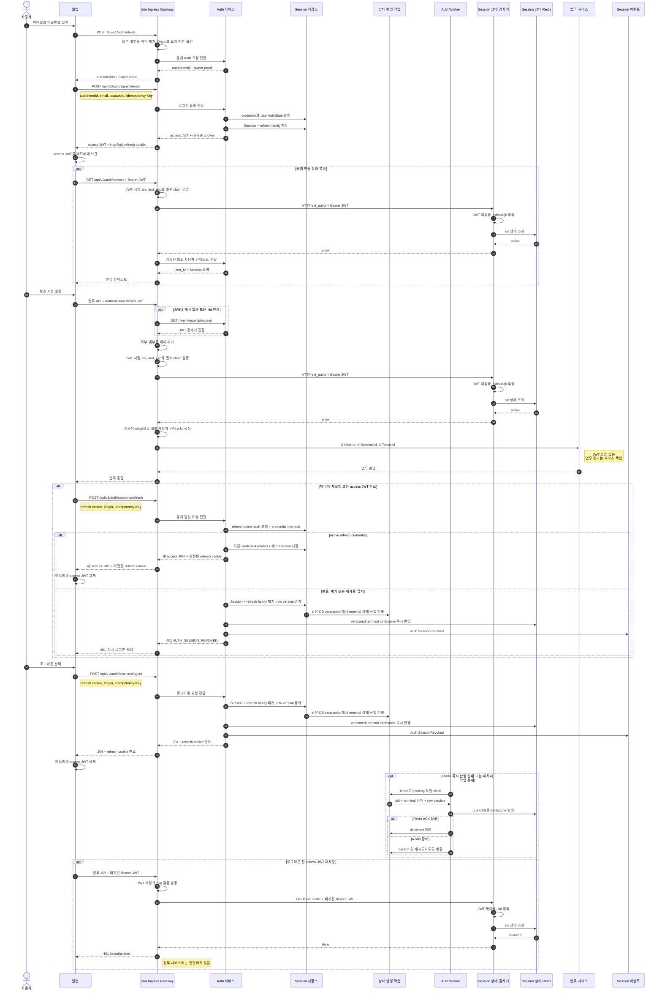

# 웹 JWT 인증과 Session 회전 시퀀스

## 기본 정보

- Scenario ID: `SCN.A.300-05`
- 시작 지점: 웹앱이 이메일 로그인을 시작하거나 메모리의 access JWT 없이 다시 열린다.
- 성공 기준: Auth가 access JWT와 회전형 opaque refresh token을 발급하고, Istio Ingress가 보호 요청의 JWT와 Session 상태를 검증한 뒤 업무 서비스에 최소 사용자 컨텍스트를 전달한다.
- 실패 기준: 로그인 실패, JWT 서명·발급자·대상·만료 검증 실패, Session 폐기, refresh token 만료·재사용 탐지.
- 관련 UC: `UC.A.300-05 로그인`, `UC.A.300-06 이메일 로그인`, `UC.A.300-09 로그인 상태 유지`, `UC.A.300-10 로그아웃`.

## 결정

1. 웹앱은 여러 업무 서비스의 공개 API를 직접 호출하되 모든 외부 요청은 Istio Ingress Gateway를 통과한다.
2. 웹 보호 API의 credential은 `Authorization: Bearer <access-jwt>`다.
3. access JWT는 웹앱 메모리에만 보관한다. refresh token은 `__Secure-dm_refresh; Path=/api/v1/auth/sessions; HttpOnly; Secure; SameSite=Strict` cookie로만 전달하고 JavaScript에 노출하지 않는다. `Domain`은 지정하지 않는다.
4. Auth는 Session, refresh family와 폐기 상태를 소유한다. access JWT는 짧은 수명의 발급 결과이며 원문을 영속 저장하지 않는다.
5. Istio Ingress는 JWT와 Session 유효성을 검증하는 인증 경계다. 각 업무 서비스는 JWT를 직접 검증하거나 JWKS를 조회하지 않는다.
6. Istio Ingress는 외부 `X-User-*`, `X-Session-*`, `X-Token-*` 헤더를 제거하고 검증된 claim으로 최소 내부 사용자 컨텍스트를 다시 만든다.
7. 이 시퀀스는 인증만 정의한다. 업무 인가, 구매 가능 여부와 리소스 소유권 판단은 각 업무 Context가 맡는다.

## 연관 문서

- [REQ.A.05 인증 및 회원 요구사항](../../../00-requirements/REQ_A_05_auth_member.md)
- [UC.A.300 인증 및 회원 사용자 목표](../../../30-uc/UC_A_300_auth_member.md)
- [SD.A.300 인증 서비스 상세 설계](../README.md)
- [SD.A.300.JWT JWT/JWKS/Istio 인증 처리 기준](../jwt-jwks-istio.md)
- [SD.A.30030 인증 서비스 설계](../A_300_30-service/README.md)
- [SD.A.30040 인증 API 공통 설계](../A_300_40-api/README.md)
- [API.A.300-01 AuthenticationIntent 생성](../A_300_40-api/API_A_300_01_create_authentication_intent.md)
- [API.A.300-07 이메일 로그인](../A_300_40-api/API_A_300_07_sign_in_with_email.md)
- [API.A.300-14 Session 갱신](../A_300_40-api/API_A_300_14_refresh_session.md)
- [API.A.300-15 로그아웃](../A_300_40-api/API_A_300_15_logout_session.md)
- [API.A.300-16 현재 인증 컨텍스트 조회](../A_300_40-api/API_A_300_16_get_auth_context.md)

## 필요한 브라우저 API

| 구분 | Method / Path | Credential | 책임 |
| --- | --- | --- | --- |
| 로그인 준비 | `POST /api/v1/auth/intents` | Origin, `Idempotency-Key` | 안전한 복귀 위치와 로그인 전 소유 proof를 만든다. |
| 이메일 로그인 | `POST /api/v1/auth/signins/email` | auth intent proof | Session과 refresh family를 만들고 access JWT와 웹 refresh cookie를 발급한다. |
| 인증 상태 조회 | `GET /api/v1/auth/context` | Bearer access JWT | 현재 Principal과 안전한 Session 요약을 반환한다. |
| Session 갱신 | `POST /api/v1/auth/sessions/refresh` | 웹 refresh cookie, Origin, `Idempotency-Key` | access JWT와 refresh token을 함께 회전한다. |
| 로그아웃 | `POST /api/v1/auth/sessions/logout` | 웹 refresh cookie, Origin, `Idempotency-Key` | 현재 Session과 refresh family를 폐기하고 cookie를 만료시킨다. |

JWKS, HTTP `ext_authz`, `Auth.SessionRevoked`와 내부 인증 헤더는 브라우저 API가 아니며 [SD.A.300.JWT](../jwt-jwks-istio.md)에서 관리한다.

## 전체 처리 시퀀스

## 공통 인증 기준

JWT claim, JWKS, Istio 검증 순서, Session 상태 확인과 내부 인증 헤더는 [SD.A.300.JWT](../jwt-jwks-istio.md)을 따른다. 이 문서는 로그인, 보호 API 호출, refresh와 로그아웃의 참여 순서만 정의한다.

## refresh와 폐기 규칙

1. refresh 성공 시 이전 refresh credential을 `rotated`로 바꾸고 새 access JWT와 새 refresh token을 함께 발급한다.
2. 같은 refresh token과 같은 `Idempotency-Key`의 응답 유실 재시도만 짧은 복구 TTL 동안 같은 결과를 복구한다.
3. 같은 이전 refresh token을 다른 key로 제출하면 재사용으로 판단해 Session과 refresh family를 폐기한다.
4. 로그아웃, 비밀번호 재설정, 사용자 제한과 운영자 강제 폐기는 `Auth.SessionRevoked`를 발행한다.
5. Session terminal 전이와 versioned 상태 반영 작업은 PostgreSQL의 같은 transaction에서 저장한다. Redis가 실패해도 worker가 작업을 잃지 않고 복구될 때까지 재시도한다.
6. Redis의 active 값은 짧게 유지하고, 폐기 상태는 더 긴 tombstone으로 기록한다. Lua CAS는 낮은 version이나 늦게 도착한 active 값이 새 terminal 상태를 덮지 못하게 한다.
7. Redis miss는 PostgreSQL 원본을 확인해 다시 채우며 Redis·PostgreSQL·write-through 중 필요한 의존성이 실패하면 보호 요청을 인증 성공으로 간주하지 않는다.

## 오류 처리

| 조건 | 종료 주체 | 결과 |
| --- | --- | --- |
| JWT, JWKS 또는 Session 상태 검사 실패 | Istio | [실패 처리](../jwt-jwks-istio.md#실패-처리)에 따라 종료 |
| 로그인 credential 오류 | Auth | `401 AUTH_SIGNIN_FAILED` |
| refresh token 만료·재사용 | Auth | Session 폐기 후 `401 AUTH_SESSION_REVOKED` |
| 유효한 Principal의 업무 인가 실패 | 업무 서비스 | 이 인증 시퀀스 범위 밖의 `403` |

## API 반영

`API.A.300-07`, `API.A.300-14~16`과 OpenAPI는 이 시퀀스의 웹 JWT·refresh cookie 처리 방식을 따른다. 웹 보호 API는 Bearer access JWT를 사용하고, refresh와 logout만 HttpOnly refresh cookie·Origin·CSRF 검사를 사용한다. 회원가입 완료, 휴대폰 로그인, 재인증과 휴대폰 교체처럼 Session credential을 발급하거나 회전하는 API도 같은 채널별 전달 규칙을 사용한다.

## 검증 항목

- 공개 Auth 경로는 access JWT 없이 Auth까지 도달하고 보호 업무 경로는 JWT 없이 도달하지 않는다.
- 로그아웃과 refresh token 재사용 뒤 이전 access JWT가 업무 서비스에 도달하지 않는다.
- refresh 동시 요청 중 하나만 회전에 성공하고 같은 key 재시도만 최초 결과를 복구한다.
- 브라우저가 `__Secure-dm_refresh`를 저장하고 refresh·logout 경로에만 전송하며 `__Host-dm_auth`는 `Path=/` 조건을 유지한다.
- JWT, refresh cookie, 비밀번호와 내부 개인정보가 로그·trace·metric label에 남지 않는다.
