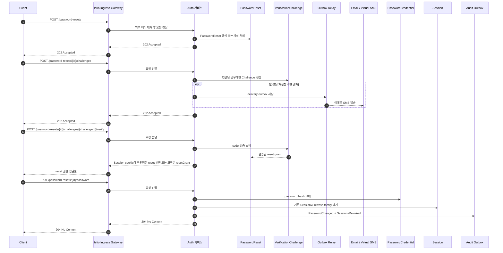

# 비밀번호 재설정 시퀀스

## 기본 정보

- Scenario ID: `SCN.A.310-01`
- 시작 지점: `PAGE.A.310` 비밀번호 재설정.
- 트리거: 비회원이 이메일 또는 휴대폰 번호로 비밀번호 재설정을 시작한다.
- 성공 기준: 선택한 수단의 소유를 확인하고 새 PasswordCredential을 저장한 뒤 기존 Session과 refresh family를 폐기한다.
- 실패 기준: Challenge 실패·만료, reset grant 오류·만료 또는 새 비밀번호 정책 미충족.

## 연관 문서

- [REQ.A.05](../../../00-requirements/REQ_A_05_auth_member.md)
- [UC.A.300](../../../30-uc/UC_A_300_auth_member.md)
- [PAGE.A.310](../../../10-sitemap/PAGE_A_310_password_find/PAGE_A_310_password_find.md)
- [UI.A.310](../../../20-ui/UI_A_310_password_find/UI_A_310_password_find.md)
- [서비스 설계](../A_300_30-service/README.md)
- [API 공통 설계](../A_300_40-api/README.md)
- [API.A.300-10 비밀번호 재설정 시작](../A_300_40-api/API_A_300_10_start_password_reset.md)
- [API.A.300-11 비밀번호 재설정 Challenge 발급](../A_300_40-api/API_A_300_11_issue_password_reset_challenge.md)
- [API.A.300-12 비밀번호 재설정 Challenge 검증](../A_300_40-api/API_A_300_12_verify_password_reset_challenge.md)
- [API.A.300-13 비밀번호 변경](../A_300_40-api/API_A_300_13_change_password.md)

## 처리 과정

## 단계 설명

| 단계 | 책임 주체 | 핵심 규칙 | 관련 API |
| --- | --- | --- | --- |
| 외부 요청 경계 | Ingress | TLS 종료, 라우팅, 요청 빈도 제한, 외부에서 들어온 내부용 헤더 제거 | 공통 |
| 재설정 시작 | Auth | 계정 존재 여부와 관계없이 같은 `202` 응답을 사용한다. | `API.A.300-10` |
| Challenge 발급 | Auth | 실제 연결 수단이 있을 때만 메시지를 발송한다. | `API.A.300-11` |
| 소유 확인 | Auth | 웹은 Session cookie에 바인딩한 reset 권한, 모바일은 1회용 reset grant를 발급한다. | `API.A.300-12` |
| 비밀번호 변경 | Auth | credential 교체와 기존 Session 전체 폐기를 함께 처리한다. | `API.A.300-13` |

## 데이터 이동

- 입력: 계정 식별자, 인증 수단, Challenge code, 새 비밀번호, Idempotency-Key.
- 출력: PasswordReset 상태, Challenge metadata, 채널별 reset 권한, `204 No Content`.
- 저장: PasswordReset, VerificationChallenge, 새 PasswordCredential hash, IdempotencyRecord, 감사 OutboxEvent.
- 폐기: reset grant, `__Host-dm_auth`, 모바일 authFlowToken, 기존 Session, 웹 `__Secure-dm_refresh`, 모바일 refresh family, 연결된 AuthenticationIntent.

## 불변 조건

- 재설정 시작과 Challenge 발급 응답으로 계정 또는 연결 수단 존재 여부를 노출하지 않는다.
- 비밀번호와 code 원문을 로그, trace, metric label, IdempotencyRecord에 저장하지 않는다.
- reset grant는 PasswordReset, 채널, 목적과 만료 시각에 묶고 한 번만 소비한다.
- MVP는 비밀번호 변경 후 자동 로그인하지 않는다.
- Ingress는 계정 존재 여부를 판단하거나 reset grant를 검증하지 않는다.

## 예외 처리

- 계정이 없거나 선택 수단이 연결되지 않았으면 발송하지 않되 공개 응답은 동일하게 유지한다.
- Challenge 실패·만료는 `AUTH_CHALLENGE_FAILED` 또는 `AUTH_CHALLENGE_EXPIRED`로 처리한다.
- reset grant가 만료·소비되었거나 binding이 다르면 `AUTH_PASSWORD_RESET_INVALID`를 반환한다.
- 새 비밀번호가 정책을 만족하지 않으면 credential과 Session을 변경하지 않고 `AUTH_PASSWORD_POLICY_NOT_MET`을 반환한다.

## 검증 항목

- 존재하는 계정과 존재하지 않는 계정의 시작 응답 형식과 HTTP 상태 코드가 같다.
- 비밀번호 변경 트랜잭션 실패 시 기존 credential과 Session이 유지된다.
- 성공 후 기존 모든 Session과 웹·모바일 refresh family가 사용할 수 없는 상태가 된다.
- 성공 후 웹 사전 인증 cookie와 모바일 authFlowToken을 다시 사용할 수 없다.
