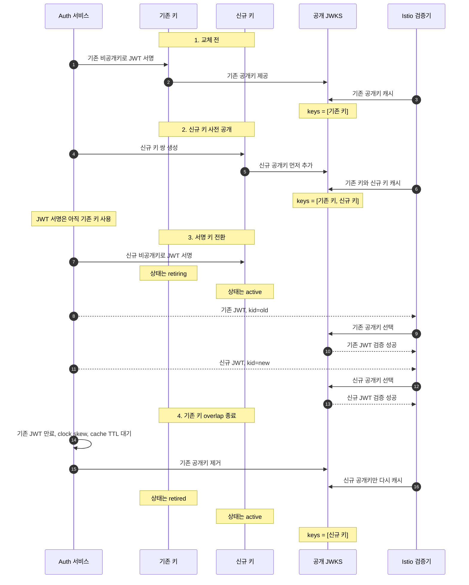
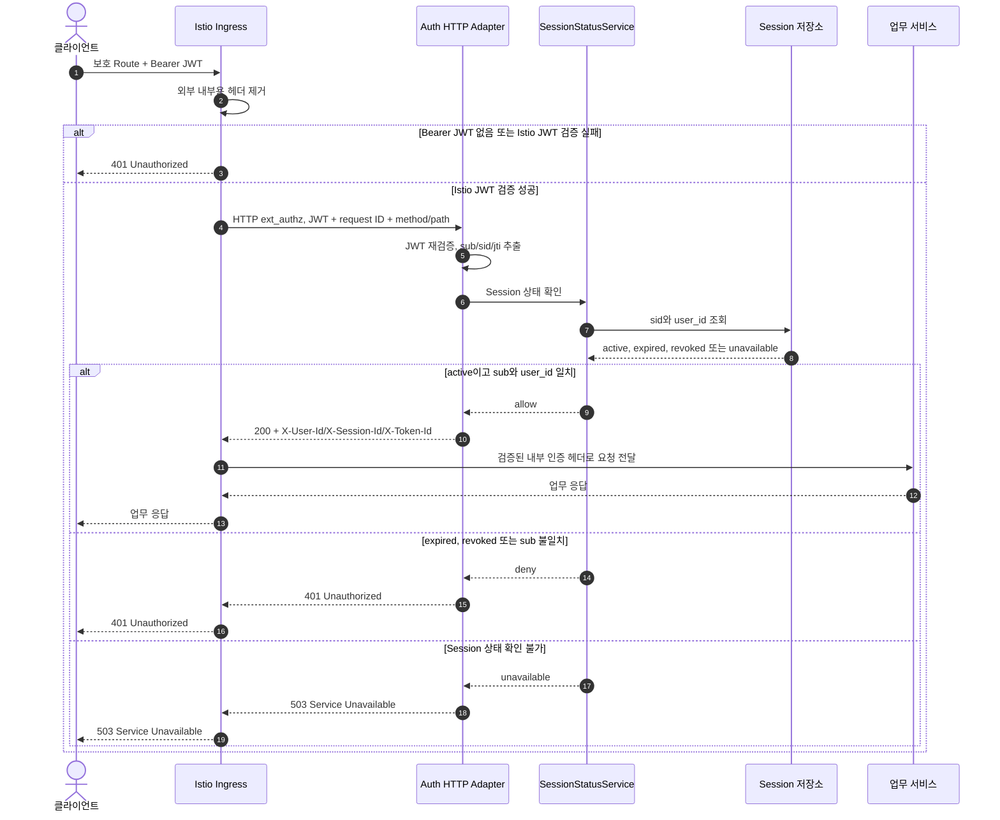

# JWT/JWKS/Istio 인증 처리 기준

## 목적

웹·모바일 클라이언트가 사용하는 access JWT의 형식, Auth의 JWKS 제공 방식, Istio Ingress의 검증 순서와 업무 서비스에 전달할 최소 인증 정보를 정의한다.

이 문서가 JWT claim, JWKS, signing key rotation, Istio의 JWT 검증, Session 상태 확인과 내부 인증 헤더의 기준 문서다. 로그인, refresh와 로그아웃 API의 요청과 응답은 API 설계가, Session과 signing key metadata의 저장 구조는 영속성 설계가 맡는다.

## 적용 범위

### 포함

- access JWT header와 claim allowlist.
- JWT issuer, audience, TTL과 서명 알고리즘.
- JWKS endpoint와 signing key rotation.
- Istio Ingress의 외부 헤더 제거, JWT 검증과 Session 상태 확인.
- Istio가 업무 서비스에 만드는 내부 인증 헤더.
- JWT, JWKS와 Session 검사 실패 시 fail-closed 처리.

### 제외

- 이메일과 비밀번호, OTP와 외부 Provider의 로그인 방식.
- refresh token 전달, rotation, 재사용 탐지와 cookie 설정 상세.
- 업무 인가, 리소스 소유권과 구매 가능 여부 판단.
- 서비스 간 workload identity와 service account 발급 정책.

## 책임

| 참여자 | 책임 | 하지 않는 일 |
| --- | --- | --- |
| Auth | access JWT 서명, JWKS 제공, Session 생명주기와 폐기 상태 관리 | 업무 인가 판단, 개인정보나 업무 속성 claim 발급 |
| Istio Ingress | 외부 내부용 헤더 제거, JWT 검증, Session 상태 확인, 최소 내부 인증 헤더 생성 | 로그인 credential 검증, 업무 인가 판단 |
| HTTP ext_authz Adapter | Bearer access JWT 재검증, `sub`, `sid`, `jti` 추출과 SessionStatusService 호출 | 로그인 credential 검증, 업무 인가 판단 |
| SessionStatusService | HTTP Adapter가 전달한 `sub`, `sid`, `jti`로 Session active/expired/revoked 판정 | HTTP 처리, JWT 서명 검증, 업무 인가 판단 |
| 업무 서비스 | Istio가 만든 인증 Principal을 업무 처리 입력으로 사용 | JWT parsing, JWKS 조회, Session 폐기 상태 확인 |

## Access JWT 형식

### Protected header

| 항목 | 값 | 규칙 |
| --- | --- | --- |
| `alg` | `RS256` | 초기 허용 알고리즘이다. `none`과 요청별 algorithm 선택을 허용하지 않는다. |
| `kid` | signing key ID | JWKS의 공개키 하나와 정확히 연결되어야 한다. |
| `typ` | `JWT` | access JWT임을 나타낸다. |

### Claim allowlist

| Claim | 형식 | 의미 | 검증 규칙 |
| --- | --- | --- | --- |
| `iss` | string | 환경별 Auth issuer | `AUTH_JWT_ISSUER` 환경변수에서 읽으며 Istio 설정의 단일 허용값과 같아야 한다. 운영 환경에는 기본값을 두지 않는다. |
| `sub` | UUID string | Context 사용자가 발급한 `user_id` | 비어 있지 않아야 하며 Session의 `user_id`와 같아야 한다. |
| `sid` | UUID string | Auth Session ID | active Session을 가리켜야 한다. |
| `aud` | string 또는 string array | 보호 API audience | 초기에는 모든 보호 API가 `dropmong-api`를 사용한다. 서비스별 분리는 실제 격리 요구가 생길 때 적용한다. |
| `iat` | NumericDate | 발급 시각 | 허용 clock skew를 넘는 미래 시각을 거부한다. |
| `exp` | NumericDate | 만료 시각 | 현재 시각보다 이후이고 `iat`보다 커야 한다. |
| `jti` | UUID string | access JWT 고유 ID | 비어 있지 않아야 하며 내부 `X-Token-Id`의 원천이다. |

claim allowlist 밖의 값은 발급하지 않는다. 특히 이메일, 휴대폰 번호, `identity_id`, 이름, 프로필, 업무 ACL과 인가 속성을 포함하지 않는다. access JWT 원문은 DB, 로그, trace, metric label과 감사 event에 저장하지 않는다.

기본 access TTL은 15분이며 실제 값은 versioned `TokenTtlPolicy`에서 읽는다. 이미 발급한 JWT의 `exp`를 소급 변경하지 않는다. 긴급 무효화는 `sid`가 가리키는 Session을 폐기해 적용한다.

## JWKS 제공 방식

### Endpoint

| 항목 | 기준 |
| --- | --- |
| Method / Path | `GET /.well-known/jwks.json` |
| 호출 주체 | Istio의 JWT 검증 구성요소. 외부 브라우저용 업무 API가 아니다. |
| 인증 | 별도 사용자 credential 없음. 네트워크 정책으로 허용된 Ingress와 mesh 구성요소만 접근한다. |
| 성공 응답 | `200 application/json`의 JWK Set |
| 캐시 | `Cache-Control`과 `ETag`를 제공하고 설정된 JWKS cache TTL 안에서 재사용한다. |
| 실패 | 마지막으로 검증된 cache가 유효하지 않으면 보호 Route를 fail closed로 거부한다. |

응답의 `keys`에는 현재 JWT 서명에 사용하는 신규 키와 아직 유효한 기존 JWT를 검증하는 데 필요한 기존 키를 함께 제공할 수 있다. rotation overlap 중 응답은 다음과 같다.

```json
{
  "keys": [
    {
      "kty": "RSA",
      "use": "sig",
      "alg": "RS256",
      "kid": "auth-rsa-2026-06",
      "n": "<previous-modulus>",
      "e": "AQAB"
    },
    {
      "kty": "RSA",
      "use": "sig",
      "alg": "RS256",
      "kid": "auth-rsa-2026-07",
      "n": "<new-modulus>",
      "e": "AQAB"
    }
  ]
}
```

검증자는 키가 기존 키인지 신규 키인지 판정하지 않는다. JWT header의 `kid`와 같은 JWK를 찾아 서명을 검증한다. JWKS에 키가 남아 있다는 것은 해당 `kid`로 서명된 JWT를 검증할 수 있다는 뜻이다.

`apiVersion`, `active`, `retiring`, `retired`, 생성 시각과 교체 시각은 공개 JWKS에 추가하지 않는다. private key, KMS/Secret Manager reference, 내부 key 상태와 운영 메모도 응답하지 않는다. 서명에 사용할 현재 키와 제거 시점을 결정하는 상태는 Auth 내부 signing key metadata에서만 관리한다.

### Signing key rotation

Signing key rotation은 JWT 서명에 사용하는 키를 새 키로 교체하면서도 아직 만료되지 않은 기존 JWT를 계속 검증할 수 있도록 공개키 제공 기간을 겹쳐 운영하는 절차다.

1. 새 key pair와 고유 `kid`를 만들고 private key를 Secret Manager/KMS에 저장한다.
2. 새 public JWK를 JWKS에 먼저 노출한다.
3. JWKS cache 전파 시간을 확보한 뒤 새 key를 `active`로 바꾸고 신규 JWT 서명을 시작한다.
4. 이전 key를 `retiring`으로 바꾸되 public JWK는 계속 제공한다.
5. 이전 key로 마지막에 서명한 JWT의 `exp`, 허용 clock skew와 최대 JWKS cache TTL을 모두 지난 뒤 이전 key를 `retired`로 바꾸고 JWKS에서 제거한다.

active signing key는 하나만 둔다. 동일한 `kid`에 다른 key material을 다시 할당하지 않는다. private key 유출 시에는 긴급 rotation으로 새 key를 활성화하고 유출된 key를 JWKS에서 제거한다. 영향을 받은 JWT와 Session의 폐기 범위는 사고 대응 정책에 따라 결정한다.

| 단계 | 공개 JWKS | 신규 JWT 서명 키 |
| --- | --- | --- |
| 교체 전 | 기존 키 | 기존 키 |
| 신규 키 사전 공개 | 기존 키 + 신규 키 | 기존 키 |
| 서명 키 전환 | 기존 키 + 신규 키 | 신규 키 |
| overlap 종료 | 신규 키 | 신규 키 |



Istio가 JWT의 `kid`를 현재 JWKS cache에서 찾지 못하면 JWKS를 한 번 갱신한 뒤 다시 찾는다. 갱신한 JWKS에도 같은 `kid`가 없으면 해당 JWT를 거부하며, 요청마다 제한 없이 JWKS를 다시 조회하지 않는다.

## Istio 인증 처리

### Route 분류

| Route 종류 | JWT 검증 | Session 상태 검사 | Auth가 검증하는 credential |
| --- | --- | --- | --- |
| 가입·로그인·비밀번호 재설정 같은 공개 Auth Route | 적용하지 않음 | 적용하지 않음 | auth-flow cookie/token, challenge proof |
| 업무 보호 Route와 `GET /api/v1/auth/context` | 필수 | 필수 | 없음. Istio가 만든 최소 내부 헤더만 신뢰 |
| `POST /api/v1/auth/sessions/refresh`, `logout` | 적용하지 않음 | 적용하지 않음 | 웹 refresh cookie 또는 모바일 refresh header |
| 운영자 Auth Route | 필수 | 필수 | 별도 인가 경계의 `X-Authorization-Decision` proof |
| `GET /.well-known/jwks.json` | 적용하지 않음 | 적용하지 않음 | mesh network policy와 workload identity |

Route 분류는 prefix만으로 추측하지 않고 배포 manifest의 명시적 allowlist로 관리한다. 새 보호 Route가 JWT 또는 Session 상태 검사 없이 등록되면 배포 검증을 실패시킨다.

### 보호 Route 처리 순서

1. Ingress는 외부 요청의 `X-User-*`, `X-Session-*`, `X-Token-*` 헤더를 모두 제거한다.
2. Bearer JWT가 없으면 보호 Route 요청을 `401`로 끝낸다.
3. `RequestAuthentication`이 `alg`, `kid`, `typ`, signature, `iss`, `aud`, `iat`, `exp`와 필수 claim을 검증한다.
4. Istio의 HTTP `ext_authz`가 원래 요청의 method/path, Bearer JWT와 request ID만 auth-service의 내부 HTTP 경로로 전달한다.
5. HTTP Adapter가 access JWT를 같은 기준으로 다시 검증하고 `sub`, `sid`, `jti`를 추출해 SessionStatusService를 호출한다.
6. Session이 active이고 `sub`와 Session의 `user_id`가 같을 때만 요청을 허용한다.
7. Istio가 허용 응답의 최소 내부 인증 헤더만 원래 요청에 덮어쓰고 mTLS mesh를 통해 업무 서비스에 전달한다.



각 업무 서비스는 JWT를 다시 검증하거나 JWKS나 Auth Session 저장소를 직접 조회하지 않는다. 업무 서비스의 직접 외부 접근을 막고 Istio에서 서비스까지 mTLS와 workload identity를 강제해야 이 신뢰 기준이 성립한다.

### HTTP 외부 인증 확인 (Envoy ext_authz)

`ext_authz`는 Envoy의 `external authorization` 필터 이름이다. Envoy가 원래 요청을 업무 서비스로 전달하기 전에 외부 HTTP 서비스에 요청 허용 여부를 묻는 표준 확장 지점이다. 여기서는 업무 권한을 판단하지 않고 JWT와 Session 상태가 유효한지만 확인한다.

Istio와 auth-service 사이에 전달할 HTTP 경로, 입력 헤더, 성공·거부·장애 상태 코드, 출력 헤더와 timeout은 다음과 같다.

초기 배포에서 `SessionStatusService`는 별도 마이크로서비스가 아니라 auth-service의 논리 모듈이다. auth-service의 기존 HTTP 서버가 Istio HTTP `ext_authz` 요청을 처리한다. 내부 경로는 외부 Gateway Route에 등록하지 않으며 지정된 Ingress workload identity만 호출할 수 있다.

초기 전송 방식은 HTTP로 고정하고 auth-service의 기존 HTTP 서버와 배포 포트를 재사용한다.

| 항목 | 기준 |
| --- | --- |
| Protocol | Istio `envoyExtAuthzHttp`가 사용하는 Envoy HTTP ext_authz |
| 호출 주체 | Istio Ingress Gateway의 지정된 workload identity |
| HTTP 경로 | `pathPrefix=/internal/ext-authz`. 원래 요청의 method/path가 prefix 뒤에 붙으며 전용 Handler가 모든 보호 Route를 처리 |
| 입력 | `Authorization: Bearer <access JWT>`, `X-Request-Id`, 원래 요청의 method/path. request body는 전달하지 않음 |
| 금지 입력 | 외부 `X-User-*`, `X-Session-*`, `X-Token-*`, 이메일, 휴대폰, role, permission, membership, 업무 ACL |
| JWT 처리 | HTTP Adapter가 signature, `kid`, `iss`, `aud`, `iat`, `exp`와 필수 claim을 다시 검증한 뒤 `sub`, `sid`, `jti`만 SessionStatusService에 전달 |
| 성공 | HTTP `200`과 `X-User-Id`, `X-Session-Id`, `X-Token-Id` |
| 인증 거부 | JWT 오류, Session expired/revoked 또는 `sub` 불일치 시 HTTP `401` |
| 의존성 장애 | 상태를 확정할 수 없으면 HTTP `503` |
| timeout | 초기 200ms. 요청 경로에서 자동 재시도하지 않고 fail closed |

Istio는 Bearer JWT를 내부 HTTP 요청에 전달하고 auth-service의 HTTP Adapter는 JWT를 독립적으로 다시 검증한다. token 원문은 메모리에서 검증한 뒤 버리고 로그, trace, metric label, 감사 event와 저장소에 남기지 않는다. SessionStatusService는 `sid`로 조회한 Session의 `user_id`가 `sub`와 같은지 확인하고 `jti`는 감사·추적용 token ID로만 사용한다.

HTTP Adapter 응답의 내부 헤더는 Istio `headersToUpstreamOnAllow` allowlist로 원래 요청에 덮어쓴다. 업무 서비스로 전달되는 값은 아래 allowlist를 넘을 수 없고, 응답의 임의 header 추가는 배포 정책에서 거부한다.

### 내부 인증 헤더 allowlist

| Header | 원천 | 의미 |
| --- | --- | --- |
| `X-User-Id` | `jwt.sub` | 인증된 사용자 ID |
| `X-Session-Id` | `jwt.sid` | 인증에 사용한 Session ID |
| `X-Token-Id` | `jwt.jti` | 요청에 사용한 access JWT ID |

그 밖의 사용자, Identity와 업무 속성 헤더를 만들지 않는다. 외부에서 전달된 같은 이름의 헤더를 보존하거나 병합하지 않는다.

## Session 상태 확인

### Check 입력과 결과

| 구분 | 필드 | 규칙 |
| --- | --- | --- |
| 입력 | `sub`, `sid`, `jti` | Istio가 서명과 표준 claim을 검증한 값만 받는다. token 원문은 전달하지 않는다. |
| 허용 | `active` | Session active, idle/absolute TTL 유효, `sub` 일치, UserAuthState active |
| 거부 | `expired` | Session idle 또는 absolute TTL 만료 |
| 거부 | `revoked` | 로그아웃, 비밀번호 재설정, refresh 재사용, 사용자 제한 또는 운영 폐기 |
| 장애 | `unavailable` | cache와 PostgreSQL에서 상태를 확정할 수 없음 |

Session 상태 확인은 공유 Redis cache를 필수 경로로 사용한다. Redis에는 `user_id`, `session_id`, status, idle/absolute 만료 시각, status version과 `revoked_until`만 저장한다. cache miss는 PostgreSQL에서 확인하고 결과를 정책 TTL 안에서 Redis에 반영한다. 상태를 확정할 수 없으면 active로 간주하지 않는다.

Session을 폐기하는 transaction은 `Auth.SessionRevoked`와 cache 갱신 outbox를 함께 저장한다. 폐기 상태는 해당 Session에서 발급한 access JWT가 모두 만료될 때까지 유지한다.

### 상태 cache와 폐기 반영

- PostgreSQL의 Session 상태가 원장이고 Redis는 모든 auth-service instance와 Istio 인증 요청이 공유하는 필수 Session 상태 projection이다.
- cache key는 `auth:session-status:{sid}`, 값은 `user_id`, `session_id`, status, idle/absolute expiry, status version과 `revoked_until`이다. token 원문과 개인정보는 저장하지 않는다.
- 로그아웃, refresh 재사용, 비밀번호 재설정과 사용자 제한은 DB commit 뒤 shared cache에 revoked 상태를 write-through한 후 성공 응답을 반환한다.
- DB commit 뒤 cache 갱신이 실패하면 상태 변경을 되돌리지 않고 외부에는 `503`을 반환한다. 같은 멱등 key 재시도는 이미 폐기된 상태를 cache에 다시 반영한 뒤 완료한다.
- `Auth.SessionRevoked` consumer는 누락된 Redis 갱신을 반복 보정한다. 실패 시 1초부터 시작해 최대 30초까지 지수 backoff하고, revoked 항목은 해당 Session에서 발급 가능한 최대 access JWT `exp`까지 제거하지 않는다.
- Redis 전체 소실이나 flush 뒤에는 PostgreSQL의 active·revoked Session을 `session_id` 순서로 page scan해 다시 적재한다. 재동기화 중 cache miss는 instance별 최대 32개 동시 조회와 100ms query timeout 안에서만 PostgreSQL로 보완하고, 예산을 넘거나 DB에서도 상태를 확인할 수 없으면 `503`을 반환한다.
- Redis 용량은 active Session 수와 access JWT 만료 전까지 보존할 revoked Session 수를 합한 key 수로 산정한다. 운영 용량의 70%에서 경보를 발생시키고 증설하며 eviction으로 Session 상태를 임의 삭제하지 않는다.

### 배포 검증

- 외부 요청이 auth-service와 업무 서비스 Pod에 Ingress를 우회해 도달하지 못하도록 NetworkPolicy와 AuthorizationPolicy를 적용한다.
- JWKS와 HTTP ext_authz 내부 경로는 허용된 Ingress workload identity만 호출할 수 있다.
- 보호 Route는 `RequestAuthentication`, audience 제한, HTTP ext_authz와 내부 헤더 재생성을 모두 포함해야 한다.
- `envoyExtAuthzHttp`는 `failOpen=false`, `statusOnError=503`, `timeout=200ms`, `includeRequestHeadersInCheck=[authorization,x-request-id]`, `headersToUpstreamOnAllow=[x-user-id,x-session-id,x-token-id]`를 적용하고 request body를 전달하지 않는다.
- refresh/logout Route에는 JWT 요구를 붙이지 않고 Auth까지 cookie/header credential을 그대로 전달하되, 외부 내부용 헤더는 제거한다.
- 배포 전 테스트는 JWT 없음·변조·만료·잘못된 audience, Session 폐기, ext_authz timeout과 외부 헤더 주입을 각각 거부하는지 확인한다.

## 실패 처리

| 조건 | 종료 주체 | 외부 결과 | 업무 서비스 호출 |
| --- | --- | --- | --- |
| Bearer JWT 없음 | Istio | `401` | 하지 않음 |
| signature, issuer, audience, expiry, 필수 header/claim 오류 | Istio 또는 HTTP Adapter | `401` | 하지 않음 |
| Session expired/revoked 또는 `sub` 불일치 | SessionStatusService + Istio | `401` | 하지 않음 |
| JWKS, Redis와 PostgreSQL에서 Session 상태 확인 불가 | Istio | `503` | 하지 않음 |

인증에 성공한 뒤 발생한 업무 인가 실패는 업무 서비스가 `403`으로 반환한다. Istio의 `401`과 업무 서비스의 `403`을 같은 오류로 합치지 않는다.

Ingress와 auth-service의 외부 오류 body는 API 설계의 공통 `ErrorResponse`를 사용한다. JWT 없음·검증 오류·만료와 Session 폐기는 `401`, 인증 상태를 확정할 수 없는 시스템 장애는 `503`이다. body에는 `code`, `status`, `message`, `requestId`만 포함하고 내부 오류 문자열은 노출하지 않는다.

## 설정 항목

| 설정 | 소유 | 초기값/원칙 |
| --- | --- | --- |
| issuer | Auth + Istio | `AUTH_JWT_ISSUER`, 환경별 필수값, 운영 기본값 없음 |
| audience | Auth + Istio | 초기 `dropmong-api`, 서비스별 분리는 필요할 때 적용 |
| algorithm | Auth + Istio | `RS256` |
| access TTL | Auth | 15분, versioned policy |
| clock skew | Auth + Istio | 초기 30초, issuer와 consumer가 동일하게 적용 |
| JWKS cache TTL | Istio | 초기 5분, rotation overlap 계산에 포함 |
| key rotation overlap | Auth | 최소 20분 30초: access TTL 15분 + clock skew 30초 + JWKS cache TTL 5분 |
| HTTP ext_authz path prefix | Istio + Auth | `/internal/ext-authz`, 외부 Gateway Route 등록 금지 |
| Session status cache | SessionStatusService | 공유 Redis 필수, endpoint와 credential은 환경변수로 주입하고 운영 기본값 없음 |
| active Session cache TTL | SessionStatusService | 최대 5분이며 Session idle/absolute 남은 시간보다 길 수 없음 |
| HTTP ext_authz timeout | Istio + HTTP Adapter | 초기 200ms, 자동 재시도 없음 |
| revoked cache retention | Auth + SessionStatusService | 해당 Session의 최대 access JWT exp까지 |

## 검증 기준

- 허용 claim만 포함한 JWT가 Istio와 Session 상태 확인을 통과한다.
- 변조, 만료, 잘못된 issuer/audience, 알 수 없는 `kid`와 금지 algorithm JWT가 업무 서비스에 도달하지 않는다.
- 외부에서 넣은 내부 인증 헤더가 제거되고 검증된 claim 값으로만 다시 만들어진다.
- 로그아웃과 refresh token 재사용 뒤 기존 access JWT가 남은 TTL과 관계없이 차단된다.
- key rotation 중 기존 키와 신규 키가 JWKS에 함께 제공되고 두 `kid`의 JWT가 각각 검증되며, overlap 종료 뒤 기존 키가 제거된다.
- 공개 JWKS에 API version, `active`, `retiring`, `retired`와 private key 정보가 노출되지 않는다.
- JWKS 또는 Session 상태 확인 장애가 인증 성공으로 처리되지 않는다.
- 업무 서비스가 JWT parser, JWKS client와 Session 조회 의존성을 갖지 않는다.

## 연관 문서

- [인증 서비스 상세 설계](README.md)
- [도메인 모델](A_300_10-domain-model/SD_A_30010_auth_domain_model.md)
- [영속성 설계](A_300_20-persistence/README.md)
- [서비스 설계](A_300_30-service/README.md)
- [API 설계](A_300_40-api/README.md)
- [웹 JWT 인증 시퀀스](A_300_50-sequence/SCN_A_300_05_web_jwt_authentication.md)

## 확정 사항

- issuer는 환경변수로 분리하고 운영 환경에는 위험한 기본값을 두지 않는다.
- audience는 초기 `dropmong-api` 하나로 통일하며 실제 격리 요구가 생기면 서비스별로 분리한다.
- Session 상태 확인은 공유 Redis cache를 필수로 사용하고 PostgreSQL을 최종 원장과 제한된 cache miss fallback으로 사용한다.
- JWT 없음·오류·만료와 Session 폐기는 `401`, 상태 확인 시스템 장애는 `503`으로 반환한다.
- 외부 오류 body는 `code`, `status`, `message`, `requestId`만 가진 공통 `ErrorResponse`를 사용한다.
